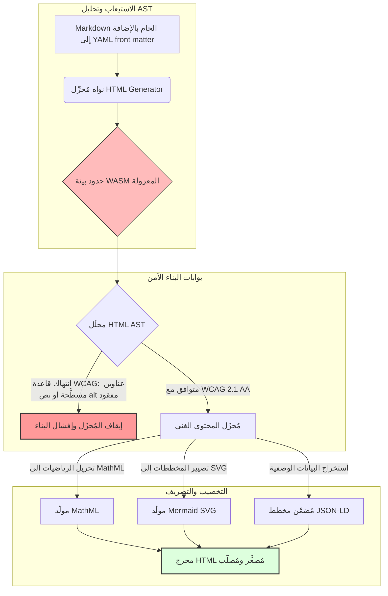

---

# Front Matter (YAML)

author: "contact@sebastienrousseau.com (Sebastien Rousseau)"
banner_alt: "هندسة معمارية هندسية تحت إضاءة منظّمة — ترمز إلى دور HTML Generator بوصفه خط أنابيب مُحكَم التحويل من Markdown إلى HTML لبنية تحتية نشر آمنة وخاضعة للامتثال"
banner_height: "1597"
banner_width: "2584"
banner: "https://cloudcdn.pro/stocks/images/markus-winkler-IrRbSND5EUc-unsplash-1200.webp"
cdn: "https://cloudcdn.pro"
charset: "UTF-8"
cname: "sebastienrousseau.com"
copyright: "© Copyright 2025 - 2026 - Sebastien Rousseau. All rights reserved."
date: "June 20, 2026"
description: "HTML Generator مكتبة Rust تحوّل Markdown إلى HTML متوافق مع WCAG ومُحسَّن لمحركات البحث ومُخصَّب بـ JSON-LD — إمكانية وصول مُضمَّنة في الكود، ودعم MathML وMermaid، وتنفيذ معزول داخل بيئة WebAssembly للنشر المؤسسي الآمن."
format-detection: "telephone=no"
hreflang: "ar"
icon: "https://cloudcdn.pro/clients/sebastienrousseau/v1/logos/sebastienrousseau.svg"
id: "https://sebastienrousseau.com/2026-06-20-html-generator-accessible-seo-structured-markdown-rust-2026"
image_alt: "صورة بالأبيض والأسود لسيباستيان روسو"
image_height: "162"
image_width: "162"
image: "https://cloudcdn.pro/stocks/images/sebastien-rousseau.png"
keywords: "html-generator، Rust تحويل Markdown إلى HTML، إمكانية الوصول في الكود، WCAG 2.1 AA، HTML محسَّن لمحركات البحث، JSON-LD، MathML، Mermaid، WebAssembly، EAA، DORA، ADA Title III، النشر الشامل، التحليل في بيئة معزولة، مفتوح المصدر"
language: "ar-SA"
last_reviewed: "2026-06-20"
layout: "report"
locale: "ar_SA"
logo_alt: "شعار سيباستيان روسو"
logo_height: "44"
logo_width: "44"
logo: "https://cloudcdn.pro/clients/sebastienrousseau/v1/logos/sebastienrousseau.svg"
menu: ""
measurementID: "G-169G4ET5HQ"
name: "Sebastien Rousseau"
permalink: "https://sebastienrousseau.com/2026-06-20-html-generator-accessible-seo-structured-markdown-rust-2026"
rating: "general"
referrer: "no-referrer"
robots: "index, follow"
schema: "FAQPage, Article"
seo_title: "إمكانية الوصول في الكود: تحويل Markdown إلى HTML بمعيار AAA باستخدام Rust"
short_name: "sebastienrousseau"
subtitle: "تحويل النشر الإلكتروني المؤسسي، وتوثيق المنتجات، وبوابات العملاء من ملفات نصية غير شاملة إلى أصول رقمية منظّمة وخاضعة للامتثال ومعزولة أمنياً."
tags: "html-generator، Rust، Markdown، إمكانية الوصول، WCAG، SEO، JSON-LD، MathML، Mermaid، WebAssembly، EAA، DORA، ADA، اكتشاف الذكاء الاصطناعي، RAG، مفتوح المصدر، البنية التحتية المصرفية"
theme-color: "0, 83, 191"
title: "تحويل Markdown إلى HTML شامل ومُحسَّن لمحركات البحث ومنظَّم البنية باستخدام Rust في 2026"
url: "https://sebastienrousseau.com/2026-06-20-html-generator-accessible-seo-structured-markdown-rust-2026"
viewport: "width=device-width, initial-scale=1, shrink-to-fit=no"

# RSS - The RSS feed front matter (YAML).
atom_link: "https://sebastienrousseau.com/2026-06-20-html-generator-accessible-seo-structured-markdown-rust-2026/rss.xml"
category: "Technology"
docs: https://validator.w3.org/feed/docs/rss2.html
generator: "Static Site Generator (SSG) (version 0.0.40)"
item_description: "HTML Generator مكتبة Rust تحوّل Markdown إلى HTML متوافق مع WCAG ومُحسَّن لمحركات البحث ومُخصَّب بـ JSON-LD — إمكانية وصول مُضمَّنة في الكود، ودعم MathML وMermaid، وتنفيذ معزول داخل بيئة WebAssembly للنشر المؤسسي الآمن."
item_guid: "https://sebastienrousseau.com/2026-06-20-html-generator-accessible-seo-structured-markdown-rust-2026/rss.xml"
item_link: "https://sebastienrousseau.com/2026-06-20-html-generator-accessible-seo-structured-markdown-rust-2026/rss.xml"
item_pub_date: "Sat, 20 Jun 2026 06:06:06 +0000"
item_title: "تحويل Markdown إلى HTML شامل ومُحسَّن لمحركات البحث ومنظَّم البنية باستخدام Rust في 2026"
last_build_date: "Sat, 20 Jun 2026 06:06:06 +0000"
managing_editor: "contact@sebastienrousseau.com (Sebastien Rousseau)"
pub_date: "Sat, 20 Jun 2026 06:06:06 +0000"
ttl: "60"
type: "article"
webmaster: "contact@sebastienrousseau.com"

# Apple - The Apple front matter (YAML).
apple_mobile_web_app_orientations: "portrait"
apple_touch_icon_sizes: "192x192"
apple-mobile-web-app-capable: "yes"
apple-mobile-web-app-status-bar-inset: "black"
apple-mobile-web-app-status-bar-style: "black-translucent"
apple-mobile-web-app-title: "Markdown إلى HTML بمعيار AAA باستخدام Rust"
apple-touch-fullscreen: "yes"

# MS Application - The MS Application front matter (YAML).

msapplication-navbutton-color: "0, 83, 191"

# Twitter Card - The Twitter Card front matter (YAML).

twitter_card: "summary_large_image"
twitter_creator: "@wwdseb"
twitter_description: "HTML Generator مكتبة Rust تحوّل Markdown إلى HTML متوافق مع WCAG ومُحسَّن لمحركات البحث ومُخصَّب بـ JSON-LD — إمكانية وصول مُضمَّنة في الكود، ودعم MathML وMermaid، وتنفيذ معزول داخل بيئة WebAssembly للنشر الآمن."
twitter_image: "https://cloudcdn.pro/clients/sebastienrousseau/v1/logos/sebastienrousseau.svg"
twitter_image_alt: "شعار سيباستيان روسو"
twitter_site: "@wwdseb"
twitter_title: "إمكانية الوصول في الكود: تحويل Markdown إلى HTML بمعيار AAA باستخدام Rust"
twitter_url: "https://sebastienrousseau.com/2026-06-20-html-generator-accessible-seo-structured-markdown-rust-2026"

# Humans.txt - The Humans.txt front matter (YAML).
author_website: "https://sebastienrousseau.com"
author_twitter: "@wwdseb"
author_location: "London, UK"
thanks: "شكراً لقراءتك!"
site_last_updated: "2026-06-20"
site_standards: "HTML5, CSS3, RSS, Atom, JSON, XML, YAML, Markdown, TOML"
site_components: "Kaishi, Kaishi Builder, Kaishi CLI, Kaishi Templates, Kaishi Themes"
site_software: "Static Site Generator, Rust"

---

# تحويل Markdown إلى HTML شامل ومُحسَّن لمحركات البحث ومنظَّم البنية باستخدام Rust في 2026

<!-- lead-start -->
<aside class="post-lead" aria-label="ملخص المقال">

<strong>خلاصة.</strong> HTML Generator مكتبة Rust صرفة تُحوِّل Markdown إلى HTML، وتفرض معيار WCAG 2.1 AA عند وقت البناء، وتُضمِّن JSON-LD متوافقاً مع المخططات، وتُصيِّر MathML وSVG الخاص بـ Mermaid أصلياً، وتُعزِل عملية التحليل داخل بيئة WebAssembly — مُحوِّلةً النشرَ إلى مستوى تحكم مُحكَم يضمن إمكانية الوصول والـ SEO وأمن تقنية المعلومات.

<strong>النقاط الرئيسية</strong>

<ul class="post-lead-takeaways">
  <li><strong>الإجابة السريعة.</strong> ما هو HTML Generator في جملة واحدة؟</li>
  <li><strong>الملخص التنفيذي.</strong> تحويل Markdown قد يبدو بسيطاً؛ غير أن إنتاج HTML بجودة النشر المؤسسي مسألة امتثال بالدرجة الأولى.</li>
  <li><strong>01. لماذا يُهمّ مُحرِّل HTML أولوياتي إمكانية الوصول في 2026.</strong> جعل قانون EAA وADA Title III إمكانيةَ الوصول مسؤولية قانونية تقع على عاتق مجالس الإدارة.</li>
  <li><strong>02. عدسة هندسة HTML Generator لعام 2026.</strong> خط أنابيب متعدد المراحل مُحكَم البناء يُحوِّل Markdown الخام إلى مخرجات HTML مُصلَّبة.</li>
</ul>

<strong>قراءات ذات صلة:</strong> <a href="https://sebastienrousseau.com/2026-06-18-noyalib-safe-yaml-rust-ai-mcp-financial-infrastructure-2026">لماذا يحتاج YAML إلى مكدّس Rust أكثر أماناً للذكاء الاصطناعي وMCP والبنية التحتية المالية في 2026</a>، <a href="https://sebastienrousseau.com/2026-06-17-static-site-generator-secure-default-ai-era-publishing-2026">مولِّد مواقع ثابتة آمن بالافتراضي لنشر عصر الذكاء الاصطناعي في 2026</a>، <a href="https://sebastienrousseau.com/2026-06-11-cloudcdn-open-source-blueprint-ai-native-edge-2026">CloudCDN: مخطط مفتوح المصدر للحافة السحابية الأصيلة في 2026</a>.

</aside>
<!-- lead-end -->

في عام 2026، يستهلك المحتوى على الويب زواحف البحث المدعومة بالذكاء الاصطناعي، ومحركات البحث المبنية على النماذج اللغوية الكبيرة (LLM)، وخطوط أنابيب توليد المعزَّز بالاسترجاع (RAG) بقدر لا يقلّ عمّا يستهلكه القرّاء البشر. يُضعف HTML المسطَّح أو المشوَّه إمكانية الاكتشاف الآلي، فيما بات التقصير في الامتثال للوائح العالمية الصارمة كـ[قانون إمكانية الوصول الأوروبي (EAA)](https://www.accessibility-act.eu/) و[ADA Title III الأمريكي](https://www.ada.gov/topics/title-iii/) مسؤولية مدنية لا لبس فيها. [HTML Generator](https://github.com/sebastienrousseau/html-generator) مكتبة Rust عالية الأداء مُصمَّمة لسد هذه الثغرات — على مستوى المُحرِّل، لا من خلال تصحيحات ما بعد النشر.

## الإجابة السريعة

**ما هو HTML Generator في جملة واحدة؟** HTML Generator مُحرِّل مفتوح المصدر خالص Rust يُحوِّل Markdown إلى HTML، يفرض [WCAG 2.1 AA](https://www.w3.org/TR/WCAG21/) عند وقت البناء، ويُولِّد معالم دلالية وخصائص ARIA تلقائياً، ويُضمِّن بيانات وصفية متوافقة مع [JSON-LD](https://json-ld.org/) من front matter بتنسيق YAML، ويُصيِّر مخططات Mermaid والرياضيات إلى SVG وMathML شاملَين، ويعمل داخل بيئة معزولة [WebAssembly](https://webassembly.org/) — مُحوِّلاً النشر المؤسسي إلى مستوى تحكم مُحكَم بمعايير المسؤولية الائتمانية.

## الملخص التنفيذي

تحويل Markdown يبدو بسيطاً. إنتاج HTML بجودة النشر مسألة امتثال. في يونيو 2026، تُحلِّل كل نقطة تواصل مؤسسية — بوابات علاقات المستثمرين، والإيداعات التنظيمية، وتوثيق العملاء، ومراجع واجهات برمجية API، وأصول التسويق — من قِبَل البشر والآلات على حدٍّ سواء. ضغطان يتصادمان على كل صفحة: يجعل [EAA](https://www.accessibility-act.eu/) و[ADA Title III](https://www.ada.gov/topics/title-iii/) إمكانيةَ الوصول تعرُّضاً قانونياً على مستوى مجلس الإدارة، فيما تكافئ خطوط أنابيب استيعاب الذكاء الاصطناعي وRAG المخرجاتِ المنظَّمة وقابلة القراءة آلياً. تُنتج مكتبات Markdown القياسية HTML مسطَّحاً يفشل في كلا البوّابتين. يتعامل HTML Generator مع توليد المستندات بوصفه خطَّ أنابيب مُحكَم البناء: التحقق من صحة WCAG خطأ في البناء، وJSON-LD مستخرَج من front matter بتنسيق YAML دون ختم يدوي، وMathML وMermaid مُصيَّران بشكل شامل، والمحرّك بأكمله يُشحَن كهدف WebAssembly حتى يظل تحليل المستندات غير الموثوقة معزولاً عن المضيف.

## النقاط الرئيسية

- **إمكانية الوصول في الكود هي الخط الأساسي الجديد.** يُلزم EAA بإمكانية الوصول للخدمات الرقمية الاستهلاكية. يُقيِّم HTML Generator شجرة المستند عند وقت التصريف، ويولِّد معالم دلالية وخصائص ARIA تلقائياً — تصحيحات أقل بعد النشر، وميزانيات معالجة أدنى، ولا نصوص بديلة مفقودة تصل إلى الإنتاج.
- **بيانات منظَّمة لاكتشاف الذكاء الاصطناعي.** يعتمد البحث الحديث وRAG على البيانات الوصفية قابلة القراءة آلياً. يُحلِّل المُحرِّل front matter بتنسيق YAML ويُضمِّن [JSON-LD المتوافق مع Schema.org](https://schema.org/) مباشرةً في رأس المستند، مما يجعل المحتوى قابلاً للتفسير الكامل بواسطة [Google Rich Results](https://developers.google.com/search/docs/appearance/structured-data/intro-structured-data) و[Bing Webmaster](https://www.bing.com/webmasters) وزواحف مدعومة بـ LLM.
- **تميُّز المحتوى التقني.** النشر التقني ليس نصاً مسطَّحاً. يُحرِّل HTML Generator امتدادات الرياضيات في Markdown الخام إلى [MathML](https://www.w3.org/Math/) الشامل، ويُصيِّر مخططات [Mermaid.js](https://mermaid.js.org/) إلى SVG متجاوب — كلاهما يحافظ على البنية المتوافقة مع WCAG بدلاً من التراجع إلى صور غير شفافة.
- **العزل في بيئة WebAssembly.** تحليل Markdown غير الموثوق خطر أمني. من خلال استهداف [WASM](https://webassembly.org/)، يعمل HTML Generator داخل بيئة معزولة تمنع تنفيذ الكود الاعتباطي وتحمي نظام المضيف — مُستوفيةً مباشرةً التزامات أمن تقنية المعلومات بموجب [DORA المادة 6](https://eur-lex.europa.eu/legal-content/EN/TXT/?uri=CELEX%3A32022R2554).
- **الحماية الائتمانية لمجالس الإدارة.** انتقل عدم الامتثال التقني إلى قاعة مجلس الإدارة. يُحصِّن التوحيد القياسي على محرّك HTML مُحكَم البناء المديرين وكبار المسؤولين من التعرض المدني والتنظيمي الشخصي بموجب DORA وEAA وADA Title III.

**قراءات ذات صلة:** [لماذا يحتاج YAML إلى مكدّس Rust أكثر أماناً للذكاء الاصطناعي وMCP والبنية التحتية المالية في 2026](https://sebastienrousseau.com/2026-06-18-noyalib-safe-yaml-rust-ai-mcp-financial-infrastructure-2026/)، [مولِّد مواقع ثابتة آمن بالافتراضي لنشر عصر الذكاء الاصطناعي في 2026](https://sebastienrousseau.com/2026-06-17-static-site-generator-secure-default-ai-era-publishing-2026/)، [CloudCDN: مخطط مفتوح المصدر للحافة السحابية الأصيلة في 2026](https://sebastienrousseau.com/2026-06-11-cloudcdn-open-source-blueprint-ai-native-edge-2026/).

## 01. لماذا يُهمّ مُحرِّل HTML أولوياتي إمكانية الوصول في 2026

تُمثِّل المنصات الإلكترونية المؤسسية ومكتبات التوثيق ومراكز مساعدة المنتجات نقاط تواصل رقمية حيوية. وهي تواجه اليوم ضغطَين متشابكَين وشديدَين.

الأول هو **استيعاب الذكاء الاصطناعي وقابلية الاكتشاف**. يتزايد معالجة المحتوى من قِبَل النماذج اللغوية الكبيرة وخطوط أنابيب توليد المعزَّز بالاسترجاع. يُربِك HTML المسطَّح أو المشوَّه تحليل الزواحف، مما يجعل أبحاث الشركات ووثائقها غير مرئية لنماذج البحث الحديثة — بما فيها [Google Search Generative Experience](https://blog.google/products/search/generative-ai-search/) وتصفُّح [ChatGPT](https://chat.openai.com/) ووكلاء RAG المؤسسيين.

الثاني هو **قانون إمكانية الوصول العالمي الصارم**. بموجب [قانون إمكانية الوصول الأوروبي](https://www.accessibility-act.eu/) (الساري بالكامل منذ يونيو 2025) و[ADA Title III الأمريكي](https://www.ada.gov/topics/title-iii/)، يجب أن تضمن منصات النشر المؤسسي إمكانية وصول رقمية كاملة. لم يعد الإخفاق في استيفاء معيار [WCAG 2.1 AA](https://www.w3.org/TR/WCAG21/) إغفالاً هندسياً؛ بل هو مسؤولية مدنية وتنظيمية أفرزت تسويات بالملايين.

يُعالج [HTML Generator](https://github.com/sebastienrousseau/html-generator) كلا الضغطين مباشرةً. إنه مكتبة Rust آمنة للخيوط مُصمَّمة لتحويل Markdown إلى HTML شامل ومُحسَّن لمحركات البحث ومنظَّم البنية. من خلال معاملة توليد المستندات كخط أنابيب مُحكَم البناء، يُحقِّق المحرّك **عائداً على المرونة (RoR)** مرتفعاً — يحمي الميزانيات العمومية من دعاوى إمكانية الوصول مع تعظيم قابلية القراءة الآلية لاكتشاف الذكاء الاصطناعي.

## 02. عدسة هندسة HTML Generator لعام 2026

صُمِّم الإطار كخط أنابيب تصريف آمن متعدد المراحل يُحوِّل نص Markdown الخام إلى أصول ثابتة مُتحقَّق منها تشفيرياً وعالية الشمولية.

### جدول 1: طبقات هندسة HTML Generator وتخفيف المخاطر

| الطبقة | قرار التصميم | السبب | المخاطر عند الإهمال |
| ---- | ---- | ---- | ---- |
| **طبقة الإدخال** | محلِّل Markdown بالإضافة إلى YAML front matter | يلتقي بالكتّاب في بيئتهم؛ يفصل النص عن البيانات الوصفية الهيكلية. | بيانات وصفية غير متسقة، وخرائط مواقع معطوبة، وثغرات في الفهرسة. |
| **طبقة البنية** | جدول محتويات تلقائي ومعالم دلالية بعلامات ARIA | يُنتج أشجار مستندات يمكن التنقل بها وشاملة بالتصميم. | HTML مسطَّح يُعطِّل قارئات الشاشة وينتهك WCAG. |
| **طبقة المحتوى الغني** | تصيير MathML وMermaid.js SVG أصلياً | يُحرِّل المعادلات والمخططات إلى SVG وMathML شاملَين. | تأخر تصيير JS من جهة العميل وإخراج تقنيات مساعدة معطوب. |
| **طبقة SEO والبيانات** | توليد JSON-LD والبيانات الوصفية المنظَّمة المدمج | يُضمِّن JSON-LD المتوافق مع [Schema.org](https://schema.org/) مباشرةً في الرأس. | سوء قراءة محركات البحث وزواحف الذكاء الاصطناعي للمؤلف والسياق والترخيص. |
| **طبقة وقت التشغيل** | مُحرِّل Rust الأصلي مع هدف WebAssembly | يُتيح التنفيذ الآمن المعزول على الخوادم وعقد الحافة والمتصفحات. | تنفيذ كود اعتباطي أثناء تحليل Markdown غير الموثوق. |

## 03. إشارات أمان الويب وإمكانية الوصول الرئيسية

للتحقق من أن أصول النشر المواجهة للعموم تُلبِّي عمليات التدقيق التنظيمية والأمنية الحديثة، يجب على كبار المسؤولين التقنيين مراقبة مقاييس محددة وقابلة للقياس.

### جدول 2: إشارات أمان الويب وإمكانية الوصول

| الإشارة | المقياس / المعيار التشغيلي | مرجع EAA / DORA / W3C | التنفيذ التقني |
| ---- | ---- | ---- | ---- |
| **مطابقة إمكانية الوصول** | 100% من الصفحات المُصرَّفة مُتحقَّق منها وفق قواعد WCAG 2.1 AA. | [EAA](https://www.accessibility-act.eu/) و[ADA Title III](https://www.ada.gov/topics/title-iii/) | محلِّل HTML عند وقت البناء يُقيِّم وسوم alt للصور والمعالم الدلالية. |
| **بيئة تنفيذ WASM المعزولة** | 100% من مدخلات Markdown غير الموثوقة مُصرَّفة في بيئة WebAssembly معزولة. | [DORA المادة 6](https://eur-lex.europa.eu/legal-content/EN/TXT/?uri=CELEX%3A32022R2554) (أمن تقنية المعلومات) | عزل بيئة التحليل عن الخادم المضيف. |
| **تغطية البيانات الوصفية المنظَّمة** | 100% من المقالات المنشورة مُضمَّنة برؤوس JSON-LD صحيحة ومتوافقة مع المخطط. | مواصفات [Schema.org](https://schema.org/) | تحليل front matter تلقائياً وتحويله إلى كائنات JSON-LD. |
| **معدل نقل التصريف** | هدف صفحات في الثانية فوق 10,000 على عتاد تجاري. | العائد على المرونة (RoR) | مُحرِّل Rust AST متوازٍ عالياً. |
| **التحقق من المقتطفات الغنية** | صفر أخطاء تحليل في تشغيلات [Google Rich Results](https://search.google.com/test/rich-results) وـ[Schema validator](https://validator.schema.org/). | إرشادات Google Search | التحقق الهيكلي من JSON-LD المولَّد خلال خط أنابيب البناء. |

## 04. خرافة التحويل البسيط لـ Markdown

من المفاهيم الخاطئة الشائعة لدى مديري التقنية أن تحويل Markdown إلى HTML عملية استبدال نصي بسيطة. تترجم كثير من المكتبات القياسية تنسيق Markdown إلى HTML مسطَّح وغير منظَّم. يظهر المخرج لقارئ مبصر في متصفح، لكنه يُمثِّل فخ امتثال.

يفتقر HTML المسطَّح عادةً إلى ثلاثة أشياء:

1. **تسلسلات هرمية صحيحة للعناوين.** لا يفرض Markdown القياسي ترتيب العناوين. القفز من `<h1>` إلى `<h4>` ينتهك WCAG 2.1 AA ويُعطِّل التنقل في المستند لقارئات الشاشة.
2. **دلالات جداول صريحة.** نادراً ما تُصيَّر جداول Markdown القياسية بالنطاق الصحيح لـ `<th>` وسمات `<tbody>` المطلوبة للتحليل الشامل.
3. **بيانات وصفية قابلة للقراءة آلياً.** يفتقر HTML القياسي إلى خطّافات JSON-LD التي تعتمد عليها منصات بحث الذكاء الاصطناعي الحديثة وأنظمة استيعاب RAG.

يحلّ HTML Generator هذا من خلال تحليل Markdown إلى **شجرة بنية مجردة (AST)**. يُقيِّم المحرّك بنية المستند قبل إصدار HTML، ويتحقق من تداخل العناوين، ويُضمِّن سمات ARIA المناسبة، ويُؤكِّد أن كل أصل وسائط يحمل نصاً بديلاً — مُحوِّلاً إمكانية الوصول من تدقيق يدوي إلى ثابت مضمون عند وقت التصريف.

## 05. تصميم خط أنابيب بناء مع إمكانية الوصول في الكود

لمنع الأصول غير الشاملة أو غير المفهرسة من الوصول إلى النشر العلني، يجب أن تكون إمكانية الوصول بوابة مُحكِمة في المُحرِّل. يوضح خط الأنابيب التالي كيف يُقيِّم HTML Generator ملفات Markdown، ويُشغِّل التحقق المعزول بـ WebAssembly، ويُصدر HTML مُصلَّباً ومنظَّماً.

## 06. دليل قاعة مجلس الإدارة والمسؤولية الائتمانية

أصبحت إمكانية الوصول والامتثال لأمان الويب الحديث قضايا لا تقبل التفاوض على مستوى مجلس الإدارة. يجب على الإدارة العليا مقاربة بنية تحتية النشر من منظور المخاطر القانونية والحفاظ على القيمة المالية والتعرض التنظيمي.

- **قانون إمكانية الوصول الأوروبي (EAA).** يفرض التزامات امتثال ملزمة قانوناً مباشرةً على البوابات الرقمية العامة والخاصة. قد يُفضي عدم الامتثال إلى غرامات مالية صارمة، ودعاوى مدنية، وسحب فوري للأصول من السوق الأوروبية. من خلال دمج إمكانية الوصول في الكود، يستطيع المجلس التحقق من أن الكود غير المتوافق لا يمكن شحنه — مُحوِّلاً المعالجة التفاعلية إلى درع قانوني هيكلي.
- **DORA المادة 6 (بيئات تقنية المعلومات الآمنة).** تُضع قواعد صارمة لأمان بيئة تقنية المعلومات. من خلال عزل تصريف Markdown داخل بيئة WebAssembly المعزولة، تضمن المنظمات أن تحليل وثائق العملاء المُحمَّلة أو موجزات الشركاء لا يمكن أن يُعرِّض خوادم المضيف لتنفيذ كود اعتباطي، مما يحمي بوابات البنوك الحيوية.
- **خفض تكاليف عمليات تدقيق الامتثال.** يعتمد الامتثال التقليدي لإمكانية الوصول على عمليات تدقيق رجعية مكلفة بعد النشر — عشرات الآلاف من الدولارات سنوياً لكل موقع. يُلغي تنفيذ التحقق من صحة WCAG كمانع عند وقت التصريف تلك التكاليف الرجعية، مُحوِّلاً ميزانية الامتثال من الدفاع إلى الابتكار.

## 07. ما يعنيه هذا حسب نوع البنك / المؤسسة

### البنوك ذات الأهمية النظامية العالمية (G-SIBs)

تُشغِّل G-SIBs منصات عامة ضخمة متعددة اللغات تنشر آلاف الأوراق البحثية والإفصاحات التنظيمية ووثائق علاقات المستثمرين عبر ولايات قضائية متعددة. تحدّيها يكمن في النطاق وتكافؤ اللغات المتعددة. يُتيح هدف WebAssembly في HTML Generator ومحرّك Rust عالي الإنتاجية تحديث مكتبات البحث واسعة النطاق والمُترجَمة محلياً وتصريفها ونشرها عالمياً في ثوانٍ — دون تأخر في التصيير أو تراجع في إمكانية الوصول.

### بنوك المعاملات والبنوك المؤسسية

بالنسبة لبنوك المعاملات، تُمثِّل بوابات العملاء ومحاور التوثيق وأدلة مطوّري واجهات برمجية API نقاط تواصل رقمية حيوية. يعني تصريف تلك الأصول عبر HTML Generator أن القنوات المواجهة للعملاء لا تحمل أي تعرض لـ XSS، ولا متجهات اختطاف التبعيات، ولا ثغرات في إمكانية الوصول — مما يحفظ الثقة المؤسسية ويُقلِّص سطح الدعاوى القضائية.

### البنوك الإقليمية وشركات التقنية المالية

تتنافس البنوك الإقليمية وشركات التقنية المالية الرشيقة على التجربة الرقمية دون ميزانيات هندسية مُقارِنة لـ G-SIBs. يمنح HTML Generator تلك الفرق خط أنابيب نشر بجودة مؤسسية جاهزاً للاستخدام، مما يُتيح للمنصات الأصغر شحن أصول شاملة ومُحسَّنة لمحركات البحث ومعزولة أمنياً تصمد أمام تدقيق الجهات التنظيمية والعملاء المؤسسيين المحتملين.

## 08. خارطة طريق البنية التحتية للنشر

تُمثِّل المنصات الإلكترونية المؤسسية المواجهة للعموم مكوناً أساسياً للمرونة التشغيلية. الاعتماد على محركات ويب قديمة بطيئة وديناميكية قابلة للاختراق ومدعومة بقواعد بيانات — أو أصول ثابتة غير موقَّعة — مخاطرة تجارية غير مقبولة.

لتأمين نقاط التواصل الرقمية العامة وحماية الميزانيات العمومية من دعاوى إمكانية الوصول، يجب على كبار المسؤولين التقنيين والأمنيين تنفيذ خارطة طريق واضحة:

1. **الانتقال إلى البنى الثابتة.** التخلص التدريجي من منصات CMS الديناميكية القديمة للبحث والتسويق ومنصات التوثيق. نقل المحتوى إلى خطوط أنابيب مُحكِمة البناء كـ HTML Generator.
2. **فرض إمكانية الوصول عند وقت البناء.** تنفيذ إمكانية الوصول في الكود. إفشال خطوط أنابيب التصريف تلقائياً عند أي انتهاك لـ WCAG 2.1 AA.
3. **عزل التحليل في WebAssembly.** وضع كل تحليل مستندات ومحتوى داخل بيئة WASM حتى لا يلمس الإدخال غير الموثوق أبداً أنظمة المضيف.
4. **تضمين بيانات JSON-LD الغنية.** ضمان أن كل أصل منشور يحمل رؤوس JSON-LD متوافقة مع المخطط لتعظيم قابلية الاكتشاف من قِبَل الذكاء الاصطناعي.

## 09. الأسئلة الشائعة

**كيف يفرض HTML Generator إمكانية الوصول؟**

يُحلِّل شجرة البنية المجردة (AST) لـ HTML المولَّد عند وقت البناء، ويُقيِّم المستند وفق قواعد [WCAG 2.1 AA](https://www.w3.org/TR/WCAG21/). إذا انتُهكت قاعدة — سمة alt مفقودة، أو قفزة في العناوين، أو عنصر تحكم نموذج غير مُوسوم — يوقف المُحرِّل البناء، مُعامِلاً إمكانية الوصول كثابت وقت تصريف لا كمهمة تدقيق بعد النشر.

**لماذا يُهمّ العزل في WebAssembly؟**

يُتيح [WebAssembly](https://webassembly.org/) لمحرّك تحليل Markdown التنفيذ داخل بيئة معزولة مفصولة عن الخادم المضيف. حتى عندما يُحمِّل فاعل عدائي مستنداً Markdown مُصنَّعاً مُصمَّماً لاستغلال ثغرات المُحلِّل، يُحتجز التنفيذ — مما يحمي أنظمة المضيف ويُلبِّي التزامات أمن تقنية المعلومات بموجب DORA المادة 6.

**كيف يُفيد JSON-LD قابلية الاكتشاف في البحث عام 2026؟**

يُوفِّر [JSON-LD](https://json-ld.org/) بيانات وصفية منظَّمة قابلة للقراءة آلياً في رأس المستند. يُحدِّد [Google Rich Results](https://developers.google.com/search/docs/appearance/structured-data/intro-structured-data) وزواحف Bing ووكلاء البحث المدعومة بـ LLM المؤلفَ والترخيصَ وتاريخ النشر والسياق الدلالي فوراً — متجاوزةً غموض HTML القياسي ومُوسِّعةً مساحة الاكتشاف في البحث المدفوع بالذكاء الاصطناعي.

**من هو الجمهور المستهدف لـ HTML Generator؟**

بنّاؤو المواقع الثابتة، وفرق التوثيق، والكتّاب التقنيون، ومطوّرو Rust، ومهندسو المنصات الذين يُشحَنون منصات حيوية إمكانية الوصول أو مواجهة للجهات التنظيمية. كما يُعدّ طبقة معالجة محتوى قابلة للتطبيق داخل خطوط أنابيب نشر آمن أكبر كـ[Static Site Generator (SSG)](https://github.com/sebastienrousseau/static-site-generator).

## 10. المراجع

- اتحاد الشبكة العالمية (W3C)، 2024. [إرشادات إمكانية الوصول لمحتوى الويب (WCAG) 2.1 ⧉](https://www.w3.org/TR/WCAG21/ "Web Content Accessibility Guidelines 2.1").
- Schema.org، 2026. [مواصفات البيانات المنظَّمة لـ Schema.org ⧉](https://schema.org/ "Schema.org structured-data specifications").
- البرلمان الأوروبي ومجلس الاتحاد الأوروبي، 2022. [اللائحة (EU) 2022/2554 بشأن المرونة التشغيلية الرقمية للقطاع المالي (DORA) ⧉](https://eur-lex.europa.eu/legal-content/EN/TXT/?uri=CELEX%3A32022R2554 "DORA Regulation").
- المفوضية الأوروبية، 2025. [قانون إمكانية الوصول الأوروبي ⧉](https://www.accessibility-act.eu/ "European Accessibility Act").
- وزارة العدل الأمريكية، 2024. [ADA Title III ⧉](https://www.ada.gov/topics/title-iii/ "ADA Title III").
- مجموعة مجتمع WebAssembly، 2026. [مواصفات WebAssembly ⧉](https://webassembly.org/ "WebAssembly").
- GitHub، 2026. [مستودع HTML Generator ⧉](https://github.com/sebastienrousseau/html-generator "HTML Generator open-source repository").

<!-- enrich-start -->
<aside class="author-card" aria-label="نبذة عن الكاتب"><strong class="author-card-name"><a href="/about/index.html">Sebastien Rousseau</a></strong>خبير تقنية مصرفية بارز يكتب عن تطبيقات الذكاء الاصطناعي وبنية تحتية للمدفوعات والنقود الرمزية وISO 20022 والأمن ما بعد الكمومي والخدمات المالية سحابية الأصل والبنية التحتية مفتوحة المصدر والأسواق الرقمية الخاضعة للتنظيم.أكثر من 20 عاماً في HSBC Commercial &amp; Investment Bank وPayPal وBarclays وShazam وAKQA وVirgin Group. <a href="/about/index.html">الملف الكامل</a> &middot; <a href="https://www.linkedin.com/in/sebastienrousseau/" rel="external noopener">LinkedIn</a> &middot; <a href="https://github.com/sebastienrousseau" rel="external noopener">GitHub</a></aside>

آخر مراجعة <time datetime="2026-06-20">2026-06-20</time>.

<!-- enrich-end -->
