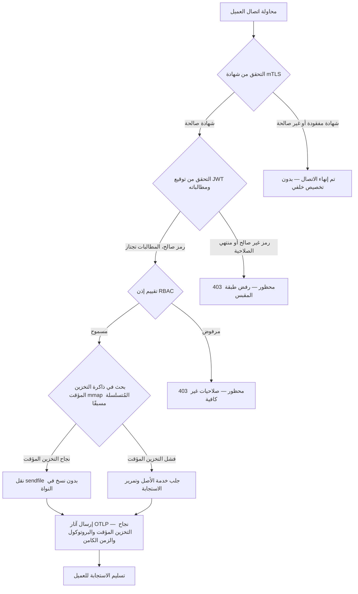

---

# Front Matter (YAML)

author: "contact@sebastienrousseau.com (Sebastien Rousseau)"
banner_alt: "مشهد مجرد لمدينة من لوحات الدوائر الإلكترونية في الليل — يُجسّد حافة الخدمات المصرفية حيث تتقاطع عمليات النقل بدون نسخ على مستوى النواة، ومصافحات mTLS، والتحقق من صحة JWT في ثنائي واحد مرتبط بصورة ثابتة"
banner_height: "1597"
banner_width: "2584"
banner: "https://cloudcdn.pro/stocks/images/bit-cloud-GlqbGLCPnQ4.webp"
cdn: "https://cloudcdn.pro"
charset: "UTF-8"
cname: "sebastienrousseau.com"
copyright: "© Copyright 2025 - 2026 - Sebastien Rousseau. All rights reserved."
date: "June 20, 2026"
description: "http-handle هو ثنائي Rust مرتبط بصورة ثابتة يُقدّم 180,000 طلب في الثانية على حافة الخدمات المصرفية بدون تبعيات وقت التشغيل، مع التحقق المدمج من mTLS وJWT، وHTTP/2 وHTTP/3 التي يتم التفاوض عليها عبر ALPN، وقابلية المراقبة OTLP — لسد الثغرات الأمنية ومتطلبات المرونة التي يتركها Nginx وEnvoy مفتوحة."
format-detection: "telephone=no"
hreflang: "ar"
icon: "https://cloudcdn.pro/clients/sebastienrousseau/v1/logos/sebastienrousseau.svg"
id: "https://sebastienrousseau.com/2026-06-20-http-handle-zero-dependency-edge-ingress-banking-rust-2026"
image_alt: "صورة بالأبيض والأسود لسيباستيان روسو"
image_height: "162"
image_width: "162"
image: "https://cloudcdn.pro/stocks/images/sebastienrousseau.webp"
keywords: "http-handle، حافة Rust، وكيل بلا تبعيات، بنية تحتية مصرفية، mTLS JWT، sendfile نقل بدون نسخ، ALPN HTTP3، امتثال DORA، بازل III، قابلية مراقبة OTLP، ثنائي ثابت، ARM64 مصرفي، أمان بدون ثقة مصرفي، دخول خفيف الوزن، أمان Rust المصرفي"
language: "ar-SA"
last_reviewed: "2026-06-20"
layout: "report"
locale: "ar_SA"
logo_alt: "شعار سيباستيان روسو"
logo_height: "44"
logo_width: "44"
logo: "https://cloudcdn.pro/clients/sebastienrousseau/v1/logos/sebastienrousseau.svg"
menu: ""
measurementID: "G-169G4ET5HQ"
name: "Sebastien Rousseau"
permalink: "https://sebastienrousseau.com/2026-06-20-http-handle-zero-dependency-edge-ingress-banking-rust-2026"
rating: "general"
referrer: "no-referrer"
robots: "index, follow"
schema: "FAQPage, Article"
seo_title: "http-handle: دخول Rust بلا تبعيات للخدمات المصرفية بسرعة 180 ألف طلب/ثانية"
short_name: "sebastienrousseau"
subtitle: "كيف يُقدّم ثنائي Rust واحد مرتبط بصورة ثابتة 180,000 طلب في الثانية مع mTLS وJWT وALPN على حافة الخدمات المصرفية — وما يعنيه ذلك للامتثال مع DORA وبازل III."
tags: "http-handle, Rust, banking, edge-ingress, mTLS, JWT, ALPN, HTTP3, DORA, Basel-III, zero-copy, sendfile, ARM64, zero-trust, OTLP, observability, open-source, infrastructure"
theme-color: "0, 83, 191"
title: "http-handle: دخول حافة عالي الأداء بلا تبعيات للخدمات المصرفية في 2026"
url: "https://sebastienrousseau.com/2026-06-20-http-handle-zero-dependency-edge-ingress-banking-rust-2026"
viewport: "width=device-width, initial-scale=1, shrink-to-fit=no"

# RSS - The RSS feed front matter (YAML).
atom_link: "https://sebastienrousseau.com/2026-06-20-http-handle-zero-dependency-edge-ingress-banking-rust-2026/rss.xml"
category: "Technology"
docs: https://validator.w3.org/feed/docs/rss2.html
generator: "Static Site Generator (SSG) (version 0.0.40)"
item_description: "http-handle هو ثنائي Rust مرتبط بصورة ثابتة يُقدّم 180,000 طلب في الثانية على حافة الخدمات المصرفية بدون تبعيات وقت التشغيل، مع التحقق المدمج من mTLS وJWT، وHTTP/2 وHTTP/3 التي يتم التفاوض عليها عبر ALPN، وقابلية المراقبة OTLP — لسد الثغرات الأمنية ومتطلبات المرونة التي يتركها Nginx وEnvoy مفتوحة."
item_guid: "https://sebastienrousseau.com/2026-06-20-http-handle-zero-dependency-edge-ingress-banking-rust-2026/rss.xml"
item_link: "https://sebastienrousseau.com/2026-06-20-http-handle-zero-dependency-edge-ingress-banking-rust-2026/rss.xml"
item_pub_date: "Sat, 20 Jun 2026 07:07:07 +0000"
item_title: "http-handle: دخول حافة عالي الأداء بلا تبعيات للخدمات المصرفية في 2026"
last_build_date: "Sat, 20 Jun 2026 07:07:07 +0000"
managing_editor: "contact@sebastienrousseau.com (Sebastien Rousseau)"
pub_date: "Sat, 20 Jun 2026 07:07:07 +0000"
ttl: "60"
type: "article"
webmaster: "contact@sebastienrousseau.com"

# Apple - The Apple front matter (YAML).
apple_mobile_web_app_orientations: "portrait"
apple_touch_icon_sizes: "192x192"
apple-mobile-web-app-capable: "yes"
apple-mobile-web-app-status-bar-inset: "black"
apple-mobile-web-app-status-bar-style: "black-translucent"
apple-mobile-web-app-title: "حافة مصرفية بلا تبعيات"
apple-touch-fullscreen: "yes"

# MS Application - The MS Application front matter (YAML).

msapplication-navbutton-color: "0, 83, 191"

# Twitter Card - The Twitter Card front matter (YAML).

twitter_card: "summary_large_image"
twitter_creator: "@wwdseb"
twitter_description: "http-handle هو ثنائي Rust مرتبط بصورة ثابتة يُقدّم 180,000 طلب في الثانية على حافة الخدمات المصرفية بدون تبعيات وقت التشغيل، مع mTLS وJWT وقابلية المراقبة OTLP."
twitter_image: "https://cloudcdn.pro/clients/sebastienrousseau/v1/logos/sebastienrousseau.svg"
twitter_image_alt: "Logo of Sebastien Rousseau"
twitter_site: "@wwdseb"
twitter_title: "http-handle: دخول Rust بلا تبعيات للخدمات المصرفية بسرعة 180 ألف طلب/ثانية"
twitter_url: "https://sebastienrousseau.com/2026-06-20-http-handle-zero-dependency-edge-ingress-banking-rust-2026"

# Humans.txt - The Humans.txt front matter (YAML).
author_website: "https://sebastienrousseau.com"
author_twitter: "@wwdseb"
author_location: "London, UK"
thanks: "Thanks for reading!"
site_last_updated: "2026-06-20"
site_standards: "HTML5, CSS3, RSS, Atom, JSON, XML, YAML, Markdown, TOML"
site_components: "Kaishi, Kaishi Builder, Kaishi CLI, Kaishi Templates, Kaishi Themes"
site_software: "Static Site Generator, Rust"

---

# http-handle: دخول حافة عالي الأداء بلا تبعيات للخدمات المصرفية في 2026

<!-- lead-start -->
<aside class="post-lead" aria-label="ملخص المقال">

<strong>ملخص سريع.</strong> http-handle هو ثنائي Rust مفتوح المصدر مرتبط بصورة ثابتة يحلّ محل Nginx وEnvoy على حافة الخدمات المصرفية. يُقدّم 180,000 طلب في الثانية على عقد ARM64 عبر عمليات نقل بدون نسخ باستخدام <code>sendfile(2)</code> في Linux، ويُطبّق التحقق من mTLS وJWT على طبقة مقبس الشبكة قبل تشغيل أي كود تطبيقي، ويتفاوض تلقائيًا على HTTP/2 وHTTP/3 عبر ALPN، ويُرسل مقاييس OpenTelemetry بصورة أصلية — كل ذلك بدون أي تبعيات وقت تشغيل سوى <code>libc</code>.

<strong>أبرز النقاط</strong>

<ul class="post-lead-takeaways">
  <li><strong>مشكلة الوكلاء الثقيلة.</strong> يحمل Nginx وEnvoy أشجار تبعيات تُوسّع سطح CVE وتُعقّد دورات معالجة مخاطر ICT وفقًا لـ DORA.</li>
  <li><strong>أداء النقل بدون نسخ على نطاق واسع.</strong> تتحمّل كتل ذاكرة التخزين المؤقت المُتسلسلة مسبقًا وعمليات نقل نواة <code>sendfile(2)</code> ما يصل إلى 180,000 طلب/ثانية على ARM64 مع تأخّر وكيل أقل من ميلي ثانية.</li>
  <li><strong>الأمان على مستوى المقبس، لا التطبيق.</strong> يكتمل التحقق من شهادة عميل mTLS والتحقق من صحة JWT وتقييم RBAC قبل تخصيص أي موارد خلفية للطلب.</li>
  <li><strong>الامتثال التنظيمي مدمج.</strong> يُعالج سطح الهجوم المُخفَّض ونشر الثنائي الواحد القابل للتدقيق مباشرةً المواد 5 و6 من DORA، والمخاطر التشغيلية لبازل III، وسلاسل المساءلة SM&CR.</li>
</ul>

<strong>قراءة ذات صلة:</strong> <a href="https://sebastienrousseau.com/2026-06-18-noyalib-safe-yaml-rust-ai-mcp-financial-infrastructure-2026">لماذا يحتاج YAML إلى حزمة Rust أكثر أمانًا للذكاء الاصطناعي وMCP والبنية التحتية المالية في 2026</a>، <a href="https://sebastienrousseau.com/2026-06-11-cloudcdn-open-source-blueprint-ai-native-edge-2026">CloudCDN: مخطط مفتوح المصدر للحافة الأصلية للذكاء الاصطناعي في 2026</a>، <a href="https://sebastienrousseau.com/2026-05-16-best-cloud-infrastructure-architecture-2026">أفضل بنية تحتية سحابية للبنوك والمؤسسات المالية في 2026</a>.

</aside>
<!-- lead-end -->

تعاني حافة الخدمات المصرفية من مشكلة التبعيات. كل مثيل من Nginx أو Envoy يُوجّه حركة المرور بين عميل وخدمة مصرفية أساسية يحمل شجرة تبعيات: إصدارات OpenSSL، ووحدات Lua، ومكتبات gRPC، وطبقات حاويات — كل منها ثغرة CVE محتملة، وكل منها يتطلب دورة تصحيح مخصصة، وكل منها يُضيف تباينًا في الزمن الكامن يُعقّد قياس اتفاقية مستوى الخدمة. في ظل [قانون المرونة التشغيلية الرقمية (DORA)](https://eur-lex.europa.eu/eli/reg/2022/2554/oj)، أصبح هذا التعقيد مسؤولية تنظيمية بقدر ما هو مسؤولية تشغيلية.

يتبع [http-handle](https://github.com/sebastienrousseau/http-handle) نهجًا مختلفًا. إنه ثنائي Rust واحد مرتبط بصورة ثابتة بدون تبعيات وقت تشغيل سوى `libc`. يُقدّم 180,000 طلب في الثانية على عقد ARM64، ويُطبّق TLS المتبادل والمصادقة JWT على طبقة مقبس الشبكة، ويتفاوض تلقائيًا على HTTP/2 وHTTP/3 — كل ذلك ضمن بصمة نشر أقل من 20 ميغابايت من ذاكرة الوصول العشوائي.

## الإجابة السريعة

**ما هو http-handle في جملة واحدة؟** http-handle هو ثنائي Rust مفتوح المصدر مرتبط بصورة ثابتة يحلّ محل حاويات الوكيل الثقيلة على حافة الخدمات المصرفية، يُقدّم 180,000 طلب/ثانية على ARM64 عبر عمليات نقل نواة `sendfile(2)` في Linux بدون نسخ، ويُطبّق mTLS وJWT وRBAC على طبقة المقبس قبل لمس أي مورد خلفي، ويُرسل مقاييس [OpenTelemetry](https://opentelemetry.io/) الأصلية — بدون أي تبعيات مكتبة وقت تشغيل سوى `libc`.

## الملخص التنفيذي

تعتمد البنوك على Nginx وEnvoy على حافتها منذ عقد. كلاهما قادر؛ ولم يُصمَّم أيٌّ منهما للبيئة التنظيمية لعام 2026. تُولّد صور الحاويات المثقلة بالتبعيات قوائم انتظار CVE لا تستطيع فرق الامتثال تصفيتها بسرعة كافية، وكل ترقية لإصدار مكتبة تحمل خطر التراجع. تشترط المادتان 5 و6 من DORA إدارة مخاطر ICT بالتصميم، لا بالتصحيح بعد الاكتشاف. تُعاقب أطر المخاطر التشغيلية لبازل III الأبنية التي تتضاعف فيها نقاط الفشل مع تعقيد النظام.

يُعالج http-handle مشكلة التبعيات من جذورها. يُترجم الثنائي مرة واحدة، بصورة ثابتة، بدون متطلبات مكتبة خارجية في وقت التشغيل. يتقلّص سطح الهجوم إلى مكتبة Rust القياسية بالإضافة إلى `libc`. يتم تنفيذ إجراءات الأمان — التحقق من شهادة mTLS، والتحقق من صحة مطالبة JWT، والتحكم في الوصول المستند إلى الأدوار — على مقبس الشبكة قبل أي تخصيص خلفي، مما يُقلّص محيط Zero Trust إلى أصغر تعبير ممكن. يتبع الأداء البنية المعمارية: تُزيل كتل ذاكرة التخزين المؤقت المُعيَّنة في الذاكرة والمُتسلسلة مسبقًا بالإضافة إلى عمليات نقل نواة `sendfile(2)` البيانات من مسار النسخ بين وحدة المعالجة المركزية والذاكرة كليًا، مما يُبقي على 180,000 طلب/ثانية على أجهزة ARM64. النتيجة هي طبقة دخول تُرضي متطلبات مرونة DORA، وتدعم حجج تخفيض المخاطر التشغيلية لبازل III، وتمنح كبار قادة تقنية المعلومات في ظل SM&CR سلسلة مساءلة واحدة وقابلة للتحقق لبنية تحتية الحافة.

## أبرز النقاط

- **ثنائيات أصغر، قوائم CVE أقصر.** يتضمن الثنائي الواحد المرتبط بصورة ثابتة حزمة واحدة للتصحيح، وإصدارًا واحدًا للتحقق، وأرتفاكت واحدة للتدقيق. يُشحن Nginx مع مجموعة وحدات قياسية بأكثر من 30 تبعية مكتبة مشتركة؛ كل منها يحمل دورة حياة ثغرات خاصة به.
- **النقل بدون نسخ ليس تحسينًا — إنه قيد تصميمي.** عند 180,000 طلب/ثانية، تُقدّم أي نسخة بيانات في مساحة المستخدم تباينًا قابلًا للقياس في الزمن الكامن. تنقل `sendfile(2)` محتويات واصف الملفات إلى مقبس الشبكة داخل النواة بالكامل. بالإضافة إلى كتل ذاكرة التخزين المؤقت المثبتة في mmap، لا تلمس وحدة المعالجة المركزية مسار البيانات للاستجابات المخزنة مؤقتًا.
- **محيط الأمان ينتمي إلى المقبس.** التحقق من صحة JWT وشهادات mTLS في middleware التطبيق يعني أن الواجهة الخلفية قد خصّصت بالفعل خيوطًا وذاكرة قبل رفض الطلب. يضمن التحقق على مستوى المقبس أن الطلبات غير المصادق عليها لا تستهلك أي موارد خلفية على الإطلاق.
- **OTLP يُزيل الفجوة في قابلية المراقبة.** يعني التكامل الأصلي مع OpenTelemetry أن كل طلب، وكل قرار مصادقة، وكل تفاوض بروتوكول ينتج بيانات تتبع منظّمة بدون عامل sidecar. تستوعب لوحات تحكم البنك الحالية آثار OTLP مباشرةً.

**قراءة ذات صلة:** [لماذا يحتاج YAML إلى حزمة Rust أكثر أمانًا للذكاء الاصطناعي وMCP والبنية التحتية المالية في 2026](https://sebastienrousseau.com/2026-06-18-noyalib-safe-yaml-rust-ai-mcp-financial-infrastructure-2026/)، [CloudCDN: مخطط مفتوح المصدر للحافة الأصلية للذكاء الاصطناعي في 2026](https://sebastienrousseau.com/2026-06-11-cloudcdn-open-source-blueprint-ai-native-edge-2026/)، [أفضل بنية تحتية سحابية للبنوك والمؤسسات المالية في 2026](https://sebastienrousseau.com/2026-05-16-best-cloud-infrastructure-architecture-2026/).

## 01. مشكلة الوكيل الثقيل في الخدمات المصرفية

بنى Nginx وEnvoy حافة الإنترنت الحديثة. كلاهما قابل للتهيئة، واختُبر في المعركة، ومدعوم من مجتمعات كبيرة. وكلاهما أيضًا خيارات معمارية اتُّخذت قبل وجود DORA، وقبل أن تطالب أطر مخاطر التشغيل لبازل III بتخفيض موثّق للتعقيد، وقبل أن تُغيّر عقد ARM64 السحابية اقتصاديات الحوسبة عالية الإنتاجية.

النتيجة العملية هي فجوة بين ما تحتاجه البنوك وما تُقدّمه حاويات الوكيل الثقيل.

**سطح التبعيات.** يسحب نشر Envoy القياسي OpenSSL وAbseil وProtobuf وgRPC وLua وعشرات المكتبات الثانوية. كل منها يحمل دورة حياة CVE مستقلة. عندما تنشر قاعدة البيانات الوطنية للثغرات تحذيرًا حرجًا لـ OpenSSL، يُصبح كل مثيل Envoy في الحوزة ساعة امتثال: تقييم، تصحيح، اختبار، إعادة نشر، وإعادة التصديق — عبر كل بيئة يعمل فيها الثنائي. بموجب المادة 6 من DORA، يجب على البنوك إثبات أن عمليات إدارة مخاطر ICT متناسبة وموثّقة وقابلة للتحقق. تجعل شجرة التبعيات متعددة المكتبات هذا الإثبات مُكلفًا للصيانة.

**حمل الذاكرة.** تستهلك عملية عامل Nginx المُهيَّأة بالحد الأدنى 40–80 ميغابايت من الذاكرة المقيمة تحت الحمل المعتدل. على نطاق واسع — مئات عقد الدخول عبر أنظمة التداول وAPIs الدفع والبوابات التي تواجه العملاء — يتراكم هذا الحمل إلى تكلفة بنية تحتية قابلة للقياس بدون أي فائدة أداء مقابلة على بديل ثنائي واحد مُصمَّم جيدًا.

**سرعة التصحيح.** تُدخل سلاسل توريد صورة الحاوية تأخيرًا لأيام متعددة بين نشر CVE ووصول التصحيح المُتحقَّق منه إلى الإنتاج. يجب إعادة بناء الصورة الأساسية، وإعادة طبقة طبقة التطبيق، وإعادة تشغيل مصفوفة الاختبار الكاملة، وإعادة تنفيذ خط أنابيب النشر. بالنسبة للأنظمة المصرفية الحيوية التي تعمل في ظل نوافذ الإبلاغ عن الحوادث DORA، تُمثّل هذه الدورة خطرًا هيكليًا.

يُعالج http-handle الثلاثة جميعها. ثنائي واحد. سطح CVE واحد. أرتفاكت واحدة للتصحيح. أقل من 20 ميغابايت من ذاكرة الوصول العشوائي لعقدة دخول الإنتاج.

## 02. عدسة معمارية http-handle 2026

يتكون الثنائي من خمس طبقات مترابطة، صُمّمت كل منها للقضاء على فئة محددة من المخاطر التي تتراكمها بنى الوكيل التقليدية.

### الجدول 1: طبقات معمارية http-handle وتخفيف المخاطر

| الطبقة | قرار التصميم | لماذا يُهم | الخطر في حالة الإساءة |
| ---- | ---- | ---- | ---- |
| **نواة الخادم** | ثنائي Rust واحد، مرتبط بصورة ثابتة، بدون تبعيات سوى `libc` | أرتفاكت واحدة للتصحيح؛ يُزيل انتشار CVE للمكتبة عبر الحوزة | هجمات الخلط بين التبعيات؛ تراكم ثغرات المكتبة |
| **محرك التسريع** | كتل ذاكرة تخزين مؤقت mmap مُتسلسلة مسبقًا وعمليات نقل نواة `sendfile(2)` بدون نسخ | 180,000 طلب/ثانية على ARM64 مع تأخر وكيل أقل من ميلي ثانية؛ لا تدخل أي بيانات في مساحة المستخدم للاستجابات المخزنة مؤقتًا | تسريبات تعيين الذاكرة؛ اختناقات مساحة النواة تحت إبطال التخزين المؤقت |
| **الأمان التشفيري** | mTLS أصلي مع دعم إعادة تحميل الشهادة الفورية وتفاوض ALPN | يضمن سلامة البيانات وتوافق البروتوكول؛ تدوير الشهادات بدون إسقاط الاتصالات | انتهاء صلاحية الشهادة يتسبب في انقطاع الخدمة؛ إعدادات مجموعة التشفير الضعيفة افتراضيًا |
| **مستوى سياسة الوصول** | التحقق من JWT على مستوى المقبس وتقييم مطالبات RBAC | الطلبات غير المصادق عليها لا تستهلك أي موارد خلفية؛ Zero Trust يُطبَّق عند حدود النواة | هجمات الخلط بين خوارزميات JWT؛ سوء تهيئة RBAC يمنح وصولًا مُفرَّطًا |
| **قابلية المراقبة** | تكامل [OpenTelemetry (OTLP)](https://opentelemetry.io/docs/specs/otlp/) الأصلي | بيانات تتبع منظّمة بدون عوامل sidecar؛ استيعاب مباشر في حوزات مراقبة البنك الحالية | نقاط عمياء خلال الانقطاعات؛ مسارات تدقيق غير مكتملة للإبلاغ عن حوادث DORA |

## 03. إشارات الأداء والأمان الرئيسية

يجب على البنوك التي تُشغّل http-handle على الحافة قياس خمس إشارات قابلة للقياس لتلبية متطلبات الإبلاغ التشغيلي لـ DORA وحوكمة اتفاقية مستوى الخدمة الداخلية.

### الجدول 2: معايير التشغيل والمراجع التنظيمية

| الإشارة | المعيار | المرجع التنظيمي | التنفيذ التقني |
| ---- | ---- | ---- | ---- |
| **الإنتاجية** | ≥ 180,000 طلب/ثانية على عقد ARM64 عند P99 ≤ 1 مللي ثانية تأخر وكيل | مخاطر التشغيل لبازل III — تخفيض تعقيد النظام | `sendfile(2)` + كتل ذاكرة تخزين مؤقت mmap مُتسلسلة مسبقًا؛ بدون نسخ بيانات في مساحة المستخدم لنجاحات التخزين المؤقت |
| **سطح الهجوم** | بدون تبعيات مكتبة وقت تشغيل؛ أرتفاكت ثنائي واحد لكل إصدار | [المادة 6 من DORA](https://eur-lex.europa.eu/eli/reg/2022/2554/oj) — إدارة مخاطر ICT بالتصميم | الترجمة الثابتة باستخدام `cargo build --release --target aarch64-unknown-linux-musl` |
| **زمن كامن للمصادقة** | مصافحة mTLS + التحقق من JWT مكتملان قبل أول بايت من استجابة الخلفية | [المادة 5 من DORA](https://eur-lex.europa.eu/eli/reg/2022/2554/oj) — حماية أمن ICT | اعتراض طبقة المقبس؛ تقييم مطالبات JWT في Rust المجاور للنواة قبل توجيه الخلفية |
| **توافر الشهادات** | إعادة التحميل الفوري لشهادات mTLS بدون إسقاط اتصالات أثناء التدوير | مساءلة الإدارة العليا SM&CR لتوافر الحافة | مراقب شهادات مدفوع بـ inotify؛ تبديل ذري لواصف الملف أثناء إعادة التحميل |
| **تغطية قابلية المراقبة** | 100% من الطلبات تُنتج آثار OTLP مع نتيجة المصادقة وإصدار البروتوكول وحالة التخزين المؤقت | المادة 17 من DORA — اكتشاف الحوادث والإبلاغ عنها | مُصدِّر OTLP أصلي؛ لا sidecar مطلوب؛ نقل gRPC أو HTTP/Protobuf قابل للتهيئة |

## 04. محرك النقل بدون نسخ: mmap وsendfile(2)

يُحدّ أداء الشبكة في الخدمات المصرفية عالية التردد — المدفوعات في الوقت الفعلي، وAPIs بيانات السوق، وخدمات رمز المصادقة — بقيد واحد أكثر من أي قيد آخر: تكلفة نقل البايتات من التخزين إلى مقبس الشبكة.

تقرأ خوادم HTTP التقليدية محتوى الملف في مخزن مؤقت في مساحة المستخدم، ثم تكتب هذا المخزن المؤقت في المقبس. يتطلب هذا التسلسل نسختين من الذاكرة وتبديلين للسياق بين مساحة المستخدم ومساحة النواة لكل استجابة. عند 180,000 طلب في الثانية، يكون الحمل المتراكم كبيرًا.

يُزيل http-handle كلتا النسختين.

**كتل ذاكرة التخزين المؤقت المُعيَّنة في الذاكرة.** عند بدء الخدمة، تُسلسل محتوى الاستجابة الثابتة في مناطق مُعيَّنة في الذاكرة باستخدام `mmap(2)`. هذه المناطق مثبّتة في ذاكرة التخزين المؤقت للصفحات في النواة. عند وصول طلب لمورد مخزَّن مؤقتًا، تكون الاستجابة مُعيَّنة بالفعل في ذاكرة النواة — بدون قراءة قرص، بدون تخصيص مخزن مؤقت.

**نقل نواة `sendfile(2)`.** تنقل دعوة نظام `sendfile(2)` في Linux البيانات مباشرةً من واصف ملف — أو منطقة مُعيَّنة في الذاكرة — إلى واصف ملف مقبس الشبكة، بالكامل داخل النواة. لا يدخل أي بايت في مساحة المستخدم. يقتصر دور وحدة المعالجة المركزية على إصدار دعوة النظام والتعامل مع حدث الإتمام. على عقد ARM64 بهذه البنية، يُبقي http-handle على 180,000 طلب/ثانية بتأخر وكيل أقل من ميلي ثانية تحت الحمل المستمر.

بالنسبة للبنوك التي تُشغّل مطابقة دُفعات نهاية الشهر، أو إعداد تقارير السيولة خلال اليوم، أو حركة API لتسجيل الاحتيال في الوقت الفعلي، فإن الأثر الهندسي مباشر: عقد ARM64 أقل لكل طبقة حركة مرور، وتكلفة بنية تحتية أقل، ومخاطر مرونة DORA أصغر من نقص السعة.

## 05. مستوى سياسة وصول mTLS وJWT

في الخدمات المصرفية، المصادقة على الحافة ليست ميزة — إنها متطلب تنظيمي. يُلزم DORA أن تكون ضوابط أمان ICT متناسبة وموثّقة وقابلة للتحقق. يضع SM&CR مسؤولية شخصية لقرارات أمان البنية التحتية على كبار المدراء المُسمّيين. السؤال ليس ما إذا كان يجب المصادقة على الحافة، بل في أي طبقة.

يُطبّق http-handle سياسة Zero Trust من ثلاث مراحل قبل تخصيص أي مورد خلفي.

**المرحلة 1: التحقق من شهادة عميل mTLS.** خلال مصافحة TLS، يطلب http-handle ويتحقق من شهادة العميل مقابل مخزن ثقة قابل للتهيئة. تنتهي الاتصالات بدون شهادة صالحة عند المصافحة. لا يُعيَّن خيط تطبيق، ولا يُخصَّص مجمع ذاكرة. لن تُرى الخلفية أبدًا للطلب.

**المرحلة 2: التحقق من صحة مطالبة JWT.** بالنسبة للاتصالات التي تجتاز mTLS، يستخرج http-handle ويتحقق من رمز JSON Web Token من رأس `Authorization` على طبقة المقبس. يحدث التحقق من التوقيع وفحوصات انتهاء الصلاحية والتحقق من المُصدر قبل وصول الطلب إلى طبقة التوجيه. تُحجب هجمات الخلط بين الخوارزميات — حيث يقبل الخادم خوارزمية متماثلة عند توقع مفتاح غير متماثل — بالإدراج الصريح للخوارزمية المسموح بها في التهيئة.

**المرحلة 3: تقييم مطالبة RBAC.** تُعيَّن مطالبات JWT المُتحقَّق منها إلى جدول أدوار في الذاكرة. تتلقى الطلبات التي تحمل أذونات غير كافية استجابة 403 على مستوى سياسة الوصول. لا يُستدعى خدمة الخلفية أبدًا لحركة المرور غير المصرّح بها.

يهمّ هذا التسلسل تشغيليًا. في النموذج التقليدي — حيث تعمل المصادقة في middleware التطبيق — يمكن للمهاجم استنفاد تجمعات الخيوط الخلفية بطلبات غير مصادق عليها قبل إصدار رفض واحد. يُلغي التحقق على مستوى المقبس هذا المتجه الهجومي كليًا.

## 06. توجيه ALPN وسلسلة التراجع HTTP/3

تصل حركة مرور الخدمات المصرفية عبر ظروف شبكة متنوعة: ألياف ضوئية مؤسسية لمكاتب التداول، و5G لعملاء الخدمات المصرفية عبر الهاتف المحمول، واتصالات الأقمار الصناعية للعمليات عن بُعد، وبروكسيات TLS للبيئات المنظمة. تُنشئ طبقة دخول بروتوكول واحد قيدًا على المستوى الأدنى المشترك.

يستخدم http-handle [تفاوض بروتوكول طبقة التطبيق (ALPN)](https://www.rfc-editor.org/rfc/rfc7301) لاختيار البروتوكول الأمثل لكل اتصال تلقائيًا.

**HTTP/2** هو الافتراضي لحركة المرور من المتصفح وAPI عبر TCP. تُزيل التدفقات المتعددة عبر اتصال واحد حجب الرأس-من-الخط الذي يُدخله HTTP/1.1 في ظل أنماط الطلبات المتزامنة.

**HTTP/3 (QUIC)** يُنشَّط عندما تدعم الشبكة UDP ويُعلن العميل عن `h3` في امتداد ALPN الخاص به. تجعل تعدد التدفقات المستقلة لـ QUIC وترحيل الاتصال أفضل بشكل ملموس لعملاء الخدمات المصرفية عبر الهاتف المحمول على الشبكات الخلوية المزدحمة حيث تنقطع اتصالات TCP وتُعاد بصورة متكررة.

**التراجع السلس.** إذا فشل تفاوض ALPN — لأن بروكسي وسيط يحذف الامتداد أو يغفله عميل قديم — يتراجع http-handle إلى HTTP/1.1 مع الحفاظ على جميع رؤوس الأمان وإجراء mTLS والتحقق من JWT. لا تتدهور أي خاصية أمنية خلال تراجع البروتوكول.

## 07. دورة حياة الطلب بدون نسخ

يُظهر الرسم التخطيطي التالي مسار الطلب الكامل من اتصال العميل إلى تسليم الاستجابة، بما في ذلك بوابات المصادقة ونقاط إرسال قابلية المراقبة.

يتجاوز المسار الحرج للاستجابات التي تصل إلى التخزين المؤقت ثلاث بوابات أمنية ودعوة نظام واحدة. لا يُخصَّص أي مخزن مؤقت في مساحة المستخدم لجسم الاستجابة. تلتقط آثار OTLP نتيجة المصادقة، وإصدار البروتوكول المُتفاوَض عليه عبر ALPN، وحالة التخزين المؤقت، والزمن الكامن من الطرف إلى الطرف في سجل منظم واحد.

## 08. الامتثال التنظيمي: DORA وبازل III وSM&CR

### المادتان 5 و6 من DORA — إدارة مخاطر ICT والحماية

تُلزم [المادة 5 من DORA](https://eur-lex.europa.eu/eli/reg/2022/2554/oj) الكيانات المالية بالحفاظ على أطر إدارة مخاطر ICT. تُلزمها المادة 6 بتنفيذ تدابير الحماية والوقاية المتناسبة مع ملف المخاطر لأنظمة ICT الخاصة بها.

يُرضي الثنائي الواحد المرتبط بصورة ثابتة كلا المتطلبين بكفاءة أكبر من حزمة حاوية متعددة المكتبات. سطح الهجوم قابل للقياس — أرتفاكت واحدة، تبعية واحدة (`libc`)، سطح CVE واحد — وتدابير الحماية هيكلية وليست إجرائية: لا يمكن تجاوز إجراء mTLS وJWT بسبب سوء التهيئة لأنها تُنفَّذ على طبقة المقبس قبل تشغيل أي منطق تطبيقي قابل للتهيئة.

### بازل III — متطلبات رأس المال للمخاطر التشغيلية

يربط [إطار المخاطر التشغيلية لبازل III](https://www.bis.org/bcbs/basel3.htm) متطلبات رأس المال التنظيمي بتخفيض المخاطر القابل للإثبات. يمتلك البنوك التي يمكنها توثيق انخفاض قابل للقياس في تعقيد النظام وعدد نقاط فشل ICT حجة قابلة للقياس لتخفيض تخصيص رأس المال للمخاطر التشغيلية. استبدال حوزة وكيل متعدد الحاويات بعقد دخول ثنائية واحدة هو بالضبط نوع تخفيض التعقيد الذي يدعم هذه الحجة — بشرط أن يتمكن الفريق الهندسي من إنتاج وثائق الاعتماد.

تدعم أرتفاكتات إصدار http-handle القابلة للتدقيق — البنيات القابلة للاستنساخ، وملفات التبعية المتوافقة مع SBOM، والسجلات التشغيلية القائمة على OTLP — سلسلة التوثيق التي تتطلبها مناقشات رأس المال لبازل III.

### SM&CR — مساءلة كبار المدراء

يُلقي [نظام كبار المدراء والشهادة (SM&CR)](https://www.fca.org.uk/firms/senior-managers-certification-regime) مسؤولية شخصية على كبار المدراء المُسمّيين عن وضع أمان ICT للأنظمة في نطاق مساءلتهم. تُعيد طبقة دخول الثنائي الواحد التي تُعيد تحميل الشهادات فوريًا بدون انقطاع الخدمة، وتُنتج سجلات تدقيق منظّمة عبر OTLP، ولها أرتفاكت واحدة مثبّتة الإصدار لكل نشر، لكبير المدراء المُسمّى سلسلة أمان قابلة للتحقق والتوثيق. حزمة الحاوية متعددة المكتبات لا تُوفّر ذلك.

## 09. ما يعنيه هذا حسب الدور

### مجلس الإدارة والرؤساء التنفيذيون

يعتمد تحسين رأس المال التنظيمي في إطار مخاطر التشغيل لبازل III على تخفيض التعقيد القابل للإثبات. استبدال Nginx أو Envoy بثنائي واحد مرتبط بصورة ثابتة يُخفّض عدد نقاط فشل ICT بطريقة قابلة للتدقيق وللعرض على المنظمين الاحترازيين. يدعم تخفيض سطح CVE أيضًا إعادة التفاوض على أقساط التأمين الإلكتروني — يُسعّر المؤمنون بناءً على مقاييس سطح الهجوم القابلة للإثبات، والثنائي أحادي التبعية هو نقطة بيانات ملموسة.

### كبار مسؤولي أمن المعلومات وكبار مسؤولي المخاطر

يتطلب امتثال DORA أن تكون تدابير الحماية ICT متناسبة وقابلة للتحقق. يوفر إجراء mTLS وJWT على مستوى المقبس بوابة مصادقة قابلة للتحقق وغير قابلة للتجاوز على الحافة. يُزيل تدوير الشهادات بإعادة التحميل الفوري خطر نافذة الخدمة الذي تحمله تحديثات الشهادات التقليدية. يعني نموذج التجميع بدون تبعيات أنه عندما يُنشر تحذير حرج لـ `libc`، يمكن إعادة بناء الحوزة بأكملها واختبارها وإعادة نشرها من أرتفاكت مصدر Rust واحد في ساعات بدلًا من أيام.

### الهندسة وإدارة تقنية المعلومات

180,000 طلب/ثانية على عقدة ARM64 قياسية يُغيّر محادثة تحديد حجم البنية التحتية لـ APIs الدفع وخدمات المصادقة. يُزيل تكامل OTLP الأصلي الحاجة إلى مُصدِّرات Prometheus أو عوامل sidecar أو شاحنات سجل مخصصة. نموذج نشر Kubernetes هو pod قياسي — أقل من 20 ميغابايت من ذاكرة الوصول العشوائي، بدون أذونات حاوية مُميَّزة، بدون وصول لشبكة المضيف. تعمل إعادة تحميل الشهادة الفوري بدون حمل إعادة تشغيل متداول لـ Kubernetes.

## الأسئلة الشائعة

**كيف يتعامل http-handle مع تدوير الشهادات تحت الحمل؟**
يُراقب الثنائي مسارات ملفات الشهادات باستخدام مراقب inotify. عند اكتشاف ملفات شهادة ومفتاح جديدة، يُجري تبديلًا ذريًا لسياق TLS النشط — تكتمل الاتصالات الحالية باستخدام الشهادة السابقة بينما تستخدم الاتصالات الجديدة فورًا الشهادة المُدوَّرة. لا يُسقَّط أي اتصال. لا تُطلَب نافذة خدمة.

**هل يمكن تشغيل http-handle داخل مجموعة Kubernetes كمتحكم دخول؟**
نعم. يعمل الثنائي كـ pod مستقل مع تعليق توضيحي لخدمة الدخول القياسية. متطلبات الموارد أقل من 20 ميغابايت من ذاكرة الوصول العشوائي بالإنتاجية الكاملة، بدون أذونات حاوية مُميَّزة وبدون متطلب وصول لشبكة المضيف. يمكنه أيضًا تشغيل كـ sidecar في شبكات الخدمات حيث يُفضَّل إجراء mTLS على طبقة sidecar على مصادقة البوابة المركزية.

**ما هو مساهمة الزمن الكامن القابلة للقياس للوكيل نفسه؟**
بالنسبة للاستجابات التي تصل إلى التخزين المؤقت، فإن حمل الوكيل — من قبول المقبس إلى اكتمال `sendfile(2)` — أقل من ميلي ثانية على أجهزة ARM64. بالنسبة للاستجابات التي تُخفق في التخزين المؤقت والتي تتطلب جلب المنبع، يكون الحمل نفس الرقم الأقل من ميلي ثانية بالإضافة إلى وقت استجابة الأصل. لا يُضيف الوكيل نفسه زمنًا كامنًا للانتظار لأن المصادقة تحدث بصورة متزامنة على طبقة المقبس بدون تخصيص تجمع الخيوط قبل اكتمال التحقق من بيانات الاعتماد.

**كيف يتناسب http-handle مع بنية Zero Trust إلى جانب بوابة API موجودة؟**
يعمل http-handle على حدود OSI Layer 4/7: يُطبّق mTLS على طبقة النقل ويُتحقق من JWT على طبقة التطبيق قبل التوجيه إلى الخدمات المنبعية. يمكنه الجلوس أمام بوابة API كاملة — امتصاص حركة المرور غير المصادق عليها قبل أن تصل إلى طبقة معالجة البوابة الأكثر تكلفةً — أو استبدال البوابة بالكامل للخدمات التي يمكن التعبير عن سياسة الوصول الخاصة بها كليًا في مطالبات JWT.

**هل مخرج الثنائي قابل للاستنساخ لأغراض تدقيق سلسلة التوريد؟**
نعم. البنية قابلة للاستنساخ مع إصدار Rust toolchain مُثبَّت وملف `Cargo.lock` مُقفَّل. يُنتج إنشاء SBOM عبر `cargo cyclonedx` قائمة مواد بتنسيق CycloneDX لكل إصدار. كلتا الأرتفاكتين قابلتان للنشر في سلسلة أدوات تحليل تكوين البرامج الداخلية للبنك وتُرضيان متطلبات توثيق مخاطر سلسلة التوريد لـ DORA.

## الخاتمة

لا تحتاج حافة الخدمات المصرفية إلى المزيد من الميزات — إنها تحتاج إلى مكونات أقل، كل منها يُنجز عملًا أقل ويُنجزه بصورة قابلة للتحقق. يُقلّص http-handle طبقة الدخول إلى حدها الأدنى غير القابل للاختزال: ثنائي Rust واحد يُطبّق المصادقة على المقبس، وينقل البيانات بدون نسخها، ويُبلّغ عن كل ما يفعله في بيانات تتبع منظّمة. بالنسبة للبنوك التي تتعامل مع جداول الامتثال مع DORA، ومراجعات تحسين رأس المال لبازل III، ومتطلبات المساءلة SM&CR، فإن هذا البساطة ليست تفضيلًا هندسيًا — إنها حجة تنظيمية.

[الكود المصدري لـ http-handle](https://github.com/sebastienrousseau/http-handle) متاح تحت ترخيص مزدوج MIT وApache 2.0.

---

*المراجع*

Basel Committee on Banking Supervision (2011). *Basel III: A global regulatory framework for more resilient banks and banking systems*. Bank for International Settlements. Available at: [https://www.bis.org/publ/bcbs189.htm](https://www.bis.org/publ/bcbs189.htm)

European Parliament and Council (2022). Regulation (EU) 2022/2554 on digital operational resilience for the financial sector (DORA). Available at: [https://eur-lex.europa.eu/legal-content/EN/TXT/?uri=CELEX:32022R2554](https://eur-lex.europa.eu/legal-content/EN/TXT/?uri=CELEX:32022R2554)

Financial Conduct Authority (2015). *Senior Managers and Certification Regime (SM&CR)*. Available at: [https://www.fca.org.uk/firms/senior-managers-certification-regime](https://www.fca.org.uk/firms/senior-managers-certification-regime)

Internet Engineering Task Force (2014). *RFC 7301: Transport Layer Security (TLS) Application-Layer Protocol Negotiation Extension*. Available at: [https://www.rfc-editor.org/rfc/rfc7301](https://www.rfc-editor.org/rfc/rfc7301)

OpenTelemetry Authors (2024). *OpenTelemetry Protocol Specification (OTLP)*. Available at: [https://opentelemetry.io/docs/specs/otlp/](https://opentelemetry.io/docs/specs/otlp/)
