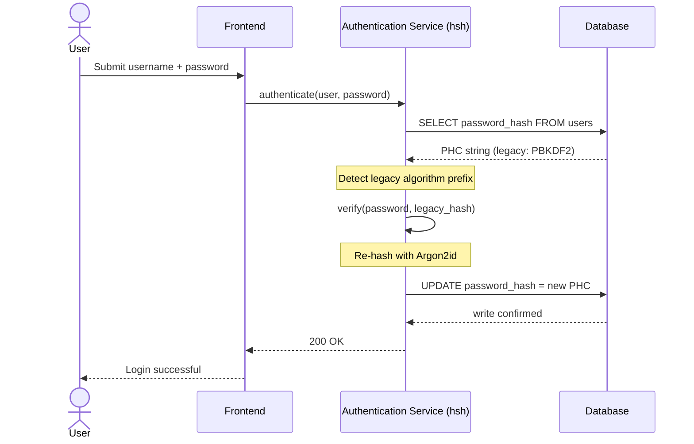
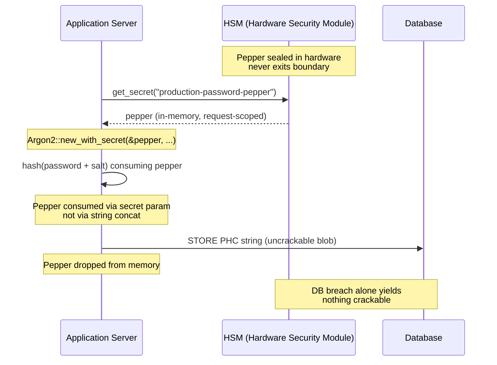

---
# Front Matter (YAML)
author: "contact@sebastienrousseau.com (Sebastien Rousseau)"
banner_alt: "لقطة مقرَّبة لطرفية مطوِّر يُمرِّر مخرجات مُصرِّف Rust — الانضباط المرئي لطبقة تشفيرية آمنة في الذاكرة وقابلة للتدقيق تحت عقار مصادقة مصرفي مؤسسي"
banner_height: "1597"
banner_width: "2584"
banner: "https://cloudcdn.pro/stocks/images/rustlogs.webp"
cdn: "https://cloudcdn.pro"
charset: "UTF-8"
cname: "sebastienrousseau.com"
copyright: "© Copyright 2025 - 2026 - Sebastien Rousseau. All rights reserved."
date: "June 22, 2026"
description: "hsh إطار تشفيري خالص بلغة Rust يُمكِّن مصارف الفئة الأولى من ترحيل تجزئات كلمات المرور القديمة إلى Argon2id بصفر توقف، مع تتبيل HSM واستبعاد ثغرات الذاكرة في FFI القائم على C."
format-detection: "telephone=no"
hreflang: "ar"
icon: "https://cloudcdn.pro/clients/sebastienrousseau/v1/logos/sebastienrousseau.svg"
id: "https://sebastienrousseau.com/2026-06-22-hsh-zero-downtime-cryptographic-stewardship-rust-banking-2026"
image_alt: "صورة بالأبيض والأسود لـ Sebastien Rousseau"
image_height: "162"
image_width: "162"
image: "https://cloudcdn.pro/stocks/images/sebastienrousseau.webp"
keywords: "hsh, تشفير Rust, تجزئة كلمات المرور, Argon2id, الأمن المصرفي, تعشيق HSM, الامتثال لـ DORA, Basel III, ترحيل بصفر توقف, أمان الذاكرة, PBKDF2, scrypt, التعافي السيبراني"
language: "ar"
last_reviewed: "2026-06-22"
layout: "report"
locale: "ar_SA"
logo_alt: "شعار Sebastien Rousseau"
logo_height: "44"
logo_width: "44"
logo: "https://cloudcdn.pro/clients/sebastienrousseau/v1/logos/sebastienrousseau.svg"
measurementID: "G-169G4ET5HQ"
name: "Sebastien Rousseau"
permalink: "https://sebastienrousseau.com/2026-06-22-hsh-zero-downtime-cryptographic-stewardship-rust-banking-2026"
rating: "general"
referrer: "no-referrer"
robots: "index, follow"
schema: "FAQPage, Article"
seo_title: "hsh: وصاية تشفيرية بصفر توقف بلغة Rust للمصرفية"
short_name: "sebastienrousseau"
subtitle: "كيف يُمكِّن إطار تشفيري خالص بلغة Rust المصارف من ترقية كلمات المرور القديمة إلى Argon2id بتعشيق HSM — وماذا يعني ذلك لامتثال DORA وBasel III."
tags: "hsh, Rust, المصرفية, التشفير, Argon2id, HSM, DORA, Basel-III, الأمن, المصادر المفتوحة, الصمود التشغيلي"
theme-color: "0, 83, 191"
title: "تأمين إدارة كلمات المرور في المصرفية المؤسسية: التجزئة متعددة الخوارزميات والترقيات مع hsh"
url: "https://sebastienrousseau.com/2026-06-22-hsh-zero-downtime-cryptographic-stewardship-rust-banking-2026"
viewport: "width=device-width, initial-scale=1, shrink-to-fit=no"

# RSS
atom_link: "https://sebastienrousseau.com/2026-06-22-hsh-zero-downtime-cryptographic-stewardship-rust-banking-2026/rss.xml"
category: "Technology"
generator: "Static Site Generator (SSG) (version 0.0.40)"
item_description: "hsh إطار تشفيري خالص بلغة Rust يُمكِّن مصارف الفئة الأولى من ترحيل تجزئات كلمات المرور القديمة إلى Argon2id بصفر توقف، مع تتبيل HSM واستبعاد ثغرات الذاكرة في FFI القائم على C."
item_pub_date: "Mon, 22 Jun 2026 07:07:07 +0000"
item_title: "تأمين إدارة كلمات المرور في المصرفية المؤسسية: التجزئة متعددة الخوارزميات والترقيات مع hsh"
pub_date: "Mon, 22 Jun 2026 07:07:07 +0000"
type: "article"

# Twitter Card
twitter_card: "summary_large_image"
twitter_creator: "@wwdseb"
twitter_description: "hsh يُمكِّن مصارف الفئة الأولى من ترحيل تجزئات كلمات المرور القديمة إلى Argon2id بصفر توقف، وتعشيق HSM، وRust آمنة في الذاكرة."
twitter_image: "https://cloudcdn.pro/clients/sebastienrousseau/v1/logos/sebastienrousseau.svg"
twitter_title: "hsh: وصاية تشفيرية بصفر توقف بلغة Rust"
twitter_url: "https://sebastienrousseau.com/2026-06-22-hsh-zero-downtime-cryptographic-stewardship-rust-banking-2026"

excerpt: "في عصر فك التشفير المُسرَّع بـ GPU وتفويضات DORA، التعفُّن التشفيري مخاطرة نظامية. كل تجزئة PBKDF2 أو scrypt قديمة قابعة في قاعدة بيانات مصرفية هي عدّ تنازلي إلى الاختراق. hsh يُغيِّر المعادلة بترقيات بصفر توقف وآمنة في الذاكرة..."

# Added by fix_hsh_frontmatter.py (template completeness)
apple_mobile_web_app_orientations: "portrait"
apple_touch_icon_sizes: "192x192"
apple-mobile-web-app-capable: "yes"
apple-mobile-web-app-status-bar-inset: "black"
apple-mobile-web-app-status-bar-style: "black-translucent"
apple-touch-fullscreen: "yes"
author_location: "London, United Kingdom"
author_twitter: "@wwdseb"
author_website: "https://sebastienrousseau.com"
docs: https://validator.w3.org/feed/docs/rss2.html
item_guid: "https://sebastienrousseau.com/2026-06-22-hsh-zero-downtime-cryptographic-stewardship-rust-banking-2026/rss.xml"
item_link: "https://sebastienrousseau.com/2026-06-22-hsh-zero-downtime-cryptographic-stewardship-rust-banking-2026/rss.xml"
last_build_date: "Mon, 22 Jun 2026 06:06:06 +0000"
managing_editor: "contact@sebastienrousseau.com (Sebastien Rousseau)"
menu: "active"
msapplication-navbutton-color: "0, 83, 191"
site_components: "Kaishi, Kaishi Builder, Kaishi CLI, Kaishi Templates, Kaishi Themes"
site_last_updated: "2023-07-05"
site_software: "Static Site Generator, Rust"
site_standards: "HTML5, CSS3, RSS, Atom, JSON, XML, YAML, Markdown, TOML"
ttl: "60"
twitter_site: "@wwdseb"
webmaster: "contact@sebastienrousseau.com"
apple-mobile-web-app-title: "hsh: Rust password hashing"
thanks: "شكراً لقراءتكم!"
twitter_image_alt: "صورة بالأبيض والأسود لـ Sebastien Rousseau"
---

# تأمين إدارة كلمات المرور في المصرفية المؤسسية: التجزئة متعددة الخوارزميات والترقيات مع hsh

<!-- lead-start: manual -->
<aside class="post-lead" aria-label="ملخص المقال">
<p class="post-lead-tldr"><strong>الخلاصة.</strong> <a href="https://github.com/sebastienrousseau/hsh">hsh</a> إطار تشفيري مفتوح المصدر، خالص بلغة Rust، يُمكِّن مصارف الفئة الأولى من ترحيل تجزئات كلمات المرور القديمة إلى معايير حديثة كـ Argon2id دون انقطاع الخدمة. وبدمج التتبيل المدعوم بـ HSM وفرض أمان الذاكرة الصارم دون مغلِّفات FFI قائمة على C، يُغلق ثغرات التعفُّن التشفيري التي تُهدِّد مباشرةً امتثال DORA وBasel III.</p>
<p class="post-lead-heading"><strong>أبرز النقاط</strong></p>
<ul class="post-lead-takeaways">
  <li><strong>مشكلة التعفُّن التشفيري.</strong> الخوارزميات القديمة كـ PBKDF2 تَضعف أُسِّياً مع تسارع العتاد، فتُوسِّع سطح الهجوم لحملات حشو بيانات الاعتماد والقوة الغاشمة دون اتصال.</li>
  <li><strong>الترحيل بصفر توقف.</strong> نمط <code>verify_and_upgrade</code> يُعيد تجزئة بيانات اعتماد المستخدمين بشفافية أثناء أحداث تسجيل الدخول الاعتيادية، مما يستبعد المخاطرة التشغيلية للترحيلات الجماعية لقواعد البيانات.</li>
  <li><strong>تعشيق العتاد والتتبيل.</strong> تُغلَّف التجزئات باستخدام وحدات أمن العتاد (HSMs) أو معماريات KMS السحابية، فيضمن أن اختراق قاعدة البيانات وحده لا يُنتج كلمات مرور مرشَّحة قابلة للكسر.</li>
  <li><strong>أمان الذاكرة بوصفه خط الأساس التنظيمي.</strong> بإعادة الكتابة كلياً بلغة Rust الآمنة وفرضها عبر نظافة تبعيات صارمة، يستبعد hsh مخاطر تجاوز المخزن المؤقت وسلسلة التوريد المتأصِّلة في مكتبات التشفير القديمة القائمة على C.</li>
</ul>
<p class="post-lead-related"><strong>قراءات ذات صلة:</strong> <a href="https://sebastienrousseau.com/2026-06-20-http-handle-zero-dependency-edge-ingress-banking-rust-2026">http-handle: مدخل حافة عالي الأداء بصفر تبعيات للمصرفية في 2026</a>، <a href="https://sebastienrousseau.com/2026-06-07-autonomous-treasury-index-programmable-liquidity-tokenised-deposits-2026/index.html">مؤشر الخزانة الذاتية في 2026</a>.</p>
</aside>
<!-- lead-end -->

> **ملخص تنفيذي.** مصادقة المصرفية المبنية على نموذج تهديد 2018 لم تعد ملائمة في ظل النظام التنظيمي لعام 2026. فقد قوَّض كسرُ كلمات المرور المُسرَّع بـ GPU، وكثافة ASIC، وأفق ما بعد الكم المقترب، هامش الأمان لـ PBKDF2 وscrypt بمعاملاته المبكِّرة؛ وحوَّلت المادة 5 من DORA هذا التداعي إلى مسؤولية يخضع لها المجلس. يعالج hsh، الإطار مفتوح المصدر الخالص بلغة Rust، المشكلة على ثلاث طبقات بالتوازي: مُرسِل `verify_and_upgrade` يُعيد تجزئة بيانات الاعتماد المُخزَّنة إلى معاملات Argon2id الحالية مع كل تسجيل دخول ناجح دون نافذة صيانة؛ وطبقة تتبيل مُعشَّقة بـ HSM أو KMS تجعل اختراق قاعدة البيانات وحده لا يُنتج شيئاً قابلاً للكسر؛ وسلسلة توريد آمنة في الذاكرة تستبعد سطح هجوم واجهة الدوال الأجنبية المتأصِّل في مكتبات التشفير المدعومة بـ C. والنتيجة طبقة أساس تُلبِّي DORA، وانضباط Basel III للمخاطر التشغيلية، ومساءلة SM&CR لكبار المديرين، وأفق هجرة NIST IR 8547 ما بعد الكم — دون برنامج إعادة تعيين جماعي اشتُرط تاريخياً لترقية عقار المصادقة.

معظم مصادقة المصرفية المؤسسية لا تزال ترتكز على طبقة كلمات مرور مُحصَّنة لنموذج تهديد 2018. أما العتاد الذي يكسرها فقد تجاوز ذلك. ومع توسُّع مزارع GPU واقتراب الحواسيب الكمومية ذات الصلة التشفيرية (CRQCs)، تتداعى التجزئة القديمة — PBKDF2 وscrypt المبكِّر — مع كل ساعة حوسبة يقضيها المهاجمون في طابور الكسر دون اتصال. والتداعي صامت: لا شيء في قاعدة بيانات الإنتاج يُخبرك أن التجزئة التي كانت قوية بالأمس لم تعد كذلك.

بموجب [قانون الصمود التشغيلي الرقمي (DORA)](https://eur-lex.europa.eu/eli/reg/2022/2554/oj "اللائحة (EU) 2022/2554 — قانون الصمود التشغيلي الرقمي")، لم يعد ترك أصول تشفيرية قديمة غير مُدوَّرة في الإنتاج ديناً تقنياً. بل صار مسؤولية تنظيمية مُسمَّاة.

يُغلق [hsh](https://github.com/sebastienrousseau/hsh "hsh — إطار تجزئة كلمات المرور الخالص بلغة Rust") الفجوة. فهو إطار خالص بلغة Rust، يُدير صيغ تجزئة متعددة جنباً إلى جنب ويُرقِّي بيانات الاعتماد الضعيفة أثناء جلسات تسجيل الدخول النشطة. تتوافق البنية التحتية للمصادقة مع تفويضات صمود 2026 دون نافذة صيانة، ودون إعادة تعيين قسرية، ودون ثانية واحدة من التوقف.

## 01. مشكلة التعفُّن التشفيري في المصرفية

لفهم ضرورة إطار كـ hsh، يلزم فهم دورة حياة تجزئة كلمة المرور. الخوارزميات لا تتقدَّم في العمر بلطف؛ بل تتداعى نسبةً إلى العتاد المتاح لكسرها.

**فجوة تسريع ASIC/GPU.** صُمِّمت خوارزميات كـ PBKDF2 لتكون مُكلِفة حاسوبياً على المعالجات المركزية. واليوم يستخدم المهاجمون وحدات GPU عالية التوازي لتنفيذ هجمات قواميس دون اتصال. تجزئة قديمة مُولَّدة في 2018 أضعف بأشواط أمام خصم 2026.

**مخاطرة الترحيل الكبير.** حين يقرِّر رئيس أمن المعلومات الترقية من PBKDF2 إلى خوارزمية صعبة الذاكرة كـ Argon2id، لا يستطيع عكس التجزئات لإعادة تشفيرها. والحلول التقليدية — إكراه ملايين المستخدمين على إعادة تعيين كلمات المرور — تُسبِّب احتكاكاً هائلاً للعملاء ومخاطرة تشغيلية.

**سلسلة توريد مكتبات C.** تاريخياً، اعتمدت البرمجيات الوسيطة المصرفية على مكتبات كـ `argonautica` أو ارتباطات C الخام للتجزئة. وتحمل هذه المكتبات مخاطرة مخفية في سلسلة التوريد: تجاوز واحد للمخزن المؤقت للذاكرة في وحدة المصادقة قد يؤدي إلى تنفيذ شيفرة عن بُعد (RCE) في الطبقة الأكثر امتيازاً من الحزمة المصرفية.

### مقارنة الخوارزميات — مقاومة العتاد وسطح الضبط

الخوارزميات الثلاث التي يصادفها المصرف واقعياً في مجموعة الترحيل تتباين أقل في اختيار البدائية التشفيرية وأكثر في كيفية تقادمها تحت ضغط العتاد. يُلخِّص الجدول أدناه الموقف العملي.

| Algorithm | Memory-hard | GPU / ASIC resistance | Tuning surface | حالة 2026 |
| ---- | ---- | ---- | ---- | ---- |
| **PBKDF2** | لا | منخفضة — يتجَّه على GPU؛ دون المللي ثانية لكل تخمين على عتاد تجاري. | عدد التكرارات فقط. | قديمة. مقبولة فقط كاحتياطي على جانب التحقق أثناء الترحيل. |
| **scrypt** | نعم (متوسطة) | متوسطة — كلفة الذاكرة تُحبط مزارع GPU البسيطة؛ قابلة للاستهلاك بـ ASIC على نطاق واسع. | `N` (CPU/الذاكرة)، `r` (حجم الكتلة)، `p` (التوازي). | مستهجَنة للمشاريع الجديدة. نشطة في مجموعات الترحيل. |
| **Argon2id** | نعم (عالية) | عالية — صعبة الذاكرة والوقت؛ تقاوم القنوات الجانبية وهجمات TMTO. | كلفة الذاكرة (`m`)، كلفة الوقت (`t`)، التوازي (`p`)، السر (التتبيل). | الافتراضي الموصى به. OWASP، مسوَّدة NIST SP 800-63B-4، FedRAMP. |

الخلاصة لخطة الترحيل ضيِّقة: PBKDF2 حالة على *جانب التحقق*، لا وجهة على *جانب الكتابة*. كل تسجيل دخول ناجح على سجل PBKDF2 ينبغي أن يُنتج سجل Argon2id في طريق الخروج.

## 02. عدسة معمارية hsh 2026

يتشكَّل الإطار عبر خمس طبقات جوهرية، كلٌّ مُهندَسة للتخفيف من فئة محدَّدة من المخاطر التشغيلية.

### الجدول 1: طبقات معمارية hsh وتخفيف المخاطر

| الطبقة | قرار التصميم | لماذا يهم | المخاطرة عند سوء التعامل |
| ---- | ---- | ---- | ---- |
| **البدائل التشفيرية** | صيغة PHC موحَّدة تدعم Argon2id وscrypt وPBKDF2 | تُوفِّر أفضل مقاومة ضد هجمات GPU مع الحفاظ على التوافق الخلفي. | صوامع بيانات؛ خوارزميات ضعيفة تسمح بأكثر من 100 مليار تخمين/ثانية دون اتصال. |
| **محرك السياسات** | إرسال `verify_and_upgrade` | يُؤتمت الانتقال من السياسات القديمة إلى الحديثة ديناميكياً عند تسجيل الدخول. | تعفُّن أمني؛ مستخدمون نشطون يظلون على أنواع تجزئة قديمة سهلة الكسر. |
| **تعشيق العتاد** | قدرات "تتبيل" HSM وCloud KMS | تضمن أن اختراق قاعدة البيانات وحده لا يكشف كلمات المرور المرشَّحة. | نجاح هجمات القوة الغاشمة دون اتصال بعد اختراق حقن SQL. |
| **النظافة الأمنية** | إنفاذ `deny.toml` وRust الخالصة | تحظر FFI غير الآمن والتبعيات الخارجية غير الموثوقة بلغة C كلياً. | هجمات سلسلة توريد كارثية وثغرات CVE لإفساد الذاكرة. |

## 03. مسار إعادة التجزئة بصفر توقف

نمط `verify_and_upgrade` يحلّ ترحيل البيانات عبر نظام إرسال ذكي يعي الحالة ولا يتطلب أي توقف لقاعدة البيانات.

حين يُرسل المستخدم بيانات اعتماده، يقرأ hsh سلسلة مسابقة تجزئة كلمات المرور (PHC) المُخزَّنة. وإن احتوت على تجزئة قديمة (مثلاً، إعداد PBKDF2 عتيق)، ينفِّذ النظام التدفق التالي:

1. **التعرُّف:** يُحلِّل الخوارزمية القديمة ومعاملاتها المحدَّدة.
2. **التحقق:** يُصادق على كلمة المرور المرشَّحة مقابل التجزئة القديمة.
3. **الترقية الآنية:** عند المطابقة الناجحة، يأخذ كلمة المرور المرشَّحة بنصها الواضح في الذاكرة ويحسب فوراً تجزئة جديدة باستخدام سياسة Argon2id العالية الأمان.
4. **الاستمرارية:** يُعيد سلسلة PHC الجديدة إلى التطبيق المصرفي، الذي يكتب فوق السجل القديم في قاعدة البيانات.

هذه العملية شفافة كلياً للمستخدم النهائي. وهي تُرحِّل فعلياً الحسابات الأكثر نشاطاً إلى أعلى طبقة أمنية في اليوم الأول، فتُقلِّص بشكل لافت سطح الهجوم لدى المصرف عضوياً عبر الزمن.

يُبيِّن التسلسل أدناه ما يحدث أثناء حدث تسجيل دخول واحد حين يكون السجل المُخزَّن على خوارزمية قديمة. لا يرى المستخدم أي تغيير؛ بينما يتعزَّز عقار المصادقة لدى المصرف بسجل واحد إضافي.



### نمط التطبيق — إرسال `verify_and_upgrade`

سطح التكامل داخل خدمة المصادقة صغير. يبقى مسار الشيفرة القديم كاحتياطي؛ ومسار الشيفرة الجديد هو المُرسِل.

```rust
use hsh::{Hasher, UpgradeResult};

struct UserRecord {
    username: String,
    password_hash: String, // PHC string
}

async fn authenticate(user: UserRecord, password_attempt: &str) -> Result<bool, AuthError> {
    let hasher = Hasher::new();
    match hasher.verify_and_upgrade(password_attempt, &user.password_hash) {
        Ok(UpgradeResult::Verified(is_valid)) => Ok(is_valid),
        Ok(UpgradeResult::Upgraded(new_hash)) => {
            db::update_user_hash(&user.username, new_hash).await?;
            Ok(true)
        }
        Err(_) => Err(AuthError::InvalidCredentials),
    }
}
```

ثلاث خواص تستحق الانتباه:

- **الوعي بالحالة.** يفحص `verify_and_upgrade` بادئة سلسلة PHC. وإن كان مؤشِّر الخوارزمية قديماً، يُطلق الإطار إعادة التجزئة تلقائياً مقابل سياسة Argon2id المُعدَّة. لا تفرُّع في الشيفرة المستدعِية.
- **الذرية.** تحدث إعادة التجزئة فقط بعد نجاح التحقق القديم، داخل حدث المصادقة نفسه. لا توجد وظيفة دفعية منفصلة، ولا نافذة ترحيل مجدوَلة، ولا ترحيل جماعي تدميري للتراجع عنه.
- **الاستمرارية.** يحمل المتغيِّر `UpgradeResult::Upgraded` سلسلة PHC الجديدة. ويُديم التطبيق ذلك عبر مسار البيانات نفسه القائم بالفعل للسجل القديم — لا سطح كتابة موازٍ، ولا بروتوكول كتابة بمرحلتين.

**أنماط الفشل.** إن فشلت كتابة قاعدة البيانات أو تعذَّر الوصول إلى KMS لحظياً أثناء كتابة الترقية، تنجح الجلسة مع ذلك مقابل التجزئة القديمة ويبقى السجل على الخوارزمية القديمة. ويُعيد تسجيل الدخول الناجح التالي محاولة الترقية. لا توجد حالة ترحيل جزئي ولا فشل ظاهر للمستخدم — الترحيل رتيب عبر أحداث تسجيل الدخول، وكلفة الترقية الفاشلة لكل سجل هي بالضبط إعادة محاولة واحدة إضافية في تسجيل الدخول التالي.

## 04. التجزئات المُتبَّلة عبر تعشيق HSM / KMS

تجزئة كلمات المرور القياسية تحمي من تسرُّبات قواعد البيانات المباشرة، لكن إن استحوذ المهاجم على القاعدة (التجزئات والملح معاً)، استطاع تنفيذ الكسر دون اتصال.

يُقدِّم hsh طبقة أمنية "مُتبَّلة" متينة. فبالتكامل مع وحدات أمن العتاد (HSMs) أو خدمات إدارة المفاتيح (KMS) السحابية الأصيلة، يُغلَّف خرج Argon2id النهائي تشفيرياً بمفتاح عالي الإنتروبيا لا يغادر حدود العتاد الآمنة أبداً. وإن سُرِّبت قاعدة بيانات المستخدمين، فلا يحوز المهاجم إلا كتلاً مشفَّرة. ولا يستطيع البدء بكسر كلمات المرور دون اختراق البنية التحتية لـ HSM المعزولة فيزيائياً لدى المصرف أيضاً.

يتتبَّع مخطَّط المعمارية أدناه مسار السر. لا يهبط التتبيل في قاعدة البيانات أبداً؛ ولا تحتفظ قاعدة البيانات بأي شيء قابل للعنونة بمفرده. يستطيع المخزنان أن يفشلا بشكل مستقل — ولا يفقد النظام السرية إلا إذا فشلا معاً.



### نمط التطبيق — Argon2id مُتبَّل ومدعوم بـ HSM

يُجلَب التتبيل من HSM عند زمن الطلب، لا من ملف إعداد. ويستهلكه `Argon2::new_with_secret` عبر معامل السر للخوارزمية، لا عبر التسلسل النصي.

```rust
use argon2::{
    Argon2, Algorithm, Version, Params,
    PasswordHasher, PasswordVerifier,
    password_hash::{PasswordHash, SaltString, rand_core::OsRng},
};

async fn authenticate_with_hsm(
    user: UserRecord,
    password_attempt: &str,
) -> Result<bool, AuthError> {
    let pepper = hsm::client::get_secret("production-password-pepper").await?;
    let hasher = Argon2::new_with_secret(
        &pepper,
        Algorithm::Argon2id,
        Version::V0x13,
        Params::default(),
    )
    .map_err(|_| AuthError::Internal)?;

    let parsed = PasswordHash::new(&user.password_hash)
        .map_err(|_| AuthError::InvalidCredentials)?;
    if hasher.verify_password(password_attempt.as_bytes(), &parsed).is_ok() {
        if is_legacy_hash(&user.password_hash) {
            let new_hash = hasher
                .hash_password(
                    password_attempt.as_bytes(),
                    &SaltString::generate(&mut OsRng),
                )
                .map_err(|_| AuthError::Internal)?
                .to_string();
            db::update_user_hash(&user.username, new_hash).await?;
        }
        return Ok(true);
    }
    Err(AuthError::InvalidCredentials)
}
```

تنبثق عن هذا الشكل ثلاث تبعات متوائمة مع DORA:

- **تدوير المفاتيح بوصفه مشكلة إدارة مفاتيح.** يقبع التتبيل خلف حدود HSM/KMS، لا في قاعدة البيانات. ويصير التدوير تغييراً في إدارة المفاتيح، لا حملة إعادة تجزئة عبر قاعدة المستخدمين. تَرتبط التجزئات الجديدة بإصدار التتبيل الحالي؛ وتتحقَّق التجزئات القديمة تحت إصدارها المُرتبط حتى تُرقَّى طبيعياً.
- **الفصل بين المهام.** يجب أن تكون هوية الخدمة التي تقرأ التتبيل قابلة للتدقيق وبأدنى الامتيازات. تسرُّب كامل لقاعدة البيانات دون منحة HSM المقابلة لا يُنتج شيئاً قابلاً للكسر. واختراق منحة HSM دون قاعدة البيانات لا يُنتج شيئاً قابلاً للعنونة. ونصف قطر التأثير لأيٍّ من الفشلين منفرداً محدود.
- **تجنُّب أخطاء التمديد الطولي والتسلسل.** استخدام معامل السر في Argon2 بدلاً من التسلسل النصي يستبعد فئة كاملة من العثرات التشفيرية — التمديد الطولي، وتسلسل UTF-8 المُساء الصياغة، وأخطاء ترتيب الملح/التتبيل — من سطح التطبيق.

## 05. التقابل التنظيمي: DORA وBasel III وSM&CR

- **DORA المادتان 5 و6:** تُلزم الكيانات المالية بصون أُطر إدارة مخاطر ICT. واستراتيجية تعتمد على تجزئات كلمات مرور غير مُدوَّرة عمرها عقد تنتهك هذه المبادئ. ويُوفِّر hsh آلية موثَّقة ومُؤتمتة لرفع الحماية التشفيرية باستمرار.
- **Basel III:** يربط رأس المال التنظيمي باحتمال أحداث الخسارة وشدتها. وبتطبيق Argon2id مع تعشيق HSM، تنخفض شدة اختراق قاعدة البيانات بشكل لافت، فتدعم حججاً قابلة للقياس لتخصيص رأس مال أصغر للمخاطر التشغيلية.
- **مساءلة SM&CR:** اعتماد معمارية تُعالج فعلياً التعفُّن التشفيري يُوفِّر لكبار المديرين المُسمَّين سلسلة موثَّقة وقابلة للتحقق لتقليص المخاطر.

## الأسئلة الشائعة

**هل hsh جاهز للإنتاج على مسار مصادقة مصرفي من الفئة الأولى؟**
المكتبة مفتوحة المصدر وموثَّقة، وتُمارس Argon2id عبر الصندوق `argon2` نفسه الذي يدعم منظومة تجزئة كلمات المرور في RustCrypto. ويتبع تبنّي الفئة الأولى العنايةَ الواجبة للمصرف ذاته: مراجعة شيفرة مستقلة، وإثبات بناء قابل للاستنساخ، وتثبيت شجرة التبعيات، واختبار التكامل مع بائع HSM، وموافقة المخاطر التشغيلية. يُوفِّر hsh طبقة الأساس؛ ويصادق المصرف على النشر.

**كيف يتجنَّب `verify_and_upgrade` مخاطرة الترحيل الجماعي؟**
يفحص المُتحقِّق سلسلة PHC عند التحليل، ويُشغِّل الخوارزمية القديمة للتحقق من كلمة المرور، ثم — إن كانت الخوارزمية المُخزَّنة أو مجموعة معاملاتها تحت الحد الحالي — يُعيد تجزئة النص الواضح تحت Argon2id بتتبيل HSM المُرتبط ويكتب سلسلة PHC الجديدة ذرياً. يختبر المستخدم تسجيل دخول طبيعي. ويتعزَّز العقار بسجل واحد لكل مصادقة ناجحة. لا حملة إعادة تعيين، ولا نافذة صيانة، ولا حدث مخاطرة تشغيلية.

**ما الذي يحدث للحسابات الخاملة التي لا تُسجِّل الدخول أبداً؟**
السجلات التي لا تُصادَق أبداً لا تُعاد تجزئتها أبداً. وتعالج المصارف ذلك بسياستين تكميليتين: عتبة خمول موثَّقة (غالباً 18-24 شهراً) يُدوَّر بعدها الحساب إدارياً تحت حملة إعادة تعيين مضبوطة، وعملية إعادة تجزئة اصطناعية أثناء الصيانة المجدوَلة لحسابات في مجموعات محدَّدة (عالية القيمة، عالية الامتياز، خاضعة للتنظيم). كلاهما سياسات، لا سلوك مكتبة؛ ويسجِّل hsh قرار الإرسال في تتبُّع التدقيق ليتمكَّن المالك التشغيلي من إثبات التغطية.

**هل يُدخل تتبيل HSM نقطة فشل وحيدة في مسار المصادقة؟**
وحدة HSM نفسها التي تُوقِّع رسائل المدفوعات وتُدوِّر مفاتيح KMS موجودة على المسار. المخاطرة مماثلة لوضع المصرف الحالي؛ ويرثها hsh ولا يُدخلها. والإجراءات التخفيفية معيارية: أزواج HSM عالية التوفر، ومناطق KMS احتياطية ساخنة، واسترداد تتبيل بنطاق الطلب مع قاطع دائرة يَسقط إلى وضع للقراءة فقط، ودليل تشغيل صريح لعدم توفر HSM. التتبيل هو معامل السر في `argon2`، يُستهلَك في العملية ويُسقط من الذاكرة بعد الاستخدام.

**أين يقع hsh نسبةً إلى هجرة ما بعد الكم؟**
hsh إطار لتجزئة كلمات المرور والأسرار، لا بدائية تغليف مفاتيح أو توقيع. وتستهدف هجرة PQC الموثَّقة في [NIST IR 8547](https://csrc.nist.gov/pubs/ir/8547/ipd "الانتقال إلى معايير التشفير ما بعد الكم") إنشاءَ المفاتيح (ML-KEM، FIPS 203) والتواقيع (ML-DSA، FIPS 204؛ SLH-DSA، FIPS 205). وطبقة التجزئة التي يُغطِّيها hsh متعامدة إلى حد بعيد مع تلك الهجرة. ويلتقي الاثنان على مستوى طبقة الأساس — كلاهما يريد سلسلة توريد تشفيرية آمنة في الذاكرة، قابلة للتدقيق، وقابلة للاستنساخ — وهو بالضبط الوضع الذي يُمكِّنه hsh اليوم.

## الخاتمة

عصر تجزئة كلمات المرور "انشر وانسَ" انتهى. وقد نقل DORA السلبية التشفيرية من دَين تقني إلى مسؤولية تنظيمية مُسمَّاة، ومنحنى العتاد يزداد انحداراً كل عام. وإسهام hsh ليس خوارزمية أقوى — فـ Argon2id متاح منذ سنوات. الإسهام هو الآلية التشغيلية للترحيل إليه دون جدولة توقف، ودون إكراه المستخدمين على إعادة التعيين، ودون ائتمان مغلِّفات FFI القائمة على C بمسار مصادقة المصرف.

[شيفرة hsh المصدرية](https://github.com/sebastienrousseau/hsh "hsh — إطار تجزئة كلمات المرور الخالص بلغة Rust، بترخيص مزدوج MIT وApache 2.0") متاحة بترخيص مزدوج MIT وApache 2.0.

## المراجع

لجنة بازل للرقابة المصرفية (2011). *Basel III: إطار تنظيمي عالمي لمصارف وأنظمة مصرفية أكثر صموداً*. بنك التسويات الدولية. متاح في: [https://www.bis.org/publ/bcbs189.htm](https://www.bis.org/publ/bcbs189.htm "Basel III: إطار تنظيمي عالمي لمصارف وأنظمة مصرفية أكثر صموداً")

Biryukov, A., Dinu, D., Khovratovich, D., and Josefsson, S. (2021). *RFC 9106: دالة Argon2 الصعبة الذاكرة لتجزئة كلمات المرور وتطبيقات إثبات العمل*. فريق هندسة الإنترنت. متاح في: [https://datatracker.ietf.org/doc/html/rfc9106](https://datatracker.ietf.org/doc/html/rfc9106 "RFC 9106 — دالة Argon2 الصعبة الذاكرة لتجزئة كلمات المرور")

البرلمان والمجلس الأوروبيان (2022). *اللائحة (EU) 2022/2554 بشأن الصمود التشغيلي الرقمي للقطاع المالي (DORA)*. متاح في: [https://eur-lex.europa.eu/eli/reg/2022/2554/oj](https://eur-lex.europa.eu/eli/reg/2022/2554/oj "اللائحة (EU) 2022/2554 — DORA")

هيئة السلوك المالي (2015). *نظام كبار المديرين والشهادات (SM&CR)*. متاح في: [https://www.fca.org.uk/firms/senior-managers-certification-regime](https://www.fca.org.uk/firms/senior-managers-certification-regime "نظام كبار المديرين والشهادات")

المعهد الوطني للمعايير والتقنية (2024). *المسوَّدة العامة الأولية — الانتقال إلى معايير التشفير ما بعد الكم (NIST IR 8547)*. متاح في: [https://csrc.nist.gov/pubs/ir/8547/ipd](https://csrc.nist.gov/pubs/ir/8547/ipd "NIST IR 8547 — الانتقال إلى معايير التشفير ما بعد الكم")

مؤسسة OWASP (2024). *ورقة مرجعية لتخزين كلمات المرور*. متاح في: [https://cheatsheetseries.owasp.org/cheatsheets/Password_Storage_Cheat_Sheet.html](https://cheatsheetseries.owasp.org/cheatsheets/Password_Storage_Cheat_Sheet.html "ورقة OWASP المرجعية لتخزين كلمات المرور")

<!-- enrich-start -->
<aside class="author-card" aria-label="نبذة عن الكاتب"><span class="author-card-body"><strong class="author-card-name"><a href="/about/index.html">Sebastien Rousseau</a></strong><span class="author-card-bio">تقني مصرفي أول يكتب في الذكاء الاصطناعي التطبيقي، وترحيل ISO 20022، والتشفير ما بعد الكمي للخدمات المالية، والتحوُّل البنيوي لمدفوعات الجملة.</span><span class="author-credentials">أكثر من 20 عاماً عبر HSBC Commercial &amp; Investment Bank وPayPal وBarclays وShazam وAKQA وVirgin Group. <a href="/about/index.html">الملف الكامل</a> &middot; <a href="https://www.linkedin.com/in/sebastienrousseau/" rel="external noopener">LinkedIn</a> &middot; <a href="https://github.com/sebastienrousseau" rel="external noopener">GitHub</a></span></span></aside>
<p class="post-reviewed">آخر مراجعة <time datetime="2026-06-22">2026-06-22</time>.</p>
<!-- enrich-end -->
