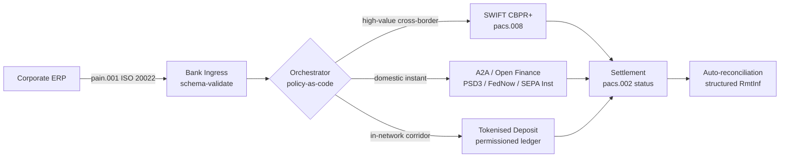

---

# Front Matter (YAML)

author: "contact@sebastienrousseau.com (Sebastien Rousseau)"
banner_alt: "سفينة حاويات في ميناء عميق المياه عند الفجر — ترمز إلى الحركة متعددة القضبان وعابرة الحدود للقيمة المؤسسية عبر شبكات تسوية ISO 20022 والتمويل المفتوح والودائع المُرمَّزة في 2026"
banner_height: "1597"
banner_width: "2584"
banner: "https://cloudcdn.pro/stocks/images/viktor-forgacs-KxVRDiFdTVo.webp"
cdn: "https://cloudcdn.pro"
charset: "UTF-8"
cname: "sebastienrousseau.com"
copyright: "© Copyright 2025 - 2026 - Sebastien Rousseau. All rights reserved."
date: "June 24, 2026"
description: "كيف تُعيد ISO 20022 وA2A والتمويل المفتوح بموجب PSD3/FiDA والودائع المُرمَّزة تشكيل خزينة الشركات عابرة الحدود إلى جانب SWIFT في 2026."
format-detection: "telephone=no"
hreflang: "ar"
icon: "https://cloudcdn.pro/clients/sebastienrousseau/v1/logos/sebastienrousseau.svg"
id: "https://sebastienrousseau.com/2026-06-24-cross-border-iso-20022-open-finance-tokenised-deposits-treasury-2026"
image_alt: "صورة بالأبيض والأسود لـ Sebastien Rousseau"
image_height: "162"
image_width: "162"
image: "https://cloudcdn.pro/stocks/images/sebastienrousseau.webp"
keywords: "المدفوعات عابرة الحدود, ISO 20022, التمويل المفتوح, PSD3, FiDA, الودائع المُرمَّزة, العملات المستقرة, A2A, خزينة الشركات, CIB, Nexi, Mastercard, متعدد القضبان, pacs.008, pain.001, SWIFT, FedNow, SEPA Instant, RTP, CBPR+"
language: "ar-SA"
last_reviewed: "2026-06-24"
layout: "report"
locale: "ar_SA"
logo_alt: "شعار Sebastien Rousseau"
logo_height: "44"
logo_width: "44"
logo: "https://cloudcdn.pro/clients/sebastienrousseau/v1/logos/sebastienrousseau.svg"
menu: ""
measurementID: "G-169G4ET5HQ"
name: "Sebastien Rousseau"
permalink: "https://sebastienrousseau.com/2026-06-24-cross-border-iso-20022-open-finance-tokenised-deposits-treasury-2026"
rating: "general"
referrer: "no-referrer"
robots: "index, follow"
schema: "FAQPage, Article"
seo_title: "عابر الحدود 2026: ISO 20022 وتمويل مفتوح وقضبان مُرمَّزة"
short_name: "sebastienrousseau"
subtitle: "خزينة الشركات عابرة الحدود في 2026 تعمل بميكانيكا متعددة القضبان — ISO 20022 بوصفه القواعد المشتركة، وA2A والتمويل المفتوح بوصفهما القضيب الموجَّه للعميل، والودائع المُرمَّزة بوصفها ساق التسوية بالجملة، مع بقاء SWIFT راسياً للذيل الطويل."
tags: "المدفوعات عابرة الحدود, ISO 20022, التمويل المفتوح, PSD3, FiDA, الودائع المُرمَّزة, A2A, خزينة الشركات, CIB, متعدد القضبان, pacs.008, pain.001, SWIFT, FedNow, SEPA Instant, RTP, CBPR+"
theme-color: "0, 83, 191"
title: "عابر الحدود 2026: ISO 20022 والتمويل المفتوح والودائع المُرمَّزة في خزينة الشركات"
url: "https://sebastienrousseau.com/2026-06-24-cross-border-iso-20022-open-finance-tokenised-deposits-treasury-2026"
viewport: "width=device-width, initial-scale=1, shrink-to-fit=no"

# RSS - The RSS feed front matter (YAML).
atom_link: "https://sebastienrousseau.com/2026-06-24-cross-border-iso-20022-open-finance-tokenised-deposits-treasury-2026/rss.xml"
category: "Technology"
docs: https://validator.w3.org/feed/docs/rss2.html
generator: "Static Site Generator (SSG) (version 0.0.26)"
item_description: "كيف تُعيد ISO 20022 وA2A والتمويل المفتوح بموجب PSD3/FiDA والودائع المُرمَّزة تشكيل خزينة الشركات عابرة الحدود إلى جانب SWIFT في 2026."
item_guid: "https://sebastienrousseau.com/2026-06-24-cross-border-iso-20022-open-finance-tokenised-deposits-treasury-2026/rss.xml"
item_link: "https://sebastienrousseau.com/2026-06-24-cross-border-iso-20022-open-finance-tokenised-deposits-treasury-2026/rss.xml"
item_pub_date: "Wed, 24 Jun 2026 07:07:07 +0000"
item_title: "عابر الحدود 2026: ISO 20022 والتمويل المفتوح والودائع المُرمَّزة في خزينة الشركات"
last_build_date: "Wed, 24 Jun 2026 06:06:06 +0000"
managing_editor: "contact@sebastienrousseau.com (Sebastien Rousseau)"
pub_date: "Wed, 24 Jun 2026 07:07:07 +0000"
ttl: "60"
type: "article"
webmaster: "contact@sebastienrousseau.com"

# Apple - The Apple front matter (YAML).
apple_mobile_web_app_orientations: "portrait"
apple_touch_icon_sizes: "192x192"
apple-mobile-web-app-capable: "yes"
apple-mobile-web-app-status-bar-inset: "black"
apple-mobile-web-app-status-bar-style: "black-translucent"
apple-mobile-web-app-title: "عابر الحدود 2026: ISO 20022 وتمويل مفتوح وقضبان مُرمَّزة"
apple-touch-fullscreen: "yes"

# MS Application - The MS Application front matter (YAML).

msapplication-navbutton-color: "0, 83, 191"

# Twitter Card - The Twitter Card front matter (YAML).

twitter_card: "summary_large_image"
twitter_creator: "@wwdseb"
twitter_description: "كيف تُعيد ISO 20022 وA2A والتمويل المفتوح بموجب PSD3/FiDA والودائع المُرمَّزة تشكيل خزينة الشركات عابرة الحدود إلى جانب SWIFT في 2026."
twitter_image: "https://cloudcdn.pro/clients/sebastienrousseau/v1/logos/sebastienrousseau.svg"
twitter_image_alt: "شعار Sebastien Rousseau"
twitter_site: "@wwdseb"
twitter_title: "عابر الحدود 2026: ISO 20022 وتمويل مفتوح وقضبان مُرمَّزة"
twitter_url: "https://sebastienrousseau.com/2026-06-24-cross-border-iso-20022-open-finance-tokenised-deposits-treasury-2026"

excerpt: "خزينة الشركات عابرة الحدود في 2026 مسألة هندسية متعددة القضبان. ISO 20022 هو القواعد المشتركة، وA2A والتمويل المفتوح بموجب PSD3/FiDA هما القضيب الموجَّه للعميل، والودائع المُرمَّزة تتولى ساق التسوية بالجملة، وSWIFT لا يزال يرسو الذيل الطويل. العمل المثير في طبقة التنسيق، لا في النموذج."

# Humans.txt - The Humans.txt front matter (YAML).
author_website: "https://sebastienrousseau.com"
author_twitter: "@wwdseb"
author_location: "London, UK"
thanks: "شكراً على القراءة!"
site_last_updated: "2026-06-24"
site_standards: "HTML5, CSS3, RSS, Atom, JSON, XML, YAML, Markdown, TOML"
site_components: "Kaishi, Kaishi Builder, Kaishi CLI, Kaishi Templates, Kaishi Themes"
site_software: "Static Site Generator, Rust"

---

# عابر الحدود 2026: ISO 20022 والتمويل المفتوح والودائع المُرمَّزة في خزينة الشركات

<!-- lead-start -->
<aside class="post-lead" aria-label="ملخص المقال">

<strong>الخلاصة.</strong> خزينة الشركات عابرة الحدود في 2026 تعمل على أربعة قضبان متوازية — SWIFT CBPR+، وA2A الفوري بموجب PSD3/FiDA، والودائع المُرمَّزة، وقضبان العملات المستقرة — مُجمَّعة بـ ISO 20022 بوصفه القواعد المشتركة. عمل فرق CIB وخزينة الشركات هو التنسيق، لا اختيار القضيب.

<strong>النقاط الرئيسة</strong>

<ul class="post-lead-takeaways">
  <li><strong>تعدد القضبان هو الوضع الافتراضي.</strong> لا يُغطِّي قضيب واحد كل ممر، وكل حجم تذكرة، وكل توقيت قطع. الخزينة تختار القضيب لكل دفعة، لا لكل بنك.</li>
  <li><strong>ISO 20022 هو اللغة المشتركة.</strong> pacs.008 وpacs.009 وpain.001 تحمل الآن بيانات التحويل عبر RTGS والفوري وA2A وقضبان الودائع المُرمَّزة — مما يجعل قرارات التوجيه مبنية على البيانات لا مقيَّدة بالقضيب.</li>
  <li><strong>التمويل المفتوح يُوسِّع المحيط.</strong> PSD3 وFiDA يدفعان نموذج المصرفية المفتوحة إلى المعاشات والتأمين وبيانات الخزينة؛ وNexi وMastercard يبنيان طبقة التنسيق التي تستهلكها الشركات.</li>
  <li><strong>الودائع المُرمَّزة هي ساق الجملة.</strong> الودائع المُرمَّزة الصادرة من البنوك وقضبان العملات المستقرة المتكاملة تقع تحت القضيب الفوري الموجَّه للعميل وتُسوِّي ساق الجملة بنحو T+0.</li>
</ul>

<strong>قراءات ذات صلة:</strong> <a href="https://sebastienrousseau.com/2026-06-07-autonomous-treasury-index-programmable-liquidity-tokenised-deposits-2026">مؤشر الخزينة المستقلة 2026: السيولة القابلة للبرمجة والودائع المُرمَّزة</a>، <a href="https://sebastienrousseau.com/2026-06-15-pacs008-automation-iso-20022-interbank-payments-2026">أتمتة pacs.008: مدفوعات ISO 20022 بين البنوك في 2026</a>.

</aside>
<!-- lead-end -->

> **ملخص تنفيذي.** خزينة الشركات عابرة الحدود في 2026 مسألة هندسية متعددة القضبان قبل أن تكون مسألة إدارة علاقات. تُوسِّع PSD3 ولائحة الوصول إلى البيانات المالية (FiDA) محيط المصرفية المفتوحة ليشمل بيانات خزينة الشركات؛ وانتقال SWIFT من MT إلى MX في نوفمبر 2026 يجعل pacs.008 المتوافق مع CBPR+ التنسيق الوحيد القابل للتطبيق للرسائل بين البنوك عابرة الحدود؛ والودائع المُرمَّزة وقضبان العملات المستقرة المُنظَّمة تتولى ساق التسوية بالجملة بنحو T+0 داخل الشبكات المُصرَّح بها. CIB الذي يفوز في هذه الدورة ليس من يختار قضيباً واحداً؛ بل من يُهندِس طبقة التنسيق التي تربطها. تستعرض هذه المقالة معمار القضبان الأربعة (A2A بموجب PSD3، وSWIFT CBPR+، والودائع المُرمَّزة الصادرة عن البنوك، والعملات المستقرة المُنظَّمة) — ما يُجيده كل قضيب، وأين تقع حدود التعرُّض الائتماني، وما الذي يجب أن تفرضه طبقة التنسيق بالسياسة-ككود فوقها كي ترى الشركة دفعة واحدة ويرى المُشرف أثراً قابلاً للتدقيق واحداً.

شركة صناعية أوروبية تدفع لمورِّد برازيلي 4.2 مليون يورو في صبيحة الأربعاء. محطة عمل الخزينة لا تختار بنكاً. تختار قضيباً — تسلسلاً من القضبان. التعليمات الموجَّهة للعميل تصل في رسالة A2A من نوع pain.001 مُوجَّهة عبر مُقدِّم تمويل مفتوح بموجب PSD3. والبنك يُجري الرحلة عبر ولايتي مراسلة على ودائع مُرمَّزة داخل شبكة CIB خاصة. والذيل الطويل — تصفية فاتورة بقيمة 80,000 دولار أمريكي لمورِّد فرعي ليس لديه علاقة وديعة مُرمَّزة — لا يزال يمر عبر SWIFT CBPR+ بوصفه pacs.008. العميل يرى دفعة واحدة. والمعمار يرى أربعة قضبان. ISO 20022 هو السبب الوحيد لتماسكها.

هذا هو نموذج التشغيل الذي يصفه Mastercard حين يتحدث عن [التطوُّر من المصرفية المفتوحة إلى التمويل المفتوح](https://www.mastercard.com/us/en/news-and-trends/Insights/2026/open-banking-to-open-finance-the-evolution-of-financial-data.html "Mastercard: من المصرفية المفتوحة إلى التمويل المفتوح، تطوُّر البيانات المالية") — بيانات ومدفوعات مدموجة في طبقة تنسيق واحدة، يختار النظام القضيب لا العميل. والسؤال المثير لتقنيي المصارف الكبار ليس أيُّ قضيب يفوز. السؤال هو كيف تُهندَس طبقة التنسيق وتُحكَم وتُسوَّى.

## 01. من البطاقات إلى A2A — تحوُّل التمويل المفتوح

قضبان البطاقات لا تتلاشى. بل يُعاد تأطيرها.

خلال 2025 وحتى 2026، وسَّعت [PSD3 ولائحة الوصول إلى البيانات المالية (FiDA)](https://www.consultancy.uk/news/42202/orchestrating-open-banking-for-platform-growth-2026-outlook "Consultancy.uk: تنسيق المصرفية المفتوحة لنمو المنصة، آفاق 2026") التزام المصرفية المفتوحة إلى ما هو أبعد من حسابات الدفع ليشمل المعاشات والرهون والادخار والتأمين وبيانات خزينة الشركات. الانعكاس على خزينة الشركات مباشر: مدير علاقات CIB يستطيع الآن استهلاك صورة السيولة الكاملة لشركة عبر عدة بنوك من خلال عقد API واحد، بتعليمات من الشركة.

مشغِّلان يبنيان طبقة التنسيق التي ستستهلكها الشركات بشكل واضح. Nexi مدَّ بصمته في الاستحواذ ليشمل مبادرة A2A عبر SEPA Instant وممرات RTGS عموم أوروبا، أصيلة في ISO 20022 من الطرف إلى الطرف. ومنصة التمويل المفتوح من Mastercard — المرتكزة على استحواذه على Aiia وFinicity — توفِّر طبقة تجميع البيانات والموافقة في الأسفل، مع طفو مبادرة الدفع عبر نفس عقار API الذي كان يخدم سابقاً تفويضات البطاقات.

التحوُّل يهم لثلاثة أسباب:

1. **اقتصاديات الوحدة.** A2A المُبادَر به بموجب PSD3 يُجرِّد رسوم التبادل من الدفعة. لتدفقات B2B عالية التذكرة، الوفر جوهري؛ ولتدفقات المستهلكين منخفضة التذكرة، تتداعى حزمة كلفة التاجر.
2. **جودة البيانات.** A2A بموجب ISO 20022 يحمل بيانات تحويل مُهيكَلة لم تستطعها البطاقات قط. ومعدلات المطابقة الآلية فوق 95% باتت الحد الأدنى للمشاركة.
3. **نموذج المخاطر.** A2A تحويل ائتماني، لا تفويض بطاقة. ومساحة الاحتيال، ونموذج الاسترداد، ونموذج النزاع كلها مختلفة. وعلى فرق خزينة الشركات أن تفهم أن طبقة حماية العميل يُعاد بناؤها، لا توارثها.

CIB الذي يبيع عرضاً متعدد القضبان في 2026 يبيع التنسيق — لا الوصول. الوصول الآن مُنظَّم.

## 02. ISO 20022 بوصفه اللغة المشتركة عبر القضبان

السبب في صلاحية تعدد القضبان أصلاً هو أن تنسيق الرسالة بات متسقاً عبر القضبان.

أوضحت لجنة المدفوعات وبنى السوق التابعة لـ BIS (CPMI) الحجة المعمارية في [متطلبات تنسيق ISO 20022 لتعزيز المدفوعات عابرة الحدود](https://www.bis.org/cpmi/publ/d230.pdf "BIS CPMI: متطلبات تنسيق ISO 20022 لتعزيز المدفوعات عابرة الحدود"). والانتقال في نوفمبر 2025 إلى CBPR+ أغلق حقبة MT103 / MT202 للرسائل بين البنوك عابرة الحدود. ومنذ تلك اللحظة، كل قضيب رئيس — SWIFT وFedNow وSEPA Instant وRTP وأنظمة الدفع الفوري الكبرى في آسيا وأمريكا اللاتينية — يتحدث قواعد pacs.008 / pacs.009 / pain.001 ذاتها.

الانعكاس العملي على خزينة الشركات:

- **التوجيه مبني على البيانات.** محطة عمل الخزينة تستطيع قراءة pain.001 مرة واحدة واختيار القضيب لكل دفعة بناءً على الممر وحجم التذكرة وتوقيت القطع وعلاقة الطرف المقابل — دون إعادة تخطيط الرسالة.
- **بيانات التحويل تنجو من القفزة.** حقول التحويل المُهيكَلة (`<RmtInf><Strd>`) تمر عبر سيقان المراسلة دون اقتطاع. ومعدلات المطابقة الآلية ترتفع لأن البيانات لم تَعُد تضيع عند حدود القضيب.
- **فحص العقوبات يصبح قابلاً للتدقيق.** حقول `<Dbtr>` / `<Cdtr>` / `<DbtrAgt>` / `<CdtrAgt>` المُهيكَلة بمراجع LEI تحل محل فحص الأسماء بنص حر. ومعدلات الإصابة تنخفض. وطوابير التحقيق تتقلَّص.

المخطط أدناه يتتبَّع رسالة pain.001 واحدة عبر مدخل البنك، إلى منسِّق السياسة-ككود، ثم خروجاً إلى أيِّ قضيب يفرضه الممر وحجم التذكرة — رسالة واحدة، قضبان متعددة، دون إعادة تخطيط.

ثمن هذا الاتساق هو الانضباط الهندسي. ISO 20022 متساهل. يمكن لبنكين أن يكونا متوافقين تماماً مع CBPR+ ومع ذلك يُنتجان رسائل pacs.008 تختلف في استخدام الحقول، ومجموعة الأحرف، وبنية بيانات التحويل. CIB الذي يفوز في عابر الحدود في 2026 يفرض ملف رسائل أصرم مما يتطلبه المعيار — ويرفض عند التحليل، لا عند التسوية.

## 03. الودائع المُرمَّزة والقضبان المستقرة

ساق التسوية بالجملة هو حيث تصبح قصة القضبان مثيرة.

صورة 2026، الموثَّقة جيداً في [تحليل Trade Treasury Payments للأتمتة وقضبان الطوارئ وISO 20022 والعملات المستقرة](https://tradetreasurypayments.com/articles/automation-contingency-rails-iso-20022-and-stablecoins-the-2026-trends-reshaping-corporate-finance-and-b2b-payments "Trade Treasury Payments: الأتمتة وقضبان الطوارئ وISO 20022 والعملات المستقرة، اتجاهات 2026 المُعيدة لتشكيل تمويل الشركات ومدفوعات B2B")، تُقسِّم طبقة التسوية بالجملة إلى نموذجين مختلفين بنيوياً.

**الودائع المُرمَّزة الصادرة عن البنوك.** يُصدر بنك تجاري التزاماً مُرمَّزاً على دفتر مُصرَّح به — JPM Coin، ورمز ودائع HSBC المرتبط بـ Orion، والمكافآت الأوروبية الكبرى لـ CIB. الرمز مطالبة مباشرة على البنك المُصدِر. والتسوية بنحو T+0 داخل الشبكة. والامتثال مسؤولية البنك المُصدِر. والقضيب مُنظَّم بالكامل، ومتتبَّع بالكامل، ومحدود بالمشاركين الذين قبلهم المُصدر.

**قضبان العملات المستقرة المتكاملة.** عملة مستقرة مُنظَّمة — مدعومة بالكامل، ومُدقَّقة، وتعمل بموجب MiCA أو النظام الإقليمي المعادل — تُسوِّي ممراً لا تصله الودائع المُرمَّزة الصادرة عن البنوك بعد. والرمز مطالبة على الاحتياطي، لا على ميزانية بنك. والامتثال مشترك بين المُصدر وممر الدخول وممر الخروج.

النموذجان ليسا متنافسَين. هما متراصَّان. منتج CIB عابر الحدود في 2026 يستخدم عادة الودائع المُرمَّزة الصادرة عن البنوك للساق داخل الشبكة وعملة مستقرة مُنظَّمة للممر حيث ينتهي القضيب داخل الشبكة. والشركة ترى دفعة ISO 20022 واحدة. وقصة التسوية أسفل ذلك متعددة الرموز.

السؤال على مستوى المجلس هو نفسه الذي تطرحه لجان المخاطر التشغيلية منذ أولى تجارب السيولة القابلة للبرمجة: من يحمل التعرُّض الائتماني على الرمز، ولأي مدة؟ الودائع المُرمَّزة تعطي إجابة نظيفة — البنك المُصدر، حتى الحرق. وقضبان العملات المستقرة المتكاملة تعطي إجابة أكثر تعقيداً — الاحتياطي، وفق دورة التدقيق وضمان الاسترداد. وفريق خزينة لا يوثق الإجابة لكل قضيب لكل ممر يحمل مخاطر ائتمانية غير مقيسة على ميزانيته.

## 04. حزمة الخزينة المستقلة

فوق طبقة القضبان تقع طبقة التنسيق. وفوق طبقة التنسيق تقع طبقة الوكيل.

عرضتُ المعمار بالتفصيل في [مؤشر الخزينة المستقلة 2026: السيولة القابلة للبرمجة والودائع المُرمَّزة](https://sebastienrousseau.com/2026-06-07-autonomous-treasury-index-programmable-liquidity-tokenised-deposits-2026 "Sebastien Rousseau: مؤشر الخزينة المستقلة 2026"). الخلاصة: الخزينة الوكيلية في 2026 هي طبقة التنسيق، مُعبَّراً عنها كسياسة بوصفها شيفرة، مع وكلاء مُقيَّدين يُنفِّذون داخلها.

الحزمة هي:

1. **طبقة القضبان.** SWIFT CBPR+، وA2A الفوري، والودائع المُرمَّزة، والعملات المستقرة المُنظَّمة. كل قضيب له ملف منشور، وجدول توقيت قطع، ومنحنى تكلفة، ونموذج نهائية تسوية.
2. **طبقة التنسيق.** ISO 20022 داخلاً، ISO 20022 خارجاً. قرار القضيب لكل دفعة بناءً على الممر والتذكرة وتوقيت القطع وعلاقة الطرف المقابل والسياسة. السياسة مُصدَّرة وموقَّعة وقابلة للتدقيق.
3. **طبقة الوكيل.** وكلاء الخزينة المُقيَّدون يُنفِّذون سياسة التنسيق بحدود استدعاء أداة وسجلات تدقيق ومفاتيح الإيقاف الطارئ. الوكيل لا يختار القضيب. السياسة تختار القضيب. الوكيل يُشغِّل السياسة.
4. **طبقة المطابقة.** رسائل ISO 20022 من نوع pacs.008 / pacs.002 / camt.054 تُطابق مع تعليمة pain.001 الأصلية، مع بيانات تحويل مُهيكَلة تُغلق الحلقة دون تدخل يدوي.

CIB الذي يبيع هذه الحزمة في 2026 يبيع أربعة أشياء في وقت واحد — ويُسعِّرها بشكل منفصل. والشركة التي تشتريها تشتري خياراً عبر القضبان، بمعيار رسائل واحد، وطبقة سياسة واحدة، وتغذية مطابقة واحدة. هذا هو التحوُّل المعماري. كل ما عداه تفصيل تنفيذي.

## الأسئلة الشائعة

**هل "التمويل المفتوح" مجرد إعادة تسمية للمصرفية المفتوحة؟**
لا. غطَّت المصرفية المفتوحة بموجب PSD2 حسابات الدفع فقط. أما PSD3 ولائحة الوصول إلى البيانات المالية (FiDA) فتمدِّان التزام مشاركة البيانات ليشمل المعاشات والرهون والادخار والتأمين وبيانات خزينة الشركات. الانعكاس على خزينة الشركات مباشر: مدير علاقات CIB يستطيع الآن استهلاك صورة السيولة الكاملة لشركة عبر عدة بنوك من خلال عقد API واحد، بتعليمات من الشركة، لا فقط تاريخ حساب الدفع.

**لماذا تكون طبقة التنسيق هي محور المعمار، لا القضيب؟**
لأن القضبان باتت سلعاً. SWIFT CBPR+ pacs.008، وA2A بموجب PSD3، والودائع المُرمَّزة، والعملات المستقرة المُنظَّمة، جميعها تحمل قواعد ISO 20022 ذاتها على مستوى الرسالة. ما يُميِّز CIB 2026 هو محرِّك السياسة-ككود الذي يختار القضيب لكل دفعة بناءً على الممر وحجم التذكرة ومتطلب نهائية التسوية وعلاقة الطرف المقابل — ويُسجِّل الاختيار في قياسات التدقيق التي سيسأل عنها المُشرف. بدون هذا المحرِّك، تعدد القضبان مجرد خيارات بلا حوكمة.

**أين تقع حدود التعرُّض الائتماني على ساق وديعة مُرمَّزة؟**
الودائع المُرمَّزة الصادرة عن البنوك على دفتر مُصرَّح به هي مطالبة مباشرة على البنك المُصدِر — التعرُّض الائتماني ينتهي عند الحرق. أما قضبان العملات المستقرة المُنظَّمة (الخاضعة لـ MiCA في الاتحاد الأوروبي، ونظام ورقة المناقشة لبنك إنجلترا في المملكة المتحدة، ومثائله في أماكن أخرى) فهي مطالبة على الاحتياطي، مع نافذة تعرُّض خاضعة لدورة التدقيق وشروط ضمان الاسترداد. وفريق خزينة لا يوثق الإجابة لكل قضيب لكل ممر يحمل مخاطر ائتمانية غير مقيسة على ميزانيته.

**ماذا يحدث لـ SWIFT في هذا المعمار؟**
SWIFT لا يختفي — بل يرسو الذيل الطويل. الممرات التي لا تصلها الودائع المُرمَّزة الصادرة عن البنوك بعد (معظم علاقات المورِّدين الفرعيين في الأسواق الناشئة، ومعظم التدفقات منخفضة التكرار / منخفضة التذكرة عابرة الحدود)، والممرات التي تتطلب فيها الشركة أو البنك أثر تدقيق المصرفية المراسلة بموجب CBPR+، تستمر على SWIFT pacs.008. معمار 2026 هو "SWIFT + قضبان جديدة"، لا "قضبان جديدة بدلاً من SWIFT".

**ماذا تشتري الشركة حين تشتري هذه الحزمة؟**
خياراً عبر القضبان، بمعيار رسائل واحد (ISO 20022)، وطبقة سياسة واحدة (محرِّك التنسيق)، وتغذية مطابقة واحدة (حالة pacs.002 + تأكيد camt.054 + كشوف camt.053 المُهيكَلة). الشركة لا تدفع مقابل أربع وصلات قضبان منفصلة. بل تدفع مقابل طبقة التنسيق التي تجعل القضبان الأربعة تتصرَّف كقضيب واحد تشغيلياً — وأثر التدقيق الذي يُتيح لها الإجابة عن "أيُّ قضيب ركبته دفعة 4.2 مليون يورو تلك، ولماذا؟" في صباح الطلب الإشرافي التالي.

## الخاتمة

خزينة الشركات عابرة الحدود في 2026 مسألة هندسية متعددة القضبان. ISO 20022 هو القواعد التي تجعل تعدد القضبان قابلاً للمعالجة. وPSD3 وFiDA يُوسِّعان محيط البيانات ويفرضان التمويل المفتوح على سير عمل خزينة الشركات. والودائع المُرمَّزة والعملات المستقرة المُنظَّمة تتولى ساق التسوية بالجملة. وSWIFT لا يزال يرسو الذيل الطويل.

CIB الذي يفوز هو الذي يبني طبقة التنسيق — لا الذي يختار قضيباً واحداً ويراهن بالامتياز عليه. وفريق خزينة الشركات الذي يفوز هو الذي يوثق التعرُّض الائتماني لكل قضيب لكل ممر، ويفرض ملف ISO 20022 أصرم مما يتطلبه المُنظِّم، ويعامل قرار القضيب بوصفه سياسة، لا حكماً لكل دفعة على حدة.

العمل المثير في طبقة التنسيق. ابنوها بعناية.

## المراجع

بنك التسويات الدولية، لجنة المدفوعات وبنى السوق (2023). *متطلبات بيانات ISO 20022 المُنسَّقة لتعزيز المدفوعات عابرة الحدود* (أوراق CPMI رقم 230). متاح على: [https://www.bis.org/cpmi/publ/d230.htm](https://www.bis.org/cpmi/publ/d230.htm "BIS CPMI 230 — متطلبات بيانات ISO 20022 المُنسَّقة")

بنك التسويات الدولية (2024). *مشروع Agorá: المدفوعات عابرة الحدود بودائع البنوك التجارية المُرمَّزة وأموال البنك المركزي*. مركز الابتكار في BIS. متاح على: [https://www.bis.org/about/bisih/topics/fmis/agora.htm](https://www.bis.org/about/bisih/topics/fmis/agora.htm "BIS Project Agorá")

بنك إنجلترا (2023). *النظام التنظيمي لأنظمة الدفع النظامية باستخدام العملات المستقرة ومُقدِّمي الخدمات ذوي الصلة — ورقة مناقشة*. متاح على: [https://www.bankofengland.co.uk/paper/2023/dp/regulatory-regime-for-systemic-payment-systems-using-stablecoins-and-related-service-providers](https://www.bankofengland.co.uk/paper/2023/dp/regulatory-regime-for-systemic-payment-systems-using-stablecoins-and-related-service-providers "Bank of England — ورقة مناقشة النظام التنظيمي للعملات المستقرة")

المفوضية الأوروبية (2023). *مقترح توجيه بشأن خدمات الدفع وخدمات النقود الإلكترونية (PSD3)*. متاح على: [https://finance.ec.europa.eu/regulation-and-supervision/financial-services-legislation/implementing-and-delegated-acts/payment-services-directive_en](https://finance.ec.europa.eu/regulation-and-supervision/financial-services-legislation/implementing-and-delegated-acts/payment-services-directive_en "European Commission — مقترح توجيه خدمات الدفع")

البرلمان الأوروبي والمجلس (2023). *اللائحة (الاتحاد الأوروبي) 2023/1114 بشأن أسواق الأصول المشفَّرة (MiCA)*. متاح على: [https://eur-lex.europa.eu/eli/reg/2023/1114/oj](https://eur-lex.europa.eu/eli/reg/2023/1114/oj "Regulation (EU) 2023/1114 — Markets in Crypto-Assets (MiCA)")

مجموعة العمل المالي (2023). *المعايير الدولية لمكافحة غسل الأموال وتمويل الإرهاب — التوصية 16 بشأن التحويلات البرقية*. متاح على: [https://www.fatf-gafi.org/en/publications/Fatfrecommendations/Fatf-recommendations.html](https://www.fatf-gafi.org/en/publications/Fatfrecommendations/Fatf-recommendations.html "FATF Recommendations")

المنظمة الدولية للتوحيد القياسي (2020). *ISO 17442 الخدمات المالية — مُعرِّف الكيان القانوني (LEI)*. متاح على: [https://www.gleif.org/en/about-lei/iso-17442-the-lei-code-structure](https://www.gleif.org/en/about-lei/iso-17442-the-lei-code-structure "ISO 17442 — Legal Entity Identifier")

SWIFT (2024). *إرشادات استخدام المدفوعات عابرة الحدود والإبلاغ المُحسَّن (CBPR+)*. متاح على: [https://www.swift.com/standards/iso-20022/iso-20022-programme](https://www.swift.com/standards/iso-20022/iso-20022-programme "SWIFT CBPR+ usage guidelines")

<!-- enrich-start -->
<aside class="author-card" aria-label="نبذة عن الكاتب"><strong class="author-card-name"><a href="/about/index.html">Sebastien Rousseau</a></strong>تقني مصرفي كبير يكتب عن الذكاء الاصطناعي التطبيقي، وترحيل ISO 20022، والتشفير ما بعد الكمي للخدمات المالية، والتحوُّل البنيوي للمدفوعات بالجملة.أكثر من 20 عاماً عبر HSBC Commercial &amp; Investment Bank وPayPal وBarclays وShazam وAKQA وVirgin Group. <a href="/about/index.html">الملف الكامل</a> &middot; <a href="https://www.linkedin.com/in/sebastienrousseau/" rel="external noopener">LinkedIn</a> &middot; <a href="https://github.com/sebastienrousseau" rel="external noopener">GitHub</a></aside>

آخر مراجعة <time datetime="2026-06-24">2026-06-24</time>.

<!-- enrich-end -->
</content>
</invoke>