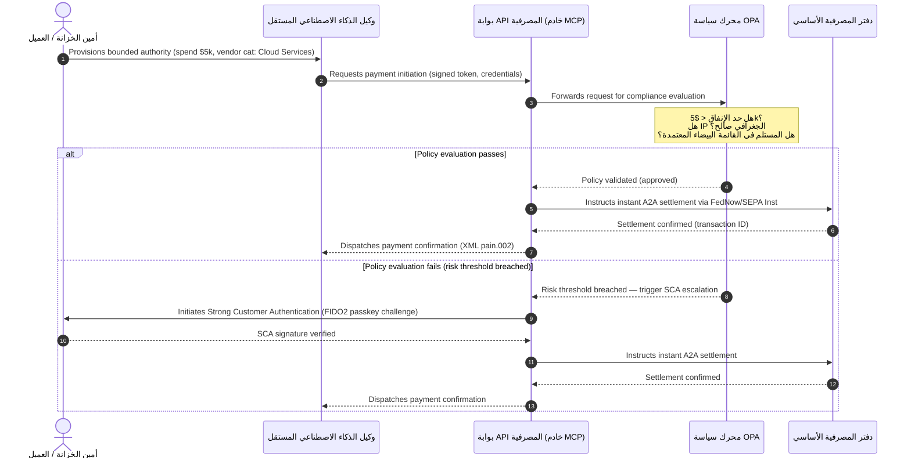

# آفاق المدفوعات العالمية 2026: النموذج التشغيلي والمخاطر والإيرادات في عالم وكيل غير مرئي فوري

تتحدد دورة المدفوعات العالمية لعام 2026 بثلاث قوى متقاربة — التجارة الوكيلة، والمدفوعات المدمجة غير المرئية، والتنفيذ الفوري — تستند إلى دفتر موحد مُرمَّز في إطار مشروع Agorá وموعد نهائي صارم لتحول SWIFT للعنوان المنظَّم في نوفمبر 2026.

<!-- lead-start -->
<aside class="post-lead" aria-label="ملخص المقالة">

<strong>الخلاصة.</strong> انتقل مشهد المدفوعات لعام 2026 من هجرة الرسائل إلى نموذج تشغيلي متعدد الأبعاد تُمليه فيه المخاطر والإيرادات سرعةُ التنفيذ الفوري. تُلخّص هذه المقالة آفاق J.P. Morgan وGlobal Payments وHSBC وPayments Association لعام 2026 في خطة تشغيلية رباعية الركائز لبنوك G-SIB، تغطي التجارة الوكيلة المُبادَر بها من النموذج، وواجهات برمجة الخزانة الدائمة العمل، والدفاتر الموحدة المُرمَّزة في إطار مشروع Agorá التابع لبنك التسويات الدولية، والموعد النهائي لعنوان SWIFT المنظَّم في 14 نوفمبر 2026.

<strong>أبرز النقاط</strong>

<ul class="post-lead-takeaways">
  <li><strong>تفتح التجارة الوكيلة جبهة جديدة للمسؤولية المُفوَّضة.</strong> يُتوقع أن تتوسط وكلاء الذكاء الاصطناعي المستقلون في تجارة سنوية تتراوح بين 3 و5 تريليونات دولار بحلول 2030. على البنوك تحديد بوابات MCP، وتفويض SCA في إطار PSD3/PSR، وملكية KYC/AML داخل سلاسل الدفع متعددة الوكلاء.</li>
  <li><strong>أصبحت السيولة الدائمة خط أساس تشغيلي وتنظيمي.</strong> تُقلّل واجهات برمجة الخزانة على مدار الساعة طوال أيام الأسبوع والحسابات الافتراضية من النقد المحتجز وترفع سقف الصمود. وفي إطار DORA، يجب أن تستند منتجات السيولة الفورية إلى بنية تحتية نشطة-نشطة متعددة المواقع الجغرافية تحافظ على توافر بنسبة 99.999%.</li>
  <li><strong>ارتقى الترميز إلى دفاتر موحدة منظَّمة.</strong> يُعدّ مشروع Agorá الإطارَ الأكبر بين القطاعين العام والخاص لودائع البنوك التجارية المُرمَّزة واحتياطيات البنوك المركزية. تحتاج البنوك إلى رحلة ترميز من خمس خطوات بمعالجة احترازية صريحة.</li>
  <li><strong>تحول العنوان المنظَّم في 14 نوفمبر 2026 له موعد صارم.</strong> ستؤدي حقول العنوان البريدي غير المنظَّمة في رسائل CBPR+ وSEPA إلى رفض فوري. ويلزم حوكمة بيانات نظيفة عبر فرق المنتج والتكنولوجيا والامتثال.</li>
</ul>

<strong>قراءات ذات صلة:</strong> <a href="https://sebastienrousseau.com/2026-06-23-iso-20022-pain001-programmable-liquidity-autonomic-treasury-2026">من Pain.001 إلى السيولة القابلة للبرمجة: ISO 20022 بوصفه الجهاز العصبي الذاتي للخزانة في 2026</a>، <a href="https://sebastienrousseau.com/2026-06-24-cross-border-iso-20022-open-finance-tokenised-deposits-treasury-2026">عبر الحدود 2026: ISO 20022 والتمويل المفتوح والودائع المُرمَّزة في خزانة الشركات</a>، <a href="https://sebastienrousseau.com/2026-06-25-quantum-dawn-cib-kyberlib-quantum-resilient-payments-stack-2026">فجر الكم لـ CIB: من KyberLib إلى منظومة مدفوعات صامدة للكم</a>.

</aside>
<!-- lead-end -->

تُمثّل دورة 2026-2028 نافذةً هيكلية لبنوك المعاملات العالمية. لم تعد بنية المدفوعات الحديثة مرفقاً إدارياً — بل صارت جوهرَ استراتيجية التكنولوجيا المصرفية. فداخل بنوك G-SIB والمؤسسات الإقليمية الكبرى، تقاربت التكنولوجيا والتنظيم وتوقعات العملاء في مستوى تشغيلي واحد.

تُحدّد ثلاث قوى هذه الدورة، وتتطابق كل منها مع شأن من شؤون الإدارة التنفيذية العليا.

- **التجارة الوكيلة** — توزيع القنوات، وتصميم المنتج، وتحديد المسؤولية، وإدارة مخاطر النماذج تحت رقابة المشرفين.
- **المدفوعات غير المرئية** — تجربة العميل، مع مخاطر الإقصاء من الوساطة عندما تفشل البنوك في تضمين دفترها في واجهات الشركات والتاجر.
- **التنفيذ الفوري** — سرعة رأس المال، مع ما يستتبعه من تغيير في إدارة السيولة، ومخاطر الائتمان، والصمود التشغيلي، والدفاع ضد الاحتيال.

المخاطر المالية جوهرية. يتوسع الاحتيال في السرعة والتعقيد؛ والمواعيد التنظيمية صارمة؛ والبنوك التي تُحدّث أنظمتها الأساسية استباقياً تفتح فرصاً كبيرة للإيرادات من الرسوم. وتكلفة التقاعس هي العكس تماماً: رفض فوري للمعاملات، واختناقات تشغيلية، وعقوبات تنظيمية، وتآكل سريع للحصة السوقية.

## تقارب سلطات المدفوعات العالمية

يُلخّص هذا التقرير آفاق المدفوعات والتجارة لعام 2026 الصادرة عن أربعة أصوات صناعية موثوقة — [J.P. Morgan Payments](https://www.jpmorgan.com/payments/newsroom/payments-outlook-2026-trends-report-released "J.P. Morgan Payments — Outlook 2026")، و[Global Payments](https://investors.globalpayments.com/news-events/press-releases/detail/497/global-payments-releases-its-2026-commerce-and-payment "Global Payments — 2026 Commerce and Payment Trends Report")، وHSBC، وThe Payments Association — ويقاطعها مع [خارطة طريق G20 لتعزيز المدفوعات عبر الحدود](https://www.fsb.org/2026/03/fsb-kicks-off-new-implementation-phase-to-enhance-cross-border-payments-through-public-private-partnership/ "FSB — cross-border payments implementation phase, March 2026").

تتناول كل منظمة المنظومة من زاوية سوقية مختلفة، لكنّ نتائجها تتقارب على ثلاثة ثوابت.

1. **القنوات الفورية المدفوعة بواجهات برمجة هي خط الأساس.** تُهمّش نماذج المعالجة الدفعية القديمة في التدفقات عبر الحدود وعالية القيمة؛ وتُملي الرسائلُ الفورية الدائمة العمل سرعةَ المعاملات في تلك القطاعات.
2. **الذكاء الاصطناعي تهديد ودفاع في آن.** تُوسّع الأدوات التوليدية والتزييف العميق نطاق الاحتيال على المعاملات، مما يستدعي دفاعات مضادة فورية متعددة الطبقات قائمة على التعلم الآلي.
3. **الترميز بنية تحتية جاهزة للإنتاج.** تتوحد الدفاتر لاستضافة الالتزامات التجارية المُرمَّزة وعملات البنوك المركزية الرقمية بالجملة.

| التقرير | الجمهور الأساسي | التركيز | الركيزة المحورية | التداعيات المصرفية |
| --- | --- | --- | --- | --- |
| **J.P. Morgan Payments** | Corporate treasurers, G-SIBs | Real-time liquidity, fraud | APIs, AI biometrics | Rebuild liquidity, FX, and risk systems for continuous 365-day settlement. |
| **Global Payments** | Merchants, e-commerce | POS evolution, omnichannel | Agentic commerce, frictionless checkout | Build secure, API-gated merchant payment corridors for autonomous AI agents. |
| **HSBC Insights** | Multinational corporates | ERP integrations (SAP/Oracle), real-time cash | Treasury-as-a-Service, cash visibility | Monetise transactional API suites and embed real-time cash ledger reporting at source. |
| **The Payments Association** | Fintechs, payment institutions | Stablecoins, tokenisation, global regulation | Regulated digital assets, policy compliance | Prepare balance sheets for tokenised deposits and navigate PSD3/PSR liability structures. |

تُحدّد الآفاق الأربع فعلياً منظومة التشغيل في القطاع الخاص التي تعمل فوق البنية السياسية للقطاع العام في G20، مترجمةً النوايا السياسية إلى قرارات ملموسة بشأن السيولة والترميز والبيانات وضبط الاحتيال داخل البنوك.

## الركيزة 1 — التجارة الوكيلة والمدفوعات غير المرئية

التجارة الوكيلة هي الانتقال من إتمام الشراء البشري بالنقر إلى مبادرة المعاملات المستقلة المدفوعة بالنموذج. تتقارب توقعات الصناعة على تجارة سنوية تتراوح بين 3 و5 تريليونات دولار يتوسط فيها وكلاء مستقلون بحلول 2030 — حصة بنسبة منخفضة من الأرقام الفردية من حجم المدفوعات العالمية يُنفَّذ دون أن يضغط إنسان زر "اشترِ".

تعاني منظومة التجزئة والتجارة من فجوة موازية. تتوقع غالبية واضحة من المستهلكين الآن مدفوعات شبه خالية من الاحتكاك، إلا أن أقل من نصف التجار أعطوا الأولوية لإتمام الشراء بنقرة واحدة أو لكتالوجات منتجات يمكن الوصول إليها عبر واجهات برمجة التطبيقات. لا يستطيع وكلاء الذكاء الاصطناعي التنقل في شاشات إتمام الشراء القديمة متعددة الصفحات المُصمّمة للعين البشرية؛ فهم يحتاجون إلى مصافحات API منظَّمة من آلة إلى آلة.

### أولويات البنوك والأثر التشغيلي

- **ملكية KYC وAML.** على البنوك تحديد من يتحمل التزام الامتثال داخل سلسلة المعاملات الوكيلة. فإذا بادر وكيل الذكاء الاصطناعي الشخصي للمستهلك بمعاملة عبر إتمام شراء وكيل لدى التاجر، فعلى البنك التحقق من أن الصلاحية المُفوَّضة الأصلية مرتبطة تشفيرياً بصاحب الحساب الأساسي.
- **إعادة تصميم المسؤولية واسترداد المدفوعات.** صُمّمت أنظمة البطاقات وقنوات A2A حول التفويض البشري. فحين يقوم وكيل ذكاء اصطناعي بشراء خاطئ — كشراء مخزون صناعي غير صحيح بسبب خطأ في تحليل البيانات — فعلى البنوك توزيع المسؤولية بوضوح بين المستهلك ومُزوّد الوكيل والتاجر.
- **تصنيف مخاطر التدفقات الوكيلة.** على محركات توجيه المدفوعات تصنيف مخاطر المدفوعات الوكيلة ديناميكياً، وتطبيق متطلبات احتياطي أو أسعار تبادل أعلى على المعاملات غير المُبادَر بها بشرياً حتى يتكون سجل تسوية مستقر.

### الإجراء المحدود والصلاحية المحدودة

للتخفيف من "الإجراء غير المحدود" — كأن يُشغّل وكيل مشتريات مؤسسي حلقة شراء تكرارية لا نهائية بسبب خلل برمجي — على البنوك نشر **بوابات API ذات الصلاحية المحدودة**. تفرض هذه البوابات حدوداً على مستوى السياسة عبر ثلاثة أبعاد.

1. **حدود مالية متدرجة** — تقييد إنفاق الوكيل بحجم المعاملة، والقيمة التراكمية اليومية، وفئة التاجر.
2. **ضمانات واعية بالسياق** — تقييم إشارات ثانوية (وقت اليوم، الموقع الجغرافي للـIP، تكرار المعاملة) قبل أن يُحرّر الدفتر الأموال.
3. **التصعيد بإدخال الإنسان في الحلقة** — تفويض بشري إلزامي يُطلَق عبر المصادقة القوية للعميل (SCA) في إطار PSD3 / PSR كلما تجاوزت المعاملة عتبات المخاطر.

يُبيّن تسلسل Mermaid أدناه البنية المستهدفة التي ستتعرف عليها كثير من البنوك بوصفها تدفق المدفوعات الوكيل ذي الصلاحية المحدودة.

### بروتوكول سياق النموذج (MCP)

لربط نماذج الذكاء الاصطناعي المحلية بطبقات التنفيذ التي تحكمها البنوك، تتجه الصناعة لتوحيد المعايير حول [بروتوكول سياق النموذج (MCP)](https://modelcontextprotocol.io "Model Context Protocol — open standard for LLM tool integration") — وهو بروتوكول مفتوح يتيح لنماذج اللغة الكبيرة استدعاء أدوات وواجهات برمجة محددة النطاق وقابلة للتدقيق دون الوصول المباشر إلى الأنظمة الأساسية.

تغليف واجهات برمجة المصرفية (مبادرة الدفع، الاستفسار عن الرصيد، التحقق من الأطراف) داخل خادم MCP يُبعد نماذج اللغة الكبيرة عن جداول قواعد البيانات وضوابط الجذر. يتفاعل النموذج مع الدفتر فقط عبر نقاط نهاية منظَّمة ومُدققة ومحدودة المعدل — مع فرض الأمن عند حدود تنفيذ الأدوات الوكيلة لا داخل النموذج.

## الركيزة 2 — تحول الخزانة وإعادة تصور السيولة

تتحدد سرعة المصرفية للمعاملات في 2026 بالتحول من المعالجة الدفعية في نهاية اليوم إلى عمليات خزانة فورية دائمة العمل. لم تعد الشركات متعددة الجنسيات تتحمل النقد المحتجز — أي السيولة العاطلة في حسابات محلية خلال عطلات نهاية الأسبوع أو الأعياد لأن أنظمة التسوية مغلقة.

### الحجة الاقتصادية للسيولة الفورية

يُفيد كلٌّ من J.P. Morgan وHSBC بأن الشركات ذات القدرات المتقدمة في النقد الفوري والبيانات أكثر احتمالاً بشكل ملموس للتفوق على أقرانها في نمو الإيرادات وكفاءة رأس المال، أساساً عبر تقليل السيولة المحتجزة وتحسين دورات رأس المال العامل.

لاقتناص هذه القيمة، تُطلق البنوك **منتجات API الخزانة كخدمة (TaaS)** التي تتيح لأنظمة ERP للشركات (SAP وOracle) الاتصال مباشرة بدفتر البنك.

- **واجهات برمجة الرصيد الفوري** باستخدام مخطط `camt.052` — تستبدل بروتوكولات نقل الملفات بتقارير وضع نقدي فورية مدفوعة بالأحداث.
- **واجهات برمجة مبادرة الدفع المجمّعة** باستخدام `pain.001` — تنفيذ مباشر شامل لدفعات مدفوعات الموردين من دفتر ERP.
- **واجهات برمجة الصرف الأجنبي المستمر** — تُثبّت محركات الخزانة أسعار صرف خوارزمية فورية للتسوية عبر الحدود، مما يُلغي مخاطر فجوة السوق الليلية.
- **واجهات برمجة الحسابات الافتراضية** — تُنشئ الشركات وتُغلق ديناميكياً آلاف الحسابات الفرعية لمطابقة الذمم المدينة آلياً والفصل الدفتري.

### الصمود التشغيلي وDORA

يُغيّر تقديم السيولة الدائمة طبيعة مخاطر البنك. يجب أن تحافظ المنصة على **توافر تشغيلي بنسبة 99.999%** تحت حمل فوري مستمر.

في إطار [قانون الصمود التشغيلي الرقمي (DORA)](https://eur-lex.europa.eu/legal-content/EN/TXT/?uri=CELEX%3A32022R2554 "Regulation (EU) 2022/2554 — Digital Operational Resilience Act")، لا يُعدّ ذلك مؤشر أداء لتقنية المعلومات — بل متطلباً تنظيمياً صارماً. يتوقع المنظمون من البنوك إثبات قدرة سطح API الخزانة الفوري وقاعدة بيانات الدفتر على استيعاب هجمات سيبرانية شديدة لكنها محتملة، وانقطاعات الشبكة، واضطرابات مزودي السحابة الكبار دون قطع المدفوعات الحرجة أو الإخلال بالسيولة النظامية. يستلزم ذلك بنى قواعد بيانات متعددة السحابة نشطة-نشطة موزعة جغرافياً، وطبقات كشف التهديدات الفورية، والتبديل التلقائي عند الفشل — تظهر في بند تكلفة التغيير لا في ملف التدقيق فحسب.

### الصرف الأجنبي المستمر والابتكار عبر الحدود

لا يمكن للخزانة الفورية أن تعيش داخل حدود عملة واحدة. تنشر بنوك G-SIB بنية تحتية مستمرة للصرف الأجنبي — معالجة منصة [Wire 365](https://www.jpmorgan.com/insights/payments/fx-cross-border/wire-365-global-clearing "J.P. Morgan — Wire 365 global clearing reinvented") من J.P. Morgan للمدفوعات عبر الحدود وتحويلات الصرف الأجنبي في أي يوم من السنة، خارج ساعات RTGS التقليدية للبنوك المركزية. تتشابك هذه الطبقة مباشرة مع أنظمة الودائع المُرمَّزة والدفتر الموحد التي نناقشها في الركيزة 3.

## الركيزة 3 — الودائع المُرمَّزة والدفتر الموحد

ارتقى الترميز من تجارب إثبات المفهوم المعزولة إلى بنية نقدية مصرفية مُوسّعة. تحول التركيز من العملات المستقرة الخاصة والأصول المشفرة المضاربة إلى **ودائع البنوك التجارية المُرمَّزة** و**عملات البنوك المركزية الرقمية بالجملة (wCBDCs)** التي تعمل على دفاتر موحدة قابلة للبرمجة.

الإطار المرجعي هو [مشروع Agorá](https://www.bis.org/about/bisih/topics/fmis/agora.htm "BIS Project Agorá — tokenisation of wholesale cross-border payments") — تعاون رئيسي بين القطاعين العام والخاص يدعوه بنك التسويات الدولية ومعهد التمويل الدولي، ويشمل سبعة بنوك مركزية وأكثر من 40 مؤسسة مالية خاصة. يستكشف المشروع كيفية تكامل ودائع البنوك التجارية المُرمَّزة مع عملات البنوك المركزية الرقمية بالجملة المُرمَّزة على دفتر مشترك قابل للبرمجة لإلغاء احتكاك التسوية عبر الحدود، وتنسيق فحوصات الامتثال، وتمكين النهائية الذرية على مدار الساعة طوال أيام الأسبوع.

### رحلة الترميز ذات الخطوات الخمس

بالنسبة لبنوك G-SIB والبنوك الإقليمية الكبرى، الترميز رحلة تدريجية من التحسين الداخلي إلى قابلية التشغيل البيني في السوق المفتوح.

1. **السيولة الداخلية للخزانة** — ترميز الأرصدة النقدية الداخلية للشركات (مثل JPM Coin أو دفاتر بنكية خاصة مكافئة) لإتاحة التحويل والمقاصة الفورية على مدار الساعة عبر الحدود بين فروع البنك ذاته.
2. **ممرات متعددة البنوك محدودة** — اتحادات مغلقة منظَّمة (الصندوق التجريبي لمشروع Agorá) لاختبار التسوية بين البنوك ومشاركة حالة الدفتر عبر مؤسسات متمايزة.
3. **الصرف الأجنبي المستمر القابل للبرمجة** — تُنفّذ العقود الذكية على الدفتر الموحد عمليات صرف أجنبي فورية بنمط الدفع مقابل الدفع (PvP)، مما يُلغي مخاطر التسوية عبر المناطق الزمنية.
4. **الأصول الواقعية المُرمَّزة (RWAs)** — يتكامل الفرع النقدي المُرمَّز مع دفاتر الأوراق المالية أو الدين أو التجارة المُرمَّزة لنهائية فورية بنمط التسليم مقابل الدفع (DvP)، مما يُقلّص حبس رأس المال من أيام إلى ميلي ثواني.
5. **قابلية التشغيل البيني العامة/الهجينة المنظَّمة** — تتيح أغلفة بوابات آمنة تفاعل السيولة المؤسسية بأمان مع الشبكات العامة المفتوحة.

### التداعيات الاحترازية والمتعلقة بالميزانية العمومية

يجب التعامل مع النقد المُرمَّز بحذر عبر الأطر الاحترازية. يُؤكد المشرفون أن الوديعة المُرمَّزة يجب أن تكون مكافئة اقتصادياً للوديعة التجارية التقليدية — أي التزام غير مضمون على ميزانية البنك يحظى بنفس تغطية تأمين الودائع.

تشغيلياً، تُقدّم الودائع المُرمَّزة مخاطر لم تُبنَ نماذج إجهاد السيولة الكلاسيكية لمحاكاتها. تُنفّذ العقود الذكية عمليات سحب قابلة للبرمجة بسرعات وأحجام لا تستوعبها الافتراضات القديمة. في إطار Basel III، على البنوك ضمان قدرة محرك المخاطر على نمذجة تدفقات السحب النقدي القابلة للبرمجة، وأن يتفاعل الدفتر المُرمَّز بسلاسة مع أنظمة RTGS القديمة خلال دورة السيولة اليومية.

### العملات المستقرة مقابل الودائع المُرمَّزة — موقف دقيق

تواصل العملات المستقرة الخاصة كاملة الاحتياطي (USDC وغيرها) اقتناص الحصة السوقية في تحويلات التجزئة عبر الحدود والتجارة اللامركزية، لكنها تفتقر إلى قدرة خلق الائتمان ونهائية التسوية في النظام المصرفي التجاري.

بدلاً من التنافس على قنوات التجزئة، تُؤسس بنوك المعاملات حضانات، وتُصدر أدوات التزام مُرمَّزة منظَّمة خاصة بها، وتبني بوابات آمنة للدخول والخروج. يحصل عملاء الشركات على مرونة برمجية مع إبقاء رأس المال داخل المحيط المنظَّم.

### الأسئلة التي ينبغي لمجلس الإدارة طرحها بشأن النقد المُرمَّز

- **المشاركة في الدفتر الموحد.** ما خارطة الطريق الاستراتيجية النشطة لدينا للمشاركة في مبادرات الدفتر الموحد بين القطاعين العام والخاص بالجملة مثل مشروع Agorá؟
- **الميزانية العمومية ونمذجة المخاطر.** هل حدّثت محركات المخاطر وأطر كفاية رأس المال لدينا اختبارات الإجهاد لتأخذ في الاعتبار سرعة تدفقات السحب التي تُطلقها العقود الذكية؟
- **شرائح العملاء أصحاب المبادرة.** أي شرائح من عملاء خزانة الشركات والمصرفية التجارية لدينا ستستفيد فوراً من تسوية DvP/PvP المُرمَّزة القابلة للبرمجة؟

## الركيزة 4 — البيانات المنظَّمة والدفاع ضد الاحتيال

يهيمن على امتثال البنية التحتية في 2026 **تحول العنوان المنظَّم في 14 نوفمبر 2026** المُنشأ في إطار [إصدار معايير SWIFT (SR) 2026](https://www.swift.com/standards/iso-20022/removal-unstructured-address "SWIFT — Removal of unstructured address, November 2026"). من ذلك التاريخ، تتوقف شبكات الدفع CBPR+ وSEPA عن قبول كتل العناوين البريدية النصية الحرة غير المنظَّمة كلياً (`<AdrLine>`) في رسائل المدفوعات. وأي رسالة عابرة للحدود أو محلية تحمل عنواناً غير منظَّم حيث تُتوقع عناصر منظَّمة ستؤخر أو ترفض من قبل الشبكة.

تعرف معظم المؤسسات التاريخ. ويعالجه كثيرون كتمرين تخطيط سطحي عند طبقة الواجهة. الواقع تحدٍّ أعمق لجودة البيانات وحوكمتها. لتجنب معدلات رفض كارثية، تحتاج عمليات المدفوعات إلى إطار حوكمة مشترك بين الوظائف.

- **المنتج والعمليات.** التقاط البيانات من المصدر. يجب أن تفرض البوابات الرقمية الموجهة للعميل، وواجهات التأهيل، وحقول إدخال ERP للشركات حقولَ عنوان منظَّمة (`<StrtNm>`، `<PstCd>`، `<TwnNm>`، `<Ctry>`) عند نقطة مبادرة الدفع.
- **التكنولوجيا.** التحليل، والتخطيط، والتحقق من المخطط. تحجب محركات التحقق الملفات القديمة قبل وصولها إلى واجهة SWIFT. تُحلّل نماذج التعلم الآلي المنشورة محلياً كتلَ العناوين غير المنظَّمة القديمة إلى وسوم XML متوافقة تحت `<PstlAdr>`.
- **الامتثال والمخاطر.** تُحدَّث فحوصات العقوبات، ومراقبة المعاملات، ومنطق AML لاستيعاب حقول XML المنظَّمة — مما يُخفّض معدلات الإيجابيات الزائفة والتحقيقات اليدوية.

### حجة الأعمال للبيانات المنظَّمة

عند معاملته كتكلفة امتثال، يكون برنامج البيانات المنظَّمة مكلفاً. وعند معاملته كمُمكِّن للإيرادات، يُسدّد ثمن نفسه.

1. **اتخاذ قرارات ائتمانية متقدمة.** تتيح بيانات الفواتير والحوالات والمدين النهائي المنظَّمة للبنوك بناء برامج آلية ودقيقة لتمويل رأس المال العامل وعَوْملة فواتير سلاسل التوريد لعملاء الشركات.
2. **مطابقة آلية للذمم المدينة.** يدعم كشف معرّفات الأطراف والفواتير المنظَّمة منتجات مطابقة نقدية متميزة وتجميع حسابات افتراضية، مما يولد إيرادات جديدة من رسوم المعاملات.
3. **تحليلات معاملات قابلة للتسييل.** تُحزّم البنوك وتبيع لوحات معلومات تحليلية فورية ودقيقة للسيولة وأنماط الشراء للمدراء الماليين وأمناء خزائن الشركات.

### دفاع ذكي اصطناعي متعدد الطبقات ضد الاحتيال

مع تسارع سرعات المعاملات إلى الفورية، توسعت تقنيات الاحتيال. تشير الأبحاث الحديثة إلى أن التزييف العميق يمثل نحو 40 % من محاولات الاحتيال البيومتري، مع استخدام متزايد للوسائط الاصطناعية لهزيمة ضوابط التعرف على الصوت والوجه في التأهيل وتدفقات الدفع.

الدفاع هو **نموذج احتيال ذكي اصطناعي ثلاثي الطبقات**.

1. **طبقة الهوية.** مفاتيح المرور [FIDO2](https://fidoalliance.org/fido2/ "FIDO Alliance — FIDO2 specification") المُتحقَّق منها بيومترياً، وربط أجهزة موقَّع تشفيرياً، ومحافظ هوية رقمية لا مركزية لتأمين الوصول إلى المدفوعات.
2. **الطبقة السلوكية.** البيومترية السلوكية المستمرة — وتيرة التنقل في الجلسة، إيقاع الكتابة، اتجاه الجهاز — لاكتشاف تنفيذ الروبوتات الآلية أو محاولات اختطاف الجلسة.
3. **طبقة المعاملة.** تُغذّي الحقول المنظَّمة في ISO 20022 محركات مخاطر التعلم الآلي الفورية، التي تُقاطع بيانات وصفية للمعاملات مع ذكاء اتحاد على مستوى الشبكة لتحديد المعاملات المشبوهة خلال ميلي ثواني من المبادرة.

لإرضاء المشرفين، تُدرج نماذج الذكاء الاصطناعي في طبقة المعاملات **معايير قابلية التفسير** الصارمة وتعمل ضمن برنامج مخصص لإدارة مخاطر النماذج (MRM). يتوقع المنظمون من البنوك تفسير نقاط البيانات المحددة والمنطق الخوارزمي الذي أطلق حجباً آلياً أو تنبيهاً للاحتيال، وفقاً لـ[الاحتياطي الفيدرالي الأمريكي SR 11-7](https://www.federalreserve.gov/frrs/guidance/supervisory-guidance-on-model-risk-management.htm "US Federal Reserve — Supervisory Guidance on Model Risk Management, SR 11-7") و[بنك إنجلترا PRA SS1/23](https://www.bankofengland.co.uk/prudential-regulation/publication/2023/may/model-risk-management-principles-for-banks-ss "Bank of England PRA SS1/23 — Model Risk Management principles for banks").

## أجندة مجلس الإدارة 2026-2028

للتنفيذ عبر الركائز الأربع، ينبغي أن تُنظّم هيئات إدارة بنوك G-SIB والبنوك الإقليمية استثمارات التشغيل والتكنولوجيا وفق خارطة طريق ثلاثية الآفاق.

### الأفق 1 — الامتثال الفوري وتحصين النواة (0-12 شهراً)

- **التركيز.** توحيد جودة بيانات ISO 20022 وتأمين مسارات المعاملات الفورية الأساسية.
- **مؤشر النجاح (KPI).** صفر رفض للعناوين غير المنظَّمة على SWIFT وSEPA بعد التحول في 14 نوفمبر 2026.
- **المالك التنفيذي.** المدير التشغيلي / رئيس عمليات المدفوعات.
- **نوع المُسلَّم.** تحرك بلا ندم. تحديثات مخطط قاعدة البيانات الأساسي ومحرك التحقق SWIFT SR 2026.

### الأفق 2 — الأتمتة والضمانات الوكيلة (12-24 شهراً)

- **التركيز.** بوابات API الوكيلة ذات الصلاحية المحدودة وبنية الدفاع المستمر ضد الاحتيال.
- **مؤشر النجاح (KPI).** التحقق من 100 % من معاملات API من آلة إلى آلة والمبادَر بها من الذكاء الاصطناعي عبر ربط أجهزة FIDO2 ومحركات سياسة الصلاحية المحدودة.
- **المالك التنفيذي.** المدير المعلوماتي / مدير المخاطر التنفيذي.
- **نوع المُسلَّم.** تحرك بلا ندم (الدفاع ضد الاحتيال) بالإضافة إلى خيار استراتيجي (التجارة الوكيلة). طرح MCP والذكاء الاصطناعي ثلاثي الطبقات للاحتيال.

### الأفق 3 — ترميز المنصة والدفاتر الموحدة (24-36 شهراً)

- **التركيز.** نقل أصول الخزانة إلى ودائع مُرمَّزة والمشاركة في دفاتر مشتركة عبر الحدود.
- **مؤشر النجاح (KPI).** ما لا يقل عن 15 % من حجم تسوية خزانة الشركات عالية القيمة يُعالَج أصلاً عبر أدوات الودائع المُرمَّزة أو ترتيبات الدفتر الموحد (مثل ممرات مشروع Agorá).
- **المالك التنفيذي.** أمين خزانة المجموعة / رئيس مصرفية المعاملات.
- **نوع المُسلَّم.** خيار استراتيجي. بنية تحتية لدفتر قابل للبرمجة، وقواعد سيولة بعقود ذكية، ومحولات تسوية DvP/PvP.

## الأسئلة الشائعة

**هل ستصل التجارة الوكيلة فعلاً إلى 3-5 تريليونات دولار بحلول 2030؟**
يشير خط أساس McKinsey إلى مبيعات تجارة وكيلة بقيمة 5 تريليونات دولار بحلول 2030، مع طيف من التوقعات المستقلة يتمركز بين 3 و5 تريليونات دولار. يعكس التباين مدى صرامة التجار في إطلاق واجهات برمجة إتمام شراء قابلة للقراءة آلياً، ومدى سرعة سماح البنوك للوكلاء بالمعاملة في إطار تفويض SCA — فالاختناق على جانب البنك والتاجر، لا على جانب قدرة الوكيل.

**هل ينطبق تحول SWIFT في 14 نوفمبر 2026 على تدفقات SEPA المحلية أيضاً؟**
نعم. ينطبق متطلب العنوان المنظَّم على رسائل الدفع CBPR+ عبر الحدود وعلى SEPA. تحتاج البنوك التي تُشغّل القناتين إلى مخطط عنوان قانوني واحد قبل واجهة SWIFT، لا تخطيطين متوازيين.

**هل الوديعة المُرمَّزة هي نفسها العملة المستقرة؟**
لا. الوديعة المُرمَّزة التزام غير مضمون على ميزانية بنك منظَّم، بنفس تغطية تأمين الودائع كالوديعة التقليدية. أما العملة المستقرة فهي عادة أداة كاملة الاحتياطي تُصدرها جهة غير مصرفية، دون قدرة على خلق الائتمان. يفترض تصميم مشروع Agorá أن الودائع المُرمَّزة تجلس جنباً إلى جنب مع عملات البنوك المركزية الرقمية بالجملة على دفتر مشترك قابل للبرمجة؛ والعملات المستقرة لا تحضر في فرع التسوية بالجملة.

**كيف يرتبط مشروع Agorá بتجارب wCBDC القائمة؟**
Agorá هو الإطار المُكامِل. تُغطي تجارب wCBDC الوطنية فرع نقد البنك المركزي؛ ويُحضر Agorá الودائع التجارية المُرمَّزة إلى الدفتر القابل للبرمجة نفسه بحيث تكون التسوية عبر الحدود ذرية عبر نوعَي النقد. السبعة بنوك مركزية وأكثر من 40 مؤسسة خاصة المشاركة يجعلانه أكبر أرضية تصميم بين القطاعين العام والخاص لمعمارية النقد المُرمَّز بالجملة.

**ما الحد الأدنى لوضع امتثال DORA لواجهة برمجة TaaS؟**
نشر نشط-نشط متعدد المواقع جغرافياً، وسيناريوهات سيبرانية شديدة لكنها محتملة موثقة بمالكين مسمين في إطار SM&CR (المملكة المتحدة)، وتبديل عند الفشل مُختبَر لا يُقاطع المدفوعات الحرجة. بدون ذلك، يكون منتج TaaS التزاماً تنظيمياً قبل أن يكون بنداً للإيرادات.

## المراجع

- Bank for International Settlements (BIS) Innovation Hub. (2026). *Project Agorá: exploring tokenisation of wholesale cross-border payments*. [BIS Project Agorá](https://www.bis.org/about/bisih/topics/fmis/agora.htm).
- Deutsche Bank. (2026). *Digital Money: a perspective on stablecoins, tokenised deposits and CBDCs*. [Deutsche Bank Flow](https://flow.db.com/publications/flow-white-papers-and-guides/digital-money-a-perspective-on-stablecoins-tokenised-deposits-and-cbdcs).
- European Parliament and Council. (2022). *Regulation (EU) 2022/2554 on Digital Operational Resilience (DORA)*. [DORA Regulation](https://eur-lex.europa.eu/legal-content/EN/TXT/?uri=CELEX%3A32022R2554).
- Financial Stability Board. (2026). *FSB kicks off new implementation phase to enhance cross-border payments*. [FSB statement](https://www.fsb.org/2026/03/fsb-kicks-off-new-implementation-phase-to-enhance-cross-border-payments-through-public-private-partnership/).
- Global Payments. (2025). *2026 Commerce and Payment Trends Report — press release*. [Global Payments press release](https://investors.globalpayments.com/news-events/press-releases/detail/497/global-payments-releases-its-2026-commerce-and-payment).
- J.P. Morgan Payments. (2026). *Payments Outlook 2026 Trends Report Released*. [J.P. Morgan Newsroom](https://www.jpmorgan.com/payments/newsroom/payments-outlook-2026-trends-report-released).
- J.P. Morgan Insights. (2026). *5 Payment Trends to Watch for in 2026*. [J.P. Morgan Trends](https://www.jpmorgan.com/insights/payments/trends-innovation/five-payment-trends-in-2026).
- J.P. Morgan FX & Cross-Border. (2026). *Wire 365: Global Clearing Reinvented*. [J.P. Morgan FX Wire 365](https://www.jpmorgan.com/insights/payments/fx-cross-border/wire-365-global-clearing).
- SWIFT. (2026). *ISO 20022 milestone for November 2026: unstructured addresses to be removed*. [SWIFT ISO 20022 Milestone](https://www.swift.com/news-events/news/iso-20022-milestone-november-2026-unstructured-addresses-be-removed).
- SWIFT Standards. (2026). *Removal of unstructured address*. [SWIFT Standards](https://www.swift.com/standards/iso-20022/removal-unstructured-address).
- Bank of England. (2023). *Supervisory Statement (SS1/23) — Model Risk Management principles for banks*. [Bank of England PRA SS1/23](https://www.bankofengland.co.uk/prudential-regulation/publication/2023/may/model-risk-management-principles-for-banks-ss).
- US Federal Reserve. (2011). *Supervisory Guidance on Model Risk Management (SR 11-7)*. [SR 11-7](https://www.federalreserve.gov/frrs/guidance/supervisory-guidance-on-model-risk-management.htm).
- McKinsey & Company. (2025). *McKinsey forecast: $5 trillion in agentic commerce sales by 2030* (via Digital Commerce 360). [McKinsey agentic forecast](https://www.digitalcommerce360.com/2025/10/20/mckinsey-forecast-5-trillion-agentic-commerce-sales-2030/).
- HSBC Business. (2026). *HSBC Business Insights*. [HSBC Insights](https://www.business.hsbc.com/en-gb/insights).
- Bright Defense. (2026). *Deepfake Statistics: A Growing Security Concern*. [Deepfake fraud statistics](https://www.brightdefense.com/resources/deepfake-statistics/).
- European Banking Authority. (2019). *Guidelines on outsourcing arrangements (EBA/GL/2019/02)*. [EBA Outsourcing Guidelines](https://www.eba.europa.eu/regulation-and-policy/internal-governance/guidelines-on-outsourcing-arrangements).

<!-- enrich-start -->
<aside class="author-card" aria-label="عن الكاتب"><strong class="author-card-name"><a href="/about/index.html">Sebastien Rousseau</a></strong>تقني مصرفي كبير يكتب عن الذكاء الاصطناعي التطبيقي، وهجرة ISO 20022، والتشفير ما بعد الكمي للخدمات المالية، والتحول الهيكلي للمدفوعات بالجملة.أكثر من 20 عاماً بين HSBC Commercial &amp; Investment Bank وPayPal وBarclays وShazam وAKQA وVirgin Group. <a href="/about/index.html">الملف الكامل</a> &middot; <a href="https://www.linkedin.com/in/sebastienrousseau/" rel="external noopener">LinkedIn</a> &middot; <a href="https://github.com/sebastienrousseau" rel="external noopener">GitHub</a></aside>

آخر مراجعة <time datetime="2026-06-25">2026-06-25</time>.

<!-- enrich-end -->
