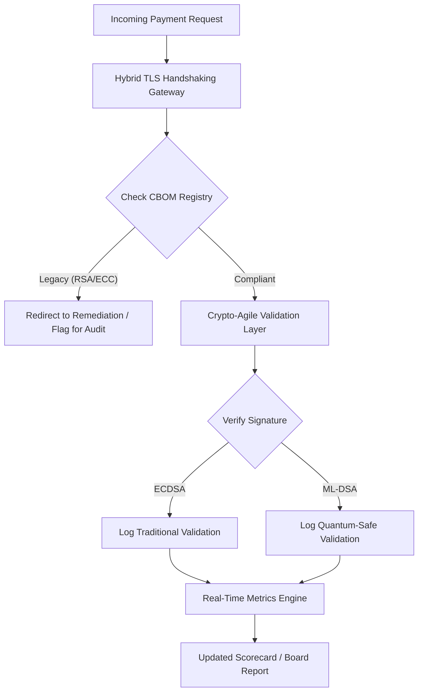

# بطاقة الأداء الأمني لما بعد الكم 2026: إطار مقاييس على مستوى المجلس للمرونة التشفيرية الائتمانية

<aside class="post-lead" aria-label="Article summary">

<strong>الخلاصة.</strong> حتى يونيو 2026، انتقل تشفير ما بعد الكم (PQC) من شغل تقني تجريبي إلى التزام ائتماني أساسي. وعلى المجالس الآن الإشراف على الترحيل المنهجي للتشفير القديم إلى معايير NIST FIPS 203 وFIPS 204 لتخفيف المخاطر المالية والتشغيلية النظامية بموجب DORA.

<strong>أبرز النقاط</strong>

<ul class="post-lead-takeaways">
  <li><strong>المواءمة مع G20 ومواعيد نهائية صارمة.</strong> حدّد المنظّمون الدوليون أواخر عقد 2020 موعداً نهائياً صارماً للانتقال إلى وضع آمن كمومياً، فيُطلب من المؤسسات إثبات تقدّم ترحيل قابل للقياس.</li>
  <li><strong>قائمة المكوّنات التشفيرية (CBOM).</strong> على غرار قائمة مكوّنات البرمجيات، CBOM جرد حي ومؤتمت لكل الأصول التشفيرية لازم لضمان الرؤية عبر سلسلة التوريد.</li>
  <li><strong>تعرّض الحصاد الآن وفك التشفير لاحقاً (HNDL).</strong> يعترض الخصوم حالياً ويُخزّنون بيانات المدفوعات بالجملة عالية القيمة المُشفَّرة؛ وتخفيف ذلك يتطلب نشراً فورياً لمعمارية PQC هجينة.</li>
  <li><strong>حوكمة ائتمانية عبر المرونة التشفيرية.</strong> المرونة التشفيرية مقياس حوكمة قابل للقياس. والقدرة على تبديل الأوّليات التشفيرية دون إعادة هندسة الأنظمة الجوهرية (باستخدام مكتبات كـ KyberLib) باتت مساءلة على مستوى المجلس بموجب SM&CR.</li>
</ul>

<strong>قراءات ذات صلة:</strong> <a href="https://sebastienrousseau.com/2026-06-12-kyberlib-post-quantum-banking-migration-standards-code-2026">KyberLib والانتقال المصرفي إلى ما بعد الكم في 2026</a>، <a href="https://sebastienrousseau.com/2023-11-19-crystals-kyber-the-safeguarding-algorithm-in-a-quantum-age/index.html">CRYSTALS-Kyber: الخوارزمية الحارسة في عصر الكم</a>.

</aside>
أمن ما بعد الكم لم يعد مشروع بحث. "ساعة الإشراف" تدق نحو مواعيد الإنفاذ النهائية في أواخر عقد 2020. واستكمال [NIST FIPS 203 (ML-KEM)](https://csrc.nist.gov/pubs/fips/203/final) و[NIST FIPS 204 (ML-DSA)](https://csrc.nist.gov/pubs/fips/204/final) قنّن معايير تغليف المفاتيح والتواقيع الرقمية.

تتوقع الجهات التنظيمية الآن من مصارف Tier-1 تجاوز البرامج التجريبية. في 2026، انتقل التركيز إلى تصنيع هذه المعايير. والإخفاق في إثبات مسار ترحيل واضح يحمل عقوبات تنظيمية كبيرة بموجب [قانون الصمود التشغيلي الرقمي (DORA)](https://eur-lex.europa.eu/eli/reg/2022/2554/oj) ومسؤولية شخصية محتملة على المديرين الذين يتجاهلون التهديد المتوقع لفك التشفير الكمومي.

## 01. بطاقة الأداء الكمومية على مستوى المجلس

تُوفّر المقاييس التالية إطاراً معيارياً للمجالس لتقييم الجاهزية الكمومية والسلامة التشفيرية عبر منشآت المصرفية التجارية والاستثمارية (CIB).

### الجدول 1: مقاييس بطاقة الأداء PQC وعتباتها

| المقياس | الصيغة الرياضية | عتبات معتمدة من المجلس | المخاطرة عند تجاوز العتبة |
| ---- | ---- | ---- | ---- |
| **نسبة اكتمال الجرد (ICP)** | (الأصول التشفيرية المُحدَّدة / إجمالي الأصول المُقدَّرة) × 100 | > 98% | تشفير ظل ونقاط عمياء في مسارات بيانات المقاصة عالية القيمة. |
| **معدل تعرّض HNDL (HER)** | (البيانات طويلة العمر على تشفير قديم / إجمالي البيانات طويلة العمر) × 100 | < 5% | اختراق دائم للأسرار التجارية، وسجلات الديون السيادية، وسجلات المدفوعات بالجملة. |
| **معدل تقدّم الترحيل وفق NIST (MPR)** | (الأنظمة التي تعمل بـ FIPS 203/204 / إجمالي الأنظمة الحرجة) × 100 | > 60% (بحلول نهاية 2026) | عدم امتثال تنظيمي واستبعاد من النظراء المُواءمين مع G20. |
| **مؤشر جاهزية المرونة التشفيرية (CARI)** | (التطبيقات ذات طبقات تشفير مُجرَّدة / إجمالي التطبيقات الجوهرية) × 100 | > 85% | دَين تقني شديد وعجز عن الاستجابة لإيقاف الخوارزميات مستقبلاً. |

## 02. قائمة المكوّنات التشفيرية (CBOM)

يُؤسَّس مقياس ICP عبر **مرحلة اكتشاف CBOM** شاملة. وهي عملية مؤتمتة تُحدِّد كل نقطة نهاية تشفيرية داخل المؤسسة.

- **اكتشاف نقاط النهاية:** فحص الشبكات الداخلية والسحابية بحثاً عن جلسات TLS نشطة لتحديد استخدام RSA أو ECC القديم.
- **جرد المفاتيح:** ربط أزواج المفاتيح العامة/الخاصة بأصحابها وربط تواريخ الانتهاء الدقيقة.
- **رسم التبعيات:** تحديد المكتبات وواجهات برمجة التطبيقات الخارجية التي تعتمد على خوارزميات مهجورة.

تُنشئ مرحلة الاكتشاف هذه مصدراً موحَّداً للحقيقة، فتُمكِّن مدير أمن المعلومات (CISO) من إبلاغ السلامة التشفيرية بالدقة ذاتها للأداء المالي.

## 03. القضاء على تعرّض HNDL في المدفوعات بالجملة

يستهدف الخصوم بنشاط المدفوعات بالجملة وقواعد البيانات المؤسسية طويلة العمر. وتشمل هجمات "الحصاد الآن وفك التشفير لاحقاً" (HNDL) اعتراض حركة المرور المُشفَّرة اليوم وأرشفتها.

حتى لو لم يوجد حاسوب كمومي ذو صلة تشفيرية (CRQC) اليوم، فالبيانات المُعترَضة الآن ستكون قابلة للاختراق مستقبلاً. وتخفيف ذلك يتطلب ترحيل بيانات طويلة العمر بأولوية عالية (مثل سجلات الهوية، وعقود السندات لثلاثين عاماً، والأرشيفات القانونية)، مما يُخفض مقياس HER مباشرةً. وترقية قنوات المدفوعات إلى تشفير PQC-تقليدي هجين (باستخدام ML-KEM مع X25519) يُوفر دفاعاً فورياً ضد التهديدات الأرشيفية.

## 04. تفعيل المرونة التشفيرية عبر واجهات حسنة التصميم

تتحقق المرونة التشفيرية عبر تجريدات هندسية. وتُظهر مكتبات حديثة كـ [KyberLib](https://sebastienrousseau.com/2026-06-12-kyberlib-post-quantum-banking-migration-standards-code-2026) كيف يستطيع المطوّرون تنفيذ وحدات آمنة كمومياً دون إعادة كتابة حزمة التطبيق كاملةً.

- **مغلِّفات مُجرَّدة:** تستدعي التطبيقات دالة عامة `encrypt()` أو `sign()` بدلاً من إجراءات خاصة بالخوارزمية.
- **تبديل أثناء التشغيل:** يمكن تبديل الوحدة الأساسية من ECDSA إلى ML-DSA عبر تغييرات تهيئة بدلاً من نشر شيفرة معقّد.

تضمن هذه المعمارية أنه إن تعرّضت خوارزمية PQC بعينها لاختراق مستقبلاً، تستطيع المؤسسة التحول في ساعات بدلاً من سنوات.

## 05. سير عمل تحقق الدخول الآمن كمومياً

يُوضّح المخطط التالي دورة حياة البيانات الداخلة إلى المحيط الآمن في بيئة مصرفية مرنة كمومياً.

## الخاتمة

المنشأة التشفيرية لمصرف Tier-1 لم تعد شأن مدير أمن المعلومات. هي بنية تحتية ائتمانية. NIST FIPS 203 وFIPS 204 يُحدّدان الخوارزميات؛ والمادة 5 من DORA تُحدّد سطح المساءلة؛ وSM&CR يُثبّتها على مدير تنفيذي بالاسم. وبطاقة الأداء أعلاه — اكتمال الجرد، وتعرّض HNDL، وتقدّم الترحيل، والمرونة التشفيرية — تمنح المجلس الأرقام الأربعة التي يحتاجها لحوكمة تلك المنشأة دون اضطراره إلى قراءة الشيفرة التشفيرية.

الرقم الأهم هو تعرّض HNDL. كل سجل مُشفَّر بخوارزمية قديمة موجود في أرشيف مدفوعات بالجملة اليوم سيُصبح مقروءاً يوم شحن أول حاسوب كمومي ذي صلة تشفيرية. والعد التنازلي صامت وغير متماثل: المدافعون يستطيعون التصرف فقط على البيانات التي يحوزونها، والخصوم يستطيعون التصرف على بيانات سرّبوها قبل سنوات. عقد سندات شركة لثلاثين عاماً مُشفَّر بـ RSA-2048 في 2024 عقدٌ يفقد ضمان السرية يوم تشغيل CRQC.

[KyberLib](https://sebastienrousseau.com/2026-06-12-kyberlib-post-quantum-banking-migration-standards-code-2026) ونظائره يُحوّلون هذا من إعادة كتابة منصة متعددة السنوات إلى تغيير تهيئة. ووظيفة المجلس ليست كتابة الشيفرة. وظيفة المجلس مطالبة بأن مؤشر جاهزية المرونة التشفيرية — حصة التطبيقات الجوهرية خلف واجهة تشفيرية مُجرَّدة — يتجاوز 85% خلال اثني عشر شهراً، وقراءة بطاقة الأداء الفصلية.

<aside class="author-card" aria-label="About the author"><strong class="author-card-name"><a href="/about/index.html">Sebastien Rousseau</a></strong>تقني مصرفي رفيع يكتب عن الذكاء الاصطناعي التطبيقي، وترحيل ISO 20022، وتشفير ما بعد الكم للخدمات المالية، والتحوّل البنيوي للمدفوعات بالجملة.أكثر من 20 عاماً عبر HSBC Commercial & Investment Bank، وPayPal، وBarclays، وShazam. <a href="https://www.linkedin.com/in/sebastienrousseau/" rel="external noopener">LinkedIn</a> &middot; <a href="https://github.com/sebastienrousseau" rel="external noopener">GitHub</a></aside>

آخر مراجعة <time datetime="2026-06-29">2026-06-29</time>.

