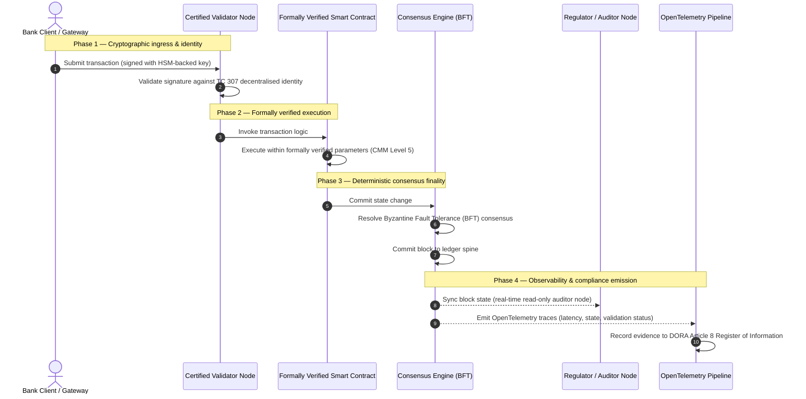

# من الدليل إلى الحقيقة: لماذا ستحدد سلاسل الكتل المعتمدة الحقبة القادمة للثقة المصرفية

## ملخص استراتيجي (الجوهر)

تقف الصيرفة بالجملة والمعاملات العالمية في عام 2026 عند نقطة تحول تاريخية. ومع انتقال الخدمات المالية إلى شبكات مقاصة رقمية أصيلة وفورية، وإدخال الذكاء الاصطناعي لللاحتمية الاحتمالية، لم تعد نماذج الضمان التقليدية التناظرية بأثر رجعي (مثل عمليات التدقيق الثابتة القائمة على الكيان) تفي بالمتطلبات الحديثة لإدارة المخاطر والواجبات الائتمانية.

أرست اللجنة الفنية ISO/IEC TC 307 أساسًا موحدًا لتقنيات دفتر الأستاذ الموزع. غير أن التبني المؤسسي الحقيقي يتطلب الانتقال من الإرشاد الوصفي إلى ضمان سلسلة الكتل الوصفي القابل للاعتماد بشكل مستقل. فمن خلال تقييم حوكمة دفتر الأستاذ، وسلامة التوافق، وأمان العقود الذكية، والمرونة التشفيرية وفق نموذج نضج القدرات (CMM) الصارم ذي المستويات الخمسة، يمكن للبنوك الانتقال من الافتراضات المجزأة الخاصة بكل مورّد إلى حقيقة مالية قابلة للاعتماد والتدقيق من قبل مجلس الإدارة.

## النقاط الرئيسية

* **فجوة الاحتكاك الائتماني**: نستطيع اليوم اعتماد البنك (بازل III) والسحابة (ISO 27001) وأنظمة حوكمة الذكاء الاصطناعي (ISO 42001)، لكننا لا نستطيع بعد اعتماد دفتر الأستاذ الموزع الذي يحدد بشكل متزايد ما هو صحيح. وهذا التفاوت ثغرة تشغيلية كبرى.  
* **DORA تفرض مسؤولية ائتمانية مباشرة**: بموجب المادة 5 من DORA، تتحمل مجالس إدارة البنوك مسؤولية شخصية مباشرة غير قابلة للتفويض عن المرونة التشغيلية لجميع عمليات نشر الأطراف الثالثة ودفاتر الأستاذ، مع عقوبات شخصية صارمة بموجب نظام SM&CR عند الإخفاق.  
* **العمود الفقري للتدقيق في الذكاء الاصطناعي**: حيث يُنتج التعلم الآلي نتائج احتمالية غير قابلة للتكرار، توفر سلسلة الكتل المعتمدة التقاطًا حتميًا للحالة. وتسجيل إصدارات النماذج والمدخلات وقرارات التحقق على السلسلة يفي بمعيار ISO 42001 ومعايير إدارة مخاطر النماذج.  
* **مؤشر سلاسل الكتل المعتمدة**: يضفي هذا المؤشر الطابع الرسمي على الحوكمة والتوافق والعقود الذكية وقابلية الملاحظة في بطاقة أداء قابلة للتحقق وجاهزة للتدقيق على مقياس CMM من 0 إلى 5، مترجمًا المقاييس الهندسية إلى بيانات شهية المخاطر المعتمدة من مجلس الإدارة.

## 01. فجوة الاحتكاك الائتماني في الصيرفة الرقمية

في الصيرفة الكلاسيكية، تكون الثقة علائقية ومؤسسية وبأثر رجعي. فهي تعتمد على مدققين خارجيين مستقلين يراجعون الحالة المالية في نقاط زمنية ثابتة، ويوفّقون التباينات عبر صوامع دفاتر الأستاذ الثنائية. وفي أسواق عام 2026 الفورية والمدفوعة بواجهات برمجة التطبيقات، يُدخل هذا النموذج زمن استجابة باهظًا ومخاطر هيكلية.

عندما تُسوّى المعاملات فورًا، وتُدار مجمعات السيولة خلال اليوم ديناميكيًا عبر بوابات واجهات البرمجة، وتُرمَّز ملكية الأصول عبر دفاتر أستاذ مشتركة، تصبح عمليات التدقيق بأثر رجعي تمارين جنائية بدلًا من ضوابط وقائية. لم يعد بإمكان الأمناء الاعتماد فقط على اعتماد الكيان القانوني. بل يجب عليهم اعتماد الركيزة الرقمية نفسها.

تعمل البنوك حاليًا في ظل تفاوت معماري صارخ:

1. **البنية التحتية السحابية المعتمدة**: تُتحقق العقد الأجهزة، والحاويات الافتراضية، ومراكز البيانات الفعلية وفق ضوابط ISO/IEC 27001 و SOC 2 Type II.  
2. **عمليات الإدارة المعتمدة**: تُحكم سياسات المخاطر التشغيلية، وخطط استمرارية الأعمال، وعمليات النشر الخوارزمية بأطر مخاطر صارمة.  
3. **محركات دفتر الأستاذ غير المعتمدة**: تُترك آليات التوافق الموزع، وسلاسل توريد عقد التحقق، وحدود العقود الذكية، ونماذج حوكمة الشبكة لافتراضات غير معتمدة أو مخصصة أو خاصة بالاتحاد.

هذا التفاوت نقطة فشل حرجة. يمكن للبنك تشغيل تطبيق مُتحقق داخل حاوية سحابية آمنة معتمدة بموجب ISO 27001، لكن إذا كتبت تلك الحاوية إلى دفتر أستاذ موزع ذي تحكم مركزي في المدققين، أو معلمات توافق ضعيفة، أو عقود ذكية غير مدققة، فإن سلامة المعاملة تُخترق. ولسد هذه الفجوة، يجب أن يصبح محرك دفتر الأستاذ نفسه كائن ضمان قابلًا للاعتماد.

## 02. أساس التوحيد القياسي ISO/IEC TC 307

يتولى العمل التأسيسي اللازم لتوحيد دفاتر الأستاذ الموزعة اللجنة الفنية ISO/IEC TC 307 (تقنيات سلسلة الكتل ودفتر الأستاذ الموزع). وبدلًا من معاملة سلسلة الكتل كبروتوكول تقني معزول، تتعامل معها TC 307 كبنية تحتية مؤسسية للثقة، وتنظم عملها حول خمس ركائز أساسية:

1. **التصنيف والمفردات (ISO 22739)**: يرسي تسمية مشتركة، ويضمن تعريفات قانونية وتشغيلية متسقة عبر الولايات القضائية والمخططات المالية والمؤسسات.  
2. **البنية المرجعية (ISO/TR 23245)**: تحدد الحدود والطبقات وتدفقات البيانات والمكونات الوظيفية لنظام دفتر أستاذ موزع متوافق.  
3. **الأمان والخصوصية والعقود الذكية (ISO/TR 23244 / ISO 23613)**: يرسي إرشادات أمان أساسية لأنظمة الأصول الرقمية، ويفصّل أفضل الممارسات للتخفيف من ثغرات العقود الذكية وحوكمة دورة حياتها.  
4. **أطر قابلية التشغيل البيني**: تعالج آليات تبادل البيانات والأصول بين شبكات دفاتر الأستاذ غير المتجانسة، وتمنع تكوّن صوامع مُرمَّزة معزولة.  
5. **الهوية اللامركزية ومراسي الثقة**: تدمج المُعرِّفات التشفيرية القائمة على دفتر الأستاذ مع بنى المفاتيح العامة الرسمية (PKI) والسجلات المصرح بها من الدولة.

مجتمعةً، تشير TC 307 إلى انتقال تقنية دفتر الأستاذ الموزع من خيار هندسي مخصص إلى تخصص معماري موحد. ومع ذلك تظل TC 307 وصفية في الأساس. فهي تحدد كيف يبدو التميز (إرشاد)، لكنها لا توفر بروتوكول التحقق الوصفي (الضمان) الذي يحتاجه مسؤولو المخاطر والمشرفون للترخيص بعمليات النشر الإنتاجية للوظائف الحرجة أو المهمة (CIF).

## 03. الإرشاد مقابل الضمان: التمييز الائتماني

لا ينشر المشاركون في الأسواق المالية تقنية لأنها مبتكرة أو أنيقة؛ بل ينشرونها عندما يمكن حوكمتها وتدقيقها والدفاع عنها وتوفيقها مع متطلبات الاحتياطي الرأسمالي. لهذا ينحل التوحيد القياسي في الصيرفة طبيعيًا إلى طبقتين:

* **الإرشاد (الإطار)**: يحدد أفضل الممارسات والأهداف المرجعية والإرشادات المعمارية (مثل ISO/IEC TC 307، وأطر NIST).  
* **الضمان (الدليل)**: يوفر أدلة مستقلة ومستمرة وقابلة للتحقق من طرف ثالث على أن الإطار مُنفَّذ ويعمل كما صُمم (مثل شهادة ISO 27001، وعمليات تدقيق SOC 2، والفحوصات التنظيمية).

الاعتماد على توافق دفتر أستاذ غير معتمد مع اعتماد البنية التحتية السحابية هو ثغرة تنظيمية حرجة. فسلسلة الكتل "غير القابلة للتغيير" ليست بالضرورة "موثوقة مؤسسيًا". فعدم القابلية للتغيير يضمن فقط بقاء البيانات المُدخَلة دون تغيير؛ ولا يتحقق مما إذا كانت عقد التحقق آمنة، أو ما إذا كان بروتوكول التوافق مرنًا ضد التواطؤ، أو ما إذا كان منطق العقود الذكية سليمًا رياضيًا، أو ما إذا كانت إدارة المفاتيح التشفيرية تمتثل للتفويضات ما بعد الكمومية.

ولسد هذه الفجوة، يضفي مؤشر سلاسل الكتل المعتمدة 2026 الطابع الرسمي على هذه المتطلبات في نموذج نضج القدرات (CMM) قابل للقياس، ومرتبط باللوائح المصرفية العالمية.

## 04. مؤشر سلاسل الكتل المعتمدة 2026

لتمكين الإدارة العليا من تقييم منصات دفتر الأستاذ واعتمادها، يهيكل هذا المؤشر البنية التحتية لدفتر الأستاذ الموزع في خمس طبقات تشغيلية قابلة للتدقيق، مُقيَّمة على مقياس CMM من 0 إلى 5.

## الجدول 1: بنية مؤشر سلاسل الكتل المعتمدة

| طبقة المؤشر | مستوى النضج (CMM) | المقياس التقني والتشغيلي | المرجع الرقابي / الائتماني |
| ---- | ---- | ---- | ---- |
| **حوكمة دفتر الأستاذ** | **المستوى 0**: اتحاد مؤقت**المستوى 3**: فحص وتدوير آلي للمدققين**المستوى 5**: ترسيخ هوية تشفيري لامركزي متعدد الأطراف | % عقد التحقق التي تشغّلها كيانات مالية مفحوصة؛ متوسط زمن حل نزاعات المدققين؛ التوزيع الجغرافي للعقد | **DORA المادة 5** (الحوكمة والتنظيم)؛ **CPMI-IOSCO PFMI المبدأ 2** (الحوكمة) و**المبدأ 3** (إطار الإدارة الشاملة للمخاطر) |
| **سلامة التوافق** | **المستوى 0**: عقدة واحدة أو PoW غامض**المستوى 3**: BFT مُدقَّق بنهائية حتمية**المستوى 5**: توافق متعدد الولايات القضائية، مُتحقق منه رسميًا، مع مراقبة مستمرة لزمن الاستجابة | أقصى زمن استجابة توافق مقبول؛ عتبة مقاومة التواطؤ؛ اتفاقية مستوى خدمة التوافر عند تقسيم عقد مُحاكى | **DORA المادة 6** (إطار إدارة مخاطر تكنولوجيا المعلومات والاتصالات)؛ **CPMI-IOSCO PFMI المبدأ 8** (نهائية التسوية) |
| **الهوية والتشفير** | **المستوى 0**: مفاتيح RSA / ECDSA ضعيفة**المستوى 3**: توقيع متعدد بإدارة مفاتيح مدعومة بـ HSM**المستوى 5**: مفاتيح هجينة آمنة كموميًا (FIPS 203 ML-KEM) وبوابات خصوصية بمعرفة صفرية | % معاملات دفتر الأستاذ الموقّعة بمفاتيح مدعومة بـ HSM؛ درجة الجاهزية للانتقال إلى PQC؛ زمن استجابة إثباتات ZK | **NIST FIPS 203 / 204**؛ **ISO/IEC 27001** (إدارة أمن المعلومات) |
| **ضمان العقود الذكية** | **المستوى 0**: نصوص Solidity غير مدققة**المستوى 3**: تحقق آلي من المُترجِم وتدقيق خارجي**المستوى 5**: عقود ذكية غير قابلة للتغيير مُتحقق منها رسميًا بترقيات من نوع قاطع الدائرة | % العقود الذكية ذات التحقق الرسمي الرياضي؛ عدد تحذيرات المُترجِم؛ تغطية فحص الثغرات | **إرشادات EBA بشأن الاستعانة بمصادر خارجية** (الفقرات 81، 113-117)؛ **DORA المادة 30** (الحد الأدنى من البنود التعاقدية) |
| **التدقيق وقابلية الملاحظة** | **المستوى 0**: كشط يدوي للسجلات**المستوى 3**: تتبعات OTel منظمة وعقد مدقق للقراءة فقط**المستوى 5**: تسوية آلية مستمرة مع سجل المادة 8 | % المعاملات المشمولة بتتبعات OpenTelemetry؛ زمن الاستجابة من تأكيد الكتلة إلى مزامنة عقدة المدقق | **BCBS 239** (تجميع بيانات المخاطر)؛ **DORA المادة 8** (سجل المعلومات / مخططات ITS) |

## الجدول 2: إشارات الثقة الرئيسية المرتبطة بالمعايير المصرفية العالمية

| الإشارة / المرجع | المقياس | التأثير على المنصات المصرفية | المصدر التنظيمي |
| ---- | ---- | ---- | ---- |
| **تقدم ISO/IEC TC 307** | الانتقال من التقارير الفنية ISO/TR إلى مخططات اعتماد رسمية | يرسي أول إطار موحد لاعتماد محركات دفتر الأستاذ الموزع | **ISO/IEC JTC 1 / SC 44** (تقنيات دفتر الأستاذ الموزع) |
| **مرحلة النموذج الأولي لمشروع Agorá** | أكثر من 40 مصرفًا تجاريًا مشاركًا؛ اختبار دفتر أستاذ موحد للودائع المُرمَّزة | ينقل المقاصة عبر الحدود من المراسلة (SWIFT) إلى التسوية الذرية المُرمَّزة | **مركز الابتكار في بنك التسويات الدولية (BIS)** |
| **تدقيق الطرف الثالث DORA المادة 30** | تدقيق 100% من مزودي العقد ومضيفي البنية التحتية وفق معايير الأمان | يقضي على "عقد التحقق الخفية"؛ يفرض شفافية كاملة لسلسلة التوريد | **الهيئات الرقابية الأوروبية (ESA)** |
| **ISO/IEC 42001 (حوكمة الذكاء الاصطناعي)** | جعل سجلات نماذج وتدريب الذكاء الاصطناعي غير قابلة للتغيير تشفيريًا على السلسلة | يستخدم سلسلة الكتل كسجل إثبات غير قابل للتغيير ("العمود الفقري للتدقيق") للتعلم الآلي | **ISO/IEC 42001:2023** (تكنولوجيا المعلومات — الذكاء الاصطناعي) |
| **كفاية رأس المال بازل III** | خفض احتياطيات رأس المال للمخاطر التشغيلية بناءً على خفض موثق للتعقيد | تحتسب أطر المخاطر التشغيلية الموحدة مباشرةً مرونة دفتر الأستاذ المتحقق منها | **لجنة بازل للرقابة المصرفية (BCBS)** |

## 05. "العمود الفقري للتدقيق" في الذكاء الاصطناعي: ذكاء احتمالي على بنية تحتية حتمية

من أقوى الأدوار الاستراتيجية لسلسلة كتل معتمدة في عام 2026 العمل كـ**"عمود فقري للتدقيق"** لعمليات نشر الذكاء الاصطناعي. فالأنظمة المالية الحديثة أصبحت احتمالية بشكل متزايد. إذ تُدار تسجيل الائتمان، وكشف الاحتيال الفوري، والتداول الخوارزمي، والتفاعلات المستقلة مع العملاء بنماذج تعلم آلي تتطور وتنجرف وتتكيف مع الوقت. وهذه النماذج غير حتمية: فبنفس المدخل في وقتين مختلفين قد تُنتج مخرجات مختلفة بسبب الأوزان الديناميكية والتدريب المستمر.

يطرح هذا اللاحتمية تحديًا عميقًا للحوكمة بموجب **ISO/IEC 42001 (حوكمة الذكاء الاصطناعي)** ومعايير إدارة مخاطر النماذج (MRM) (مثل **SR 11-7 لمجلس الاحتياطي الفيدرالي الأمريكي** و**SS1/23 لهيئة التنظيم الاحترازي البريطانية**): *كيف تُدقق القرارات غير القابلة للتكرار بدقة وتُفسّرها وتدافع عنها؟*

يوفر دفتر الأستاذ الموزع المعتمد الثقل الموازن الحتمي. فحيث تعمل نماذج الذكاء الاصطناعي احتماليًا، تسجل سلسلة الكتل المعتمدة معلماتها حتميًا، مؤسِّسةً عمودًا فقريًا للإثبات غير قابل للتغيير:

* **إصدار النماذج وترسيخ الأوزان**: تُجزَّأ كل نسخة نموذج منشورة وأوزانها المرتبطة ومجاميع التحقق لبيانات تدريبها وتُكتب إلى دفتر الأستاذ وقت البناء، بما يفي بمتطلبات سلسلة التوريد **SLSA Level 3**.  
* **تسجيل المدخلات السياقية**: عندما ينفذ نموذج ذكاء اصطناعي قرارًا حرجًا (مثل الموافقة على قرض أو الإبلاغ عن معاملة)، تُكتب المدخلات السياقية الدقيقة وتجزئات النموذج إلى دفتر الأستاذ، مُنشئةً سجلًا مقاومًا للعبث.  
* **قابلية التدقيق دون الوصول إلى الشيفرة**: إذا سأل منظم "لماذا رفض نموذجك طلب الائتمان هذا في 3 يونيو؟"، لا يحتاج البنك إلى كشف شيفرته الخاصة ولا إلى محاولة إعادة إنشاء الحالة الدقيقة للنموذج. بل يقدم السجل الموقّع تشفيريًا على السلسلة للمدخلات والأوزان وحالة التحقق.

بترسيخ القرارات الاحتمالية لنماذج التعلم الآلي على التوافق الحتمي لسلسلة كتل معتمدة، تُنشئ المؤسسة جدولًا زمنيًا للإجراءات الآلية قابلًا للدفاع عنه وإعادة البناء والتحقق المستقل.

## 06. تصور خط أنابيب التوافق إلى التدقيق المعتمد

يوضح مخطط التسلسل التالي دورة حياة معاملة تمر عبر منصة سلسلة كتل معتمدة، مبيّنًا كيف تتشابك بوابات التحقق وسلامة التوافق وتنفيذ العقود الذكية وبث القياس عن بُعد لإنتاج دليل تنظيمي جاهز لمجلس الإدارة:

يتطلب المسار الحرج لهذا التسلسل المعاملاتي أن تكون كل خطوة تحقق وتنفيذ وتوافق موقّعة تشفيريًا، بما يضمن المصدر من طرف إلى طرف. تزامن عقدة المدقق لدى المنظم حالة الكتل في الوقت الفعلي، ملغيةً الحاجة إلى التسوية المالية اليدوية بأثر رجعي.

## 07. دليل مجلس الإدارة لكبار المديرين

للتنقل بنجاح في الانتقال من الثقة التنظيمية إلى الثقة البنيوية، ينبغي على مديري البنوك وكبار الإداريين تنفيذ أربعة توجيهات رئيسية فورًا:

1. **جعل عمليات تدقيق دفتر الأستاذ إلزامية في إدارة مخاطر المؤسسة (ERM)**: فرض سياسة بألا تُنشر أي منصة دفتر أستاذ موزع — خاصة أو عامة أو اتحادية — للوظائف الحرجة أو المهمة (CIF) دون تدقيقها وفق **بنية مؤشر سلاسل الكتل المعتمدة** ذات الطبقات الخمس (الحد الأدنى CMM المستوى 3).  
2. **دمج سلاسل الكتل كعمود فقري للإثبات في الذكاء الاصطناعي وفق ISO 42001**: تكليف مدير المخاطر وكبير مهندسي الذكاء الاصطناعي بدمج جميع نماذج التعلم الآلي عالية التأثير مع سلسلة كتل معتمدة، مُنشئين سجل تدقيق مقاومًا للعبث لإصدارات النماذج والأوزان والمدخلات والقرارات.  
3. **تدقيق سلسلة توريد عقد التحقق (DORA المادة 30)**: مطالبة قسم المشتريات بتدقيق جميع الأطراف الثالثة التي تستضيف عقد تحقق أو تدير الاستضافة السحابية لشبكات DLT، مع فرض نفس معايير الأمن السيبراني والمرونة التشغيلية المطبقة على عقد البنك السحابية الداخلية.  
4. **مواءمة بنى دفتر الأستاذ مع CPMI-IOSCO و BCBS 239**: تكليف فريق هندسة المنصة بمواءمة القياس عن بُعد لمخرجات دفتر الأستاذ مباشرةً مع متطلبات إبلاغ البيانات في **BCBS 239**، وضمان امتثال معلمات التوافق ونهائية التسوية بدقة لـ**المبدأين 8 و9 من CPMI-IOSCO**.

## 08. الأسئلة الشائعة

**هل ISO/IEC TC 307 معيار اعتماد؟**  
لا. ISO/IEC TC 307 لجنة فنية ترسي المفردات والبنى المرجعية وإرشادات الأمان. ورغم أنها تحدد "كيف يبدو التميز" (إرشاد)، يجب على الصناعة تفعيل هذه الوثائق في مخططات اعتماد رسمية قابلة للتدقيق (ضمان) لإرضاء المشرفين المصرفيين.

**كيف تدعم سلسلة كتل معتمدة الامتثال لـ DORA؟**  
بموجب المادة 5 من DORA، تتحمل مجالس البنوك مسؤولية شخصية مباشرة عن المرونة التقنية. توفر سلسلة الكتل المعتمدة دليلًا تشفيريًا قابلًا للتحقق على سلامة التوافق والتحكم في سلسلة توريد المدققين وأمان العقود الذكية، مانحةً أعضاء المجلس "الخطوات المعقولة" الموثقة اللازمة للدفاع ضد مطالبات المسؤولية الشخصية بموجب SM&CR.

ما الفرق بين التدقيق التقليدي لدفتر الأستاذ وتدقيق سلسلة كتل معتمدة؟  
التدقيق التقليدي بأثر رجعي: يتحقق من القيود اليدوية والملفات الثابتة بعد تسوية المعاملات. أما تدقيق سلسلة الكتل المعتمدة فمستمر وفوري؛ إذ تُعتمد عقد التحقق ومحرك التوافق BFT والعقود الذكية المُتحقق منها رسميًا لتنفيذ المعاملات حتميًا، باثةً قياسًا عن بُعد منظمًا (OpenTelemetry) يتحقق باستمرار من صحة النظام.

هل يمكن اعتماد سلاسل الكتل العامة للاستخدام المصرفي؟  
في معظم الولايات القضائية، تفشل سلاسل الكتل العامة عديمة الإذن تمامًا في تلبية اللوائح المصرفية بسبب غياب التحقق من هوية المدققين، وتكاليف المعاملات غير المتوقعة، والنهائية غير الحتمية (مثل تفرعات proof-of-work/stake الاحتمالية). وتستخدم سلاسل الكتل المعتمدة في الصيرفة عادةً بنى مؤسسية مأذونة أو بنى عامة-هجينة مُنظَّمة بشدة، حيث يكون مشغلو عقد التحقق كيانات مالية محددة الهوية ومُدققة.

## 09. المراجع

* لجنة بازل للرقابة المصرفية (BCBS)، 2013. *Principles for effective risk data aggregation and reporting (BCBS 239)*. بازل: بنك التسويات الدولية. متاح على: [https://www.bis.org/publ/bcbs239.pdf](https://www.bis.org/publ/bcbs239.pdf).  
* Committee on Payments and Market Infrastructures وTechnical Committee of the International Organization of Securities Commissions (CPMI-IOSCO)، 2012. *Principles for financial market infrastructures*. بازل: بنك التسويات الدولية. متاح على: [https://www.bis.org/cpmi/publ/d101a.pdf](https://www.bis.org/cpmi/publ/d101a.pdf).  
* الهيئة المصرفية الأوروبية (EBA)، 2019. *EBA/GL/2019/02 — Guidelines on outsourcing arrangements*. باريس: EBA. متاح على: [https://www.eba.europa.eu/regulation-and-policy/internal-governance/guidelines-on-outsourcing-arrangements](https://www.eba.europa.eu/regulation-and-policy/internal-governance/guidelines-on-outsourcing-arrangements).  
* البرلمان الأوروبي ومجلس الاتحاد الأوروبي، 2022. *اللائحة (الاتحاد الأوروبي) 2022/2554 بشأن المرونة التشغيلية الرقمية للقطاع المالي (DORA)*. بروكسل: الجريدة الرسمية للاتحاد الأوروبي. متاح على: [https://eur-lex.europa.eu/legal-content/EN/TXT/?uri=CELEX%3A32022R2554](https://eur-lex.europa.eu/legal-content/EN/TXT/?uri=CELEX%3A32022R2554).  
* ISO/IEC JTC 1/SC 42، 2023. *ISO/IEC 42001:2023 — Information technology — Artificial intelligence — Management system*. جنيف: المنظمة الدولية للتوحيد القياسي. متاح على: [https://www.iso.org/standard/81230.html](https://www.iso.org/standard/81230.html).  
* اللجنة الفنية ISO/IEC 307، 2020. *ISO/IEC 22739:2020 — Blockchain and distributed ledger technologies — Vocabulary*. جنيف: المنظمة الدولية للتوحيد القياسي. متاح على: [https://www.iso.org/standard/73771.html](https://www.iso.org/standard/73771.html).  
* National Institute of Standards and Technology (NIST)، 2026. *First Three Finalized Post-Quantum Encryption Standards (FIPS 203, 204, and 205)*. غايثرسبرغ: U.S. Department of Commerce. متاح على: [https://www.nist.gov/news-events/news/2024/08/nist-releases-first-3-finalized-post-quantum-encryption-standards](https://www.nist.gov/news-events/news/2024/08/nist-releases-first-3-finalized-post-quantum-encryption-standards).
