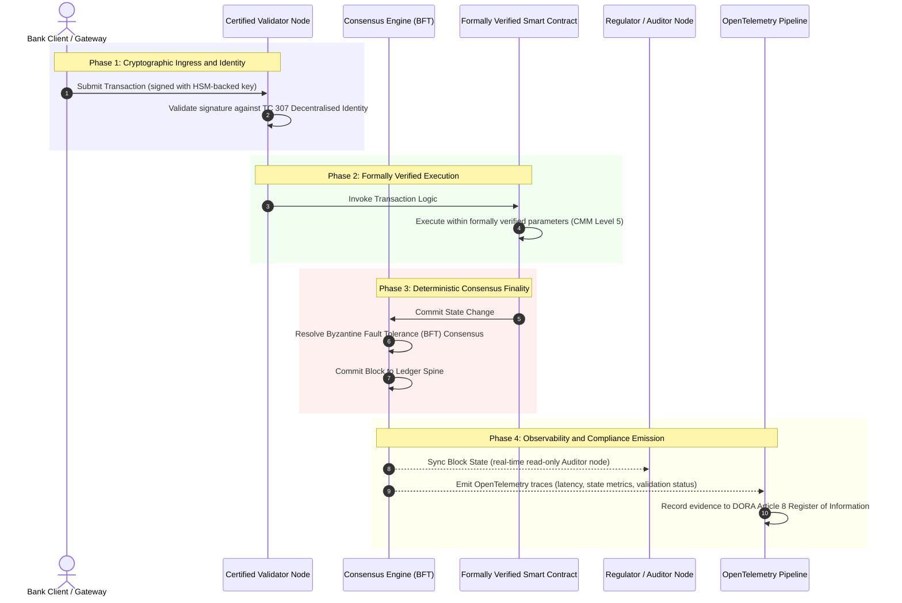

# من الدليل إلى الحقيقة: لماذا ستُحدِّد سلاسل الكتل المعتمدة الحقبة القادمة من الثقة المصرفية

**غير القابل للتغيير ليس مرادفًا للموثوق.** مع انتقال الأعمال المصرفية بالجملة إلى التسوية الفورية والذكاء الاصطناعي الاحتمالي، أصبح دفتر الأستاذ الذي يقرّر ما هو حقيقي الطبقة الوحيدة التي لا تزال المصارف عاجزة عن اعتمادها. فهي تعتمد الكيان بموجب Basel III، والسحابة بموجب ISO 27001، وذكاءها الاصطناعي بموجب ISO 42001، لكنها تترك دفتر الأستاذ الموزّع وحوكمته وإجماعه وتعميته وعقوده الذكية لافتراضات خاصة بكل مورّد. يرى هذا التقرير أنّ سدّ تلك الفجوة الائتمانية يتطلّب الانتقال من إرشادات ISO/IEC TC 307 إلى ضمان توجيهي: تقييم دفتر الأستاذ وفق مؤشر سلسلة الكتل المعتمدة المكوّن من خمسة مستويات، والذي يحوّل المقاييس الهندسية إلى حقيقة قابلة للتدقيق من مجلس الإدارة وقابلة للدفاع عنها بموجب DORA.

<!-- lead-start -->
<aside class="post-lead" aria-label="ملخص المقال">

<strong>باختصار.</strong> تعتمد المصارف الكيان والسحابة وذكاءها الاصطناعي، لكنها لا تعتمد دفتر الأستاذ الذي يقرّر بصورة متزايدة ما هو حقيقي. تقدّم ISO/IEC TC 307 إرشادات لا ضمانًا. يقيّم مؤشر سلسلة الكتل المعتمدة المكوّن من خمسة مستويات حوكمة دفتر الأستاذ وسلامة الإجماع والهوية والتعمية وضمان العقود الذكية وقابلية الرصد وفق نموذج نضج القدرات، ما يسدّ الفجوة الائتمانية ويمنح الذكاء الاصطناعي الاحتمالي عمودًا فقريًّا حتميًّا للتدقيق.

<strong>أبرز النقاط</strong>

<ul class="post-lead-takeaways">
  <li><strong>الفجوة الاحتكاكية الائتمانية.</strong> يمكن اعتماد المصرف (Basel III) والسحابة (ISO 27001) ونظام حوكمة الذكاء الاصطناعي (ISO 42001)؛ أمّا دفتر الأستاذ الموزّع الذي يقرّر ما هو حقيقي فلا يمكن اعتماده بعد. وهذا التفاوت ثغرة تشغيلية قائمة.</li>
  <li><strong>DORA تجعل المسؤولية شخصية.</strong> بموجب DORA Article 5، تتحمّل مجالس إدارة المصارف مسؤولية مباشرة غير قابلة للتفويض عن مرونة عمليات النشر لدى الأطراف الثالثة ودفاتر الأستاذ، مع عقوبات شخصية بموجب SM&amp;CR عند الإخفاق.</li>
  <li><strong>العمود الفقري للتدقيق بالذكاء الاصطناعي.</strong> التعلّم الآلي غير قابل لإعادة الإنتاج؛ وتلتقط سلسلة الكتل المعتمدة إصدارات النماذج والمدخلات وقرارات التحقّق بصورة حتمية على السلسلة، بما يفي بمعايير ISO 42001 وإدارة مخاطر النماذج.</li>
  <li><strong>مؤشر سلسلة الكتل المعتمدة.</strong> تتحوّل الحوكمة والإجماع والتعمية والعقود الذكية وقابلية الرصد إلى بطاقة تقييم CMM من 0 إلى 5 تترجم المقاييس الهندسية إلى بيانات مستوى تقبّل المخاطر المعتمدة من مجلس الإدارة.</li>
</ul>

<strong>قراءات ذات صلة:</strong> <a href="https://sebastienrousseau.com/2026-07-02-certified-blockchains-banking-trust-tc307-assurance-2026">سلاسل الكتل المعتمدة والثقة المصرفية: ضمان TC 307</a>، <a href="https://sebastienrousseau.com/2026-07-24-global-payments-outlook-operating-model-risk-revenue">آفاق المدفوعات العالمية لعام 2026</a>.

</aside>
<!-- lead-end -->

> **الملخّص التنفيذي**
>
> - **الأعمال المصرفية بالجملة عند نقطة تحوّل.** تكسر المقاصّة الفورية والذكاء الاصطناعي الاحتمالي نموذج الضمان التناظري الاستعادي: فالمراجعات الساكنة القائمة على الكيان لم تعد تلبّي متطلّبات إدارة المخاطر أو الائتمان الحديثة.
> - **TC 307 خطّ أساس لا شهادة.** وحّدت ISO/IEC TC 307 المصطلحات والبنية المرجعية والإرشادات الأمنية لدفاتر الأستاذ الموزّعة، لكنها وصفية. فهي تحدّد الشكل الجيّد؛ لكنها لا تقدّم التحقّق التوجيهي الذي يحتاجه مسؤولو المخاطر والمشرفون للترخيص بالنشر في بيئة الإنتاج.
> - **الضمان يعني تقييم دفتر الأستاذ.** إنّ الحوكمة وسلامة الإجماع وأمان العقود الذكية والمرونة التعموية، عند تقييمها وفق نموذج نضج قدرات صارم من خمسة مستويات، تنقل المصارف من افتراضات مجزّأة خاصة بكل مورّد إلى حقيقة مالية قابلة للاعتماد وقابلة للتدقيق من مجلس الإدارة.
> - **دفتر الأستاذ هو العمود الفقري للتدقيق في الذكاء الاصطناعي.** إنّ ربط إصدارات النماذج والمدخلات وقرارات التحقّق بإجماع حتمي يمنح التعلّم الآلي غير القابل لإعادة الإنتاج سجلًّا استدلاليًّا قابلًا للدفاع عنه وإعادة بنائه بموجب ISO 42001 وSR 11-7 وPRA SS1/23.

## الفجوة الاحتكاكية الائتمانية في الأعمال المصرفية الرقمية

في الأعمال المصرفية التقليدية، تكون الثقة علائقية ومؤسسية واستعادية. فهي تعتمد على مدقّقين مستقلّين من أطراف ثالثة يراجعون الحالة المالية عند نقاط زمنية ساكنة، ويوفّقون الفروق عبر صوامع دفاتر الأستاذ الثنائية. وفي أسواق عام 2026 الفورية المعتمدة على واجهات برمجة التطبيقات، يُدخل هذا النموذج فترات تأخّر باهظة ومخاطر بنيوية.

عندما تُسوّى المعاملات فوريًّا، وتُدار مجمّعات السيولة خلال اليوم ديناميكيًّا عبر بوّابات واجهات برمجة التطبيقات، وتُرمّز ملكية الأصول عبر دفاتر أستاذ مشتركة، تتحوّل المراجعات الاستعادية إلى عمليات تحقيق جنائي لا إلى ضوابط وقائية. ولم يعد بإمكان الأمناء الاعتماد فقط على اعتماد الكيان المؤسسي. بل عليهم اعتماد الركيزة الرقمية نفسها.

تعمل المصارف حاليًّا في ظلّ تفاوت معماري صارخ:

1. **بنية سحابية معتمدة**: يجري التحقّق من العُقد المادّية والحاويات الافتراضية ومراكز البيانات المادّية وفق ضوابط ISO/IEC 27001 وSOC 2 Type II.  
2. **عمليات إدارة معتمدة**: تُحكَم سياسات المخاطر التشغيلية وخطط استمرارية الأعمال وعمليات النشر الخوارزمية بموجب أُطر مخاطر صارمة.  
3. **محرّكات دفاتر أستاذ غير معتمدة**: تُترك آليات الإجماع الموزّع الأساسية وسلاسل توريد عقد التحقّق وحدود العقود الذكية ونماذج حوكمة الشبكة لافتراضات غير معتمدة أو مخصّصة أو خاصة بالتحالف.

يمثّل هذا التفاوت نقطة إخفاق كبرى. فقد يشغّل المصرف تطبيقًا مُتحقَّقًا منه داخل حاوية سحابية آمنة معتمدة بموجب ISO 27001، لكن إذا كانت تلك الحاوية تكتب إلى دفتر أستاذ موزّع ذي تحكّم مركزي في عقد التحقّق، أو معلمات إجماع هشّة، أو عقود ذكية غير مدقَّقة، فإنّ سلامة المعاملة تُصبح مهدَّدة. ولسدّ هذه الفجوة، يجب أن يتحوّل محرّك دفتر الأستاذ نفسه إلى كائن ضمان قابل للاعتماد.

## خطّ أساس التوحيد القياسي في ISO/IEC TC 307

تتولّى اللجنة الفنية 307 (TC 307\) (تقنيات سلاسل الكتل ودفاتر الأستاذ الموزّعة) في ISO/IEC إرساء العمل التأسيسي اللازم لتوحيد دفاتر الأستاذ الموزّعة. وبدلًا من التعامل مع سلسلة الكتل بوصفها بروتوكولًا تقنيًّا معزولًا، تتناولها TC 307 بوصفها بنية ثقة مؤسسية، وتنظّم عملها عبر خمس ركائز أساسية:

1. **التصنيف والمصطلحات (ISO 22739\)**: تُرسي تسميةً موحّدة تضمن اتّساق التعريفات القانونية والتشغيلية عبر مختلف الولايات القضائية والأنظمة المالية والمؤسسات.  
2. **البنية المرجعية (ISO/TR 23245\)**: تحدّد الحدود والطبقات وتدفّقات البيانات والمكوّنات الوظيفية لنظام دفتر أستاذ موزّع متوافق.  
3. **الأمن والخصوصية والعقود الذكية (ISO/TR 23244 / ISO 23613\)**: تُرسي إرشادات أمنية أساسية لأنظمة الأصول الرقمية وتفصّل أفضل الممارسات للتخفيف من ثغرات العقود الذكية وحوكمة دورة حياتها.  
4. **أُطر قابلية التشغيل البيني**: تعالج آليات تبادل البيانات والأصول بين شبكات دفاتر الأستاذ غير المتجانسة، ما يمنع تكوّن صوامع مرمّزة معزولة.  
5. **الهوية اللامركزية ومراسي الثقة**: تدمج المعرّفات التعموية القائمة على دفتر الأستاذ مع البنى التحتية الرسمية للمفاتيح العامة (PKI) والسجلات المعتمدة من الدولة.

وإجمالًا، تشير TC 307 إلى انتقال تقنية دفتر الأستاذ الموزّع (DLT) من خيار هندسي مخصّص إلى انضباط معماري موحّد. غير أنّ TC 307 تبقى وصفية في المقام الأول. فهي تحدّد الشكل الجيّد (إرشادات)، لكنها لا تقدّم بروتوكول التحقّق التوجيهي (ضمان) الذي يتطلّبه مسؤولو المخاطر والمشرفون للترخيص بنشر الوظائف الحرجة أو المهمّة (CIFs) في بيئة الإنتاج.

## الإرشادات مقابل الضمان: التمييز الائتماني

لا ينشر المشاركون في الأسواق المالية التقنية لأنها مبتكرة أو أنيقة؛ بل ينشرونها حين يمكن حوكمتها وتدقيقها والدفاع عنها والتوفيق بينها وبين متطلّبات الاحتياطي الرأسمالي. ولهذا يتحلّل التوحيد القياسي في الأعمال المصرفية طبيعيًّا إلى طبقتين:

* **الإرشادات (الإطار)**: تحدّد أفضل الممارسات والأهداف المرجعية والإرشادات المعمارية (مثل ISO/IEC TC 307 وأُطر NIST).  
* **الضمان (البرهان)**: يقدّم دليلًا مستقلًّا ومستمرًّا وقابلًا للتحقّق من أطراف ثالثة على أنّ الإطار مُطبَّق ويعمل كما صُمِّم (مثل شهادة ISO 27001، ومراجعات SOC 2، والفحوص التنظيمية).

إنّ الاعتماد على إجماع دفتر أستاذ غير معتمد مع اعتماد البنية السحابية يمثّل فجوة تنظيمية حرجة. فسلسلة الكتل التي تُوصف بأنها "غير قابلة للتغيير" ليست بالضرورة "موثوقة مؤسسيًّا". فعدم القابلية للتغيير يضمن فقط أنّ البيانات المُدخَلة لم تتغيّر؛ لكنه لا يتحقّق من أنّ عقد التحقّق آمنة، أو أنّ بروتوكول الإجماع صامد أمام التواطؤ، أو أنّ منطق العقد الذكي سليم رياضيًّا، أو أنّ إدارة المفاتيح التعموية تمتثل لمتطلّبات ما بعد الكمّية.

ولسدّ هذه الفجوة، يصوغ مؤشر سلسلة الكتل المعتمدة لعام 2026 هذه المتطلّبات في نموذج نضج قدرات (CMM) قابل للقياس ومرتبط باللوائح المصرفية العالمية.

## مؤشر سلسلة الكتل المعتمدة لعام 2026

لتمكين الإدارة العليا من تقييم منصّات دفاتر الأستاذ لديها واعتمادها، يبني هذا المؤشر بنية دفتر الأستاذ الموزّع في خمس طبقات تشغيلية قابلة للتدقيق، تُقيَّم على مقياس CMM من 0 إلى 5.

### الجدول 1: بنية مؤشر سلسلة الكتل المعتمدة

| طبقة المؤشر | مستوى نضج القدرات (CMM) | المقياس التقني والتشغيلي | مرجع الضابط التنظيمي / الائتماني |
| ---- | ---- | ---- | ---- |
| **حوكمة دفتر الأستاذ** | **Level 0**: تحالف مؤقّت**Level 3**: فحص عقد التحقّق وتدويرها آليًّا**Level 5**: ربط الهوية التعموية اللامركزي متعدّد الأطراف | نسبة عقد التحقّق التي تشغّلها كيانات مالية مفحوصة؛ متوسّط زمن حلّ نزاعات عقد التحقّق؛ التوزيع الجغرافي للعُقد | **DORA Article 5** (الحوكمة والتنظيم)؛ **CPMI-IOSCO PFMI Principle 2** (الحوكمة) و**Principle 3** (إطار الإدارة الشاملة للمخاطر) |
| **سلامة الإجماع** | **Level 0**: عقدة واحدة أو POW غير شفّاف**Level 3**: BFT مدقَّق بنهائية حتمية**Level 5**: إجماع متعدّد الولايات القضائية ومُتحقَّق منه بطرق صورية مع رصد مستمرّ لزمن الاستجابة | أقصى زمن استجابة إجماع محتمَل؛ عتبة مقاومة التواطؤ؛ اتفاقية مستوى خدمة التشغيل في ظلّ تقسيم عقدة محاكى | **DORA Article 6** (إطار إدارة مخاطر تقنية المعلومات والاتصالات)؛ **CPMI-IOSCO PFMI Principle 8** (نهائية التسوية) |
| **الهوية والتعمية** | **Level 0**: مفاتيح RSA / ECDSA ضعيفة**Level 3**: توقيع متعدّد مع إدارة مفاتيح مدعومة بـ HSM**Level 5**: مفاتيح هجينة آمنة كمّيًّا (FIPS 203 ML-KEM) وبوّابات خصوصية بمعرفة صفرية | نسبة معاملات دفتر الأستاذ الموقّعة بمفاتيح مدعومة بـ HSM؛ درجة الجاهزية للانتقال إلى PQC؛ زمن استجابة إثبات ZK | **NIST FIPS 203 / 204**؛ **ISO/IEC 27001** (إدارة أمن المعلومات) |
| **ضمان العقود الذكية** | **Level 0**: نصوص Solidity غير مدقَّقة**Level 3**: تحقّق آلي من المُصرِّف وتدقيق خارجي**Level 5**: عقود ذكية غير قابلة للتغيير ومُتحقَّق منها بطرق صورية مع ترقيات قاطع الدائرة | نسبة العقود الذكية ذات التحقّق الصوري الرياضي؛ عدد تحذيرات المُصرِّف؛ تغطية فحص الثغرات | **EBA Guidelines on Outsourcing Arrangements** (الفقرات 81، 113-117)؛ **DORA Article 30** (الحدّ الأدنى من البنود التعاقدية) |
| **التدقيق وقابلية الرصد** | **Level 0**: كشط السجلّات يدويًّا**Level 3**: تتبّعات OTel مهيكلة وعُقد مدقّق للقراءة فقط**Level 5**: توفيق آلي مستمرّ مع سجلّ Article 8 | نسبة المعاملات المشمولة بتتبّعات OpenTelemetry؛ زمن الاستجابة من التزام كتلة دفتر الأستاذ إلى مزامنة عقدة المدقّق | **BCBS 239** (تجميع بيانات المخاطر)؛ **DORA Article 8** (سجلّ المعلومات / ITS Schemas) |

### الجدول 2: إشارات الثقة الرئيسية المرتبطة بالمعايير المصرفية العالمية

| الإشارة / المعيار المرجعي | المقياس | الأثر على المنصّات المصرفية | المصدر التنظيمي |
| ---- | ---- | ---- | ---- |
| **تقدّم ISO/IEC TC 307** | الانتقال من تقارير ISO/TR الفنية إلى مخطّطات اعتماد رسمية | يُرسي أوّل إطار موحّد لاعتماد محرّكات دفاتر الأستاذ الموزّعة | **ISO/IEC JTC 1 / SC 44** (تقنيات دفاتر الأستاذ الموزّعة) |
| **مرحلة النموذج الأوّلي لمشروع Agorá** | أكثر من 40 مصرفًا تجاريًّا مشاركًا؛ اختبار دفتر أستاذ موحّد للودائع المرمّزة | تحويل المقاصّة العابرة للحدود من المراسلة (SWIFT) إلى تسوية مرمّزة ذرّية | **Bank for International Settlements (BIS) Innovation Hub** |
| **تدقيق الأطراف الثالثة بموجب DORA Article 30** | تدقيق 100% من مزوّدي العُقد ومستضيفي البنية التحتية وفق معايير أمنية | يزيل "عقد التحقّق الظلّية"؛ ويفرض شفافية كاملة لسلسلة التوريد | **European Supervisory Authorities (ESA)** |
| **ISO/IEC 42001 (حوكمة الذكاء الاصطناعي)** | جعل نماذج الذكاء الاصطناعي وسجلّات التدريب غير قابلة للتغيير تعمويًّا على السلسلة | توظيف سلسلة الكتل بوصفها دفتر الأستاذ الاستدلالي غير القابل للتغيير ("العمود الفقري للتدقيق") للتعلّم الآلي | **ISO/IEC 42001:2023** (تقنية المعلومات، الذكاء الاصطناعي) |
| **كفاية رأس المال بموجب Basel III** | خفض احتياطيات رأس المال للمخاطر التشغيلية استنادًا إلى خفض موثَّق للتعقيد | تمنح أُطر المخاطر التشغيلية الموحّدة رصيدًا مباشرًا لمرونة دفتر الأستاذ المُتحقَّق منها | **Basel Committee on Banking Supervision (BCBS)** |

## "العمود الفقري للتدقيق" في الذكاء الاصطناعي: ذكاء احتمالي على بنية تحتية حتمية

من أقوى الأدوار الاستراتيجية لسلسلة كتل معتمدة في عام 2026 أداؤها دور **"العمود الفقري للتدقيق"** لعمليات نشر الذكاء الاصطناعي. فالأنظمة المالية الحديثة احتمالية بصورة متزايدة. إذ تُدار عملية تسجيل الائتمان، وكشف الاحتيال الفوري، والتداول الخوارزمي، والتفاعلات المستقلّة مع العملاء بنماذج تعلّم آلي تتطوّر وتنحرف وتتكيّف مع مرور الوقت. وهذه النماذج غير حتمية: فبإعطاء المدخل نفسه في وقتين مختلفين، قد تُنتج مخرجات مختلفة بسبب الأوزان الديناميكية والتدريب المستمرّ.

يطرح هذا الطابع غير الحتمي تحدّيًا عميقًا للحوكمة بموجب **ISO/IEC 42001 (حوكمة الذكاء الاصطناعي)** ومعايير **إدارة مخاطر النماذج (MRM)** (مثل **US Federal Reserve SR 11-7** و**UK PRA SS1/23**): *كيف تدقّق قرارات ليست قابلة لإعادة الإنتاج بدقّة وتشرحها وتدافع عنها؟*

يوفّر دفتر الأستاذ الموزّع المعتمد الثقل الموازن الحتمي. فبينما تعمل نماذج الذكاء الاصطناعي احتماليًّا، تسجّل سلسلة الكتل المعتمدة معلماتها بصورة حتمية، ما يُرسي عمودًا فقريًّا استدلاليًّا غير قابل للتغيير:

* **إصدار النماذج وربط الأوزان**: تُجزَّأ كلّ إصدار نموذج منشور وأوزانه المرتبطة ومجاميع التحقّق لبيانات تدريبه وتُكتَب في دفتر الأستاذ وقت البناء، بما يفي بمتطلّبات سلسلة التوريد لـ **SLSA Level 3**.  
* **تسجيل المدخلات السياقية**: عندما ينفّذ نموذج ذكاء اصطناعي قرارًا حرجًا (مثل الموافقة على قرض أو الإبلاغ عن معاملة)، تُكتَب المدخلات السياقية الدقيقة وتجزئات النموذج في دفتر الأستاذ، ما يُنشئ سجلًّا يكشف أيّ عبث.  
* **قابلية التدقيق دون الوصول إلى الشيفرة**: إذا سألت جهة تنظيمية: "لماذا رفض نموذجكم طلب الائتمان هذا في 3 يونيو؟"، فلا يحتاج المصرف إلى كشف شيفرته المملوكة أو محاولة إعادة إنشاء حالة النموذج الدقيقة. بل يقدّم سجلّ دفتر الأستاذ على السلسلة، الموقّع تعمويًّا، للمدخلات والأوزان وحالة التحقّق.

وبربط القرارات الاحتمالية لنماذج التعلّم الآلي بالإجماع الحتمي لسلسلة كتل معتمدة، تُنشئ المؤسسة جدولًا زمنيًّا للإجراءات الآلية قابلًا للدفاع عنه وإعادة بنائه والتحقّق منه بصورة مستقلّة.

## تصوّر خطّ الإجماع المعتمد إلى التدقيق

يوضّح مخطّط التسلسل التالي دورة حياة معاملة تمرّ عبر منصّة سلسلة كتل معتمدة، مبيّنًا كيف تتشابك بوّابات التحقّق وسلامة الإجماع وتنفيذ العقود الذكية وبثّ القياس عن بُعد لإنتاج دليل تنظيمي جاهز لمجلس الإدارة:

يتطلّب المسار الحرج لهذا التسلسل المعاملاتي أن تكون كلّ خطوة تحقّق وتنفيذ وإجماع موقّعة تعمويًّا، بما يضمن تتبّع المنشأ من طرف إلى طرف. وتزامن عقدة المدقّق التابعة للجهة التنظيمية حالة الكتلة فوريًّا، ما يلغي الحاجة إلى التوفيق المالي الاستعادي اليدوي.

## دليل مجلس الإدارة لكبار المديرين

لإدارة الانتقال من الثقة التنظيمية إلى الثقة البنيوية بنجاح، ينبغي لتنفيذيي المصارف وكبار مديريها تنفيذ أربعة توجيهات رئيسية فورًا:

1. **فرض تدقيق دفاتر الأستاذ في إدارة مخاطر المؤسسة (ERM)**: إنفاذ سياسة تقضي بعدم نشر أيّ منصّة دفتر أستاذ موزّع، سواء أكانت خاصة أم عامة أم قائمة على تحالف، للوظائف الحرجة أو المهمّة (CIFs) ما لم تُدقَّق وفق **بنية مؤشر سلسلة الكتل المعتمدة** ذات الطبقات الخمس (بحدّ أدنى CMM Level 3).  
2. **دمج سلاسل الكتل بوصفها العمود الفقري الاستدلالي للذكاء الاصطناعي وفق ISO 42001**: توجيه مدير المخاطر الرئيسي وكبير مهندسي الذكاء الاصطناعي لدمج جميع نماذج التعلّم الآلي عالية الأثر مع سلسلة كتل معتمدة، بما يُنشئ دفتر تدقيق يكشف أيّ عبث لإصدارات النماذج وأوزانها ومدخلاتها وقراراتها.  
3. **تدقيق سلسلة توريد عقد التحقّق (DORA Article 30\)**: إلزام قسم المشتريات بتدقيق جميع كيانات الأطراف الثالثة التي تستضيف عقد التحقّق أو تدير الاستضافة السحابية لشبكات DLT، مع فرض الامتثال لمعايير الأمن السيبراني والمرونة التشغيلية نفسها المطبَّقة على العُقد السحابية الداخلية للمصرف.  
4. **مواءمة بُنى دفاتر الأستاذ مع CPMI-IOSCO وBCBS 239**: توجيه فريق هندسة المنصّة لمواءمة القياس عن بُعد الصادر من دفتر الأستاذ مباشرةً مع متطلّبات إعداد التقارير عن البيانات في **BCBS 239**، وضمان امتثال معلمات الإجماع ونهائية التسوية امتثالًا صارمًا لـ **CPMI-IOSCO Principles 8 and 9**.

## الأسئلة الشائعة

**هل ISO/IEC TC 307 معيار اعتماد?**  
لا. إنّ ISO/IEC TC 307 لجنة فنية تُرسي المصطلحات والبُنى المرجعية والإرشادات الأمنية. وبينما تحدّد "الشكل الجيّد" (إرشادات)، يجب على القطاع تفعيل هذه الوثائق في مخطّطات اعتماد رسمية وقابلة للتدقيق (ضمان) لإرضاء المشرفين المصرفيين.

**كيف تدعم سلسلة الكتل المعتمدة الامتثال لـ DORA?**  
بموجب DORA Article 5، تتحمّل مجالس إدارة المصارف مسؤولية مباشرة وشخصية عن مرونة التقنية. وتوفّر سلسلة الكتل المعتمدة دليلًا تعمويًّا قابلًا للتحقّق على سلامة الإجماع، والتحكّم في سلسلة توريد عقد التحقّق، وأمان العقود الذكية، ما يمنح أعضاء مجلس الإدارة "الخطوات المعقولة" الموثَّقة اللازمة للدفاع أمام مطالبات المسؤولية الشخصية بموجب SM\&CR.

**ما الفرق بين تدقيق دفتر أستاذ تقليدي وتدقيق سلسلة كتل معتمدة?**  
التدقيق التقليدي استعادي، يتحقّق من القيود اليدوية والملفّات الساكنة بعد تسوية المعاملات. أمّا تدقيق سلسلة الكتل المعتمدة فمستمرّ وفوري؛ إذ تُعتمَد عقد التحقّق ومحرّك إجماع BFT والعقود الذكية المُتحقَّق منها صوريًّا لتنفيذ المعاملات بصورة حتمية، مع بثّ قياس عن بُعد مهيكل (OpenTelemetry) يتحقّق باستمرار من سلامة النظام.

**هل يمكن اعتماد سلاسل الكتل العامة للاستخدام المصرفي?**  
في معظم الولايات القضائية، تُخفق سلاسل الكتل العامة الخالية من الأذونات في الوفاء باللوائح المصرفية بسبب غياب التحقّق من هوية عقد التحقّق، وتكاليف الغاز/المعاملات غير القابلة للتنبّؤ، والنهائية غير الحتمية (مثل انقسامات إثبات العمل/الحصّة الاحتمالية). وتستخدم سلاسل الكتل المعتمدة في الأعمال المصرفية عادةً بُنى مؤسسية بأذونات أو بُنى عامة هجينة عالية التنظيم يكون فيها مشغّلو عقد التحقّق كيانات مالية محدّدة الهوية ومدقَّقة.

## المراجع

* Basel Committee on Banking Supervision (BCBS)، 2013\. *مبادئ التجميع الفعّال لبيانات المخاطر وإعداد التقارير عنها (BCBS 239\)*. بازل: Bank for International Settlements. متاح على: [Basel Committee on Banking Supervision (BCBS), 2013\.](https://www.bis.org/publ/bcbs239.pdf "Basel Committee on Banking Supervision (BCBS), 2013\.").  
* Committee on Payments and Market Infrastructures and Technical Committee of the International Organisation of Securities Commissions (CPMI-IOSCO)، 2012\. *مبادئ البنى التحتية للأسواق المالية*. بازل: Bank for International Settlements. متاح على: [Committee on Payments and Market Infrastructures and Technical Committee of the International Organisation of Securities Commissions (CPMI-IOSCO), 2012\.](https://www.bis.org/cpmi/publ/d101.htm "Committee on Payments and Market Infrastructures and Technical Committee of the International Organisation of Securities Commissions (CPMI-IOSCO), 2012\.").  
* European Banking Authority (EBA)، 2019\. *EBA/GL/2019/02، إرشادات بشأن ترتيبات الاستعانة بمصادر خارجية*. باريس: EBA. متاح على: [European Banking Authority (EBA), 2019\.](https://www.eba.europa.eu/regulation-and-policy/internal-governance/guidelines-on-outsourcing-arrangements "European Banking Authority (EBA), 2019\.").  
* European Parliament and Council of the European Union، 2022\. *اللائحة (EU) 2022/2554 بشأن المرونة التشغيلية الرقمية للقطاع المالي (DORA)*. بروكسل: Official Journal of the European Union. متاح على: [European Parliament and Council of the European Union, 2022\.](https://eur-lex.europa.eu/legal-content/EN/TXT/?uri=CELEX%3A32022R2554 "European Parliament and Council of the European Union, 2022\.").  
* ISO/IEC JTC 1/SC 42، 2023\. *ISO/IEC 42001:2023، تقنية المعلومات، الذكاء الاصطناعي، نظام الإدارة*. جنيف: International Organisation for Standardisation. متاح على: [ISO/IEC JTC 1/SC 42, 2023\.](https://www.iso.org/standard/81230.html "ISO/IEC JTC 1/SC 42, 2023\.").  
* ISO/IEC Technical Committee 307، 2020\. *ISO/IEC 22739:2020، تقنيات سلاسل الكتل ودفاتر الأستاذ الموزّعة، المصطلحات*. جنيف: International Organisation for Standardisation. متاح على: [ISO/IEC Technical Committee 307, 2020\.](https://www.iso.org/standard/73771.html "ISO/IEC Technical Committee 307, 2020\.").  
* National Institute of Standards and Technology (NIST)، 2026\. *أوّل ثلاثة معايير نهائية للتعمية ما بعد الكمّية (FIPS 203 و204 و205\)*. غيذرسبرغ: U.S. Department of Commerce. متاح على: [National Institute of Standards and Technology (NIST), 2026\.](https://www.nist.gov/news-events/news/2024/08/nist-releases-first-3-finalized-post-quantum-encryption-standards "National Institute of Standards and Technology (NIST), 2026\.").
