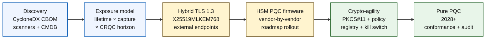

# ২০২৬ সালে কোয়ান্টাম-সেফ ব্যাংকিং ইনডেক্স: পোস্ট-কোয়ান্টাম ক্রিপ্টোগ্রাফি, QKD, ক্রিপ্টো-এজিলিটি এবং হার্ভেস্ট-নাও-ডিক্রিপ্ট-লেটার ঝুঁকি

<!-- lead-start: manual -->
<aside class="post-lead" aria-label="নিবন্ধের সারসংক্ষেপ">

<strong>সংক্ষেপে।</strong> ২০২৬ সালে কোয়ান্টাম-সেফ ব্যাংকিং একটি ডেলিভারি প্রোগ্রাম, যার সময়সীমা নির্ধারিত হয় দুটি বক্ররেখার ছেদবিন্দু দিয়ে — প্রতিষ্ঠানের আজ ধারণ করা ডেটার গোপনীয়তার আয়ুষ্কাল, এবং একটি ক্রিপ্টোগ্রাফিক্যালি রিলেভেন্ট কোয়ান্টাম কম্পিউটার (CRQC)-এর আগমন দিগন্ত। NIST FIPS 203 / 204 / 205 আগস্ট ২০২৪ থেকে চূড়ান্ত; CNSA 2.0 মার্কিন ফেডারেল শেষ-অবস্থা ২০৩৩-এ স্থির করেছে; দীর্ঘস্থায়ী ডেটায় হার্ভেস্ট-নাও-ডিক্রিপ্ট-লেটার ইতিমধ্যেই ঘটছে। বোর্ড-স্তরের কোয়ান্টাম স্কোরকার্ড চারটি নির্দিষ্ট শতাংশ ট্র্যাক করে: ইনভেন্টরি পূর্ণতা, HNDL এক্সপোজার, NIST মাইগ্রেশন অগ্রগতি, ক্রিপ্টো-এজিলিটি প্রস্তুতি।

<strong>মূল উপলব্ধি</strong>

<ul class="post-lead-takeaways">
  <li><strong>অ্যালগরিদম বিতর্ক ১৩ আগস্ট ২০২৪-এ শেষ হয়েছে।</strong> ML-KEM (FIPS 203), ML-DSA (FIPS 204), SLH-DSA (FIPS 205) — এগুলোই উত্তর। ২০২৬ সালেও যে ব্যাংক "বিজয়ী বাছাই" করতে অভ্যন্তরীণ মূল্যায়ন চালাচ্ছে, তারা ১৮ মাস পিছিয়ে।</li>
  <li><strong>হার্ভেস্ট-নাও-ডিক্রিপ্ট-লেটার ইতিমধ্যেই প্রযোজ্য।</strong> বিশ্বাসযোগ্য CRQC আগমনের পরেও যেসব ডেটার গোপনীয়তা আয়ুষ্কাল প্রসারিত — ৩০ বছরের মর্টগেজ, জীবন বীমা আন্ডাররাইটিং, MiFID II / GDPR লেনদেন রেকর্ডিং, M&amp;A ধরে রাখার আর্কাইভ — সেগুলোকে CRQC ঘোষণার অপেক্ষা না করে এখনই হাইব্রিড কোয়ান্টাম-সেফ কী এনক্যাপসুলেশনে সরাতে হবে।</li>
  <li><strong>ইনভেন্টরি হলো প্রবেশদ্বার পরিপক্বতা।</strong> একটি ক্রিপ্টোগ্রাফিক বিল অফ ম্যাটেরিয়ালস (CBOM) — প্রোটোকল, লাইব্রেরি, সার্টিফিকেট, HSM পার্টিশন, ভেন্ডর নির্ভরতা, অ্যাপ্লিকেশন মালিক, ডেটা-শ্রেণীবিভাগ আয়ুষ্কাল — বাকি সবকিছুর পূর্বশর্ত। কভারেজ নয়, সতেজতা ট্র্যাক করুন।</li>
  <li><strong>হাইব্রিড TLS 1.3 হলো ২০২৬-এর স্থাপনা।</strong> X25519MLKEM768 হাইব্রিড কী শেয়ার যা Chrome / Firefox / Cloudflare / Akamai আজ বাস্তবে নেগোশিয়েট করে। বিশুদ্ধ ML-KEM TLS HSM ফার্মওয়্যার ও CA প্রস্তুতির জন্য অপেক্ষা করছে।</li>
  <li><strong>ক্রিপ্টো-এজিলিটি হলো টেকসই ডেলিভারেবল।</strong> PKCS#11 অ্যাবস্ট্রাকশন, লেবেলযুক্ত কী, ব্যবসায়িক পরিষেবাকে অনুমোদিত অ্যালগরিদম সেটে ম্যাপ করা নীতি রেজিস্ট্রি। এটি ছাড়া পরবর্তী অ্যালগরিদম পরিবর্তন আরেকটি বহু-বছরের প্রোগ্রাম।</li>
</ul>
</aside>
<!-- lead-end -->

২০২৬ সালে কোয়ান্টাম-সেফ ব্যাংকিং অনুমান নয়, পরিচালনাগত মাইগ্রেশনের বিষয়। NIST প্রথম তিনটি পোস্ট-কোয়ান্টাম ক্রিপ্টোগ্রাফি মান চূড়ান্ত করেছে, এবং ব্যাংকগুলোকে এখন বুঝতে হবে কোন কোন সিস্টেম RSA, ECC, TLS, স্বাক্ষর, HSM, সার্টিফিকেট, পেমেন্ট চ্যানেল, আর্কাইভ এবং দীর্ঘস্থায়ী গোপন ডেটার উপর নির্ভরশীল। ইনডেক্স প্রশ্নটি সহজ: হুমকি পরিচালনাগত হয়ে ওঠার আগে কি প্রতিষ্ঠান ক্রিপ্টোগ্রাফি প্রতিস্থাপন করতে পারবে?

---

> **নির্বাহী সারসংক্ষেপ / মূল উপলব্ধি**
>
> - **NIST মান এখন বাস্তব।** FIPS 203 কী এনক্যাপসুলেশনের জন্য ML-KEM, FIPS 204 স্বাক্ষরের জন্য ML-DSA, এবং FIPS 205 একটি স্টেটলেস হ্যাশ-ভিত্তিক স্বাক্ষর মান হিসেবে SLH-DSA সংজ্ঞায়িত করে।
> - **ইনভেন্টরি প্রথম পরিপক্বতা গেট।** একটি ব্যাংক যা খুঁজে পায় না তা মাইগ্রেট করতে পারে না: সার্টিফিকেট, কী, প্রোটোকল, অ্যাপ্লিকেশন, ভেন্ডর, HSM, API, আর্কাইভ এবং এম্বেডেড সিস্টেম ম্যাপ করতে হবে।
> - **ক্রিপ্টো-এজিলিটি হলো টেকসই উদ্দেশ্য।** লক্ষ্য একবারের অ্যালগরিদম অদলবদল নয়; পুরো অ্যাপ্লিকেশন পুনঃডিজাইন না করে ক্রিপ্টোগ্রাফিক প্রিমিটিভ পরিবর্তনের সক্ষমতা।
> - **দীর্ঘস্থায়ী ডেটা জরুরি অবস্থার পরিবর্তন ঘটায়।** হার্ভেস্ট-নাও-ডিক্রিপ্ট-লেটার ঝুঁকির অর্থ হলো আজ ধরা ডেটা পরে পঠনযোগ্য হতে পারে যদি তা যথেষ্ট সময় ধরে মূল্যবান থাকে।
> - **QKD একটি বিশেষায়িত পরিপূরক।** কোয়ান্টাম কী বিতরণ সর্বোচ্চ-মূল্যের চ্যানেলে প্রাসঙ্গিক হতে পারে, কিন্তু এটি প্রতিষ্ঠান-ব্যাপী PQC মাইগ্রেশনকে প্রতিস্থাপন করে না।
>
---

## ২০২৬ কেন এই ইনডেক্সের বছর

২০২৪-২০২৫ সালের তিনটি পরিবর্তন কোয়ান্টাম-সেফকে একটি গবেষণা পর্যবেক্ষণ বিন্দু থেকে পরিমাপযোগ্য ব্যাংক প্রোগ্রামে পরিণত করেছে। প্রথমত, NIST ১৩ আগস্ট ২০২৪-এ প্রাথমিক পোস্ট-কোয়ান্টাম মান চূড়ান্ত করেছে: [FIPS 203 (ML-KEM) ⧉](https://nvlpubs.nist.gov/nistpubs/FIPS/NIST.FIPS.203.pdf "FIPS 203 — Module-Lattice-Based Key-Encapsulation Mechanism"), [FIPS 204 (ML-DSA) ⧉](https://nvlpubs.nist.gov/nistpubs/FIPS/NIST.FIPS.204.pdf "FIPS 204 — Module-Lattice-Based Digital Signature Standard"), [FIPS 205 (SLH-DSA) ⧉](https://nvlpubs.nist.gov/nistpubs/FIPS/NIST.FIPS.205.pdf "FIPS 205 — Stateless Hash-Based Digital Signature Standard")। সেই তারিখে অ্যালগরিদম-নির্বাচন বিতর্ক বন্ধ হয়েছে; ২০২৬ সালেও যেসব ব্যাংক "কোন স্কিম জেতে" অভ্যন্তরীণ ধারা চালাচ্ছে, তারা ১৮ মাস পিছিয়ে।

দ্বিতীয়ত, [NSA-র CNSA 2.0 ⧉](https://media.defense.gov/2022/Sep/07/2003071834/-1/-1/0/CSA_CNSA_2.0_ALGORITHMS_.PDF "Commercial National Security Algorithm Suite 2.0") মার্কিন ফেডারেল শেষ-অবস্থা ২০৩৩-এ স্থির করেছে, সফটওয়্যার ও ফার্মওয়্যার স্বাক্ষরের জন্য ২০২৭ থেকে এবং ব্রাউজার ও অপারেটিং সিস্টেমের জন্য ২০৩০ থেকে মধ্যবর্তী কাট-অফসহ। যেকোনো ব্যাংক যার মার্কিন ফেডারেল কাউন্টারপার্টি এক্সপোজার রয়েছে — FedNow, ট্রেজারি অপারেশন, ফেডারেল গ্রাহক অ্যাকাউন্ট — ফেডারেল ডেটা স্পর্শ করা সিস্টেমের জন্য সেই পরিধির ভেতরে অবস্থান করে। ঘড়ি আর বিমূর্ত নয়।

তৃতীয়ত, [হার্ভেস্ট-নাও-ডিক্রিপ্ট-লেটার (HNDL) ⧉](https://csrc.nist.gov/Projects/post-quantum-cryptography "NIST Post-Quantum Cryptography programme") জরুরিতার প্রধান ঝুঁকি যুক্তি। পরিশীলিত প্রতিপক্ষরা ইতিমধ্যেই বড় আর্থিক কেন্দ্রগুলোতে TLS-সুরক্ষিত পেমেন্ট বার্তা, SWIFT খাম, KYC নথি এবং দীর্ঘস্থায়ী আর্কাইভ সাইফারটেক্সট ধরছে। ২০২৬ সালে ধরা ডেটাকে কেবল ডিক্রিপশনের মুহূর্তে গোপনীয়তা-সংবেদনশীল থাকলেই হবে — ৩০ বছরের মর্টগেজ, জীবন বীমা আন্ডাররাইটিং, MiFID II / GDPR লেনদেন রেকর্ডিং এবং M&A ধরে রাখার আর্কাইভের জন্য সেই জানালা একটি ক্রিপ্টোগ্রাফিক্যালি রিলেভেন্ট কোয়ান্টাম কম্পিউটার (CRQC)-এর প্রতিটি বিশ্বাসযোগ্য অনুমানের অনেক বাইরে প্রসারিত। প্রতিপক্ষের আজ একটি কোয়ান্টাম কম্পিউটার দরকার নেই। ডেটা গুরুত্বহীন হওয়ার আগে তাদের একটি দরকার।

কোয়ান্টাম-সেফ ব্যাংকিং ইনডেক্স পরিমাপ করে আপনার প্রতিষ্ঠান সেই ছেদবিন্দু আসার আগে মাইগ্রেশন ডেলিভার করতে পারবে কিনা। কাজটি আর মাইগ্রেট করবেন কিনা সে নিয়ে নয়; বরং মাইগ্রেশনটি একটি প্রতিরক্ষাযোগ্য সময়সূচিতে শেষ হবে কিনা।

## ২০২৬ ইনডেক্স স্থাপত্য

| ইনডেক্স স্তর | ২০২৬ দিকনির্দেশনা | প্রস্তুতি মেট্রিক | অপ্রসঙ্গে পরিচালনার ঝুঁকি |
|---|---|---|---|
| **ইনভেন্টরি** | ক্রিপ্টোগ্রাফিক সম্পদ, প্রোটোকল, সার্টিফিকেট, ভেন্ডর এবং ডেটা শ্রেণী ম্যাপ করুন | ইনভেন্টরি করা এস্টেটের শতাংশ | অজানা কোয়ান্টাম-দুর্বল নির্ভরতা |
| **এক্সপোজার** | গোপনীয়তা আয়ুষ্কাল এবং লেনদেন গুরুত্ব অনুযায়ী সিস্টেম শ্রেণীবদ্ধ করুন | মূল্য ও আয়ুষ্কাল অনুযায়ী উচ্চ-ঝুঁকির সম্পদ | ভুল-অগ্রাধিকারপ্রাপ্ত মাইগ্রেশন |
| **মাইগ্রেশন** | NIST মানের সাথে সারিবদ্ধ হাইব্রিড ও PQC-প্রস্তুত প্যাটার্ন গ্রহণ করুন | ML-KEM এবং ML-DSA প্রস্তুতি | সময়সীমার চাপে জরুরি পুনঃপ্ল্যাটফর্মিং |
| **ক্রিপ্টো-এজিলিটি** | অ্যাপ্লিকেশন যুক্তি ক্রিপ্টোগ্রাফিক প্রিমিটিভ থেকে পৃথক করুন | নীতি-নিয়ন্ত্রিত ক্রিপ্টো কভারেজ | এস্টেটজুড়ে হার্ড-কোডেড অ্যালগরিদম |
| **আশ্বাস** | আন্তঃকার্যক্ষমতা, কর্মক্ষমতা, HSM সমর্থন, সার্টিফিকেট ও ভেন্ডর প্রস্তুতি পরীক্ষা করুন | পরীক্ষা পাস হার এবং ব্যতিক্রম ব্যাকলগ | ভঙ্গুর চ্যানেল বা দুর্বল ফলব্যাক নিয়ন্ত্রণ |

### বোর্ড-স্তরের কোয়ান্টাম স্কোরকার্ড

একটি বিশ্বাসযোগ্য কোয়ান্টাম প্রস্তুতি স্কোরকার্ডের জন্য শুধু প্রকল্পের অবস্থা নয়, নির্দিষ্ট শতাংশ ট্র্যাক করা প্রয়োজন:

1. **ইনভেন্টরি পূর্ণতা:** সম্পূর্ণরূপে ম্যাপ করা ক্রিপ্টোগ্রাফিক বিল অফ ম্যাটেরিয়ালস (CBOM) সহ স্তর-১ অ্যাপ্লিকেশনের শতাংশ।
2. **HNDL এক্সপোজার:** হাইব্রিড কোয়ান্টাম-সেফ কী এনক্যাপসুলেশন ছাড়া নেটওয়ার্কে প্রেরিত দীর্ঘস্থায়ী গোপন ডেটার পরিমাণ (যেমন, PII, বাণিজ্য গোপনীয়তা)।
3. **NIST মাইগ্রেশন অগ্রগতি:** FIPS 203 (ML-KEM) এবং FIPS 204 (ML-DSA) মানে মাইগ্রেট করা অসমমিতিক এনক্রিপশন কী ও ডিজিটাল স্বাক্ষরের শতাংশ।
4. **ক্রিপ্টো-এজিলিটি প্রস্তুতি:** কোড পুনঃসংকলন ছাড়াই কেন্দ্রীভূত নীতির মাধ্যমে ক্রিপ্টোগ্রাফিক অ্যালগরিদম ঘোরানো যায় এমন গুরুত্বপূর্ণ সিস্টেমের শতাংশ।

## এখন যে সংকেতগুলো ট্র্যাক করতে হবে

| সংকেত | ব্যাংকের জন্য এর অর্থ | উৎস |
|---|---|---|
| **FIPS 203 ML-KEM** | সাধারণ এনক্রিপশন কী প্রতিষ্ঠার প্রাথমিক NIST মান | [NIST ⧉](https://www.nist.gov/news-events/news/2024/08/nist-releases-first-3-finalized-post-quantum-encryption-standards "First three finalized post-quantum encryption standards") |
| **FIPS 204 ML-DSA** | ডিজিটাল স্বাক্ষরের প্রাথমিক NIST মান | [NIST ⧉](https://www.nist.gov/news-events/news/2024/08/nist-releases-first-3-finalized-post-quantum-encryption-standards "First three finalized post-quantum encryption standards") |
| **FIPS 205 SLH-DSA** | হ্যাশ-ভিত্তিক স্বাক্ষর বিকল্প ও ব্যাকআপ ডিজাইন | [NIST ⧉](https://www.nist.gov/news-events/news/2024/08/nist-releases-first-3-finalized-post-quantum-encryption-standards "First three finalized post-quantum encryption standards") |
| **তাৎক্ষণিক ইন্টিগ্রেশন উৎসাহিত** | NIST স্পষ্টভাবে প্রশাসকদের মান ইন্টিগ্রেট করা শুরু করতে বলে কারণ সম্পূর্ণ ইন্টিগ্রেশনে সময় লাগে | [NIST ⧉](https://www.nist.gov/news-events/news/2024/08/nist-releases-first-3-finalized-post-quantum-encryption-standards "First three finalized post-quantum encryption standards") |
| **ব্যাংকের কোয়ান্টাম প্রোগ্রাম সম্প্রসারিত হচ্ছে** | বড় ব্যাংকগুলো PQC ট্রানজিশনের প্রস্তুতির পাশাপাশি কোয়ান্টাম প্রযুক্তি অন্বেষণ করছে | [Quantum Insider ⧉](https://thequantuminsider.com/2026/03/27/15-plus-global-banks-probing-the-wonderful-world-of-quantum-technologies/ "Overview of global banks exploring quantum technologies") |

## মাইগ্রেশন শুরু হয় ক্রিপ্টোগ্রাফির খতিয়ান দিয়ে

এই মুহূর্তে মাইগ্রেশন ক্রম সুপরিচিত। প্রতিটি গেট প্রমাণ তৈরি করে যা পরবর্তীটিকে চালায়; একটি গেট এড়িয়ে যাওয়া বা সংকুচিত করাই ইনডেক্স স্থাপত্যের ব্যর্থতা কলামে দেখানো জরুরি পুনঃপ্ল্যাটফর্মিং ঝুঁকি তৈরি করে।

প্রথম ডেলিভারেবল একটি নতুন অ্যালগরিদম নয়; এটি একটি ক্রিপ্টোগ্রাফিক বিল অফ ম্যাটেরিয়ালস (CBOM)। ব্যাংকগুলোর একটি জীবন্ত ইনভেন্টরি প্রয়োজন যা ব্যবসায়িক পরিষেবাকে অ্যালগরিদম, লাইব্রেরি, সার্টিফিকেট, কী দৈর্ঘ্য, HSM, ডেটা আয়ুষ্কাল, ভেন্ডর এবং পরিচালনাগত মালিকদের সাথে সংযুক্ত করে। সেই খতিয়ান ছাড়া, কোয়ান্টাম-সেফ মাইগ্রেশন অনুমানে পরিণত হয়।

CBOM রেকর্ড সেটে প্রতিটি ক্রিপ্টোগ্রাফিক প্রিমিটিভের জন্য ধরা উচিত: প্রোটোকল বা ইন্টারফেস (TLS 1.3, IPsec, SSH, কাস্টম পেমেন্ট-বার্তা ফরম্যাট), অ্যালগরিদম এবং প্যারামিটার সেট (RSA-2048, ECDH P-256, ML-KEM-768, ML-DSA-65), লাইব্রেরি ও সংস্করণ (OpenSSL 3.4, BoringSSL কমিট হ্যাশ, ভেন্ডর SDK বিল্ড), হার্ডওয়্যার সীমানা (HSM পার্টিশন, TPM, সিকিউর এনক্লেভ, বা কোনোটিই নয়), প্রযোজ্য হলে সার্টিফিকেট পরিচয়, অ্যাপ্লিকেশন মালিক এবং ডেটা-শ্রেণীবিভাগ আয়ুষ্কাল। ২০২৫-২০২৬ সালে প্রোডাকশনে আসা টুল — IBM Quantum Safe Inventory, ওপেন-সোর্স [CycloneDX CBOM স্পেসিফিকেশন ⧉](https://cyclonedx.org/capabilities/cbom/ "CycloneDX Cryptography Bill of Materials"), CryptoNext / Sandbox / PQShield-এর এন্টারপ্রাইজ স্ক্যানার — বিদ্যমান CMDB পাইপলাইনে যুক্ত হয়। একটিও স্বয়ংসম্পূর্ণ নয়; ভেন্ডর টুলিং এবং নিবেদিত হেডকাউন্ট থাকলেও ১২-১৮ মাসের CBOM বিল্ড চক্র প্রত্যাশা করুন।

ট্র্যাক করার মেট্রিক হলো সতেজতা, কভারেজ নয়। দুই মাস পুরনো একটি CBOM কোনো CBOM না থাকার চেয়ে খারাপ কারণ এটি নিরাপত্তা দলকে কী মাইগ্রেট হয়েছে সে সম্পর্কে মিথ্যা আত্মবিশ্বাস দেয়।

## প্রথমে হাইব্রিড, সর্বদা চটপটে

বেশিরভাগ ব্যাংক একসাথে সবকিছু পাল্টাবে না। বাস্তবসম্মত প্যাটার্ন হলো হাইব্রিড স্থাপনা, যেখানে ক্ল্যাসিক্যাল এবং পোস্ট-কোয়ান্টাম প্রক্রিয়া একসাথে চলে যখন ভেন্ডর, প্রোটোকল, সার্টিফিকেট এবং পরিচালনাগত টুলিং পরিপক্ক হয়। দীর্ঘমেয়াদী লক্ষ্য হলো ক্রিপ্টো-এজিলিটি: নীতি-নিয়ন্ত্রিত ক্রিপ্টোগ্রাফিক পছন্দ যা ব্যবসায়িক অ্যাপ্লিকেশন পুনঃনির্মাণ ছাড়াই পরিবর্তন করা যায়।

[ইন্টারেক্টিভ কম্পোনেন্ট যুক্ত করুন: হার্ভেস্ট-নাও-ডিক্রিপ্ট-লেটার (HNDL) ঝুঁকি ক্যালকুলেটর — একটি স্লাইডার-ভিত্তিক টুল যেখানে নির্বাহীরা ডেটার শেলফ-লাইফ বনাম আনুমানিক কোয়ান্টাম সময়রেখা ইনপুট করে তাদের এক্সপোজার জানালা দেখেন।]

> **মূল অন্তর্দৃষ্টি:** যদি আপনার ডেটা ১০ বছর গোপন থাকা প্রয়োজন এবং একটি ক্রিপ্টোগ্রাফিক্যালি রিলেভেন্ট কোয়ান্টাম কম্পিউটার (CRQC) ৭ বছর দূরে থাকে, আপনার মাইগ্রেশন সময়সীমা ৭ বছর পরে নয় — সেটি ছিল ৩ বছর আগে।

বাস্তবে এর অর্থ বহির্মুখী এন্ডপয়েন্টের জন্য হাইব্রিড `X25519MLKEM768` কী শেয়ার সহ TLS 1.3 (Chrome / Firefox / Cloudflare / Akamai সবাই আজ এটি সমর্থন করে), HSM ও CA অবকাঠামো ধরা না দেওয়া পর্যন্ত ক্ল্যাসিক্যাল স্বাক্ষর শৃঙ্খল, এবং একটি PKCS#11 অ্যাবস্ট্রাকশন স্তর যা নীতি রেজিস্ট্রিকে ব্যবসায়িক অ্যাপ্লিকেশন পুনঃসংকলন ছাড়াই অ্যালগরিদম ঘোরানোর সুযোগ দেয়। ক্রিপ্টো-এজিলিটিই নির্ধারণ করে পরবর্তী অ্যালগরিদম পরিবর্তন (কখন, কিনা নয়) ছয় সপ্তাহের ঘূর্ণন হবে নাকি আরেকটি সাত-বছরের প্রোগ্রাম।

## QKD-র অবস্থান কোথায়

কোয়ান্টাম কী বিতরণ ইনডেক্সে একটি উচ্চ-সংবেদনশীলতা চ্যানেল বিকল্প হিসেবে অন্তর্ভুক্ত, বিশেষত আর্থিক-বাজার অবকাঠামো, কেন্দ্রীয়-ব্যাংক সংযোগ এবং অত্যন্ত সংবেদনশীল প্রাতিষ্ঠানিক প্রবাহের জন্য। এটিকে PQC-র পরিপূরক হিসেবে বিবেচনা করতে হবে, এন্টারপ্রাইজ মাইগ্রেশন বিলম্বের অজুহাত হিসেবে নয়।

## ব্যাংকের ধরন অনুযায়ী এর অর্থ

### বৈশ্বিক সিস্টেমিকভাবে গুরুত্বপূর্ণ ব্যাংক

কঠিন সমস্যা হলো মাত্রা: হাজার হাজার TLS এন্ডপয়েন্ট, শত শত HSM পার্টিশন, কয়েক ডজন অভ্যন্তরীণ সার্টিফিকেট কর্তৃপক্ষ, এম্বেডেড ক্রিপ্টোগ্রাফিক প্রিমিটিভ সহ শত শত ব্যবসায়িক অ্যাপ্লিকেশন, এবং ব্যাংক পরিবর্তন করতে পারে না এমন ভেন্ডর SDK। বিনিয়োগ আরেকটি পাইলট নয়; এটি CBOM টুলিং, প্রতিটি নতুন বিল্ডে যুক্ত PKCS#11 অ্যাবস্ট্রাকশন স্তর, HSM একীকরণ পরিকল্পনা যা PQC ফার্মওয়্যারে নেতৃত্ব দিতে একজন ভেন্ডর বাছাই করে এবং অন্যদের জন্য বহু-বছরের লেজ গ্রহণ করে, এবং নীতি রেজিস্ট্রি যা FIPS 203 / 204 / 205 মাইগ্রেশন শেষ হওয়ার অনেক পরেও টেকসই ক্রিপ্টো-এজিলিটি পৃষ্ঠ হয়ে ওঠে।

### লেনদেন ও কর্পোরেট ব্যাংক

মাইগ্রেশনের পরিসর G-SIB স্তরের চেয়ে সংকীর্ণ কিন্তু HNDL এক্সপোজার তীব্র: SWIFT সীমান্ত-পার বার্তা, কর্পোরেট-কাউন্টারপার্টি PII বহনকারী কাঠামোগত পেমেন্ট ডেটা, বাণিজ্য-অর্থ নথি ধারণকারী নথি-বিনিময় প্ল্যাটফর্ম এবং দীর্ঘ-ধারণ রিপোর্টিং আর্কাইভ। প্রতিটি গ্রাহকমুখী এন্ডপয়েন্টে হাইব্রিড TLS এবং ধারণ আর্কাইভের জন্য বিশ্রামে PQC-কে অগ্রাধিকার দিন। HSM-ভেন্ডর জবাবদিহি ঠেলে দিন — কর্পোরেট-ব্যাংকিং প্ল্যাটফর্ম দলের সরাসরি ক্রয় ক্ষমতা আছে যা পাইকারি প্রযুক্তি দলের প্রায়ই থাকে না।

### আঞ্চলিক ব্যাংক

যে ভেন্ডর স্ট্যাকে ইতিমধ্যেই ক্রিপ্টো-এজিলিটি প্রিমিটিভ রয়েছে সেটি কিনুন। এমন একটি কোর ব্যাংকিং প্ল্যাটফর্ম বাছুন যার ভেন্ডর একটি CBOM প্রকাশ করে এবং ML-KEM / ML-DSA সমর্থনের সময়সূচি প্রতিশ্রুতি দেয়। ভেন্ডরের HSM রোডম্যাপ ব্যাংকের মাইগ্রেশন সময়সীমার সাথে সারিবদ্ধ কিনা যাচাই করুন। শূন্য থেকে ক্রিপ্টো-এজিলিটি তৈরির জন্য প্রয়োজনীয় প্রকৌশল ক্ষমতা বহু-বছরের; ভেন্ডর সেই খরচ অনেক গ্রাহকের মধ্যে দেয় এবং ব্যাংক সুবিধা পায়। বৈধতা কাজ — প্রতিষ্ঠানের MRM প্রক্রিয়ায় ভেন্ডরের দাবি টিকে কিনা যাচাই — হলো বৈধ অভ্যন্তরীণ পরিসর।

### ফিনটেক, PSP এবং অবকাঠামো প্রদানকারী

২০২৬ সালে ব্যাংকে বিক্রি করা ভেন্ডরদের জন্য প্রতিযোগিতামূলক প্রশ্ন "আপনি কি PQC সমর্থন করেন" নয়। এটি "আপনি কি আপনার প্ল্যাটফর্মের জন্য একটি CycloneDX CBOM, একটি HSM-ভেন্ডর সমর্থন ম্যাট্রিক্স এবং একটি লিখিত অ্যালগরিদম-ঘূর্ণন SLA তৈরি করতে পারেন।" যেসব ভেন্ডর হ্যাঁ বলবে তারা ২০২৬-২০২৭-এ স্তর-১ ক্রয় গেট পাস করবে। যারা পারবে না তারা একজন প্রতিযোগীর কাছে নবীকরণ চক্র হারাবে যে পারে।

## উপসংহার

২০২৬ সালে কোয়ান্টাম-সেফ ব্যাংকিং একটি গবেষণা পর্যবেক্ষণ বিন্দু নয়; এটি একটি ডেলিভারি প্রোগ্রাম যার সময়সীমা দুটি বক্ররেখার ছেদবিন্দু দ্বারা নির্ধারিত — প্রতিষ্ঠানের আজ ধারণ করা ডেটার গোপনীয়তা আয়ুষ্কাল, এবং একটি ক্রিপ্টোগ্রাফিক্যালি রিলেভেন্ট কোয়ান্টাম কম্পিউটারের আগমন দিগন্ত। ২০৩০ সালে নিয়ন্ত্রক ও কাউন্টারপার্টিদের কাছে যেসব প্রতিষ্ঠান বিশ্বাসযোগ্য দেখাবে তারা ২০২৪-এ CBOM নির্মাণ শুরু করেছে, ২০২৬-এর শেষের আগে প্রতিটি বাহ্যিক এন্ডপয়েন্টে হাইব্রিড TLS স্থাপন করেছে এবং প্রথম দিন থেকে প্রতিটি নতুন বিল্ডে ক্রিপ্টো-এজিলিটি প্রকৌশল করেছে। যারা করেনি তারা আবিষ্কার করবে যে প্রতিপক্ষ আজ যে ডেটা সংগ্রহ করছে তার জন্য তাদের মাইগ্রেশন জানালা ইতিমধ্যেই বন্ধ হয়ে গেছে কিনা।

মাইগ্রেশনকে সেভাবে পরিমাপ করুন যেভাবে আপনি যেকোনো পরিচালনাগত প্রোগ্রাম পরিমাপ করেন: পরিসর জানা, ক্রম অগ্রাধিকার পেয়েছে, সময়সীমা প্রতিশ্রুত, ব্যতিক্রম রেজিস্টার সৎ। যত গভীরভাবে নিজের এস্টেট দেখবেন, মাইগ্রেশন জানালা তত ছোট মনে হবে।

## প্রায়শই জিজ্ঞাসিত প্রশ্ন

**একটি ব্যাংক প্রথমে কী ইনভেন্টরি করবে?**

বাহ্যিকভাবে উন্মুক্ত TLS, পেমেন্ট চ্যানেল, গ্রাহক প্রমাণীকরণ, আন্তঃব্যাংক সংযোগ, HSM-সমর্থিত পরিষেবা, দীর্ঘমেয়াদী আর্কাইভ এবং দীর্ঘ ব্যবহারযোগ্য জীবনের গোপন ডেটা পরিচালনাকারী সিস্টেম দিয়ে শুরু করুন।

**PQC কি শুধুমাত্র একটি সাইবার নিরাপত্তা সমস্যা?**

না। এটি পেমেন্ট, পরিচয়, আইনি প্রমাণ, লেনদেন স্বাক্ষর, গ্রাহকের আস্থা, ডেটা ধারণ, ভেন্ডর ব্যবস্থাপনা এবং পরিচালনাগত স্থিতিস্থাপকতাকে প্রভাবিত করে।

**ক্রিপ্টো-এজিলিটি বলতে কী বোঝায়?**

ক্রিপ্টো-এজিলিটি মানে হার্ড-কোডেড অ্যাপ্লিকেশন পরিবর্তনের পরিবর্তে নীতি ও প্ল্যাটফর্ম নিয়ন্ত্রণের মাধ্যমে ক্রিপ্টোগ্রাফিক প্রিমিটিভ পরিবর্তনের সক্ষমতা।

**ব্যাংকগুলোর কি আরও মানের জন্য অপেক্ষা করা উচিত?**

না। NIST প্রশাসকদের প্রথম চূড়ান্ত মান ইন্টিগ্রেট করা শুরু করতে উৎসাহিত করেছে কারণ সম্পূর্ণ ইন্টিগ্রেশনে সময় লাগে।

## তথ্যসূত্র

- NIST, (২০২৬)। [প্রথম তিনটি চূড়ান্ত পোস্ট-কোয়ান্টাম এনক্রিপশন মান ⧉](https://www.nist.gov/news-events/news/2024/08/nist-releases-first-3-finalized-post-quantum-encryption-standards "First three finalized post-quantum encryption standards")।

<!-- enrich-start -->
<aside class="author-card" aria-label="লেখক সম্পর্কে"><strong class="author-card-name"><a href="/about/index.html">সেবাস্তিয়ান রুসো</a></strong>সিনিয়র ব্যাংকিং প্রযুক্তিবিদ, প্রয়োগ-ভিত্তিক AI, পেমেন্ট ইনফ্রাস্ট্রাকচার, টোকেনাইজড অর্থ, ISO 20022, পোস্ট-কোয়ান্টাম নিরাপত্তা, ক্লাউড-নেটিভ আর্থিক পরিষেবা এবং নিয়ন্ত্রিত ডিজিটাল বাজার নিয়ে লেখেন।HSBC Commercial &amp; Investment Bank, PayPal, Barclays, Shazam, AKQA, Virgin Group-এ ২০+ বছরের অভিজ্ঞতা। <a href="/about/index.html">সম্পূর্ণ প্রোফাইল</a> &middot; <a href="https://www.linkedin.com/in/sebastienrousseau/" rel="external noopener">LinkedIn</a> &middot; <a href="https://github.com/sebastienrousseau" rel="external noopener">GitHub</a></aside>

সর্বশেষ পর্যালোচনা <time datetime="2026-06-04">২০২৬-০৬-০৪</time>।

<!-- enrich-end -->
