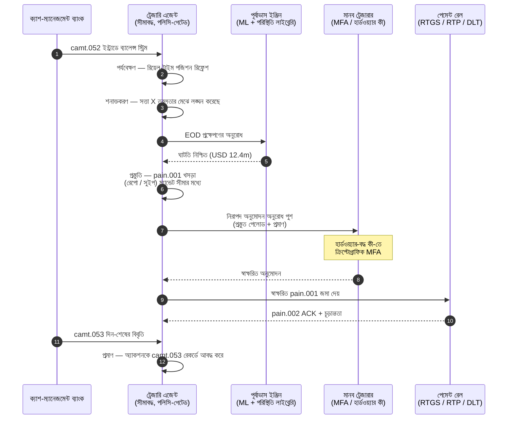

# 2026-এ স্বায়ত্তশাসিত ট্রেজারি সূচক: এজেন্টিক ট্রেজারি, প্রোগ্রামযোগ্য তরলতা, টোকেনাইজড আমানত ও রিয়েল-টাইম নগদ নিয়ন্ত্রণ

<!-- lead-start -->
<aside class="post-lead" aria-label="নিবন্ধের সারসংক্ষেপ">

<strong>সংক্ষেপে।</strong> 2026-এর স্বায়ত্তশাসিত ট্রেজারি সূচক — এজেন্টিক ওয়ার্কফ্লো, প্রোগ্রামযোগ্য তরলতার পরিধি, টোকেনাইজড আমানতের একীকরণ, রিয়েল-টাইম পেমেন্ট অর্কেস্ট্রেশন ও স্বয়ংক্রিয় নগদ নিয়ন্ত্রণকে এক পরিচালন-মডেল কাঠামো হিসেবে পরিমাপ করে।

<strong>মূল গ্রহণযোগ্য বিষয়</strong>

<ul class="post-lead-takeaways">
  <li><strong>ট্রেজারি একটি রিয়েল-টাইম অপারেটিং সিস্টেমে পরিণত হচ্ছে।</strong> স্থির নগদ পূর্বাভাস ও ব্যাচ সুইপ আর পরিমাপের একক নয়; রিয়েল-টাইম ডেটার উপর চলা এজেন্টিক ওয়ার্কফ্লোই এখন সেই একক।</li>
  <li><strong>প্রোগ্রামযোগ্য তরলতা এখন বাস্তবসম্মত।</strong> টোকেনাইজড আমানত + রিয়েল-টাইম রেল প্রতি-ঘটনায় তরলতা সরবরাহকে ত্রৈমাসিক উদ্যোগ নয়, একটি ওয়ার্কফ্লো প্রিমিটিভ করে তোলে।</li>
  <li><strong>টোকেনাইজড আমানতই ট্রেজারারের পছন্দের ডিজিটাল অর্থ।</strong> ব্যাংক-মানি অর্থনীতি, প্রোগ্রামযোগ্যতা ও ইন্ট্রাডে নিশ্চয়তা — স্টেবলকয়েনের ইস্যুকারী-ঝুঁকি ও রিজার্ভ প্রশ্ন ছাড়াই।</li>
  <li><strong>কন্ট্রোল প্লেনই নতুন অডিট সারফেস।</strong> ম্যান্ডেট, সীমা, ম্যানুয়াল ওভাররাইড পথ ও রিভার্সালের প্রমাণ — প্রতি-অ্যাকশনের ম্যানুয়াল অনুমোদন নয়, প্ল্যাটফর্ম প্রিমিটিভ হিসেবে চালাতে হবে।</li>
  <li><strong>CFO স্কোরকার্ড এখন প্রতি-সিদ্ধান্তে, প্রতি-ত্রৈমাসিকে নয়।</strong> নগদের খরচ, ইন্ট্রাডে তরলতা বাফার হ্রাস, FX দক্ষতা ও পূর্বাভাসের নির্ভুলতা ওয়ার্কফ্লো-গতিতে পরিমাপ হয়।</li>
</ul>

<strong>সম্পর্কিত পাঠ:</strong> <a href="https://sebastienrousseau.com/2026-05-25-programmable-liquidity-ai-tokenised-deposits-real-time-treasury-2026/index.html">2026-এ প্রোগ্রামযোগ্য তরলতা: AI, টোকেনাইজড আমানত ও রিয়েল-টাইম ট্রেজারি অর্কেস্ট্রেশন</a>, <a href="https://sebastienrousseau.com/2026-05-21-tokenised-deposits-banking-services-status-2026/index.html">2026-এ টোকেনাইজড আমানত: ব্যাংকিং পরিষেবা, স্টেবলকয়েন প্রতিযোগিতা ও প্রোগ্রামযোগ্য বাণিজ্যিক ব্যাংক মুদ্রার অবস্থান</a>।

</aside>
<!-- lead-end -->

স্বায়ত্তশাসিত ট্রেজারি হল এজেন্টিক AI, হোলসেল পেমেন্ট, টোকেনাইজড আমানত ও রিয়েল-টাইম তরলতার স্বাভাবিক মিলনস্থল। 2026-এ সেরা ট্রেজারি স্থাপত্যগুলি শুধু নগদের পূর্বাভাস দেবে না; সেগুলি একাধিক অ্যাকাউন্ট, মুদ্রা, রেল ও নিষ্পত্তি সম্পদ জুড়ে সীমাবদ্ধ তরলতা ক্রিয়াগুলি সুপারিশ করবে, ব্যাখ্যা করবে এবং সময়ের সঙ্গে কার্যকরও করবে।

---

> **এক্সিকিউটিভ সারাংশ / মূল গ্রহণযোগ্য বিষয়**
>
> - **ট্রেজারি প্রতিবেদন থেকে নিয়ন্ত্রণে স্থানান্তরিত হচ্ছে।** রিয়েল-টাইম ব্যালেন্স, পূর্বাভাস, পেমেন্ট স্ট্যাটাস ও তরলতার চলাচল এক ওয়ার্কফ্লোর অংশ হয়ে উঠছে।
> - **এজেন্টিক AI ট্রেজারির নতুন ইন্টারফেস তৈরি করে।** এজেন্টরা পজিশন পর্যবেক্ষণ করতে পারে, অসঙ্গতি সামনে আনতে পারে, ফান্ডিং অ্যাকশন প্রস্তুত করতে পারে এবং সংজ্ঞায়িত ম্যান্ডেটের মধ্যে সিদ্ধান্ত এসকেলেট করতে পারে।
> - **প্রোগ্রামযোগ্য অর্থ নগদের লেগ বদলে দিচ্ছে।** টোকেনাইজড আমানত ও হোলসেল CBDC পরীক্ষাগুলি অ্যাটমিক নিষ্পত্তি, শর্তসাপেক্ষ পেমেন্ট ও সর্বদা-সক্রিয় তরলতার নতুন সম্ভাবনা তৈরি করে।
> - **সূচকে কর্তৃত্ব পরিমাপ করতে হবে।** প্রশ্নটি এজেন্ট কোনো অ্যাকশন প্রস্তাব করতে পারে কি না তা নয়; প্রশ্ন হল কর্তৃত্ব, সীমা, অনুমোদন ও প্রমাণ স্পষ্ট কি না।
> - **ট্রেজারি মূল্য পরিমাপযোগ্য।** সংরক্ষিত তরলতা, হ্রাসকৃত ম্যানুয়াল তদন্ত, এড়ানো নিষ্পত্তি ব্যর্থতা ও মুক্তিপ্রাপ্ত কার্যকরী মূলধন — এগুলিই সাফল্য সংজ্ঞায়িত করবে।
>
---

## কেন 2026 এই সূচকের বছর

Stanford AI সূচক উপযোগী, কারণ এটি একটি দ্রুত-পরিবর্তনশীল প্রযুক্তি ক্ষেত্রকে পরিমাপযোগ্য কিছু হিসেবে গণ্য করে: গবেষণার আউটপুট, প্রযুক্তিগত পারফরম্যান্স, দায়িত্বশীল মোতায়েন, অর্থনীতি, সেক্টর গ্রহণ, নীতি ও জনমত — সবকিছুকে একটিই কাঠামোয় আনা হয় ([Stanford HAI ⧉](https://hai.stanford.edu/ai-index/2026-ai-index-report "2026 AI সূচক প্রতিবেদন"))। ব্যাংক ও আর্থিক প্রতিষ্ঠানগুলির এখন পরিকাঠামোর জন্য একই শৃঙ্খলা প্রয়োজন। এজেন্টিক AI, কোয়ান্টাম-নিরাপদ নিরাপত্তা, ক্লাউড-নেটিভ স্থিতিস্থাপকতা ও হোলসেল পেমেন্ট আর পৃথক উদ্ভাবন ট্র্যাক নয়; সেগুলি এক পরিচালন মডেলে অভিসারিত হচ্ছে।

ব্যাংকের জন্য বাস্তব প্রশ্ন হল না যে প্রতিটি ডোমেন গুরুত্বপূর্ণ কি না। প্রশ্ন হল প্রতিষ্ঠান একই সময়ে সব ডোমেনে প্রস্তুতি পরিমাপ করতে পারে কি না। একটি ব্যাংক এজেন্টিক AI মোতায়েন করতে পারে এবং তবুও ভঙ্গুর হতে পারে, যদি তার ক্রিপ্টোগ্রাফি মাইগ্রেশন-প্রস্তুত না হয়। সে ক্লাউড প্ল্যাটফর্ম আধুনিকীকরণ করতে পারে এবং তবুও ব্যর্থ হতে পারে, যদি পেমেন্ট ডেটা অসংগঠিত থাকে। সে টোকেনাইজেশন পাইলট চালাতে পারে এবং তবুও সিস্টেমিক ঝুঁকি তৈরি করতে পারে, যদি নিষ্পত্তি, তরলতা, পরিচয় ও অডিট স্তরগুলি একসঙ্গে নকশা করা না হয়।

## 2026 সূচকের স্থাপত্য

| সূচক স্তর | 2026 দিকনির্দেশ | প্রস্তুতি মেট্রিক | অপব্যবস্থাপনায় ঝুঁকি |
|---|---|---|---|
| **দৃশ্যমানতা** | অ্যাকাউন্ট, পেমেন্ট, তরলতা ও এক্সপোজার ডেটাকে একত্র করুন | রিয়েল-টাইম নগদ পজিশনের কভারেজ | খণ্ডিত নগদ দৃশ্যমানতা |
| **পূর্বাভাস** | ব্যালেন্স, প্রবাহ ও ফান্ডিং চাহিদার পূর্বাভাসে AI ব্যবহার করুন | পূর্বাভাসের নির্ভুলতা ও ব্যতিক্রমের হার | দুর্বল ডেটায় মিথ্যা আত্মবিশ্বাস |
| **স্বায়ত্ততা** | এজেন্টদের সুপারিশ ও ক্রিয়ার জন্য সীমাবদ্ধ কর্তৃত্ব দিন | ম্যান্ডেটের কভারেজ ও অনুমোদনের গুণমান | অনুমোদনহীন বা অব্যাখ্যাত অ্যাকশন |
| **প্রোগ্রামযোগ্যতা** | যেখানে মূল্য যোগ করে, সেখানে টোকেনাইজড আমানত ও স্মার্ট শর্ত ব্যবহার করুন | শর্তসাপেক্ষ পেমেন্ট ও অ্যাটমিক নিষ্পত্তির ইউজ কেস | প্রযুক্তি-নেতৃত্বাধীন ট্রেজারি পাইলট |
| **নিয়ন্ত্রণ** | সীমা, নিষেধাজ্ঞা, FX, তরলতা ও অডিট নিয়ন্ত্রণ এমবেড করুন | প্রতি ট্রেজারি অ্যাকশনে নিয়ন্ত্রণের প্রমাণ | কার্যকরীকরণের পরে ম্যানুয়াল গভর্নেন্স |

## অনুসরণ করার বর্তমান সংকেত

| সংকেত | ব্যাংকের জন্য এর অর্থ | উৎস |
|---|---|---|
| **আর্থিক পরিষেবায় 52% এজেন্টিক AI গ্রহণ** | শাসিত প্ল্যাটফর্মের মাধ্যমে ট্রেজারি এখন এজেন্টিক ওয়ার্কফ্লো শোষণ করতে পারে | [Cambridge CCAF ⧉](https://www.jbs.cam.ac.uk/faculty-research/centres/alternative-finance/publications/2026-global-ai-in-financial-services-report/ "2026 আর্থিক পরিষেবায় বৈশ্বিক AI প্রতিবেদন") |
| **Project Agorá শর্তসাপেক্ষ পেমেন্ট** | টোকেনাইজেশন শর্তসাপেক্ষ ও সর্বদা-সক্রিয় পেমেন্ট সক্ষমতা সক্ষম করতে পারে | [BIS ⧉](https://www.bis.org/about/bisih/topics/fmis/agora.htm "Project Agorá") |
| **Bank of England — Digital Securities Sandbox** | DLT-জারি করা বন্ড ও ইক্যুইটি 「ডেলিভারি-বনাম-পেমেন্ট (DvP)」 ভিত্তিতে নিষ্পত্তি হয় — সম্পদের লেগ এবং নগদের লেগ (হোলসেল CBDC বা টোকেনাইজড বাণিজ্যিক-ব্যাংক আমানত) একই অ্যাটমিক লেনদেনে নিষ্পত্তি হয়, যা মূল কাউন্টারপার্টি ঝুঁকি দূর করে | [Bank of England ⧉](https://www.bankofengland.co.uk/financial-stability/digital-securities-sandbox "Digital Securities Sandbox") |
| **SWIFT কাঠামোবদ্ধ ঠিকানার সময়সীমা** | ট্রেজারি ডেটা উৎসেই সঠিকভাবে ধরতে হবে | [SWIFT ⧉](https://www.swift.com/news-events/news/iso-20022-milestone-november-2026-unstructured-addresses-be-removed "ISO 20022 নভেম্বর 2026 কাঠামোবদ্ধ ঠিকানার মাইলস্টোন") |
| **বড় FI-গুলি AI-এর মূল্য পরিমাপে সংগ্রাম করছে** | ট্রেজারি অটোমেশনের জন্য কঠোর অর্থনৈতিক মেট্রিক দরকার | [Cambridge CCAF ⧉](https://www.jbs.cam.ac.uk/faculty-research/centres/alternative-finance/publications/2026-global-ai-in-financial-services-report/ "2026 আর্থিক পরিষেবায় বৈশ্বিক AI প্রতিবেদন") |

## ট্রেজারি এজেন্টের ম্যান্ডেট

একটি ট্রেজারি এজেন্টকে সাধারণ-উদ্দেশ্যের সহকারী হিসেবে নকশা করা উচিত নয়। তার একটি ম্যান্ডেট দরকার: অ্যাকাউন্ট পর্যবেক্ষণ, ব্যতিক্রম শনাক্তকরণ, ফান্ডিং ঘাটতির পূর্বাভাস, অ্যাকশন প্রস্তুতি, অনুমোদনের অনুরোধ, সীমার মধ্যে কার্যকরীকরণ ও প্রমাণ উৎপাদন। প্রতিটি ধাপে আলাদা কর্তৃত্ব মডেল থাকা উচিত।

নিয়ন্ত্রণ লুপ চলে পর্যবেক্ষণ → শনাক্তকরণ → পূর্বাভাস → প্রস্তুতি → অনুমোদনের অনুরোধ — এবং সেখানেই থামে। এজেন্ট কখনই নিজে থেকে ক্রিপ্টোগ্রাফিক অনুমোদন সীমানা অতিক্রম করে না। নিচের চিত্রটি একটি পূর্ণ চক্র দেখায়: `camt.052` টেলিমেট্রিতে কোটি-ডলারের ইন্ট্রাডে তরলতার ঘাটতি ফুটে ওঠে, এজেন্ট দিন-শেষের পজিশন পূর্বাভাস দেয়, একটি সম্পূর্ণরূপে গঠিত `pain.001` হিসেবে রেপো বা ইন্টারকোম্পানি সুইপ প্রস্তুত করে, এবং হার্ডওয়্যার-বদ্ধ কী-এর উপর মাল্টি-ফ্যাক্টর ক্রিপ্টোগ্রাফিক সাইন-অফের জন্য মানব ট্রেজারারের হাতে তুলে দেয়। এরপর এজেন্ট স্বাক্ষরিত পেলোডটি জমা দেয়; চূড়ান্ততা `pain.002` ACK এবং পরবর্তী রেকর্ডের `camt.053` হিসেবে অবতরণ করে।

সীমানাই মূল বিষয় — যে প্রতিটি অ্যাকশন প্রকৃত অর্থ সরায়, সেটি এমন একটি ক্রিপ্টোগ্রাফিক গেটের পিছনে অবস্থান করে যা এজেন্ট একা সন্তুষ্ট করতে পারে না।

## প্রোগ্রামযোগ্য তরলতা

প্রোগ্রামযোগ্য তরলতা হল শর্তের ভিত্তিতে মূল্য সরানোর ক্ষমতা: যদি একটি থ্রেশহোল্ড লঙ্ঘিত হয়, যদি জামানত যোগ্য হয়, যদি কাউন্টারপার্টি স্ক্রিনিং পাস করে, যদি নিষ্পত্তি চূড়ান্ততা পাওয়া যায়, অথবা যদি ইন্ট্রাডে তরলতা বাফার অত্যন্ত কম হয়। টোকেনাইজড আমানত ও হোলসেল নিষ্পত্তি প্ল্যাটফর্ম এই প্যাটার্নগুলিকে আরও বাস্তবসম্মত করে তোলে।

প্রোগ্রামযোগ্য মানে অফ-স্ট্যান্ডার্ড নয়। কার্যকরীকরণের পথ হল `pain.001` — ISO 20022 Customer Credit Transfer Initiation। এজেন্টের প্রস্তুত করা অ্যাকশন হল একটি সম্পূর্ণরূপে গঠিত `pain.001` পেলোড, যা একটি কর্পোরেট ERP যে চ্যানেলে ব্যবহার করবে সেই একই চ্যানেলে ব্যাংকে রাউট হয়, একই স্কিমার বিরুদ্ধে যাচাই হয়, একই জালিয়াতি ও নিষেধাজ্ঞা ইঞ্জিনে স্কোর হয় এবং একই `pain.002` স্ট্যাটাস রিপোর্টে স্বীকৃত হয়। শর্তসাপেক্ষতার স্তর (থ্রেশহোল্ড, জামানত যোগ্যতা, চূড়ান্ততার প্রাপ্যতা, বাফার মেঝে) বার্তার উপরে থাকে — এটি গেট করে *একটি `pain.001` পাঠানো হবে কিনা*, *এর আকার কেমন* তা নয়। যে ট্রেজারি প্ল্যাটফর্মগুলি শর্ত প্রকাশের জন্য নিজস্ব পেলোড উদ্ভাবন করে, সেগুলি ব্যাংক-উপভোগ্য পথ থেকে বের হয়ে দ্বিপাক্ষিক একীকরণে ফিরে যাবে।

## ট্রেজারি কন্ট্রোল রুম

পরিচালন মডেলটি একটি কন্ট্রোল রুমের মতো দেখাতে হবে: পজিশন, পূর্বাভাস, পেমেন্ট অবস্থা, সীমা ব্যবহার, ব্যতিক্রম, অনুমোদন ও প্রমাণ — সবই এক ইন্টারফেসে। যে ট্রেজারি স্ট্যাকগুলিতে দলকে ইমেল, স্প্রেডশিট, ব্যাংক পোর্টাল ও বিচ্ছিন্ন ড্যাশবোর্ড জোড়া দিতে হয়, সূচক সেগুলিকে শাস্তি দেবে।

সেই ইন্টারফেসের পিছনের ডেটা প্লেন হল ISO 20022 ক্যাশ ম্যানেজমেন্ট। ইন্ট্রাডে পজিশন হল `camt.052` — Bank-to-Customer Account Report — যা প্রতিটি ক্যাশ-ম্যানেজমেন্ট ব্যাংক থেকে এজেন্টের পর্যবেক্ষণ স্তরে সেই ফ্রিকোয়েন্সিতে স্ট্রিম হয় যে ফ্রিকোয়েন্সিতে ব্যাংক প্রকাশ করে (টিয়ার-1 GTB প্রদানকারীদের জন্য মিনিটে, লং টেইলের জন্য চক্রের শেষে)। দিন-শেষের পুনর্মিলন হল `camt.053` — Bank-to-Customer Statement — অডিটযোগ্য রেকর্ড, যার বিরুদ্ধে এজেন্টের পূর্বাভাস পরের সকালে মূল্যায়িত হয়। যে ট্রেজারি প্ল্যাটফর্মগুলি PDF স্টেটমেন্ট পড়ে বা ব্যাংক পোর্টাল স্ক্রিন-স্ক্র্যাপ করে, সেগুলি সূচকের 「স্তর 4」 পূরণ করতে পারে না; পূর্বাভাস লুপ সময়মতো বন্ধ করে কাজ করার জন্য ইন্ট্রাডে টেলিমেট্রিকে কাঠামোবদ্ধ `camt.052` হিসেবে আসতে হবে।

## ব্যাংকের ধরন অনুসারে এর অর্থ

### গ্লোবাল সিস্টেমিকালি ইম্পরট্যান্ট ব্যাংক

বৈশ্বিক ব্যাংকের এই সূচককে এন্টারপ্রাইজ আর্কিটেকচার স্কোরকার্ড হিসেবে গণ্য করা উচিত। অগ্রাধিকার হল আরেকটি প্রুফ অফ কনসেপ্ট নয়; প্রমাণ যে স্বায়ত্তশাসিত ওয়ার্কফ্লো, ক্রিপ্টোগ্রাফিক মাইগ্রেশন, ক্লাউড নির্ভরতা ও পেমেন্ট আধুনিকীকরণ একটি অভিন্ন ঝুঁকি ও মূল্য সিস্টেম হিসেবে পরিচালিত হতে পারে।

### লেনদেন ব্যাংক ও কর্পোরেট ব্যাংক

লেনদেন ব্যাংকগুলির হোলসেল পেমেন্ট, কাঠামোবদ্ধ ডেটা, তরলতা, টোকেনাইজড আমানত ও এজেন্টিক ট্রেজারি পরিষেবার উপর মনোযোগ দেওয়া উচিত। সবচেয়ে মূল্যবান ক্লায়েন্ট প্রস্তাব শুধু দ্রুততর অর্থ চলাচল নয়; বরং কম তদন্ত ও আরও ভালো কার্যকরী-মূলধন দৃশ্যমানতার সঙ্গে ব্যাখ্যাযোগ্য, অডিটযোগ্য ও প্রোগ্রামযোগ্য অর্থ চলাচল।

### আঞ্চলিক ব্যাংক

আঞ্চলিক ব্যাংকগুলির প্রোগ্রাম স্প্রল এড়াতে এই সূচক ব্যবহার করা উচিত। তাদের প্রতিটি অগ্রভাগে নেতৃত্ব দিতে হবে না, কিন্তু AI গভর্নেন্স, পোস্ট-কোয়ান্টাম ইনভেন্টরি, ক্লাউড এক্সিট প্রমাণ ও পেমেন্ট ডেটা প্রস্তুতিতে বিশ্বাসযোগ্য অবস্থান থাকা প্রয়োজন।

### ফিনটেক, PSP ও ইনফ্রাস্ট্রাকচার প্রদানকারী

ফিনটেক ও ইনফ্রাস্ট্রাকচার প্রদানকারীদের পরিমাপযোগ্য ব্যাংক প্রস্তুতির সঙ্গে তাদের পণ্য রোডম্যাপ সারিবদ্ধ করা উচিত। সেরা প্রস্তাবগুলি ইন্টিগ্রেশন ঝুঁকি কমাবে, প্রমাণ দৃঢ় করবে এবং জটিল পরিকাঠামো ব্যাংকের পক্ষে শাসন করা সহজ করবে।

## উপসংহার

সূচক-ধরনের প্রতিবেদনের মূল্য হল এটি একটি খণ্ডিত প্রযুক্তি কর্মসূচিকে একটি পরিমাপযোগ্য পরিচালন মডেলে রূপান্তর করে। 2026-এ আর্থিক পরিকাঠামোর বিজয়ীরা সর্বাধিক পাইলটযুক্ত প্রতিষ্ঠান হবে না। বিজয়ী হবে সেই প্রতিষ্ঠানগুলি, যারা স্বায়ত্ততা, নিরাপত্তা, স্থিতিস্থাপকতা, নিষ্পত্তি, অর্থনীতি ও গভর্নেন্স — সবকিছুতে একই সময়ে প্রস্তুতি প্রমাণ করতে পারে।

## প্রায়শই জিজ্ঞাসিত প্রশ্ন

**স্বায়ত্তশাসিত ট্রেজারি কী?**

স্বায়ত্তশাসিত ট্রেজারি হল সংজ্ঞায়িত নিয়ন্ত্রণের মধ্যে ট্রেজারি অ্যাকশন পর্যবেক্ষণ, সুপারিশ ও সম্ভাব্যভাবে কার্যকর করার জন্য AI এজেন্ট, রিয়েল-টাইম ডেটা ও প্রোগ্রামযোগ্য পেমেন্টের ব্যবহার।

**ট্রেজারি এজেন্টদের কি পেমেন্ট কার্যকর করার অনুমতি দেওয়া উচিত?**

কেবল সংকীর্ণ ম্যান্ডেট, শক্তিশালী সীমা, স্পষ্ট অনুমোদন ও সম্পূর্ণ অডিটযোগ্যতার মধ্যে। কার্যকরীকরণের কর্তৃত্ব পরিপক্বতার মাধ্যমে অর্জন করা উচিত।

**টোকেনাইজড আমানত ট্রেজারিকে কীভাবে সাহায্য করে?**

বাণিজ্যিক-ব্যাংক অর্থ সম্পর্ক রক্ষা করেই সেগুলি প্রোগ্রামযোগ্য নিষ্পত্তি, অ্যাটমিক কার্যকরীকরণ এবং সম্ভাব্যভাবে ভালো ইন্ট্রাডে তরলতা নিয়ন্ত্রণকে সমর্থন করতে পারে।

**প্রথম বাস্তবায়ন ধাপ কী?**

স্বায়ত্ততা প্রদানের আগে রিয়েল-টাইম দৃশ্যমানতা ও ডেটার গুণমান গড়ে তুলুন। যে নগদ এজেন্টরা সঠিকভাবে দেখতে পারে না, তা নিরাপদে অপ্টিমাইজ করতে পারে না।

## তথ্যসূত্র

- Cambridge Centre for Alternative Finance, (2026). [2026 আর্থিক পরিষেবায় বৈশ্বিক AI প্রতিবেদন ⧉](https://www.jbs.cam.ac.uk/faculty-research/centres/alternative-finance/publications/2026-global-ai-in-financial-services-report/ "2026 আর্থিক পরিষেবায় বৈশ্বিক AI প্রতিবেদন")।
- SWIFT, (2026). [ISO 20022 নভেম্বর 2026 কাঠামোবদ্ধ ঠিকানার মাইলস্টোন ⧉](https://www.swift.com/news-events/news/iso-20022-milestone-november-2026-unstructured-addresses-be-removed "ISO 20022 নভেম্বর 2026 কাঠামোবদ্ধ ঠিকানার মাইলস্টোন")।
- BIS Innovation Hub, (2026). [Project Agorá ⧉](https://www.bis.org/about/bisih/topics/fmis/agora.htm "Project Agorá")।
- Bank of England, (2026). [UK-র ডিজিটাল আর্থিক ভবিষ্যৎ গঠন ⧉](https://www.bankofengland.co.uk/speech/2025/january/sasha-mills-speech-at-the-tokenisation-summit "UK-র ডিজিটাল আর্থিক ভবিষ্যৎ গঠন")।

<!-- enrich-start -->
<aside class="author-card" aria-label="লেখক সম্পর্কে"><strong class="author-card-name"><a href="/about/index.html">সেবাস্তিয়ান রুসো</a></strong>সিনিয়র ব্যাংকিং প্রযুক্তিবিদ, প্রয়োগ-ভিত্তিক এআই, পেমেন্ট পরিকাঠামো, টোকেনাইজড অর্থ, ISO 20022, পোস্ট-কোয়ান্টাম নিরাপত্তা, ক্লাউড-নেটিভ আর্থিক পরিষেবা ও নিয়ন্ত্রিত ডিজিটাল বাজার সম্পর্কে লেখেন।HSBC Commercial &amp; Investment Bank, PayPal, Barclays, Shazam, AKQA, Virgin Group-এ 20+ বছরের অভিজ্ঞতা। <a href="/about/index.html">সম্পূর্ণ প্রোফাইল</a> &middot; <a href="https://www.linkedin.com/in/sebastienrousseau/" rel="external noopener">LinkedIn</a> &middot; <a href="https://github.com/sebastienrousseau" rel="external noopener">GitHub</a></aside>

সর্বশেষ পর্যালোচনা <time datetime="2026-06-07">2026-06-07</time>।

<!-- enrich-end -->
