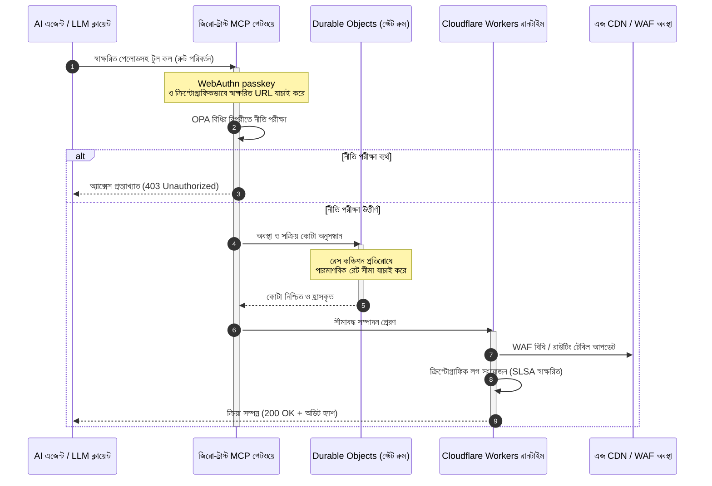

# CloudCDN: ২০২৬-এ AI-নেটিভ এজের জন্য একটি ওপেন সোর্স নকশা

<!-- lead-start: manual -->
<aside class="post-lead" aria-label="নিবন্ধের সারসংক্ষেপ">

<strong>সংক্ষেপে।</strong> ২০২৬-এর এন্টারপ্রাইজ প্রযুক্তিকে সংজ্ঞায়িত করছে বৈশ্বিকভাবে বিতরণকৃত সার্ভারলেস সম্পাদন ও এজেন্টিক AI-এর সম্মিলন। স্থির ফাইল ক্যাশিং ও মৌলিক ট্র্যাফিক রাউটিংয়ের জন্য তৈরি প্রচলিত CDN সক্রিয়, রিয়েল-টাইম ডেটা সমন্বয়ের যুগে কাঠামোগতভাবে সেকেলে। CloudCDN একটি ওপেন সোর্স নকশা, যা এজকে একটি সক্রিয় নিয়ন্ত্রণ তলে রূপান্তরিত করে: সার্ভারলেস রানটাইম, Cloudflare Durable Objects-এর মাধ্যমে অবস্থাপূর্ণ সমন্বয়, এবং একটি জিরো-ট্রাস্ট Model Context Protocol (MCP) গেটওয়ে — যা স্বায়ত্ত AI এজেন্টদের সীমাবদ্ধ, ক্রিপ্টোগ্রাফিকভাবে সুরক্ষিত পরিচালন সীমার মধ্যে ওয়েব পরিকাঠামো চালাতে দেয়।

<strong>মূল গ্রহণযোগ্য বিষয়</strong>

<ul class="post-lead-takeaways">
  <li><strong>স্থির ক্যাশ থেকে সীমাবদ্ধ নিয়ন্ত্রণ তলে।</strong> CloudCDN পরিচালন সীমানাকে এজে সরিয়ে নেয়, CDN নোডগুলিকে সক্রিয় নীতি গেটে রূপান্তরিত করে — যা মিলিসেকেন্ডের কম সময়ে নিরাপত্তা, রাউটিং ও অ্যাক্সেস-নিয়ন্ত্রণ সিদ্ধান্ত কার্যকর করে।</li>
  <li><strong>অবস্থাপূর্ণ এজ সমন্বয়।</strong> Cloudflare Durable Objects বিশ্বজুড়ে পারমাণবিক, রিয়েল-টাইম রেট লিমিটিং ও অবস্থা সমন্বয় প্রয়োগ করে — কোনো বিতরণকৃত রেস কন্ডিশন নেই, এজ অঞ্চল জুড়ে কোনো পদ্ধতিগত কোটা অপব্যবহার নেই।</li>
  <li><strong>MCP-এর মাধ্যমে নিরাপদ এজেন্টিক পরিকাঠামো ব্যবস্থাপনা।</strong> একটি জিরো-ট্রাস্ট গেটওয়ে ৪২টি বিশেষায়িত MCP টুল উন্মোচন করে, যাতে AI এজেন্টরা ক্রিপ্টোগ্রাফিকভাবে স্বাক্ষরিত সীমার অধীনে পরিকাঠামো পরিদর্শন, কনফিগার ও পরিচালনা করতে পারে।</li>
  <li><strong>পাইপলাইন ডেলিভারেবল হিসেবে সরবরাহ-শৃঙ্খল নিরাপত্তা।</strong> Sigstore/Cosign-এর মাধ্যমে SLSA Level 3 বিল্ড উৎসসন্ধান এবং প্রতিটি রিলিজে ১০০% কভারেজসহ ৩,১৮৫টি ইউনিট টেস্ট।</li>
  <li><strong>ড্যাশবোর্ড নয়, বোর্ড-স্তরের প্রমাণ।</strong> এজ টেলিমেট্রি সরাসরি DORA অনুচ্ছেদ ৫-এর বোর্ড দায়বদ্ধতা, BCBS 239 ঝুঁকি প্রতিবেদন ও Basel III পরিচালনগত-ঝুঁকি মূলধন বিধির সঙ্গে মানচিত্রিত হয়।</li>
</ul>

<strong>সম্পর্কিত পঠন:</strong> <a href="/2026-05-16-best-cloud-infrastructure-architecture-2026/">২০২৬-এ সেরা ক্লাউড পরিকাঠামো স্থাপত্য</a> · <a href="/2026-06-05-cloud-native-banking-index-dora-resilience-platform-engineering-2026/">২০২৬-এ ক্লাউড নেটিভ ব্যাংকিং সূচক</a> · <a href="/2026-06-03-agentic-ai-index-banks-autonomy-governance-auditability-2026/">২০২৬-এ ব্যাংকের জন্য এজেন্টিক AI সূচক</a>

</aside>
<!-- lead-end -->

CDN বিতর্ক শেষ। এজ আর ক্যাশ নয়; এটি AI-নেটিভ সফ্‌টওয়্যারের নিয়ন্ত্রণ তল। এজেন্টরা যখন টুল ডাকে, ডেটা স্থানান্তর করে, ক্যাশ পরিশোধন করে, স্বাক্ষরিত URL চায় ও ওয়ার্কফ্লো সমন্বয় করে, তখন অস্বচ্ছ ড্যাশবোর্ড ও মালিকানাধীন নিয়ন্ত্রণ তলের পুরোনো মডেল কেবল অসুবিধা থাকে না — নিয়ন্ত্রক দায়ে পরিণত হয়। CloudCDN একটি ভিন্ন মডেলের পক্ষে যুক্তি দেয়: একটি উন্মুক্ত, পরিদর্শনযোগ্য, এজেন্ট-নিয়ন্ত্রণযোগ্য এজ প্ল্যাটফর্ম, যা নিরাপত্তা, অভিগম্যতা, কর্মক্ষমতা ও নিরীক্ষণযোগ্যতাকে ভেন্ডরের প্রতিশ্রুতি নয়, প্রয়োগযোগ্য ডিফল্ট হিসেবে বিবেচনা করে।

এই নিবন্ধের ওপেন সোর্স রেফারেন্স পয়েন্ট হল [cloudcdn.pro ⧉](https://github.com/sebastienrousseau/cloudcdn.pro "cloudcdn.pro")। রিপোজিটরিটি একটি বহু-টেন্যান্ট, AI-নেটিভ CDN, যা প্রান্ত থেকে প্রান্ত পর্যন্ত পড়া যায় ও স্বাধীনভাবে স্থাপন করা যায়: Cloudflare PoPs জুড়ে ১০০ মিলিসেকেন্ডের কম TTFB, MCP নিয়ন্ত্রণ, Durable Objects রেট লিমিটিং, WCAG-AA অভিগম্যতা, স্বাক্ষরিত URL, passkeys, SLSA Level 3, এবং ৩,১৮৫টি টেস্টে ১০০% কভারেজ।

---

> **এক্সিকিউটিভ সারাংশ / মূল গ্রহণযোগ্য বিষয়**
>
> - **এজই পরিচালন সীমানায় পরিণত হয়।** CloudCDN প্রচলিত CDN নোডগুলিকে সক্রিয় নীতি গেটে রূপান্তরিত করে, যা মিলিসেকেন্ডের কম সময়ে নিরাপত্তা, রাউটিং ও অ্যাক্সেস নিয়ন্ত্রণ কার্যকর করে।
> - **Durable Objects রেট লিমিটিংকে পারমাণবিক করে।** রিয়েল-টাইম, বৈশ্বিকভাবে সামঞ্জস্যপূর্ণ কোটা প্রয়োগ সেই রেস-কন্ডিশন জানালা বন্ধ করে, যা ইভেনচুয়ালি কনসিস্টেন্ট লিমিটারগুলি আক্রমণকারী ও ত্রুটিপূর্ণ এজেন্টদের জন্য খোলা রাখে।
> - **এজেন্টরা ৪২টি সীমাবদ্ধ MCP টুলের মাধ্যমে পরিকাঠামো পরিচালনা করে।** কিছু কার্যকর হওয়ার আগে প্রতিটি আহ্বান WebAuthn passkeys, স্বাক্ষরিত পেলোড ও OPA নীতির বিপরীতে যাচাই করা হয়।
> - **সরবরাহ শৃঙ্খল পণ্যেরই অংশ।** Sigstore/Cosign-এর মাধ্যমে SLSA Level 3 উৎসসন্ধান প্রতিটি রিলিজকে তার নিরীক্ষিত উৎসের সঙ্গে ক্রিপ্টোগ্রাফিকভাবে যুক্ত করে।
> - **টেলিমেট্রিই কমপ্লায়েন্স প্রমাণ।** এজ অপারেশন DORA অনুচ্ছেদ ৫, BCBS 239 ও Basel III পরিচালনগত-ঝুঁকি মূলধনের সঙ্গে সরাসরি মানচিত্রিত হয় — ঘটনার পরের প্রতিবেদনের মাধ্যমে নয়।
>
---

## কেন এই ওপেন সোর্স প্রকল্পটি ২০২৬-এ গুরুত্বপূর্ণ

২০২৬-এ এন্টারপ্রাইজ IT স্থির পরিকাঠামো প্রভিশনিং থেকে রিয়েল-টাইম, ইভেন্ট-চালিত ডেটা সমন্বয়ে সরে এসেছে। দুটি বাজার-শক্তি এই পরিবর্তন চালাচ্ছে।

প্রথমটি এজেন্টিক AI-এর বিস্তার। স্বায়ত্ত মডেল ও সফ্‌টওয়্যার এজেন্টরা এখন জটিল পরিচালন কাজ সম্পাদন করে — স্বয়ংক্রিয় হুমকি প্রশমন, রাউটিং সিদ্ধান্ত, রিয়েল-টাইম লেজার ব্যালেন্সিং। তারা ড্যাশবোর্ড ব্যবহার করে না। তারা টুল ডাকে।

দ্বিতীয়টি [Digital Operational Resilience Act (DORA) ⧉](https://eur-lex.europa.eu/legal-content/EN/TXT/?uri=CELEX%3A32022R2554 "আর্থিক খাতের ডিজিটাল পরিচালনগত স্থিতিস্থাপকতা সংক্রান্ত প্রবিধান (EU) 2022/2554")-এর সক্রিয় প্রয়োগ। ব্যাংকিং প্রতিষ্ঠানগুলি আর অস্বচ্ছ, মালিকানাধীন তৃতীয় পক্ষের CDN-এর উপর নির্ভর করতে পারে না। নিয়ন্ত্রকরা সফ্‌টওয়্যার সরবরাহ শৃঙ্খলে সম্পূর্ণ দৃশ্যমানতা, যাচাইযোগ্য প্রস্থান সক্ষমতা ও অপরিবর্তনীয় ক্রিপ্টোগ্রাফিক অডিট ট্রেইল দাবি করছেন।

কেন্দ্রীভূত সার্ভার স্থাপত্য এমন লেটেন্সি জরিমানা চাপিয়ে দেয়, যা রিয়েল-টাইম সমন্বয় শোষণ করতে পারে না। মালিকানাধীন CDN ব্ল্যাক বক্স হিসেবে কাজ করে, যা প্রতিষ্ঠানগুলিকে এমন সরবরাহ-শৃঙ্খল আপসের মুখে ফেলে যা তারা দেখতেই পায় না — প্রমাণ করা তো দূরের কথা। CloudCDN সেই ফাঁক বন্ধ করে একটি স্বচ্ছ, জিরো-ট্রাস্ট, ওপেন সোর্স নকশা দিয়ে, যা এজকে একটি সক্রিয় নিয়ন্ত্রণ তলে রূপান্তরিত করে। প্রযুক্তি নির্বাহীদের জন্য এটি আলোচনাকে কমপ্লায়েন্সের খরচ থেকে স্থিতিস্থাপকতার রিটার্নে (Return on Resilience) সরিয়ে নেয়: স্বয়ংক্রিয়, অডিট-প্রস্তুত পরিচালন পাইপলাইনের মাধ্যমে সংরক্ষিত মূলধন।

## স্থাপত্য দৃষ্টিকোণ

CloudCDN স্থাপত্য পাঁচটি স্তরে গঠিত — কেন্দ্রীভূত মিডলওয়্যারের জায়গায় স্থানীয়, অবস্থাপূর্ণ এজ মৌলিক উপাদান বসিয়ে:

| স্তর | নকশা সিদ্ধান্ত | কেন এটি গুরুত্বপূর্ণ | অপব্যবস্থাপনায় ঝুঁকি |
|---|---|---|---|
| **এজ রানটাইম** | Cloudflare Workers ও Pages | কেন্দ্রীভূত VM লেটেন্সি দূর করে; বিশ্বজুড়ে মিলিসেকেন্ডের কম সময়ে নীতি কার্যকর করে | নীতি-শৃঙ্খলা ছাড়া কর্মক্ষমতা লাভ বিশৃঙ্খল এজ ড্রিফট তৈরি করে |
| **অবস্থা সমন্বয়** | Durable Objects | অঞ্চল জুড়ে রেট সীমা ও ভাগ করা অবস্থার জন্য পারমাণবিক, রিয়েল-টাইম সামঞ্জস্য নিশ্চিত করে | বিতরণকৃত রেস কন্ডিশন, API রিসোর্স অপব্যবহার, পাশ কাটানো পরিধি কোটা |
| **এজেন্ট ইন্টারফেস** | জিরো-ট্রাস্ট MCP গেটওয়ে | ৪২টি বিশেষায়িত MCP টুল উন্মোচন করে, যাতে AI এজেন্টরা পরিচালিত সীমার অধীনে পরিকাঠামো চালায় | অসীম টুল আহ্বান ও অননুমোদিত কনফিগারেশন পরিবর্তন |
| **অ্যাক্সেস নিয়ন্ত্রণ** | WebAuthn passkeys ও স্বাক্ষরিত URL | নিরীক্ষণযোগ্য অপারেশনের জন্য স্থির পাসওয়ার্ডের জায়গায় ক্রিপ্টোগ্রাফিক স্বাক্ষর বসায় | দুর্বলভাবে আরোপিত পরিবর্তন; পরিচয়পত্র চুরি থেকে পরিধি লঙ্ঘন |
| **গুণমান গেট** | SLSA Level 3 ও ১০০% টেস্ট কভারেজ | বিল্ড উৎস গাণিতিকভাবে যাচাই করে; ক্ষতিকর ডিপেনডেন্সি ইনজেকশন আটকায় | সফ্‌টওয়্যার সরবরাহ শৃঙ্খলের মাধ্যমে ঢোকানো ক্ষতিকর কোড |

## অনুসরণযোগ্য পরিচালন সংকেত

এজ প্রস্তুতি পরিমাপযোগ্য। এগুলিই সেই পরিমাণগত সূচক, যা অভিপ্রায় নয়, সম্পাদন সক্ষমতা প্রদর্শন করে:

| সংকেত | মেট্রিক / বেঞ্চমার্ক | নিয়ন্ত্রক রেফারেন্স | প্ল্যাটফর্ম বাস্তবায়ন |
|---|---|---|---|
| **৪২টি MCP টুল** | স্বয়ংক্রিয় ব্যবস্থাপনার জন্য সীমাবদ্ধ টুল-রেজিস্ট্রি সংখ্যা | COBIT 2019 (BAI06) | OPA নীতির বিপরীতে এজেন্ট স্বাক্ষর যাচাইকারী MCP গেটওয়ে |
| **Durable Objects** | শূন্য-লিক, মিলিসেকেন্ডের কম পারমাণবিক কোটা প্রয়োগ | DORA অনুচ্ছেদ ৬ | বৈশ্বিক API কোটা অবস্থা ট্র্যাককারী Durable Objects |
| **Passkeys ও স্বাক্ষরিত URL** | FIDO2 WebAuthn-এর মাধ্যমে ১০০% অ্যাডমিন সেশন যাচাই | DORA অনুচ্ছেদ ৩০ | এজ রাউটারে অন্তর্ভুক্ত ক্রিপ্টোগ্রাফিক স্বাক্ষর পরীক্ষা |
| **SLSA Level 3** | ক্রিপ্টোগ্রাফিকভাবে স্বাক্ষরিত বিল্ড ম্যানিফেস্ট (Sigstore) | DORA অনুচ্ছেদ ৩০ | স্বাক্ষরিত বিল্ড মেটাডেটা উৎপাদনকারী GitHub Actions পাইপলাইন |
| **৩,১৮৫টি ইউনিট টেস্ট** | ১০০% কভারেজ; প্রতিটি রিলিজে রিগ্রেশন গেট | NIST CSF 2.0 (PR.DS-01) | যেকোনো টেস্ট ব্যর্থতায় স্থাপন থামানো CI পাইপলাইন |

## CDN একটি সক্রিয় নিয়ন্ত্রণ তলে পরিণত হয়

প্রচলিত CDN-গুলি নিষ্ক্রিয়, স্থির কন্টেন্ট ত্বরণকে কেন্দ্র করে ডিজাইন করা হয়েছিল। CloudCDN মডেলটিকে নতুন করে সংজ্ঞায়িত করে। Cloudflare Workers ও Durable Objects সংহত হওয়ায় এজ একটি সক্রিয়, অবস্থাপূর্ণ নীতি গেট হিসেবে কাজ করে।

কোনো AI এজেন্ট বা স্বয়ংক্রিয় প্রক্রিয়া যখন পরিকাঠামো কনফিগারেশন পরিবর্তন বা রাউটিং সমন্বয়ের অনুরোধ করে, তখন এটি কোনো দুর্বল, কেন্দ্রীভূত ডেটাবেসের সঙ্গে কথা বলে না। অনুরোধটি নিকটতম এজ নোডে আটকানো হয় এবং কিছু কার্যকর হওয়ার আগে পরিচয়, নীতি ও কোটা পরীক্ষার মধ্য দিয়ে নেওয়া হয়:

ওই ক্রমের প্রতিটি ধাপ একটি আরোপযোগ্য, স্বাক্ষরিত রেকর্ড তৈরি করে। এটিই কন্টেন্ট ত্বরণকারী CDN আর পরিচালনযোগ্য নিয়ন্ত্রণ তলের মধ্যে পার্থক্য।

## কেন ওপেন সোর্স আস্থার মডেল পরিবর্তন করে

চিফ ইনফরমেশন সিকিউরিটি অফিসারদের কাছে অস্বচ্ছ মালিকানাধীন CDN একটি ক্রমবর্ধমান ঝুঁকি। ক্লোজড-সোর্স এজ নেটওয়ার্ক ব্ল্যাক বক্স: ভেন্ডর অভ্যন্তরীণ আপসের শিকার হলে, লঙ্ঘন প্রকাশ্যে ঘোষিত না হওয়া পর্যন্ত ব্যাংকের কোনো দৃশ্যমানতা থাকে না।

CloudCDN সেই অসামঞ্জস্যের জায়গায় তিনটি ব্যবস্থার উপর নির্মিত একটি সম্পূর্ণ নিরীক্ষণযোগ্য, ওপেন সোর্স আস্থা মডেল বসায়:

1. **গাণিতিক বিল্ড উৎসসন্ধান।** SLSA Level 3-এর অধীনে প্রতিটি রিলিজ তার ওপেন সোর্স GitHub রিপোজিটরির সঙ্গে ক্রিপ্টোগ্রাফিকভাবে যুক্ত। একজন CISO যাচাই করতে পারেন — চুক্তিগতভাবে নয়, গাণিতিকভাবে — যে Cloudflare-এর বৈশ্বিক এজ নোডে চলমান বাইনারিতে ঠিক নিরীক্ষিত সোর্স কোডটিই রয়েছে।
2. **নিরবচ্ছিন্ন, প্রকাশ্য নিরাপত্তা নিরীক্ষা।** কোডবেসটি স্বয়ংক্রিয় স্ক্যান, প্রকাশ্য দুর্বলতা প্রকাশ ও পিয়ার-রিভিউকৃত কোড নিরীক্ষার অধীন। অস্পষ্টতা কোনো নিয়ন্ত্রণ নয়; পর্যালোচনাই নিয়ন্ত্রণ।
3. **কোনো ভেন্ডর লক-ইন নেই (DORA অনুচ্ছেদ ২৮)।** DORA ব্যাংকগুলিকে সঙ্কটপূর্ণ তৃতীয় পক্ষের সরবরাহকারীদের থেকে একটি স্পষ্ট, পরীক্ষিত প্রস্থান কৌশল প্রমাণ করতে বাধ্য করে। CloudCDN ওপেন সোর্স এবং প্রমিত সার্ভারলেস মৌলিক উপাদানের উপর নির্মিত বলে, প্রতিষ্ঠানগুলি এজ কনফিগারেশন Cloudflare থেকে অন্য সার্ভারলেস রানটাইম বা প্রাইভেট Kubernetes ক্লাস্টারে স্থানান্তর করতে পারে — এবং সেই সক্ষমতা নিয়ন্ত্রকের কাছে প্রমাণ করতে পারে।

## ব্যাংক-গ্রেড এজ প্যাটার্ন

CloudCDN বৈশ্বিক আর্থিক খাতের কমপ্লায়েন্স মান পূরণের জন্য প্রকৌশলকৃত — প্রযুক্তিগত এজ অপারেশনকে সরাসরি সেই কাঠামোগুলির সঙ্গে মানচিত্রিত করে, যেগুলি সুপারভাইজাররা প্রকৃতপক্ষে পরীক্ষা করেন:

- **মডেল ঝুঁকি ব্যবস্থাপনা ([US Fed SR 11-7 ⧉](https://www.federalreserve.gov/supervisionreg/srletters/sr1107.htm "মডেল ঝুঁকি ব্যবস্থাপনা সংক্রান্ত সুপারভাইজরি নির্দেশিকা") / UK PRA SS1/23)।** পরিচালন কাজ সম্পাদনকারী স্বায়ত্ত মডেলগুলি মডেল-ঝুঁকি গভর্নেন্সের আওতায় পড়ে। CloudCDN-এর MCP গেটওয়ে এজেন্টিক টুলগুলিকে পরিমাণগত মডেলের মতো বিবেচনা করে: কঠোর নীতি সীমা, রিয়েল-টাইম লগিং ও উচ্চ-প্রভাব ক্রিয়ার জন্য বাধ্যতামূলক হিউম্যান-ইন-দ্য-লুপ ওভাররাইড।
- **BCBS 239 (ঝুঁকি ডেটা সমষ্টিকরণ)।** এজে লেনদেন ডেটা ধারণ, ট্যাগ ও কাঠামোবদ্ধকরণের মাধ্যমে পরিচালন মেট্রিক রিয়েল টাইমে উৎপন্ন হয় — ডেটা অখণ্ডতা, সময়োপযোগিতা ও নিয়ন্ত্রক সন্ধানযোগ্যতার জন্য BCBS 239 প্রয়োজনীয়তার সঙ্গে মিলিয়ে।
- **DORA অনুচ্ছেদ ৫ (বোর্ড দায়বদ্ধতা)।** পরিচালনগত স্থিতিস্থাপকতার চূড়ান্ত ব্যক্তিগত দায় বোর্ডের। CloudCDN এজ টেলিমেট্রিকে পরিমাণায়িত, যাচাইযোগ্য প্রমাণে রূপান্তরিত করে, যা অ-প্রযুক্তিগত পরিচালকরা ব্যক্তিগত-দায় নিরীক্ষায় সঙ্গে নিতে পারেন।
- **Basel III পরিচালনগত-ঝুঁকি মূলধন।** ব্যাংকগুলি পরিচালনগত ঝুঁকির বিপরীতে নিয়ন্ত্রক মূলধন ধরে রাখে। স্বয়ংক্রিয় DR ফেলওভার ও SLSA Level 3 উৎসসন্ধান প্রতিষ্ঠানের পরিচালনগত ঝুঁকি প্রোফাইল হ্রাস করে — কেবল নিরীক্ষা সন্তুষ্ট করা নয়, ব্যালেন্স শিটে মূলধন সংরক্ষণ।

## ব্যাংকের ধরন অনুসারে এর অর্থ

### বৈশ্বিক পদ্ধতিগতভাবে গুরুত্বপূর্ণ ব্যাংক (G-SIB)

G-SIB-গুলি একাধিক এখতিয়ার জুড়ে বিশাল লেনদেন ভলিউম চালায়। অগ্রাধিকার হল খণ্ডিত লিগ্যাসি পরিধি নিয়ন্ত্রণের জায়গায় একটি একক, একীভূত এজ তল বসানো। CloudCDN প্যাটার্ন স্থাপন করলে একটি G-SIB নিরাপত্তা নীতি, API গেটওয়ে ও এজেন্টিক গভর্নেন্স বিশ্বজুড়ে প্রমিত করতে পারে — এবং ত্রৈমাসিক ছোটাছুটির বদলে পরিচালনার উপজাত হিসেবে DORA-সঙ্গত প্রমাণ পাইপলাইন উৎপন্ন করতে পারে।

### লেনদেন ও করপোরেট ব্যাংক

লেনদেন ব্যাংকের কাছে ক্লায়েন্ট-মুখী পণ্য হল সম্পাদন গতি, নিরাপত্তা ও ডেটা স্বচ্ছতার সমষ্টি। CloudCDN প্যাটার্ন এই ব্যাংকগুলিকে করপোরেট ট্রেজারারদের জন্য সুরক্ষিত API ড্যাশবোর্ড ও রিয়েল-টাইম নগদ-ট্র্যাকিং পরিষেবা উন্মোচন করতে দেয় — একটি স্থিতিস্থাপক এজ অবস্থান, যা এন্টারপ্রাইজ আমানত রক্ষা করে।

### আঞ্চলিক ও ছোট ব্যাংক

আঞ্চলিক ব্যাংকগুলি G-SIB-এর সমান হুমকিদাতার মুখোমুখি হয়, কিন্তু প্রকৌশল বাজেট ছাড়াই। একটি ওপেন সোর্স, ব্যাংক-গ্রেড এজ নকশা নিয়ন্ত্রণগুলি তৈরি অবস্থাতেই দেয়: মালিকানাধীন লাইসেন্স খরচ ছাড়া তাৎক্ষণিক নিয়ন্ত্রক সারিবদ্ধতা, এবং তা প্রমাণের জন্য সোর্স কোড।

## বোর্ডরুম প্লেবুক

পরিচালনগত স্থিতিস্থাপকতা আর অদৃশ্য ব্যাক-অফিস IT মেট্রিক নয়; এটি ব্যক্তিগত দায়যুক্ত একটি বোর্ডরুম অগ্রাধিকার। ২০২৬-এ যে প্রতিষ্ঠানগুলি নিয়ন্ত্রক, ক্লায়েন্ট ও শেয়ারহোল্ডারদের আস্থা ধরে রাখবে, তারা প্রযুক্তিকে একটি যাচাইযোগ্য, পর্যবেক্ষণযোগ্য সম্পদ হিসেবে বিবেচনা করে।

সিনিয়র প্রযুক্তি নেতাদের জন্য রোডম্যাপ সংক্ষিপ্ত:

1. **প্রমাণকে পণ্য হিসেবে বাধ্যতামূলক করুন।** এজে স্বয়ংক্রিয়, স্ব-নথিভুক্তকারী পাইপলাইনের জন্য বাজেট দিন — নিরীক্ষকের জন্য সংকলিত নয়, পরিচালনার মাধ্যমে উৎপন্ন প্রমাণ।
2. **অবস্থাপূর্ণ এজ নিয়ন্ত্রণে যান।** রেট লিমিটিং, WAF ও পরিচয় যাচাইকে কেন্দ্রীভূত সার্ভার থেকে সরিয়ে পারমাণবিক এজ মৌলিক উপাদানে নিন।
3. **ক্রিপ্টোগ্রাফিক এজেন্টিক সীমা প্রতিষ্ঠা করুন।** প্রতিটি স্বয়ংক্রিয় টুল আহ্বানের জন্য passkey ও OPA যাচাইসহ জিরো-ট্রাস্ট MCP গেটওয়ে প্রয়োগ করুন।
4. **ওপেন সোর্স বিল্ড নিরীক্ষা আবশ্যক করুন।** SLSA Level 3 বিল্ড উৎসসন্ধানকে আকাঙ্ক্ষা নয়, স্থাপনের শর্ত করুন।

## প্রায়শই জিজ্ঞাসিত প্রশ্ন

**CloudCDN কি DORA নিরীক্ষার জন্য প্রস্তুত?**

হ্যাঁ। CloudCDN এমন স্বয়ংক্রিয় কমপ্লায়েন্স প্রমাণ উৎপন্ন করতে প্রকৌশলকৃত, যা সরাসরি Register of Information-এর ITS টেমপ্লেট (RT.01 থেকে RT.15) ও DORA অনুচ্ছেদ ৩০-এর চুক্তিগত ধারার সঙ্গে মানচিত্রিত হয়।

**রেট লিমিটিংয়ের জন্য Durable Objects ব্যবহারের সুবিধা কী?**

প্রচলিত বিতরণকৃত রেট লিমিটারগুলি ইভেনচুয়াল কনসিস্টেন্সির উপর নির্ভর করে, যা একটি লেটেন্সি জানালা রেখে দেয় — আক্রমণকারী বা ত্রুটিপূর্ণ এজেন্টরা যার সুযোগ নিতে পারে। Durable Objects বিশ্বজুড়ে তাৎক্ষণিক, পারমাণবিক সামঞ্জস্য নিশ্চিত করে, রেস-কন্ডিশন জানালাটি সম্পূর্ণ বন্ধ করে দেয়।

**CloudCDN-কে কী AI-নেটিভ করে তোলে?**

এর MCP-নিয়ন্ত্রিত অপারেশন ও এজেন্ট-সচেতন নিয়ন্ত্রণ মডেল। পরিকাঠামো ক্রিপ্টোগ্রাফিক পরিচয় ও নীতি সীমাসহ ৪২টি পরিচালিত টুলের মাধ্যমে চালিত হয় — কেবল মানব ড্যাশবোর্ডের জন্য নয়, স্বায়ত্ত ওয়ার্কফ্লোর জন্য ডিজাইন করা।

**ওপেন সোর্স কোড কি জিরো-ডে এক্সপ্লয়েটের ঝুঁকি বাড়ায়?**

না। মালিকানাধীন, ক্লোজড-সোর্স CDN অস্পষ্টতার মাধ্যমে নিরাপত্তার উপর নির্ভর করে। CloudCDN-এর কোডবেস নিরবচ্ছিন্নভাবে স্বয়ংক্রিয় টেস্টিং, প্রকাশ্য পিয়ার রিভিউ ও SLSA Level 3 যাচাইয়ের অধীন — একটি যাচাইযোগ্যভাবে উচ্চতর আস্থার সীমা।

## তথ্যসূত্র

- European Parliament and Council of the European Union, (2022). [আর্থিক খাতের ডিজিটাল পরিচালনগত স্থিতিস্থাপকতা সংক্রান্ত প্রবিধান (EU) 2022/2554 (DORA) ⧉](https://eur-lex.europa.eu/legal-content/EN/TXT/?uri=CELEX%3A32022R2554 "আর্থিক খাতের ডিজিটাল পরিচালনগত স্থিতিস্থাপকতা সংক্রান্ত প্রবিধান (EU) 2022/2554 (DORA)")। Brussels: Official Journal of the European Union.
- Basel Committee on Banking Supervision (BCBS), (2013). [কার্যকর ঝুঁকি ডেটা সমষ্টিকরণ ও ঝুঁকি প্রতিবেদনের নীতিমালা (BCBS 239) ⧉](https://www.bis.org/publ/bcbs239.htm "কার্যকর ঝুঁকি ডেটা সমষ্টিকরণ ও ঝুঁকি প্রতিবেদনের নীতিমালা (BCBS 239)")। Basel: Bank for International Settlements.
- Board of Governors of the Federal Reserve System, (2011). [মডেল ঝুঁকি ব্যবস্থাপনা সংক্রান্ত সুপারভাইজরি নির্দেশিকা (SR Letter 11-7) ⧉](https://www.federalreserve.gov/supervisionreg/srletters/sr1107.htm "মডেল ঝুঁকি ব্যবস্থাপনা সংক্রান্ত সুপারভাইজরি নির্দেশিকা (SR Letter 11-7)")। Washington D.C.: Federal Reserve.
- Cloudflare, (2026). [Durable Objects নথিপত্র: অবস্থাপূর্ণ এজ সমন্বয় ⧉](https://developers.cloudflare.com/durable-objects/ "Durable Objects নথিপত্র")। San Francisco: Cloudflare.
- Cloudflare, (2026). [MCP, প্রমাণীকরণ ও Durable Objects দিয়ে AI এজেন্ট তৈরি ⧉](https://blog.cloudflare.com/building-ai-agents-with-mcp-authn-authz-and-durable-objects/ "MCP, প্রমাণীকরণ ও Durable Objects দিয়ে AI এজেন্ট তৈরি")।
- GitHub, (2026). [cloudcdn.pro রিপোজিটরি ⧉](https://github.com/sebastienrousseau/cloudcdn.pro "cloudcdn.pro রিপোজিটরি")।

<!-- enrich-start -->
<aside class="author-card" aria-label="লেখক সম্পর্কে"><strong class="author-card-name"><a href="/about/index.html">সেবাস্তিয়ান রুসো</a></strong>সিনিয়র ব্যাংকিং প্রযুক্তিবিদ, প্রয়োগ-ভিত্তিক এআই, পেমেন্ট পরিকাঠামো, টোকেনাইজড অর্থ, ISO 20022, পোস্ট-কোয়ান্টাম নিরাপত্তা, ক্লাউড-নেটিভ আর্থিক পরিষেবা, ওপেন সোর্স পরিকাঠামো ও নিয়ন্ত্রিত ডিজিটাল বাজার সম্পর্কে লেখেন।HSBC Commercial &amp; Investment Bank, PayPal, Barclays, Shazam, AKQA, Virgin Group-এ ২০+ বছরের অভিজ্ঞতা। <a href="/about/index.html">সম্পূর্ণ প্রোফাইল</a> &middot; <a href="https://www.linkedin.com/in/sebastienrousseau/" rel="external noopener">LinkedIn</a> &middot; <a href="https://github.com/sebastienrousseau" rel="external noopener">GitHub</a></aside>

সর্বশেষ পর্যালোচনা <time datetime="2026-06-11">2026-06-11</time>।

<!-- enrich-end -->
