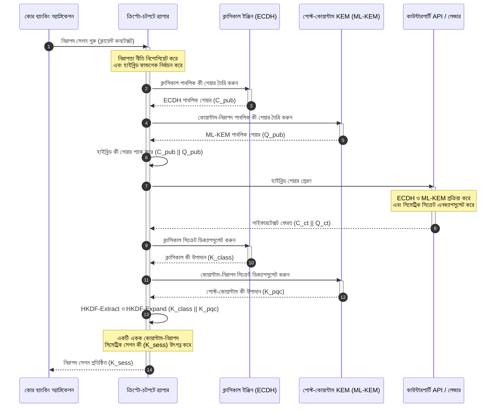

# KyberLib ও ব্যাংকিং পোস্ট-কোয়ান্টাম মাইগ্রেশন 2026: মানদণ্ড থেকে কোডে

<!-- lead-start: manual -->
<aside class="post-lead" aria-label="নিবন্ধের সারসংক্ষেপ">

<strong>সংক্ষেপে।</strong> 2026-এ ব্যাংকিং পরিকাঠামো এমন এক সিস্টেমিক হুমকির মুখে, যার শেষবিন্দু জানা: কোয়ান্টাম-মাত্রার গণনা আজকের ট্রানজিট ট্র্যাফিক রক্ষাকারী RSA ও ECC কী বিনিময় ভেঙে দেবে। ফেডারেল মানদণ্ড ও তদারকি নীতি-নথি সচেতনতা বাড়িয়েছে; প্রযুক্তিগত বাস্তবায়ন এখনও সাইলোতে বন্দি। <a href="https://github.com/sebastienrousseau/kyberlib">KyberLib</a> একটি ওপেন সোর্স প্রকৌশল নকশা, যা পোস্ট-কোয়ান্টাম আখ্যানকে কংক্রিট, মেমরি-নিরাপদ Rust কোডে নিয়ে যায় — ক্রিপ্টো-চটপটে বিমূর্তকরণ সীমানার পেছনে NIST-মানসম্মত ML-KEM (FIPS 203) বাস্তবায়ন করে, যাতে প্রতিষ্ঠানগুলি "Store Now, Decrypt Later" আক্রমণ আর্কাইভে পৌঁছানোর আগেই পরিবহন নিরাপত্তা ও কী এনক্যাপসুলেশন উন্নীত করতে পারে।

<strong>মূল গ্রহণযোগ্য বিষয়</strong>

<ul class="post-lead-takeaways">
  <li><strong>নীতি থেকে পরিদর্শনযোগ্য কোডে।</strong> KyberLib পোস্ট-কোয়ান্টাম ক্রিপ্টোগ্রাফিকে বিমূর্ত কৌশলগত রোডম্যাপ থেকে কংক্রিট, উচ্চ-কার্যক্ষমতার, অডিটযোগ্য Rust বাস্তবায়নে নিয়ে যায়।</li>
  <li><strong>মানসম্মত FIPS 203 ML-KEM বাস্তবায়ন।</strong> লাইব্রেরিটি ML-KEM বাস্তবায়ন করে — NIST FIPS 203-এর অধীনে চূড়ান্ত হওয়া কী-স্থাপন অ্যালগরিদম — ফলে সংগতি বৈশ্বিক নিয়ন্ত্রক প্রত্যাশার সঙ্গে সারিবদ্ধ থাকে।</li>
  <li><strong>নকশাতেই ক্রিপ্টো-চটপটে।</strong> স্থিতিশীল বিমূর্তকরণ সীমানা ব্যাংকিং অ্যাপ্লিকেশনকে ব্যয়বহুল, ত্রুটিপ্রবণ পুনর্লিখন ছাড়াই ক্রিপ্টোগ্রাফিক প্রিমিটিভ বদলাতে দেয়।</li>
  <li><strong>Rust-চালিত মেমরি নিরাপত্তা।</strong> কম্পাইল-টাইম ওনারশিপ নিয়ম লিগ্যাসি C-ভিত্তিক ক্রিপ্টোগ্রাফিক লাইব্রেরির বাফার ওভারফ্লো ও মেমরি লিক নির্মূল করে — জিরো-কস্ট-অ্যাবস্ট্রাকশন গতিতে।</li>
  <li><strong>ফিডিউশিয়ারি দায় প্রশমন।</strong> পর্যবেক্ষণযোগ্য, পরীক্ষাযোগ্য মাইগ্রেশন প্রমাণ পরিচালকদের সেই "যুক্তিসঙ্গত পদক্ষেপ"-এর রেকর্ড দেয়, যা DORA অনুচ্ছেদ 5-এর ব্যক্তিগত-জবাবদিহি অডিট দাবি করে।</li>
</ul>

<strong>সংশ্লিষ্ট পঠন:</strong> <a href="/2026-05-18-quantum-cryptography-standards-developments-2026/">2026-এর কোয়ান্টাম ক্রিপ্টোগ্রাফি রিসেট: PQC মানদণ্ড, QKD আশ্বাস ও যে মাইগ্রেশন ব্যাংক স্থগিত রাখতে পারে না</a> · <a href="/2026-05-28-dora-ai-act-data-sovereignty-banking-compliance-stack-2026/">DORA, EU AI আইন ও ডেটা সার্বভৌমত্ব: ব্যাংকের 2026 কমপ্লায়েন্স স্ট্যাক</a> · <a href="/2026-05-20-cloud-native-banking-financial-institutions-2026/">2026-এ ক্লাউড-নেটিভ ব্যাংকিং</a>

</aside>
<!-- lead-end -->

পোস্ট-কোয়ান্টাম মাইগ্রেশন আর পরিকল্পনার মহড়া নয়। 2026-এ এটি একটি সক্রিয় পরিচালন বাধ্যবাধকতা, এবং নিয়ন্ত্রক অভিপ্রায় ও প্রকৌশল বাস্তবায়নের মধ্যকার ফাঁকটিই এখন ঝুঁকির প্রকৃত অবস্থান। [KyberLib ⧉](https://github.com/sebastienrousseau/kyberlib "kyberlib") সেই ফাঁকের একটি অংশ বন্ধ করে: একটি উৎপাদনমুখী, মেমরি-নিরাপদ Rust লাইব্রেরি, যা চূড়ান্ত FIPS 203 প্যারামিটার অনুযায়ী ML-KEM বাস্তবায়ন করে এবং তাকে সেই ক্রিপ্টো-চটপটে সীমানায় মোড়ে, যা একটি ব্যাংকের লেনদেন এস্টেটের প্রকৃতপক্ষে প্রয়োজন।

---

> **এক্সিকিউটিভ সারাংশ / মূল গ্রহণযোগ্য বিষয়**
>
> - **হুমকি ইতিমধ্যে কার্যকর।** প্রতিপক্ষরা আজই "Store Now, Decrypt Later" সংগ্রহ চালাচ্ছে; ক্রিপ্টোগ্রাফিকভাবে প্রাসঙ্গিক কোয়ান্টাম কম্পিউটার আসার দিনই ডেটা গোপনীয়তা পশ্চাৎমুখীভাবে ব্যর্থ হয়।
> - **মানদণ্ড চূড়ান্ত।** NIST FIPS 203 (ML-KEM) ও FIPS 204 (ML-DSA) অডিট কমিটিকে একটি স্পষ্ট, পরীক্ষাযোগ্য মাপকাঠি দেয় — "মানদণ্ডের অপেক্ষায় আছি" আর কোনও রক্ষাকবচ নয়।
> - **KyberLib হল প্রকৌশল নকশা।** মেমরি-নিরাপদ Rust, HSM ও স্মার্ট কার্ডের জন্য `no_std` কম্পাইলেশন, এবং হাইব্রিড হ্যান্ডশেক প্যাটার্ন — যা ক্লাসিকাল আন্তঃকার্যকারিতা বজায় রাখে।
> - **ক্রিপ্টো-চটপটেই টেকসই উদ্দেশ্য।** স্থিতিশীল বিমূর্তকরণ সীমানা অ্যাপ্লিকেশন পুনর্লিখন ছাড়া প্রিমিটিভ বদলাতে দেয় — এই শিক্ষা যেকোনো একক অ্যালগরিদমের চেয়ে দীর্ঘজীবী।
> - **দায় বহন করে বোর্ড।** DORA অনুচ্ছেদ 5 পরিচালকদের উপর ব্যক্তিগত দায়িত্ব আরোপ করে; পরিদর্শনযোগ্য, পর্যবেক্ষণযোগ্য মাইগ্রেশন কোডই সেই দায় মেটানোর প্রমাণ।
>
---

## কেন এই ওপেন সোর্স প্রকল্প 2026-এ গুরুত্বপূর্ণ

অ্যাসিমেট্রিক ক্রিপ্টোগ্রাফি অপ্রচলনের দিকে এগোলেও হুমকিটি ক্রিপ্টোগ্রাফিকভাবে প্রাসঙ্গিক কোয়ান্টাম কম্পিউটার তৈরি হওয়ার অপেক্ষায় বসে নেই। প্রতিপক্ষরা এখনই **"Store Now, Decrypt Later" (SNDL)** আক্রমণ চালাচ্ছে — করপোরেট ব্যাংক লেনদেন, বাণিজ্য গোপনীয়তা ও প্রাতিষ্ঠানিক যোগাযোগের এনক্রিপ্টেড ট্রানজিট স্ট্রিম সংগ্রহ করছে, কোয়ান্টাম সক্ষমতা পরিণত হলে ডিক্রিপ্ট করার অভিপ্রায়ে। একটি ব্যাংকের জন্য আজ তারে চলা প্রতিটি ক্লাসিকাল হ্যান্ডশেক হল বিলম্বিত বিস্ফোরণ-তারিখসহ একটি গোপনীয়তা লঙ্ঘন।

নিয়ন্ত্রকরা কংক্রিট বাধ্যবাধকতা দিয়ে সাড়া দিয়েছেন:

1. **DORA অনুচ্ছেদ 6 (ICT ঝুঁকি ব্যবস্থাপনা)** প্রতিষ্ঠানগুলিকে তাদের ক্রিপ্টোগ্রাফিক এস্টেট জুড়ে দুর্বলতা মানচিত্রায়ন, শনাক্তকরণ ও প্রশমনের নির্দেশ দেয় — যার মধ্যে পড়ে মিডলওয়্যারের গভীরে চাপা পড়া, কেউ ইনভেন্টরি করেনি এমন অ্যাসিমেট্রিক কী বিনিময়ও।
2. **NIST FIPS 203 ও 204** কী এনক্যাপসুলেশন (ML-KEM) ও ডিজিটাল স্বাক্ষরের (ML-DSA) জন্য সরকারি পোস্ট-কোয়ান্টাম মানদণ্ড প্রতিষ্ঠা করে, যা অডিট কমিটিকে মাইগ্রেশন অগ্রগতি মাপার একটি মানসম্মত মাপকাঠি দেয়।

লাইভ অপারেশন ব্যাহত না করে এই মাইগ্রেশন সম্পন্ন করতে হলে নীতি-নথি পেরিয়ে **পরিদর্শনযোগ্য, ওপেন সোর্স ক্রিপ্টোগ্রাফিক পরিকাঠামোয়** যেতে হয়। [KyberLib ⧉](https://github.com/sebastienrousseau/kyberlib "kyberlib") ঠিক সেটিই সরবরাহ করে: FIPS 203-সংগত একটি মেমরি-নিরাপদ Rust লাইব্রেরি, যা পোস্ট-কোয়ান্টাম উত্তরণকে একটি পরিমাপযোগ্য, যাচাইযোগ্য প্রকৌশল পাইপলাইনে পরিণত করে — এবং প্রযুক্তি বিনিয়োগের আলোচনাকে স্পর্শযোগ্য স্থিতিস্থাপকতার প্রতিদানের (Return on Resilience) দিকে সরিয়ে দেয়।

## স্থাপত্য দৃষ্টিভঙ্গি

KyberLib স্থিতিশীল API সীমানার পেছনে অবস্থান করে, একটি ব্যাংকের মূল লেনদেন অ্যাপ্লিকেশনকে নিম্ন-স্তরের ক্রিপ্টোগ্রাফিক প্রিমিটিভের পরিবর্তন থেকে নিরোধ দেয়।

| স্তর | নকশা সিদ্ধান্ত | কেন গুরুত্বপূর্ণ | অপব্যবস্থাপনায় ঝুঁকি |
|---|---|---|---|
| **প্রিমিটিভ** | FIPS 203 ML-KEM কী এনক্যাপসুলেশন | ক্লাসিকাল Diffie-Hellman ও RSA কী বিনিময়কে ল্যাটিস-ভিত্তিক কাঠামো দিয়ে প্রতিস্থাপন করে | চূড়ান্ত FIPS 203 প্যারামিটারের সঙ্গে অসংগতি, যার পরিণতি ব্যর্থ কমপ্লায়েন্স অডিট |
| **ভাষা** | মেমরি-নিরাপদ Rust বাস্তবায়ন | C/C++-এ চিরসঙ্গী মেমরি-দূষণ দুর্বলতা (বাফার ওভারফ্লো, ইউজ-আফটার-ফ্রি) নির্মূল করে | নির্ভরতার বিস্তার বিল্ড-চেইন অখণ্ডতা ক্ষুণ্ন করা |
| **বিমূর্তকরণ** | স্থিতিশীল ক্রিপ্টো-চটপটে সীমানা | মানদণ্ড বিকশিত হলে অ্যাপ্লিকেশন একীভূত ইন্টারফেসের পেছনে অ্যালগরিদম বদলায় | হার্ড-কোডেড প্রিমিটিভ প্রতিটি ভবিষ্যৎ মাইগ্রেশনে ম্যানুয়াল পুনর্লিখন বাধ্য করা |
| **স্থাপন** | হাইব্রিড এনক্রিপশন হ্যান্ডশেক | পোস্ট-কোয়ান্টাম KEM-কে ক্লাসিকাল অ্যালগরিদমের সঙ্গে দ্বৈত-মোড়ানো খামে যুক্ত করে | লিগ্যাসি আন্তঃকার্যকারিতা হারানো বা নীরব কনফিগারেশন বিচ্যুতি |
| **আশ্বাস** | SLSA Level 3 প্রভেন্যান্স ও পরিদর্শনযোগ্য পরীক্ষা | কোডের উৎস ও প্রভেন্যান্স নিশ্চিত করে; উদাহরণ লাইন ধরে অডিট করা যায় | নিরাপত্তা থিয়েটার — ব্ল্যাক-বক্স লাইব্রেরি, যার বাস্তবায়ন ত্রুটি প্রোডাকশনে প্রকাশ পায় |

## নজরে রাখার পরিচালন সংকেত

তদারকি বোর্ড ও নিয়ন্ত্রকদের কাছে পোস্ট-কোয়ান্টাম কমপ্লায়েন্স প্রদর্শনের অর্থ সুনির্দিষ্ট, পরিমাণযোগ্য মেট্রিক অনুসরণ করা:

| সংকেত | মেট্রিক | নিয়ন্ত্রক রেফারেন্স | প্ল্যাটফর্ম বাস্তবায়ন |
|---|---|---|---|
| **FIPS 203 ML-KEM সংগতি** | চূড়ান্ত প্যারামিটারের (ML-KEM-512/768/1024) সঙ্গে 100% সংগতি | NIST FIPS 203 | KyberLib মডিউলের ভেতরে কম্পাইল করা প্যারামিটার-যাচাইকৃত ল্যাটিস ক্রিপ্টোগ্রাফি |
| **ক্রিপ্টোগ্রাফিক ইনভেন্টরি** | সব সিস্টেম জুড়ে অ্যাসিমেট্রিক কী-বিনিময় ব্যবহারের সম্পূর্ণ ইনভেন্টরি | NIST SP 1800-38 | সক্রিয় সাইফার স্যুট কেন্দ্রীয় রেজিস্ট্রিতে লগ করা স্বয়ংক্রিয় স্ক্যানিং এজেন্ট |
| **হাইব্রিড কী বিনিময়** | হাইব্রিড খামে সম্পন্ন পরিবহন-স্তরের হ্যান্ডশেকের শতাংশ | DORA অনুচ্ছেদ 6 | ক্লাসিকাল TLS 1.3 হ্যান্ডশেককে PQC এনক্যাপসুলেশনে মোড়ানো নেটওয়ার্ক প্রক্সি |
| **`no_std` কম্পাইলেশন** | সীমাবদ্ধ লক্ষ্যের জন্য Rust-এর স্ট্যান্ডার্ড লাইব্রেরি ছাড়া কম্পাইলের সক্ষমতা | DORA অনুচ্ছেদ 30 | Hardware Security Module-এর জন্য KyberLib-এ শর্তাধীন `no_std` কম্পাইলেশন |
| **ক্রিপ্টো-চটপটে সূচক** | API গেটওয়ে জুড়ে একটি ক্রিপ্টোগ্রাফিক প্রিমিটিভ বদলাতে মিনিটে সময় | UK PRA SS1/23 | রানটাইম ভেরিয়েবলের মাধ্যমে অ্যালগরিদম বরাদ্দ পরিচালনাকারী বিমূর্ত রাউটিং রেজিস্ট্রি |

## পোস্ট-কোয়ান্টাম ক্রিপ্টোগ্রাফিতে Rust কেন গুরুত্বপূর্ণ

ML-KEM-এর মতো পোস্ট-কোয়ান্টাম অ্যালগরিদম বাস্তবায়নে পলিনোমিয়াল রিং-এর উপর জটিল, নিম্ন-স্তরের গাণিতিক ক্রিয়া দরকার। ঐতিহাসিকভাবে সেই ক্রিয়া প্রোডাকশন গতিতে চালানো মানে ছিল হাতে লেখা C/C++ বা অ্যাসেম্বলি — মেমরি দূষণের বিশাল আক্রমণ-পৃষ্ঠ, আর তা ঠিক সেই কোডে, যেখানে ভুল করার সামর্থ্য ব্যাংকের সবচেয়ে কম।

Rust ক্রিপ্টোগ্রাফিক প্রকৌশলের নিরাপত্তা ভঙ্গি তিনটি কংক্রিট উপায়ে বদলে দেয়:

1. **কম্পাইল-টাইম মেমরি নিরাপত্তা।** Rust-এর ওনারশিপ মডেল নিশ্চিত করে যে বাফার ওভারফ্লো, ডাবল ফ্রি ও ইউজ-আফটার-ফ্রি ত্রুটি কম্পাইল করার সময়েই প্রতিরোধ হয়। পোস্ট-কোয়ান্টাম লাইব্রেরির জন্য এটি বিশেষভাবে গুরুত্বপূর্ণ, কারণ কী-এর আকার ও সাইফারটেক্সট ক্লাসিকাল প্রতিরূপের চেয়ে উল্লেখযোগ্যভাবে বড়।
2. **নির্ধারক, জিরো-কস্ট বিমূর্তকরণ।** Rust গারবেজ কালেক্টর ছাড়াই নেটিভ মেশিন কোডে কম্পাইল হয়, ফলে নিরাপত্তা বজায় রেখেই সম্পাদন গতি ও মেমরি পদচিহ্ন C-ভিত্তিক লাইব্রেরির সমান বা তার চেয়ে ভাল।
3. **`no_std` সামঞ্জস্য।** KyberLib Rust-এর স্ট্যান্ডার্ড লাইব্রেরি ছাড়া কম্পাইল হয়, তাই এটি সীমাবদ্ধ, বেয়ার-মেটাল পরিবেশে চলে — Hardware Security Module ও স্মার্ট কার্ডসহ — ব্যাংক-মানের ক্রিপ্টোগ্রাফিকে ভৌত নিরাপত্তা সীমানার ভেতরে রাখে।

## ক্রিপ্টো-চটপটে স্থাপত্যের নকশা

ক্রিপ্টোগ্রাফিক মাইগ্রেশনের চিরায়ত ব্যর্থতা-ধরন হল হার্ড-কোডিং: অ্যাপ্লিকেশন লজিকে সরাসরি গেঁথে দেওয়া অ্যালগরিদম-নির্দিষ্ট ধারণা, যা প্রতিটি উত্তরণে যন্ত্রণাদায়কভাবে পুনরাবিষ্কৃত হয়। 2026-এর টেকসই উদ্দেশ্য হল **ক্রিপ্টো-চটপটে** — একটি বিমূর্তকরণ স্তর, যা অ্যালগরিদমকে স্থিতিশীল ইন্টারফেসের পেছনে অদলবদলযোগ্য মডিউল হিসেবে বিবেচনা করে, যাতে পরের মাইগ্রেশন এস্টেট-ব্যাপী পুনর্লিখন না হয়ে একটি কনফিগারেশন পরিবর্তনে দাঁড়ায়।

নিচের সিকোয়েন্সটি দেখায় KyberLib-এর ক্রিপ্টো-চটপটে র‍্যাপার কীভাবে একটি হাইব্রিড (ক্লাসিকাল প্লাস পোস্ট-কোয়ান্টাম) কী-বিনিময় হ্যান্ডশেক সমন্বয় করে:

হাইব্রিড খামই পরিচালনগতভাবে গুরুত্বপূর্ণ বিবরণ। পোস্ট-কোয়ান্টাম প্রিমিটিভ বছরের পর বছর প্রোডাকশন যাচাই সঞ্চয় না করা পর্যন্ত সেশন কী উৎপন্ন হয় ক্লাসিকাল ও পোস্ট-কোয়ান্টাম — উভয় সিক্রেট থেকে: চ্যানেল পুনরুদ্ধার করতে আক্রমণকারীকে ECDH **এবং** ML-KEM দুটিই ভাঙতে হবে। যেসব কাউন্টারপার্টি মাইগ্রেট করেনি, তারা কাজ চালিয়ে যায়; যারা করেছে, তারা তৎক্ষণাৎ ল্যাটিস-ভিত্তিক সুরক্ষা পায়।

## বোর্ডরুম প্লেবুক

পোস্ট-কোয়ান্টাম নিরাপত্তা কোনও ব্যাক-অফিস এনক্রিপশন বিষয় নয়; এটি ব্যক্তিগত ঝুঁকিসহ একটি বোর্ডরুম গভর্নেন্স ইস্যু। সিনিয়র ম্যানেজারদের উচিত মাইগ্রেশনকে ফিডিউশিয়ারি দায়িত্বের কাঠামোয় দেখা:

- **DORA অনুচ্ছেদ 5 (গভর্নেন্স ও সংগঠন)** ICT নিরাপত্তার ব্যক্তিগত দায়িত্ব পরিচালনা পর্ষদের উপর আরোপ করে। ওপেন সোর্স, পর্যবেক্ষণযোগ্য পরীক্ষাই ব্যক্তিগত-দায় অডিটের চাওয়া সরাসরি প্রমাণ — "আমরা একটি পরিদর্শনযোগ্য FIPS 203 বাস্তবায়ন নির্বাচন করেছি এবং এই তার সংগতি পরীক্ষার ফলাফল" একটি রক্ষণযোগ্য উত্তর; "আমাদের বিক্রেতা আশ্বাস দিয়েছে" নয়।
- **মডেল ঝুঁকি ব্যবস্থাপনা (US Fed SR 11-7 / UK PRA SS1/23)** প্রাইসিং মডেলের মতোই ক্রিপ্টোগ্রাফিক র‍্যাপার স্থাপত্যেও প্রযোজ্য। বিমূর্তকরণ স্তরগুলিকে MRM যাচাই পেরোতে হবে, চরম বিঘ্ন পরিস্থিতিতে কার্যক্ষমতাসহ।
- **Basel III পরিচালন-ঝুঁকি মূলধন** প্রমাণিত নিয়ন্ত্রণ পরিপক্বতাকে পুরস্কৃত করে। পরীক্ষিত হাইব্রিড হ্যান্ডশেক প্রতিষ্ঠানের দীর্ঘমেয়াদি পরিচালন ঝুঁকি প্রোফাইল নামিয়ে আনে, মূলধন প্রিমিয়াম ছেঁটে সক্রিয় ট্রেজারি স্থাপনার জন্য ব্যালান্স-শিট সক্ষমতা মুক্ত করে।

## ব্যাংকের ধরনভেদে এর অর্থ

### বৈশ্বিক সিস্টেমিকভাবে গুরুত্বপূর্ণ ব্যাংক (G-SIB)

G-SIB-গুলি লিগ্যাসি-ভারী লেনদেন এস্টেট চালায়, তাই তাদের বাঁধাই-সীমাবদ্ধতা হল আবিষ্কার: অ্যাসিমেট্রিক কী বিনিময় প্রকৃতপক্ষে কোথায় ঘটে তা জানা। NIST SP 1800-38 নির্দেশিকার অধীনে ধারাবাহিক ক্রিপ্টোগ্রাফিক ইনভেন্টরি আগে আসে; এরপর ইনভেন্টরিতে উঠে আসা প্রতিটি আধুনিক নোডে পোস্ট-কোয়ান্টাম কী এনক্যাপসুলেশন সম্পাদনের মানসম্মত, মেমরি-নিরাপদ লাইব্রেরি দেয় KyberLib।

### ট্রানজ্যাকশন ও করপোরেট ব্যাংক

পেমেন্ট রেল জুড়ে গোপনীয়তাই ফ্র্যাঞ্চাইজ। KyberLib বেয়ার-মেটাল `no_std` লক্ষ্যে কম্পাইল হয় বলে ট্রানজ্যাকশন ব্যাংকগুলি পোস্ট-কোয়ান্টাম হ্যান্ডশেক সরাসরি এজ পেমেন্ট-রাউটিং ও লিকুইডিটি-ব্যবস্থাপনা হার্ডওয়্যারের ভেতরে স্থাপন করতে পারে — কেবল অ্যাপ্লিকেশন স্তরে নয়।

### আঞ্চলিক ও ছোট ব্যাংক

আঞ্চলিক প্রতিষ্ঠানগুলি G-SIB-এর গবেষণা বাজেট ছাড়াই একই রাষ্ট্র-পৃষ্ঠপোষিত সংগ্রহের মুখোমুখি। একটি পরিদর্শনযোগ্য, ওপেন সোর্স Rust বাস্তবায়ন তাদের ব্ল্যাক-বক্স বিক্রেতা রোডম্যাপ নিয়ে দরকষাকষি ছাড়াই তৎক্ষণাৎ NIST FIPS 203 সংগতির একটি প্রস্তুত পথ দেয়।

## রোডম্যাপ থেকে কম্পাইল-হওয়া কোডে

পোস্ট-কোয়ান্টাম উত্তরণ একটি সক্রিয় প্রকৌশল কাজ, এবং 2026 জুড়ে যেসব প্রতিষ্ঠান তদারক, কাউন্টারপার্টি ও করপোরেট ট্রেজারারদের আস্থা ধরে রাখবে, তারাই বিমূর্ত রোডম্যাপ থেকে পর্যবেক্ষণযোগ্য, কম্পাইল-হওয়া কোডে সরে যাবে। এক্সিকিউটিভ ম্যান্ডেট সরাসরি অনুসরণ করে: লিগ্যাসি কী-বিনিময় বিন্দুগুলি অডিট করুন, সর্বোচ্চ-মূল্যের চ্যানেলে হাইব্রিড হ্যান্ডশেক স্থাপন করুন, এবং সেই স্থিতিশীল বিমূর্তকরণ সীমানা নির্মাণ করুন, যা প্রতিটি ভবিষ্যৎ প্রিমিটিভ বদলকে নিত্যনৈমিত্তিক করে তোলে। KyberLib এই প্রতিটি ধাপকে স্লাইডওয়্যার প্রতিশ্রুতির বদলে একটি পরিমাপযোগ্য পরিচালন সক্ষমতায় পরিণত করে।

## প্রায়শই জিজ্ঞাসিত প্রশ্ন

**KyberLib কি চূড়ান্ত NIST মানদণ্ডের সঙ্গে সংগত?**

হ্যাঁ। KyberLib FIPS 203-এ চূড়ান্ত হওয়া ML-KEM-এর প্যারামিটার ঘিরে নকশা করা, ফলে কম্পাইল করা লাইব্রেরি ফেডারেল ও বৈশ্বিক নিয়ন্ত্রক প্রত্যাশার সঙ্গে সারিবদ্ধ থাকে।

**পোস্ট-কোয়ান্টাম লাইব্রেরির জন্য কি বিশেষায়িত হার্ডওয়্যার দরকার?**

না। KyberLib-এর Rust বাস্তবায়ন স্ট্যান্ডার্ড সিস্টেম আর্কিটেকচারে কম্পাইল হয়। এর `no_std` সক্ষমতা অতিরিক্তভাবে একে বিশেষায়িত Hardware Security Module ও স্মার্ট কার্ডে চালাতে দেয়, যেখানে ভৌত কী হেফাজত আবশ্যক।

**"Store Now, Decrypt Later" বর্তমান কমপ্লায়েন্সকে কীভাবে প্রভাবিত করে?**

পরিবহন স্তর ক্লাসিকাল RSA বা ECC-র উপর নির্ভর করলে প্রতিপক্ষরা আজ ট্র্যাফিক সংগ্রহ করে কোয়ান্টাম সক্ষমতা পরিণত হলে ডিক্রিপ্ট করতে পারে। এখন স্থাপিত হাইব্রিড কী বিনিময় ধৃত ডেটাকে ল্যাটিস-ভিত্তিক সুরক্ষার পেছনে রাখে।

**সরাসরি পোস্ট-কোয়ান্টাম প্রিমিটিভে না গিয়ে হাইব্রিড হ্যান্ডশেক কেন?**

হাইব্রিড খাম সেশন কী উৎপন্ন করে একটি ক্লাসিকাল ও একটি পোস্ট-কোয়ান্টাম — উভয় সিক্রেট থেকে, ফলে দুটিই না ভাঙা পর্যন্ত নিরাপত্তা টিকে থাকে। এতে নতুন প্রিমিটিভ প্রোডাকশন যাচাই সঞ্চয় করার সময়টুকু অ-মাইগ্রেটেড কাউন্টারপার্টির সঙ্গে আন্তঃকার্যকারিতা বজায় থাকে।

## তথ্যসূত্র

- National Institute of Standards and Technology, (2024). [FIPS 203: মডিউল-ল্যাটিস-ভিত্তিক কী-এনক্যাপসুলেশন মেকানিজম মানদণ্ড ⧉](https://www.nist.gov/news-events/news/2024/08/nist-releases-first-3-finalized-post-quantum-encryption-standards "NIST FIPS 203 ঘোষণা")।
- Board of Governors of the Federal Reserve System, (2011). [মডেল ঝুঁকি ব্যবস্থাপনা বিষয়ে তদারকি নির্দেশিকা (SR Letter 11-7) ⧉](https://www.federalreserve.gov/supervisionreg/srletters/sr1107.htm "Federal Reserve SR 11-7")।
- European Parliament and Council of the European Union, (2022). [আর্থিক খাতের ডিজিটাল পরিচালন স্থিতিস্থাপকতা বিষয়ক রেগুলেশন (EU) 2022/2554 (DORA) ⧉](https://eur-lex.europa.eu/legal-content/EN/TXT/?uri=CELEX%3A32022R2554 "DORA রেগুলেশন")।
- NIST National Cybersecurity Center of Excellence, (2025). [পোস্ট-কোয়ান্টাম ক্রিপ্টোগ্রাফিতে মাইগ্রেশন (NIST SP 1800-38) ⧉](https://www.nccoe.nist.gov/projects/migration-post-quantum-cryptography "NIST SP 1800-38")।
- GitHub, (2026). [kyberlib ওপেন সোর্স রিপোজিটরি ⧉](https://github.com/sebastienrousseau/kyberlib "kyberlib রিপোজিটরি")।

<!-- enrich-start -->
<aside class="author-card" aria-label="লেখক সম্পর্কে"><strong class="author-card-name"><a href="/about/index.html">সেবাস্তিয়ান রুসো</a></strong>সিনিয়র ব্যাংকিং প্রযুক্তিবিদ, প্রয়োগ-ভিত্তিক এআই, পেমেন্ট পরিকাঠামো, টোকেনাইজড অর্থ, ISO 20022, পোস্ট-কোয়ান্টাম নিরাপত্তা, ক্লাউড-নেটিভ আর্থিক পরিষেবা, ওপেন সোর্স পরিকাঠামো ও নিয়ন্ত্রিত ডিজিটাল বাজার সম্পর্কে লেখেন।HSBC Commercial &amp; Investment Bank, PayPal, Barclays, Shazam, AKQA, Virgin Group-এ ২০+ বছরের অভিজ্ঞতা। <a href="/about/index.html">সম্পূর্ণ প্রোফাইল</a> &middot; <a href="https://www.linkedin.com/in/sebastienrousseau/" rel="external noopener">LinkedIn</a> &middot; <a href="https://github.com/sebastienrousseau" rel="external noopener">GitHub</a></aside>

সর্বশেষ পর্যালোচনা <time datetime="2026-06-12">2026-06-12</time>।

<!-- enrich-end -->
