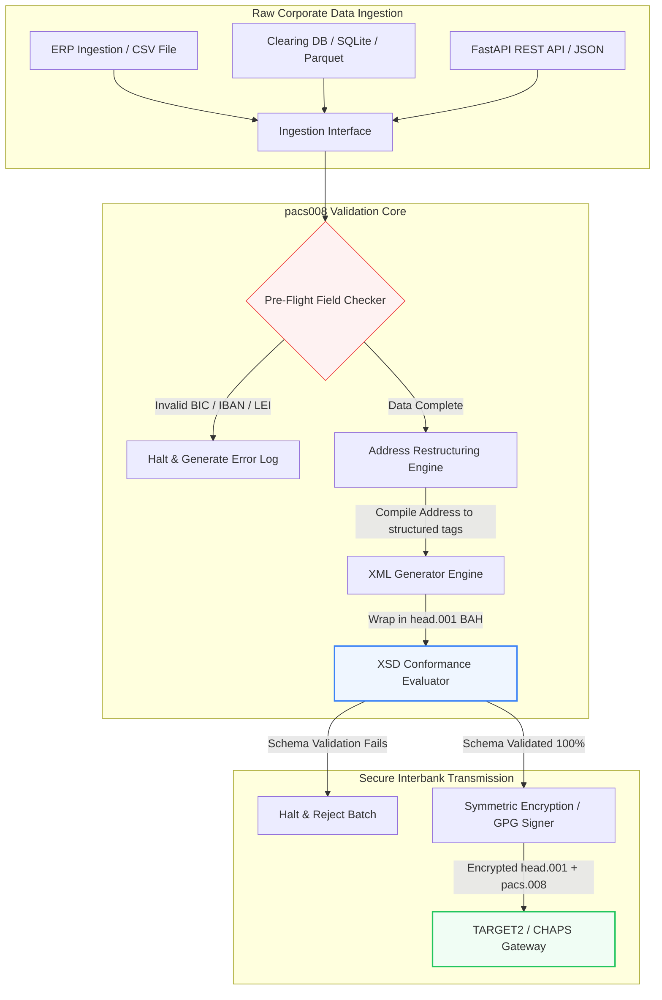

---

# Front Matter (YAML)

author: "contact@sebastienrousseau.com (Sebastien Rousseau)"
banner_alt: "অফিসকর্মী ভয়েস অ্যাসিস্ট্যান্ট ও ল্যাপটপের সঙ্গে — pacs.008 অটোমেশন যে কাঠামোগত, মেশিন-পাঠ্য আন্তঃব্যাংক পেমেন্ট বার্তাকে প্রোগ্রামেবল করে, তারই প্রতীক"
banner_height: "1597"
banner_width: "2584"
banner: "https://cloudcdn.pro/stocks/images/tyler-prahm-lmV3gJSAgbo.webp"
cdn: "https://cloudcdn.pro"
charset: "UTF-8"
cname: "sebastienrousseau.com"
copyright: "© Copyright 2025 - 2026 - Sebastien Rousseau. All rights reserved."
date: "June 15, 2026"
description: "Pacs008 একটি ওপেন-সোর্স Python লাইব্রেরি, যা ISO 20022 pacs.008 FI-to-FI গ্রাহক ক্রেডিট ট্রান্সফার বার্তা তৈরি ও বৈধকরণ অটোমেট করে — কাঠামোগত ঠিকানা, BAH head.001 মোড়ক, BIC/LEI/IBAN চেকসাম, OpenTelemetry UETR ট্রেসিং — নভেম্বর ২০২৬ SWIFT কাটওভারের জন্য তৈরি।"
format-detection: "telephone=no"
hreflang: "bn"
icon: "https://cloudcdn.pro/clients/sebastienrousseau/v1/logos/sebastienrousseau.svg"
id: "https://sebastienrousseau.com/2026-06-15-pacs008-automation-iso-20022-interbank-payments-2026"
image_alt: "Black and White Portrait of Sebastien Rousseau"
image_height: "162"
image_width: "162"
image: "https://cloudcdn.pro/stocks/images/sebastien-rousseau.png"
keywords: "pacs008, ISO 20022 pacs.008, FI to FI গ্রাহক ক্রেডিট ট্রান্সফার, কাঠামোগত ঠিকানা, SWIFT CBPR+, BAH head.001, TARGET2, CHAPS, Fedwire, DORA, BCBS 239, Basel III, UETR, LEI বৈধতা, SEPA VoP"
language: "bn-IN"
last_reviewed: "2026-06-15"
layout: "report"
locale: "bn_IN"
logo_alt: "Logo for Sebastien Rousseau"
logo_height: "44"
logo_width: "44"
logo: "https://cloudcdn.pro/clients/sebastienrousseau/v1/logos/sebastienrousseau.svg"
menu: ""
measurementID: "G-169G4ET5HQ"
name: "Sebastien Rousseau"
permalink: "https://sebastienrousseau.com/2026-06-15-pacs008-automation-iso-20022-interbank-payments-2026"
rating: "general"
referrer: "no-referrer"
robots: "index, follow"
schema: "FAQPage, Article"
seo_title: "ISO 20022 যুগের জন্য pacs.008 অটোমেশন"
short_name: "sebastienrousseau"
subtitle: "pacs.008 বার্তাই সেই বিন্দু, যেখানে আন্তঃব্যাংক পেমেন্ট ডেটা, কাঠামোগত ঠিকানা, সম্মতি, রাউটিং ও নিষ্পত্তি অপারেশন একসঙ্গে মেলে।"
tags: "pacs008, ISO 20022, আন্তঃব্যাংক পেমেন্ট, পাইকারি পেমেন্ট, Python"
theme-color: "0, 83, 191"
title: "২০২৬-এ ISO 20022 আন্তঃব্যাংক যুগের জন্য pacs.008 অটোমেশন গড়া"
url: "https://sebastienrousseau.com/2026-06-15-pacs008-automation-iso-20022-interbank-payments-2026"
viewport: "width=device-width, initial-scale=1, shrink-to-fit=no"

# RSS - The RSS feed front matter (YAML).
atom_link: "https://sebastienrousseau.com/2026-06-15-pacs008-automation-iso-20022-interbank-payments-2026/rss.xml"
category: "Finance"
docs: https://validator.w3.org/feed/docs/rss2.html
generator: "Static Site Generator (SSG) (version 0.0.26)"
item_description: "Pacs008 আন্তঃব্যাংক পেমেন্ট যুগে ISO 20022 FI-to-FI গ্রাহক ক্রেডিট ট্রান্সফার বার্তা অটোমেট করার জন্য একটি ওপেন-সোর্স Python ভিত্তি দেয়।"
item_guid: "https://sebastienrousseau.com/2026-06-15-pacs008-automation-iso-20022-interbank-payments-2026/rss.xml"
item_link: "https://sebastienrousseau.com/2026-06-15-pacs008-automation-iso-20022-interbank-payments-2026/rss.xml"
item_pub_date: "Mon, 15 Jun 2026 06:06:06 +0000"
item_title: "২০২৬-এ ISO 20022 আন্তঃব্যাংক যুগের জন্য pacs.008 অটোমেশন গড়া"
last_build_date: "Mon, 15 Jun 2026 06:06:06 +0000"
managing_editor: "contact@sebastienrousseau.com (Sebastien Rousseau)"
pub_date: "Mon, 15 Jun 2026 06:06:06 +0000"
ttl: "60"
type: "article"
webmaster: "contact@sebastienrousseau.com"

# Apple - The Apple front matter (YAML).
apple_mobile_web_app_orientations: "portrait"
apple_touch_icon_sizes: "192x192"
apple-mobile-web-app-capable: "yes"
apple-mobile-web-app-status-bar-inset: "black"
apple-mobile-web-app-status-bar-style: "black-translucent"
apple-mobile-web-app-title: "ISO 20022 যুগের জন্য pacs.008 অটোমেশন"
apple-touch-fullscreen: "yes"

# MS Application - The MS Application front matter (YAML).

msapplication-navbutton-color: "0, 83, 191"

# Twitter Card - The Twitter Card front matter (YAML).

twitter_card: "summary_large_image"
twitter_creator: "@wwdseb"
twitter_description: "Pacs008 আন্তঃব্যাংক পেমেন্ট যুগে ISO 20022 FI-to-FI গ্রাহক ক্রেডিট ট্রান্সফার বার্তা অটোমেট করার জন্য একটি ওপেন-সোর্স Python ভিত্তি দেয়।"
twitter_image: "https://cloudcdn.pro/clients/sebastienrousseau/v1/logos/sebastienrousseau.svg"
twitter_image_alt: "Logo of Sebastien Rousseau"
twitter_site: "@wwdseb"
twitter_title: "ISO 20022 যুগের জন্য pacs.008 অটোমেশন"
twitter_url: "https://sebastienrousseau.com/2026-06-15-pacs008-automation-iso-20022-interbank-payments-2026"

excerpt: "pacs008 একটি ওপেন-সোর্স Python টুলকিট, যা ISO 20022 FI-to-FI গ্রাহক ক্রেডিট ট্রান্সফার বার্তাকে প্রোগ্রামেবল করে তোলে — কাঠামোগত ঠিকানা, বৈধকরণ, রাউটিং, সম্মতি হুক এবং SWIFT-এর নভেম্বর ২০২৬ সময়সীমা ডিফল্ট হিসেবে অন্তর্নিহিত।"

# Humans.txt - The Humans.txt front matter (YAML).
author_website: "https://sebastienrousseau.com"
author_twitter: "@wwdseb"
author_location: "London, UK"
thanks: "পড়ার জন্য ধন্যবাদ!"
site_last_updated: "2026-06-15"
site_standards: "HTML5, CSS3, RSS, Atom, JSON, XML, YAML, Markdown, TOML"
site_components: "Kaishi, Kaishi Builder, Kaishi CLI, Kaishi Templates, Kaishi Themes"
site_software: "Static Site Generator, Rust"

---

# ২০২৬-এ ওপেন-সোর্স Python দিয়ে ISO 20022 pacs.008 আন্তঃব্যাংক পেমেন্ট অটোমেট করা

<!-- lead-start -->
<aside class="post-lead" aria-label="নিবন্ধের সারসংক্ষেপ">

<strong>সংক্ষেপে।</strong> SWIFT CBPR+ নির্দেশিকার অধীনে, ১৪ নভেম্বর ২০২৬-এর Structured Address Cliff TARGET2, CHAPS, Fedwire, Lynx ও SEPA জুড়ে অকাঠামোগত ডাক ঠিকানা বাতিল করে দেয়। Pacs008 একটি ওপেন-সোর্স Python লাইব্রেরি, যা ISO 20022 FI-to-FI গ্রাহক ক্রেডিট ট্রান্সফার (pacs.008) বার্তা তৈরি ও বৈধকরণ অটোমেট করে, পেমেন্টকে Business Application Header (BAH head.001) মোড়কে আবৃত করে, এবং বার্তা ক্লিয়ারিং নেটওয়ার্ক স্পর্শ করার আগেই ডেটা পাথে কাঠামোগত-ঠিকানা সম্মতি অন্তর্ভুক্ত করে।

<strong>মূল গ্রহণযোগ্য বিষয়</strong>

<ul class="post-lead-takeaways">
  <li><strong>Structured Address Deadline চূড়ান্ত।</strong> ১৪ নভেম্বর ২০২৬-এর পর অকাঠামোগত ঠিকানা ব্লক বাতিল। সীমান্ত প্রত্যাখ্যান ঠেকাতে Pacs008 ডেটা সংকলনের সময়ই কাঠামোগত ডাক-ঠিকানা উপাদান (<code>&lt;TwnNm&gt;</code>, <code>&lt;Ctry&gt;</code>, <code>&lt;PstCd&gt;</code>) প্রয়োগ করে।</li>
  <li><strong>একীভূত বার্তা অর্কেস্ট্রেশন।</strong> মূল pacs.008 পেমেন্ট পেলোডকে সম্মতিযুক্ত Business Application Header (head.001) মোড়কে আবৃত করে, যা একটি মানক রাউন্ড-ট্রিপ প্রক্রিয়াকরণ মডেল দেয়।</li>
  <li><strong>অ্যালগরিদমিক অখণ্ডতা।</strong> ISO 7064 Modulo 97-10 চেকসাম গণনা ব্যবহার করে BIC ও Legal Entity Identifier (LEI)-এর জন্য অন্তর্নির্মিত বৈধকারক।</li>
  <li><strong>DORA-মানের ট্রেসেবিলিটি।</strong> রিয়েল-টাইম অডিট লগ ও ক্রিপ্টোগ্রাফিক অডিট স্বাক্ষরের জন্য Unique End-to-End Transaction Reference (UETR)-এ কী করা সম্পূর্ণ OpenTelemetry ইন্সট্রুমেন্টেশন।</li>
  <li><strong>বোর্ড-স্তরের আস্থামূলক দায়িত্ব রক্ষা।</strong> আন্তঃব্যাংক বার্তার নির্ভুলতাকে DORA ধারা ৫, BCBS 239 প্রতিবেদন ও Basel III অপারেশনাল ঝুঁকি মূলধন সাশ্রয়ের সঙ্গে সারিবদ্ধ করে।</li>
</ul>

<strong>সম্পর্কিত পঠন:</strong> <a href="https://sebastienrousseau.com/2026-05-19-global-wholesale-payments-economics-2026">২০২৬-এ গ্লোবাল পাইকারি পেমেন্ট: ISO 20022, RTGS নবায়ন ও আন্তঃচালনাযোগ্যতার অর্থনীতি</a>, <a href="https://sebastienrousseau.com/2026-05-27-ai-operating-system-payments-fraud-routing-resilience-compliance-2026">পেমেন্টের অপারেটিং সিস্টেম হিসেবে AI: ২০২৬-এ জালিয়াতি, রাউটিং, স্থিতিস্থাপকতা ও সম্মতি</a>, <a href="https://sebastienrousseau.com/2026-05-12-iso-20022-pacs008-structured-address-deadline">নভেম্বর ২০২৬ pacs.008 কাঠামোগত-ঠিকানা সময়সীমা: ছয় মাসের দৃষ্টিভঙ্গি</a>.

</aside>
<!-- lead-end -->

লিগ্যাসি আর্থিক ডেটা ও কাঠামোগত আন্তঃব্যাংক বার্তার মধ্যে ফাঁক ভরাট করা — একটি অডিটযোগ্য, স্কিমা-বৈধকৃত Python পাইপলাইনের মাধ্যমে।

এই নিবন্ধের ওপেন-সোর্স রেফারেন্স পয়েন্ট হল [pacs008 ⧉](https://github.com/sebastienrousseau/pacs008 "pacs008 — ওপেন-সোর্স Python লাইব্রেরি")। রিপোজিটরি ISO 20022 pacs.008 FI-to-FI গ্রাহক ক্রেডিট ট্রান্সফার XML বার্তা অটোমেট করার জন্য একটি Python লাইব্রেরি হিসেবে অবস্থান নিয়েছে।

## ২০২৬-এ এই ওপেন-সোর্স প্রকল্প কেন গুরুত্বপূর্ণ

বৈশ্বিক আন্তঃব্যাংক পেমেন্ট ক্লিয়ারিং পরিকাঠামো প্রায় অর্ধশতাব্দীর মধ্যে নিজের সবচেয়ে গভীর আধুনিকীকরণের মধ্য দিয়ে যাচ্ছে।

জুন ২০২৬-এ আর্থিক পরিষেবা ক্ষেত্র **১৪ নভেম্বর ২০২৬-এর SWIFT Structured Address Cliff**-এর দিকে দ্রুত এগোচ্ছে। ওই তারিখ থেকে SWIFT CBPR+ নির্দেশিকা, TARGET2, CHAPS, Fedwire ও কানাডার Lynx আনুষ্ঠানিকভাবে অকাঠামোগত ডাক-ঠিকানা লাইন বাতিল করবে (`<PstlAdr>` ব্লকের ভেতরে শুধুমাত্র `<AdrLine>` ব্যবহারকারী)। অংশগ্রহণকারী সব আর্থিক প্রতিষ্ঠানকে হয় হাইব্রিড ফর্ম্যাটে (কাঠামোগত `<TwnNm>` ও `<Ctry>`, এবং অবশিষ্ট বিবরণের জন্য সর্বাধিক দুটি `<AdrLine>` উপাদান) অথবা সম্পূর্ণ কাঠামোগত ফর্ম্যাটে (রাস্তার নাম, ভবন নম্বর ও পোস্টাল কোডের জন্য পৃথক উপাদান) ঠিকানা পাঠাতে হবে। এই শর্ত পূরণে ব্যর্থ যেকোনো বার্তা নেটওয়ার্ক সীমান্তে প্রত্যাখ্যাত হবে।

আর্থিক প্রতিষ্ঠানের জন্য এই উত্তরণ বড় পরিচালনগত সীমাবদ্ধতা তৈরি করে:

1. **সীমান্ত-প্রত্যাখ্যানের শাস্তি।** কাঠামোগত-ঠিকানা মাপকাঠি পূরণে ব্যর্থ পেমেন্ট তৎক্ষণাৎ নেটওয়ার্ক প্রত্যাখ্যানের মুখে পড়বে, যার ফলে লেনদেন বিলম্ব, তারল্য আটকে যাওয়া ও পরিচালনগত জট তৈরি হবে।
2. **SEPA Verification of Payee (VoP)।** SEPA অঞ্চলের ভেতরে সব Payment Service Provider (PSP)-কে ক্রেডিট ট্রান্সফার সম্পাদনের আগে সুবিধাভোগীর নাম ও IBAN-এর মিল যাচাই করতে বাধ্য করে, যা বার্তা সূচনায় আরেকটি বৈধতা গেট যোগ করে।

[Pacs008](https://github.com/sebastienrousseau/pacs008) এই সমস্যার সমাধান দেয়। এটি একটি ওপেন-সোর্স, হালকা Python লাইব্রেরি, যা কাঁচা আর্থিক ডেটাকে সম্পূর্ণ বৈধকৃত, স্কিমা-সম্মতিযুক্ত ISO 20022 pacs.008 আন্তঃব্যাংক গ্রাহক ক্রেডিট ট্রান্সফার বার্তায় রূপান্তরের কাজ অটোমেট করে। লিগ্যাসি-থেকে-কাঠামোগত ডেটার ফাঁক ভরাট করে pacs008 উচ্চ Return on Resilience (RoR) দেয়, কার্যকরী মূলধন রক্ষা করে এবং বৈশ্বিক রেল জুড়ে রিয়েল-টাইম এক্সিকিউশন সুরক্ষিত করে।

## pacs008 ২০২৬ স্থাপত্য দৃষ্টিভঙ্গি

pacs008 লাইব্রেরি একটি বিচ্ছিন্ন বৈধকরণ ও জেনারেশন ইঞ্জিন হিসেবে গঠিত, যা নিশ্চিত করে কাঁচা ইনপুট পদ্ধতিগতভাবে পার্স, সমৃদ্ধ ও মানক মোড়কে আবৃত হবে:

| স্তর | নকশা সিদ্ধান্ত | কেন গুরুত্বপূর্ণ | অপব্যবস্থাপনায় ঝুঁকি |
|---|---|---|---|
| **Input স্তর** | CSV, JSON, SQLite ও Parquet ইনজেশন | ব্যাংকিং সংহতকরণ দলগুলিকে তাদের বিদ্যমান ডেটার জায়গাতেই পায়, প্ল্যাটফর্ম অভিবাসন এড়ায়। | কাঁচা, অবৈধ বা দূষিত ডেটা পেলোডের ইনজেশন। |
| **Validation স্তর** | অফিসিয়াল XSD স্কিমা ও কাস্টম ব্যবসা-নিয়মের বিপরীতে প্রি-ফ্লাইট বৈধকরণ | পেমেন্ট ফাইল ক্লিয়ারিং নেটওয়ার্কে যাওয়ার আগেই এক্সিকিউশন থামায় ও ত্রুটি চিহ্নিত করে। | অবৈধ XML ফাইল তৎক্ষণাৎ নেটওয়ার্ক প্রত্যাখ্যান ও ক্লিয়ারিং বিলম্বের কারণ হয়। |
| **BAH Envelope স্তর** | স্বয়ংক্রিয় Business Application Header (head.001) মোড়ক | `<MsgDefIdr>` ট্যাগের ভিত্তিতে বার্তা প্রেরণ ও রাউটিং প্রমিত করে। | প্রয়োজনীয় বাইরের মোড়ক ছাড়া কাঁচা pacs.008 পেলোড পাঠানো, যা সিস্টেম প্রত্যাখ্যান ঘটায়। |
| **Serialization স্তর** | মানক XML ও ISO-সম্মতিযুক্ত JSON (TS 23029) সমর্থন | XML ও JSON পেলোডের মধ্যে সরাসরি অনুবাদ সক্ষম করে, আধুনিক REST API ও Kafka স্ট্রিমিং সমর্থন করে। | অফিসিয়াল ISO নির্দেশিকা লঙ্ঘনকারী খণ্ডিত ডেটা উপস্থাপনা। |
| **Observability স্তর** | UETR-এ কী করা OpenTelemetry ট্রেসিং | বিস্তারিত এক্সিকিউশন পথ ও লগ ধারণ করে, রিয়েল-টাইম অডিটযোগ্যতা দেয়। | ট্রেসিং ফাঁক যা পরিচালনগত দৃশ্যমানতা ও অডিটিং বাধা দেয়। |

## প্রধান আন্তঃব্যাংক সংকেত ও নিয়ন্ত্রক মাইলফলক

লেনদেনগত পরিচালনগত স্থিতিস্থাপকতা প্রদর্শনের জন্য সিনিয়র প্রযুক্তি ও ঝুঁকি ম্যানেজারদের নির্দিষ্ট, পরিমাপযোগ্য সম্মতি সূচকগুলি ট্র্যাক করতে হবে:

| সংকেত | মেট্রিক / পরিচালনগত মানদণ্ড | G20 / SWIFT / DORA রেফারেন্স | প্রযুক্তিগত প্ল্যাটফর্ম বাস্তবায়ন |
|---|---|---|---|
| **কাঠামোগত ঠিকানা সম্মতি** | `<TwnNm>` ও `<Ctry>` সহ সম্পূর্ণ কাঠামোগত `<PstlAdr>` ফিল্ড ব্যবহারকারী pacs.008 বার্তার %। | SWIFT SR 2026 সময়সীমা | pacs008-এ প্রি-ফ্লাইট স্কিমা চেক, যা অকাঠামোগত ঠিকানা লাইন প্রত্যাখ্যান করে। |
| **SEPA Verification of Payee** | বার্তা এক্সিকিউশনের আগে সুবিধাভোগীর নাম ও IBAN-এর মিল বৈধতা। | SEPA VoP প্রবিধান | অন্তর্নির্মিত VoP হেল্পার ক্লাস, যা IBAN/BIC-এর প্রি-বৈধকরণ কোয়েরি চালায়। |
| **BAH head.001 সংহতকরণ** | Business Application Header-এ সফলভাবে মোড়ানো বহির্গামী পেমেন্ট পেলোডের শতাংশ। | TARGET2 / CBPR+ নির্দেশিকা | BAH মোড়ক সাবসিস্টেম স্বয়ংক্রিয়ভাবে বাইরের XML মোড়ক সংকলন করে। |
| **LEI Modulo চেকসাম** | ঋণী ও পাওনাদার `<LEI>` ব্লকে ISO 7064 Modulo 97-10 চেক-ডিজিট বৈধকরণ। | Bank of England বাধ্যবাধকতা | অ্যালগরিদমিক চেকার ২০-ক্যারেক্টার শনাক্তকারীর অখণ্ডতা যাচাই করে। |
| **UETR ট্র্যাকিং নির্ভুলতা** | বৈধ Unique End-to-End Transaction Reference সহ ইনজেক্ট করা ১০০% তৈরি পেমেন্ট। | SWIFT UETR বিনির্দেশ | ৩৬-ক্যারেক্টার UUIDv4 রেফারেন্স কোডের স্বয়ংক্রিয় জেনারেশন ও ট্রেসিং। |

## আন্তঃব্যাংক অটোমেশনের আদর্শ অন-র‍্যাম্প হিসেবে Python কেন

২০২৬-এ আধুনিক পেমেন্ট হাব ও ট্রেজারি অপারেশন দলগুলি ডেটা রূপান্তর, আর্থিক মডেলিং ও ERP ডেটাবেস সংহতকরণের জন্য Python-এর উপর ব্যাপকভাবে নির্ভর করে।

ওপেন-সোর্স Python লাইব্রেরি ব্যবহার করে প্রতিষ্ঠানগুলি উল্লেখযোগ্য সুবিধা অর্জন করে:

1. **নিম্ন কগনিটিভ লোড ও উচ্চ আন্তঃচালনাযোগ্যতা।** Python একটি সংহত সেতু হিসেবে কাজ করে। এটি ডেভেলপারদের লিগ্যাসি ডেটাবেস থেকে কাঁচা পেমেন্ট নির্দেশ টেনে আনার, জটিল আন্তর্জাতিক ব্যাংকিং নিয়মের বিপরীতে বৈধকরণ ও সম্মতিযুক্ত XML আউটপুট দেওয়ার সরল স্ক্রিপ্ট লিখতে দেয় — সব এক ঐক্যবদ্ধ ওয়ার্কফ্লোতে।
2. **"ব্ল্যাক-বক্স" অস্পষ্ট অনুবাদকের অবসান।** মালিকানাধীন ব্যাংকিং পোর্টাল প্রায়ই কাস্টম পেমেন্ট ফাইল অনুবাদকের জন্য উচ্চ লাইসেন্সিং ফি নেয়। এই অনুবাদকগুলি মালিকানাধীন ব্ল্যাক বক্স, ফলে নিরাপত্তা দলগুলি অডিট করতে পারে না কীভাবে ডেটা প্রক্রিয়াজাত হয় বা কী কোথায় সংরক্ষিত। pacs008-এর মতো একটি ওপেন-সোর্স, পরিদর্শনযোগ্য লাইব্রেরি সম্পূর্ণ কোড স্বচ্ছতা নিশ্চিত করে।
3. **নিরবচ্ছিন্ন CI/CD সংহতকরণ।** Pacs008 সরাসরি ক্রমাগত ইন্টিগ্রেশন ও ডিপ্লয়মেন্ট পাইপলাইনে যুক্ত হয়, ডেভেলপারদের তাদের স্ট্যান্ডার্ড সফটওয়্যার ডেলিভারি লাইফসাইকেলের অংশ হিসেবে পেমেন্ট ফাইল পরীক্ষা অটোমেট করতে দেয়।

## একটি সীমাবদ্ধ আন্তঃব্যাংক পাইপলাইন ডিজাইন করা

আন্তঃব্যাংক ক্লিয়ারিংয়ে একটি বড় দুর্বলতা হল "অনিয়ন্ত্রিত ব্যাচ জেনারেশন" — স্পষ্ট, সীমাবদ্ধ যাচাই লুপ ছাড়াই ফাইল তৈরি করা। Pacs008 একটি কঠোরভাবে নিয়ন্ত্রিত, বহু-পর্যায়ের লেনদেন পাইপলাইনের ভেতরে মূল বৈধকরণ ইঞ্জিন হিসেবে কাজ করার জন্য ডিজাইন করা।

নিচের পরিচালনগত প্রবাহ দেখায় কীভাবে কাঁচা লেনদেন ডেটা pacs008 পাইপলাইনের মধ্য দিয়ে যায় এবং BAH মোড়কে আবৃত একটি ক্রিপ্টোগ্রাফিকভাবে সুরক্ষিত, স্কিমা-সম্মতিযুক্ত pacs.008 ফাইল তৈরি করে:

## বোর্ডরুম প্লেবুক ও আস্থামূলক দায়িত্ব

আন্তঃব্যাংক পেমেন্ট অটোমেশন একটি বোর্ড-স্তরের ঝুঁকি-ব্যবস্থাপনা ও কর্পোরেট-গভর্ন্যান্স বিষয়। সিনিয়র ম্যানেজারদের আস্থামূলক দায়িত্ব ও পরিচালনগত ঝুঁকি হ্রাসের লেন্স থেকে লেনদেন ডেটার গুণমান মোকাবিলা করতে হবে:

- **DORA ধারা ৫ (বোর্ড জবাবদিহিতা)।** প্রতিষ্ঠানের ICT অপারেশনের স্থিতিস্থাপকতা ও নিরাপত্তার জন্য বোর্ড সদস্যদের সরাসরি, ব্যক্তিগত দায় চাপায়। যেহেতু আন্তঃব্যাংক ক্লিয়ারিং একটি গুরুত্বপূর্ণ কর্পোরেট কার্যাবলি, বোর্ডকে দেখাতে হবে যে তারা পরিচালনগত বিঘ্ন বা বিলম্বিত পেমেন্ট ঠেকাতে শক্তিশালী, বৈধকৃত ও স্বয়ংক্রিয় লেনদেন নিয়ন্ত্রণ প্রয়োগ করেছে।
- **BCBS 239 (ঝুঁকি ডেটা সমষ্টিকরণ ও প্রতিবেদন)।** দাবি করে যে আর্থিক লেনদেনের প্রতিবেদন নির্ভুল, সম্পূর্ণ ও রিয়েল টাইমে তৈরি হোক। Pacs008 উৎসেই পেমেন্ট ডেটা পরিচ্ছন্নভাবে কাঠামোবদ্ধ ও বৈধকৃত নিশ্চিত করে প্রতিষ্ঠানকে BCBS 239 সম্মতি অর্জনে সাহায্য করে, লিগ্যাসি স্প্রেডশিটে জর্জরিত ডেটা ফাঁক ও ম্যানুয়াল মিলকরণ ত্রুটি দূর করে।
- **অপারেশনাল ঝুঁকি মূলধন চার্জ লাঘব (Basel III)।** Basel III নির্দেশিকার অধীনে, উচ্চ পেমেন্ট ত্রুটির হার ও ম্যানুয়াল হস্তক্ষেপের ওভারহেড ব্যাংকের পরিচালনগত ঝুঁকি মূলধন প্রয়োজনীয়তা বাড়ায়, যা ঋণদান বা বিনিয়োগে কাজে লাগানো যেত এমন মূলধন আটকে রাখে। পেমেন্ট পাইপলাইন অটোমেট করা সরাসরি এই মূলধন প্রিমিয়াম কমায়, ব্যালান্স-শিট মূল্য রক্ষা করে।

## ব্যাংকের ধরন অনুযায়ী এর অর্থ

### বৈশ্বিক পদ্ধতিগতভাবে গুরুত্বপূর্ণ ব্যাংক (G-SIB)

G-SIB-গুলি বিশাল, সীমান্ত-পার কর্পোরেট লেনদেন ভলিউম পরিচালনা করে। তাদের প্রাথমিক চ্যালেঞ্জ হল ক্লিয়ারিং নেটওয়ার্কে পৌঁছানোর আগে অকাঠামোগত লিগ্যাসি ডেটার সংশোধন। তাদের কর্পোরেট ব্যাংকিং গেটওয়েতে pacs008 যুক্ত করে G-SIB-গুলি তাদের কর্পোরেট ক্লায়েন্টদের স্বয়ংক্রিয় বৈধকরণ ইউটিলিটি দিতে পারে, ম্যানুয়াল পেমেন্ট মেরামতের ওভারহেড কমাতে পারে এবং SWIFT নেটওয়ার্ক জুড়ে রিয়েল-টাইম এক্সিকিউশন সুরক্ষিত করতে পারে।

### লেনদেন ও কর্পোরেট ব্যাংক

লেনদেন ব্যাংকের জন্য, পেমেন্ট ডেটার গুণমান একটি প্রতিযোগিতামূলক পার্থক্যকারী। কর্পোরেট ট্রেজারি ক্লায়েন্টদের pacs008-এর মতো একটি ওপেন-সোর্স, পরিদর্শনযোগ্য বৈধকরণ টুল দিয়ে এই ব্যাংকগুলি অনবোর্ডিং ত্বরান্বিত করতে, পেমেন্ট ফাইল প্রত্যাখ্যান কমাতে এবং উন্নত স্ট্রেট-থ্রু প্রসেসিং হারের মাধ্যমে গ্রাহকের আস্থা গড়তে পারে।

### আঞ্চলিক ও ছোট ব্যাংক

আঞ্চলিক ব্যাংককে G-SIB-এর বিশাল প্রযুক্তি বাজেট ছাড়াই আন্তর্জাতিক পেমেন্ট মান বজায় রাখতে হবে। Pacs008 একটি হালকা, খরচ-কার্যকর ও সম্পূর্ণ সম্মতিযুক্ত Python-ভিত্তিক সমাধান দেয়, যা ছোট প্রতিষ্ঠানকে ব্যয়বহুল মালিকানাধীন মিডলওয়্যার লাইসেন্স ছাড়াই আধুনিক, কাঠামোগত পেমেন্ট সূচনা সক্ষমতা প্রদান করতে দেয়।

## উপসংহার: আন্তঃব্যাংক ক্লিয়ারিং রোডম্যাপ

আসন্ন SWIFT নভেম্বর ২০২৬ কাঠামোগত-ঠিকানা সময়সীমা কর্পোরেট ট্রেজারি অপারেশনের জন্য একটি কঠিন সীমানা। লিগ্যাসি স্প্রেডশিট, ম্যানুয়াল ডেটা এন্ট্রি ও অকাঠামোগত পেমেন্ট ফাইলের উপর নির্ভরশীলতা একটি সক্রিয় ব্যবসা ঝুঁকি।

লেনদেনের ধারাবাহিকতা সুরক্ষিত করতে ও পরিচালনগত ওভারহেড কমাতে, সিনিয়র প্রযুক্তি ও অর্থ ম্যানেজারদের আজই একটি স্পষ্ট ক্লিয়ারিং রোডম্যাপ বাস্তবায়ন করা উচিত:

1. **উৎসেই বৈধকরণ প্রয়োগ করুন।** কর্পোরেট ERP সীমা ছাড়ার আগে সব পেমেন্ট নির্দেশ অফিসিয়াল ISO 20022 XSD স্কিমা অনুসারে বৈধকৃত ও ফর্ম্যাট করা বাধ্যতামূলক করুন।
2. **ডেটা পাইপলাইন অডিট করুন।** ম্যানুয়াল স্প্রেডশিট প্রক্রিয়াকরণ থেকে সরে আসুন এবং pacs008 ব্যবহার করে স্বয়ংক্রিয়, পরিদর্শনযোগ্য Python-ভিত্তিক ওয়ার্কফ্লো বাস্তবায়ন করুন।
3. **হাইব্রিড নিরাপত্তা বাস্তবায়ন করুন।** নিশ্চিত করুন তৈরি পেমেন্ট ফাইল প্রেরণের আগে ক্রিপ্টোগ্রাফিকভাবে স্বাক্ষরিত ও এনক্রিপ্ট করা, যা শূন্য-আস্থা নেটওয়ার্ক প্রত্যাশা পূরণ করে।
4. **আস্থামূলক অগ্রাধিকারের সঙ্গে সারিবদ্ধ করুন।** পেমেন্ট অটোমেশন ও ডেটা গুণমান মেট্রিক বোর্ডে আনুষ্ঠানিকভাবে প্রতিবেদন করুন, এই বিনিয়োগকে DORA-এর অধীনে একটি গুরুত্বপূর্ণ পরিচালনগত ঝুঁকি হ্রাস কর্মসূচি হিসেবে চিত্রিত করুন।

## প্রায়শই জিজ্ঞাসিত প্রশ্ন

**pacs008 কি আসন্ন SWIFT SR 2026 ঠিকানা নিয়মের সঙ্গে সম্মতিযুক্ত?**

হ্যাঁ। Pacs008 কঠোর SWIFT নভেম্বর ২০২৬ কাঠামোগত ঠিকানা মাইলফলক সমর্থনের জন্য ডিজাইন করা, যা ডাক-ঠিকানা উপাদান (শহর, দেশ, পোস্টকোড)-কে নির্ধারিত ISO 20022 XML ফিল্ডে বাধ্যতামূলক পৃথকীকরণ প্রয়োগ করে।

**pacs008 কি পেমেন্ট পেলোডকে Business Application Header-এ মোড়াতে পারে?**

হ্যাঁ। যেহেতু pacs008 নেটিভভাবে Business Application Header (BAH head.001) মোড়ক সমর্থন করে, এটি TARGET2, CHAPS ও CBPR+ নেটওয়ার্ক দ্বারা প্রয়োজনীয় বাইরের মোড়ক স্বয়ংক্রিয়ভাবে সংকলন করে।

**মালিকানাধীন ফাইল অনুবাদকের চেয়ে ওপেন-সোর্স লাইব্রেরি কেন বেশি পছন্দনীয়?**

মালিকানাধীন অনুবাদকগুলি অস্পষ্ট ব্ল্যাক বক্স, যা নিরাপত্তা অডিট অসম্ভব করে তোলে। pacs008-এর মতো একটি ওপেন-সোর্স, পিয়ার-রিভিউড লাইব্রেরি সম্পূর্ণ কোড স্বচ্ছতা দেয়, নিরাপত্তা দলগুলিকে যাচাই করতে দেয় যে প্রক্রিয়াকরণের সময় কোনো সংবেদনশীল পেমেন্ট ডেটা প্রকাশ পাচ্ছে না।

**pacs008 কোন শনাক্তকারী বৈধ করে?**

Pacs008-এ ISO 7064 Modulo 97-10 চেকসাম গণনা ব্যবহার করে Bank Identifier Code (BIC) ও Legal Entity Identifier (LEI)-এর জন্য অন্তর্নির্মিত বৈধকারক, পাশাপাশি IBAN চেক-ডিজিট বৈধকরণ ও UETR অনন্যতা পরীক্ষা রয়েছে।

## তথ্যসূত্র

- SWIFT, (2024)। *ISO 20022 November 2026 Structured Address Milestone*। La Hulpe: SWIFT। উপলব্ধ: [SWIFT ISO 20022 মাইলফলক ⧉](https://www.swift.com/standards/iso-20022/iso-20022-bytes/call-action-november-2026 "SWIFT ISO 20022 মাইলফলক")।
- Basel Committee on Banking Supervision (BCBS), (2013)। *Principles for effective risk data aggregation and risk reporting (BCBS 239)*। Basel: Bank for International Settlements। উপলব্ধ: [BCBS 239 নীতি ⧉](https://www.bis.org/publ/bcbs239.htm "BCBS 239 নীতি")।
- European Parliament and Council of the European Union, (2022)। *Regulation (EU) 2022/2554 on digital operational resilience for the financial sector (DORA)*। Brussels: Official Journal of the European Union। উপলব্ধ: [DORA প্রবিধান ⧉](https://eur-lex.europa.eu/legal-content/EN/TXT/?uri=CELEX%3A32022R2554 "DORA প্রবিধান")।
- GitHub, (2026)। *pacs008 ওপেন-সোর্স রিপোজিটরি*। উপলব্ধ: [pacs008 রিপোজিটরি ⧉](https://github.com/sebastienrousseau/pacs008 "pacs008 রিপোজিটরি")।

<!-- enrich-start -->
<aside class="author-card" aria-label="লেখক সম্পর্কে"><strong class="author-card-name"><a href="/about/index.html">সেবাস্তিয়ান রুসো</a></strong>সিনিয়র ব্যাংকিং প্রযুক্তিবিদ, প্রয়োগ-ভিত্তিক AI, ISO 20022 অভিবাসন, আর্থিক পরিষেবার জন্য পোস্ট-কোয়ান্টাম ক্রিপ্টোগ্রাফি ও পাইকারি পেমেন্টের কাঠামোগত রূপান্তর নিয়ে লেখেন।HSBC Commercial &amp; Investment Bank, PayPal, Barclays, Shazam, AKQA, Virgin Group-এ ২০+ বছরের অভিজ্ঞতা। <a href="/about/index.html">সম্পূর্ণ প্রোফাইল</a> &middot; <a href="https://www.linkedin.com/in/sebastienrousseau/" rel="external noopener">LinkedIn</a> &middot; <a href="https://github.com/sebastienrousseau" rel="external noopener">GitHub</a></aside>

সর্বশেষ পর্যালোচনা <time datetime="2026-06-15">2026-06-15</time>।

<aside class="related-posts" aria-labelledby="related-heading">
<h2 id="related-heading" class="related-heading">সম্পর্কিত পঠন</h2>

<article class="related-card"><footer class="related-body"><h3><a href="https://sebastienrousseau.com/2026-05-19-global-wholesale-payments-economics-2026">২০২৬-এ গ্লোবাল পাইকারি পেমেন্ট: ISO 20022, RTGS নবায়ন ও আন্তঃচালনাযোগ্যতার অর্থনীতি</a></h3>
<time datetime="2026-05-19">2026-05-19</time>
</footer></article>
<article class="related-card"><footer class="related-body"><h3><a href="https://sebastienrousseau.com/2026-05-27-ai-operating-system-payments-fraud-routing-resilience-compliance-2026">পেমেন্টের অপারেটিং সিস্টেম হিসেবে AI: ২০২৬-এ জালিয়াতি, রাউটিং, স্থিতিস্থাপকতা ও সম্মতি</a></h3>
<time datetime="2026-05-27">2026-05-27</time>
</footer></article>
<article class="related-card"><footer class="related-body"><h3><a href="https://sebastienrousseau.com/2026-05-12-iso-20022-pacs008-structured-address-deadline">নভেম্বর ২০২৬ pacs.008 কাঠামোগত-ঠিকানা সময়সীমা: ছয় মাসের দৃষ্টিভঙ্গি</a></h3>
<time datetime="2026-05-12">2026-05-12</time>
</footer></article>

</aside>
<!-- enrich-end -->
