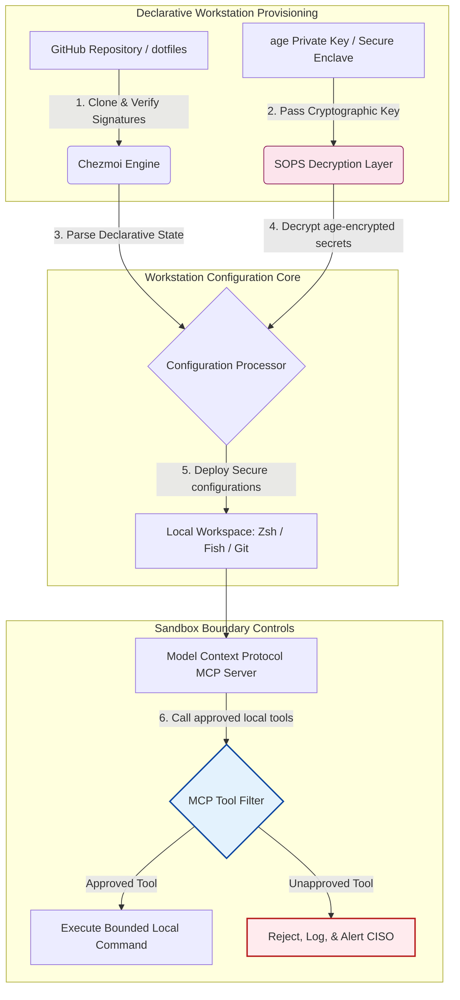

---

# Front Matter (YAML)

author: "contact@sebastienrousseau.com (Sebastien Rousseau)"
banner_alt: "স্বল্প আলোয় ডেভেলপার ওয়ার্কস্টেশন — MCP সার্ভার, SLSA স্বাক্ষর, age/SOPS গোপন তথ্য ও মাল্টি-শেল সমতার জন্য AI-সচেতন, পুনরুৎপাদনযোগ্য, সুরক্ষিত dotfiles-এর প্রতীক"
banner_height: "1597"
banner_width: "2584"
banner: "https://cloudcdn.pro/stocks/images/almas-salakhov-Vq2ap8aFFEs.webp"
cdn: "https://cloudcdn.pro"
charset: "UTF-8"
cname: "sebastienrousseau.com"
copyright: "© Copyright 2025 - 2026 - Sebastien Rousseau. All rights reserved."
date: "June 16, 2026"
description: "AI-সচেতন dotfiles ২০২৬-এ MCP যুগের সুরক্ষিত, পুনরুৎপাদনযোগ্য ওয়ার্কস্টেশন প্যাটার্ন — Chezmoi-ভিত্তিক ঘোষণামূলক কনফিগারেশন, SOPS/age গোপন তথ্য, SLSA Level 3 প্রভেন্যান্স, মাল্টি-শেল সমতা ও স্থানীয় AI এজেন্টের জন্য সীমাবদ্ধ স্যান্ডবক্স।"
format-detection: "telephone=no"
hreflang: "bn"
icon: "https://cloudcdn.pro/clients/sebastienrousseau/v1/logos/sebastienrousseau.svg"
id: "https://sebastienrousseau.com/2026-06-16-ai-aware-dotfiles-secure-reproducible-workstation-2026"
image_alt: "সেবাস্তিয়ান রুসোর সাদা-কালো প্রতিকৃতি"
image_height: "162"
image_width: "162"
image: "https://cloudcdn.pro/stocks/images/sebastienrousseau.webp"
keywords: "dotfiles, Chezmoi, MCP, Model Context Protocol, SLSA, SOPS, age encryption, ঘোষণামূলক কনফিগারেশন, ডেভেলপার ওয়ার্কস্টেশন, DORA Article 5, NIST CSF 2.0, সরবরাহ শৃঙ্খল নিরাপত্তা, এজেন্টিক AI, মাল্টি-শেল সমতা, Zsh, Fish, Nushell"
language: "bn-IN"
last_reviewed: "2026-06-16"
layout: "report"
locale: "bn_IN"
logo_alt: "সেবাস্তিয়ান রুসোর লোগো"
logo_height: "44"
logo_width: "44"
logo: "https://cloudcdn.pro/clients/sebastienrousseau/v1/logos/sebastienrousseau.svg"
menu: ""
measurementID: "G-169G4ET5HQ"
name: "Sebastien Rousseau"
permalink: "https://sebastienrousseau.com/2026-06-16-ai-aware-dotfiles-secure-reproducible-workstation-2026"
rating: "general"
referrer: "no-referrer"
robots: "index, follow"
schema: "FAQPage, Article"
seo_title: "AI-সচেতন dotfiles: সুরক্ষিত ডেভেলপার ওয়ার্কস্টেশন"
short_name: "sebastienrousseau"
subtitle: "ডেভেলপার ওয়ার্কস্টেশন এখন AI সরবরাহ শৃঙ্খলের অংশ; dotfiles-এ চাই নিরাপত্তা, পুনরুৎপাদনযোগ্যতা, গোপনীয়তা স্বাস্থ্যবিধি ও MCP-সচেতন ওয়ার্কফ্লো।"
tags: "dotfiles, ডেভেলপার টুল, MCP, SLSA, সুরক্ষিত ওয়ার্কস্টেশন, chezmoi, macOS, Linux, WSL"
theme-color: "0, 83, 191"
title: "২০২৬-এ AI-সচেতন dotfiles: MCP, SLSA ও মাল্টি-শেল সমতার জন্য সুরক্ষিত, পুনরুৎপাদনযোগ্য ডেভেলপার ওয়ার্কস্টেশন"
url: "https://sebastienrousseau.com/2026-06-16-ai-aware-dotfiles-secure-reproducible-workstation-2026"
viewport: "width=device-width, initial-scale=1, shrink-to-fit=no"

# RSS - The RSS feed front matter (YAML).
atom_link: "https://sebastienrousseau.com/2026-06-16-ai-aware-dotfiles-secure-reproducible-workstation-2026/rss.xml"
category: "Technology"
docs: https://validator.w3.org/feed/docs/rss2.html
generator: "Static Site Generator (SSG) (version 0.0.26)"
item_description: "macOS, Linux ও WSL জুড়ে সুরক্ষিত, পুনরুৎপাদনযোগ্য ডেভেলপার ওয়ার্কস্টেশনের জন্য ঘোষণামূলক dotfiles — MCP সচেতনতা, SLSA, age, SOPS ও মাল্টি-শেল সমতাসহ।"
item_guid: "https://sebastienrousseau.com/2026-06-16-ai-aware-dotfiles-secure-reproducible-workstation-2026/rss.xml"
item_link: "https://sebastienrousseau.com/2026-06-16-ai-aware-dotfiles-secure-reproducible-workstation-2026/rss.xml"
item_pub_date: "Tue, 16 Jun 2026 06:06:06 +0000"
item_title: "২০২৬-এ AI-সচেতন dotfiles: MCP, SLSA ও মাল্টি-শেল সমতার জন্য সুরক্ষিত, পুনরুৎপাদনযোগ্য ডেভেলপার ওয়ার্কস্টেশন"
last_build_date: "Tue, 16 Jun 2026 06:06:06 +0000"
managing_editor: "contact@sebastienrousseau.com (Sebastien Rousseau)"
pub_date: "Tue, 16 Jun 2026 06:06:06 +0000"
ttl: "60"
type: "article"
webmaster: "contact@sebastienrousseau.com"

# Apple - The Apple front matter (YAML).
apple_mobile_web_app_orientations: "portrait"
apple_touch_icon_sizes: "192x192"
apple-mobile-web-app-capable: "yes"
apple-mobile-web-app-status-bar-inset: "black"
apple-mobile-web-app-status-bar-style: "black-translucent"
apple-mobile-web-app-title: "AI-সচেতন dotfiles: সুরক্ষিত ডেভেলপার ওয়ার্কস্টেশন"
apple-touch-fullscreen: "yes"

# MS Application - The MS Application front matter (YAML).

msapplication-navbutton-color: "0, 83, 191"

# Twitter Card - The Twitter Card front matter (YAML).

twitter_card: "summary_large_image"
twitter_creator: "@wwdseb"
twitter_description: "macOS, Linux ও WSL জুড়ে সুরক্ষিত, পুনরুৎপাদনযোগ্য ডেভেলপার ওয়ার্কস্টেশনের জন্য ঘোষণামূলক dotfiles — MCP সচেতনতা, SLSA, age, SOPS ও মাল্টি-শেল সমতাসহ।"
twitter_image: "https://cloudcdn.pro/clients/sebastienrousseau/v1/logos/sebastienrousseau.svg"
twitter_image_alt: "সেবাস্তিয়ান রুসোর লোগো"
twitter_site: "@wwdseb"
twitter_title: "AI-সচেতন dotfiles: সুরক্ষিত ডেভেলপার ওয়ার্কস্টেশন"
twitter_url: "https://sebastienrousseau.com/2026-06-16-ai-aware-dotfiles-secure-reproducible-workstation-2026"

excerpt: "২০২৬-এ AI-সচেতন dotfiles ডেভেলপার ওয়ার্কস্টেশনকে সরবরাহ শৃঙ্খল পরিকাঠামো হিসেবে গণ্য করে — chezmoi-পরিচালিত ঘোষণামূলক কনফিগারেশন, MCP সচেতনতা, SLSA-স্বাক্ষরিত রিলিজ, age/SOPS গোপন তথ্য, সাব-সেকেন্ড স্টার্টআপ ও macOS/Linux/WSL সমতাসহ।"

# Humans.txt - The Humans.txt front matter (YAML).
author_website: "https://sebastienrousseau.com"
author_twitter: "@wwdseb"
author_location: "London, UK"
thanks: "পড়ার জন্য ধন্যবাদ!"
site_last_updated: "2026-06-16"
site_standards: "HTML5, CSS3, RSS, Atom, JSON, XML, YAML, Markdown, TOML"
site_components: "Kaishi, Kaishi Builder, Kaishi CLI, Kaishi Templates, Kaishi Themes"
site_software: "Static Site Generator, Rust"

---

# ২০২৬-এ AI-সচেতন dotfiles: MCP, SLSA ও মাল্টি-শেল সমতার জন্য সুরক্ষিত, পুনরুৎপাদনযোগ্য ডেভেলপার ওয়ার্কস্টেশন

<!-- lead-start -->
<aside class="post-lead" aria-label="নিবন্ধ সারাংশ">

<strong>সংক্ষেপে।</strong> ডেভেলপার ওয়ার্কস্টেশন আর কেবল একটি এন্ডপয়েন্ট নয়; এটি সফটওয়্যার সরবরাহ শৃঙ্খলের একজন সক্রিয় অংশীদার এবং স্থানীয় AI নিয়ন্ত্রণ-তলের সরাসরি ইন্টারফেস। টার্মিনাল-ভিত্তিক AI সহকারী ও <a href="https://modelcontextprotocol.io">Model Context Protocol (MCP)</a> সার্ভার সরাসরি স্থানীয় শেল কমান্ড চালায়, রেপো পরিদর্শন করে এবং সংবেদনশীল কনফিগারেশন ফাইল পড়ে। <a href="https://github.com/sebastienrousseau/dotfiles">Sebastien Rousseau-র Dotfiles</a> একটি ঘোষণামূলক, ওপেন-সোর্স ফ্রেমওয়ার্ক যা macOS, Linux ও Windows Subsystem for Linux (WSL) জুড়ে সুরক্ষিত, পুনরুৎপাদনযোগ্য ওয়ার্কস্টেশন তৈরি করে — মেমরি-নিরাপদ গোপন তথ্য বিচ্ছিন্নকরণ ও স্থানীয় AI মডেলের জন্য সীমাবদ্ধ নির্বাহ পথের লক্ষ্যে <a href="https://www.chezmoi.io/">Chezmoi</a>, <a href="https://github.com/getsops/sops">SOPS, age</a> এবং SLSA Level 3 বিল্ড প্রভেন্যান্সকে একত্র করে।

<strong>মূল গ্রহণযোগ্য বিষয়</strong>

<ul class="post-lead-takeaways">
  <li><strong>ওয়ার্কস্টেশন হল সরবরাহ শৃঙ্খল পরিকাঠামো।</strong> ডেভেলপার পরিবেশের কনফিগারেশনকে প্রোডাকশন সার্ভার ডিপ্লয়মেন্টের মতোই ঘোষণামূলক কঠোরতায় পরিচালনা করতে হবে, ম্যানুয়াল কনফিগারেশন বিচ্যুতি দূর করে।</li>
  <li><strong>AI নিয়ন্ত্রণ-তলের চ্যালেঞ্জ।</strong> টার্মিনাল-ভিত্তিক AI মডেল ও MCP টুল স্থানীয় ডিরেক্টরিতে প্রবেশ করতে পারে। dotfiles-কে সীমাবদ্ধ স্যান্ডবক্স পরিধি, কঠোর টুল অনুমতির তালিকা এবং অপরিবর্তনীয় স্থানীয় লগ প্রয়োগ করে ডেটা ফাঁস রোধ করতে হবে।</li>
  <li><strong>পরিপূর্ণ ক্রস-প্ল্যাটফর্ম সমতা।</strong> macOS, Linux (Zsh, Fish, Nushell) ও WSL জুড়ে অভিন্ন, সাব-সেকেন্ড শেল পারফরম্যান্স ও নিরাপত্তা প্রোফাইল — ডেভেলপার অনবোর্ডিং সময়কে সপ্তাহ থেকে মিনিটে নামিয়ে আনে।</li>
  <li><strong>ক্রিপ্টোগ্রাফিকভাবে নিরাপদ গোপন তথ্য বিচ্ছিন্নকরণ।</strong> SOPS ও age ফাইল এনক্রিপশন হার্ডকোড করা শংসাপত্র (GitHub টোকেন, ক্লাউড অ্যাক্সেস কী) Git-এ কমিট হওয়া বা স্থানীয় LLM-এর পড়া থেকে আটকায়।</li>
  <li><strong>বোর্ড-স্তরের আর্থিক দায়বদ্ধতা।</strong> ওয়ার্কস্টেশন কনফিগারেশন কমপ্লায়েন্সকে স্পষ্ট বোর্ডরুম অগ্রাধিকারে রূপান্তর করে — DORA Article 5, NIST CSF 2.0 এন্ডপয়েন্ট মানদণ্ড ও Basel III অপারেশনাল রিস্ক হ্রাসকে সমর্থন করে।</li>
</ul>

<strong>সংশ্লিষ্ট পাঠ:</strong> <a href="https://sebastienrousseau.com/2026-05-23-agentic-payments-banking-consent-liability-new-payment-ux-2026">ব্যাংকিংয়ে এজেন্টিক পেমেন্ট: ২০২৬-এ সম্মতি, দায় ও নতুন পেমেন্ট UX</a>, <a href="https://sebastienrousseau.com/2024-03-12-revolutionising-real-time-speech-recognition-on-macos-with-openai-whisper/index.html">macOS-এ দ্রুত রিয়েল-টাইম স্পিচ রিকগনিশন: OpenAI Whisper</a>, <a href="https://sebastienrousseau.com/2024-02-26-google-gemma-ai-transforming-open-source-ai-development/index.html">Google Gemma AI: ওপেন-সোর্স AI ডেভেলপমেন্টের রূপান্তর</a>।

</aside>
<!-- lead-end -->

স্থানীয় AI মডেল ও এজেন্টিক ডেভেলপার টুলের যুগে ঘোষণামূলক ওয়ার্কস্টেশন কনফিগারেশন এবং সুরক্ষিত সফটওয়্যার সরবরাহ শৃঙ্খলের মধ্যে ব্যবধান পূরণ করা।

এই নিবন্ধের ওপেন-সোর্স রেফারেন্স পয়েন্ট হল [dotfiles ⧉](https://github.com/sebastienrousseau/dotfiles "dotfiles — ঘোষণামূলক ওয়ার্কস্টেশন কনফিগারেশন")। রেপোটির অবস্থান: macOS, Linux ও WSL-এর জন্য ঘোষণামূলক dotfiles — মাল্টি-শেল সমতা, সাব-সেকেন্ড স্টার্টআপ, SLSA-স্বাক্ষরিত রিলিজ এবং AI/MCP-সচেতন কনফিগারেশনসহ।

## কেন এই ওপেন-সোর্স প্রকল্প ২০২৬-এ গুরুত্বপূর্ণ

জুন ২০২৬-এ ডেভেলপার ওয়ার্কস্টেশন সফটওয়্যার সরবরাহ শৃঙ্খলের সবচেয়ে দুর্বল কড়ি — পরিশীলিত রাষ্ট্র-পৃষ্ঠপোষিত ও অপরাধী সাইবার গোষ্ঠীর কাছে এটি উচ্চ-মূল্যের লক্ষ্য।

টার্মিনাল-ভিত্তিক AI কোডিং সহকারী (যেমন Claude Code) এবং Model Context Protocol (MCP)-এর গ্রহণের সঙ্গে ডেভেলপমেন্ট পরিবেশের নিরাপত্তা চিত্র আমূল বদলে গেছে। স্থানীয় ডেভেলপার টার্মিনাল এখন সক্রিয়, স্বায়ত্ত AI এজেন্টের আশ্রয় — যারা সক্ষম:

- স্থানীয় সোর্স ফাইল পড়া ও সম্পাদনা করতে।
- স্থানীয় CLI টুল (`git`, `npm`, `aws`, `kubectl`) আহ্বান করতে।
- শেল পরিবেশের ভেরিয়েবল, স্থানীয় ডেটাবেস ও কনফিগারেশন সেটিং পরিদর্শন করতে।

ডেভেলপারের স্থানীয় পরিবেশে কঠোর সীমানা না থাকলে এই স্বায়ত্ত AI টুল অসাবধানে সংবেদনশীল ব্যক্তিগত ডেটা পড়তে পারে, পাবলিক LLM API-তে ক্লাউড শংসাপত্র ফাঁস করতে পারে, কিংবা স্বয়ংক্রিয় বিল্ডের সময় ক্ষতিকর প্যাকেজ চালাতে পারে।

Digital Operational Resilience Act (DORA) ও NIST Cybersecurity Framework (CSF) 2.0-এর অধীনে আর্থিক প্রতিষ্ঠানকে আইনত প্রমাণ করতে হবে সফটওয়্যার সরবরাহ শৃঙ্খলে প্রবেশকারী প্রতিটি ডিভাইসের উৎসপ্রমাণ ও নিরাপত্তা সততা। "স্নোফ্লেক ল্যাপটপ" — ম্যানুয়ালি কনফিগার করা, অ-অডিটেড, বিচ্যুত কনফিগারেশন — বৈশ্বিক ব্যাংকিং মানদণ্ডে আর গ্রহণযোগ্য নয়।

[Sebastien Rousseau-র Dotfiles](https://github.com/sebastienrousseau/dotfiles) এই সমস্যার সমাধান। এটি একটি ওপেন-সোর্স, ঘোষণামূলক ওয়ার্কস্টেশন ব্যবস্থাপনা ফ্রেমওয়ার্ক, যা সুরক্ষিত, পুনরুৎপাদনযোগ্য ডেভেলপার ওয়ার্কস্টেশন প্রতিষ্ঠা করে। একটি প্রমিত, অডিটযোগ্য কনফিগারেশন ভিত্তিরেখা প্রয়োগ করে প্রকল্পটি উচ্চ Return on Resilience (RoR) দেয় — ডেভেলপার অনবোর্ডিং সময় সপ্তাহ থেকে ঘণ্টায় কমায় এবং সংবেদনশীল আর্থিক সরবরাহ শৃঙ্খলকে এন্ডপয়েন্ট দুর্বলতা থেকে রক্ষা করে।

## ২০২৬-এর AI-সচেতন ওয়ার্কস্টেশনের স্থাপত্য-দৃষ্টিভঙ্গি

dotfiles ফ্রেমওয়ার্ক একটি সুরক্ষিত, ঘোষণামূলক পরিবেশ ব্যবস্থাপক হিসেবে কাজ করে — সমস্ত স্থানীয় শেল, টুল ও গোপন তথ্য পদ্ধতিগতভাবে পরিচালিত, অডিটেড ও বিচ্ছিন্ন:

| স্তর | নকশা সিদ্ধান্ত | কেন গুরুত্বপূর্ণ | অযত্নে ঝুঁকি |
|---|---|---|---|
| **প্রভিশনিং স্তর** | Chezmoi-ভিত্তিক ঘোষণামূলক কনফিগারেশন ব্যবস্থাপনা | macOS, Linux ও WSL জুড়ে সম্পূর্ণ পুনরুৎপাদনযোগ্য ওয়ার্কস্টেশন গড়ে — বিচ্যুতি দূর করে। | অ-অডিটেড, দুর্বল স্থানীয় অবস্থা সহ স্নোফ্লেক কনফিগারেশন। |
| **শেল স্তর** | মাল্টি-শেল সমতা (Zsh, Fish, Nushell) | বিভিন্ন পরিবেশ জুড়ে অভিন্ন, সাব-সেকেন্ড স্টার্টআপ ও সঙ্গতিপূর্ণ alias আচরণ নিশ্চিত করে। | শেল কমান্ড অসঙ্গতির ফলে অপ্রত্যাশিত স্ক্রিপ্ট ফলাফল। |
| **গোপন তথ্য স্তর** | SOPS ও age ব্যবহার করে ফাইল এনক্রিপশন | হার্ডকোড করা শংসাপত্র ও কাঁচা চাবি Git-এ কমিট হওয়া বা স্থানীয় LLM-এ প্রকাশিত হওয়া আটকায়। | পাবলিক রেপো ইতিহাসে শংসাপত্র ফাঁস বা স্থানীয় এজেন্ট দ্বারা আপস। |
| **AI/MCP স্তর** | Model Context Protocol সীমা নিয়ন্ত্রণ | স্থানীয় AI এজেন্টকে অনুমোদিত টুলের নির্দিষ্ট তালিকায় সীমাবদ্ধ রাখে — সমস্ত স্থানীয় নির্বাহ লগ করে। | অসীমিত AI এজেন্ট স্থানীয়ভাবে অনিয়ন্ত্রিত বা ধ্বংসাত্মক কমান্ড চালাচ্ছে। |
| **সরবরাহ শৃঙ্খল স্তর** | SLSA-স্বাক্ষরিত রিলিজ ও Sigstore যাচাইকরণ | বুটস্ট্র্যাপ স্ক্রিপ্ট ও কনফিগারেশন ফাইলের সত্যতা ক্রিপ্টোগ্রাফিকভাবে প্রমাণ করে। | আপসকৃত সেটআপ স্ক্রিপ্ট ডেভেলপার পরিবেশে ক্ষতিকর ব্যাকডোর সংযোজন করছে। |

## মূল ওয়ার্কস্টেশন নিরাপত্তা ও স্বয়ংক্রিয়করণ সংকেত

ডেভেলপমেন্ট এস্টেট জুড়ে পরিপূর্ণ নিরাপত্তা বজায় রাখতে Chief Information Security Officer (CISO) ও প্রযুক্তি ব্যবস্থাপকদের নির্দিষ্ট, পরিমাপযোগ্য পরিচালনা-সূচক অনুসরণ করতে হবে:

| সংকেত | মেট্রিক / পরিচালনা মানদণ্ড | NIST CSF / DORA রেফারেন্স | প্রযুক্তিগত প্ল্যাটফর্ম বাস্তবায়ন |
|---|---|---|---|
| **ওয়ার্কস্টেশন পুনরুৎপাদনযোগ্যতা** | কনফিগারেশন বিচ্যুতি ছাড়াই ঘোষণামূলক dotfile রেপো দ্বারা সম্পূর্ণ পরিচালিত ডেভেলপার ল্যাপটপের শতাংশ। | NIST CSF 2.0 (PR.DS-01) | টার্মিনাল স্টার্টআপে স্বয়ংক্রিয়ভাবে চালানো Chezmoi বিচ্যুতি সনাক্তকরণ অডিট। |
| **শংসাপত্র স্বাস্থ্যবিধি** | স্থানীয় কনফিগারেশন ফাইলে সাদামাটা টেক্সট হিসেবে শূন্য অ-এনক্রিপ্টেড গোপন তথ্য বা চাবি। | DORA Article 6 (ICT Security) | অ-এনক্রিপ্টেড ফাইল প্রত্যাখ্যানকারী Git pre-commit হুক ও স্থানীয় স্ক্যান। |
| **বিল্ড প্রভেন্যান্স** | ক্রিপ্টোগ্রাফিকভাবে স্বাক্ষরিত ম্যানিফেস্ট দিয়ে যাচাইকৃত ১০০% ওয়ার্কস্টেশন বুটস্ট্র্যাপ ইউটিলিটি। | DORA Article 30 (Supply Chain) | সেটআপ পাইপলাইনে এম্বেডেড Sigstore ও SLSA Level 3 যাচাইকরণ। |
| **ডেভেলপার অনবোর্ডিং সময়** | কাঁচা হার্ডওয়্যার প্রভিশন থেকে সম্পূর্ণ কনফিগার করা, কমপ্লায়েন্ট ডেভেলপমেন্ট ওয়ার্কস্পেস পর্যন্ত অতিবাহিত সময়। | Return on Resilience (RoR) | স্বয়ংক্রিয়, ঘোষণামূলক সেটআপ স্ক্রিপ্ট ১৫ মিনিটের কম সময়ে পরিবেশ গড়ে তোলে। |
| **AI এজেন্টের সীমাবদ্ধ অ্যাক্সেস** | যাচাই যে স্থানীয় AI টুল সংজ্ঞায়িত ডিরেক্টরি সীমার ভেতরে রিড-অনলি ডিফল্ট নিয়ে কাজ করে। | Model Risk Management | এজেন্ট টুল ক্যাটালগকে অনুমোদিত কার্যাবলিতে সীমাবদ্ধকারী MCP কনফিগারেশন প্রোফাইল। |

## কেন ঘোষণামূলক কনফিগারেশন ওয়ার্কস্টেশন নিরাপত্তার মূল

ডেভেলপার ওয়ার্কস্টেশন সেটআপের ঐতিহ্যবাহী পদ্ধতি অত্যন্ত ম্যানুয়াল — যার ফল "স্নোফ্লেক ল্যাপটপ"। সেখানে কনফিগারেশন সময়ের সঙ্গে বিচ্যুত হয়, কারণ ডেভেলপার কাস্টম টুল ইনস্টল করেন, ভেরিয়েবল বদলান, স্থানীয় স্ক্রিপ্ট সংশোধন করেন। এই বিচ্যুতি বেশ কিছু গুরুতর দুর্বলতা তৈরি করে:

1. **অট্র্যাকড শ্যাডো কনফিগারেশন।** বিচ্যুত ল্যাপটপে প্রায়শই পুরনো, দুর্বল সফটওয়্যার প্যাকেজ বা স্থানীয় স্ক্রিপ্ট চলে যা কর্পোরেট নিরাপত্তা টুল এড়িয়ে যায়।
2. **গোপন তথ্য ফাঁস।** ডেভেলপাররা প্রায়ই API চাবি, GitHub টোকেন বা AWS শংসাপত্র সরাসরি সাদামাটা টেক্সট স্ক্রিপ্ট বা শেল প্রোফাইলে হার্ডকোড করেন — চুরির ঝুঁকি অত্যন্ত বেশি।
3. **অদক্ষ অনবোর্ডিং।** নতুন ডেভেলপার ওয়ার্কস্টেশন ম্যানুয়ালি সেট আপ করতে দুই সপ্তাহ পর্যন্ত প্রকৌশল সময় লাগতে পারে — দলীয় গতি কমে।

Chezmoi-ভিত্তিক ঘোষণামূলক, মডেল-চালিত কনফিগারেশনে স্থানান্তরিত হলে সম্পূর্ণ ডেভেলপার ওয়ার্কস্পেস একটি সংস্করণ-নিয়ন্ত্রিত, পুনরুৎপাদনযোগ্য রেকর্ড সিস্টেমে পরিণত হয়। প্রতিটি পরিবর্তন, alias, প্যাকেজ নির্ভরতা ও নিরাপত্তা ডিফল্ট Git-এ নথিবদ্ধ, প্রাতিষ্ঠানিক কমপ্লায়েন্স নীতির বিরুদ্ধে যাচাইকৃত এবং প্রকৃত ল্যাপটপে প্রয়োগের আগে ক্রিপ্টোগ্রাফিকভাবে যাচাই করা হয়।

## একটি সীমাবদ্ধ AI ডেভেলপার পরিবেশের নকশা

স্থানীয় AI এজেন্ট ও MCP টুলকে স্থানীয় সম্পদের ওপর অসীমিত অ্যাক্সেস পাওয়া থেকে আটকাতে ওয়ার্কস্টেশনকে একটি সীমাবদ্ধ নির্বাহ-তল হিসেবে কাজ করতে হবে।

নীচের পরিচালনা-প্রবাহ দেখায়, dotfiles ফ্রেমওয়ার্ক কীভাবে Chezmoi, SOPS ও age-কে সমন্বিত করে সুরক্ষিত dotfiles ডিক্রিপ্ট ও ডিপ্লয় করে, একই সঙ্গে MCP টুল আহ্বানকারী স্থানীয় AI এজেন্টের জন্য একটি বিচ্ছিন্ন, স্যান্ডবক্সড নির্বাহ-সীমা বজায় রাখে:

## বোর্ডরুম প্লেবুক ও আর্থিক দায়বদ্ধতা

ডেভেলপার ওয়ার্কস্টেশন নিরাপত্তা ও সরবরাহ শৃঙ্খল সততা বোর্ডরুমের গুরুত্বপূর্ণ অগ্রাধিকার। সিনিয়র ব্যবস্থাপকদের ডেভেলপার পরিবেশের ঝুঁকিকে আর্থিক দায়, নিয়ন্ত্রক কমপ্লায়েন্স ও ব্যবসায়িক-মূল্য সংরক্ষণের দৃষ্টিকোণ থেকে দেখতে হবে:

- **DORA Article 5 (বোর্ড জবাবদিহিতা)।** প্রতিষ্ঠানের ICT ঝুঁকি ব্যবস্থাপনায় চূড়ান্ত দায় বহন করে ম্যানেজমেন্ট বডি (বোর্ড)। যেহেতু ডেভেলপার ওয়ার্কস্টেশন সফটওয়্যার সরবরাহ শৃঙ্খলের প্রবেশদ্বার, তাই বোর্ড পরিচালকদের যাচাই করতে হবে এন্ডপয়েন্ট নিরাপদ, সম্পূর্ণ অডিটযোগ্য এবং নিয়ন্ত্রক অডিট সন্তুষ্ট করার মতো কঠোর, পুনরুৎপাদনযোগ্য কনফিগারেশন ফ্রেমওয়ার্কের অধীনে পরিচালিত।
- **NIST CSF 2.0 কমপ্লায়েন্স (এন্ডপয়েন্ট সিকিউরিটি)।** এর দাবি — কেবল অনুমোদিত ও যাচাইকৃত ডিভাইস, প্রমিত ও সুরক্ষিত কনফিগারেশন চালিয়ে, কর্পোরেট নেটওয়ার্ক ও রেপোতে প্রবেশ করতে পারবে। ঘোষণামূলক dotfiles নিরাপত্তা দলগুলিকে গাণিতিকভাবে প্রমাণ করার সুযোগ দেয় যে সমস্ত ডেভেলপার পরিবেশ সংস্থার নিরাপত্তা ভিত্তিরেখার অনুরূপ — অ-অডিটেড "স্নোফ্লেক" সেটআপের ঝুঁকি দূর করে।
- **ব্যালেন্স-শিট মূল্য সংরক্ষণ।** একটি মাত্র আপসকৃত ডেভেলপার শংসাপত্র বা সরবরাহ শৃঙ্খল লঙ্ঘন প্রতিষ্ঠানকে প্রতিকার, নিয়ন্ত্রক জরিমানা ও খ্যাতির ক্ষতিতে লক্ষ লক্ষ ডলার খরচ করতে পারে। সুরক্ষিত, ঘোষণামূলক ডেভেলপার পরিবেশে স্থানান্তর এই ঝুঁকিকে সরাসরি কমায় — ব্যালেন্স-শিট মূল্য সংরক্ষণ করে ও গ্রাহকের আস্থা রক্ষা করে।

## ব্যাংকের ধরন অনুযায়ী এর অর্থ

### বৈশ্বিক পদ্ধতিগতভাবে গুরুত্বপূর্ণ ব্যাংক (G-SIBs)

G-SIBs একাধিক মহাদেশ ও নিয়ন্ত্রক এখতিয়ার জুড়ে হাজার হাজার ডেভেলপার ওয়ার্কস্টেশন পরিচালনা করে। তাদের প্রধান চ্যালেঞ্জ হল বিশাল প্রকৌশল দলে কনফিগারেশনের সামঞ্জস্য বজায় রাখা ও শংসাপত্র ফাঁস রোধ করা। Chezmoi-ভিত্তিক একটি ঘোষণামূলক, ওপেন-সোর্স dotfiles মডেল গ্রহণ করে G-SIBs বৈশ্বিক সংস্থা জুড়ে এন্ডপয়েন্ট নিরাপত্তা প্রমিতকরণ করতে, কমপ্লায়েন্স অডিট স্বয়ংক্রিয় করতে এবং ডেভেলপার অনবোর্ডিং সময় সপ্তাহ থেকে মিনিটে কমাতে পারে।

### ট্রানজ্যাকশন ও কর্পোরেট ব্যাংক

ট্রানজ্যাকশন ব্যাংক সংবেদনশীল পেমেন্ট গেটওয়ে ও পাইকারি ক্লিয়ারিং পরিকাঠামো পরিচালনা করে। এই প্রোডাকশন পরিবেশে স্থাপিত কোডের পরম সততা প্রমাণ করা অ-বাণিজ্যিক নিয়ন্ত্রক দাবি। SLSA-কমপ্লায়েন্ট dotfiles ফ্রেমওয়ার্কের অধীনে ডেভেলপার ওয়ার্কস্টেশন প্রমিত করা নিশ্চিত করে — সফটওয়্যার সরবরাহ শৃঙ্খল সম্পূর্ণ অডিটেড এবং স্থানীয় ডেভেলপার এন্ডপয়েন্টের দুর্বলতা থেকে সুরক্ষিত।

### আঞ্চলিক ও ছোট ব্যাংক

আঞ্চলিক ব্যাংককে G-SIB-এর বিশাল নিরাপত্তা বাজেট ছাড়াই উচ্চ সাইবার নিরাপত্তা মান বজায় রাখতে হয়। এই ওপেন-সোর্স dotfiles ফ্রেমওয়ার্ক একটি হালকা, ব্যয়-সাশ্রয়ী ও অত্যন্ত সুরক্ষিত Python এবং Rust-বান্ধব সমাধান দেয় — যা ছোট প্রতিষ্ঠানকে ব্যয়বহুল মালিকানা সফটওয়্যার লাইসেন্স ছাড়াই এন্টারপ্রাইজ-গ্রেড এন্ডপয়েন্ট নিরাপত্তা ও সরবরাহ শৃঙ্খল সুরক্ষা বাস্তবায়ন করতে সক্ষম করে।

## উপসংহার: ডেভেলপার ওয়ার্কস্টেশন রোডম্যাপ

ডেভেলপার ওয়ার্কস্টেশন আর কোনও পেরিফেরাল ডিভাইস নয়; এটি সফটওয়্যার সরবরাহ শৃঙ্খলের একটি গুরুত্বপূর্ণ নিয়ন্ত্রণ-তল। ম্যানুয়ালি কনফিগার করা, অ-অডিটেড "স্নোফ্লেক ল্যাপটপ"-কে কর্পোরেট সম্পদে প্রবেশ করতে দেওয়া এক গুরুতর পরিচালনা ও নিয়ন্ত্রক ঝুঁকি।

সফটওয়্যার সরবরাহ শৃঙ্খল সুরক্ষিত করতে ও স্থানীয় AI-এজেন্ট দুর্বলতা থেকে এন্ডপয়েন্ট রক্ষা করতে সিনিয়র প্রযুক্তি ও নিরাপত্তা ব্যবস্থাপকদের আজই একটি স্পষ্ট ডেভেলপমেন্ট রোডম্যাপ কার্যকর করতে হবে:

1. **ঘোষণামূলক প্রভিশনিং বাধ্যতামূলক করুন।** ম্যানুয়াল, ডকুমেন্ট-চালিত সেটআপ প্রক্রিয়া পর্যায়ক্রমে বন্ধ করুন; বাধ্যতামূলক করুন যে সমস্ত ডেভেলপার পরিবেশ Chezmoi ব্যবহার করে ঘোষণামূলকভাবে প্রভিশন করা হবে।
2. **গোপনীয়তা স্বাস্থ্যবিধি প্রয়োগ করুন।** কঠোর pre-commit হুক ও স্ক্যানিং ইউটিলিটি প্রয়োগ করুন — নিশ্চিত করুন স্থানীয় ওয়ার্কস্টেশন কনফিগারেশনে শূন্য কাঁচা শংসাপত্র, চাবি বা API টোকেন সাদামাটা টেক্সটে সংরক্ষিত।
3. **AI স্যান্ডবক্স সীমা প্রতিষ্ঠা করুন।** স্থানীয় AI কোডিং সহকারী ও এজেন্টকে অনুমোদিত, রিড-অনলি টুল ও ডিরেক্টরিতে সীমাবদ্ধ করতে সুরক্ষিত, সীমাবদ্ধ MCP কনফিগারেশন প্রোফাইল বাস্তবায়ন করুন।
4. **সরবরাহ শৃঙ্খল সুরক্ষিত করুন।** নিশ্চিত করুন সমস্ত বুটস্ট্র্যাপ স্ক্রিপ্ট ও পরিবেশ কনফিগারেশন স্থাপনের আগে SLSA Level 3 প্রভেন্যান্স দিয়ে ক্রিপ্টোগ্রাফিকভাবে যাচাই করা হয়েছে।

## প্রায়শই জিজ্ঞাসিত প্রশ্ন

**Chezmoi কী এবং এটি কেন dotfiles-এর জন্য ব্যবহৃত হয়?**

Chezmoi একটি ওপেন-সোর্স, সুরক্ষিত, ঘোষণামূলক dotfile ব্যবস্থাপক। এটি ডেভেলপারদের তাদের স্থানীয় কনফিগারেশনকে একটি সংস্করণ-নিয়ন্ত্রিত রেপো হিসেবে পরিচালনা করতে দেয় — বিভিন্ন অপারেটিং সিস্টেম (macOS, Linux, WSL) জুড়ে পরম সামঞ্জস্য ও পুনরুৎপাদনযোগ্যতা নিশ্চিত করে।

**ফ্রেমওয়ার্ক কীভাবে গোপন তথ্য রক্ষা করে?**

ফ্রেমওয়ার্ক SOPS (Secrets Operations) ও age ফাইল এনক্রিপশন ব্যবহার করে সংবেদনশীল শংসাপত্র (যেমন GitHub টোকেন বা ক্লাউড অ্যাক্সেস চাবি) সরাসরি dotfile রেপোর ভেতরে এনক্রিপ্ট করে। এতে চাবি সাদামাটা টেক্সটে কমিট হওয়া বা অননুমোদিত স্থানীয় AI এজেন্ট দ্বারা পঠিত হওয়া আটকায়।

**Model Context Protocol (MCP) কী এবং এটি নিরাপত্তাকে কীভাবে প্রভাবিত করে?**

MCP একটি ওপেন স্ট্যান্ডার্ড, যা AI মডেলকে নিরাপদে স্থানীয় টুল চালাতে ও ফাইল অ্যাক্সেস করতে দেয়। dotfiles ফ্রেমওয়ার্ক কঠোর MCP কনফিগারেশন ফাইল বাস্তবায়ন করে স্থানীয় AI টুল ও এজেন্টকে অনুমোদিত ডিরেক্টরি ও কমান্ডে সীমাবদ্ধ রাখে।

**ফ্রেমওয়ার্ক কোন কোন শেল সমর্থন করে?**

Bash, Zsh, Fish, Nushell ও PowerShell — macOS, Linux ও WSL জুড়ে সমতা বজায় রেখে, যাতে ডেভেলপার যেকোনো টার্মিনাল খুললেও কমান্ড আচরণ অভিন্ন থাকে।

## তথ্যসূত্র

- Open Source Security Foundation (OpenSSF), (2024). *Supply-chain Levels for Software Artifacts (SLSA)*. উপলব্ধ: [SLSA Framework ⧉](https://slsa.dev/ "SLSA ফ্রেমওয়ার্ক")।
- NIST, (2024). *NIST Cybersecurity Framework 2.0*. গেইথার্সবার্গ: National Institute of Standards and Technology. উপলব্ধ: [NIST CSF 2.0 ⧉](https://www.nist.gov/cyberframework "NIST Cybersecurity Framework 2.0")।
- European Parliament and Council of the European Union, (2022). *Regulation (EU) 2022/2554 on digital operational resilience for the financial sector (DORA)*. ব্রাসেলস: Official Journal of the European Union. উপলব্ধ: [DORA Regulation ⧉](https://eur-lex.europa.eu/legal-content/EN/TXT/?uri=CELEX%3A32022R2554 "DORA regulation")।
- GitHub, (2026). *dotfiles ওপেন-সোর্স রেপোজিটরি*. উপলব্ধ: [dotfiles Repository ⧉](https://github.com/sebastienrousseau/dotfiles "dotfiles repository")।

<!-- enrich-start -->
<aside class="author-card" aria-label="লেখক সম্পর্কে"><strong class="author-card-name"><a href="/about/index.html">সেবাস্তিয়ান রুসো</a></strong>সিনিয়র ব্যাংকিং প্রযুক্তিবিদ, প্রয়োগ-ভিত্তিক AI, ISO 20022 স্থানান্তর, আর্থিক পরিষেবার জন্য পোস্ট-কোয়ান্টাম ক্রিপ্টোগ্রাফি ও পাইকারি পেমেন্টের কাঠামোগত রূপান্তর সম্পর্কে লেখেন।HSBC Commercial &amp; Investment Bank, PayPal, Barclays, Shazam, AKQA, Virgin Group-এ ২০+ বছরের অভিজ্ঞতা। <a href="/about/index.html">সম্পূর্ণ প্রোফাইল</a> &middot; <a href="https://www.linkedin.com/in/sebastienrousseau/" rel="external noopener">LinkedIn</a> &middot; <a href="https://github.com/sebastienrousseau" rel="external noopener">GitHub</a></aside>

সর্বশেষ পর্যালোচনা <time datetime="2026-06-16">2026-06-16</time>।

<aside class="related-posts" aria-labelledby="related-heading">
<h2 id="related-heading" class="related-heading">সংশ্লিষ্ট পাঠ</h2>

<article class="related-card"><footer class="related-body"><h3><a href="https://sebastienrousseau.com/2026-05-23-agentic-payments-banking-consent-liability-new-payment-ux-2026">ব্যাংকিংয়ে এজেন্টিক পেমেন্ট: ২০২৬-এ সম্মতি, দায় ও নতুন পেমেন্ট UX</a></h3>
<time datetime="2026-05-23">2026-05-23</time>
</footer></article>
<article class="related-card"><footer class="related-body"><h3><a href="https://sebastienrousseau.com/2024-03-12-revolutionising-real-time-speech-recognition-on-macos-with-openai-whisper/index.html">macOS-এ দ্রুত রিয়েল-টাইম স্পিচ রিকগনিশন: OpenAI Whisper</a></h3>
<time datetime="2024-03-12">2024-03-12</time>
</footer></article>
<article class="related-card"><footer class="related-body"><h3><a href="https://sebastienrousseau.com/2024-02-26-google-gemma-ai-transforming-open-source-ai-development/index.html">Google Gemma AI: ওপেন-সোর্স AI ডেভেলপমেন্টের রূপান্তর</a></h3>
<time datetime="2024-02-26">2024-02-26</time>
</footer></article>

</aside>
<!-- enrich-end -->
