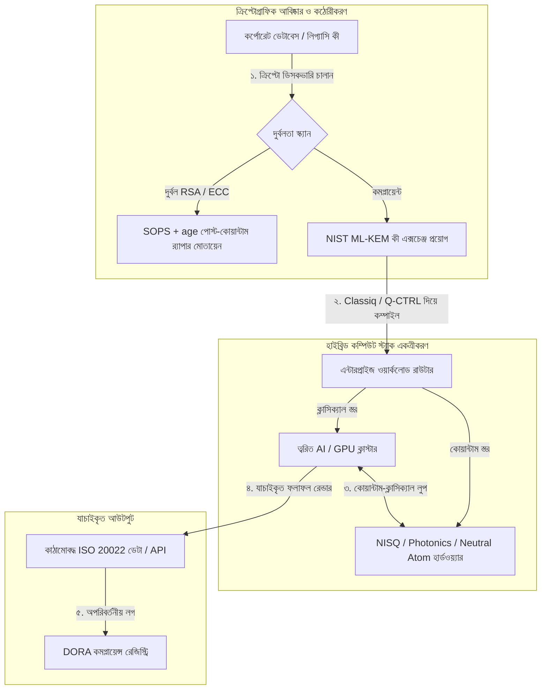

---

# Front Matter (YAML)

author: "contact@sebastienrousseau.com (Sebastien Rousseau)"
banner_alt: "লন্ডনে Economist Impact-এর ৫ম বার্ষিক Commercialising Quantum Global 2026 সম্মেলনের মঞ্চ দৃশ্য — পদার্থবিদ্যা গবেষণা থেকে এন্টারপ্রাইজ-প্রস্তুত ওয়ার্কফ্লোয় কোয়ান্টাম প্রযুক্তির উত্তরণের প্রতীক"
banner_height: "1597"
banner_width: "2584"
banner: "https://cloudcdn.pro/stocks/images/sebastien-rousseau-20260617-5th-commercialising-quantum-2.webp"
cdn: "https://cloudcdn.pro"
charset: "UTF-8"
cname: "sebastienrousseau.com"
copyright: "© Copyright 2025 - 2026 - Sebastien Rousseau. All rights reserved."
date: "June 17, 2026"
description: "Economist Impact-এর ৫ম বার্ষিক Commercialising Quantum Global 2026 সম্মেলন থেকে বোর্ডরুম শিক্ষা — $১.৩B তহবিল উত্থান, no-regrets হাইব্রিড স্ট্যাক, পোস্ট-কোয়ান্টাম ক্রিপ্টোগ্রাফি স্থানান্তরের জরুরিতা, কোয়ান্টাম সেন্সিং বাণিজ্যিকীকরণ ও HSBC-র নির্দেশ: অপেক্ষা একটি বিনাচাপের ভুল।"
format-detection: "telephone=no"
hreflang: "bn"
icon: "https://cloudcdn.pro/clients/sebastienrousseau/v1/logos/sebastienrousseau.svg"
id: "https://sebastienrousseau.com/2026-06-17-economist-commercialising-quantum-summit-2026"
image_alt: "সেবাস্তিয়ান রুসোর সাদা-কালো প্রতিকৃতি"
image_height: "162"
image_width: "162"
image: "https://cloudcdn.pro/stocks/images/sebastien-rousseau.png"
keywords: "Commercialising Quantum Global 2026, Economist Impact সম্মেলন, পোস্ট-কোয়ান্টাম ক্রিপ্টোগ্রাফি, NIST ML-KEM, harvest-now decrypt-later, SNDL, HSBC কোয়ান্টাম, Philip Intallura, কোয়ান্টাম সেন্সিং, GPS-নিরপেক্ষ নেভিগেশন, NQCC, EU Quantum Act, Quantcore, qBIG পুরস্কার, Lord Vallance, হাইব্রিড কোয়ান্টাম-ক্লাসিক্যাল, DORA Article 6"
language: "bn-IN"
last_reviewed: "2026-06-17"
layout: "report"
locale: "bn_IN"
logo_alt: "সেবাস্তিয়ান রুসোর লোগো"
logo_height: "44"
logo_width: "44"
logo: "https://cloudcdn.pro/clients/sebastienrousseau/v1/logos/sebastienrousseau.svg"
menu: ""
measurementID: "G-169G4ET5HQ"
name: "Sebastien Rousseau"
permalink: "https://sebastienrousseau.com/2026-06-17-economist-commercialising-quantum-summit-2026"
rating: "general"
referrer: "no-referrer"
robots: "index, follow"
schema: "FAQPage, Article"
seo_title: "Commercialising Quantum 2026: বোর্ডরুম শিক্ষা"
short_name: "sebastienrousseau"
subtitle: "কোয়ান্টাম অনুমাননির্ভর গবেষণাগারের বিজ্ঞান পেরিয়ে হাইব্রিড এন্টারপ্রাইজ ওয়ার্কফ্লোয় পৌঁছেছে; ২০২৬-এ $১.৩B তহবিল, তাৎক্ষণিক পোস্ট-কোয়ান্টাম স্থানান্তর ও HSBC-র “অপেক্ষা বন্ধ করুন” নির্দেশে বোর্ডরুমকে সাড়া দিতে হবে।"
tags: "কোয়ান্টাম, পোস্ট-কোয়ান্টাম ক্রিপ্টোগ্রাফি, NIST ML-KEM, harvest-now decrypt-later, কোয়ান্টাম সেন্সিং, HSBC, Economist Impact, হাইব্রিড কম্পিউট, DORA, EU Quantum Act, NQCC, সম্মেলন শিক্ষা"
theme-color: "0, 83, 191"
title: "Qubits থেকে মুনাফায়: Economist-এর ৫ম বার্ষিক Commercialising Quantum Global 2026 সম্মেলনের কৌশলগত শিক্ষা"
url: "https://sebastienrousseau.com/2026-06-17-economist-commercialising-quantum-summit-2026"
viewport: "width=device-width, initial-scale=1, shrink-to-fit=no"

# RSS - The RSS feed front matter (YAML).
atom_link: "https://sebastienrousseau.com/2026-06-17-economist-commercialising-quantum-summit-2026/rss.xml"
category: "Technology"
docs: https://validator.w3.org/feed/docs/rss2.html
generator: "Static Site Generator (SSG) (version 0.0.26)"
item_description: "Economist Impact-এর ৫ম বার্ষিক Commercialising Quantum Global 2026 সম্মেলন থেকে বোর্ডরুম শিক্ষা — $১.৩B তহবিল উত্থান, no-regrets হাইব্রিড স্ট্যাক, পোস্ট-কোয়ান্টাম ক্রিপ্টোগ্রাফি স্থানান্তরের জরুরিতা, কোয়ান্টাম সেন্সিং বাণিজ্যিকীকরণ ও HSBC-র নির্দেশ: অপেক্ষা একটি বিনাচাপের ভুল।"
item_guid: "https://sebastienrousseau.com/2026-06-17-economist-commercialising-quantum-summit-2026/rss.xml"
item_link: "https://sebastienrousseau.com/2026-06-17-economist-commercialising-quantum-summit-2026/rss.xml"
item_pub_date: "Wed, 17 Jun 2026 06:06:06 +0000"
item_title: "Qubits থেকে মুনাফায়: Economist-এর ৫ম বার্ষিক Commercialising Quantum Global 2026 সম্মেলনের কৌশলগত শিক্ষা"
last_build_date: "Wed, 17 Jun 2026 06:06:06 +0000"
managing_editor: "contact@sebastienrousseau.com (Sebastien Rousseau)"
pub_date: "Wed, 17 Jun 2026 06:06:06 +0000"
ttl: "60"
type: "article"
webmaster: "contact@sebastienrousseau.com"

# Apple - The Apple front matter (YAML).
apple_mobile_web_app_orientations: "portrait"
apple_touch_icon_sizes: "192x192"
apple-mobile-web-app-capable: "yes"
apple-mobile-web-app-status-bar-inset: "black"
apple-mobile-web-app-status-bar-style: "black-translucent"
apple-mobile-web-app-title: "Commercialising Quantum 2026: বোর্ডরুম শিক্ষা"
apple-touch-fullscreen: "yes"

# MS Application - The MS Application front matter (YAML).

msapplication-navbutton-color: "0, 83, 191"

# Twitter Card - The Twitter Card front matter (YAML).

twitter_card: "summary_large_image"
twitter_creator: "@wwdseb"
twitter_description: "Economist Impact-এর ৫ম বার্ষিক Commercialising Quantum Global 2026 সম্মেলন থেকে বোর্ডরুম শিক্ষা — $১.৩B তহবিল উত্থান, no-regrets হাইব্রিড স্ট্যাক, পোস্ট-কোয়ান্টাম ক্রিপ্টোগ্রাফি স্থানান্তরের জরুরিতা, কোয়ান্টাম সেন্সিং বাণিজ্যিকীকরণ ও HSBC-র নির্দেশ: অপেক্ষা একটি বিনাচাপের ভুল।"
twitter_image: "https://cloudcdn.pro/clients/sebastienrousseau/v1/logos/sebastienrousseau.svg"
twitter_image_alt: "সেবাস্তিয়ান রুসোর লোগো"
twitter_site: "@wwdseb"
twitter_title: "Commercialising Quantum 2026: বোর্ডরুম শিক্ষা"
twitter_url: "https://sebastienrousseau.com/2026-06-17-economist-commercialising-quantum-summit-2026"

excerpt: "Economist Impact-এর ৫ম বার্ষিক Commercialising Quantum Global 2026 সম্মেলন কোয়ান্টামের এন্টারপ্রাইজ ওয়ার্কফ্লোয় পালাবদলকে নিশ্চিত করেছে: পাঁচ মাসে $১.৩B সংগ্রহ, SNDL হার্ভেস্টিংয়ের অধীনে পোস্ট-কোয়ান্টাম ক্রিপ্টোগ্রাফি একটি বোর্ড-স্তরের আর্থিক দায়, কোয়ান্টাম সেন্সিং আজই GPS-নিরপেক্ষ নেভিগেশনের জন্য মোতায়েন হচ্ছে এবং HSBC-র Philip Intallura ঘোষণা করেছেন — fault-tolerant হার্ডওয়্যারের অপেক্ষা একটি বিনাচাপের ভুল।"

# Humans.txt - The Humans.txt front matter (YAML).
author_website: "https://sebastienrousseau.com"
author_twitter: "@wwdseb"
author_location: "London, UK"
thanks: "পড়ার জন্য ধন্যবাদ!"
site_last_updated: "2026-06-17"
site_standards: "HTML5, CSS3, RSS, Atom, JSON, XML, YAML, Markdown, TOML"
site_components: "Kaishi, Kaishi Builder, Kaishi CLI, Kaishi Templates, Kaishi Themes"
site_software: "Static Site Generator, Rust"

---

# Qubits থেকে মুনাফায়: Economist-এর ৫ম বার্ষিক Commercialising Quantum Global 2026 সম্মেলনের কৌশলগত শিক্ষা

এন্টারপ্রাইজ প্রস্তুতি, পোস্ট-কোয়ান্টাম ক্রিপ্টোগ্রাফি স্থানান্তর, হাইব্রিড কম্পিউট স্ট্যাক এবং কোয়ান্টাম সেন্সিং ও নেটওয়ার্কিংয়ের উদীয়মান বাণিজ্যিক চিত্র।

**সংক্ষেপে।** Economist Impact আয়োজিত ৫ম বার্ষিক Commercialising Quantum Global 2026 সম্মেলন, ১৬–১৭ জুন ২০২৬-এ লন্ডনের Business Design Centre-এ অনুষ্ঠিত হয় — এতে এন্টারপ্রাইজ, ফিনান্স, নীতি ও গবেষণা জুড়ে ১,১০০-এর বেশি বৈশ্বিক নেতা অংশ নেন। কেন্দ্রীয় বিষয় একটি স্পষ্ট কাঠামোগত পালাবদল চিহ্নিত করেছে: কোয়ান্টাম প্রযুক্তি অনুমাননির্ভর গবেষণাগার বিজ্ঞান থেকে বাস্তব, হাইব্রিড এন্টারপ্রাইজ ওয়ার্কফ্লোয় উত্তীর্ণ হয়েছে। শুধু ২০২৬-এর প্রথম পাঁচ মাসেই ভেঞ্চার ক্যাপিটাল থেকে $১.৩ বিলিয়ন সংগ্রহ হয়েছে, এবং বোর্ডরুম আলোচনা আর ভৌত qubit গণনায় সীমাবদ্ধ নেই — মনোযোগ এখন "no-regrets" হাইব্রিড কম্পিউট স্ট্যাক প্রতিষ্ঠা, "harvest-now, decrypt-later" (SNDL) ক্রিপ্টোগ্রাফিক হুমকির বিরুদ্ধে ডিজিটাল সম্পদ সুরক্ষা এবং GPS-নিরপেক্ষ নেভিগেশনের জন্য স্বল্পমেয়াদি কোয়ান্টাম সেন্সিং সিস্টেম মোতায়েনে।

## মূল শিক্ষা

- **এন্টারপ্রাইজের ব্যবহারিক ওয়ার্কফ্লোয় পালাবদল।** শিল্প-নেতারা (HorizonX-এর [Steve Suarez](https://www.linkedin.com/in/stevesuarez), HSBC-র [Phil Intallura](https://www.linkedin.com/in/intallura)) জোর দিয়েছেন — কোয়ান্টাম একত্রীকরণ আর পদার্থবিজ্ঞানের সমস্যা নয়, এটি একটি পরিচালন সমস্যা। ব্যাংক ও এন্টারপ্রাইজ এখন প্রতিভা প্রস্তুতি ও সক্রিয় ওয়ার্কলোড অপ্টিমাইজ করতে হাইব্রিড কোয়ান্টাম-ক্লাসিক্যাল পাইলট মোতায়েন করছে।
- **পোস্ট-কোয়ান্টাম ক্রিপ্টোগ্রাফি (PQC) বোর্ডের অগ্রাধিকার।** নিরাপত্তা ও আইন বিশেষজ্ঞ (CMS UK, Microsoft-এর [Joanne Miller](https://www.linkedin.com/in/joanne-miller-nso), EY-এর [Craig Farrell](https://www.linkedin.com/in/craig-farrell)) সতর্ক করেছেন — PQC মোতায়েনের জন্য প্রতিষ্ঠানগুলো fault-tolerant হার্ডওয়্যারের অপেক্ষা করতে পারে না। "Harvest-now, decrypt-later" সংগ্রহ আজই ঘটছে, ফলে NIST ML-KEM মানে স্থানান্তর একটি তাৎক্ষণিক আর্থিক দায়।
- **স্বল্পমেয়াদি মুনাফায় কোয়ান্টাম সেন্সিং সবার আগে।** Fault-tolerant কম্পিউটিং বছর কয়েক দূরে হলেও, কোয়ান্টাম সেন্সিং (Infleqtion-এর [Matthew Kinsella](https://www.linkedin.com/in/matthewkinsella)) দ্রুত স্কেল করছে। কোয়ান্টাম ঘড়ি ও জড়তা সেন্সর GPS-নিরপেক্ষ নেভিগেশন, জাতীয় নিরাপত্তা ও অতি-স্থিতিশীল শক্তি গ্রিডে মোতায়েন হচ্ছে।
- **সার্বভৌমত্ব, ক্লাস্টার ও নীতি জরুরিতা।** যুক্তরাজ্যের বিজ্ঞানমন্ত্রী [Lord Vallance](https://www.linkedin.com/in/patrick-vallance) ও [Lord William Hague](https://www.linkedin.com/in/williamhague) National Quantum Computing Centre (NQCC)-এর সঙ্গে সমন্বিত শিল্প-স্তরের "সুপারক্লাস্টার" গড়ার জাতীয় মিশন রূপরেখা দিয়েছেন। আসন্ন EU Quantum Act সার্বভৌম কম্পিউটিং সক্ষমতার ভূ-রাজনৈতিক তাড়াকে আরও স্পষ্ট করছে।
- **qBIG পুরস্কারে Quantcore জয়ী।** University of Glasgow থেকে স্পিন-আউট Quantcore তাদের নাইওবিয়াম-ভিত্তিক সুপারকন্ডাক্টিং কম্পোনেন্টের জন্য IOP qBIG পুরস্কার জিতেছে — যা প্রচলিত উপাদানের তুলনায় উচ্চতর তাপমাত্রায় কাজ করে, ক্রায়োজেনিক পরিকাঠামোর ওভারহেড উল্লেখযোগ্যভাবে কমায়।

**সংশ্লিষ্ট পাঠ:** [KyberLib এবং ২০২৬-এ পোস্ট-কোয়ান্টাম ব্যাংকিং স্থানান্তর: মানদণ্ড থেকে কোড পর্যন্ত](https://sebastienrousseau.com/2026-06-12-kyberlib-post-quantum-banking-migration-standards-code-2026/), [২০২৬-এর ব্যাংকিং রেজিলিয়েন্স ইনডেক্স: AI, ক্লাউড, কোয়ান্টাম, পেমেন্ট ও তৃতীয় পক্ষের ঘনত্ব ঝুঁকি](https://sebastienrousseau.com/2026-06-08-banking-resilience-index-ai-cloud-quantum-payments-third-party-risk-2026/), [২০২৬-এর ক্লাউড নেটিভ ব্যাংকিং ইনডেক্স: DORA, প্ল্যাটফর্ম ইঞ্জিনিয়ারিং, সার্বভৌম ক্লাউড ও পরিচালন স্থিতিস্থাপকতা](https://sebastienrousseau.com/2026-06-05-cloud-native-banking-index-dora-resilience-platform-engineering-2026/)।

## ০১. কেন ২০২৬ সম্মেলন বোর্ডরুমের জন্য গুরুত্বপূর্ণ

Economist-এর Commercialising Quantum Global সম্মেলনের ২০২৬ সংস্করণ চিহ্নিত করেছে — কর্পোরেট জগৎ এখন কীভাবে গভীর প্রযুক্তি মূল্যায়ন করে, সেখানে একটি স্থায়ী পালাবদল ঘটে গেছে।

ঐতিহাসিকভাবে কোয়ান্টাম কম্পিউটিং R&D বিভাগে এক বহু-দশকের বৈজ্ঞানিক উদ্যোগ হিসেবে রাখা হত। জুন ২০২৬-এ সেই দৃষ্টিভঙ্গি অচল। প্রতিষ্ঠানগুলোকে এখন "পদার্থবিদ্যা-কেন্দ্রিক" কৌতূহল থেকে "ব্যবসা-কেন্দ্রিক" বাস্তবায়নে যেতে হবে। কারণ দুটি:

1. **কোয়ান্টাম-AI অভিসারণ।** High-performance computing (HPC) স্ট্যাক ক্লাসিক্যাল, ত্বরিত AI এবং NISQ (Noisy Intermediate-Scale Quantum) নোডকে একটি একীভূত কম্পিউট লেয়ারে মিশিয়ে দিচ্ছে। যেসব প্রতিষ্ঠান কোয়ান্টাম-প্রস্তুত অ্যাপ্লিকেশন তৈরিতে দেরি করবে, তারা দেখবে কৌশলগত সুবিধা ধরার জানালা প্রত্যাশার চেয়ে দ্রুত বন্ধ হচ্ছে।
2. **ভূ-রাজনৈতিক ও আর্থিক জরুরিতা।** যুক্তরাজ্যের মিশন-চালিত কোয়ান্টাম প্রোগ্রাম ও আসন্ন EU Quantum Act-এর সঙ্গে কোয়ান্টাম সক্ষমতা এখন জাতীয় সার্বভৌমত্ব ও কর্পোরেট ধারাবাহিকতার বিষয়।

আরও গুরুত্বপূর্ণ, পোস্ট-কোয়ান্টাম সাইবার নিরাপত্তা আর কোনো ভবিষ্যৎ কমপ্লায়েন্স প্রয়োজন নয়। প্রতিকূল "store now, decrypt later" (SNDL) আক্রমণের হুমকি মানে — আজ আটক করা কর্পোরেট ডেটা বাণিজ্যিক কোয়ান্টাম সিস্টেম স্কেল করলেই ডিক্রিপ্ট হবে। এতে Digital Operational Resilience Act (DORA)-র মতো বৈশ্বিক পরিচালন স্থিতিস্থাপকতা নির্দেশের অধীনে তাৎক্ষণিক দায় তৈরি হয়।

## ০২. Commercialising Quantum 2026-এর কৌশলগত দৃষ্টিকোণ

এন্টারপ্রাইজ প্রযুক্তি নেতাদের পাঁচটি স্বতন্ত্র পরিচালন স্তর জুড়ে কোয়ান্টাম পরিপক্বতা ম্যাপ করতে হবে, সময়সীমা ও ব্যালেন্স-শিট ঝুঁকি যাচাই করে।

### সারণি ১: Commercialising Quantum 2026 কৌশলগত দৃষ্টিকোণ

| স্তর | কর্পোরেট মনোযোগ | সময়সীমা | মূল কর্পোরেট ঝুঁকি |
| :---- | :---- | :---- | :---- |
| **হার্ডওয়্যার ও কম্পাইলার** | প্রতিযোগী পন্থার মধ্যে নির্বাচন (superconducting, trapped ions, neutral atoms, photonics) | ৩ – ৫ বছর (fault-tolerance) | ব্যর্থ স্থাপত্যে আটকে পড়া বা খুব আগে একটি প্ল্যাটফর্মে বাজি ধরা। |
| **ক্রিপ্টোগ্রাফিক কঠোরীকরণ** | ক্রিপ্টোগ্রাফিক নির্ভরতার আবিষ্কার ও তালিকা; NIST ML-KEM-এ স্থানান্তর | তাৎক্ষণিক (চলমান স্থানান্তর) | DORA ও NIST CSF 2.0-এর অধীনে পদ্ধতিগত ডেটা লঙ্ঘন ও কমপ্লায়েন্স ব্যর্থতা। |
| **কোয়ান্টাম সেন্সিং** | GPS-নিরপেক্ষ নেভিগেশন, অতি-স্থিতিশীল ঘড়ি ও মাধ্যাকর্ষণ-মাপক মোতায়েন | ১ – ২ বছর (তাৎক্ষণিক বাণিজ্যিক) | GPS-জ্যামিংয়ের কারণে লজিস্টিকস, শিপিং ও শক্তি গ্রিডে পরিচালন বিঘ্ন। |
| **সিস্টেম একত্রীকরণ** | কোয়ান্টাম হার্ডওয়্যারকে বিদ্যমান ক্লাসিক্যাল HPC ও সুপারকম্পিউটিং ডেটা সেন্টারের সঙ্গে সংযুক্তিকরণ | ১ – ৩ বছর (হাইব্রিড পর্ব) | উচ্চ লেটেন্সি, ডেটা ট্রান্সফার সংকট ও খণ্ডিত কম্পিউট সাইলো। |
| **এন্টারপ্রাইজ সফটওয়্যার** | উচ্চ-স্তরের বিমূর্তকরণ লেয়ার ও API-র মাধ্যমে কোয়ান্টাম অ্যালগরিদম উন্মোচন (Classiq, Q-CTRL) | তাৎক্ষণিক (দক্ষতা গঠন) | প্রকৃত প্রকৌশল কার্যকর কাজ থেকে প্রতিভা ও ওয়ার্কফ্লো বিচ্ছিন্নতা। |

## ০৩. মূল কোয়ান্টাম সংকেত ও বোর্ডরুম ট্রিগার

কোয়ান্টাম বিনিয়োগের দিকনির্দেশনার জন্য প্রযুক্তি নেতাদের নির্দিষ্ট, পরিমাপযোগ্য বাজার ও নিয়ন্ত্রক সূচক নিরীক্ষণ করতে হবে।

### সারণি ২: মূল কোয়ান্টাম সংকেত ও বোর্ডরুম ট্রিগার

| সংকেত | পরিমাণগত মেট্রিক | নিয়ন্ত্রক / নীতি রেফারেন্স | কার্যকর প্ল্যাটফর্ম অগ্রাধিকার |
| :---- | :---- | :---- | :---- |
| **কোয়ান্টাম তহবিল উত্থান** | ২০২৬-এর প্রথম পাঁচ মাসে বৈশ্বিকভাবে সংগৃহীত $১.৩ বিলিয়ন | Return on Resilience (RoR) | বাজেট অনুমাননির্ভর পাইলট থেকে "no-regrets" হাইব্রিড কোয়ান্টাম-ক্লাসিক্যাল ওয়ার্কলোডে সরান। |
| **ডেটা ডিক্রিপশন উন্মোচন** | পাবলিক চ্যানেলে প্রেরিত ১০০% এনক্রিপ্টেড ডেটা SNDL সংগ্রহের সম্মুখীন | DORA Article 6 (ICT নিরাপত্তা) | এস্টেট জুড়ে দুর্বল RSA/ECC কী চিহ্নিত করতে ক্রিপ্টোগ্রাফিক ডিসকভারি টুল বাস্তবায়ন করুন। |
| **সার্বভৌম পরিকাঠামো** | যুক্তরাজ্যের £২.৫ বিলিয়ন National Quantum Strategy বরাদ্দ | UK Quantum Missions / Lord Vallance | NQCC-এর মতো জাতীয় সুপারক্লাস্টারের সঙ্গে স্থানীয় অংশীদারিত্ব গড়ে তুলুন। |
| **কমপ্লায়েন্স সময়সীমা** | ১৪ নভেম্বর ২০২৬ SWIFT structured-address কাটওভার | SWIFT SR 2026 নির্দেশিকা | কাঠামোবদ্ধ XML নির্দিষ্টীকরণ পূরণে আন্তঃব্যাংক ডেটাবেস পরিষ্কার ও বিন্যস্ত করুন। |

## ০৪. মূল সম্মেলন থিমে গভীর বিশ্লেষণ

### কোয়ান্টাম বিনিয়োগের টিপিং পয়েন্টে পৌঁছেছে

ভেঞ্চার ক্যাপিটাল তহবিলে উল্লেখযোগ্য ত্বরণ এসেছে — শুধু ২০২৬-এর প্রথম পাঁচ মাসেই **$১.৩ বিলিয়ন** সংগৃহীত। আগের বছরগুলোর অনুমাননির্ভর হাইপ চক্রের বিপরীতে, বর্তমান মূলধন ঢেউ বাস্তব, স্বল্পমেয়াদি ওয়ার্কলোড দ্বারা সমর্থিত। Classiq ও IBM Quantum Platform-এর বক্তারা দেখিয়েছেন — সফটওয়্যার বিমূর্তকরণ স্তর ও স্বয়ংক্রিয় কম্পাইলার অ-বিশেষজ্ঞ ডেভেলপার দলকেও আজকের ক্লাসিক্যাল পরিকাঠামোয় হাইব্রিড কোয়ান্টাম-ক্লাসিক্যাল অ্যালগরিদম চালানোর সুযোগ দেয়। এই "no-regrets" কৌশল প্রতিষ্ঠানগুলোকে এখনই কোয়ান্টাম-প্রস্তুত প্রতিভা ও ওয়ার্কফ্লো গড়তে সক্ষম করে।

### "Harvest now, decrypt later" সম্পর্কে আইনি ও নিয়ন্ত্রক সতর্কতা

ডেটা ঝুঁকির তাৎক্ষণিকতা ঘিরে আইন অংশীদার ও সাইবার নিরাপত্তা নির্বাহীরা জোরালো আলোচনা টেনেছেন। স্পনসর আইনি প্রতিষ্ঠান CMS UK ও Microsoft-এর CSO [Joanne Miller](https://www.linkedin.com/in/joanne-miller-nso)-এর প্রতিনিধিরা সিনিয়র ম্যানেজমেন্টকে কঠোর সতর্কতা দিয়েছেন: *পোস্ট-কোয়ান্টাম ক্রিপ্টোগ্রাফি মোতায়েনের আগে fault-tolerant হার্ডওয়্যারের আগমনের অপেক্ষা একটি গুরুতর আর্থিক ব্যর্থতা।*

"Store now, decrypt later" (SNDL) প্যারাডাইমে প্রতিকূল কুশীলবরা আজই এনক্রিপ্টেড কর্পোরেট ডেটা সংগ্রহ করছে — উদ্দেশ্য, ক্রিপ্টোগ্রাফিকভাবে প্রাসঙ্গিক কোয়ান্টাম কম্পিউটার আবির্ভূত হওয়া মাত্রই তা ডিক্রিপ্ট করা। দীর্ঘস্থায়ী সংবেদনশীল ডেটাসেট, মেধাসম্পদ ও ঐতিহাসিক গ্রাহক রেকর্ড সুরক্ষায় প্রতিষ্ঠানগুলোকে এখনই পোস্ট-কোয়ান্টাম রক্ষাব্যবস্থা (যেমন NIST ML-KEM) মোতায়েন করতে হবে।

### "কোয়ান্টাম সেন্সিং" হাইপ পুনর্বিন্যাস

Fault-tolerant কোয়ান্টাম কম্পিউটিং বছর কয়েক দূরে হলেও, সম্মেলন কোয়ান্টাম সেন্সিংকে বাস্তব মোতায়েনের প্রথম সত্যিকার মুনাফাজনক ঢেউ হিসেবে তুলে ধরেছে। Infleqtion-এর চিফ এক্সিকিউটিভ [Matthew Kinsella](https://www.linkedin.com/in/matthewkinsella) বিস্তারিত ব্যাখ্যা করেছেন — কোয়ান্টাম ঘড়ি, জড়তা সেন্সর ও রেডিও-ফ্রিকোয়েন্সি সিস্টেম একাধিক শিল্পে দ্রুত স্কেল করছে।

কারণ এই প্রযুক্তিগুলো উপ-পারমাণবিক নির্ভুলতায় ভৌত ধ্রুবক মাপে, সেগুলো **GPS-নিরপেক্ষ নেভিগেশন**, অতি-স্থিতিশীল শক্তি গ্রিড ও গভীর-মহাকাশ টেলিযোগাযোগ সম্ভব করে। এই প্রয়োগগুলো ক্রমবর্ধমান GPS-জ্যামিং হুমকির সম্মুখীন এভিয়েশন, সামুদ্রিক পরিবহন ও জাতীয় প্রতিরক্ষা ব্যবস্থার জন্য অত্যন্ত প্রাসঙ্গিক।

### বাস্তুতন্ত্র ও ক্লাস্টার সহযোগিতা

যুক্তরাজ্যের কোয়ান্টাম বাস্তুতন্ত্র লন্ডন সম্মেলনকে দেশীয় উদ্ভাবন সুপারক্লাস্টার প্রদর্শনের মঞ্চ হিসেবে ব্যবহার করেছে। National Quantum Computing Centre (NQCC) ও Digital Catapult থেকে সরাসরি আপডেটে দেখানো হয়েছে — কীভাবে প্রাথমিক পর্যায়ের গভীর-প্রযুক্তি স্পিন-আউট কোয়ান্টাম হার্ডওয়্যারকে সরাসরি ক্লাসিক্যাল সুপারকম্পিউটিং ডেটা সেন্টারে যুক্ত করে "প্রযুক্তি বিভাজন" সেতু গড়ছে।

স্কটিশ কোয়ান্টাম স্টার্টআপ Quantcore-এর সহ-প্রতিষ্ঠাতা [Wridhdhisom Karar](https://www.linkedin.com/in/wridhdhisomkarar) কোম্পানির নাইওবিয়াম-ভিত্তিক সুপারকন্ডাক্টিং কম্পোনেন্টের জন্য Institute of Physics (IOP) Quantum Business Innovation and Growth (qBIG) পুরস্কার গ্রহণ করেছেন। এই কম্পোনেন্ট প্রচলিত উপাদানের তুলনায় উচ্চতর তাপমাত্রায় কাজ করে — কোয়ান্টাম প্রসেসর স্কেল করতে প্রয়োজনীয় ক্রায়োজেনিক পরিকাঠামোর ওভারহেড উল্লেখযোগ্যভাবে কমায়।

### HSBC কেস স্টাডি: কেন কোয়ান্টামের জন্য অপেক্ষা একটি "বিনাচাপের ভুল"

Economist-এর ৫ম বার্ষিক Commercialising Quantum Event (2026)-এ [**Philip Intallura, Ph.D.**](https://www.linkedin.com/in/intallura) (HSBC-র Global Head of Quantum Technologies, UK Government Advisor ও Board Advisor)-এর অন্তর্দৃষ্টি একটি জোরালো বোর্ডরুম নির্দেশ দিয়েছে: *"শুরু করার আগে fault-tolerant কোয়ান্টামের অপেক্ষা একটি বিনাচাপের ভুল।"*

ড. Intallura যুক্তি দিয়েছেন — আর্থিক প্রতিষ্ঠানগুলোর সাধারণ "অপেক্ষা ও দেখা" পদ্ধতি তিনটি ভুল ধারণার ওপর গড়া আত্মঘাতী গোল:

- **স্বল্পমেয়াদি ROI বাস্তব।** অভিজ্ঞতালব্ধ পরীক্ষায় HSBC বর্তমানে প্রোডাকশনে চলা মডেলগুলোকে ছাড়িয়ে গেছে, কোয়ান্টাম কাজকে ব্যবসার অন্যান্য অংশের সঙ্গে যুক্ত করেছে, কিছু বৃহত্তম গ্রাহকের সঙ্গে সম্পর্ক গভীর করতে কোয়ান্টাম ব্যবহার করেছে এবং **HSBC Innovation Banking**-এ উল্লেখযোগ্য নতুন ব্যবসা টেনে এনেছে।
- **কোয়ান্টাম একটি খাড়া গ্রহণ-বক্ররেখা।** কঠোরভাবে নিয়ন্ত্রিত প্রতিষ্ঠানের ভেতরে সক্ষমতা গড়া, কৌশল নির্ধারণ, তহবিল সংগ্রহ ও পরীক্ষার চক্র চালানো কোনো ছোট কাজ নয়। প্রযুক্তির জন্য প্রক্রিয়াগুলোকে পদ্ধতিগতভাবে পরীক্ষা ও অভিযোজন করতে হবে।
- **কোয়ান্টাম একটি বাস্তুতন্ত্র।** কোনো একক খেলোয়াড় একা সেখানে পৌঁছাতে পারে না। HSBC যত গবেষণাপত্র, POC ও পাইলট চালিয়েছে, প্রতিটি একটি কোয়ান্টাম প্রদানকারীর সঙ্গে নিবিড় সহযোগিতায় — কিছু ক্ষেত্রে সহযোগিতা একাডেমিয়া, নিয়ন্ত্রক ও সরকার পর্যন্ত বিস্তৃত।

**সমাপনী বোর্ডরুম নির্দেশ:** *"Fault tolerance-এর প্রথম দিনে আপনার যে সক্ষমতা লাগবে, সেটা এখনই গড়ে তোলা সক্ষমতা।"*

## ০৫. কর্পোরেট কোয়ান্টাম একত্রীকরণ ও ক্রিপ্টোগ্রাফি পাইপলাইন

ডিজিটাল সম্পদ সুরক্ষিত করে কোয়ান্টাম প্রস্তুতি গড়তে এন্টারপ্রাইজকে একটি স্পষ্ট একত্রীকরণ পাইপলাইন প্রতিষ্ঠা করতে হবে।

## ০৬. বোর্ডরুম প্লেবুক: কার্যকর নির্দেশ

Commercialising Quantum Global 2026 সম্মেলনের অন্তর্দৃষ্টি তাৎক্ষণিক ব্যবসায়িক মূল্যে রূপান্তর করতে সিনিয়র ম্যানেজমেন্টকে নিম্নলিখিত চার-ধাপের বোর্ডরুম প্লেবুক কার্যকর করতে হবে:

1. **ক্রিপ্টোগ্রাফিক আবিষ্কার বাধ্যতামূলক করুন।** Chief Information Security Officer (CISO)-কে নির্দেশ দিন এন্টারপ্রাইজ জুড়ে প্রতিটি লিগ্যাসি RSA ও ECC কী ম্যাপ করে সমস্ত ক্রিপ্টোগ্রাফিক সম্পদের তালিকা তৈরি করতে — পোস্ট-কোয়ান্টাম স্থানান্তরের প্রস্তুতিতে।
2. **"No-regrets" হাইব্রিড কৌশল মোতায়েন করুন।** পরিপূর্ণ হার্ডওয়্যারের অপেক্ষা করবেন না। কোয়ান্টাম-অনুপ্রাণিত সফটওয়্যার ও হাইব্রিড ক্লাসিক্যাল-কোয়ান্টাম পাইলটে বিনিয়োগ করুন — অভ্যন্তরীণ প্রতিভা গড়ুন এবং আজই জটিল লজিস্টিকস বা ঝুঁকি পোর্টফোলিও অপ্টিমাইজ করুন।
3. **লজিস্টিকসের জন্য কোয়ান্টাম সেন্সিং মূল্যায়ন করুন।** আপনার প্রতিষ্ঠান যদি বৈশ্বিক সরবরাহ শৃঙ্খল, শিপিং বা গুরুত্বপূর্ণ পরিকাঠামোর উপর নির্ভরশীল হয়, ভূ-রাজনৈতিক বিঘ্ন ঝুঁকি প্রশমনে সক্রিয়ভাবে কোয়ান্টাম সেন্সিং সিস্টেম (যেমন GPS-নিরপেক্ষ নেভিগেশন) মূল্যায়ন করুন।
4. **৩০ জুনের Insight Hour-এর জন্য নিবন্ধন করুন।** আপনার প্রযুক্তি নেতারা যেন ৩০ জুন ২০২৬, বিকাল ৩:০০ BST-তে ভার্চুয়াল **Commercialising Quantum Global Insight Hour** (IonQ-সমর্থিত)-এ নিবন্ধন করেন — এন্টারপ্রাইজ ঝুঁকি ব্যবস্থাপনা ও প্রতিভা বরাদ্দ কৌশল ট্র্যাক করা চালিয়ে যেতে।

## ০৭. প্রায়শই জিজ্ঞাসিত প্রশ্ন

**"Harvest now, decrypt later" (SNDL) কী, এবং আজ কেন এটি গুরুত্বপূর্ণ?**
SNDL হল আজ এনক্রিপ্টেড ডেটা আটক ও সংরক্ষণের অনুশীলন — উদ্দেশ্য, ক্রিপ্টোগ্রাফিকভাবে প্রাসঙ্গিক কোয়ান্টাম কম্পিউটার উপলব্ধ হলে পরে তা ডিক্রিপ্ট করা। দীর্ঘস্থায়ী সংবেদনশীল ডেটাসেট — মেধাসম্পদ, গ্রাহক রেকর্ড, সরকারি যোগাযোগ — ইতিমধ্যেই লক্ষ্যবস্তু। NIST ML-KEM-এ স্থানান্তর একটি আর্থিক সিদ্ধান্ত — বোর্ড যা মুলতবি রাখতে পারে না।

**কেন কম্পিউটিংয়ের বদলে কোয়ান্টাম সেন্সিং প্রথম বাণিজ্যিক ঢেউ?**
কোয়ান্টাম সেন্সর উপ-পারমাণবিক নির্ভুলতায় ভৌত ধ্রুবক মাপে এবং কোয়ান্টাম কম্পিউটিংয়ের মতো fault-tolerant হার্ডওয়্যার দরকার হয় না। কোয়ান্টাম ঘড়ি, মাধ্যাকর্ষণ-মাপক ও জড়তা সেন্সর ইতিমধ্যেই GPS-নিরপেক্ষ নেভিগেশন, অতি-স্থিতিশীল শক্তি গ্রিড ও গভীর-মহাকাশ যোগাযোগের জন্য পাইলট মোতায়েনে রয়েছে।

**HSBC-র কোয়ান্টাম কাজ কি কেবল R&D, না পরিমাপযোগ্য রিটার্ন এনেছে?**
সম্মেলনে Philip Intallura-র বক্তব্য অনুযায়ী HSBC বর্তমানে প্রোডাকশনে চলা মডেলগুলোকে ছাড়িয়ে গেছে, কোয়ান্টাম ব্যবহার করে বৃহত্তম গ্রাহকদের সঙ্গে সম্পর্ক গভীর করেছে এবং HSBC Innovation Banking-এ উল্লেখযোগ্য নতুন ব্যবসা টেনে এনেছে। কাজটি গবেষণা থেকে পরিচালন একত্রীকরণে চলে এসেছে।

## ০৮. তথ্যসূত্র

- **Economist Impact, (2026).** *5th Annual Commercialising Quantum Global 2026.* সরাসরি সম্মেলন কার্যবিবরণী, ১৬–১৭ জুন ২০২৬। লন্ডন: Business Design Centre. উপলব্ধ: [Economist Impact](https://events.economist.com/commercialising-quantum/)।
- **National Institute of Standards and Technology (NIST), (2024).** *First Three Finalized Post-Quantum Encryption Standards (FIPS 203, 204, and 205).* গেইথার্সবার্গ: U.S. Department of Commerce. উপলব্ধ: [NIST Standards](https://www.nist.gov/news-events/news/2024/08/nist-releases-first-3-finalized-post-quantum-encryption-standards)।
- **European Parliament and Council of the European Union, (2022).** *Regulation (EU) 2022/2554 on digital operational resilience for the financial sector (DORA).* ব্রাসেলস: Official Journal of the European Union. উপলব্ধ: [DORA Regulation](https://eur-lex.europa.eu/legal-content/EN/TXT/?uri=CELEX%3A32022R2554)।
- **SWIFT, (2024).** *ISO 20022 November 2026 Structured Address Milestone.* La Hulpe: SWIFT. উপলব্ধ: [SWIFT ISO 20022 milestone](https://www.swift.com/standards/iso-20022/iso-20022-bytes/call-action-november-2026)।
