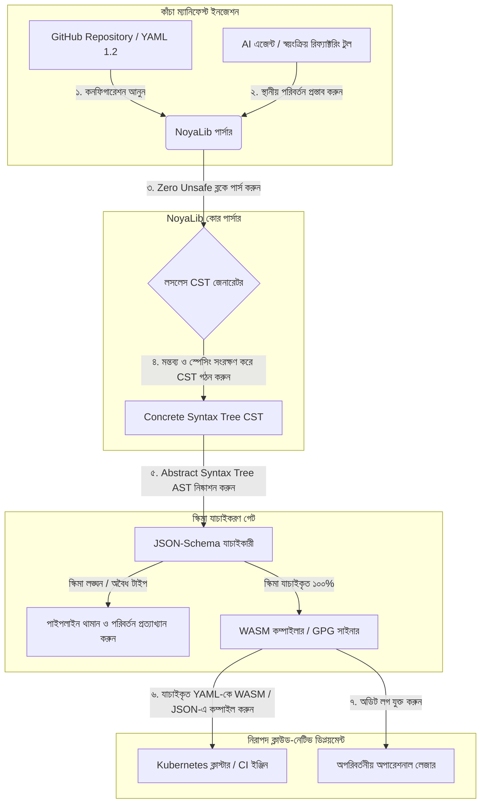

---

# Front Matter (YAML)

author: "contact@sebastienrousseau.com (Sebastien Rousseau)"
banner_alt: "নাটকীয় আলোয় স্থাপত্য জ্যামিতি — CI, Kubernetes, MCP ও আর্থিক-সেবা কনফিগারেশনের নিচে NoyaLib-এর ভার-বহনকারী নিরাপদ Rust YAML পার্সার ভূমিকার প্রতীক"
banner_height: "1597"
banner_width: "2584"
banner: "https://cloudcdn.pro/stocks/images/ken-cheung-KonWFWUaAuk.webp"
cdn: "https://cloudcdn.pro"
charset: "UTF-8"
cname: "sebastienrousseau.com"
copyright: "© Copyright 2025 - 2026 - Sebastien Rousseau. All rights reserved."
date: "June 18, 2026"
description: "NoyaLib — zero-unsafe Rust YAML 1.2 পার্সার; ৪০৬/৪০৬ স্পেক কমপ্লায়েন্স, JSON-Schema যাচাই, লসলেস CST ও আর্থিক পরিকাঠামোর জন্য MCP/WASM বাইন্ডিং।"
format-detection: "telephone=no"
hreflang: "bn"
icon: "https://cloudcdn.pro/clients/sebastienrousseau/v1/logos/sebastienrousseau.svg"
id: "https://sebastienrousseau.com/2026-06-18-noyalib-safe-yaml-rust-ai-mcp-financial-infrastructure-2026"
image_alt: "সেবাস্তিয়ান রুসোর সাদা-কালো প্রতিকৃতি"
image_height: "162"
image_width: "162"
image: "https://cloudcdn.pro/stocks/images/sebastienrousseau.webp"
keywords: "নিরাপদ Rust YAML পার্সার, NoyaLib, YAML 1.2 স্পেক কমপ্লায়েন্স, zero-unsafe Rust, JSON-Schema যাচাই, লসলেস Concrete Syntax Tree, CST, MCP, Model Context Protocol, WebAssembly, Kubernetes ম্যানিফেস্ট, CI/CD কনফিগারেশন, DORA Article 5, BCBS 239, Basel III পরিচালন ঝুঁকি, আর্থিক পরিকাঠামো, কনফিগারেশন নিরাপত্তা, সফটওয়্যার সরবরাহ শৃঙ্খল"
language: "bn-IN"
last_reviewed: "2026-06-18"
layout: "report"
locale: "bn_IN"
logo_alt: "সেবাস্তিয়ান রুসোর লোগো"
logo_height: "44"
logo_width: "44"
logo: "https://cloudcdn.pro/clients/sebastienrousseau/v1/logos/sebastienrousseau.svg"
menu: ""
measurementID: "G-169G4ET5HQ"
name: "Sebastien Rousseau"
permalink: "https://sebastienrousseau.com/2026-06-18-noyalib-safe-yaml-rust-ai-mcp-financial-infrastructure-2026"
rating: "general"
referrer: "no-referrer"
robots: "index, follow"
schema: "FAQPage, Article"
seo_title: "AI, MCP ও ফিনান্সের জন্য নিরাপদ Rust YAML পার্সার"
short_name: "sebastienrousseau"
subtitle: "একটি নিরাপদ Rust YAML স্ট্যাক — NoyaLib — YAML 1.2-কে সুবিধাজনক মার্কআপ থেকে AI এজেন্ট, MCP, Kubernetes ও আর্থিক-সেবা পরিকাঠামোর জন্য ক্রিপ্টোগ্রাফিকভাবে নিরাপদ, স্পেক-কমপ্লায়েন্ট কনফিগারেশন কন্ট্রোল প্লেনে রূপান্তরিত করে।"
tags: "নিরাপদ Rust YAML পার্সার, NoyaLib, YAML 1.2, zero-unsafe Rust, JSON-Schema, MCP, WebAssembly, Kubernetes, DORA, BCBS 239, Basel III, আর্থিক পরিকাঠামো, সরবরাহ শৃঙ্খল নিরাপত্তা"
theme-color: "0, 83, 191"
title: "২০২৬-এ AI, MCP ও আর্থিক পরিকাঠামোর জন্য YAML-এর কেন একটি নিরাপদ Rust স্ট্যাক প্রয়োজন"
url: "https://sebastienrousseau.com/2026-06-18-noyalib-safe-yaml-rust-ai-mcp-financial-infrastructure-2026"
viewport: "width=device-width, initial-scale=1, shrink-to-fit=no"

# RSS - The RSS feed front matter (YAML).
atom_link: "https://sebastienrousseau.com/2026-06-18-noyalib-safe-yaml-rust-ai-mcp-financial-infrastructure-2026/rss.xml"
category: "Technology"
docs: https://validator.w3.org/feed/docs/rss2.html
generator: "Static Site Generator (SSG) (version 0.0.26)"
item_description: "NoyaLib — zero-unsafe Rust YAML 1.2 পার্সার; ৪০৬/৪০৬ স্পেক কমপ্লায়েন্স, JSON-Schema যাচাই, লসলেস CST ও আর্থিক পরিকাঠামোর জন্য MCP/WASM বাইন্ডিং।"
item_guid: "https://sebastienrousseau.com/2026-06-18-noyalib-safe-yaml-rust-ai-mcp-financial-infrastructure-2026/rss.xml"
item_link: "https://sebastienrousseau.com/2026-06-18-noyalib-safe-yaml-rust-ai-mcp-financial-infrastructure-2026/rss.xml"
item_pub_date: "Thu, 18 Jun 2026 06:06:06 +0000"
item_title: "২০২৬-এ AI, MCP ও আর্থিক পরিকাঠামোর জন্য YAML-এর কেন একটি নিরাপদ Rust স্ট্যাক প্রয়োজন"
last_build_date: "Thu, 18 Jun 2026 06:06:06 +0000"
managing_editor: "contact@sebastienrousseau.com (Sebastien Rousseau)"
pub_date: "Thu, 18 Jun 2026 06:06:06 +0000"
ttl: "60"
type: "article"
webmaster: "contact@sebastienrousseau.com"

# Apple - The Apple front matter (YAML).
apple_mobile_web_app_orientations: "portrait"
apple_touch_icon_sizes: "192x192"
apple-mobile-web-app-capable: "yes"
apple-mobile-web-app-status-bar-inset: "black"
apple-mobile-web-app-status-bar-style: "black-translucent"
apple-mobile-web-app-title: "AI, MCP ও ফিনান্সের জন্য নিরাপদ Rust YAML পার্সার"
apple-touch-fullscreen: "yes"

# MS Application - The MS Application front matter (YAML).

msapplication-navbutton-color: "0, 83, 191"

# Twitter Card - The Twitter Card front matter (YAML).

twitter_card: "summary_large_image"
twitter_creator: "@wwdseb"
twitter_description: "NoyaLib — zero-unsafe Rust YAML 1.2 পার্সার; ৪০৬/৪০৬ স্পেক কমপ্লায়েন্স, JSON-Schema যাচাই, লসলেস CST ও আর্থিক পরিকাঠামোর জন্য MCP/WASM বাইন্ডিং।"
twitter_image: "https://cloudcdn.pro/clients/sebastienrousseau/v1/logos/sebastienrousseau.svg"
twitter_image_alt: "সেবাস্তিয়ান রুসোর লোগো"
twitter_site: "@wwdseb"
twitter_title: "AI, MCP ও ফিনান্সের জন্য নিরাপদ Rust YAML পার্সার"
twitter_url: "https://sebastienrousseau.com/2026-06-18-noyalib-safe-yaml-rust-ai-mcp-financial-infrastructure-2026"

excerpt: "NoyaLib একটি নিরাপদ Rust YAML স্ট্যাক — zero unsafe ব্লক, ৪০৬/৪০৬ YAML 1.2 স্পেক কমপ্লায়েন্স, লসলেস Concrete Syntax Tree, JSON-Schema (Draft 2020-12) যাচাই ও MCP/WASM বাইন্ডিং — AI এজেন্ট, Kubernetes, CI/CD এবং আর্থিক পরিকাঠামোর পেছনের কনফিগারেশন কন্ট্রোল প্লেনের জন্য প্রকৌশলিতভাবে নির্মিত।"

# Humans.txt - The Humans.txt front matter (YAML).
author_website: "https://sebastienrousseau.com"
author_twitter: "@wwdseb"
author_location: "London, UK"
thanks: "পড়ার জন্য ধন্যবাদ!"
site_last_updated: "2026-06-18"
site_standards: "HTML5, CSS3, RSS, Atom, JSON, XML, YAML, Markdown, TOML"
site_components: "Kaishi, Kaishi Builder, Kaishi CLI, Kaishi Templates, Kaishi Themes"
site_software: "Static Site Generator, Rust"

---

# ২০২৬-এ AI, MCP ও আর্থিক পরিকাঠামোর জন্য YAML-এর কেন একটি নিরাপদ Rust স্ট্যাক প্রয়োজন

একটি নিরাপদ Rust YAML স্ট্যাক গুরুত্বপূর্ণ, কারণ YAML এখন CI/CD পাইপলাইন, Kubernetes ম্যানিফেস্ট, [Open Policy Agent](https://www.openpolicyagent.org/) নিয়ম ও Model Context Protocol (MCP) টুল রেজিস্ট্রি বহন করছে — এবং একটিমাত্র অস্পষ্ট পার্স একটি ক্লিয়ারিং সিস্টেম ভেঙে দিতে পারে, একটি সিকিউরিটি গ্রুপ ভুলভাবে কনফিগার করতে পারে, বা স্থানীয় AI এজেন্টকে ভুল অনুমতি হস্তান্তর করতে পারে। [NoyaLib](https://github.com/sebastienrousseau/noyalib) হল একটি pure-Rust, zero-unsafe [YAML 1.2](https://yaml.org/spec/1.2.2/) পার্সিং ও যাচাইকরণ ইকোসিস্টেম — যাতে সেই পরিকাঠামো ডিফল্টরূপে নিরাপদ হয়।

## দ্রুত উত্তর

**এক বাক্যে NoyaLib কী?** NoyaLib একটি ওপেন-সোর্স, pure-Rust YAML 1.2 পার্সার ও যাচাইকরণ ইকোসিস্টেম — zero `unsafe` কোড, অফিসিয়াল ৪০৬-টেস্ট YAML স্যুটে ১০০% স্পেক কমপ্লায়েন্স, একটি লসলেস Concrete Syntax Tree এবং রিয়েল-টাইম [JSON Schema](https://json-schema.org/) যাচাইসহ — AI এজেন্ট, MCP, Kubernetes ও আর্থিক-পরিকাঠামো কনফিগারেশনকে ডিফল্টরূপে নিরাপদ করতে নির্মিত।

## এক্সিকিউটিভ সারাংশ

YAML বিনয়ী মনে হয় — যতক্ষণ না একটি অস্পষ্ট পার্স বা স্কিমা লঙ্ঘন একটি বহু-বিলিয়ন-ডলারের প্রোডাকশন ক্লিয়ারিং সিস্টেম ভেঙে দেয়। ২০২৬-এ YAML হল [CI/CD](https://docs.github.com/en/actions/learn-github-actions/workflow-syntax-for-github-actions) পাইপলাইন, [Kubernetes](https://kubernetes.io/docs/concepts/configuration/overview/) ম্যানিফেস্ট, [Open Policy Agent](https://www.openpolicyagent.org/) নিয়ম ও Model Context Protocol (MCP) টুল রেজিস্ট্রির ডি-ফ্যাক্টো মান। অস্বচ্ছ লিগ্যাসি পার্সার — মেমোরি দুর্বলতা ও ধ্বংসাত্মক পার্সিংসহ — একটি অগ্রহণযোগ্য নিরাপত্তা ঝুঁকি। NoyaLib একটি pure-Rust, zero-unsafe YAML 1.2 ইকোসিস্টেম: ১০০% স্পেক কমপ্লায়েন্স ৪০৬টি অফিসিয়াল স্যুট টেস্ট জুড়ে, একটি লসলেস Concrete Syntax Tree (CST) যা মন্তব্য ও স্পেসিং সংরক্ষণ করে এবং অন্তর্নির্মিত JSON-Schema যাচাইকরণ। ফলাফল: YAML একটি অডিটযোগ্য, নিরাপদ ও এজেন্ট-অ্যাক্সেসিবল কনফিগারেশন কন্ট্রোল প্লেন হিসেবে পুনর্গঠিত।

## মূল শিক্ষা

- **কনফিগারেশনই প্রোডাকশন কোড।** একটিমাত্র বিকৃত YAML ফাইল ক্লাউড-নেটিভ সিকিউরিটি গ্রুপ বা AI-এজেন্টের অনুমতিকে ভুলভাবে কনফিগার করতে পারে। NoyaLib YAML-কে গুরুত্বপূর্ণ পরিকাঠামো হিসেবে বিবেচনা করে।
- **Zero-unsafe ডিজাইন।** সম্পূর্ণরূপে নিরাপদ Rust-এ নির্মিত, zero `unsafe` ব্লক — NoyaLib কোর পার্সিং স্তরে মেমোরি-নিরাপত্তা দুর্বলতা (buffer overflow, রিমোট কোড এক্সিকিউশন) দূর করে।
- **পরম ৪০৬/৪০৬ স্পেক কমপ্লায়েন্স।** কনফিগারেশন কাঠামোকে গাণিতিকভাবে যাচাই করে, পার্সিং অসামঞ্জস্য ও স্টেজিং-প্রোডাকশন কাঠামোগত ড্রিফট দূর করে।
- **লসলেস Concrete Syntax Tree।** লিগ্যাসি পার্সার মন্তব্য ও ফরম্যাটিং ফেলে দেয়; NoyaLib স্পেসিং ও টীকা সংরক্ষণ করে — AI এজেন্ট দ্বারা নিরাপদ, রাউন্ড-ট্রিপ স্বয়ংক্রিয় রিফ্যাক্টরিং সম্ভব করে।
- **বোর্ড-স্তরের আর্থিক মূল্য।** কনফিগারেশন সততাকে [DORA Article 5](https://eur-lex.europa.eu/legal-content/EN/TXT/?uri=CELEX%3A32022R2554) ও [Basel III](https://www.bis.org/bcbs/publ/d424.htm) পরিচালন-ঝুঁকি মূলধন মেট্রিকের সঙ্গে সংযুক্ত করে — সরাসরি সিনিয়র ম্যানেজমেন্টকে ব্যক্তিগত দায় থেকে রক্ষা করে।

**সংশ্লিষ্ট পাঠ:** [KyberLib এবং ২০২৬-এ পোস্ট-কোয়ান্টাম ব্যাংকিং স্থানান্তর: মানদণ্ড থেকে কোড পর্যন্ত](https://sebastienrousseau.com/2026-06-12-kyberlib-post-quantum-banking-migration-standards-code-2026/), [২০২৬-এর ক্লাউড নেটিভ ব্যাংকিং ইনডেক্স: DORA, প্ল্যাটফর্ম ইঞ্জিনিয়ারিং, সার্বভৌম ক্লাউড ও পরিচালন স্থিতিস্থাপকতা](https://sebastienrousseau.com/2026-06-05-cloud-native-banking-index-dora-resilience-platform-engineering-2026/), [২০২৬-এ AI-সচেতন Dotfiles: MCP, SLSA ও মাল্টি-শেল প্যারিটির জন্য নিরাপদ, পুনরুৎপাদনযোগ্য ডেভেলপার ওয়ার্কস্টেশন গঠন](https://sebastienrousseau.com/2026-06-16-ai-aware-dotfiles-secure-reproducible-workstation-2026/)।

## ০১. কেন ২০২৬-এ একটি নিরাপদ Rust YAML স্ট্যাক গুরুত্বপূর্ণ

জুন ২০২৬-এ এন্টারপ্রাইজ আইটি পরিকাঠামো অতি-বিতরণিত ও ক্রমবর্ধমানভাবে স্বয়ংক্রিয়।

YAML নীরবে গোটা সফটওয়্যার-ইঞ্জিনিয়ারিং স্ট্যাকের ভার-বহনকারী কনফিগারেশন ভাষায় পরিণত হয়েছে। এটি বহন করে সেই continuous-integration (CI) ওয়ার্কফ্লো যা প্রোডাকশন আর্টিফ্যাক্ট কম্পাইল করে, [Kubernetes](https://kubernetes.io/docs/concepts/overview/) ম্যানিফেস্ট যা বৈশ্বিক ক্লাউড-নেটিভ ক্লাস্টার অর্কেস্ট্রেট করে এবং [Model Context Protocol](https://modelcontextprotocol.io/) (MCP) সার্ভার স্কিমা যা স্থানীয় AI এজেন্টকে স্থানীয় অপারেশন চালানোর অনুমতি দেয়।

লিগ্যাসি YAML পার্সার — [PyYAML](https://pyyaml.org/), [yaml-cpp](https://github.com/jbeder/yaml-cpp), [libyaml](https://github.com/yaml/libyaml) — দুটি কাঠামোগত ঝুঁকি বহন করে:

1. **টাইপ-কোয়ার্সন দুর্বলতা ("Norway সমস্যা")।** লিগ্যাসি পার্সার প্রায়ই উদ্ধৃত-নয় এমন স্ট্রিংকে কোয়ার্স করে (দেশের কোড `NO`-কে boolean `false`-এ, `yes`/`no` একইভাবে) — দেখুন [YAML 1.1 vs 1.2 boolean tag](https://yaml.org/type/bool.html) — যা গুরুত্বপূর্ণ সিস্টেম ব্যর্থতা বা নীরব নিরাপত্তা মিসকনফিগারেশন ঘটায়।
2. **মেমোরি-নিরাপত্তা শোষণ।** C/C++-এ লেখা অস্বচ্ছ পার্সার মেমোরি-লিক ও বাফার-ওভারফ্লো শোষণের শিকার — যা কোর বিল্ড সার্ভারে রিমোট কোড এক্সিকিউশন (RCE) ঘটাতে পারে।

[NoyaLib](https://github.com/sebastienrousseau/noyalib) এই চ্যালেঞ্জগুলো সমাধান করে। এটি একটি pure-Rust, zero-unsafe YAML 1.2 পার্সিং ও যাচাইকরণ ইকোসিস্টেম। পরম ৪০৬/৪০৬ স্পেক কমপ্লায়েন্স অর্জন ও পার্সের সময় সরাসরি কঠোর JSON-Schema যাচাইকরণ প্রয়োগের মাধ্যমে NoyaLib একটি উচ্চ **Return on Resilience (RoR)** প্রদান করে — কনফিগারেশন-জনিত ডাউনটাইম প্রতিরোধ ও আর্থিক-গ্রেড সফটওয়্যার সরবরাহ শৃঙ্খল সুরক্ষা।

## ০২. NoyaLib ২০২৬ আর্কিটেকচার দৃষ্টিকোণ

NoyaLib ইকোসিস্টেম একটি নিরাপদ, লসলেস কনফিগারেশন পার্সার হিসেবে কাজ করে। প্রতিটি স্থানীয় ও ক্লাউড ম্যানিফেস্ট সর্বনিম্ন এক্সিকিউশন স্তরে কাঠামোগতভাবে যাচাই ও সুরক্ষিত হয়।

### সারণি ১: NoyaLib আর্কিটেকচার স্তর ও ঝুঁকি প্রশমন

| স্তর | ডিজাইন সিদ্ধান্ত | কেন গুরুত্বপূর্ণ | অপব্যবস্থাপনার ঝুঁকি |
| ---- | ---- | ---- | ---- |
| **পার্সার স্তর** | YAML 1.2-কমপ্লায়েন্ট, pure-Rust পার্সার, zero `unsafe` ব্লক | সর্বনিম্ন এক্সিকিউশন স্তরে মেমোরি-নিরাপত্তা দুর্বলতা ও বাফার ওভারফ্লো দূর করে। | কোর বিল্ড সার্ভারে রিমোট কোড এক্সিকিউশন (RCE)। |
| **কনফরম্যান্স স্তর** | অফিসিয়াল YAML 1.2 স্যুটে ৪০৬/৪০৬ টেস্ট জুড়ে ১০০% কমপ্লায়েন্স | পার্সিং অসামঞ্জস্য ও স্টেজিং-প্রোডাকশন টাইপ-কোয়ার্সন ড্রিফট দূর করে। | নিরাপত্তা গ্রুপ অক্ষমকারী "Norway সমস্যা" টাইপ-কোয়ার্সন ত্রুটি। |
| **সিনট্যাক্স-ট্রি স্তর** | লসলেস Concrete Syntax Tree (CST) | রাউন্ড-ট্রিপ পার্সিং ও প্রোগ্রাম্যাটিক রিফ্যাক্টরিংয়ে মন্তব্য, স্পেসিং ও ক্রম সংরক্ষণ করে। | স্বয়ংক্রিয় AI রিফ্যাক্টরিং ডেভেলপার টীকা ধ্বংস করছে। |
| **যাচাইকরণ স্তর** | পার্সিংয়ের সময় [JSON Schema (Draft 2020-12)](https://json-schema.org/draft/2020-12/release-notes) যাচাইকরণ | প্রোডাকশন ক্লাস্টারে পৌঁছানোর আগে কনফিগারেশন ফাইলের ওপর কঠোর ডেটা মডেল প্রয়োগ করে। | বিকৃত কনফিগারেশন ফাইল ক্লাউড-নেটিভ ক্লাস্টার ক্র্যাশ ঘটাচ্ছে। |
| **ইন্টারফেস স্তর** | WebAssembly (WASM) ও MCP বাইন্ডিং | ব্রাউজার, এজ নোড ও স্থানীয় এজেন্ট টুলকিটের ভেতরেই কনফিগারেশন যাচাইকরণ চালাতে দেয়। | এজ ডিভাইসে যাচাইকরণ চালাতে না পারার টুলিং সাইলো। |

## ০৩. মূল ওয়ার্কস্টেশন ও কনফিগারেশন নিরাপত্তা সংকেত

ডেভেলপমেন্ট ও অপারেশন এস্টেট জুড়ে পরম নিরাপত্তা বজায় রাখতে Chief Information Security Officer (CISO)-দের নির্দিষ্ট, পরিমাপযোগ্য মেট্রিক নিরীক্ষণ করতে হবে।

### সারণি ২: ওয়ার্কস্টেশন ও কনফিগারেশন নিরাপত্তা সংকেত

| সংকেত | মেট্রিক / পরিচালন মানদণ্ড | NIST CSF / DORA রেফারেন্স | প্রযুক্তিগত প্ল্যাটফর্ম বাস্তবায়ন |
| ---- | ---- | ---- | ---- |
| **পার্সার কনফরম্যান্স** | অফিসিয়াল YAML 1.2 টেস্ট স্যুটে ১০০% পাস হার (৪০৬/৪০৬ টেস্ট)। | [DORA Article 6](https://eur-lex.europa.eu/legal-content/EN/TXT/?uri=CELEX%3A32022R2554) (ICT নিরাপত্তা) | CI এক্সিকিউশনের আগে সমস্ত ম্যানিফেস্ট যাচাই করে NoyaLib পার্সার কোর। |
| **মেমোরি নিরাপত্তা প্রোফাইল** | পার্সার ও সিরিয়ালাইজার নির্ভরতার ভেতরে zero `unsafe` Rust ব্লক। | DORA Article 30 (সরবরাহ শৃঙ্খল) | cargo বিল্ডে স্বয়ংক্রিয় কম্পাইলার চেক ([`forbid(unsafe_code)`](https://doc.rust-lang.org/reference/attributes/diagnostics.html#the-forbid-attribute))। |
| **স্কিমা যাচাইকরণ** | পার্স করা কনফিগারেশন ফাইলের ১০০% বৈধ [JSON Schema](https://json-schema.org/) মডেলের বিপরীতে যাচাই। | [NIST CSF 2.0](https://www.nist.gov/cyberframework) (PR.DS-01) | স্কিমা লঙ্ঘনে বিল্ড পাইপলাইন থামিয়ে রিয়েল-টাইম যাচাই গেট। |
| **কনফিগারেশন ড্রিফট** | স্থানীয় কনফিগারেশন ফাইলের রিয়েল-টাইম শনাক্তকরণ ও গিট-ভার্সনযুক্ত অবস্থায় পুনরুদ্ধার। | Return on Resilience (RoR) | সমস্ত স্থানীয় ফাইল পরিবর্তনের ক্রমাগত টেলিমেট্রি লগিং। |
| **এজেন্ট অ্যাক্সেস নিয়ন্ত্রণ** | MCP কনফিগারেশনের মাধ্যমে পরিচালিত স্থানীয় AI টুলের জন্য সীমাবদ্ধ, read-only অনুমতি। | মডেল ঝুঁকি ব্যবস্থাপনা ([SR 11-7](https://web.archive.org/web/20260414150921/https://www.federalreserve.gov/supervisionreg/srletters/sr1107.htm)) | এজেন্ট অপারেশন অনুমোদিত ডিরেক্টরিতে সীমাবদ্ধ করতে MCP সার্ভার সীমানা। |

## ০৪. অস্বচ্ছ কনফিগারেশন পার্সিংয়ের ভ্রান্তি

ক্লাউড-নেটিভ অপারেশনের একটি প্রধান দুর্বলতা হল *অস্বচ্ছ পার্সিং* — যেসব পার্সার কাঠামোগত মেটাডেটা (মন্তব্য, হোয়াইটস্পেস, ডকুমেন্ট ক্রম) ফেলে দেয় বা কম্পাইলেশনের সময় নীরবে টাইপ কোয়ার্স করে। এই আচরণ দুটি গুরুতর নিরাপত্তা ঝুঁকি আনে:

1. **ধ্বংসাত্মক রিফ্যাক্টরিং।** যখন একটি AI কোডিং সহকারী বা স্বয়ংক্রিয় রিফ্যাক্টরিং টুল ডিপ্লয়মেন্ট ম্যানিফেস্ট আপডেট করে, প্রচলিত পার্সার ডেভেলপারের মন্তব্য ও ফরম্যাটিং ফেলে দেয় — মানব পর্যালোচনা ও ঘটনা-পরবর্তী ফরেনসিকের প্রয়োজনীয় প্রসঙ্গ ধ্বংস হয়।
2. **পার্সিং অসামঞ্জস্য।** যদি একটি স্টেজিং পরিবেশ Python-ভিত্তিক পার্সার ব্যবহার করে ও প্রোডাকশন C-ভিত্তিক পার্সার চালায়, YAML 1.2 স্পেক কমপ্লায়েন্সের ক্ষুদ্র পার্থক্যও একটি বৈধ স্টেজিং ম্যানিফেস্টকে প্রোডাকশনে ব্যর্থ বা ভিন্নভাবে আচরণ করাতে পারে — লুকানো নিরাপত্তা দুর্বলতা তৈরি হয়।

NoyaLib-এর **লসলেস Concrete Syntax Tree (CST)** এটি সমাধান করে। পার্স-ও-সিরিয়ালাইজ লুপে এটি প্রতিটি স্পেস, মন্তব্য ও ডকুমেন্ট লাইন সংরক্ষণ করে। স্বয়ংক্রিয় AI সহকারী মানব-লিখিত টীকার ১০০% সংরক্ষণ করে কনফিগারেশন ফাইল সম্পাদনা, রিফ্যাক্টর ও কমিট করতে পারে — একটি পরম অডিট ট্রেইল।

## ০৫. একটি সীমাবদ্ধ AI কনফিগারেশন পাইপলাইন ডিজাইন

প্রোডাকশন পরিবেশে দূষিত কনফিগারেশন পরিবর্তন পৌঁছানো প্রতিরোধ করতে প্রতিষ্ঠানকে একটি কঠোরভাবে সীমাবদ্ধ, স্কিমা-যাচাইকৃত কনফিগারেশন পাইপলাইন বাস্তবায়ন করতে হবে।

নিচের অপারেশনাল প্রবাহ দেখায় কীভাবে NoyaLib কাঁচা YAML পার্স করে, একটি লসলেস CST গঠন করে, AST-কে একটি JSON-Schema মডেলের বিপরীতে যাচাই করে এবং ব্রাউজার বা এজ পরিবেশের জন্য WebAssembly বাইন্ডিং কম্পাইল করে।

## ০৬. বোর্ডরুম প্লেবুক ও আর্থিক দায়

কনফিগারেশন নিরাপত্তা ও সফটওয়্যার-সরবরাহ-শৃঙ্খল সততা বোর্ডরুমের গুরুত্বপূর্ণ অগ্রাধিকার। সিনিয়র ম্যানেজার-দের কনফিগারেশন ব্যবস্থাপনাকে আর্থিক দায়িত্ব ও পরিচালন স্থিতিস্থাপকতার দৃষ্টিকোণ থেকে দেখতে হবে।

- **DORA Article 5 (বোর্ড জবাবদিহিতা)।** নির্দেশ করে যে প্রতিষ্ঠানের ICT ঝুঁকি ব্যবস্থাপনায় বোর্ড চূড়ান্ত, অহস্তান্তরযোগ্য দায়িত্ব বহন করে। যেহেতু কনফিগারেশন ফাইল গুরুত্বপূর্ণ ক্লাউড-নেটিভ সিকিউরিটি গ্রুপ ও পেমেন্ট-রাউটিং পাথওয়ে নিয়ন্ত্রণ করে, বোর্ডকে যাচাই করতে হবে এই ম্যানিফেস্ট পার্স করা সিস্টেমগুলো মেমোরি-নিরাপদ ও সম্পূর্ণ স্পেক-কমপ্লায়েন্ট — নিয়ন্ত্রক অডিট সন্তুষ্ট করতে। ([Regulation (EU) 2022/2554](https://eur-lex.europa.eu/legal-content/EN/TXT/?uri=CELEX%3A32022R2554))
- **BCBS 239 (ঝুঁকি ডেটা সমষ্টি ও প্রতিবেদন)।** দাবি করে যে ঝুঁকি প্রতিবেদন ও পরিকাঠামো মেট্রিক নির্ভুল, সম্পূর্ণ এবং কঠোর ডেটা-গুণমান নিয়ন্ত্রণের অধীনে তৈরি হবে। NoyaLib উৎসে কঠোর স্কিমার বিপরীতে কনফিগারেশন ফাইল পার্স ও যাচাই করে BCBS 239-কে সমর্থন করে — নীরব ডেটা লিকেজ বা মিসকনফিগারেশন-জনিত বিভ্রাট প্রতিরোধ করে। ([BCBS 239 standard](https://www.bis.org/publ/bcbs239.htm))
- **পরিচালন-ঝুঁকি মূলধন চার্জ প্রশমন (Basel III)।** কনফিগারেশন-জনিত বিভ্রাট সরাসরি Basel III-র অধীনে পরিচালন-ঝুঁকি মূলধন চার্জ বাড়িয়ে ব্যালেন্স-শিট মূলধন আটকে রাখে। এন্টারপ্রাইজ কনফিগারেশন স্ট্যাককে NoyaLib-এর মতো নিরাপদ, pure-Rust পার্সারে মানদণ্ডায়িত করলে এই ঝুঁকি ন্যূনতম হয়, মূলধন সুরক্ষিত হয় ও গ্রাহকের আস্থা রক্ষা পায়। ([Basel III standards](https://www.bis.org/bcbs/publ/d424.htm))

## ০৭. ব্যাংক প্রকার অনুযায়ী এর অর্থ

### Global Systemically Important Banks (G-SIBs)

G-SIB একাধিক অধিক্ষেত্র জুড়ে হাজার হাজার মাইক্রোসার্ভিস ও ডিপ্লয়মেন্ট পাইপলাইন পরিচালনা করে। তাদের প্রধান চ্যালেঞ্জ বিশাল ক্লাউড-নেটিভ এস্টেট জুড়ে কনফিগারেশন সামঞ্জস্য বজায় রাখা ও নিরাপত্তা ড্রিফট প্রতিরোধ। NoyaLib-এর মতো নিরাপদ Rust YAML স্ট্যাকে মানদণ্ডায়ন নিশ্চিত করে যে সমস্ত Kubernetes ম্যানিফেস্ট, CI/CD পাইপলাইন ও নিরাপত্তা নীতি একটি অভিন্ন, মেমোরি-নিরাপদ কাঠামোর অধীনে পার্স ও যাচাই হয় — অডিট-বিহীন "স্নোফ্লেক" কনফিগারেশনের ঝুঁকি দূর করে।

### Transaction ও corporate ব্যাংক

Transaction ব্যাংক সংবেদনশীল পেমেন্ট গেটওয়ে ও পাইকারি ক্লিয়ারিং পরিকাঠামো পরিচালনা করে। এই প্রোডাকশন পরিবেশে ডিপ্লয় করা কোড ও কনফিগারেশনের পরম নিরাপত্তা প্রমাণ একটি অ-আলোচনাযোগ্য নিয়ন্ত্রক দাবি। NoyaLib একত্রীকরণ নিশ্চিত করে যে সফটওয়্যার সরবরাহ শৃঙ্খল সম্পূর্ণ অডিটকৃত, লসলেস ও পার্সিং দুর্বলতা থেকে সুরক্ষিত — DORA Article 6 ও [PCI DSS v4.0](https://www.pcisecuritystandards.org/document_library/) section 6-এ একটি পরিষ্কারভাবে ম্যাপ করা নিয়ন্ত্রণ।

### আঞ্চলিক ও ছোট ব্যাংক

আঞ্চলিক ব্যাংককে G-SIB-স্কেল প্রযুক্তি বাজেট ছাড়াই উচ্চ সাইবার নিরাপত্তা মান বজায় রাখতে হয়। ওপেন-সোর্স NoyaLib ফ্রেমওয়ার্ক একটি হালকা, সাশ্রয়ী ও অত্যন্ত নিরাপদ Rust-বান্ধব সমাধান দেয় — ছোট প্রতিষ্ঠানকে মালিকানা লাইসেন্স ফি ছাড়াই এন্টারপ্রাইজ-গ্রেড কনফিগারেশন নিরাপত্তা ও সরবরাহ-শৃঙ্খল সুরক্ষা বাস্তবায়নে সক্ষম করে।

## ০৮. উপসংহার: কনফিগারেশন নিরাপত্তা রোডম্যাপ

ডেভেলপার ওয়ার্কস্টেশন ও ক্লাউড-নেটিভ পরিকাঠামো কনফিগারেশন সফটওয়্যার সরবরাহ শৃঙ্খলের গুরুত্বপূর্ণ কন্ট্রোল প্লেন। অডিট-বিহীন, অস্পষ্ট বা অনিরাপদ কনফিগারেশন ফাইলকে কর্পোরেট সম্পদে পৌঁছাতে দেওয়া একটি অগ্রহণযোগ্য পরিচালন ও নিয়ন্ত্রক ঝুঁকি।

সফটওয়্যার সরবরাহ শৃঙ্খল সুরক্ষিত করতে ও কনফিগারেশন দুর্বলতা থেকে এন্ডপয়েন্ট রক্ষা করতে সিনিয়র প্রযুক্তি ও নিরাপত্তা ম্যানেজার-দের আজই একটি স্পষ্ট ডেভেলপমেন্ট রোডম্যাপ কার্যকর করতে হবে:

1. **ঘোষণামূলক কনফিগারেশন বাধ্যতামূলক করুন।** ম্যানুয়াল, অডিট-বিহীন কনফিগারেশন সমন্বয় পর্যায়ক্রমে বাদ দিন এবং সমস্ত ম্যানিফেস্ট ভার্সন-নিয়ন্ত্রিত, ঘোষণামূলক রেকর্ড সিস্টেম হিসেবে পরিচালিত হওয়া বাধ্যতামূলক করুন।
2. **স্কিমা যাচাইকরণ প্রয়োগ করুন।** কঠোর প্রি-কমিট হুক ও স্ক্যানিং ইউটিলিটি প্রয়োগ করুন — যাতে ডিপ্লয়মেন্টের আগে সমস্ত কনফিগারেশন ফাইল বৈধ JSON-Schema মডেলের বিপরীতে যাচাই হয়।
3. **লসলেস রাউন্ড-ট্রিপিং বাস্তবায়ন করুন।** নিশ্চিত করুন সমস্ত স্বয়ংক্রিয় AI কোডিং সহকারী ও রিফ্যাক্টরিং টুল লসলেস পার্সিং ব্যবহার করে — মন্তব্য, স্পেসিং ও ডেভেলপার প্রসঙ্গ সংরক্ষণ করতে।
4. **সরবরাহ শৃঙ্খল সুরক্ষিত করুন।** নিশ্চিত করুন এক্সিকিউশনের আগে সমস্ত কনফিগারেশন সেটআপ ও পার্সিং ইউটিলিটি pure-Rust, zero-unsafe লাইব্রেরি (যেমন NoyaLib) ব্যবহার করে ক্রিপ্টোগ্রাফিকভাবে যাচাইকৃত। ([SLSA framework](https://slsa.dev/))

## ০৯. প্রায়শই জিজ্ঞাসিত প্রশ্ন

**NoyaLib কী এবং এটি YAML পার্সিংয়ের জন্য কেন ব্যবহৃত হয়?**
NoyaLib একটি ওপেন-সোর্স, pure-Rust, zero-unsafe YAML 1.2 পার্সার। এটি অফিসিয়াল ৪০৬-টেস্ট স্যুটে ১০০% স্পেক কমপ্লায়েন্স অর্জন করে, পার্সিংয়ের সময় কঠোর [JSON Schema](https://json-schema.org/) যাচাইকরণ প্রয়োগ করে এবং WASM ও [MCP](https://modelcontextprotocol.io/) বাইন্ডিং উন্মোচিত করে — AI এজেন্ট, Kubernetes ও আর্থিক পরিকাঠামোর জন্য এটিকে একটি নিরাপদ Rust YAML স্ট্যাকে পরিণত করে।

**কনফিগারেশন পার্সিংয়ের জন্য zero-unsafe ডিজাইন কেন গুরুত্বপূর্ণ?**
C/C++-এ লেখা লিগ্যাসি পার্সারের ভেতরে মেমোরি-নিরাপত্তা দুর্বলতা — বাফার ওভারফ্লো, use-after-free — কোর বিল্ড সার্ভারে রিমোট কোড এক্সিকিউশন ঘটাতে পারে। NoyaLib-এর [`#![forbid(unsafe_code)]`](https://doc.rust-lang.org/reference/attributes/diagnostics.html#the-forbid-attribute)-সহ pure-Rust ডিজাইন কম্পাইল-টাইমে এই দুর্বলতা গাণিতিকভাবে দূর করে।

**লসলেস Concrete Syntax Tree (CST) কী এবং কেন এটি গুরুত্বপূর্ণ?**
প্রচলিত পার্সার মন্তব্য ও ফরম্যাটিং ফেলে দেয়, AI এজেন্টের স্বয়ংক্রিয় সম্পাদনাকে ধ্বংসাত্মক করে তোলে। NoyaLib-এর লসলেস Concrete Syntax Tree প্রতিটি মন্তব্য, স্পেস ও ডকুমেন্ট লাইন সংরক্ষণ করে — AI সহকারী নিরাপদে কনফিগারেশন ফাইল সম্পাদনা ও রিফ্যাক্টর করতে পারে, ডেভেলপার প্রসঙ্গ, ঘটনা-পরবর্তী ফরেনসিক ও অডিট ট্রেইল অক্ষত রেখে।

**NoyaLib কীভাবে DORA, BCBS 239 ও Basel III-এ ম্যাপ করে?**
DORA Article 5 ICT-ঝুঁকি জবাবদিহিতা বোর্ডের ওপর রাখে; BCBS 239 ঝুঁকি প্রতিবেদনের ওপর ডেটা-গুণমান নিয়ন্ত্রণ দাবি করে; Basel III পরিচালন-ঝুঁকি মূলধনে কর আরোপ করে। NoyaLib কনফিগারেশন-অ্যাজ-কোডের জন্য সেই নিয়ন্ত্রনগুলোর প্রয়োজনীয় স্কিমা-যাচাইকৃত, মেমোরি-নিরাপদ পার্স স্তর সরবরাহ করে — নিয়ন্ত্রক ম্যাপিংকে সরল ও পরিচালন-ঝুঁকি মূলধন চার্জকে ক্ষুদ্রতর করে।

## ১০. তথ্যসূত্র

- **YAML, (2026).** *YAML 1.2 specification*. উপলব্ধ: [YAML 1.2 spec](https://yaml.org/spec/1.2.2/)।
- **JSON Schema, (2026).** *JSON Schema Draft 2020-12 release notes*. উপলব্ধ: [JSON Schema Draft 2020-12](https://json-schema.org/draft/2020-12/release-notes)।
- **European Parliament and Council of the European Union, (2022).** *Regulation (EU) 2022/2554 on digital operational resilience for the financial sector (DORA)*. ব্রাসেলস: Official Journal of the European Union. উপলব্ধ: [DORA regulation](https://eur-lex.europa.eu/legal-content/EN/TXT/?uri=CELEX%3A32022R2554)।
- **Basel Committee on Banking Supervision, (2013).** *Principles for effective risk data aggregation and risk reporting (BCBS 239)*. বাসেল: Bank for International Settlements. উপলব্ধ: [BCBS 239 standard](https://www.bis.org/publ/bcbs239.htm)।
- **Basel Committee on Banking Supervision, (2017).** *Basel III: finalising post-crisis reforms*. বাসেল: Bank for International Settlements. উপলব্ধ: [Basel III standards](https://www.bis.org/bcbs/publ/d424.htm)।
- **Anthropic, (2025).** *Model Context Protocol (MCP) specification*. উপলব্ধ: [Model Context Protocol](https://modelcontextprotocol.io/)।
- **GitHub, (2026).** *noyalib open-source repository*. উপলব্ধ: [NoyaLib repository](https://github.com/sebastienrousseau/noyalib)।
