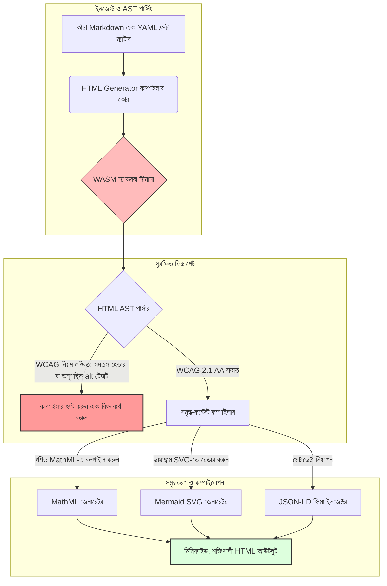

---

# Front Matter (YAML)

author: "contact@sebastienrousseau.com (Sebastien Rousseau)"
banner_alt: "কাঠামোগত আলোর নিচে স্থাপত্য জ্যামিতি — HTML Generator-এর ভূমিকাকে চিত্রিত করছে একটি কম্পাইল-গেটেড Markdown-থেকে-HTML পাইপলাইন হিসেবে, অ্যাক্সেসিবল, SEO-প্রস্তুত এবং স্যান্ডবক্সড পাবলিশিং ইনফ্রাস্ট্রাকচারের জন্য"
banner_height: "1597"
banner_width: "2584"
banner: "https://cloudcdn.pro/stocks/images/markus-winkler-IrRbSND5EUc-unsplash-1200.webp"
cdn: "https://cloudcdn.pro"
charset: "UTF-8"
cname: "sebastienrousseau.com"
copyright: "© Copyright 2025 - 2026 - Sebastien Rousseau. All rights reserved."
date: "June 20, 2026"
description: "HTML Generator হল একটি Rust লাইব্রেরি যা Markdown-কে WCAG-সম্মত, SEO-প্রস্তুত, JSON-LD-সমৃদ্ধ HTML-এ রূপান্তরিত করে — অ্যাক্সেসিবিলিটি-অ্যাজ-কোড, MathML ও Mermaid সাপোর্ট, এবং নিরাপদ এন্টারপ্রাইজ পাবলিশিংয়ের জন্য WebAssembly-স্যান্ডবক্সড এক্সিকিউশন।"
format-detection: "telephone=no"
hreflang: "bn"
icon: "https://cloudcdn.pro/clients/sebastienrousseau/v1/logos/sebastienrousseau.svg"
id: "https://sebastienrousseau.com/2026-06-20-html-generator-accessible-seo-structured-markdown-rust-2026"
image_alt: "সেবাস্তিয়ান রুসোর সাদা-কালো প্রতিকৃতি"
image_height: "162"
image_width: "162"
image: "https://cloudcdn.pro/stocks/images/sebastienrousseau.webp"
keywords: "html-generator, Rust Markdown থেকে HTML, অ্যাক্সেসিবিলিটি অ্যাজ কোড, WCAG 2.1 AA, SEO-প্রস্তুত HTML, JSON-LD, MathML, Mermaid, WebAssembly, EAA, DORA, ADA Title III, অ্যাক্সেসিবল পাবলিশিং, স্যান্ডবক্সড পার্সিং, ওপেন সোর্স"
language: "bn-BD"
last_reviewed: "2026-06-20"
layout: "report"
locale: "bn_BD"
logo_alt: "সেবাস্তিয়ান রুসোর লোগো"
logo_height: "44"
logo_width: "44"
logo: "https://cloudcdn.pro/clients/sebastienrousseau/v1/logos/sebastienrousseau.svg"
menu: ""
measurementID: "G-169G4ET5HQ"
name: "Sebastien Rousseau"
permalink: "https://sebastienrousseau.com/2026-06-20-html-generator-accessible-seo-structured-markdown-rust-2026"
rating: "general"
referrer: "no-referrer"
robots: "index, follow"
schema: "FAQPage, Article"
seo_title: "অ্যাক্সেসিবিলিটি-অ্যাজ-কোড: Rust দিয়ে Markdown থেকে AAA HTML ২০২৬"
short_name: "sebastienrousseau"
subtitle: "কর্পোরেট ওয়েব পাবলিশিং, পণ্য ডকুমেন্টেশন এবং ক্লায়েন্ট পোর্টালকে অ্যাক্সেসহীন টেক্সট ফাইল থেকে উচ্চ কাঠামোবদ্ধ, সম্মত এবং স্যান্ডবক্সড ডিজিটাল সম্পদে রূপান্তরিত করা।"
tags: "html-generator, Rust, Markdown, অ্যাক্সেসিবিলিটি, WCAG, SEO, JSON-LD, MathML, Mermaid, WebAssembly, EAA, DORA, ADA, AI-আবিষ্কার, RAG, ওপেন সোর্স, ব্যাংকিং ইনফ্রাস্ট্রাকচার"
theme-color: "0, 83, 191"
title: "২০২৬ সালে Rust দিয়ে Markdown-কে অ্যাক্সেসিবল, SEO-প্রস্তুত, কাঠামোবদ্ধ HTML-এ রূপান্তর"
url: "https://sebastienrousseau.com/2026-06-20-html-generator-accessible-seo-structured-markdown-rust-2026"
viewport: "width=device-width, initial-scale=1, shrink-to-fit=no"

# RSS - The RSS feed front matter (YAML).
atom_link: "https://sebastienrousseau.com/2026-06-20-html-generator-accessible-seo-structured-markdown-rust-2026/rss.xml"
category: "Technology"
docs: https://validator.w3.org/feed/docs/rss2.html
generator: "Static Site Generator (SSG) (version 0.0.40)"
item_description: "HTML Generator হল একটি Rust লাইব্রেরি যা Markdown-কে WCAG-সম্মত, SEO-প্রস্তুত, JSON-LD-সমৃদ্ধ HTML-এ রূপান্তরিত করে — অ্যাক্সেসিবিলিটি-অ্যাজ-কোড, MathML ও Mermaid সাপোর্ট, এবং নিরাপদ এন্টারপ্রাইজ পাবলিশিংয়ের জন্য WebAssembly-স্যান্ডবক্সড এক্সিকিউশন।"
item_guid: "https://sebastienrousseau.com/2026-06-20-html-generator-accessible-seo-structured-markdown-rust-2026/rss.xml"
item_link: "https://sebastienrousseau.com/2026-06-20-html-generator-accessible-seo-structured-markdown-rust-2026/rss.xml"
item_pub_date: "Sat, 20 Jun 2026 06:06:06 +0000"
item_title: "২০২৬ সালে Rust দিয়ে Markdown-কে অ্যাক্সেসিবল, SEO-প্রস্তুত, কাঠামোবদ্ধ HTML-এ রূপান্তর"
last_build_date: "Sat, 20 Jun 2026 06:06:06 +0000"
managing_editor: "contact@sebastienrousseau.com (Sebastien Rousseau)"
pub_date: "Sat, 20 Jun 2026 06:06:06 +0000"
ttl: "60"
type: "article"
webmaster: "contact@sebastienrousseau.com"

# Apple - The Apple front matter (YAML).
apple_mobile_web_app_orientations: "portrait"
apple_touch_icon_sizes: "192x192"
apple-mobile-web-app-capable: "yes"
apple-mobile-web-app-status-bar-inset: "black"
apple-mobile-web-app-status-bar-style: "black-translucent"
apple-mobile-web-app-title: "Rust দিয়ে Markdown থেকে AAA HTML"
apple-touch-fullscreen: "yes"

# MS Application - The MS Application front matter (YAML).

msapplication-navbutton-color: "0, 83, 191"

# Twitter Card - The Twitter Card front matter (YAML).

twitter_card: "summary_large_image"
twitter_creator: "@wwdseb"
twitter_description: "HTML Generator হল একটি Rust লাইব্রেরি যা Markdown-কে WCAG-সম্মত, SEO-প্রস্তুত, JSON-LD-সমৃদ্ধ HTML-এ রূপান্তরিত করে — অ্যাক্সেসিবিলিটি-অ্যাজ-কোড, MathML ও Mermaid সাপোর্ট এবং WebAssembly-স্যান্ডবক্সড এক্সিকিউশন।"
twitter_image: "https://cloudcdn.pro/clients/sebastienrousseau/v1/logos/sebastienrousseau.svg"
twitter_image_alt: "সেবাস্তিয়ান রুসোর লোগো"
twitter_site: "@wwdseb"
twitter_title: "অ্যাক্সেসিবিলিটি-অ্যাজ-কোড: Rust দিয়ে Markdown থেকে AAA HTML"
twitter_url: "https://sebastienrousseau.com/2026-06-20-html-generator-accessible-seo-structured-markdown-rust-2026"

# Humans.txt - The Humans.txt front matter (YAML).
author_website: "https://sebastienrousseau.com"
author_twitter: "@wwdseb"
author_location: "London, UK"
thanks: "পড়ার জন্য ধন্যবাদ!"
site_last_updated: "2026-06-20"
site_standards: "HTML5, CSS3, RSS, Atom, JSON, XML, YAML, Markdown, TOML"
site_components: "Kaishi, Kaishi Builder, Kaishi CLI, Kaishi Templates, Kaishi Themes"
site_software: "Static Site Generator, Rust"

---

# ২০২৬ সালে Rust দিয়ে Markdown-কে অ্যাক্সেসিবল, SEO-প্রস্তুত, কাঠামোবদ্ধ HTML-এ রূপান্তর

<!-- lead-start -->
<aside class="post-lead" aria-label="নিবন্ধের সারসংক্ষেপ">

<strong>TL;DR.</strong> HTML Generator হল একটি বিশুদ্ধ-Rust Markdown-থেকে-HTML কম্পাইলার যা বিল্ড টাইমে WCAG 2.1 AA প্রয়োগ করে, স্কিমা-সম্মত JSON-LD ইনজেক্ট করে, MathML ও Mermaid SVG নেটিভভাবে রেন্ডার করে, এবং একটি WebAssembly স্যান্ডবক্সের মধ্যে পার্সিং আইসোলেট করে — পাবলিশিংকে অ্যাক্সেসিবিলিটি, SEO এবং ICT নিরাপত্তার জন্য একটি কম্পাইল-গেটেড নিয়ন্ত্রণ কেন্দ্রে পরিণত করে।

<strong>মূল বিষয়সমূহ</strong>

<ul class="post-lead-takeaways">
  <li><strong>সংক্ষিপ্ত উত্তর।</strong> এক বাক্যে HTML Generator কী?</li>
  <li><strong>নির্বাহী সারসংক্ষেপ।</strong> Markdown রেন্ডারিং তুচ্ছ মনে হয়; পাবলিশিং-গ্রেড HTML পাওয়া একটি কমপ্লায়েন্স সমস্যা।</li>
  <li><strong>০১. ২০২৬ সালে অ্যাক্সেসিবিলিটি-ফার্স্ট HTML কম্পাইলার কেন গুরুত্বপূর্ণ।</strong> EAA এবং ADA Title III অ্যাক্সেসিবিলিটিকে ইঞ্জিনিয়ারিং স্বাস্থ্যবিধি থেকে আর্থিক দায়বদ্ধতায় পরিণত করেছে।</li>
  <li><strong>০২. HTML Generator ২০২৬ আর্কিটেকচার লেন্স।</strong> কাঁচা Markdown থেকে শক্তিশালী HTML আউটপুটে একটি বহু-স্তরীয়, কম্পাইলার-গেটেড পাইপলাইন।</li>
</ul>

<strong>সংশ্লিষ্ট পাঠ:</strong> <a href="https://sebastienrousseau.com/2026-06-18-noyalib-safe-yaml-rust-ai-mcp-financial-infrastructure-2026">২০২৬ সালে AI, MCP এবং আর্থিক অবকাঠামোর জন্য YAML-এর কেন নিরাপদ Rust স্ট্যাক প্রয়োজন</a>, ২০২৬ সালে AI-যুগের পাবলিশিংয়ের জন্য ডিফল্ট-নিরাপদ Static Site Generator, <a href="https://sebastienrousseau.com/2026-06-11-cloudcdn-open-source-blueprint-ai-native-edge-2026">CloudCDN: ২০২৬ সালে AI-নেটিভ এজের জন্য একটি ওপেন-সোর্স ব্লুপ্রিন্ট</a>।

</aside>
<!-- lead-end -->

২০২৬ সালে, ওয়েব কন্টেন্ট মানব পাঠকদের মতো সমানভাবে AI সার্চ ক্রলার, LLM-চালিত সার্চ ইঞ্জিন এবং Retrieval-Augmented Generation (RAG) পাইপলাইন দ্বারাও গৃহীত হচ্ছে। সমতল বা ত্রুটিযুক্ত HTML মেশিন আবিষ্কারযোগ্যতাকে ক্ষতিগ্রস্ত করে, আর [ইউরোপীয় অ্যাক্সেসিবিলিটি অ্যাক্ট (EAA)](https://www.accessibility-act.eu/) এবং [মার্কিন ADA Title III](https://www.ada.gov/topics/title-iii/)-এর মতো কঠোর বৈশ্বিক বিধিবিধান মেনে না চলা এখন স্পষ্ট দেওয়ানি দায়বদ্ধতা। [HTML Generator](https://github.com/sebastienrousseau/html-generator) হল একটি উচ্চ-কার্যক্ষমতাসম্পন্ন Rust লাইব্রেরি যা এই ফাঁকগুলো পূরণ করতে তৈরি — কম্পাইলারে, ডিপ্লয়মেন্ট-পরবর্তী প্যাচে নয়।

## সংক্ষিপ্ত উত্তর

**এক বাক্যে HTML Generator কী?** HTML Generator হল একটি ওপেন-সোর্স, বিশুদ্ধ-Rust Markdown-থেকে-HTML কম্পাইলার যা বিল্ড টাইমে [WCAG 2.1 AA](https://www.w3.org/TR/WCAG21/) প্রয়োগ করে, স্বয়ংক্রিয়ভাবে সিমান্টিক ল্যান্ডমার্ক ও ARIA অ্যাট্রিবিউট তৈরি করে, YAML ফ্রন্ট ম্যাটার থেকে স্কিমা-সম্মত [JSON-LD](https://json-ld.org/) মেটাডেটা ইনজেক্ট করে, Mermaid ডায়াগ্রাম ও গণিতকে অ্যাক্সেসিবল SVG ও MathML-এ রেন্ডার করে, এবং একটি [WebAssembly](https://webassembly.org/) স্যান্ডবক্সের মধ্যে চলে — কর্পোরেট পাবলিশিংকে একটি কম্পাইল-গেটেড, আর্থিক-গ্রেডের নিয়ন্ত্রণ কেন্দ্রে পরিণত করে।

## নির্বাহী সারসংক্ষেপ

Markdown রেন্ডারিং তুচ্ছ মনে হয়। পাবলিশিং-গ্রেড HTML একটি কমপ্লায়েন্স সমস্যা। ২০২৬ সালের জুনে, প্রতিটি কর্পোরেট টাচপয়েন্ট — বিনিয়োগকারী সম্পর্ক পোর্টাল, নিয়ন্ত্রক দাখিলপত্র, গ্রাহক ডকুমেন্টেশন, API রেফারেন্স, মার্কেটিং সম্পদ — মানুষ এবং মেশিন উভয় দ্বারাই পার্স করা হচ্ছে। প্রতিটি পাতায় দুটি চাপ সংঘর্ষ করছে: [EAA](https://www.accessibility-act.eu/) এবং [ADA Title III](https://www.ada.gov/topics/title-iii/) অ্যাক্সেসিবিলিটিকে বোর্ড-স্তরের আইনি ঝুঁকিতে পরিণত করেছে, আর AI ইনজেশন এবং RAG পাইপলাইন কাঠামোবদ্ধ, মেশিন-পাঠযোগ্য আউটপুটকে পুরস্কৃত করে। মানক Markdown লাইব্রেরি সমতল HTML তৈরি করে যা উভয় গেটেই ব্যর্থ হয়। HTML Generator ডকুমেন্ট জেনারেশনকে একটি কম্পাইল-গেটেড পাইপলাইন হিসেবে ব্যবহার করে: WCAG যাচাইকরণ একটি বিল্ড এরর, JSON-LD YAML ফ্রন্ট ম্যাটার থেকে ম্যানুয়াল স্ট্যাম্পিং ছাড়াই আসে, MathML ও Mermaid অ্যাক্সেসিবলভাবে রেন্ডার করে, এবং সম্পূর্ণ ইঞ্জিন একটি WebAssembly টার্গেট হিসেবে পাঠানো হয় যাতে অবিশ্বস্ত ডকুমেন্ট পার্সিং হোস্ট থেকে স্যান্ডবক্সড থাকে।

## মূল বিষয়সমূহ

- **অ্যাক্সেসিবিলিটি-অ্যাজ-কোড হল নতুন বেসলাইন।** EAA ভোক্তা ডিজিটাল পরিষেবার জন্য অ্যাক্সেসিবিলিটি বাধ্যতামূলক করে। HTML Generator কম্পাইল টাইমে ডকুমেন্ট ট্রি মূল্যায়ন করে, স্বয়ংক্রিয়ভাবে সিমান্টিক ল্যান্ডমার্ক ও ARIA অ্যাট্রিবিউট তৈরি করে — ডিপ্লয়মেন্ট-পরবর্তী কম ফিক্স, কম রিমিডিয়েশন বাজেট, উৎপাদনে কোনো অনুপস্থিত alt-text নেই।
- **AI আবিষ্কারের জন্য কাঠামোবদ্ধ ডেটা।** আধুনিক সার্চ ও RAG মেশিন-পাঠযোগ্য মেটাডেটার উপর নির্ভর করে। কম্পাইলার YAML ফ্রন্ট ম্যাটার পার্স করে এবং [Schema.org-সম্মত JSON-LD](https://schema.org/) সরাসরি ডকুমেন্ট হেডে ইনজেক্ট করে, যা কন্টেন্টকে [Google Rich Results](https://developers.google.com/search/docs/appearance/structured-data/intro-structured-data), [Bing Webmaster](https://www.bing.com/webmasters) এবং LLM-চালিত ক্রলার দ্বারা সম্পূর্ণরূপে ব্যাখ্যাযোগ্য করে তোলে।
- **প্রযুক্তিগত কন্টেন্টের শ্রেষ্ঠত্ব।** প্রযুক্তিগত পাবলিশিং সমতল টেক্সট নয়। HTML Generator কাঁচা Markdown গণিত এক্সটেনশন কম্পাইল করে অ্যাক্সেসিবল [MathML](https://www.w3.org/Math/)-এ, এবং [Mermaid.js](https://mermaid.js.org/) ডায়াগ্রাম রেন্ডার করে রেসপন্সিভ SVG-তে — উভয়ই অস্বচ্ছ ছবিতে নামার পরিবর্তে WCAG-সম্মত কাঠামো সংরক্ষণ করে।
- **WebAssembly স্যান্ডবক্সিং।** অবিশ্বস্ত Markdown পার্স করা একটি নিরাপত্তা ঝুঁকি। [WASM](https://webassembly.org/) টার্গেট করার মাধ্যমে, HTML Generator একটি আইসোলেটেড স্যান্ডবক্সের মধ্যে চলে যা স্বেচ্ছাচারী কোড এক্সিকিউশন প্রতিরোধ করে এবং হোস্ট সিস্টেমকে সুরক্ষিত করে — সরাসরি [DORA Article 6](https://eur-lex.europa.eu/legal-content/EN/TXT/?uri=CELEX%3A32022R2554) ICT-নিরাপত্তা বাধ্যবাধকতা পূরণ করে।
- **বোর্ডের জন্য আর্থিক সুরক্ষা।** প্রযুক্তিগত অ-সম্মতি এখন বোর্ডরুমে প্রবেশ করেছে। একটি কম্পাইলার-গেটেড HTML ইঞ্জিন মানকীকরণ পরিচালক এবং সিনিয়র ম্যানেজমেন্টকে DORA, EAA এবং ADA Title III-এর অধীনে ব্যক্তিগত দেওয়ানি ও নিয়ন্ত্রক ঝুঁকি থেকে রক্ষা করে।

**সংশ্লিষ্ট পাঠ:** [২০২৬ সালে AI, MCP এবং আর্থিক অবকাঠামোর জন্য YAML-এর কেন নিরাপদ Rust স্ট্যাক প্রয়োজন](https://sebastienrousseau.com/2026-06-18-noyalib-safe-yaml-rust-ai-mcp-financial-infrastructure-2026/), ২০২৬ সালে AI-যুগের পাবলিশিংয়ের জন্য ডিফল্ট-নিরাপদ Static Site Generator, [CloudCDN: ২০২৬ সালে AI-নেটিভ এজের জন্য একটি ওপেন-সোর্স ব্লুপ্রিন্ট](https://sebastienrousseau.com/2026-06-11-cloudcdn-open-source-blueprint-ai-native-edge-2026/)।

## ০১. ২০২৬ সালে অ্যাক্সেসিবিলিটি-ফার্স্ট HTML কম্পাইলার কেন গুরুত্বপূর্ণ

কর্পোরেট ওয়েব এস্টেট, ডকুমেন্টেশন লাইব্রেরি এবং পণ্য সহায়তা কেন্দ্র হল গুরুত্বপূর্ণ ডিজিটাল টাচপয়েন্ট। এগুলো এখন দুটি তীব্র, পরস্পরছেদকারী চাপের অধীন।

প্রথমটি হল **AI ইনজেশন এবং আবিষ্কারযোগ্যতা**। কন্টেন্ট ক্রমশ বৃহৎ ভাষা মডেল এবং Retrieval-Augmented Generation পাইপলাইন দ্বারা প্রক্রিয়াকৃত হচ্ছে। সমতল বা ত্রুটিযুক্ত HTML ক্রলার পার্সিংকে বিভ্রান্ত করে, কর্পোরেট গবেষণা ও ডকুমেন্টেশনকে আধুনিক সার্চ প্যারাডাইমের কাছে অদৃশ্য করে — [Google Search Generative Experience](https://blog.google/products/search/generative-ai-search/), [ChatGPT](https://chat.openai.com/) ব্রাউজিং এবং এন্টারপ্রাইজ RAG এজেন্ট সহ।

দ্বিতীয়টি হল **কঠোর বৈশ্বিক অ্যাক্সেসিবিলিটি আইন**। [ইউরোপীয় অ্যাক্সেসিবিলিটি অ্যাক্ট](https://www.accessibility-act.eu/) (জুন ২০২৫ থেকে সম্পূর্ণরূপে প্রযোজ্য) এবং [মার্কিন ADA Title III](https://www.ada.gov/topics/title-iii/)-এর অধীনে, কর্পোরেট পাবলিশিং প্ল্যাটফর্মকে সম্পূর্ণ ডিজিটাল অ্যাক্সেসিবিলিটি নিশ্চিত করতে হবে। [WCAG 2.1 AA](https://www.w3.org/TR/WCAG21/) পূরণ করতে ব্যর্থতা আর ইঞ্জিনিয়ারিং গাফিলতি নয়; এটি একটি দেওয়ানি ও নিয়ন্ত্রক দায় যা বহু মিলিয়ন ডলারের নিষ্পত্তি তৈরি করেছে।

[HTML Generator](https://github.com/sebastienrousseau/html-generator) উভয় চাপ সরাসরি মোকাবেলা করে। এটি একটি থ্রেড-নিরাপদ Rust লাইব্রেরি যা Markdown-কে অ্যাক্সেসিবল, SEO-প্রস্তুত, কাঠামোবদ্ধ HTML-এ রূপান্তরিত করতে ডিজাইন করা হয়েছে। ডকুমেন্ট জেনারেশনকে একটি কম্পাইলার-গেটেড পাইপলাইন হিসেবে ব্যবহার করে, ইঞ্জিন একটি উচ্চ **Return on Resilience (RoR)** প্রদান করে — অ্যাক্সেসিবিলিটি মামলা থেকে ব্যালেন্স শিট রক্ষা করে এবং AI আবিষ্কারের জন্য মেশিন-পাঠযোগ্যতা সর্বাধিক করে।

## ০২. HTML Generator ২০২৬ আর্কিটেকচার লেন্স

ফ্রেমওয়ার্কটি একটি সুরক্ষিত, বহু-স্তরীয় কম্পাইলেশন পাইপলাইন হিসেবে ডিজাইন করা হয়েছে যা কাঁচা Markdown টেক্সটকে ক্রিপ্টোগ্রাফিক্যালি যাচাইকৃত, উচ্চ-অ্যাক্সেসিবল স্ট্যাটিক সম্পদে রূপান্তরিত করে।

### সারণি ১: HTML Generator আর্কিটেকচার স্তর এবং ঝুঁকি প্রশমন

| স্তর | ডিজাইন সিদ্ধান্ত | কেন গুরুত্বপূর্ণ | অপব্যবস্থাপনার ঝুঁকি |
| ---- | ---- | ---- | ---- |
| **ইনপুট স্তর** | Markdown এবং YAML ফ্রন্ট ম্যাটার পার্সার | লেখকদের যেখানে আছেন সেখানে মেলে; গদ্যকে কাঠামোগত মেটাডেটা থেকে পৃথক করে। | অসামঞ্জস্যপূর্ণ মেটাডেটা, ভাঙা সাইটম্যাপ, ইন্ডেক্সিং ফাঁক। |
| **কাঠামো স্তর** | ARIA ট্যাগ সহ স্বয়ংক্রিয় সুচিপত্র এবং সিমান্টিক ল্যান্ডমার্ক | নির্মাণের মাধ্যমে নেভিগেযোগ্য, অ্যাক্সেসিবল ডকুমেন্ট ট্রি তৈরি করে। | সমতল HTML যা স্ক্রিন রিডার ভাঙে এবং WCAG লঙ্ঘন করে। |
| **সমৃদ্ধ-কন্টেন্ট স্তর** | নেটিভ MathML এবং Mermaid.js SVG রেন্ডারিং | সূত্র ও ডায়াগ্রাম অ্যাক্সেসিবল SVG এবং MathML-এ কম্পাইল করে। | ক্লায়েন্ট-সাইড JS রেন্ডারিং বিলম্ব এবং ভাঙা সহায়ক প্রযুক্তি আউটপুট। |
| **SEO ও ডেটা স্তর** | সমন্বিত JSON-LD ও কাঠামোবদ্ধ-মেটাডেটা জেনারেশন | সরাসরি হেডে [Schema.org](https://schema.org/)-সম্মত JSON-LD ইনজেক্ট করে। | সার্চ ইঞ্জিন ও AI ক্রলার লেখক, প্রসঙ্গ, লাইসেন্সিং ভুলভাবে পড়ছে। |
| **রানটাইম স্তর** | WebAssembly টার্গেট সহ নেটিভ Rust কম্পাইলার | সার্ভার, এজ নোড এবং ব্রাউজারে সুরক্ষিত, স্যান্ডবক্সড এক্সিকিউশন সক্ষম করে। | অবিশ্বস্ত Markdown পার্সিংয়ের সময় স্বেচ্ছাচারী কোড এক্সিকিউশন। |

## ০৩. মূল ওয়েব নিরাপত্তা ও অ্যাক্সেসিবিলিটি সংকেত

পাবলিক-ফেসিং পাবলিশিং সম্পদ আধুনিক নিয়ন্ত্রক ও নিরাপত্তা অডিট পূরণ করে কিনা যাচাই করতে, সিনিয়র প্রযুক্তি কর্মকর্তাদের নির্দিষ্ট, পরিমাপযোগ্য মেট্রিক পর্যবেক্ষণ করতে হবে।

### সারণি ২: ওয়েব নিরাপত্তা ও অ্যাক্সেসিবিলিটি সংকেত

| সংকেত | মেট্রিক / অপারেশনাল বেঞ্চমার্ক | EAA / DORA / W3C রেফারেন্স | প্রযুক্তিগত বাস্তবায়ন |
| ---- | ---- | ---- | ---- |
| **অ্যাক্সেসিবিলিটি সম্মতি** | কম্পাইল করা পাতার ১০০% WCAG 2.1 AA নিয়মের বিপরীতে যাচাইকৃত। | [EAA](https://www.accessibility-act.eu/) এবং [ADA Title III](https://www.ada.gov/topics/title-iii/) | বিল্ড-টাইম HTML পার্সার ছবির alt ট্যাগ ও সিমান্টিক ল্যান্ডমার্ক মূল্যায়ন করছে। |
| **WASM এক্সিকিউশন স্যান্ডবক্স** | একটি আইসোলেটেড WebAssembly রানটাইমে কম্পাইল করা অবিশ্বস্ত Markdown ইনপুটের ১০০%। | [DORA Article 6](https://eur-lex.europa.eu/legal-content/EN/TXT/?uri=CELEX%3A32022R2554) (ICT নিরাপত্তা) | হোস্ট সার্ভার থেকে পার্সিং পরিবেশ আইসোলেশন। |
| **কাঠামোবদ্ধ-মেটাডেটা কভারেজ** | বৈধ, স্কিমা-সম্মত JSON-LD হেডার সহ প্রকাশিত নিবন্ধের ১০০%। | [Schema.org](https://schema.org/) স্পেসিফিকেশন | স্বয়ংক্রিয় ফ্রন্ট-ম্যাটার পার্সিং এবং JSON-LD অবজেক্টে রূপান্তর। |
| **কম্পাইলেশন থ্রুপুট** | কমোডিটি হার্ডওয়্যারে প্রতি-সেকেন্ড ১০,০০০-এর বেশি পাতার লক্ষ্যমাত্রা। | Return on Resilience (RoR) | উচ্চ-সমান্তরাল Rust AST কম্পাইলার। |
| **রিচ-স্নিপেট যাচাইকরণ** | [Google Rich Results](https://search.google.com/test/rich-results) এবং [Schema validator](https://validator.schema.org/) রানে শূন্য পার্সিং এরর। | Google Search গাইডলাইন | বিল্ড পাইপলাইনে তৈরি JSON-LD-এর কাঠামোগত যাচাইকরণ। |

## ০৪. সরল Markdown রেন্ডারিংয়ের মিথ

প্রযুক্তি ব্যবস্থাপকদের মধ্যে একটি সাধারণ ভ্রান্তধারণা হল যে Markdown-কে HTML-এ রূপান্তর করা একটি সরল টেক্সট-প্রতিস্থাপন অনুশীলন। অনেক মানক লাইব্রেরি Markdown ফরম্যাটিংকে সমতল, অকাঠামোবদ্ধ HTML-এ অনুবাদ করে। আউটপুট একটি দর্শনকারী পাঠকের কাছে ব্রাউজারে রেন্ডার হয়, কিন্তু এটি একটি কমপ্লায়েন্স ফাঁদ।

সমতল HTML সাধারণত তিনটি জিনিসের অভাব থাকে।

1. **সঠিক হেডিং শ্রেণিবিন্যাস।** মানক Markdown হেডিং ক্রম প্রয়োগ করে না। একটি `<h1>` থেকে `<h4>`-এ লাফ দেওয়া WCAG 2.1 AA লঙ্ঘন করে এবং স্ক্রিন রিডারের জন্য ডকুমেন্ট নেভিগেশন ভাঙে।
2. **স্পষ্ট টেবিল সিমান্টিক্স।** মানক Markdown টেবিল বিরলভাবে অ্যাক্সেসিবল পার্সিংয়ের জন্য প্রয়োজনীয় সঠিক `<th>` স্কোপ এবং `<tbody>` অ্যাট্রিবিউট সহ রেন্ডার হয়।
3. **মেশিন-পাঠযোগ্য মেটাডেটা।** মানক HTML-এ আধুনিক AI সার্চ প্ল্যাটফর্ম এবং RAG ইনজেস্ট সিস্টেম যে JSON-LD হুকের উপর নির্ভর করে তা নেই।

HTML Generator এটি সমাধান করে Markdown-কে একটি **Abstract Syntax Tree (AST)**-এ পার্স করে। ইঞ্জিন HTML নির্গত করার আগে ডকুমেন্ট কাঠামো মূল্যায়ন করে, হেডিং নেস্টিং যাচাই করে, উপযুক্ত ARIA অ্যাট্রিবিউট ইনজেক্ট করে, এবং নিশ্চিত করে যে প্রতিটি মিডিয়া সম্পদ বিকল্প পাঠ্য বহন করে — অ্যাক্সেসিবিলিটিকে ম্যানুয়াল অডিট থেকে গ্যারান্টিযুক্ত কম্পাইল-টাইম অপরিবর্তনীয়তায় পরিণত করে।

## ০৫. একটি অ্যাক্সেসিবিলিটি-অ্যাজ-কোড বিল্ড পাইপলাইন ডিজাইন করা

অ্যাক্সেসহীন বা আন-ইন্ডেক্সড সম্পদ কখনো পাবলিক ডিপ্লয়মেন্টে না পৌঁছানো নিশ্চিত করতে, অ্যাক্সেসিবিলিটিকে একটি কঠোর কম্পাইলার গেট হতে হবে। নিচের পাইপলাইনে দেখানো হয়েছে কীভাবে HTML Generator Markdown মূল্যায়ন করে, WebAssembly-আইসোলেটেড যাচাইকরণ চালায়, এবং শক্তিশালী, কাঠামোবদ্ধ HTML নির্গত করে।

## ০৬. বোর্ডরুম প্লেবুক এবং আর্থিক দায়বদ্ধতা

আধুনিক অ্যাক্সেসিবিলিটি ও ওয়েব-নিরাপত্তা সম্মতি অনির্বার্য বোর্ডরুম বিষয়। সিনিয়র ম্যানেজমেন্টকে আইনি ঝুঁকি, আর্থিক সংরক্ষণ এবং নিয়ন্ত্রক প্রকাশের লেন্সের মাধ্যমে পাবলিশিং ইনফ্রাস্ট্রাকচারের কাছে যেতে হবে।

- **ইউরোপীয় অ্যাক্সেসিবিলিটি অ্যাক্ট (EAA)।** পাবলিক ও বেসরকারি ডিজিটাল পোর্টালে সরাসরি, আইনগতভাবে বাধ্যকর কমপ্লায়েন্স আদেশ আরোপ করে। অ-সম্মতি গুরুতর আর্থিক জরিমানা, দেওয়ানি মামলা এবং EU বাজার থেকে সম্পদের তাৎক্ষণিক প্রত্যাহার ঘটাতে পারে। অ্যাক্সেসিবিলিটি-অ্যাজ-কোড একীভূত করে, বোর্ড প্রত্যয়িত করতে পারে যে অ-সম্মত কোড পাঠানো যাবে না — প্রতিক্রিয়াশীল প্রতিকারকে একটি কাঠামোগত আইনি ঢালে রূপান্তরিত করে।
- **DORA Article 6 (সুরক্ষিত ICT পরিবেশ)।** ICT-পরিবেশ নিরাপত্তার জন্য কঠোর নিয়ম প্রতিষ্ঠা করে। একটি WebAssembly স্যান্ডবক্সের মধ্যে Markdown কম্পাইলেশন আইসোলেট করে, প্রতিষ্ঠানগুলো নিশ্চিত করে যে গ্রাহক-আপলোড করা ডকুমেন্টেশন বা অংশীদার ফিড পার্স করা হোস্ট সার্ভারকে স্বেচ্ছাচারী কোড এক্সিকিউশনে উন্মোচন করতে পারে না, গুরুত্বপূর্ণ ব্যাংকিং পোর্টাল সুরক্ষিত করে।
- **কমপ্লায়েন্স অডিটে খরচ সাশ্রয়।** ঐতিহ্যগত অ্যাক্সেসিবিলিটি কমপ্লায়েন্স ব্যয়বহুল, পূর্ববর্তী ডিপ্লয়মেন্ট-পরবর্তী অডিটের উপর নির্ভর করে — প্রতি সাইটে বার্ষিক হাজার হাজার ডলার। WCAG যাচাইকরণকে কম্পাইল-টাইম ব্লক হিসেবে বাস্তবায়ন সেই পূর্ববর্তী খরচ দূর করে, কমপ্লায়েন্স বাজেট প্রতিরক্ষা থেকে উদ্ভাবনে স্থানান্তরিত করে।

## ০৭. ব্যাংক / এন্টারপ্রাইজ প্রকার অনুসারে এর অর্থ কী

### গ্লোবাল সিস্টেমিক্যালি ইম্পর্ট্যান্ট ব্যাংক (G-SIBs)

G-SIBs বিশাল, বহুভাষিক পাবলিক এস্টেট পরিচালনা করে যা একাধিক এখতিয়ার জুড়ে হাজার হাজার গবেষণাপত্র, নিয়ন্ত্রক প্রকাশ এবং বিনিয়োগকারী-সম্পর্ক নথি প্রকাশ করে। তাদের চ্যালেঞ্জ হল স্কেল এবং বহু-ভাষা সমতা। HTML Generator-এর WebAssembly টার্গেট এবং উচ্চ-থ্রুপুট Rust ইঞ্জিন বড়-স্কেল, স্থানীয়করণকৃত গবেষণা লাইব্রেরিকে সেকেন্ডের মধ্যে বৈশ্বিকভাবে আপডেট, কম্পাইল এবং ডিপ্লয় করতে দেয় — রেন্ডারিং বিলম্ব বা অ্যাক্সেসিবিলিটি রিগ্রেশন ছাড়াই।

### ট্রানজেকশন ও কর্পোরেট ব্যাংক

ট্রানজেকশন ব্যাংকগুলোর জন্য, গ্রাহক পোর্টাল, ডকুমেন্টেশন হাব এবং ডেভেলপার API গাইড হল গুরুত্বপূর্ণ ডিজিটাল টাচপয়েন্ট। HTML Generator-এর মাধ্যমে সেই সম্পদ কম্পাইল করা মানে ক্লায়েন্ট-ফেসিং চ্যানেলগুলো কোনো XSS এক্সপোজার, কোনো ডিপেন্ডেন্সি-হাইজ্যাক ভেক্টর এবং কোনো অ্যাক্সেসিবিলিটি ঘাটতি বহন করে না — প্রাতিষ্ঠানিক বিশ্বাস সংরক্ষণ করে এবং মামলার পৃষ্ঠ কমায়।

### আঞ্চলিক ব্যাংক ও ফিনটেক

আঞ্চলিক ব্যাংক এবং চটপটে ফিনটেক G-SIB ইঞ্জিনিয়ারিং বাজেট ছাড়াই ডিজিটাল অভিজ্ঞতায় প্রতিযোগিতা করে। HTML Generator সেই দলগুলোকে বাক্সের বাইরে এন্টারপ্রাইজ-গ্রেড পাবলিশিং পাইপলাইন দেয়, ছোট এস্টেটকে অ্যাক্সেসিবল, SEO-প্রস্তুত, স্যান্ডবক্সড সম্পদ পাঠাতে দেয় যা নিয়ন্ত্রক এবং সম্ভাব্য কর্পোরেট ক্লায়েন্ট উভয়ের পরীক্ষা সহ্য করে।

## ০৮. পাবলিশিং ইনফ্রাস্ট্রাকচার রোডম্যাপ

কর্পোরেট পাবলিক-ফেসিং ওয়েব এস্টেট অপারেশনাল স্থিতিস্থাপকতার একটি মূল উপাদান। ধীর, গতিশীলভাবে দুর্বল, ডেটাবেস-সমর্থিত ওয়েব ইঞ্জিনের উপর নির্ভর করা — বা স্বাক্ষরিত স্ট্যাটিক সম্পদ — একটি অগ্রহণযোগ্য ব্যবসায়িক ঝুঁকি।

পাবলিক ডিজিটাল টাচপয়েন্ট সুরক্ষিত করতে এবং অ্যাক্সেসিবিলিটি মামলা থেকে ব্যালেন্স শিট রক্ষা করতে, সিনিয়র প্রযুক্তি ও নিরাপত্তা ব্যবস্থাপকদের একটি স্পষ্ট রোডম্যাপ কার্যকর করতে হবে।

1. **স্ট্যাটিক আর্কিটেকচারে রূপান্তর।** গবেষণা, মার্কেটিং এবং ডকুমেন্টেশন এস্টেটের জন্য লিগ্যাসি ডায়নামিক CMS প্ল্যাটফর্ম পর্যায়ক্রমে বন্ধ করুন। কন্টেন্টকে HTML Generator-এর মতো কম্পাইলার-গেটেড পাইপলাইনে নিয়ে যান।
2. **বিল্ড টাইমে অ্যাক্সেসিবিলিটি প্রয়োগ করুন।** অ্যাক্সেসিবিলিটি-অ্যাজ-কোড বাস্তবায়ন করুন। যেকোনো WCAG 2.1 AA লঙ্ঘনে স্বয়ংক্রিয়ভাবে কম্পাইলেশন পাইপলাইন ব্যর্থ করুন।
3. **WebAssembly-এ পার্সিং আইসোলেট করুন।** একটি WASM রানটাইমের মধ্যে সমস্ত ডকুমেন্ট ও কন্টেন্ট পার্সিং স্যান্ডবক্স করুন যাতে অবিশ্বস্ত ইনপুট কখনো হোস্ট সিস্টেম স্পর্শ না করে।
4. **সমৃদ্ধ JSON-LD মেটাডেটা ইনজেক্ট করুন।** নিশ্চিত করুন যে প্রতিটি প্রকাশিত সম্পদ AI আবিষ্কারযোগ্যতা সর্বাধিক করতে স্কিমা-সম্মত JSON-LD হেডার বহন করে।

## ০৯. সচরাচর জিজ্ঞাসিত প্রশ্ন

**HTML Generator কীভাবে অ্যাক্সেসিবিলিটি প্রয়োগ করে?**

এটি বিল্ড টাইমে তৈরি HTML Abstract Syntax Tree পার্স করে, [WCAG 2.1 AA](https://www.w3.org/TR/WCAG21/) নিয়মের বিপরীতে ডকুমেন্ট মূল্যায়ন করে। যদি কোনো নিয়ম লঙ্ঘিত হয় — একটি অনুপস্থিত alt অ্যাট্রিবিউট, একটি হেডিং স্কিপ, একটি অলেবেলযুক্ত ফর্ম কন্ট্রোল — কম্পাইলার বিল্ড হল্ট করে, অ্যাক্সেসিবিলিটিকে একটি ডিপ্লয়মেন্ট-পরবর্তী অডিট কাজের পরিবর্তে কম্পাইল-টাইম অপরিবর্তনীয়তা হিসেবে ব্যবহার করে।

**WebAssembly আইসোলেশন কেন গুরুত্বপূর্ণ?**

[WebAssembly](https://webassembly.org/) Markdown পার্সিং ইঞ্জিনকে একটি আইসোলেটেড স্যান্ডবক্সের মধ্যে চালাতে দেয়, হোস্ট সার্ভার থেকে পৃথক করা। এমনকি যখন একজন শত্রু অভিনেতা পার্সার দুর্বলতা শোষণ করার জন্য ডিজাইন করা একটি কারসাজি করা Markdown ডকুমেন্ট আপলোড করে, তখনো এক্সিকিউশন আটকা পড়ে — হোস্ট সিস্টেম রক্ষা করে এবং DORA Article 6 ICT-নিরাপত্তা বাধ্যবাধকতা পূরণ করে।

**২০২৬ সালে সার্চ আবিষ্কারযোগ্যতায় JSON-LD কীভাবে সুবিধা দেয়?**

[JSON-LD](https://json-ld.org/) ডকুমেন্ট হেডে কাঠামোবদ্ধ, মেশিন-পাঠযোগ্য মেটাডেটা সরবরাহ করে। [Google Rich Results](https://developers.google.com/search/docs/appearance/structured-data/intro-structured-data), Bing ক্রলার এবং LLM-চালিত সার্চ এজেন্ট অবিলম্বে লেখক, লাইসেন্স, প্রকাশনার তারিখ এবং সিমান্টিক প্রসঙ্গ সনাক্ত করে — মানক HTML-এর অস্পষ্টতা বাইপাস করে এবং AI-চালিত আবিষ্কারে পৃষ্ঠ এলাকা বৃদ্ধি করে।

**HTML Generator-এর দর্শক কারা?**

স্ট্যাটিক-সাইট বিল্ডার, ডকুমেন্টেশন দল, টেকনিক্যাল রাইটার, Rust ডেভেলপার এবং প্ল্যাটফর্ম ইঞ্জিনিয়ার যারা অ্যাক্সেসিবিলিটি-সমালোচনামূলক বা নিয়ন্ত্রক-মুখী এস্টেট পরিচালনা করছেন। এটি [Static Site Generator (SSG)](https://github.com/sebastienrousseau/static-site-generator)-এর মতো বৃহত্তর সুরক্ষিত-পাবলিশিং পাইপলাইনের মধ্যে একটি কার্যকর কন্টেন্ট-প্রক্রিয়াকরণ স্তরও।

## ১০. তথ্যসূত্র

- World Wide Web Consortium (W3C), 2024. [Web Content Accessibility Guidelines (WCAG) 2.1 ⧉](https://www.w3.org/TR/WCAG21/ "Web Content Accessibility Guidelines 2.1")।
- Schema.org, 2026. [Schema.org কাঠামোবদ্ধ-ডেটা স্পেসিফিকেশন ⧉](https://schema.org/ "Schema.org structured-data specifications")।
- European Parliament and Council of the European Union, 2022. [আর্থিক খাতে ডিজিটাল অপারেশনাল স্থিতিস্থাপকতা সংক্রান্ত প্রবিধান (EU) 2022/2554 (DORA) ⧉](https://eur-lex.europa.eu/legal-content/EN/TXT/?uri=CELEX%3A32022R2554 "DORA Regulation")।
- European Commission, 2025. [ইউরোপীয় অ্যাক্সেসিবিলিটি অ্যাক্ট ⧉](https://www.accessibility-act.eu/ "European Accessibility Act")।
- US Department of Justice, 2024. [ADA Title III ⧉](https://www.ada.gov/topics/title-iii/ "ADA Title III")।
- WebAssembly Community Group, 2026. [WebAssembly স্পেসিফিকেশন ⧉](https://webassembly.org/ "WebAssembly")।
- GitHub, 2026. [HTML Generator রিপোজিটরি ⧉](https://github.com/sebastienrousseau/html-generator "HTML Generator open-source repository")।

<!-- enrich-start -->
<aside class="author-card" aria-label="লেখক সম্পর্কে"><strong class="author-card-name"><a href="/about/index.html">Sebastien Rousseau</a></strong>সিনিয়র ব্যাংকিং প্রযুক্তিবিদ যিনি প্রায়োগিক AI, পেমেন্ট অবকাঠামো, টোকেনাইজড অর্থ, ISO 20022, পোস্ট-কোয়ান্টাম নিরাপত্তা, ক্লাউড-নেটিভ আর্থিক পরিষেবা, ওপেন-সোর্স অবকাঠামো এবং নিয়ন্ত্রিত ডিজিটাল বাজারে লেখেন।HSBC Commercial &amp; Investment Bank, PayPal, Barclays, Shazam, AKQA, Virgin Group জুড়ে ২০+ বছর। <a href="/about/index.html">সম্পূর্ণ প্রোফাইল</a> &middot; <a href="https://www.linkedin.com/in/sebastienrousseau/" rel="external noopener">LinkedIn</a> &middot; <a href="https://github.com/sebastienrousseau" rel="external noopener">GitHub</a></aside>

সর্বশেষ পর্যালোচনা <time datetime="2026-06-20">2026-06-20</time>।

<!-- enrich-end -->
