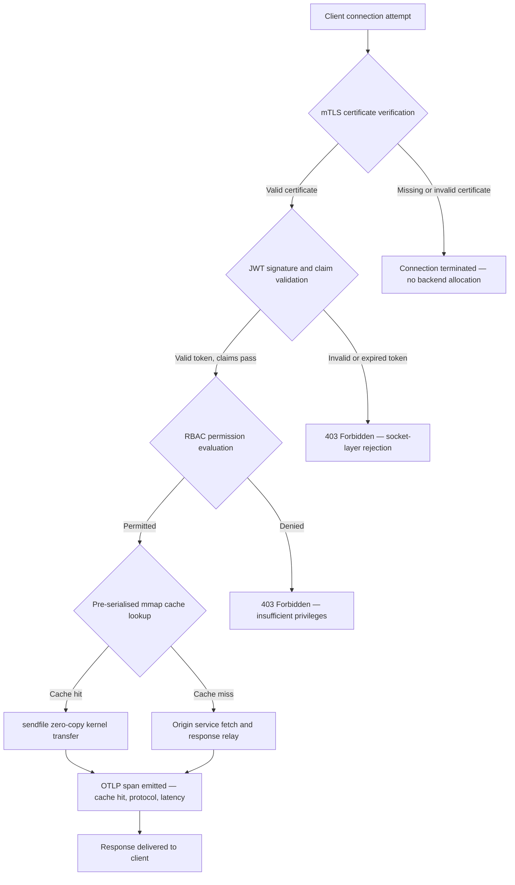

---

# Front Matter (YAML)

author: "contact@sebastienrousseau.com (Sebastien Rousseau)"
banner_alt: "রাতের বেলা বিমূর্ত সার্কিট-বোর্ড শহরের দৃশ্য — ব্যাংকিং এজ ভিজ্যুয়ালাইজ করছে যেখানে কার্নেল-স্তরের জিরো-কপি ট্রান্সফার, mTLS হ্যান্ডশেক এবং JWT ভ্যালিডেশন একটি স্ট্যাটিক্যালি লিংকড বাইনারিতে একত্রিত হয়"
banner_height: "1597"
banner_width: "2584"
banner: "https://cloudcdn.pro/stocks/images/bit-cloud-GlqbGLCPnQ4.webp"
cdn: "https://cloudcdn.pro"
charset: "UTF-8"
cname: "sebastienrousseau.com"
copyright: "© Copyright 2025 - 2026 - Sebastien Rousseau. All rights reserved."
date: "June 20, 2026"
description: "http-handle হলো একটি স্ট্যাটিক্যালি লিংকড Rust বাইনারি যা ব্যাংকিং এজে জিরো রানটাইম ডিপেন্ডেন্সি সহ প্রতি সেকেন্ডে ১,৮০,০০০ রিকোয়েস্ট ডেলিভার করে, ইন্টিগ্রেটেড mTLS ও JWT ভ্যালিডেশন, ALPN-নেগোশিয়েটেড HTTP/2 ও HTTP/3, এবং OTLP অবজার্ভেবিলিটি — Nginx ও Envoy যে নিরাপত্তা ও রিজিলিয়েন্স গ্যাপ রেখে যায় তা পূরণ করে।"
format-detection: "telephone=no"
hreflang: "bn"
icon: "https://cloudcdn.pro/clients/sebastienrousseau/v1/logos/sebastienrousseau.svg"
id: "https://sebastienrousseau.com/2026-06-20-http-handle-zero-dependency-edge-ingress-banking-rust-2026"
image_alt: "সেবাস্তিয়েন রুসোর সাদা-কালো প্রতিকৃতি"
image_height: "162"
image_width: "162"
image: "https://cloudcdn.pro/stocks/images/sebastien-rousseau.png"
keywords: "http-handle, Rust এজ ইনগ্রেস, জিরো ডিপেন্ডেন্সি প্রক্সি, ব্যাংকিং ইনফ্রাস্ট্রাকচার, mTLS JWT, sendfile জিরো-কপি, ALPN HTTP3, DORA কমপ্লায়েন্স, বাজেল III, OTLP অবজার্ভেবিলিটি, স্ট্যাটিক বাইনারি, ARM64 ব্যাংকিং, জিরো ট্রাস্ট ব্যাংকিং, লাইটওয়েট ইনগ্রেস, Rust ব্যাংকিং সিকিউরিটি"
language: "bn-BD"
last_reviewed: "2026-06-20"
layout: "report"
locale: "bn_BD"
logo_alt: "সেবাস্তিয়েন রুসোর লোগো"
logo_height: "44"
logo_width: "44"
logo: "https://cloudcdn.pro/clients/sebastienrousseau/v1/logos/sebastienrousseau.svg"
menu: ""
measurementID: "G-169G4ET5HQ"
name: "Sebastien Rousseau"
permalink: "https://sebastienrousseau.com/2026-06-20-http-handle-zero-dependency-edge-ingress-banking-rust-2026"
rating: "general"
referrer: "no-referrer"
robots: "index, follow"
schema: "FAQPage, Article"
seo_title: "http-handle: ব্যাংকিংয়ের জন্য ১৮০হাজার req/s-এ জিরো-ডিপেন্ডেন্সি Rust ইনগ্রেস"
short_name: "sebastienrousseau"
subtitle: "একটি স্ট্যাটিক্যালি লিংকড Rust বাইনারি কীভাবে ব্যাংকিং এজে mTLS, JWT এবং ALPN সহ প্রতি সেকেন্ডে ১,৮০,০০০ রিকোয়েস্ট ডেলিভার করে — এবং DORA ও বাজেল III কমপ্লায়েন্সের জন্য এর কী মানে।"
tags: "http-handle, Rust, banking, edge-ingress, mTLS, JWT, ALPN, HTTP3, DORA, Basel-III, zero-copy, sendfile, ARM64, zero-trust, OTLP, observability, open-source, infrastructure"
theme-color: "0, 83, 191"
title: "http-handle: ২০২৬ সালে ব্যাংকিংয়ের জন্য হাই-পারফরম্যান্স, জিরো-ডিপেন্ডেন্সি এজ ইনগ্রেস"
url: "https://sebastienrousseau.com/2026-06-20-http-handle-zero-dependency-edge-ingress-banking-rust-2026"
viewport: "width=device-width, initial-scale=1, shrink-to-fit=no"

# RSS - The RSS feed front matter (YAML).
atom_link: "https://sebastienrousseau.com/2026-06-20-http-handle-zero-dependency-edge-ingress-banking-rust-2026/rss.xml"
category: "Technology"
docs: https://validator.w3.org/feed/docs/rss2.html
generator: "Static Site Generator (SSG) (version 0.0.40)"
item_description: "http-handle হলো একটি স্ট্যাটিক্যালি লিংকড Rust বাইনারি যা ব্যাংকিং এজে জিরো রানটাইম ডিপেন্ডেন্সি সহ প্রতি সেকেন্ডে ১,৮০,০০০ রিকোয়েস্ট ডেলিভার করে, ইন্টিগ্রেটেড mTLS ও JWT ভ্যালিডেশন, ALPN-নেগোশিয়েটেড HTTP/2 ও HTTP/3, এবং OTLP অবজার্ভেবিলিটি — Nginx ও Envoy যে নিরাপত্তা ও রিজিলিয়েন্স গ্যাপ রেখে যায় তা পূরণ করে।"
item_guid: "https://sebastienrousseau.com/2026-06-20-http-handle-zero-dependency-edge-ingress-banking-rust-2026/rss.xml"
item_link: "https://sebastienrousseau.com/2026-06-20-http-handle-zero-dependency-edge-ingress-banking-rust-2026/rss.xml"
item_pub_date: "Sat, 20 Jun 2026 07:07:07 +0000"
item_title: "http-handle: ২০২৬ সালে ব্যাংকিংয়ের জন্য হাই-পারফরম্যান্স, জিরো-ডিপেন্ডেন্সি এজ ইনগ্রেস"
last_build_date: "Sat, 20 Jun 2026 07:07:07 +0000"
managing_editor: "contact@sebastienrousseau.com (Sebastien Rousseau)"
pub_date: "Sat, 20 Jun 2026 07:07:07 +0000"
ttl: "60"
type: "article"
webmaster: "contact@sebastienrousseau.com"

# Apple - The Apple front matter (YAML).
apple_mobile_web_app_orientations: "portrait"
apple_touch_icon_sizes: "192x192"
apple-mobile-web-app-capable: "yes"
apple-mobile-web-app-status-bar-inset: "black"
apple-mobile-web-app-status-bar-style: "black-translucent"
apple-mobile-web-app-title: "জিরো-ডিপেন্ডেন্সি ব্যাংকিং এজ"
apple-touch-fullscreen: "yes"

# MS Application - The MS Application front matter (YAML).

msapplication-navbutton-color: "0, 83, 191"

# Twitter Card - The Twitter Card front matter (YAML).

twitter_card: "summary_large_image"
twitter_creator: "@wwdseb"
twitter_description: "http-handle হলো একটি স্ট্যাটিক্যালি লিংকড Rust বাইনারি যা ব্যাংকিং এজে জিরো রানটাইম ডিপেন্ডেন্সি সহ প্রতি সেকেন্ডে ১,৮০,০০০ রিকোয়েস্ট ডেলিভার করে, mTLS, JWT এবং OTLP অবজার্ভেবিলিটি সহ।"
twitter_image: "https://cloudcdn.pro/clients/sebastienrousseau/v1/logos/sebastienrousseau.svg"
twitter_image_alt: "Logo of Sebastien Rousseau"
twitter_site: "@wwdseb"
twitter_title: "http-handle: ব্যাংকিংয়ের জন্য ১৮০হাজার req/s-এ জিরো-ডিপেন্ডেন্সি Rust ইনগ্রেস"
twitter_url: "https://sebastienrousseau.com/2026-06-20-http-handle-zero-dependency-edge-ingress-banking-rust-2026"

# Humans.txt - The Humans.txt front matter (YAML).
author_website: "https://sebastienrousseau.com"
author_twitter: "@wwdseb"
author_location: "London, UK"
thanks: "Thanks for reading!"
site_last_updated: "2026-06-20"
site_standards: "HTML5, CSS3, RSS, Atom, JSON, XML, YAML, Markdown, TOML"
site_components: "Kaishi, Kaishi Builder, Kaishi CLI, Kaishi Templates, Kaishi Themes"
site_software: "Static Site Generator, Rust"

---

# http-handle: ২০২৬ সালে ব্যাংকিংয়ের জন্য হাই-পারফরম্যান্স, জিরো-ডিপেন্ডেন্সি এজ ইনগ্রেস

<!-- lead-start -->
<aside class="post-lead" aria-label="নিবন্ধের সারসংক্ষেপ">

<strong>সংক্ষেপ।</strong> http-handle হলো একটি ওপেন-সোর্স, স্ট্যাটিক্যালি লিংকড Rust বাইনারি যা ব্যাংকিং এজে Nginx ও Envoy-কে প্রতিস্থাপন করে। এটি Linux <code>sendfile(2)</code> জিরো-কপি ট্রান্সফারের মাধ্যমে ARM64 নোডে প্রতি সেকেন্ডে ১,৮০,০০০ রিকোয়েস্ট ডেলিভার করে, যেকোনো অ্যাপ্লিকেশন কোড রান হওয়ার আগে নেটওয়ার্ক সকেটে mTLS ও JWT ভ্যালিডেশন এনফোর্স করে, ALPN-এর মাধ্যমে স্বয়ংক্রিয়ভাবে HTTP/2 ও HTTP/3 নেগোশিয়েট করে, এবং নেটিভলি OpenTelemetry মেট্রিক্স ইমিট করে — <code>libc</code>-এর বাইরে জিরো রানটাইম ডিপেন্ডেন্সি সহ।

<strong>মূল বিষয়সমূহ</strong>

<ul class="post-lead-takeaways">
  <li><strong>হেভি প্রক্সি সমস্যা।</strong> Nginx ও Envoy ডিপেন্ডেন্সি ট্রি বহন করে যা CVE সারফেস বিস্তৃত করে এবং DORA ICT-রিস্ক রেমিডিয়েশন সাইকেলকে জটিল করে।</li>
  <li><strong>স্কেলে জিরো-কপি পারফরম্যান্স।</strong> প্রি-সিরিয়ালাইজড mmap ক্যাশ ব্লক এবং <code>sendfile(2)</code> কার্নেল ট্রান্সফার ARM64-এ সাব-মিলিসেকেন্ড প্রক্সি ওভারহেডে ১,৮০,০০০ req/s বজায় রাখে।</li>
  <li><strong>সকেটে নিরাপত্তা, অ্যাপ্লিকেশনে নয়।</strong> mTLS ক্লায়েন্ট ভেরিফিকেশন, JWT ভ্যালিডেশন এবং RBAC মূল্যায়ন যেকোনো ব্যাকএন্ড রিসোর্স রিকোয়েস্টে বরাদ্দ হওয়ার আগে সম্পন্ন হয়।</li>
  <li><strong>নিয়ন্ত্রক সামঞ্জস্য অন্তর্নির্মিত।</strong> হ্রাসকৃত অ্যাটাক সারফেস এবং অডিটযোগ্য সিঙ্গেল-বাইনারি ডিপ্লয়মেন্ট DORA আর্টিকেল ৫ ও ৬, বাজেল III অপারেশনাল রিস্ক এবং SM&CR অ্যাকাউন্টেবিলিটি চেইন সরাসরি মোকাবেলা করে।</li>
</ul>

<strong>সম্পর্কিত পঠন:</strong> <a href="https://sebastienrousseau.com/2026-06-18-noyalib-safe-yaml-rust-ai-mcp-financial-infrastructure-2026">২০২৬ সালে AI, MCP এবং আর্থিক অবকাঠামোর জন্য YAML-এর কেন নিরাপদ Rust স্ট্যাক দরকার</a>, <a href="https://sebastienrousseau.com/2026-06-11-cloudcdn-open-source-blueprint-ai-native-edge-2026">CloudCDN: ২০২৬ সালে AI-নেটিভ এজের জন্য ওপেন-সোর্স ব্লুপ্রিন্ট</a>, <a href="https://sebastienrousseau.com/2026-05-16-best-cloud-infrastructure-architecture-2026">২০২৬ সালে ব্যাংক ও আর্থিক প্রতিষ্ঠানের জন্য সর্বোত্তম ক্লাউড অবকাঠামো আর্কিটেকচার</a>।

</aside>
<!-- lead-end -->

ব্যাংকিং এজে একটি ডিপেন্ডেন্সি সমস্যা আছে। একটি ক্লায়েন্ট এবং একটি কোর ব্যাংকিং সার্ভিসের মধ্যে ট্রাফিক রাউট করে এমন প্রতিটি Nginx বা Envoy ইন্সট্যান্স একটি ডিপেন্ডেন্সি ট্রি বহন করে: OpenSSL বিল্ড, Lua মডিউল, gRPC লাইব্রেরি এবং কন্টেইনার লেয়ার — প্রতিটি সম্ভাব্য CVE, প্রতিটির জন্য একটি নিবেদিত প্যাচিং সাইকেল প্রয়োজন, প্রতিটি লেটেন্সি ভ্যারিয়েন্স যোগ করে যা SLA পরিমাপকে জটিল করে। [ডিজিটাল অপারেশনাল রিজিলিয়েন্স অ্যাক্ট (DORA)](https://eur-lex.europa.eu/eli/reg/2022/2554/oj)-এর অধীনে, সেই জটিলতা এখন একটি অপারেশনাল দায় হিসেবে নিয়ন্ত্রক দায়ও বটে।

[http-handle](https://github.com/sebastienrousseau/http-handle) ভিন্ন পদ্ধতি নেয়। এটি `libc`-এর বাইরে জিরো রানটাইম ডিপেন্ডেন্সি সহ একটি সিঙ্গেল, স্ট্যাটিক্যালি লিংকড Rust বাইনারি। এটি ARM64 নোডে প্রতি সেকেন্ডে ১,৮০,০০০ রিকোয়েস্ট ডেলিভার করে, নেটওয়ার্ক সকেট লেয়ারে মিউচুয়াল TLS এবং JWT অথেন্টিকেশন এনফোর্স করে, এবং স্বয়ংক্রিয়ভাবে HTTP/2 ও HTTP/3 নেগোশিয়েট করে — সবই ২০ MB RAM-এর কম ডিপ্লয়মেন্ট ফুটপ্রিন্টে।

## দ্রুত উত্তর

**এক বাক্যে http-handle কী?** http-handle হলো একটি ওপেন-সোর্স, স্ট্যাটিক্যালি লিংকড Rust বাইনারি যা ব্যাংকিং এজে হেভি প্রক্সি কন্টেইনার প্রতিস্থাপন করে, Linux `sendfile(2)` জিরো-কপি কার্নেল ট্রান্সফারের মাধ্যমে ARM64-এ ১,৮০,০০০ req/s ডেলিভার করে, যেকোনো ব্যাকএন্ড রিসোর্স স্পর্শ করার আগে সকেট লেয়ারে mTLS, JWT এবং RBAC এনফোর্স করে, এবং নেটিভ [OpenTelemetry](https://opentelemetry.io/) মেট্রিক্স ইমিট করে — `libc`-এর বাইরে জিরো রানটাইম লাইব্রেরি ডিপেন্ডেন্সি সহ।

## এক্সিকিউটিভ সারসংক্ষেপ

ব্যাংকগুলি এক দশক ধরে তাদের এজে Nginx এবং Envoy চালিয়েছে। উভয়ই সক্ষম; কোনোটিই ২০২৬-এর নিয়ন্ত্রক পরিবেশের জন্য ডিজাইন করা হয়নি। ডিপেন্ডেন্সি-ভারী কন্টেইনার ইমেজ CVE কিউ তৈরি করে যা কমপ্লায়েন্স টিম যথেষ্ট দ্রুত পরিষ্কার করতে পারে না, এবং প্রতিটি লাইব্রেরি ভার্শন বাম্পে রিগ্রেশন রিস্ক থাকে। DORA আর্টিকেল ৫ ও ৬ দাবি করে যে ICT রিস্ক ডিজাইন দ্বারা পরিচালিত হবে, আবিষ্কারের পরে প্যাচ করা হবে না। বাজেল III অপারেশনাল রিস্ক ফ্রেমওয়ার্ক এমন আর্কিটেকচারকে শাস্তি দেয় যেখানে সিস্টেম জটিলতার সাথে ব্যর্থতার পয়েন্ট বৃদ্ধি পায়।

http-handle উৎসে ডিপেন্ডেন্সি সমস্যা দূর করে। বাইনারি একবার, স্ট্যাটিক্যালি কম্পাইল করা হয়, রানটাইমে কোনো বাহ্যিক লাইব্রেরি প্রয়োজনীয়তা ছাড়াই। অ্যাটাক সারফেস Rust স্ট্যান্ডার্ড লাইব্রেরি প্লাস `libc`-তে সংকুচিত হয়। নিরাপত্তা এনফোর্সমেন্ট — mTLS সার্টিফিকেট ভেরিফিকেশন, JWT ক্লেইম ভ্যালিডেশন এবং রোল-ভিত্তিক অ্যাক্সেস কন্ট্রোল — যেকোনো ব্যাকএন্ড বরাদ্দের আগে নেটওয়ার্ক সকেটে কার্যকর হয়, Zero Trust পরিধিকে তার ক্ষুদ্রতম সম্ভাব্য অভিব্যক্তিতে সংকুচিত করে। পারফরম্যান্স আর্কিটেকচার থেকে অনুসরণ করে: প্রি-সিরিয়ালাইজড মেমরি-ম্যাপড ক্যাশ ব্লক `sendfile(2)` কার্নেল ট্রান্সফারের সাথে মিলিত হয়ে ডেটাকে CPU-থেকে-মেমরি কপি পাথ থেকে সম্পূর্ণ সরিয়ে দেয়, ARM64 হার্ডওয়্যারে ১,৮০,০০০ req/s বজায় রাখে। ফলাফল হলো একটি ইনগ্রেস লেয়ার যা DORA রিজিলিয়েন্স প্রয়োজনীয়তা পূরণ করে, বাজেল III অপারেশনাল রিস্ক হ্রাসের যুক্তি সমর্থন করে, এবং SM&CR-এর অধীনে সিনিয়র IT নেতাদের এজ অবকাঠামোর জন্য একটি যাচাইযোগ্য, সিঙ্গেল-কম্পোনেন্ট অ্যাকাউন্টেবিলিটি চেইন দেয়।

## মূল বিষয়সমূহ

- **ছোট বাইনারি, ছোট CVE কিউ।** একটি স্ট্যাটিক্যালি লিংকড সিঙ্গেল বাইনারিতে প্যাচ করার জন্য একটি প্যাকেজ, যাচাই করার জন্য একটি রিলিজ এবং অডিট করার জন্য একটি আর্টিফ্যাক্ট থাকে। একটি স্ট্যান্ডার্ড মডিউল সেট সহ Nginx ৩০টিরও বেশি শেয়ার্ড লাইব্রেরি ডিপেন্ডেন্সি সহ শিপ করে; প্রতিটির নিজস্ব ভালনারেবিলিটি লাইফসাইকেল থাকে।
- **জিরো-কপি একটি অপ্টিমাইজেশন নয় — এটি একটি ডিজাইন কনস্ট্রেইন্ট।** ১,৮০,০০০ req/s-এ, যেকোনো ইউজার-স্পেস ডেটা কপি পরিমাপযোগ্য লেটেন্সি ভ্যারিয়েন্স প্রবর্তন করে। `sendfile(2)` একটি ফাইল ডিসক্রিপ্টর — বা মেমরি-ম্যাপড রিজিয়ন — থেকে একটি নেটওয়ার্ক সকেট ফাইল ডিসক্রিপ্টরে ডেটা সম্পূর্ণ কার্নেলের মধ্যে ট্রান্সফার করে। mmap-পিনড রেসপন্স ক্যাশ ব্লকের সাথে মিলিত হয়ে, CPU ক্যাশড রেসপন্সের জন্য ডেটা পাথ কখনো স্পর্শ করে না।
- **নিরাপত্তা পরিধি সকেটে।** মিডলওয়্যারে JWT এবং mTLS সার্টিফিকেট যাচাই করার অর্থ হলো রিকোয়েস্ট প্রত্যাখ্যান করার আগে ব্যাকএন্ড ইতিমধ্যে থ্রেড এবং মেমরি বরাদ্দ করেছে। সকেট-লেয়ার ভ্যালিডেশন নিশ্চিত করে যে অনথেন্টিকেটেড রিকোয়েস্ট কোনো ব্যাকএন্ড রিসোর্স ব্যবহার করে না।
- **OTLP অবজার্ভেবিলিটি গ্যাপ দূর করে।** নেটিভ OpenTelemetry ইন্টিগ্রেশন মানে প্রতিটি রিকোয়েস্ট, প্রতিটি অথেন্টিকেশন ডিসিশন এবং প্রতিটি প্রোটোকল নেগোশিয়েশন একটি সাইডকার এজেন্ট ছাড়াই স্ট্রাকচার্ড টেলিমেট্রি তৈরি করে। বিদ্যমান ব্যাংক ড্যাশবোর্ড সরাসরি OTLP ট্রেস গ্রহণ করে।

**সম্পর্কিত পঠন:** [২০২৬ সালে AI, MCP এবং আর্থিক অবকাঠামোর জন্য YAML-এর কেন নিরাপদ Rust স্ট্যাক দরকার](https://sebastienrousseau.com/2026-06-18-noyalib-safe-yaml-rust-ai-mcp-financial-infrastructure-2026/), [CloudCDN: ২০২৬ সালে AI-নেটিভ এজের জন্য ওপেন-সোর্স ব্লুপ্রিন্ট](https://sebastienrousseau.com/2026-06-11-cloudcdn-open-source-blueprint-ai-native-edge-2026/), [২০২৬ সালে ব্যাংক ও আর্থিক প্রতিষ্ঠানের জন্য সর্বোত্তম ক্লাউড অবকাঠামো আর্কিটেকচার](https://sebastienrousseau.com/2026-05-16-best-cloud-infrastructure-architecture-2026/).

## ০১. ব্যাংকিংয়ে হেভি প্রক্সি সমস্যা

Nginx ও Envoy আধুনিক ইন্টারনেটের এজ তৈরি করেছে। উভয়ই কনফিগারযোগ্য, যুদ্ধ-পরীক্ষিত এবং বড় কমিউনিটি দ্বারা সমর্থিত। তারা DORA আসার আগে, বাজেল III অপারেশনাল রিস্ক ফ্রেমওয়ার্ক পরিমাপযোগ্য জটিলতা হ্রাসের দাবি করার আগে, এবং ARM64 ক্লাউড নোড হাই-থ্রুপুট কম্পিউটের অর্থনীতি পরিবর্তন করার আগে নেওয়া আর্কিটেকচারাল সিদ্ধান্তও।

ব্যবহারিক পরিণতি হলো ব্যাংকগুলির যা দরকার এবং হেভি প্রক্সি কন্টেইনার যা ডেলিভার করে তার মধ্যে একটি ব্যবধান।

**ডিপেন্ডেন্সি সারফেস।** একটি স্ট্যান্ডার্ড Envoy ডিপ্লয়মেন্ট OpenSSL, Abseil, Protobuf, gRPC, Lua এবং ডজন ডজন সেকেন্ডারি লাইব্রেরি নিয়ে আসে। প্রতিটির একটি স্বাধীন CVE লাইফসাইকেল আছে। যখন ন্যাশনাল ভালনারেবিলিটি ডেটাবেস একটি গুরুত্বপূর্ণ OpenSSL উপদেশ প্রকাশ করে, তখন এস্টেটের প্রতিটি Envoy ইন্সট্যান্স একটি কমপ্লায়েন্স ঘড়ি হয়ে যায়: মূল্যায়ন, প্যাচ, পরীক্ষা, পুনরায় ডিপ্লয় করুন এবং পুনরায় সার্টিফাই করুন — প্রতিটি পরিবেশ জুড়ে যেখানে বাইনারি চলে। DORA আর্টিকেল ৬ অনুযায়ী, ব্যাংকগুলিকে অবশ্যই প্রমাণ করতে হবে যে ICT রিস্ক ম্যানেজমেন্ট প্রক্রিয়াগুলি আনুপাতিক, নথিভুক্ত এবং যাচাইযোগ্য। একটি মাল্টি-লাইব্রেরি ডিপেন্ডেন্সি ট্রি সেই প্রদর্শনকে রক্ষণাবেক্ষণে ব্যয়বহুল করে তোলে।

**মেমরি ওভারহেড।** একটি ন্যূনতম কনফিগার করা Nginx ওয়ার্কার প্রক্রিয়া মাঝারি লোডে ৪০–৮০ MB রেসিডেন্ট মেমরি ব্যবহার করে। স্কেলে — ট্রেডিং সিস্টেম, পেমেন্ট API এবং কাস্টমার-ফেসিং পোর্টাল জুড়ে শত শত ইনগ্রেস নোড — সেই ওভারহেড একটি পরিমাপযোগ্য অবকাঠামো ব্যয়ে পরিণত হয় যা একটি ভালভাবে-ইঞ্জিনিয়ারড সিঙ্গেল-বাইনারি বিকল্পের চেয়ে কোনো পারফরম্যান্স সুবিধা ছাড়াই।

**প্যাচিং গতি।** কন্টেইনার-ইমেজ সাপ্লাই চেইন একটি CVE প্রকাশনা এবং একটি যাচাইকৃত প্যাচ প্রোডাকশনে পৌঁছানোর মধ্যে মাল্টি-ডে ল্যাগ প্রবর্তন করে। বেস ইমেজ পুনর্নির্মাণ করতে হবে, অ্যাপ্লিকেশন লেয়ার পুনরায় লেয়ার করতে হবে, সম্পূর্ণ টেস্ট ম্যাট্রিক্স পুনরায় চালাতে হবে এবং ডিপ্লয়মেন্ট পাইপলাইন পুনরায় কার্যকর করতে হবে। DORA ইনসিডেন্ট রিপোর্টিং উইন্ডোর অধীনে অপারেটিং ক্রিটিকাল ব্যাংকিং সিস্টেমের জন্য, এই চক্রটি একটি কাঠামোগত ঝুঁকি।

http-handle তিনটি সমস্যাই সমাধান করে। একটি বাইনারি। একটি CVE সারফেস। প্যাচ করার জন্য একটি আর্টিফ্যাক্ট। প্রোডাকশন ইনগ্রেস নোডের জন্য ২০ MB-এর কম RAM।

## ০২. http-handle ২০২৬ আর্কিটেকচার লেন্স

বাইনারি পাঁচটি পারস্পরিক নির্ভরশীল লেয়ার হিসেবে গঠিত, প্রতিটি ঐতিহ্যগত প্রক্সি আর্কিটেকচার যে ঝুঁকির নির্দিষ্ট বিভাগ জমা করে তা দূর করার জন্য ডিজাইন করা হয়েছে।

### টেবিল ১: http-handle আর্কিটেকচার লেয়ার এবং ঝুঁকি প্রশমন

| লেয়ার | ডিজাইন সিদ্ধান্ত | কেন গুরুত্বপূর্ণ | অপব্যবহারে ঝুঁকি |
| ---- | ---- | ---- | ---- |
| **সার্ভার কোর** | সিঙ্গেল Rust বাইনারি, স্ট্যাটিক্যালি লিংকড, `libc`-এর বাইরে জিরো ডিপেন্ডেন্সি | প্যাচ করার জন্য একটি আর্টিফ্যাক্ট; এস্টেট জুড়ে লাইব্রেরি CVE প্রসার দূর করে | ডিপেন্ডেন্সি কনফিউশন আক্রমণ; লাইব্রেরি ভালনারেবিলিটি জমা |
| **অ্যাক্সেলারেশন ইঞ্জিন** | প্রি-সিরিয়ালাইজড mmap ক্যাশ ব্লক এবং `sendfile(2)` জিরো-কপি কার্নেল ট্রান্সফার | সাব-মিলিসেকেন্ড প্রক্সি ওভারহেডে ARM64-এ ১,৮০,০০০ req/s; ক্যাশড রেসপন্সের জন্য কোনো ডেটা ইউজার স্পেসে প্রবেশ করে না | মেমরি-ম্যাপিং লিক; ক্যাশ ইনভ্যালিডেশনের অধীনে কার্নেল-স্পেস বটলনেক |
| **ক্রিপ্টোগ্রাফিক নিরাপত্তা** | হট-রিলোড সার্টিফিকেট সমর্থন এবং ALPN নেগোশিয়েশন সহ নেটিভ mTLS | ডেটা অখণ্ডতা এবং প্রোটোকল সামঞ্জস্য নিশ্চিত করে; কানেকশন ড্রপ ছাড়া সার্টিফিকেট রোটেশন | সার্টিফিকেট মেয়াদোত্তীর্ণতার কারণে পরিষেবা বিভ্রাট; দুর্বল সাইফার স্যুইট ডিফল্ট |
| **অ্যাক্সেস পলিসি প্লেন** | সকেট-লেয়ার JWT ভ্যালিডেশন এবং RBAC ক্লেইম মূল্যায়ন | অনথেন্টিকেটেড রিকোয়েস্ট কোনো ব্যাকএন্ড রিসোর্স ব্যবহার করে না; Zero Trust কার্নেল সীমানায় এনফোর্স করা হয় | JWT অ্যালগরিদম কনফিউশন আক্রমণ; অতিরিক্ত-সুবিধাপ্রাপ্ত অ্যাক্সেস প্রদানকারী RBAC ভুল কনফিগারেশন |
| **অবজার্ভেবিলিটি** | নেটিভ [OpenTelemetry (OTLP)](https://opentelemetry.io/docs/specs/otlp/) ইন্টিগ্রেশন | সাইডকার এজেন্ট ছাড়া স্ট্রাকচার্ড টেলিমেট্রি; বিদ্যমান ব্যাংক মনিটরিং এস্টেটে সরাসরি ইনজেশন | বিভ্রাটের সময় অন্ধ স্থান; DORA ইনসিডেন্ট রিপোর্টিংয়ের জন্য অসম্পূর্ণ অডিট ট্রেইল |

## ০৩. মূল পারফরম্যান্স ও নিরাপত্তা সংকেত

ব্যাংকগুলি যারা এজে http-handle পরিচালনা করে তাদের DORA অপারেশনাল রিপোর্টিং প্রয়োজনীয়তা এবং অভ্যন্তরীণ SLA গভার্ন্যান্স সন্তুষ্ট করার জন্য পাঁচটি পরিমাপযোগ্য সংকেত ইনস্ট্রুমেন্ট করতে হবে।

### টেবিল ২: অপারেশনাল বেঞ্চমার্ক এবং নিয়ন্ত্রক রেফারেন্স

| সংকেত | বেঞ্চমার্ক | নিয়ন্ত্রক রেফারেন্স | প্রযুক্তি বাস্তবায়ন |
| ---- | ---- | ---- | ---- |
| **থ্রুপুট** | P99 ≤ ১ ms প্রক্সি ওভারহেডে ARM64 নোডে ≥ ১,৮০,০০০ req/s | বাজেল III অপারেশনাল রিস্ক — সিস্টেম জটিলতা হ্রাস | `sendfile(2)` + mmap প্রি-সিরিয়ালাইজড ক্যাশ ব্লক; ক্যাশ হিটের জন্য কোনো ইউজার-স্পেস ডেটা কপি নেই |
| **আক্রমণ সারফেস** | জিরো রানটাইম লাইব্রেরি ডিপেন্ডেন্সি; প্রতি রিলিজে একটি বাইনারি আর্টিফ্যাক্ট | [DORA আর্টিকেল ৬](https://eur-lex.europa.eu/eli/reg/2022/2554/oj) — ডিজাইন দ্বারা ICT রিস্ক ম্যানেজমেন্ট | `cargo build --release --target aarch64-unknown-linux-musl` দিয়ে স্ট্যাটিক কম্পাইলেশন |
| **অথেন্টিকেশন লেটেন্সি** | ব্যাকএন্ড রেসপন্সের প্রথম বাইটের আগে mTLS হ্যান্ডশেক + JWT ভ্যালিডেশন সম্পন্ন | [DORA আর্টিকেল ৫](https://eur-lex.europa.eu/eli/reg/2022/2554/oj) — ICT নিরাপত্তা সুরক্ষা | সকেট-লেয়ার ইন্টারসেপশন; ব্যাকএন্ড রাউটিংয়ের আগে কার্নেল-সংলগ্ন Rust-এ JWT ক্লেইম মূল্যায়ন |
| **সার্টিফিকেট প্রাপ্যতা** | রোটেশনের সময় জিরো ড্রপড কানেকশনের সাথে mTLS সার্টিফিকেটের হট-রিলোড | এজ প্রাপ্যতার জন্য SM&CR সিনিয়র ম্যানেজমেন্ট অ্যাকাউন্টেবিলিটি | inotify-চালিত সার্টিফিকেট ওয়াচার; রিলোডের সময় অ্যাটমিক ফাইল-ডিসক্রিপ্টর সোয়াপ |
| **অবজার্ভেবিলিটি কভারেজ** | অথেন্টিকেশন ফলাফল, প্রোটোকল ভার্শন এবং ক্যাশ স্ট্যাটাস সহ OTLP স্প্যান তৈরি করে ১০০% রিকোয়েস্ট | DORA আর্টিকেল ১৭ — ইনসিডেন্ট সনাক্তকরণ এবং রিপোর্টিং | নেটিভ OTLP এক্সপোর্টার; কোনো সাইডকার প্রয়োজন নেই; gRPC বা HTTP/Protobuf ট্রান্সপোর্ট কনফিগারযোগ্য |

## ০৪. জিরো-কপি ইঞ্জিন: mmap এবং sendfile(2)

হাই-ফ্রিকোয়েন্সি ব্যাংকিং-এ নেটওয়ার্ক পারফরম্যান্স — রিয়েল-টাইম পেমেন্ট, মার্কেট-ডেটা API, অথেন্টিকেশন টোকেন সার্ভিস — একটি কনস্ট্রেইন্ট দ্বারা অন্য যেকোনো কিছুর চেয়ে বেশি আবদ্ধ: স্টোরেজ থেকে নেটওয়ার্ক সকেটে বাইট সরানোর খরচ।

প্রচলিত HTTP সার্ভার ফাইল কন্টেন্ট ইউজার-স্পেস বাফারে পড়ে, তারপর সেই বাফার সকেটে লেখে। সেই ক্রমে প্রতিটি রেসপন্সের জন্য দুটি মেমরি কপি এবং ইউজার স্পেস এবং কার্নেল স্পেসের মধ্যে দুটি কনটেক্সট সুইচ প্রয়োজন। প্রতি সেকেন্ডে ১,৮০,০০০ রিকোয়েস্টে, জমা করা ওভারহেড উল্লেখযোগ্য।

http-handle উভয় কপি দূর করে।

**মেমরি-ম্যাপড ক্যাশ ব্লক।** পরিষেবা শুরু হলে, এটি `mmap(2)` ব্যবহার করে মেমরি-ম্যাপড রিজিয়নে স্ট্যাটিক রেসপন্স কন্টেন্ট সিরিয়ালাইজ করে। এই রিজিয়নগুলি কার্নেলের পেজ ক্যাশে পিন করা। যখন ক্যাশড রিসোর্সের জন্য একটি রিকোয়েস্ট আসে, রেসপন্স ইতিমধ্যে কার্নেল মেমরিতে ম্যাপ করা — কোনো ডিস্ক রিড নেই, কোনো বাফার বরাদ্দ নেই।

**`sendfile(2)` কার্নেল ট্রান্সফার।** Linux `sendfile(2)` সিস্টেম কল একটি ফাইল ডিসক্রিপ্টর — বা মেমরি-ম্যাপড রিজিয়ন — থেকে একটি নেটওয়ার্ক সকেট ফাইল ডিসক্রিপ্টরে ডেটা সরাসরি, সম্পূর্ণ কার্নেলের মধ্যে ট্রান্সফার করে। কোনো বাইট ইউজার স্পেসে প্রবেশ করে না। CPU-এর ভূমিকা সিস্টেম কল ইস্যু করা এবং কমপ্লিশন ইভেন্ট হ্যান্ডল করার মধ্যে সীমাবদ্ধ। এই আর্কিটেকচার সহ ARM64 নোডে, http-handle টেকসই লোডে সাব-মিলিসেকেন্ড প্রক্সি ওভারহেডে ১,৮০,০০০ req/s বজায় রাখে।

মাস-শেষ ব্যাচ রিকনসিলিয়েশন, ইন্ট্রাডে লিকুইডিটি রিপোর্টিং বা রিয়েল-টাইম ফ্রড-স্কোরিং API ট্রাফিক চালানো ব্যাংকগুলির জন্য, ইঞ্জিনিয়ারিং পরিণতি সরাসরি: প্রতি ট্রাফিক টায়ারে কম ARM64 নোড, কম অবকাঠামো ব্যয়, এবং ক্যাপাসিটি ঘাটতি থেকে ছোট DORA রিজিলিয়েন্স ঝুঁকি।

## ০৫. mTLS এবং JWT অ্যাক্সেস পলিসি প্লেন

ব্যাংকিংয়ে, এজে অথেন্টিকেশন একটি ফিচার নয় — এটি একটি নিয়ন্ত্রক প্রয়োজনীয়তা। DORA বাধ্যতামূলক করে যে ICT নিরাপত্তা নিয়ন্ত্রণ আনুপাতিক, নথিভুক্ত এবং যাচাইযোগ্য। SM&CR নামধারী সিনিয়র ম্যানেজারদের উপর অবকাঠামো নিরাপত্তা সিদ্ধান্তের ব্যক্তিগত দায় রাখে। প্রশ্ন এজে অথেন্টিকেট করবেন কিনা নয়, বরং কোন লেয়ারে।

http-handle যেকোনো ব্যাকএন্ড রিসোর্স বরাদ্দের আগে একটি তিন-ধাপের Zero Trust পলিসি এনফোর্স করে।

**ধাপ ১: mTLS ক্লায়েন্ট সার্টিফিকেট ভেরিফিকেশন।** TLS হ্যান্ডশেকের সময়, http-handle একটি কনফিগারযোগ্য ট্রাস্ট স্টোরের বিপরীতে ক্লায়েন্ট সার্টিফিকেট রিকোয়েস্ট এবং যাচাই করে। বৈধ সার্টিফিকেট ছাড়া কানেকশন হ্যান্ডশেকে শেষ হয়। কোনো অ্যাপ্লিকেশন থ্রেড স্পন হয় না, কোনো মেমরি পুল বরাদ্দ হয় না। ব্যাকএন্ড কখনো রিকোয়েস্ট দেখে না।

**ধাপ ২: JWT ক্লেইম ভ্যালিডেশন।** mTLS পাস করা কানেকশনের জন্য, http-handle সকেট লেয়ারে `Authorization` হেডার থেকে JSON Web Token বের করে এবং যাচাই করে। সিগনেচার ভেরিফিকেশন, এক্সপায়ারি চেক এবং ইস্যুয়ার ভ্যালিডেশন রিকোয়েস্ট রাউটিং লেয়ারে পৌঁছানোর আগে ঘটে। অ্যালগরিদম কনফিউশন আক্রমণ — যেখানে একটি সার্ভার একটি অ্যাসিমেট্রিক কী প্রত্যাশিত হলে একটি সিমেট্রিক অ্যালগরিদম গ্রহণ করে — কনফিগারেশনে স্পষ্ট অ্যালগরিদম অ্যালো-লিস্টিং দ্বারা ব্লক করা হয়।

**ধাপ ৩: RBAC ক্লেইম মূল্যায়ন।** যাচাইকৃত JWT ক্লেইম ইন-মেমরি রোল টেবিলে ম্যাপ করে। অপর্যাপ্ত অনুমতি বহনকারী রিকোয়েস্ট অ্যাক্সেস পলিসি প্লেনে একটি ৪০৩ রেসপন্স পায়। ব্যাকএন্ড সার্ভিস অননুমোদিত ট্রাফিকের জন্য কখনো আহ্বান করা হয় না।

এই সিকোয়েন্সিং অপারেশনালি গুরুত্বপূর্ণ। ঐতিহ্যগত মডেলে — যেখানে অথেন্টিকেশন অ্যাপ্লিকেশন মিডলওয়্যারে চলে — একজন আক্রমণকারী একটি একক প্রত্যাখ্যান জারি করার আগে অনথেন্টিকেটেড রিকোয়েস্ট দিয়ে ব্যাকএন্ড থ্রেড পুল শেষ করতে পারে। সকেট-লেয়ার অথেন্টিকেশন সেই আক্রমণ ভেক্টরকে সম্পূর্ণরূপে ধ্বংস করে।

## ০৬. ALPN রাউটিং এবং HTTP/3 ফলব্যাক চেইন

ব্যাংকিং ট্রাফিক বিভিন্ন নেটওয়ার্ক পরিস্থিতিতে আসে: ট্রেডিং ডেস্কের জন্য কর্পোরেট ফাইবার, মোবাইল ব্যাংকিং ক্লায়েন্টের জন্য 5G, দূরবর্তী অপারেশনের জন্য স্যাটেলাইট কানেক্টিভিটি, এবং নিয়ন্ত্রিত পরিবেশে TLS ইনসপেকশন প্রক্সি। একটি সিঙ্গেল-প্রোটোকল ইনগ্রেস সর্বনিম্ন-সাধারণ-হর কনস্ট্রেইন্ট তৈরি করে।

http-handle প্রতিটি কানেকশনের জন্য স্বয়ংক্রিয়ভাবে সর্বোত্তম প্রোটোকল নির্বাচন করতে [Application-Layer Protocol Negotiation (ALPN)](https://www.rfc-editor.org/rfc/rfc7301) ব্যবহার করে।

**HTTP/2** TCP-এর উপর ব্রাউজার এবং API ট্রাফিকের জন্য ডিফল্ট। একটি একক কানেকশনে মাল্টিপ্লেক্সড স্ট্রিম সমসাময়িক রিকোয়েস্ট প্যাটার্নের অধীনে HTTP/1.1 যে হেড-অফ-লাইন ব্লকিং প্রবর্তন করে তা দূর করে।

**HTTP/3 (QUIC)** সক্রিয় হয় যখন নেটওয়ার্ক UDP সমর্থন করে এবং ক্লায়েন্ট তার ALPN এক্সটেনশনে `h3` বিজ্ঞাপন দেয়। QUIC-এর স্বাধীন স্ট্রিম মাল্টিপ্লেক্সিং এবং কানেকশন মাইগ্রেশন কনজেস্টেড সেলুলার নেটওয়ার্কে মোবাইল ব্যাংকিং ক্লায়েন্টের জন্য উপাদানগতভাবে ভালো যেখানে TCP কানেকশন ঘন ঘন ড্রপ এবং পুনরায় সংযোগ করে।

**সুশীল ফলব্যাক।** যদি ALPN নেগোশিয়েশন ব্যর্থ হয় — কারণ একটি ইন্টারমিডিয়েট প্রক্সি এক্সটেনশন স্ট্রিপ করে বা একটি লেগ্যাসি ক্লায়েন্ট এটি বাদ দেয় — http-handle সমস্ত নিরাপত্তা হেডার, mTLS এনফোর্সমেন্ট এবং JWT ভ্যালিডেশন বজায় রেখে HTTP/1.1-এ ফলব্যাক করে। প্রোটোকল ফলব্যাকের সময় কোনো নিরাপত্তা বৈশিষ্ট্য অবনতি পায় না।

## ০৭. জিরো-কপি রিকোয়েস্ট লাইফসাইকেল

নিম্নলিখিত ডায়াগ্রাম ক্লায়েন্ট কানেকশন থেকে রেসপন্স ডেলিভারি পর্যন্ত সম্পূর্ণ রিকোয়েস্ট পাথ দেখায়, অথেন্টিকেশন গেট এবং অবজার্ভেবিলিটি ইমিশন পয়েন্ট সহ।

ক্যাশ-হিট রেসপন্সের জন্য ক্রিটিকাল পাথ তিনটি নিরাপত্তা গেট এবং একটি সিস্টেম কল অতিক্রম করে। রেসপন্স বডির জন্য কোনো ইউজার-স্পেস বাফার বরাদ্দ করা হয় না। OTLP স্প্যান একটি একক স্ট্রাকচার্ড রেকর্ডে অথেন্টিকেশন ফলাফল, ALPN-নেগোশিয়েটেড প্রোটোকল ভার্শন, ক্যাশ স্ট্যাটাস এবং এন্ড-টু-এন্ড লেটেন্সি ক্যাপচার করে।

## ০৮. নিয়ন্ত্রক সামঞ্জস্য: DORA, বাজেল III এবং SM&CR

### DORA আর্টিকেল ৫ ও ৬ — ICT রিস্ক ম্যানেজমেন্ট এবং সুরক্ষা

[DORA আর্টিকেল ৫](https://eur-lex.europa.eu/eli/reg/2022/2554/oj) আর্থিক সত্তাদের ICT রিস্ক ম্যানেজমেন্ট ফ্রেমওয়ার্ক বজায় রাখতে বাধ্য করে। আর্টিকেল ৬ তাদের ICT সিস্টেমের ঝুঁকি প্রোফাইলের সাথে আনুপাতিক সুরক্ষা ও প্রতিরোধ ব্যবস্থা বাস্তবায়ন করতে বাধ্য করে।

একটি স্ট্যাটিক্যালি লিংকড সিঙ্গেল বাইনারি একটি মাল্টি-লাইব্রেরি কন্টেইনার স্ট্যাকের চেয়ে বেশি দক্ষতার সাথে উভয় প্রয়োজনীয়তা পূরণ করে। আক্রমণ সারফেস পরিমাপযোগ্য — একটি আর্টিফ্যাক্ট, একটি ডিপেন্ডেন্সি (`libc`), একটি CVE সারফেস — এবং সুরক্ষা ব্যবস্থাগুলি পদ্ধতিগতের পরিবর্তে কাঠামোগত: mTLS এবং JWT এনফোর্সমেন্ট ভুল কনফিগারেশন দ্বারা বাইপাস করা যায় না কারণ তারা সকেট লেয়ারে যেকোনো কনফিগারযোগ্য অ্যাপ্লিকেশন লজিক চলার আগে কার্যকর হয়।

### বাজেল III — অপারেশনাল রিস্ক ক্যাপিটাল প্রয়োজনীয়তা

[বাজেল III-এর অপারেশনাল রিস্ক ফ্রেমওয়ার্ক](https://www.bis.org/bcbs/basel3.htm) নিয়ন্ত্রক ক্যাপিটাল প্রয়োজনীয়তাকে প্রমাণযোগ্য ঝুঁকি হ্রাসের সাথে সংযুক্ত করে। যে ব্যাংকগুলি সিস্টেম জটিলতা এবং ICT ব্যর্থতা-পয়েন্ট গণনায় পরিমাপযোগ্য হ্রাস নথিভুক্ত করতে পারে তাদের হ্রাসকৃত অপারেশনাল রিস্ক ক্যাপিটাল বরাদ্দের জন্য একটি পরিমাপযোগ্য যুক্তি আছে। একটি মাল্টি-কন্টেইনার প্রক্সি এস্টেটকে সিঙ্গেল-বাইনারি ইনগ্রেস নোড দিয়ে প্রতিস্থাপন করা ঠিক সেই ধরনের জটিলতা হ্রাস যা এই যুক্তি সমর্থন করে — বশর্তে ইঞ্জিনিয়ারিং টিম অ্যাটেস্টেশন ডকুমেন্টেশন তৈরি করতে পারে।

http-handle-এর অডিটযোগ্য রিলিজ আর্টিফ্যাক্ট — পুনরুৎপাদনযোগ্য বিল্ড, SBOM-সামঞ্জস্যপূর্ণ ডিপেন্ডেন্সি ম্যানিফেস্ট এবং OTLP-ভিত্তিক অপারেশনাল লগ — বাজেল III ক্যাপিটাল আলোচনার জন্য প্রয়োজনীয় ডকুমেন্টেশন চেইন সমর্থন করে।

### SM&CR — সিনিয়র ম্যানেজার অ্যাকাউন্টেবিলিটি

[সিনিয়র ম্যানেজার্স অ্যান্ড সার্টিফিকেশন রেজিম (SM&CR)](https://www.fca.org.uk/firms/senior-managers-certification-regime) তাদের অ্যাকাউন্টেবিলিটির অধীনে সিস্টেমের ICT নিরাপত্তা ভঙ্গির জন্য নামধারী সিনিয়র ম্যানেজারদের উপর ব্যক্তিগত দায় রাখে। একটি সিঙ্গেল-বাইনারি ইনগ্রেস যা সার্ভিস ইন্টারাপশন ছাড়া সার্টিফিকেট হট-রিলোড করে, OTLP-এর মাধ্যমে স্ট্রাকচার্ড অডিট লগ তৈরি করে এবং প্রতি ডিপ্লয়মেন্টে একটি ভার্শন-পিনড আর্টিফ্যাক্ট আছে, নামধারী সিনিয়র ম্যানেজারকে একটি যাচাইযোগ্য, নথিযোগ্য নিরাপত্তা চেইন দেয়। একটি মাল্টি-লাইব্রেরি কন্টেইনার স্ট্যাক তা দেয় না।

## ০৯. ভূমিকা অনুযায়ী এর অর্থ কী

### পরিচালনা পর্ষদ এবং প্রধান নির্বাহীরা

বাজেল III অপারেশনাল রিস্ক ফ্রেমওয়ার্কের অধীনে নিয়ন্ত্রক ক্যাপিটাল অপ্টিমাইজেশন প্রমাণযোগ্য জটিলতা হ্রাসের উপর নির্ভর করে। Nginx বা Envoy-কে একটি একক স্ট্যাটিক্যালি লিংকড বাইনারি দিয়ে প্রতিস্থাপন করা ICT ব্যর্থতা-পয়েন্ট গণনা এমনভাবে হ্রাস করে যা অডিটযোগ্য এবং প্রুডেনশিয়াল রেগুলেটরদের কাছে উপস্থাপনযোগ্য। হ্রাসকৃত CVE সারফেস সাইবার-ইন্স্যুরেন্স প্রিমিয়াম পুনঃআলোচনাকেও সমর্থন করে — বীমাকারীরা প্রমাণযোগ্য আক্রমণ-সারফেস মেট্রিক্সে মূল্য নির্ধারণ করে এবং একটি সিঙ্গেল-ডিপেন্ডেন্সি ইনগ্রেস বাইনারি একটি কংক্রিট ডেটা পয়েন্ট।

### চিফ ইনফরমেশন সিকিউরিটি অফিসার এবং চিফ রিস্ক অফিসার

DORA কমপ্লায়েন্সের জন্য ICT সুরক্ষা ব্যবস্থাগুলি আনুপাতিক এবং যাচাইযোগ্য হওয়া প্রয়োজন। সকেট-লেয়ার mTLS এবং JWT এনফোর্সমেন্ট এজে একটি যাচাইযোগ্য, অবাইপাসযোগ্য অথেন্টিকেশন গেট প্রদান করে। হট-রিলোড সার্টিফিকেট রোটেশন ঐতিহ্যগত সার্টিফিকেট আপডেট যে সার্ভিস-উইন্ডো ঝুঁকি বহন করে তা দূর করে। জিরো-ডিপেন্ডেন্সি কম্পাইলেশন মডেলের অর্থ হলো যখন একটি ক্রিটিকাল `libc` উপদেশ প্রকাশিত হয়, সমগ্র এস্টেট একটি একক Rust সোর্স আর্টিফ্যাক্ট থেকে দিনের পরিবর্তে ঘণ্টায় পুনর্নির্মাণ, পরীক্ষা এবং পুনরায় ডিপ্লয় করা যায়।

### ইঞ্জিনিয়ারিং এবং IT ম্যানেজমেন্ট

একটি স্ট্যান্ডার্ড ARM64 নোডে ১,৮০,০০০ req/s পেমেন্ট API এবং অথেন্টিকেশন সার্ভিসের জন্য অবকাঠামো-সাইজিং কথোপকথন পরিবর্তন করে। নেটিভ OTLP ইন্টিগ্রেশন Prometheus এক্সপোর্টার, সাইডকার এজেন্ট বা কাস্টম লগ শিপারের প্রয়োজনীয়তা দূর করে। Kubernetes ডিপ্লয়মেন্ট মডেল একটি স্ট্যান্ডার্ড পড — ২০ MB-এর কম RAM, কোনো প্রিভিলেজড কন্টেইনার পারমিশন নেই, কোনো হোস্ট-নেটওয়ার্ক অ্যাক্সেস নেই। সার্টিফিকেট হট-রিলোড Kubernetes রোলিং-রিস্টার্ট ওভারহেড ছাড়া কাজ করে।

## প্রায়শই জিজ্ঞাসিত প্রশ্ন

**http-handle লোডের অধীনে সার্টিফিকেট রোটেশন কীভাবে পরিচালনা করে?**
বাইনারি একটি inotify ওয়াচার ব্যবহার করে সার্টিফিকেট ফাইল পাথ মনিটর করে। নতুন সার্টিফিকেট এবং কী ফাইল শনাক্ত হলে, এটি সক্রিয় TLS কনটেক্সটের একটি অ্যাটমিক সোয়াপ সম্পাদন করে — বিদ্যমান কানেকশন আগের সার্টিফিকেট ব্যবহার করে সম্পন্ন হয় যখন নতুন কানেকশন অবিলম্বে রোটেটেড একটি ব্যবহার করে। কোনো কানেকশন ড্রপ হয় না। কোনো সার্ভিস উইন্ডো প্রয়োজন হয় না।

**http-handle কি ইনগ্রেস কন্ট্রোলার হিসেবে Kubernetes ক্লাস্টারে চলতে পারে?**
হ্যাঁ। বাইনারি একটি স্ট্যান্ডার্ড ইনগ্রেস সার্ভিস অ্যানোটেশন সহ একটি স্বতন্ত্র পড হিসেবে চলে। রিসোর্স প্রয়োজনীয়তা পূর্ণ থ্রুপুটে ২০ MB-এর কম RAM, কোনো প্রিভিলেজড কন্টেইনার পারমিশন নেই এবং কোনো হোস্ট-নেটওয়ার্ক অ্যাক্সেস প্রয়োজনীয়তা নেই। এটি সার্ভিস মেশে সাইডকার হিসেবেও চলতে পারে যেখানে কেন্দ্রীভূত গেটওয়ে অথেন্টিকেশনের পরিবর্তে সাইডকার লেয়ারে mTLS এনফোর্সমেন্ট পছন্দ করা হয়।

**প্রক্সির পরিমাপযোগ্য লেটেন্সি অবদান কী?**
ক্যাশ-হিট রেসপন্সের জন্য, প্রক্সি ওভারহেড — সকেট অ্যাক্সেপ্ট থেকে `sendfile(2)` কমপ্লিশন পর্যন্ত — ARM64 হার্ডওয়্যারে সাব-মিলিসেকেন্ড। ক্যাশ-মিস রেসপন্সের জন্য যা আপস্ট্রিম ফেচ প্রয়োজন, ওভারহেড একই সাব-মিলিসেকেন্ড সংখ্যা প্লাস অরিজিন রেসপন্স সময়। প্রক্সি নিজেই কোনো কিউইং লেটেন্সি যোগ করে না কারণ অথেন্টিকেশন ক্রেডেনশিয়াল ভ্যালিডেশন সম্পন্ন হওয়ার আগে কোনো থ্রেড-পুল বরাদ্দ ছাড়াই সকেট লেয়ারে সিঙ্ক্রোনাসলি ঘটে।

**একটি বিদ্যমান API গেটওয়ের পাশাপাশি Zero Trust আর্কিটেকচারে http-handle কীভাবে ফিট হয়?**
http-handle OSI Layer 4/7 সীমানায় কাজ করে: এটি আপস্ট্রিম সার্ভিসে রাউটিং করার আগে ট্রান্সপোর্ট-লেয়ার mTLS এনফোর্স করে এবং অ্যাপ্লিকেশন-লেয়ার JWT যাচাই করে। এটি একটি সম্পূর্ণ API গেটওয়ের সামনে বসতে পারে — গেটওয়ের আরও ব্যয়বহুল প্রক্রিয়াকরণ লেয়ারে পৌঁছানোর আগে অনথেন্টিকেটেড ট্রাফিক শোষণ করতে — বা সেই সার্ভিসগুলির জন্য গেটওয়েকে সম্পূর্ণ প্রতিস্থাপন করতে পারে যাদের অ্যাক্সেস পলিসি JWT ক্লেইমে সম্পূর্ণরূপে প্রকাশযোগ্য।

**সাপ্লাই-চেইন অডিট উদ্দেশ্যে বাইনারি আউটপুট কি পুনরুৎপাদনযোগ্য?**
হ্যাঁ। বিল্ড একটি পিনড Rust টুলচেইন ভার্শন এবং লক করা `Cargo.lock` দিয়ে পুনরুৎপাদনযোগ্য। `cargo cyclonedx`-এর মাধ্যমে SBOM জেনারেশন প্রতিটি রিলিজের জন্য একটি CycloneDX-সামঞ্জস্যপূর্ণ বিল অফ ম্যাটেরিয়াল তৈরি করে। উভয় আর্টিফ্যাক্টই ব্যাংকের অভ্যন্তরীণ সফটওয়্যার কম্পোজিশন অ্যানালাইসিস টুলচেইনে প্রকাশযোগ্য এবং DORA সাপ্লাই-চেইন রিস্ক ডকুমেন্টেশন প্রয়োজনীয়তা পূরণ করে।

## উপসংহার

ব্যাংকিং এজের আরও ফিচার দরকার নেই — দরকার কম কম্পোনেন্ট, প্রতিটি কম করছে এবং যাচাইযোগ্যভাবে করছে। http-handle ইনগ্রেস লেয়ারকে তার অপরিবর্তনীয় ন্যূনতমে হ্রাস করে: একটি একক Rust বাইনারি যা সকেটে অথেন্টিকেশন এনফোর্স করে, এটি কপি না করে ডেটা ট্রান্সফার করে এবং স্ট্রাকচার্ড টেলিমেট্রিতে যা করে তা রিপোর্ট করে। DORA কমপ্লায়েন্স টাইমলাইন, বাজেল III ক্যাপিটাল অপ্টিমাইজেশন রিভিউ এবং SM&CR অ্যাকাউন্টেবিলিটি প্রয়োজনীয়তা নেভিগেট করা ব্যাংকগুলির জন্য, সেই সরলতা একটি ইঞ্জিনিয়ারিং পছন্দ নয় — এটি একটি নিয়ন্ত্রক যুক্তি।

[http-handle সোর্স কোড](https://github.com/sebastienrousseau/http-handle) MIT এবং Apache 2.0 ডুয়াল লাইসেন্সের অধীনে পাওয়া যায়।

---

*রেফারেন্স*

Basel Committee on Banking Supervision (2011). *Basel III: A global regulatory framework for more resilient banks and banking systems*. Bank for International Settlements. Available at: [https://www.bis.org/publ/bcbs189.pdf](https://www.bis.org/publ/bcbs189.pdf)

European Parliament and Council (2022). Regulation (EU) 2022/2554 on digital operational resilience for the financial sector (DORA). Available at: [https://eur-lex.europa.eu/legal-content/EN/TXT/?uri=CELEX:32022R2554](https://eur-lex.europa.eu/legal-content/EN/TXT/?uri=CELEX:32022R2554)

Financial Conduct Authority (2015). *Senior Managers and Certification Regime (SM&CR)*. Available at: [https://www.fca.org.uk/firms/senior-managers-certification-regime](https://www.fca.org.uk/firms/senior-managers-certification-regime)

Internet Engineering Task Force (2014). *RFC 7301: Transport Layer Security (TLS) Application-Layer Protocol Negotiation Extension*. Available at: [https://www.rfc-editor.org/rfc/rfc7301](https://www.rfc-editor.org/rfc/rfc7301)

OpenTelemetry Authors (2024). *OpenTelemetry Protocol Specification (OTLP)*. Available at: [https://opentelemetry.io/docs/specs/otlp/](https://opentelemetry.io/docs/specs/otlp/)
