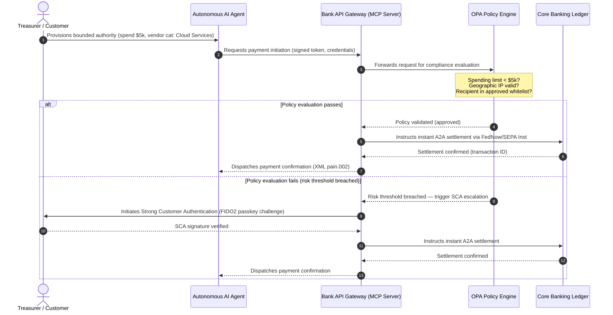

# ২০২৬ বৈশ্বিক পেমেন্ট আউটলুক: একটি এজেন্টিক, অদৃশ্য, রিয়েল-টাইম দুনিয়ায় অপারেটিং মডেল, ঝুঁকি ও রাজস্ব

২০২৬ সালের বৈশ্বিক পেমেন্ট চক্র তিনটি অভিসারী শক্তি দ্বারা সংজ্ঞায়িত — এজেন্টিক বাণিজ্য, অদৃশ্য এম্বেডেড পেমেন্ট এবং রিয়েল-টাইম নির্বাহ — যা Project Agorá-এর অধীনে একটি টোকেনাইজড একীভূত খতিয়ান এবং নভেম্বর ২০২৬-এর কঠোর SWIFT সংগঠিত-ঠিকানা সংক্রমণের উপর বসে আছে।

<!-- lead-start -->
<aside class="post-lead" aria-label="Article summary">

<strong>সংক্ষেপে।</strong> ২০২৬ সালের পেমেন্ট পরিদৃশ্য মেসেজিং স্থানান্তর থেকে এমন একটি বহুমাত্রিক অপারেটিং মডেলে চলে গেছে যেখানে ঝুঁকি ও রাজস্ব রিয়েল-টাইম নির্বাহ দ্বারা নির্ধারিত হয়। এই নিবন্ধটি J.P. Morgan, Global Payments, HSBC এবং Payments Association-এর ২০২৬ আউটলুকগুলিকে একটি চার-স্তম্ভ G-SIB অপারেটিং পরিকল্পনায় সমন্বিত করে, যা মডেল-সূচিত এজেন্টিক বাণিজ্য, সর্বদা-চালু ট্রেজারি API, BIS Project Agorá-এর অধীনে টোকেনাইজড একীভূত খতিয়ান এবং ১৪/১৫ নভেম্বর ২০২৬-এর SWIFT এবং SEPA সংগঠিত-ঠিকানা সময়সীমা কভার করে (Swift CBPR+ ১৪ নভেম্বর ২০২৬ থেকে অসংগঠিত `<AdrLine>` ব্লক সরিয়ে দেয়; EPC SEPA নিয়মাবলী শুধু ১৫ নভেম্বর ২০২৬ পর্যন্ত অসংগঠিত ঠিকানার অনুমতি দেয়)।

<strong>মূল পাঠ্যবিষয়</strong>

<ul class="post-lead-takeaways">
  <li><strong>এজেন্টিক বাণিজ্য একটি অর্পিত-দায়বদ্ধতার সীমান্ত উন্মোচন করছে।</strong> স্বায়ত্তশাসিত AI এজেন্টগুলি ২০৩০ সালের মধ্যে বার্ষিক $৩-$৫ ট্রিলিয়ন বাণিজ্য মধ্যস্থতা করবে বলে প্রক্ষিপ্ত। ব্যাংকগুলিকে MCP গেটকিপিং, PSD3/PSR-এর অধীনে SCA অর্পণ এবং বহু-এজেন্ট পেমেন্ট চেইনের ভিতরে KYC/AML-এর মালিকানা সংজ্ঞায়িত করতে হবে।</li>
  <li><strong>সর্বদা-চালু তরলতা এখন একটি পরিচালনাগত ও নিয়ন্ত্রক ভিত্তি।</strong> ২৪/৭ ট্রেজারি API এবং ভার্চুয়াল অ্যাকাউন্ট আটকে থাকা নগদ কমায় এবং স্থিতিস্থাপকতার মান উঁচু করে। সিস্টেমিক গুরুত্বপূর্ণ রিয়েল-টাইম ট্রেজারি API-এর জন্য, ফাইভ-নাইন (৯৯.৯৯৯ %) উপলব্ধতা ক্রমশ ব্যাংকগুলো নিজেদের জন্য নির্ধারিত অভ্যন্তরীণ ইঞ্জিনিয়ারিং লক্ষ্যে পরিণত হচ্ছে যাতে তারা তত্ত্বাবধায়কদের কাছে DORA-গ্রেড স্থিতিস্থাপকতা প্রদর্শন করতে পারে। DORA নিজে কোনো সর্বজনীন ফাইভ-নাইন থ্রেশহোল্ড নির্ধারণ করে না; এটি ICT ঝুঁকি ব্যবস্থাপনা, ঘটনা রিপোর্টিং, স্থিতিস্থাপকতা পরীক্ষা, তৃতীয় পক্ষের ঝুঁকি এবং গুরুত্বপূর্ণ ICT সরবরাহকারীদের তত্ত্বাবধান অন্তর্ভুক্ত করে।</li>
  <li><strong>টোকেনাইজেশন নিয়ন্ত্রিত একীভূত খতিয়ানে উন্নীত হয়েছে।</strong> Project Agorá হল টোকেনাইজড বাণিজ্যিক ব্যাংক আমানত এবং কেন্দ্রীয় ব্যাংক রিজার্ভের জন্য সবচেয়ে বড় সরকারি-বেসরকারি কাঠামো। ব্যাংকগুলির স্পষ্ট প্রুডেনশিয়াল ব্যবস্থার সাথে একটি পাঁচ-ধাপের টোকেনাইজেশন যাত্রা প্রয়োজন।</li>
  <li><strong>১৪/১৫ নভেম্বর ২০২৬-এর সংগঠিত-ঠিকানা সংক্রমণ কঠোরভাবে নির্ধারিত।</strong> Swift CBPR+ ১৪ নভেম্বর ২০২৬ থেকে অসংগঠিত `<AdrLine>` ব্লক সরিয়ে দেয়; EPC SEPA নিয়মাবলী শুধু ১৫ নভেম্বর ২০২৬ পর্যন্ত অসংগঠিত ঠিকানার অনুমতি দেয়। উভয়ই সংক্রমণের পর প্রত্যাখ্যান ট্রিগার করে। পণ্য, প্রযুক্তি এবং কমপ্লায়েন্স দলের মধ্যে পরিচ্ছন্ন ডেটা গভর্নেন্স প্রয়োজন।</li>
</ul>

<strong>সম্পর্কিত পঠন:</strong> <a href="https://sebastienrousseau.com/2026-06-23-iso-20022-pain001-programmable-liquidity-autonomic-treasury-2026">From Pain.001 to Programmable Liquidity: ISO 20022 as the Autonomic Nervous System of Treasury in 2026</a>, <a href="https://sebastienrousseau.com/2026-06-24-cross-border-iso-20022-open-finance-tokenised-deposits-treasury-2026">Cross-Border 2026: ISO 20022, Open Finance and Tokenised Deposits in Corporate Treasury</a>, <a href="https://sebastienrousseau.com/2026-06-25-quantum-dawn-cib-kyberlib-quantum-resilient-payments-stack-2026">Quantum Dawn for CIB: From KyberLib to a Quantum-Resilient Payments Stack</a>.

</aside>
<!-- lead-end -->

বৈশ্বিক লেনদেন ব্যাংকগুলির জন্য, ২০২৬-২০২৮ চক্র একটি কাঠামোগত সুযোগের জানালা। আধুনিক পেমেন্ট অবকাঠামো আর প্রশাসনিক সুবিধা নয় — এটি ব্যাংক-গ্রেড প্রযুক্তি কৌশলের কেন্দ্র। G-SIB এবং প্রধান আঞ্চলিক প্রতিষ্ঠানগুলির ভিতরে, প্রযুক্তি, নিয়ন্ত্রণ এবং গ্রাহকের প্রত্যাশা একটি অপারেটিং সমতলে অভিসারিত হয়েছে।

এই চক্রটি তিনটি শক্তি দ্বারা সংজ্ঞায়িত, এবং প্রতিটি সরাসরি একটি নির্বাহী-পরিষদ উদ্বেগের সাথে সংযুক্ত।

- **এজেন্টিক বাণিজ্য** — চ্যানেল বিতরণ, পণ্য নকশা, দায়বদ্ধতা বরাদ্দ, এবং তত্ত্বাবধায়ক পর্যবেক্ষণের অধীনে মডেল ঝুঁকি ব্যবস্থাপনা।
- **অদৃশ্য পেমেন্ট** — গ্রাহক অভিজ্ঞতা, যেখানে ব্যাংকগুলি কর্পোরেট ও ব্যবসায়ীদের ফ্রন্ট-এন্ডে তাদের খতিয়ান এম্বেড করতে ব্যর্থ হলে অবচ্ছেদনের ঝুঁকি থাকে।
- **রিয়েল-টাইম নির্বাহ** — মূলধন বেগ, যার ফলে তরলতা ব্যবস্থাপনা, ঋণ ঝুঁকি, পরিচালনাগত স্থিতিস্থাপকতা এবং জালিয়াতি প্রতিরক্ষায় পরিবর্তন।

আর্থিক ঝুঁকি বস্তুগত। জালিয়াতি গতি এবং অত্যাধুনিকতায় বৃদ্ধি পাচ্ছে; নিয়ন্ত্রক সময়সীমা কঠোর; এবং যে ব্যাংকগুলি সক্রিয়ভাবে তাদের কোর সিস্টেম আধুনিকীকরণ করে, তারা উল্লেখযোগ্য ফি-রাজস্বের সুযোগ উন্মুক্ত করে। নিষ্ক্রিয়তার মূল্য বিপরীত: অবিলম্বে লেনদেন প্রত্যাখ্যান, পরিচালনাগত বাধা, নিয়ন্ত্রক জরিমানা এবং দ্রুত বাজার-শেয়ার ক্ষয়।

## নিশ্চয়তার সিঁড়ি — কী তারিখযুক্ত, কী নিয়ন্ত্রিত, কী পূর্বাভাস

এই প্রতিবেদনের প্রতিটি বিষয় একই নিশ্চয়তা বহন করে না। বোর্ড-স্তরের প্রশ্ন হল কোন ডেল্টা সময়সীমা, কোনগুলো তত্ত্বাবধায়ক প্রত্যাশা এবং কোনগুলো এখনও বাজার পূর্বাভাস — কারণ উত্তরটি বাজেট আলোচনা পরিবর্তন করে।

| বিভাগ | উদাহরণ |
| --- | --- |
| **কঠোর সময়সীমা** | Swift CBPR+ সংগঠিত-ঠিকানা সংক্রমণ (১৪ নভেম্বর ২০২৬); EPC SEPA নিয়মাবলী (১৫ নভেম্বর ২০২৬) |
| **নিয়ন্ত্রক বাধ্যবাধকতা** | DORA ICT ঝুঁকি + স্থিতিস্থাপকতা পরীক্ষা + তৃতীয় পক্ষের তত্ত্বাবধান (EU); PSD3/PSR-এর অধীনে SCA অর্পণ; SR 11-7 + PRA SS1/23-এর অধীনে MRM |
| **উচ্চ-সম্ভাবনার বাজার পরিবর্তন** | রিয়েল-টাইম ট্রেজারি API, AI-নেতৃত্বাধীন জালিয়াতি প্রতিরক্ষা, API-ভিত্তিক তরলতা, ডিপফেক-চালিত বায়োমেট্রিক জালিয়াতি |
| **কৌশলগত বিকল্প** | টোকেনাইজড আমানত, Project Agorá-এর অধীনে একীভূত খতিয়ান, এজেন্টিক-বাণিজ্য করিডোর, অবিচ্ছিন্ন FX (Wire 365) |
| **পূর্বাভাস** | ২০৩০ সালের মধ্যে বার্ষিক $3-$5 trillion এজেন্টিক-বাণিজ্য প্রবাহ (McKinsey বেসলাইন) |

উপরের দুটি সারিকে কমপ্লায়েন্স তথ্য হিসাবে বিবেচনা করুন যা একটি বাজেট লাইন চালায়, ব্যাংক উপরের দিকে কিছু ধরে কি না সেটা নির্বিশেষে। নীচের দুটি সারিকে কৌশলগত বিকল্প হিসাবে বিবেচনা করুন — দিকনির্দেশে উচ্চ-আস্থার, কিন্তু যেখানে নির্বাহের সময় নিয়ন্ত্রকের ক্যালেন্ডার এন্ট্রির পরিবর্তে একটি বোর্ড পছন্দ।

## বৈশ্বিক পেমেন্ট কর্তৃপক্ষের অভিসরণ

এই প্রতিবেদনটি চারটি কর্তৃত্বপূর্ণ শিল্প কণ্ঠস্বরের ২০২৬ পেমেন্ট ও বাণিজ্য আউটলুকগুলি সমন্বিত করে — [J.P. Morgan Payments](https://www.jpmorgan.com/payments/newsroom/payments-outlook-2026-trends-report-released "J.P. Morgan Payments — Outlook 2026"), [Global Payments](https://investors.globalpayments.com/news-events/press-releases/detail/497/global-payments-releases-its-2026-commerce-and-payment "Global Payments — 2026 Commerce and Payment Trends Report"), HSBC এবং The Payments Association — এবং [G20 Roadmap for Enhancing Cross-Border Payments](https://www.fsb.org/2026/03/fsb-kicks-off-new-implementation-phase-to-enhance-cross-border-payments-through-public-private-partnership/ "FSB — cross-border payments implementation phase, March 2026")-এর বিরুদ্ধে এগুলি ত্রিভুজিত করে।

প্রতিটি সংস্থা ইকোসিস্টেমকে একটি ভিন্ন বাজার কোণ থেকে দেখে, কিন্তু তাদের অনুসন্ধান তিনটি অপরিবর্তনীয় বিষয়ে অভিসারিত হয়।

1. **তাৎক্ষণিক, API-চালিত রেল হল ভিত্তি।** সীমান্ত-পার এবং উচ্চ-মূল্যের প্রবাহের জন্য লিগ্যাসি ব্যাচ-প্রসেসিং মডেলগুলি প্রান্তিক হয়ে পড়েছে; সেই অংশগুলিতে লেনদেনের গতি সর্বদা-চালু, রিয়েল-টাইম মেসেজিং দ্বারা নির্ধারিত হয়।
2. **AI উভয়ই হুমকি ও প্রতিরক্ষা।** জেনারেটিভ সরঞ্জাম এবং ডিপফেক লেনদেন জালিয়াতি বৃদ্ধি করে, যা রিয়েল-টাইম, বহু-স্তরীয় মেশিন-লার্নিং প্রতি-প্রতিরক্ষা প্রয়োজনীয় করে তোলে।
3. **টোকেনাইজেশন উৎপাদন-প্রস্তুত অবকাঠামো।** খতিয়ানগুলি টোকেনাইজড বাণিজ্যিক দায়বদ্ধতা এবং পাইকারি কেন্দ্রীয় ব্যাংক ডিজিটাল মুদ্রা হোস্ট করতে একীভূত হচ্ছে।

| প্রতিবেদন | প্রাথমিক শ্রোতা | ফোকাস | মূল স্তম্ভ | ব্যাংক প্রভাব |
| --- | --- | --- | --- | --- |
| **J.P. Morgan Payments** | কর্পোরেট ট্রেজারার, G-SIB | রিয়েল-টাইম তরলতা, জালিয়াতি | API, AI বায়োমেট্রিক্স | অবিচ্ছিন্ন ৩৬৫-দিনের নিষ্পত্তির জন্য তরলতা, FX এবং ঝুঁকি সিস্টেম পুনর্নির্মাণ। |
| **Global Payments** | ব্যবসায়ী, ই-কমার্স | POS বিবর্তন, ওমনিচ্যানেল | এজেন্টিক বাণিজ্য, ঘর্ষণমুক্ত চেকআউট | স্বায়ত্তশাসিত AI এজেন্টদের জন্য সুরক্ষিত, API-গেটেড ব্যবসায়ী পেমেন্ট করিডোর তৈরি করুন। |
| **HSBC Insights** | বহুজাতিক কর্পোরেট | ERP ইন্টিগ্রেশন (SAP/Oracle), রিয়েল-টাইম নগদ | Treasury-as-a-Service, নগদ দৃশ্যমানতা | লেনদেনমূলক API স্যুট নগদীকরণ করুন এবং উৎসে রিয়েল-টাইম নগদ খতিয়ান প্রতিবেদন এম্বেড করুন। |
| **The Payments Association** | ফিনটেক, পেমেন্ট প্রতিষ্ঠান | স্টেবলকয়েন, টোকেনাইজেশন, বৈশ্বিক নিয়ন্ত্রণ | নিয়ন্ত্রিত ডিজিটাল সম্পদ, নীতি সম্মতি | টোকেনাইজড আমানতের জন্য ব্যালেন্স শিট প্রস্তুত করুন এবং PSD3/PSR দায়বদ্ধতা কাঠামো নেভিগেট করুন। |

চারটি আউটলুক কার্যকরভাবে সরকারি-খাত G20 নীতি অবকাঠামোর উপর চলা বেসরকারি-খাত অপারেটিং স্ট্যাককে সংজ্ঞায়িত করে, ব্যাংকের ভিতরে তরলতা, টোকেনাইজেশন, ডেটা এবং জালিয়াতি নিয়ন্ত্রণ সম্পর্কে নীতিগত উদ্দেশ্যকে কংক্রিট সিদ্ধান্তে রূপান্তর করে।

## স্তম্ভ ১ — এজেন্টিক বাণিজ্য এবং অদৃশ্য পেমেন্ট

এজেন্টিক বাণিজ্য হল মানব-চালিত, ক্লিক-টু-বাই চেকআউট থেকে স্বায়ত্তশাসিত, মডেল-চালিত লেনদেন সূচনায় উত্তরণ। শিল্প পূর্বাভাসগুলি ২০৩০ সালের মধ্যে স্বায়ত্তশাসিত এজেন্ট দ্বারা মধ্যস্থতা করা বার্ষিক $৩-$৫ ট্রিলিয়ন বাণিজ্যের উপর অভিসারিত হয়েছে — মানুষ 'কিনুন' ক্লিক না করেই নির্বাহিত বৈশ্বিক পেমেন্ট ভলিউমের একটি নিম্ন-একক-অংকের অংশ।

খুচরা এবং বাণিজ্যিক ইকোসিস্টেমে একটি সংশ্লিষ্ট ফাঁক রয়েছে। ভোক্তাদের একটি স্পষ্ট সংখ্যাগরিষ্ঠতা এখন প্রায়-ঘর্ষণমুক্ত পেমেন্ট আশা করে, তবুও অর্ধেকেরও কম ব্যবসায়ী এক-ক্লিক চেকআউট বা API-অ্যাক্সেসযোগ্য পণ্য ক্যাটালগকে অগ্রাধিকার দিয়েছে। AI এজেন্টগুলি মানুষের চোখের জন্য ডিজাইন করা লিগ্যাসি বহু-পৃষ্ঠার চেকআউট স্ক্রিন নেভিগেট করতে পারে না; তাদের সংগঠিত, মেশিন-টু-মেশিন API হ্যান্ডশেক প্রয়োজন।

### ব্যাংকের অগ্রাধিকার এবং পরিচালনাগত প্রভাব

- **KYC ও AML মালিকানা।** ব্যাংকগুলিকে সংজ্ঞায়িত করতে হবে কে একটি এজেন্টিক লেনদেন চেইনের ভিতরে কমপ্লায়েন্স বাধ্যবাধকতা ধরে রাখে। যদি একজন ভোক্তার ব্যক্তিগত AI এজেন্ট একটি ব্যবসায়ীর এজেন্টিক চেকআউটের মাধ্যমে একটি লেনদেন শুরু করে, তবে ব্যাংককে যাচাই করতে হবে যে সূচনাকারী অর্পিত কর্তৃত্ব ক্রিপ্টোগ্রাফিকভাবে প্রাথমিক অ্যাকাউন্টধারীর সাথে আবদ্ধ।
- **দায়বদ্ধতা এবং চার্জব্যাক পুনর্নকশা।** কার্ড স্কিম এবং A2A রেল মানব অনুমোদনের চারপাশে ডিজাইন করা হয়েছিল। যখন একটি AI এজেন্ট একটি ভুল ক্রয় করে — উদাহরণস্বরূপ, একটি ডেটা-পার্সিং ত্রুটির কারণে ভুল শিল্প ইনভেন্টরি সংগ্রহ করে — ব্যাংকগুলিকে ভোক্তা, এজেন্ট সরবরাহকারী এবং ব্যবসায়ীর মধ্যে দায়বদ্ধতা স্পষ্টভাবে বরাদ্দ করতে হবে।
- **এজেন্টিক প্রবাহের ঝুঁকি-রেটিং।** পেমেন্ট রাউটিং ইঞ্জিনগুলিকে গতিশীলভাবে এজেন্টিক পেমেন্টকে ঝুঁকি-রেট করতে হবে, একটি স্থিতিশীল নিষ্পত্তি ট্র্যাক রেকর্ড না থাকা পর্যন্ত অ-মানব-সূচিত লেনদেনের উপর উচ্চতর রিজার্ভ প্রয়োজনীয়তা বা ইন্টারচেঞ্জ হার প্রয়োগ করতে হবে।

### সীমাবদ্ধ ক্রিয়া এবং সীমাবদ্ধ কর্তৃত্ব

"অসীমাবদ্ধ ক্রিয়া" প্রশমিত করতে — একটি এন্টারপ্রাইজ প্রকিউরমেন্ট এজেন্ট সফটওয়্যার ত্রুটির কারণে একটি অসীম পুনরাবৃত্ত ক্রয় লুপ চালাচ্ছে — ব্যাংকগুলিকে **সীমাবদ্ধ-কর্তৃত্ব API গেট** স্থাপন করতে হবে। এই গেটগুলি তিনটি মাত্রা জুড়ে নীতি-স্তরের সীমা প্রয়োগ করে।

1. **স্তরীয় আর্থিক সীমা** — এজেন্ট ব্যয় লেনদেনের আকার, দৈনিক ক্রমবর্ধমান মূল্য এবং ব্যবসায়ী বিভাগ দ্বারা সীমিত।
2. **প্রসঙ্গ-সচেতন সুরক্ষা** — খতিয়ান তহবিল প্রকাশ করার আগে গৌণ সংকেত (সময়-দিন, IP জিওলোকেশন, লেনদেনের ফ্রিকোয়েন্সি) মূল্যায়ন করা হয়।
3. **মানব-ইন-দ্য-লুপ এসকেলেশন** — যখনই কোনো লেনদেন ঝুঁকির সীমা অতিক্রম করে তখন PSD3 / PSR-এর অধীনে Strong Customer Authentication (SCA)-এর মাধ্যমে বাধ্যতামূলক মানব অনুমোদন ট্রিগার করা হয়।

নীচের Mermaid ক্রমটি লক্ষ্য আর্কিটেকচার দেখায় যা অনেক ব্যাংক সীমাবদ্ধ-কর্তৃত্বের এজেন্টিক পেমেন্ট প্রবাহ হিসাবে স্বীকৃতি দেবে।

### Model Context Protocol (MCP)

স্থানীয়কৃত AI মডেলগুলিকে ব্যাংক-পরিচালিত নির্বাহ স্তরের সাথে সংযোগ করতে, শিল্পটি [Model Context Protocol (MCP)](https://modelcontextprotocol.io "Model Context Protocol — open standard for LLM tool integration")-এর চারপাশে মান নির্ধারণ করছে — একটি উন্মুক্ত প্রোটোকল যা LLM-গুলিকে কোর সিস্টেমে কাঁচা অ্যাক্সেস ছাড়াই স্পষ্টভাবে সীমাবদ্ধ, নিরীক্ষাযোগ্য সরঞ্জাম এবং API কল করতে দেয়।

একটি MCP সার্ভারের ভিতরে ব্যাংকিং API (পেমেন্ট সূচনা, ব্যালেন্স অনুসন্ধান, পক্ষ যাচাইকরণ) মোড়ানো LLM-গুলিকে ডাটাবেস টেবিল এবং সিস্টেম-রুট নিয়ন্ত্রণ থেকে দূরে রাখে। মডেলটি কেবল সংগঠিত, নিরীক্ষিত, রেট-সীমিত এন্ডপয়েন্টের মাধ্যমে খতিয়ানের সাথে ইন্টারঅ্যাক্ট করে — মডেলের ভিতরে চাপা না দিয়ে এজেন্টিক টুল নির্বাহের সীমানায় নিরাপত্তা প্রয়োগ করা হয়।

## স্তম্ভ ২ — ট্রেজারি রূপান্তর এবং পুনর্কল্পিত তরলতা

২০২৬ সালে লেনদেন ব্যাংকিংয়ের গতি দিন-শেষের ব্যাচ প্রসেসিং থেকে সর্বদা-চালু, রিয়েল-টাইম ট্রেজারি অপারেশনে স্থানান্তরের দ্বারা নির্ধারিত হয়। বহুজাতিক কর্পোরেটরা আর আটকে থাকা নগদ সহ্য করে না — সপ্তাহান্তে বা ছুটির দিনে স্থানীয় অ্যাকাউন্টে অলস বসে থাকা তরলতা কারণ নিষ্পত্তি সিস্টেমগুলি বন্ধ।

### রিয়েল-টাইম তরলতার অর্থনৈতিক যুক্তি

J.P. Morgan এবং HSBC উভয়েই রিপোর্ট করে যে উন্নত রিয়েল-টাইম নগদ এবং ডেটা ক্ষমতা সম্পন্ন কর্পোরেটগুলি রাজস্ব বৃদ্ধি এবং মূলধন দক্ষতায় সমকক্ষদের ছাড়িয়ে যাওয়ার সম্ভাবনা যথেষ্ট বেশি, প্রধানত আটকে থাকা তরলতা হ্রাস করে এবং কার্যকরী-মূলধন চক্র অপ্টিমাইজ করে।

সেই মূল্য ধরতে, ব্যাংকগুলি **Treasury-as-a-Service (TaaS) API পণ্য** শিপ করে যা কর্পোরেট ERP (SAP, Oracle) সরাসরি ব্যাংকের খতিয়ানে প্লাগ করতে দেয়।

- **রিয়েল-টাইম ব্যালেন্স API** `camt.052` স্কিমা ব্যবহার করে — ফাইল-ট্রান্সফার প্রোটোকলগুলিকে তাৎক্ষণিক, ইভেন্ট-চালিত নগদ-অবস্থান প্রতিবেদনের মাধ্যমে প্রতিস্থাপন করে।
- **বাল্ক পেমেন্ট সূচনা API** `pain.001` ব্যবহার করে — ERP খতিয়ান থেকে বিক্রেতা পেমেন্ট ব্যাচের সরাসরি, স্ট্রেইট-থ্রু নির্বাহ।
- **অবিচ্ছিন্ন FX API** — ট্রেজারি ইঞ্জিনগুলি সীমান্ত-পার নিষ্পত্তির জন্য রিয়েল-টাইম, অ্যালগরিদমিক বিদেশী-মুদ্রা হার লক করে, রাতারাতি বাজার-ফাঁক ঝুঁকি দূর করে।
- **ভার্চুয়াল অ্যাকাউন্ট API** — কর্পোরেটগুলি স্বয়ংক্রিয় প্রাপ্য মেলানো এবং খতিয়ান পৃথকীকরণের জন্য গতিশীলভাবে হাজার হাজার সাব-অ্যাকাউন্ট চালু এবং অবসর নেয়।

### পরিচালনাগত স্থিতিস্থাপকতা এবং DORA

সর্বদা-চালু তরলতা প্রদান ব্যাংকের ঝুঁকি প্রোফাইলকে রূপান্তরিত করে। সিস্টেমিক গুরুত্বপূর্ণ রিয়েল-টাইম ট্রেজারি API-এর জন্য, ফাইভ-নাইন (৯৯.৯৯৯ %) উপলব্ধতা ক্রমশ ব্যাংকগুলো নিজেদের জন্য নির্ধারিত অভ্যন্তরীণ ইঞ্জিনিয়ারিং লক্ষ্যে পরিণত হচ্ছে যাতে তারা তত্ত্বাবধায়কদের কাছে DORA-গ্রেড স্থিতিস্থাপকতা প্রদর্শন করতে পারে। DORA নিজে কোনো সর্বজনীন ফাইভ-নাইন থ্রেশহোল্ড নির্ধারণ করে না; এটি ICT ঝুঁকি ব্যবস্থাপনা, ঘটনা রিপোর্টিং, স্থিতিস্থাপকতা পরীক্ষা, তৃতীয় পক্ষের ঝুঁকি এবং গুরুত্বপূর্ণ ICT সরবরাহকারীদের তত্ত্বাবধান অন্তর্ভুক্ত করে।

[Digital Operational Resilience Act (DORA)](https://eur-lex.europa.eu/legal-content/EN/TXT/?uri=CELEX%3A32022R2554 "Regulation (EU) 2022/2554 — Digital Operational Resilience Act")-এর অধীনে, এটি একটি IT KPI নয় — এটি একটি কঠোর নিয়ন্ত্রক প্রয়োজনীয়তা। নিয়ন্ত্রকরা আশা করেন যে ব্যাংকগুলি প্রমাণ করবে যে রিয়েল-টাইম ট্রেজারি API পৃষ্ঠ এবং খতিয়ান ডাটাবেস গুরুতর-কিন্তু-সম্ভাব্য সাইবার আক্রমণ, নেটওয়ার্ক বিভ্রাট এবং হাইপারস্কেলার ব্যাঘাত শোষণ করতে পারে — গুরুত্বপূর্ণ পেমেন্ট বাধাগ্রস্ত না করে বা সিস্টেমিক তরলতা আপস না করে। এর জন্য ভৌগোলিকভাবে অপ্রয়োজনীয়, সক্রিয়-সক্রিয় মাল্টি-ক্লাউড ডাটাবেস আর্কিটেকচার, রিয়েল-টাইম হুমকি-শনাক্তকরণ স্তর এবং স্বয়ংক্রিয় ফেইলওভার প্রয়োজন — পরিবর্তন খরচ লাইনে দৃশ্যমান, কেবল অডিট ডসিয়ার নয়।

### অবিচ্ছিন্ন FX এবং সীমান্ত-পার উদ্ভাবন

রিয়েল-টাইম ট্রেজারি একটি একক-মুদ্রা সীমার ভিতরে বাস করতে পারে না। G-SIB-গুলি অবিচ্ছিন্ন FX অবকাঠামো স্থাপন করছে — J.P. Morgan-এর [Wire 365](https://www.jpmorgan.com/insights/payments/fx-cross-border/wire-365-global-clearing "J.P. Morgan — Wire 365 global clearing reinvented") প্ল্যাটফর্ম প্রথাগত কেন্দ্রীয়-ব্যাংক RTGS সময়ের বাইরে, বছরের যে কোনো দিন সীমান্ত-পার পেমেন্ট এবং FX রূপান্তর প্রক্রিয়া করে। সেই স্তরটি স্তম্ভ ৩-এ আলোচিত টোকেনাইজড-আমানত এবং একীভূত-খতিয়ান সিস্টেমের সাথে সরাসরি ইন্টারলক করে।

## স্তম্ভ ৩ — টোকেনাইজড আমানত এবং একীভূত খতিয়ান

টোকেনাইজেশন বিচ্ছিন্ন প্রুফ-অফ-কনসেপ্ট পাইলট থেকে স্কেলযুক্ত, ব্যাংক-গ্রেড আর্থিক অবকাঠামোতে উন্নীত হয়েছে। ফোকাস ব্যক্তিগত স্টেবলকয়েন এবং অনুমানমূলক ক্রিপ্টোসম্পদ থেকে **টোকেনাইজড বাণিজ্যিক ব্যাংক আমানত** এবং প্রোগ্রামেবল একীভূত খতিয়ানে চলমান **পাইকারি কেন্দ্রীয় ব্যাংক ডিজিটাল মুদ্রা (wCBDC)**-এ স্থানান্তরিত হয়েছে।

রেফারেন্স কাঠামো হল [Project Agorá](https://www.bis.org/about/bisih/topics/fmis/agora.htm "BIS Project Agorá — tokenisation of wholesale cross-border payments") — BIS এবং IIF দ্বারা আহ্বানকৃত একটি বড় সরকারি-বেসরকারি সহযোগিতা, যাতে **আটটি কেন্দ্রীয় ব্যাংক** এবং ৪০-এর বেশি বেসরকারি আর্থিক প্রতিষ্ঠান জড়িত (BIS Agorá পৃষ্ঠা অনুসারে, ২৭ মে ২০২৬ আপডেট)। প্রকল্পটি অন্বেষণ করে যে টোকেনাইজড বাণিজ্যিক ব্যাংক আমানত কীভাবে একটি ভাগ করা প্রোগ্রামেবল খতিয়ানে টোকেনাইজড পাইকারি CBDC-এর সাথে একত্রিত হয় যাতে সীমান্ত-পার নিষ্পত্তি ঘর্ষণ দূর করা যায়, কমপ্লায়েন্স পরীক্ষাগুলিকে সমন্বয় করা যায় এবং ২৪/৭ পরমাণু চূড়ান্ততা সক্ষম করা যায়।

### পাঁচ-ধাপের টোকেনাইজেশন যাত্রা

G-SIB এবং প্রধান আঞ্চলিক ব্যাংকগুলির জন্য, টোকেনাইজেশন অভ্যন্তরীণ অপ্টিমাইজেশন থেকে উন্মুক্ত-বাজার আন্তঃচালনাযোগ্যতা পর্যন্ত একটি ধাপে ধাপে যাত্রা।

1. **অভ্যন্তরীণ ট্রেজারি তরলতা** — অভ্যন্তরীণ কর্পোরেট নগদ ব্যালেন্স টোকেনাইজ করা (যেমন JPM Coin বা সমতুল্য বেসরকারি ব্যাংক খতিয়ান) যাতে ব্যাংকের নিজস্ব শাখা জুড়ে তাৎক্ষণিক, ২৪/৭ সীমান্ত-পার স্থানান্তর এবং নেটিং সক্ষম হয়।
2. **সীমাবদ্ধ বহু-ব্যাংক করিডোর** — বন্ধ, নিয়ন্ত্রিত কনসোর্টিয়া (Project Agorá স্যান্ডবক্স) যাতে বিভিন্ন প্রতিষ্ঠান জুড়ে আন্তঃব্যাংক নিষ্পত্তি এবং ভাগ করা খতিয়ান অবস্থা পরীক্ষা করা যায়।
3. **অবিচ্ছিন্ন প্রোগ্রামেবল FX** — একীভূত খতিয়ানে স্মার্ট চুক্তিগুলি তাৎক্ষণিক Payment-versus-Payment (PvP) FX নির্বাহ করে, সময় অঞ্চল জুড়ে নিষ্পত্তি ঝুঁকি দূর করে।
4. **টোকেনাইজড রিয়েল-ওয়ার্ল্ড সম্পদ (RWA)** — টোকেনাইজড নগদ লেগ তাৎক্ষণিক Delivery-versus-Payment (DvP) চূড়ান্ততার জন্য টোকেনাইজড সিকিউরিটি, ঋণ বা ট্রেড খতিয়ানের সাথে একত্রিত হয়, মূলধন লক-আপ দিন থেকে মিলিসেকেন্ডে কমিয়ে দেয়।
5. **নিয়ন্ত্রিত সরকারি/হাইব্রিড আন্তঃচালনাযোগ্যতা** — সুরক্ষিত গেটওয়ে র‍্যাপারগুলি প্রাতিষ্ঠানিক তরলতাকে উন্মুক্ত সরকারি নেটওয়ার্কের সাথে নিরাপদে ইন্টারঅ্যাক্ট করতে দেয়।

### প্রুডেনশিয়াল এবং ব্যালেন্স-শিট প্রভাব

টোকেনাইজড নগদকে প্রুডেনশিয়াল কাঠামোর মাধ্যমে সাবধানে নেভিগেট করতে হবে। তত্ত্বাবধায়করা জোর দেন যে একটি টোকেনাইজড আমানত একটি প্রথাগত বাণিজ্যিক ব্যাংক আমানতের সাথে অর্থনৈতিকভাবে সমতুল্য হতে হবে — মানে একই আমানত-বীমা কভারেজ সহ ব্যাংকের ব্যালেন্স শিটে একটি অসুরক্ষিত দায়।

পরিচালনাগতভাবে, টোকেনাইজড আমানতগুলি এমন ঝুঁকি প্রবর্তন করে যা ক্লাসিক্যাল তরলতা স্ট্রেস মডেলগুলি অনুকরণ করার জন্য নির্মিত হয়নি। স্মার্ট চুক্তিগুলি প্রোগ্রামেবল উইথড্রয়াল এমন গতি এবং ভলিউমে নির্বাহ করে যা লিগ্যাসি অনুমানগুলি ধারণ করে না। Basel III-এর অধীনে, ব্যাংকগুলিকে নিশ্চিত করতে হবে যে ঝুঁকি ইঞ্জিন প্রোগ্রামেবল নগদ রান-অফ মডেল করতে পারে এবং টোকেনাইজড খতিয়ান দৈনিক তরলতা চক্রের মাধ্যমে লিগ্যাসি RTGS সিস্টেমের সাথে পরিষ্কারভাবে আন্তঃচালনাযোগ্য।

### স্টেবলকয়েন বনাম টোকেনাইজড আমানত — একটি সূক্ষ্ম অবস্থান

ব্যক্তিগত সম্পূর্ণ-সংরক্ষিত স্টেবলকয়েন (USDC, ইত্যাদি) খুচরা সীমান্ত-পার রেমিট্যান্স এবং বিকেন্দ্রীকৃত বাণিজ্যে বাজার শেয়ার ধরে রাখতে থাকে, কিন্তু বাণিজ্যিক ব্যাংকিং সিস্টেমের ঋণ-সৃষ্টির ক্ষমতা এবং নিষ্পত্তি চূড়ান্ততার অভাব রয়েছে।

খুচরা রেলে প্রতিযোগিতা না করে, লেনদেন ব্যাংকগুলি কাস্টডি প্রতিষ্ঠা করছে, তাদের নিজস্ব নিয়ন্ত্রিত টোকেনাইজড দায়বদ্ধতা উপকরণ ইস্যু করছে এবং সুরক্ষিত অন-/অফ-র‍্যাম্প গেটওয়ে তৈরি করছে। কর্পোরেট ক্লায়েন্টরা নিয়ন্ত্রিত পরিধির ভিতরে মূলধন রেখে প্রোগ্রামিং নমনীয়তা পায়।

### টোকেনাইজড অর্থ সম্পর্কে একটি বোর্ডকে যে প্রশ্ন জিজ্ঞাসা করা উচিত

- **একীভূত খতিয়ানে অংশগ্রহণ।** Project Agorá-এর মতো পাইকারি সরকারি-বেসরকারি একীভূত-খতিয়ান উদ্যোগে অংশগ্রহণের জন্য আমাদের সক্রিয় কৌশলগত রোডম্যাপ কী?
- **ব্যালেন্স শিট এবং ঝুঁকি মডেলিং।** আমাদের ঝুঁকি ইঞ্জিন এবং মূলধন-পর্যাপ্ততা কাঠামো কি স্মার্ট-চুক্তি-ট্রিগার করা টোকেন রান-অফের গতির জন্য স্ট্রেস-টেস্টিং আপডেট করেছে?
- **প্রথম-স্থানান্তরকারী ক্লায়েন্ট অংশ।** আমাদের কোন কর্পোরেট-ট্রেজারি এবং বাণিজ্যিক-ব্যাংকিং ক্লায়েন্ট অংশগুলি প্রোগ্রামেবল, টোকেনাইজড DvP/PvP নিষ্পত্তি থেকে অবিলম্বে উপকৃত হবে?

## স্তম্ভ ৪ — সংগঠিত ডেটা এবং জালিয়াতি প্রতিরক্ষা

২০২৬ সালে অবকাঠামো কমপ্লায়েন্স **১৪/১৫ নভেম্বর ২০২৬-এর সংগঠিত-ঠিকানা সংক্রমণ** দ্বারা প্রভাবিত — দুটি সংলগ্ন সময়সীমা যা একত্রে সীমান্ত-পার এবং অভ্যন্তরীণ-EU রেল জুড়ে অসংগঠিত-ঠিকানার পথ বন্ধ করে। [SWIFT Standards Release (SR) 2026](https://www.swift.com/standards/iso-20022/removal-unstructured-address "SWIFT — Removal of unstructured address, November 2026")-এর অধীনে, Swift CBPR+ **১৪ নভেম্বর ২০২৬** থেকে সম্পূর্ণ অসংগঠিত `<AdrLine>` ব্লক গ্রহণ বন্ধ করে দেয়। ২০২৫ সালের EPC SEPA নিয়মাবলীর অধীনে, অসংগঠিত ঠিকানা বিন্যাস কেবল **১৫ নভেম্বর ২০২৬** পর্যন্ত অনুমোদিত। সংক্রমণের পর, যে কোনো সীমান্ত-পার বা গার্হস্থ্য বার্তা যেখানে সংগঠিত উপাদান প্রত্যাশিত সেখানে একটি অসংগঠিত ঠিকানা বহন করলে নেটওয়ার্ক দ্বারা বিলম্বিত বা প্রত্যাখ্যাত হবে।

বেশিরভাগ প্রতিষ্ঠান তারিখটি জানে। অনেকে এটিকে ইন্টারফেস স্তরে একটি উপরিভাগের ম্যাপিং অনুশীলন হিসাবে বিবেচনা করে। বাস্তবতা একটি গভীর ডেটা-গুণমান এবং ডেটা-গভর্নেন্স চ্যালেঞ্জ। বিপর্যয়কর প্রত্যাখ্যান হার এড়াতে, পেমেন্ট অপারেশনগুলির একটি স্পষ্ট আন্তঃ-কার্যকরী গভর্নেন্স ফ্রেম প্রয়োজন।

- **পণ্য ও অপারেশন।** উৎসে ডেটা ক্যাপচার। গ্রাহক-মুখী ডিজিটাল পোর্টাল, অনবোর্ডিং ইন্টারফেস এবং কর্পোরেট ERP ইনপুট ক্ষেত্রগুলি পেমেন্ট সূচনার সময় সংগঠিত ঠিকানা ক্ষেত্র (`<StrtNm>`, `<PstCd>`, `<TwnNm>`, `<Ctry>`) প্রয়োগ করতে হবে।
- **প্রযুক্তি।** পার্সিং, ম্যাপিং, স্কিমা যাচাইকরণ। যাচাইকরণ ইঞ্জিনগুলি লিগ্যাসি ফাইলগুলিকে SWIFT ইন্টারফেসে আঘাত করার আগে ব্লক করে। স্থানীয়ভাবে স্থাপন করা মেশিন-লার্নিং মডেলগুলি লিগ্যাসি অসংগঠিত ঠিকানা ব্লককে `<PstlAdr>`-এর অধীনে XML-সঙ্গতিপূর্ণ ট্যাগে পার্স করে।
- **কমপ্লায়েন্স এবং ঝুঁকি।** নিষেধাজ্ঞা স্ক্রিনিং, লেনদেন পর্যবেক্ষণ এবং AML যুক্তি সংগঠিত XML ক্ষেত্রগুলি গ্রহণ করতে আপডেট করা হয়েছে — মিথ্যা-ইতিবাচক হার এবং ম্যানুয়াল তদন্ত কমিয়ে দেয়।

### সংগঠিত ডেটার জন্য ব্যবসায়িক যুক্তি

কমপ্লায়েন্স খরচ হিসাবে বিবেচিত হলে, সংগঠিত-ডেটা প্রোগ্রামটি ব্যয়বহুল। রাজস্ব সক্ষমকারী হিসাবে বিবেচিত হলে, এটি নিজের জন্য অর্থ প্রদান করে।

1. **উন্নত ঋণ সিদ্ধান্ত গ্রহণ।** সংগঠিত চালান, রেমিট্যান্স এবং চূড়ান্ত-ঋণগ্রহীতা ডেটা ব্যাংকগুলিকে কর্পোরেট ক্লায়েন্টদের জন্য স্বয়ংক্রিয়, সুনির্দিষ্ট কার্যকরী-মূলধন অর্থায়ন এবং সরবরাহ-শৃঙ্খল চালান-ফ্যাক্টরিং প্রোগ্রাম তৈরি করতে দেয়।
2. **স্বয়ংক্রিয় প্রাপ্য মেলানো।** সংগঠিত পক্ষ এবং চালান শনাক্তকারী প্রকাশ প্রিমিয়াম নগদ-সমন্বয় এবং ভার্চুয়াল-অ্যাকাউন্ট পুলিং পণ্যকে সমর্থন করে, নতুন লেনদেন-ফি রাজস্ব তৈরি করে।
3. **নগদীকরণযোগ্য লেনদেন বিশ্লেষণ।** ব্যাংকগুলি কর্পোরেট CFO এবং ট্রেজারারদের কাছে সূক্ষ্ম রিয়েল-টাইম তরলতা এবং ক্রয়-প্যাটার্ন বিশ্লেষণ ড্যাশবোর্ড প্যাকেজ এবং বিক্রি করে।

### একটি স্তরযুক্ত AI জালিয়াতি প্রতিরক্ষা

লেনদেনের গতি রিয়েল-টাইমে ত্বরান্বিত হওয়ার সাথে সাথে, জালিয়াতি কৌশলগুলি স্কেল করেছে। [Entrust 2026 পরিচয় জালিয়াতি প্রতিবেদন](https://www.entrust.com/resources/reports/identity-fraud-report "Entrust 2026 Identity Fraud Report") ডিপফেককে **পাঁচটি বায়োমেট্রিক জালিয়াতি প্রচেষ্টার মধ্যে একটি** হিসাবে স্থাপন করে; পূর্ববর্তী Entrust বিশ্লেষণ ডিপফেককে বিশেষভাবে **ভিডিও বায়োমেট্রিক জালিয়াতি প্রচেষ্টার ৪০ %** এ স্থাপন করেছিল। উভয় কাঠামোতে, সিন্থেটিক মিডিয়া এখন অনবোর্ডিং এবং পেমেন্ট প্রবাহে ভয়েস এবং মুখ-শনাক্তকরণ নিয়ন্ত্রণ পরাস্ত করার জন্য একটি বস্তুগত চ্যানেল।

প্রতিরক্ষা হল একটি **তিন-স্তরের AI জালিয়াতি মডেল**।

1. **পরিচয় স্তর।** বায়োমেট্রিকভাবে যাচাইকৃত [FIDO2](https://fidoalliance.org/fido2/ "FIDO Alliance — FIDO2 specification") পাসকি, ক্রিপ্টোগ্রাফিকভাবে স্বাক্ষরিত হার্ডওয়্যার ডিভাইস-বাইন্ডিং এবং পেমেন্ট অ্যাক্সেস সুরক্ষিত করতে বিকেন্দ্রীকৃত ডিজিটাল ID ওয়ালেট।
2. **আচরণগত স্তর।** অবিচ্ছিন্ন আচরণগত বায়োমেট্রিক্স — সেশন নেভিগেশন গতি, টাইপিং ছন্দ, ডিভাইস ওরিয়েন্টেশন — স্বয়ংক্রিয় বট নির্বাহ বা সেশন-হাইজ্যাক প্রচেষ্টা সনাক্ত করতে।
3. **লেনদেন স্তর।** ISO 20022-এর সংগঠিত ক্ষেত্রগুলি রিয়েল-টাইম মেশিন-লার্নিং ঝুঁকি ইঞ্জিনগুলিতে ফিড করে, সূচনার মিলিসেকেন্ডের মধ্যে সন্দেহজনক লেনদেন শনাক্ত করতে ভাগ করা নেটওয়ার্ক-স্তরের কনসোর্টিয়াম গোয়েন্দা তথ্যের সাথে লেনদেন মেটাডেটাকে ক্রস-রেফারেন্স করে।

তত্ত্বাবধায়কদের সন্তুষ্ট করতে, লেনদেন-স্তর AI মডেলগুলি কঠোর **ব্যাখ্যাযোগ্যতা পরামিতি** অন্তর্ভুক্ত করে এবং একটি নিবেদিত Model Risk Management (MRM) প্রোগ্রামের অধীনে কাজ করে। নিয়ন্ত্রকরা [US Federal Reserve SR 11-7](https://www.federalreserve.gov/frrs/guidance/supervisory-guidance-on-model-risk-management.htm "US Federal Reserve — Supervisory Guidance on Model Risk Management, SR 11-7") এবং Bank of England-এর [PRA SS1/23](https://www.bankofengland.co.uk/prudential-regulation/publication/2023/may/model-risk-management-principles-for-banks-ss "Bank of England PRA SS1/23 — Model Risk Management principles for banks")-এর সাথে সঙ্গতি রেখে ব্যাংকগুলি ব্যাখ্যা করবে বলে আশা করেন যে নির্দিষ্ট ডেটা পয়েন্ট এবং অ্যালগরিদমিক যুক্তি একটি স্বয়ংক্রিয় ব্লক বা জালিয়াতি সতর্কতা ট্রিগার করেছে।

## ২০২৬-২০২৮ বোর্ডরুম এজেন্ডা

চারটি স্তম্ভ জুড়ে কার্যকর করতে, G-SIB এবং আঞ্চলিক ব্যাংক ব্যবস্থাপনা সংস্থাগুলিকে একটি স্পষ্ট তিন-দিগন্ত রোডম্যাপ বরাবর পরিচালনাগত এবং প্রযুক্তি বিনিয়োগ সংগঠিত করা উচিত।

### দিগন্ত ১ — অবিলম্বে কমপ্লায়েন্স এবং কোর হার্ডেনিং (০-১২ মাস)

- **ফোকাস।** ISO 20022 ডেটা গুণমান মানসম্মত করুন এবং মৌলিক রিয়েল-টাইম লেনদেন পথ সুরক্ষিত করুন।
- **সাফল্য সূচক (KPI)।** ১৪/১৫ নভেম্বর ২০২৬-এর সংক্রমণের পর SWIFT এবং SEPA-তে শূন্য অসংগঠিত-ঠিকানা প্রত্যাখ্যান।
- **নির্বাহী মালিক।** চিফ অপারেটিং অফিসার / হেড অফ পেমেন্ট অপারেশনস।
- **ডেলিভারেবল প্রকার।** নো-রিগ্রেট পদক্ষেপ। কোর ডাটাবেস স্কিমা আপডেট এবং SWIFT SR 2026 যাচাইকরণ ইঞ্জিন।

### দিগন্ত ২ — অটোমেশন এবং এজেন্টিক সুরক্ষা (১২-২৪ মাস)

- **ফোকাস।** সীমাবদ্ধ এজেন্টিক API গেট এবং অবিচ্ছিন্ন জালিয়াতি-প্রতিরক্ষা আর্কিটেকচার।
- **সাফল্য সূচক (KPI)।** মেশিন-টু-মেশিন এবং AI-সূচিত API লেনদেনের ১০০% FIDO2 হার্ডওয়্যার বাইন্ডিং এবং সীমাবদ্ধ-কর্তৃত্ব নীতি ইঞ্জিনের মাধ্যমে যাচাইকৃত।
- **নির্বাহী মালিক।** চিফ ইনফরমেশন অফিসার / চিফ রিস্ক অফিসার।
- **ডেলিভারেবল প্রকার।** নো-রিগ্রেট পদক্ষেপ (জালিয়াতি প্রতিরক্ষা) প্লাস কৌশলগত বিকল্প (এজেন্টিক বাণিজ্য)। MCP রোলআউট এবং তিন-স্তরের জালিয়াতি AI।

### দিগন্ত ৩ — প্ল্যাটফর্ম টোকেনাইজেশন এবং একীভূত খতিয়ান (২৪-৩৬ মাস)

- **ফোকাস।** ট্রেজারি সম্পদকে টোকেনাইজড আমানতে স্থানান্তর করুন এবং ভাগ করা সীমান্ত-পার খতিয়ানে অংশগ্রহণ করুন।
- **সাফল্য সূচক (KPI)।** উচ্চ-মূল্যের কর্পোরেট ট্রেজারি নিষ্পত্তি ভলিউমের অন্তত ১৫% টোকেনাইজড আমানত উপকরণ বা একীভূত-খতিয়ান ব্যবস্থার মাধ্যমে নেটিভভাবে প্রক্রিয়াজাত (যেমন Project Agorá করিডোর)।
- **নির্বাহী মালিক।** গ্রুপ ট্রেজারার / হেড অফ ট্রানজ্যাকশন ব্যাংকিং।
- **ডেলিভারেবল প্রকার।** কৌশলগত বিকল্প। প্রোগ্রামেবল খতিয়ান অবকাঠামো, স্মার্ট-চুক্তি তরলতা নিয়ম, DvP/PvP নিষ্পত্তি অ্যাডাপ্টার।

## সোমবার সকালে কী করতে হবে — ব্যাংকগুলোর জন্য ছয়-পয়েন্ট চেকলিস্ট

তিন-দিগন্ত রোডম্যাপ হল চক্র পরিকল্পনা। নীচের চেকলিস্ট হল একজন CIO, COO বা Head of Transaction Banking পরের কর্মসপ্তাহের শেষে যা টেবিলে রাখতে পারেন, বাকি প্রোগ্রাম যতই পরিপক্ব হোক না কেন।

1. **চ্যানেল এবং বার্তা প্রকার অনুসারে অসংগঠিত ঠিকানা এক্সপোজার তালিকাভুক্ত করুন।** প্রতিটি লিগ্যাসি ফাইল রুট, প্রতিটি লিগ্যাসি API এন্ডপয়েন্ট, প্রতিটি কর্পোরেট ERP যা এখনও মুক্ত-টেক্সট `<AdrLine>` নির্গত করে। আউটপুট: প্রতি উৎসে একটি গণনা, একজন মালিক এবং একটি প্রতিকার তারিখ।
2. **একটি এজেন্টিক-পেমেন্ট ঝুঁকি শ্রেণীবিন্যাস প্রতিষ্ঠা করুন।** অ-মানব-সূচিত প্রবাহকে সূচনা পদ্ধতি (ভোক্তা এজেন্ট, ব্যবসায়ী এজেন্ট, কর্পোরেট প্রকিউরমেন্ট এজেন্ট), প্রতিপক্ষ প্রকার এবং রেল অনুযায়ী শ্রেণীবদ্ধ করুন। আউটপুট: একটি এক-পৃষ্ঠার শ্রেণীবিন্যাস এবং একটি রাউটিং-ইঞ্জিন টিকিট।
3. **AI-সূচিত পেমেন্টের জন্য অর্পিত-কর্তৃত্ব নীতি সীমা সংজ্ঞায়িত করুন।** টিকিট আকার, ব্যবসায়ী বিভাগ, ভূগোল দ্বারা স্তরীয় সীমা। আউটপুট: একটি খসড়া নীতি-কোড হিসাবে স্পেক যা OPA ইঞ্জিন প্রয়োগ করতে পারে।
4. **DORA-গুরুত্বপূর্ণ ট্রেজারি API এবং তৃতীয় পক্ষের নির্ভরতা ম্যাপ করুন।** কোন API গুরুতর-কিন্তু-সম্ভাব্য দৃশ্যকল্প তালিকায় বসে; তারা কোন তৃতীয় পক্ষের উপর নির্ভর করে; কোন চুক্তি ইতিমধ্যে DORA Article 28 মেটায়। আউটপুট: প্রতি API-তে একটি গুরুত্বপূর্ণ-ICT-তৃতীয়-পক্ষ রেজিস্টার সারি।
5. **পরিমাপযোগ্য ট্রেজারি মূল্য সহ দুটি টোকেনাইজড-আমানত ব্যবহার ক্ষেত্র চিহ্নিত করুন।** অভ্যন্তরীণ ক্রস-ব্রাঞ্চ নেটিং এবং একটি একক Project-Agorá-সংলগ্ন করিডোর হল বাস্তবসম্মত প্রথম দুটি। আউটপুট: প্রত্যেকের জন্য একটি আকারিত ব্যবসায়িক ক্ষেত্র, মালিক এবং ৯০-দিনের সিদ্ধান্ত তারিখ সহ।
6. **জালিয়াতি এবং এজেন্টিক সিদ্ধান্ত গ্রহণের জন্য একটি মডেল-ঝুঁকি নিয়ন্ত্রণ কাঠামো তৈরি করুন।** জালিয়াতি এবং এজেন্টিক-পেমেন্ট পথের প্রতিটি ML মডেলকে SR 11-7 / PRA SS1/23 প্রত্যাশায় ম্যাপ করুন: নথিভুক্ত উদ্দেশ্য, ডেটা বংশতালিকা, ব্যাখ্যাযোগ্যতা, পর্যবেক্ষণ, ওভাররাইড পথ। আউটপুট: প্রতি মডেলে একটি এক-পৃষ্ঠার MRM নিয়ন্ত্রণ ম্যাট্রিক্স।

তালিকার মূল কথা এই নয় যে এর কোনোটি অভিনব। মূল কথা হল এটি এই সপ্তাহে শুরু করার জন্য যথেষ্ট ছোট, পরবর্তী নির্বাহী কমিটিতে ট্র্যাক করার জন্য যথেষ্ট পর্যবেক্ষণযোগ্য, এবং চারটি স্তম্ভের সাথে কাঠামোগতভাবে সঙ্গতিপূর্ণ যাতে প্রাথমিক কাজ প্রোগ্রামকে খাওয়ায়, এর সাথে প্রতিযোগিতা না করে।

## FAQ

**এজেন্টিক বাণিজ্য কি সত্যিই ২০৩০ সালের মধ্যে $৩-$৫ ট্রিলিয়নে পৌঁছাবে?**
McKinsey বেসলাইন ২০৩০ সালের মধ্যে এজেন্টিক বাণিজ্য বিক্রিতে $৫ ট্রিলিয়ন নির্দেশ করে, $৩ ট্রিলিয়ন এবং $৫ ট্রিলিয়নের মধ্যে গুচ্ছিত স্বাধীন পূর্বাভাসের একটি পরিসীমা সহ। প্রকরণটি প্রতিফলিত করে যে ব্যবসায়ীরা কতটা আক্রমণাত্মকভাবে মেশিন-পাঠযোগ্য চেকআউট API শিপ করে এবং ব্যাংকগুলি কত দ্রুত SCA অর্পণের অধীনে এজেন্টদের লেনদেন করতে দেয় — বাধাটি ব্যাংক এবং ব্যবসায়ীর দিকে, এজেন্ট ক্ষমতার দিকে নয়।

**১৪/১৫ নভেম্বর ২০২৬-এর SWIFT এবং SEPA সংক্রমণ কি গার্হস্থ্য SEPA প্রবাহেও প্রযোজ্য?**
হ্যাঁ। সংগঠিত-ঠিকানা প্রয়োজনীয়তা CBPR+ সীমান্ত-পার এবং SEPA পেমেন্ট বার্তায় প্রযোজ্য। উভয় রেল চালানো ব্যাংকগুলির SWIFT ইন্টারফেসের আপস্ট্রিমে একটি একক ক্যানোনিকাল ঠিকানা স্কিমা প্রয়োজন, দুটি সমান্তরাল ম্যাপিং নয়।

**একটি টোকেনাইজড আমানত কি একটি স্টেবলকয়েনের সমান?**
না। একটি টোকেনাইজড আমানত হল একটি নিয়ন্ত্রিত ব্যাংকের ব্যালেন্স শিটে একটি অসুরক্ষিত দায়, একটি প্রথাগত আমানতের মতো একই আমানত-বীমা কভারেজ সহ। একটি স্টেবলকয়েন সাধারণত একটি অ-ব্যাংক দ্বারা ইস্যু করা একটি সম্পূর্ণ-সংরক্ষিত উপকরণ, ঋণ-সৃষ্টির ক্ষমতা ছাড়া। Project Agorá-এর নকশা ধরে নেয় যে টোকেনাইজড আমানত একটি ভাগ করা প্রোগ্রামেবল খতিয়ানে পাইকারি CBDC-এর পাশে বসে; স্টেবলকয়েন পাইকারি নিষ্পত্তি লেগে বৈশিষ্ট্যযুক্ত নয়।

**Project Agorá বিদ্যমান wCBDC পাইলটের সাথে কীভাবে সম্পর্কিত?**
Agorá হল একীকরণ কাঠামো। জাতীয় wCBDC পরীক্ষাগুলি কেন্দ্রীয়-ব্যাংক-অর্থ লেগ কভার করে; Agorá টোকেনাইজড বাণিজ্যিক আমানতকে একই প্রোগ্রামেবল খতিয়ানে নিয়ে আসে যাতে সীমান্ত-পার নিষ্পত্তি উভয় অর্থ প্রকার জুড়ে পরমাণু হয়। আটটি অংশগ্রহণকারী কেন্দ্রীয় ব্যাংক এবং ৪০+ বেসরকারি প্রতিষ্ঠান এটিকে পাইকারি টোকেনাইজড অর্থ স্থাপত্যের জন্য সবচেয়ে বড় সরকারি-বেসরকারি নকশা ক্ষেত্র করে তোলে।

**একটি TaaS API-এর জন্য ন্যূনতম DORA কমপ্লায়েন্স অবস্থান কী?**
ভৌগোলিকভাবে অপ্রয়োজনীয় সক্রিয়-সক্রিয় স্থাপনা, SM&CR (UK)-এর অধীনে নামকৃত মালিকদের সাথে নথিভুক্ত গুরুতর-কিন্তু-সম্ভাব্য সাইবার দৃশ্যকল্প এবং একটি পরীক্ষিত ফেইলওভার যা গুরুত্বপূর্ণ পেমেন্ট বাধাগ্রস্ত করে না। এটি ছাড়া, TaaS পণ্যটি একটি রাজস্ব লাইনের আগে একটি নিয়ন্ত্রক দায়।

## তথ্যসূত্র

- Bank for International Settlements (BIS) Innovation Hub. (2026). *Project Agorá: exploring tokenisation of wholesale cross-border payments*. [BIS Project Agorá](https://www.bis.org/about/bisih/topics/fmis/agora.htm).
- Deutsche Bank. (2026). *Digital Money: a perspective on stablecoins, tokenised deposits and CBDCs*. [Deutsche Bank Flow](https://flow.db.com/publications/flow-white-papers-and-guides/digital-money-a-perspective-on-stablecoins-tokenised-deposits-and-cbdcs).
- European Parliament and Council. (2022). *Regulation (EU) 2022/2554 on Digital Operational Resilience (DORA)*. [DORA Regulation](https://eur-lex.europa.eu/legal-content/EN/TXT/?uri=CELEX%3A32022R2554).
- Financial Stability Board. (2026). *FSB kicks off new implementation phase to enhance cross-border payments*. [FSB statement](https://www.fsb.org/2026/03/fsb-kicks-off-new-implementation-phase-to-enhance-cross-border-payments-through-public-private-partnership/).
- Global Payments. (2025). *2026 Commerce and Payment Trends Report — press release*. [Global Payments press release](https://investors.globalpayments.com/news-events/press-releases/detail/497/global-payments-releases-its-2026-commerce-and-payment).
- J.P. Morgan Payments. (2026). *Payments Outlook 2026 Trends Report Released*. [J.P. Morgan Newsroom](https://www.jpmorgan.com/payments/newsroom/payments-outlook-2026-trends-report-released).
- J.P. Morgan Insights. (2026). *5 Payment Trends to Watch for in 2026*. [J.P. Morgan Trends](https://www.jpmorgan.com/insights/payments/trends-innovation/five-payment-trends-in-2026).
- J.P. Morgan FX & Cross-Border. (2026). *Wire 365: Global Clearing Reinvented*. [J.P. Morgan FX Wire 365](https://www.jpmorgan.com/insights/payments/fx-cross-border/wire-365-global-clearing).
- SWIFT. (2026). *ISO 20022 milestone for November 2026: unstructured addresses to be removed*. [SWIFT ISO 20022 Milestone](https://www.swift.com/news-events/news/iso-20022-milestone-november-2026-unstructured-addresses-be-removed).
- SWIFT Standards. (2026). *Removal of unstructured address*. [SWIFT Standards](https://www.swift.com/standards/iso-20022/removal-unstructured-address).
- Bank of England. (2023). *Supervisory Statement (SS1/23) — Model Risk Management principles for banks*. [Bank of England PRA SS1/23](https://www.bankofengland.co.uk/prudential-regulation/publication/2023/may/model-risk-management-principles-for-banks-ss).
- US Federal Reserve. (2011). *Supervisory Guidance on Model Risk Management (SR 11-7)*. [SR 11-7](https://www.federalreserve.gov/frrs/guidance/supervisory-guidance-on-model-risk-management.htm).
- McKinsey & Company. (2025). *McKinsey forecast: $5 trillion in agentic commerce sales by 2030* (via Digital Commerce 360). [McKinsey agentic forecast](https://www.digitalcommerce360.com/2025/10/20/mckinsey-forecast-5-trillion-agentic-commerce-sales-2030/).
- HSBC Business. (2026). *HSBC Business Insights*. [HSBC Insights](https://www.business.hsbc.com/en-gb/insights).
- Bright Defense. (2026). *Deepfake Statistics: A Growing Security Concern*. [Deepfake fraud statistics](https://www.brightdefense.com/resources/deepfake-statistics/).
- European Banking Authority. (2019). *Guidelines on outsourcing arrangements (EBA/GL/2019/02)*. [EBA Outsourcing Guidelines](https://www.eba.europa.eu/regulation-and-policy/internal-governance/guidelines-on-outsourcing-arrangements).

<!-- enrich-start -->
<aside class="author-card" aria-label="লেখক সম্পর্কে"><strong class="author-card-name"><a href="/about/index.html">Sebastien Rousseau</a></strong>প্রয়োগকৃত AI, ISO 20022 স্থানান্তর, আর্থিক পরিষেবার জন্য পোস্ট-কোয়ান্টাম ক্রিপ্টোগ্রাফি এবং পাইকারি পেমেন্টের কাঠামোগত রূপান্তর নিয়ে লেখা সিনিয়র ব্যাংকিং প্রযুক্তিবিদ।HSBC Commercial &amp; Investment Bank, PayPal, Barclays, Shazam, AKQA, Virgin Group জুড়ে ২০+ বছর। <a href="/about/index.html">সম্পূর্ণ প্রোফাইল</a> &middot; <a href="https://www.linkedin.com/in/sebastienrousseau/" rel="external noopener">LinkedIn</a> &middot; <a href="https://github.com/sebastienrousseau" rel="external noopener">GitHub</a></aside>

সর্বশেষ পর্যালোচনা <time datetime="2026-06-25">2026-06-25</time>।

<!-- enrich-end -->
