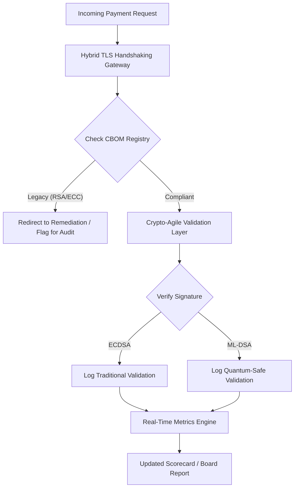

# ২০২৬ পোস্ট-কোয়ান্টাম সিকিউরিটি স্কোরকার্ড: ফিডিউসিয়ারি ক্রিপ্টোগ্রাফিক অ্যাজিলিটির জন্য একটি বোর্ড-স্তরের মেট্রিক ফ্রেমওয়ার্ক

<aside class="post-lead" aria-label="নিবন্ধের সারসংক্ষেপ">

<strong>সংক্ষেপে।</strong> ২০২৬ সালের জুন পর্যন্ত, পোস্ট-কোয়ান্টাম ক্রিপ্টোগ্রাফি (PQC) একটি পরীক্ষামূলক প্রযুক্তিগত উদ্বেগ থেকে প্রাথমিক ফিডিউসিয়ারি বাধ্যবাধকতায় রূপান্তরিত হয়েছে। DORA-র অধীনে পদ্ধতিগত আর্থিক ও পরিচালন ঝুঁকি প্রশমন করতে বোর্ডকে এখন NIST FIPS 203 ও 204 স্ট্যান্ডার্ডে লিগ্যাসি এনক্রিপশনের সুশৃঙ্খল স্থানান্তর তদারকি করতে হবে।

<strong>মূল গ্রহণযোগ্য বিষয়</strong>

<ul class="post-lead-takeaways">
  <li><strong>G20 প্রান্তিককরণ ও কঠোর সময়সীমা।</strong> আন্তর্জাতিক নিয়ন্ত্রকেরা কোয়ান্টাম-নিরাপদ স্থানান্তরের জন্য ২০২০-এর দশকের শেষ ভাগকে কঠোর সময়সীমা হিসেবে নির্ধারণ করেছে; প্রতিষ্ঠানগুলিকে পরিমাপযোগ্য স্থানান্তর অগ্রগতি প্রদর্শন করতে হবে।</li>
  <li><strong>ক্রিপ্টোগ্রাফিক বিল অফ ম্যাটেরিয়ালস (CBOM)।</strong> সফটওয়্যার BOM-এর অনুরূপ, একটি CBOM হল সমস্ত ক্রিপ্টোগ্রাফিক সম্পদের একটি লাইভ, স্বয়ংক্রিয় তালিকা — যা সরবরাহ শৃঙ্খলে দৃশ্যমানতা নিশ্চিত করতে অপরিহার্য।</li>
  <li><strong>Harvest-Now-Decrypt-Later (HNDL) এক্সপোজার।</strong> প্রতিপক্ষরা বর্তমানে এনক্রিপ্ট করা উচ্চ-মূল্যের পাইকারি পেমেন্ট ডেটা আটকাচ্ছে ও সংরক্ষণ করছে; এটি প্রশমন করতে হাইব্রিড PQC স্থাপত্যের অবিলম্বে স্থাপনা প্রয়োজন।</li>
  <li><strong>ক্রিপ্টো-অ্যাজিলিটির মাধ্যমে ফিডিউসিয়ারি গভর্নেন্স।</strong> ক্রিপ্টো-অ্যাজিলিটি একটি পরিমাপযোগ্য গভর্নেন্স মেট্রিক। কোর সিস্টেম পুনঃপ্রকৌশল ছাড়াই ক্রিপ্টোগ্রাফিক প্রিমিটিভ অদলবদল করার ক্ষমতা (যেমন KyberLib-এর মতো লাইব্রেরি ব্যবহার করে) এখন SM&CR-এর অধীনে বোর্ড-স্তরের জবাবদিহিতা।</li>
</ul>

<strong>সম্পর্কিত পঠন:</strong> <a href="https://sebastienrousseau.com/2026-06-12-kyberlib-post-quantum-banking-migration-standards-code-2026">KyberLib এবং ২০২৬-এ পোস্ট-কোয়ান্টাম ব্যাঙ্কিং স্থানান্তর</a>, <a href="https://sebastienrousseau.com/2023-11-19-crystals-kyber-the-safeguarding-algorithm-in-a-quantum-age/index.html">CRYSTALS-Kyber: কোয়ান্টাম যুগে সুরক্ষাকারী অ্যালগরিদম</a>।

</aside>
পোস্ট-কোয়ান্টাম নিরাপত্তা আর কোনও গবেষণা প্রকল্প নয়। "নিয়ন্ত্রক ঘড়ি" ২০২০-এর দশকের শেষের প্রয়োগযোগ্য সময়সীমার দিকে এগিয়ে চলেছে। [NIST FIPS 203 (ML-KEM)](https://csrc.nist.gov/pubs/fips/203/final) ও [NIST FIPS 204 (ML-DSA)](https://csrc.nist.gov/pubs/fips/204/final)-এর চূড়ান্তকরণ কী এনক্যাপসুলেশন ও ডিজিটাল স্বাক্ষরের জন্য মানদণ্ডকে কোডিফাই করেছে।

নিয়ন্ত্রক সংস্থাগুলি এখন Tier-1 ব্যাঙ্কগুলিকে পাইলট প্রকল্পের বাইরে যেতে আশা করে। ২০২৬ সালে, ফোকাস এই মানদণ্ডগুলির শিল্পায়নে স্থানান্তরিত হয়েছে। একটি স্পষ্ট স্থানান্তর পথ প্রদর্শনে ব্যর্থতা [ডিজিটাল অপারেশনাল রেসিলিয়েন্স অ্যাক্ট (DORA)](https://eur-lex.europa.eu/eli/reg/2022/2554/oj)-এর অধীনে গুরুতর নিয়ন্ত্রক জরিমানা বহন করে, এবং পরিচালকেরা যারা কোয়ান্টাম-সক্ষম ডিক্রিপশনের পূর্বাভাসযোগ্য হুমকি উপেক্ষা করেন, তাঁদের জন্য সম্ভাব্য ব্যক্তিগত দায়বদ্ধতাও সৃষ্টি করে।

## ০১. বোর্ড-স্তরের কোয়ান্টাম স্কোরকার্ড

নিম্নলিখিত মেট্রিকগুলি বোর্ডকে বাণিজ্যিক ও বিনিয়োগ ব্যাঙ্কিং (CIB) এস্টেট জুড়ে কোয়ান্টাম প্রস্তুতি ও ক্রিপ্টোগ্রাফিক স্বাস্থ্য মূল্যায়নের জন্য একটি প্রমিত ফ্রেমওয়ার্ক প্রদান করে।

### সারণি ১: PQC স্কোরকার্ড মেট্রিক ও সহনশীলতা

| মেট্রিক | গাণিতিক সূত্র | বোর্ড-অনুমোদিত সহনশীলতা | সহনশীলতার বাইরে গেলে ঝুঁকি |
| ---- | ---- | ---- | ---- |
| **ইনভেন্টরি কমপ্লিটনেস পার্সেন্টেজ (ICP)** | (চিহ্নিত ক্রিপ্টো সম্পদ / মোট অনুমিত সম্পদ) × ১০০ | > ৯৮% | উচ্চ-মূল্যের ক্লিয়ারিং ডেটা পথে শ্যাডো এনক্রিপশন ও অন্ধ বিন্দু। |
| **HNDL এক্সপোজার রেট (HER)** | (লিগ্যাসি ক্রিপ্টোতে দীর্ঘস্থায়ী ডেটা / মোট দীর্ঘস্থায়ী ডেটা) × ১০০ | < ৫% | বাণিজ্য গোপনীয়তা, সার্বভৌম ঋণ লেজার ও পাইকারি পেমেন্ট রেকর্ডের স্থায়ী আপস। |
| **NIST মাইগ্রেশন প্রগ্রেস রেট (MPR)** | (FIPS 203/204 চালিত সিস্টেম / মোট সমালোচনামূলক সিস্টেম) × ১০০ | > ৬০% (২০২৬ বছরের শেষে) | নিয়ন্ত্রক অ-সম্মতি এবং G20-প্রান্তিককৃত প্রতিপক্ষ থেকে বহিষ্করণ। |
| **ক্রিপ্টো-অ্যাজিলিটি রেডিনেস ইনডেক্স (CARI)** | (অ্যাবস্ট্র্যাক্টেড ক্রিপ্টো লেয়ারযুক্ত অ্যাপ / মোট কোর অ্যাপ) × ১০০ | > ৮৫% | গুরুতর প্রযুক্তিগত ঋণ এবং ভবিষ্যৎ অ্যালগরিদম অবসানে সাড়া দেওয়ার অক্ষমতা। |

## ০২. ক্রিপ্টোগ্রাফিক বিল অফ ম্যাটেরিয়ালস (CBOM)

ICP মেট্রিকটি একটি ব্যাপক **CBOM ডিসকভারি ফেজ**-এর মাধ্যমে বেসলাইন করা হয়। এটি একটি স্বয়ংক্রিয় প্রক্রিয়া, যা এন্টারপ্রাইজের মধ্যে প্রতিটি ক্রিপ্টোগ্রাফিক এন্ডপয়েন্ট শনাক্ত করে।

- **এন্ডপয়েন্ট ডিসকভারি:** লিগ্যাসি RSA বা ECC ব্যবহার শনাক্ত করতে অভ্যন্তরীণ ও ক্লাউড নেটওয়ার্কে সক্রিয় TLS সেশন স্ক্যান করা।
- **কী ইনভেন্টরি:** পাবলিক/প্রাইভেট কী জোড়াকে তাদের নিজ নিজ মালিকদের সাথে এবং সঠিক মেয়াদ শেষের তারিখের সাথে ম্যাপ করা।
- **ডিপেন্ডেন্সি ম্যাপিং:** তৃতীয় পক্ষের লাইব্রেরি ও API চিহ্নিত করা যা অপ্রচলিত অ্যালগরিদমের উপর নির্ভর করে।

এই ডিসকভারি ফেজ সত্যের একটি একক উৎস তৈরি করে, যা CISO-কে আর্থিক কর্মক্ষমতার মতো একই গ্র্যানুলারিটিতে ক্রিপ্টোগ্রাফিক স্বাস্থ্যের প্রতিবেদন দিতে সক্ষম করে।

## ০৩. পাইকারি পেমেন্টে HNDL এক্সপোজার নির্মূল

প্রতিপক্ষরা সক্রিয়ভাবে পাইকারি পেমেন্ট ও দীর্ঘস্থায়ী কর্পোরেট ডেটাবেস লক্ষ্য করছে। এই "Harvest-Now-Decrypt-Later" (HNDL) আক্রমণগুলিতে আজকের এনক্রিপ্ট করা ট্র্যাফিকের বাধা ও সংরক্ষণাগার জড়িত।

আজ যদি একটি ক্রিপ্টোগ্রাফিকভাবে প্রাসঙ্গিক কোয়ান্টাম কম্পিউটার (CRQC) না-ও থাকে, এখন আটকানো ডেটা ভবিষ্যতে দুর্বল হবে। এটি প্রশমন করতে দীর্ঘস্থায়ী ডেটার (যেমন পরিচয় রেকর্ড, ৩০-বছরের বন্ড চুক্তি ও আইনি সংরক্ষণাগার) উচ্চ-অগ্রাধিকার স্থানান্তর প্রয়োজন, যা সরাসরি HER মেট্রিক হ্রাস করে। পেমেন্ট চ্যানেলগুলিকে হাইব্রিড PQC-ঐতিহ্যবাহী এনক্রিপশনে (X25519-এর পাশাপাশি ML-KEM ব্যবহার করে) আপগ্রেড করা সংরক্ষণাগার হুমকির বিরুদ্ধে অবিলম্বে প্রতিরক্ষা প্রদান করে।

## ০৪. সুপরিকল্পিত ইন্টারফেসের মাধ্যমে ক্রিপ্টো-অ্যাজিলিটির পরিচালনায়ন

ক্রিপ্টো-অ্যাজিলিটি প্রকৌশল অ্যাবস্ট্র্যাকশনের মাধ্যমে বাস্তবায়িত হয়। [KyberLib](https://sebastienrousseau.com/2026-06-12-kyberlib-post-quantum-banking-migration-standards-code-2026)-এর মতো আধুনিক লাইব্রেরিগুলি প্রদর্শন করে কীভাবে ডেভেলপাররা সম্পূর্ণ অ্যাপ্লিকেশন স্ট্যাক পুনর্লিখন না করেই কোয়ান্টাম-নিরাপদ মডিউল বাস্তবায়ন করতে পারেন।

- **অ্যাবস্ট্র্যাক্টেড র‍্যাপার:** অ্যাপ্লিকেশনগুলি অ্যালগরিদম-নির্দিষ্ট রুটিনের পরিবর্তে একটি জেনেরিক `encrypt()` বা `sign()` ফাংশন কল করে।
- **রানটাইম সোয়াপিং:** অন্তর্নিহিত মডিউলটি জটিল কোড স্থাপনার পরিবর্তে কনফিগারেশন পরিবর্তনের মাধ্যমে ECDSA থেকে ML-DSA-তে অদলবদল করা যায়।

এই স্থাপত্য নিশ্চিত করে যে ভবিষ্যতে একটি নির্দিষ্ট PQC অ্যালগরিদম আপোস হলে, প্রতিষ্ঠানটি বছরের পরিবর্তে ঘণ্টার মধ্যে পিভট করতে পারে।

## ০৫. কোয়ান্টাম-নিরাপদ ইনগ্রেস ভ্যালিডেশন ওয়ার্কফ্লো

নিম্নলিখিত চিত্রটি একটি কোয়ান্টাম-অ্যাজাইল ব্যাঙ্কিং পরিবেশে নিরাপদ পরিধিতে প্রবেশকারী ডেটার জীবনচক্র চিত্রিত করে।

## উপসংহার

একটি Tier-1 ব্যাঙ্কের ক্রিপ্টোগ্রাফিক এস্টেট আর CISO-র উদ্বেগ নয়। এটি ফিডিউসিয়ারি পরিকাঠামো। NIST FIPS 203 ও 204 অ্যালগরিদম নির্ধারণ করে; DORA অনুচ্ছেদ ৫ জবাবদিহিতার পৃষ্ঠ নির্ধারণ করে; SM&CR এটিকে একজন নির্দিষ্ট সিনিয়র ম্যানেজারের সাথে আবদ্ধ করে। উপরের স্কোরকার্ড — ইনভেন্টরি কমপ্লিটনেস, HNDL এক্সপোজার, মাইগ্রেশন প্রগ্রেস, ক্রিপ্টো-অ্যাজিলিটি — বোর্ডকে ক্রিপ্টোগ্রাফিক কোড না পড়েই সেই এস্টেট পরিচালনার জন্য প্রয়োজনীয় চারটি সংখ্যা দেয়।

সবচেয়ে গুরুত্বপূর্ণ সংখ্যাটি হল HNDL এক্সপোজার। আজ একটি পাইকারি-পেমেন্ট সংরক্ষণাগারে থাকা প্রতিটি লিগ্যাসি-এনক্রিপ্ট করা রেকর্ড সেই দিন পাঠযোগ্য হবে যেদিন প্রথম ক্রিপ্টোগ্রাফিকভাবে প্রাসঙ্গিক কোয়ান্টাম কম্পিউটার পাঠানো হবে। কাউন্টডাউন নীরব ও অসমমিত: রক্ষকেরা শুধু তাদের কাছে থাকা ডেটার উপরই কাজ করতে পারেন, প্রতিপক্ষরা বছরখানেক আগে এক্সফিল্ট্রেট করা ডেটার উপর কাজ করতে পারে। ২০২৪ সালে RSA-2048 দিয়ে এনক্রিপ্ট করা একটি ৩০-বছরের কর্পোরেট বন্ড চুক্তি এমন একটি চুক্তি যা CRQC সক্রিয় হওয়ার দিন গোপনীয়তার গ্যারান্টি হারায়।

[KyberLib](https://sebastienrousseau.com/2026-06-12-kyberlib-post-quantum-banking-migration-standards-code-2026) ও এর সমকক্ষরা এটিকে একটি বহু-বছরের প্ল্যাটফর্ম পুনর্লিখন থেকে কনফিগারেশন পরিবর্তনে রূপান্তরিত করে। বোর্ডের কাজ কোড লেখা নয়। বোর্ডের কাজ হল দাবি করা যে ক্রিপ্টো-অ্যাজিলিটি রেডিনেস ইনডেক্স — একটি অ্যাবস্ট্র্যাক্টেড ক্রিপ্টোগ্রাফিক ইন্টারফেসের পিছনে থাকা কোর অ্যাপ্লিকেশনের অংশ — বারো মাসের মধ্যে ৮৫%-এ পৌঁছায়, এবং ত্রৈমাসিক স্কোরকার্ড পড়া।

<aside class="author-card" aria-label="লেখক সম্পর্কে"><strong class="author-card-name"><a href="/about/index.html">Sebastien Rousseau</a></strong>সিনিয়র ব্যাঙ্কিং প্রযুক্তিবিদ — প্রয়োগিক AI, ISO 20022 স্থানান্তর, আর্থিক পরিষেবার জন্য পোস্ট-কোয়ান্টাম ক্রিপ্টোগ্রাফি এবং পাইকারি পেমেন্টের কাঠামোগত রূপান্তরের উপর লেখেন।HSBC Commercial & Investment Bank, PayPal, Barclays, Shazam-এ ২০+ বছরের অভিজ্ঞতা। <a href="https://www.linkedin.com/in/sebastienrousseau/" rel="external noopener">LinkedIn</a> &middot; <a href="https://github.com/sebastienrousseau" rel="external noopener">GitHub</a></aside>

সর্বশেষ পর্যালোচিত <time datetime="2026-06-29">2026-06-29</time>।

