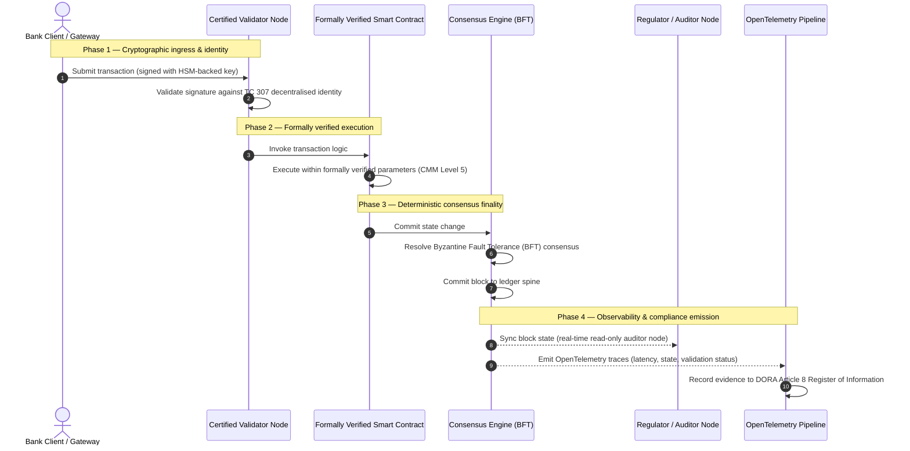

# প্রমাণ থেকে সত্যে: কেন প্রত্যয়িত ব্লকচেইন ব্যাংকিং আস্থার পরবর্তী যুগকে সংজ্ঞায়িত করবে

## কৌশলগত সারসংক্ষেপ (মূল কথা)

পাইকারি ব্যাংকিং ও বৈশ্বিক লেনদেন ২০২৬ সালে এক ঐতিহাসিক সন্ধিক্ষণে দাঁড়িয়ে আছে। যেহেতু আর্থিক পরিষেবা স্বভাবতই ডিজিটাল, রিয়েল-টাইম ক্লিয়ারিং নেটওয়ার্কে স্থানান্তরিত হচ্ছে, এবং কৃত্রিম বুদ্ধিমত্তা সম্ভাব্যতাভিত্তিক অনিশ্চয়তা নিয়ে আসছে, প্রথাগত এনালগ, পশ্চাদমুখী নিশ্চয়তা মডেল (যেমন স্থির, সত্তা-ভিত্তিক নিরীক্ষা) আধুনিক ঝুঁকি ব্যবস্থাপনা ও অছি দায়িত্বের চাহিদা পূরণ করতে ব্যর্থ হচ্ছে।

ISO/IEC কারিগরি কমিটি TC 307 বিতরণকৃত খতিয়ান প্রযুক্তির জন্য একটি মানকীকৃত ভিত্তি প্রতিষ্ঠা করেছে। তবে প্রকৃত প্রাতিষ্ঠানিক গ্রহণের জন্য বর্ণনামূলক নির্দেশনা থেকে নির্দেশমূলক, স্বাধীনভাবে প্রত্যয়নযোগ্য ব্লকচেইন নিশ্চয়তায় উত্তরণ প্রয়োজন। খতিয়ান শাসন, ঐকমত্যের অখণ্ডতা, স্মার্ট চুক্তির নিরাপত্তা ও ক্রিপ্টোগ্রাফিক তৎপরতাকে একটি কঠোর পাঁচ-স্তরের সক্ষমতা পরিপক্বতা মডেলের (CMM) বিপরীতে স্কোর দিয়ে, ব্যাংকগুলি খণ্ডিত, বিক্রেতা-নির্দিষ্ট অনুমান থেকে প্রত্যয়নযোগ্য, পরিচালনা পর্ষদ কর্তৃক নিরীক্ষণযোগ্য আর্থিক সত্যে এগিয়ে যেতে পারে।

## মূল উপলব্ধি

* **অছি ঘর্ষণ ব্যবধান**: আজ আমরা ব্যাংক (Basel III), ক্লাউড (ISO 27001) ও এআই শাসন ব্যবস্থা (ISO 42001) প্রত্যয়ন করতে পারি, কিন্তু সেই বিতরণকৃত খতিয়ানকে এখনও প্রত্যয়ন করতে পারি না যা ক্রমবর্ধমানভাবে নির্ধারণ করে কী সত্য। এই অসমতা একটি বড় পরিচালনগত দুর্বলতা।  
* **DORA প্রত্যক্ষ অছি দায়িত্ব আরোপ করে**: DORA-র ৫ অনুচ্ছেদের অধীনে, ব্যাংকের পরিচালনা পর্ষদ সকল তৃতীয়-পক্ষ ও খতিয়ান স্থাপনার পরিচালনগত সহনশীলতার জন্য প্রত্যক্ষ, অ-অর্পণযোগ্য ব্যক্তিগত দায়িত্ব বহন করে, ব্যর্থতায় SM&CR ব্যবস্থার অধীনে কঠোর ব্যক্তিগত শাস্তিসহ।  
* **এআই-এর নিরীক্ষা মেরুদণ্ড**: যেখানে মেশিন লার্নিং অপুনরুৎপাদনযোগ্য, সম্ভাব্যতাভিত্তিক ফলাফল উৎপন্ন করে, সেখানে প্রত্যয়িত ব্লকচেইন একটি নির্ধারণবাদী অবস্থা-অধিগ্রহণ প্রদান করে। মডেল সংস্করণ, ইনপুট ও যাচাই সিদ্ধান্ত চেইনে রেকর্ড করা ISO 42001 ও মডেল ঝুঁকি ব্যবস্থাপনা মান পূরণ করে।  
* **প্রত্যয়িত ব্লকচেইন সূচক**: এই সূচক শাসন, ঐকমত্য, স্মার্ট চুক্তি ও পর্যবেক্ষণযোগ্যতাকে ০ থেকে ৫ CMM স্কেলে একটি যাচাইযোগ্য, নিরীক্ষা-প্রস্তুত স্কোরকার্ডে আনুষ্ঠানিক রূপ দেয়, প্রকৌশল মেট্রিককে পর্ষদ-অনুমোদিত ঝুঁকি রুচি বিবৃতিতে অনুবাদ করে।

## ০১. ডিজিটাল ব্যাংকিংয়ে অছি ঘর্ষণ ব্যবধান

ধ্রুপদী ব্যাংকিংয়ে, আস্থা সম্পর্কভিত্তিক, প্রাতিষ্ঠানিক ও পশ্চাদমুখী। এটি স্বাধীন, তৃতীয়-পক্ষ নিরীক্ষকদের উপর নির্ভর করে যারা নির্দিষ্ট সময়-বিন্দুতে আর্থিক অবস্থা পর্যালোচনা করে এবং দ্বিপক্ষীয় খতিয়ান সাইলোর মধ্যে অসঙ্গতি মিলিয়ে নেয়। ২০২৬ সালের রিয়েল-টাইম, API-চালিত বাজারে, এই মডেল নিষেধমূলক বিলম্ব ও কাঠামোগত ঝুঁকি নিয়ে আসে।

যখন লেনদেন তাৎক্ষণিকভাবে নিষ্পত্তি হয়, দিনের অভ্যন্তরীণ তারল্য পুল API গেটওয়ে দ্বারা গতিশীলভাবে পরিচালিত হয়, এবং সম্পদের মালিকানা ভাগ করা খতিয়ানে টোকেনকৃত হয়, তখন পশ্চাদমুখী নিরীক্ষা প্রতিরোধমূলক নিয়ন্ত্রণের পরিবর্তে ফরেনসিক মহড়ায় পরিণত হয়। অছিরা আর কেবল আইনি সত্তার প্রত্যয়নের উপর নির্ভর করতে পারে না। তাদের ডিজিটাল স্তরকেই প্রত্যয়ন করতে হবে।

বর্তমানে, ব্যাংকগুলি একটি সুস্পষ্ট স্থাপত্যগত অসমতার অধীনে পরিচালিত হয়:

1. **প্রত্যয়িত ক্লাউড অবকাঠামো**: হার্ডওয়্যার নোড, ভার্চুয়ালাইজড কন্টেইনার ও ভৌত ডেটা কেন্দ্র ISO/IEC 27001 ও SOC 2 Type II নিয়ন্ত্রণের বিপরীতে যাচাই করা হয়।  
2. **প্রত্যয়িত ব্যবস্থাপনা প্রক্রিয়া**: পরিচালনগত ঝুঁকি নীতি, ব্যবসায় ধারাবাহিকতা পরিকল্পনা ও অ্যালগরিদমিক স্থাপনা কঠোর ঝুঁকি কাঠামো দ্বারা শাসিত।  
3. **অপ্রত্যয়িত খতিয়ান ইঞ্জিন**: বিতরণকৃত ঐকমত্য প্রক্রিয়া, যাচাইকারী নোড সরবরাহ শৃঙ্খল, স্মার্ট চুক্তির সীমানা ও নেটওয়ার্ক শাসন মডেল অপ্রত্যয়িত, স্বনির্মিত বা কনসোর্টিয়াম-নির্দিষ্ট অনুমানের উপর ছেড়ে দেওয়া হয়।

এই অসমতা একটি গুরুত্বপূর্ণ ব্যর্থতা বিন্দু। একটি ব্যাংক একটি নিরাপদ, ISO 27001-প্রত্যয়িত ক্লাউড কন্টেইনারের ভিতরে একটি যাচাইকৃত অ্যাপ্লিকেশন চালাতে পারে, কিন্তু যদি সেই কন্টেইনার কেন্দ্রীভূত যাচাইকারী নিয়ন্ত্রণ, দুর্বল ঐকমত্য প্যারামিটার বা অ-নিরীক্ষিত স্মার্ট চুক্তিসহ একটি বিতরণকৃত খতিয়ানে লেখে, তবে লেনদেনের অখণ্ডতা আপস হয়ে যায়। এই ব্যবধান পূরণে, খতিয়ান ইঞ্জিনকেই একটি প্রত্যয়নযোগ্য নিশ্চয়তা বস্তু হতে হবে।

## ০২. ISO/IEC TC 307 মানকীকরণ ভিত্তি

বিতরণকৃত খতিয়ান মানকীকরণে প্রয়োজনীয় মৌলিক কাজ ISO/IEC কারিগরি কমিটি TC 307 (ব্লকচেইন ও বিতরণকৃত খতিয়ান প্রযুক্তি) দ্বারা প্রতিষ্ঠিত হচ্ছে। ব্লকচেইনকে একটি বিচ্ছিন্ন কারিগরি প্রোটোকল হিসেবে বিবেচনা করার পরিবর্তে, TC 307 একে একটি প্রাতিষ্ঠানিক আস্থা অবকাঠামো হিসেবে দেখে, এবং তার কাজকে পাঁচটি মূল স্তম্ভের চারপাশে সংগঠিত করে:

1. **শ্রেণিবিন্যাস ও শব্দভাণ্ডার (ISO 22739)**: একটি সাধারণ নামকরণ প্রতিষ্ঠা করে, বিভিন্ন এখতিয়ার, আর্থিক স্কিম ও প্রতিষ্ঠান জুড়ে সামঞ্জস্যপূর্ণ আইনি ও পরিচালনগত সংজ্ঞা নিশ্চিত করে।  
2. **রেফারেন্স স্থাপত্য (ISO/TR 23245)**: একটি সম্মত বিতরণকৃত খতিয়ান ব্যবস্থার সীমানা, স্তর, ডেটা প্রবাহ ও কার্যকরী উপাদান সংজ্ঞায়িত করে।  
3. **নিরাপত্তা, গোপনীয়তা ও স্মার্ট চুক্তি (ISO/TR 23244 / ISO 23613)**: ডিজিটাল সম্পদ ব্যবস্থার জন্য মৌলিক নিরাপত্তা নির্দেশিকা প্রতিষ্ঠা করে এবং স্মার্ট চুক্তির দুর্বলতা প্রশমন ও জীবনচক্র শাসনের সর্বোত্তম অনুশীলন বিশদ করে।  
4. **আন্তঃকার্যক্ষমতা কাঠামো**: বিষম খতিয়ান নেটওয়ার্কের মধ্যে ডেটা ও সম্পদ-বিনিময় ব্যবস্থা মোকাবিলা করে, বিচ্ছিন্ন টোকেনকৃত সাইলো গঠন প্রতিরোধ করে।  
5. **বিকেন্দ্রীভূত পরিচয় ও আস্থা নোঙর**: খতিয়ান-ভিত্তিক ক্রিপ্টোগ্রাফিক শনাক্তকারীকে আনুষ্ঠানিক পাবলিক-কী অবকাঠামো (PKI) ও রাষ্ট্র-অনুমোদিত রেজিস্ট্রির সাথে একীভূত করে।

সম্মিলিতভাবে, TC 307 DLT-র একটি স্বনির্মিত প্রকৌশল পছন্দ থেকে একটি মানকীকৃত স্থাপত্য শৃঙ্খলায় উত্তরণের ইঙ্গিত দেয়। তবে, TC 307 মূলত বর্ণনামূলক রয়ে গেছে। এটি সংজ্ঞায়িত করে উৎকর্ষ কেমন দেখায় (নির্দেশনা), কিন্তু ঝুঁকি কর্মকর্তা ও তত্ত্বাবধায়করা গুরুত্বপূর্ণ বা প্রয়োজনীয় কার্যাবলির (CIF) উৎপাদন স্থাপনা অনুমোদনে যে নির্দেশমূলক যাচাই প্রোটোকল (নিশ্চয়তা) প্রয়োজন, তা প্রদান করে না।

## ০৩. নির্দেশনা বনাম নিশ্চয়তা: অছি পার্থক্য

আর্থিক বাজারের অংশগ্রহণকারীরা কোনো প্রযুক্তি এই কারণে স্থাপন করে না যে এটি উদ্ভাবনী বা মার্জিত; তারা তখন স্থাপন করে যখন এটিকে শাসন, নিরীক্ষা, প্রতিরক্ষা ও মূলধন সংরক্ষণ প্রয়োজনীয়তার সাথে মিলিয়ে নেওয়া যায়। এ কারণেই ব্যাংকিংয়ে মানকীকরণ স্বাভাবিকভাবে দুটি স্তরে বিভক্ত হয়:

* **নির্দেশনা (কাঠামো)**: সর্বোত্তম অনুশীলন, রেফারেন্স লক্ষ্য ও স্থাপত্য নির্দেশিকা রূপরেখা দেয় (যেমন ISO/IEC TC 307, NIST কাঠামো)।  
* **নিশ্চয়তা (প্রমাণ)**: স্বাধীন, অবিচ্ছিন্ন ও তৃতীয়-পক্ষ-যাচাইযোগ্য প্রমাণ প্রদান করে যে কাঠামো বাস্তবায়িত হয়েছে এবং নকশা অনুযায়ী কাজ করছে (যেমন ISO 27001 প্রত্যয়ন, SOC 2 নিরীক্ষা, নিয়ন্ত্রক পরীক্ষা)।

ক্লাউড অবকাঠামো প্রত্যয়ন করার সময় অপ্রত্যয়িত খতিয়ান ঐকমত্যের উপর নির্ভর করা একটি গুরুত্বপূর্ণ নিয়ন্ত্রক ফাঁক। একটি "অপরিবর্তনীয়" ব্লকচেইন অগত্যা "প্রাতিষ্ঠানিকভাবে বিশ্বস্ত" নয়। অপরিবর্তনীয়তা কেবল নিশ্চিত করে যে প্রবেশ করানো ডেটা অপরিবর্তিত থাকে; এটি যাচাই করে না যে যাচাইকারী নোড নিরাপদ কিনা, ঐকমত্য প্রোটোকল যোগসাজশের বিরুদ্ধে সহনশীল কিনা, স্মার্ট চুক্তির যুক্তি গাণিতিকভাবে সঠিক কিনা, বা ক্রিপ্টোগ্রাফিক কী ব্যবস্থাপনা উত্তর-কোয়ান্টাম আদেশ মেনে চলে কিনা।

এই ব্যবধান বন্ধ করতে, ২০২৬ প্রত্যয়িত ব্লকচেইন সূচক এই প্রয়োজনীয়তাগুলিকে একটি পরিমাপযোগ্য সক্ষমতা পরিপক্বতা মডেলে (CMM) আনুষ্ঠানিক রূপ দেয়, যা বৈশ্বিক ব্যাংকিং প্রবিধানের সাথে ম্যাপ করা।

## ০৪. ২০২৬ প্রত্যয়িত ব্লকচেইন সূচক

জ্যেষ্ঠ ব্যবস্থাপনাকে তাদের খতিয়ান প্ল্যাটফর্ম মূল্যায়ন ও প্রত্যয়ন করতে সক্ষম করতে, এই সূচক বিতরণকৃত খতিয়ান অবকাঠামোকে পাঁচটি নিরীক্ষণযোগ্য পরিচালনগত স্তরে গঠন করে, যা ০ থেকে ৫ CMM স্কেলে স্কোর করা হয়।

## সারণি ১: প্রত্যয়িত ব্লকচেইন সূচকের স্থাপত্য

| সূচক স্তর | পরিপক্বতা স্তর (CMM) | কারিগরি ও পরিচালনগত মেট্রিক | নিয়ন্ত্রক / অছি নিয়ন্ত্রণ রেফারেন্স |
| ---- | ---- | ---- | ---- |
| **খতিয়ান শাসন** | **স্তর ০**: অ্যাডহক কনসোর্টিয়াম**স্তর ৩**: স্বয়ংক্রিয় যাচাইকারী যাচাই ও আবর্তন**স্তর ৫**: বিকেন্দ্রীভূত, বহুপক্ষীয় ক্রিপ্টোগ্রাফিক পরিচয় নোঙরকরণ | যাচাইকৃত আর্থিক সত্তা দ্বারা পরিচালিত যাচাইকারী নোডের %; যাচাইকারী বিরোধ নিষ্পত্তির গড় সময়; নোডের ভৌগোলিক বণ্টন | **DORA অনুচ্ছেদ ৫** (শাসন ও সংগঠন); **CPMI-IOSCO PFMI নীতি ২** (শাসন) ও **নীতি ৩** (ঝুঁকির সামগ্রিক ব্যবস্থাপনার কাঠামো) |
| **ঐকমত্য অখণ্ডতা** | **স্তর ০**: একক নোড বা অস্বচ্ছ PoW**স্তর ৩**: নির্ধারণবাদী চূড়ান্ততাসহ নিরীক্ষিত BFT**স্তর ৫**: অবিচ্ছিন্ন বিলম্ব পর্যবেক্ষণসহ বহু-এখতিয়ার, আনুষ্ঠানিকভাবে যাচাইকৃত ঐকমত্য | সর্বোচ্চ সহনীয় ঐকমত্য বিলম্ব; যোগসাজশ-প্রতিরোধ থ্রেশহোল্ড; অনুকরণকৃত নোড বিভাজনে উপলব্ধতা SLA | **DORA অনুচ্ছেদ ৬** (ICT ঝুঁকি ব্যবস্থাপনা কাঠামো); **CPMI-IOSCO PFMI নীতি ৮** (নিষ্পত্তি চূড়ান্ততা) |
| **পরিচয় ও ক্রিপ্টোগ্রাফি** | **স্তর ০**: দুর্বল RSA/ECDSA কী**স্তর ৩**: HSM-সমর্থিত কী ব্যবস্থাপনাসহ মাল্টি-সিগ**স্তর ৫**: কোয়ান্টাম-নিরাপদ হাইব্রিড কী (FIPS 203 ML-KEM) ও শূন্য-জ্ঞান গোপনীয়তা গেট | HSM-সমর্থিত কী দিয়ে স্বাক্ষরিত খতিয়ান লেনদেনের %; PQC মাইগ্রেশন প্রস্তুতি স্কোর; ZK-প্রমাণ বিলম্ব | **NIST FIPS 203 / 204**; **ISO/IEC 27001** (তথ্য নিরাপত্তা ব্যবস্থাপনা) |
| **স্মার্ট চুক্তি নিশ্চয়তা** | **স্তর ০**: অ-নিরীক্ষিত Solidity স্ক্রিপ্ট**স্তর ৩**: স্বয়ংক্রিয় কম্পাইলার যাচাই ও বাহ্যিক নিরীক্ষা**স্তর ৫**: সার্কিট-ব্রেকার আপগ্রেডসহ আনুষ্ঠানিকভাবে যাচাইকৃত, অপরিবর্তনীয় স্মার্ট চুক্তি | গাণিতিক আনুষ্ঠানিক যাচাইসহ স্মার্ট চুক্তির %; কম্পাইলার সতর্কতার সংখ্যা; দুর্বলতা স্ক্যান কভারেজ | **আউটসোর্সিং সংক্রান্ত EBA নির্দেশিকা** (অনুচ্ছেদ ৮১, ১১৩-১১৭); **DORA অনুচ্ছেদ ৩০** (ন্যূনতম চুক্তিগত ধারা) |
| **নিরীক্ষা ও পর্যবেক্ষণযোগ্যতা** | **স্তর ০**: ম্যানুয়াল লগ স্ক্র্যাপিং**স্তর ৩**: কাঠামোবদ্ধ OTel ট্রেস ও কেবল-পঠন নিরীক্ষক নোড**স্তর ৫**: অনুচ্ছেদ ৮ রেজিস্টারের সাথে স্বয়ংক্রিয়, অবিচ্ছিন্ন মিলকরণ | OpenTelemetry ট্রেস দ্বারা আচ্ছাদিত লেনদেনের %; ব্লক-কমিট থেকে নিরীক্ষক নোড সিঙ্ক্রোনাইজেশন পর্যন্ত বিলম্ব | **BCBS 239** (ঝুঁকি ডেটা সমষ্টিকরণ); **DORA অনুচ্ছেদ ৮** (তথ্য রেজিস্টার / ITS স্কিমা) |

## সারণি ২: বৈশ্বিক ব্যাংকিং মানের সাথে ম্যাপকৃত মূল আস্থা সংকেত

| সংকেত / মানদণ্ড | মেট্রিক | ব্যাংকিং প্ল্যাটফর্মে প্রভাব | নিয়ন্ত্রক উৎস |
| ---- | ---- | ---- | ---- |
| **ISO/IEC TC 307 অগ্রগতি** | ISO/TR কারিগরি প্রতিবেদন থেকে আনুষ্ঠানিক প্রত্যয়ন স্কিমে উত্তরণ | বিতরণকৃত খতিয়ান ইঞ্জিন প্রত্যয়নে প্রথম মানকীকৃত কাঠামো প্রতিষ্ঠা করে | **ISO/IEC JTC 1 / SC 44** (বিতরণকৃত খতিয়ান প্রযুক্তি) |
| **Agorá প্রকল্প প্রোটোটাইপ পর্যায়** | ৪০+ অংশগ্রহণকারী বাণিজ্যিক ব্যাংক; টোকেনকৃত আমানতের একীভূত খতিয়ান পরীক্ষা | সীমান্ত-পার ক্লিয়ারিংকে বার্তা প্রেরণ (SWIFT) থেকে পারমাণবিক টোকেনকৃত নিষ্পত্তিতে স্থানান্তরিত করে | **আন্তর্জাতিক নিষ্পত্তি ব্যাংক (BIS) উদ্ভাবন কেন্দ্র** |
| **DORA অনুচ্ছেদ ৩০ তৃতীয়-পক্ষ নিরীক্ষা** | নোড সরবরাহকারী ও অবকাঠামো হোস্টের ১০০% নিরাপত্তা মানদণ্ডে নিরীক্ষিত | "ছায়া যাচাইকারী নোড" নির্মূল করে; সম্পূর্ণ সরবরাহ শৃঙ্খল স্বচ্ছতা বাধ্যতামূলক করে | **ইউরোপীয় তত্ত্বাবধায়ক কর্তৃপক্ষ (ESA)** |
| **ISO/IEC 42001 (এআই শাসন)** | এআই মডেল ও প্রশিক্ষণ লগ চেইনে ক্রিপ্টোগ্রাফিকভাবে অপরিবর্তনীয় করা | ব্লকচেইনকে মেশিন লার্নিংয়ের জন্য অপরিবর্তনীয় প্রমাণ রেজিস্টার ("নিরীক্ষা মেরুদণ্ড") হিসেবে ব্যবহার করে | **ISO/IEC 42001:2023** (তথ্য প্রযুক্তি — কৃত্রিম বুদ্ধিমত্তা) |
| **Basel III মূলধন পর্যাপ্ততা** | নথিভুক্ত জটিলতা হ্রাসের ভিত্তিতে পরিচালনগত ঝুঁকি মূলধন বাফার হ্রাস | মানকীকৃত পরিচালনগত ঝুঁকি কাঠামো যাচাইকৃত খতিয়ান সহনশীলতাকে সরাসরি স্বীকৃতি দেয় | **ব্যাংকিং তত্ত্বাবধান সংক্রান্ত বাসেল কমিটি (BCBS)** |

## ০৫. এআই-এর "নিরীক্ষা মেরুদণ্ড": নির্ধারণবাদী অবকাঠামোর উপর সম্ভাব্যতাভিত্তিক বুদ্ধিমত্তা

২০২৬ সালে একটি প্রত্যয়িত ব্লকচেইনের সবচেয়ে শক্তিশালী কৌশলগত ভূমিকাগুলির একটি হল কৃত্রিম বুদ্ধিমত্তা স্থাপনার জন্য একটি **"নিরীক্ষা মেরুদণ্ড"** হিসেবে কাজ করা। আধুনিক আর্থিক ব্যবস্থা ক্রমবর্ধমানভাবে সম্ভাব্যতাভিত্তিক হয়ে উঠছে। ঋণ স্কোরিং, রিয়েল-টাইম জালিয়াতি সনাক্তকরণ, অ্যালগরিদমিক ট্রেডিং ও স্বায়ত্তশাসিত গ্রাহক মিথস্ক্রিয়া মেশিন লার্নিং মডেল দ্বারা চালিত হয় যা সময়ের সাথে বিকশিত, বিচ্যুত ও অভিযোজিত হয়। এই মডেলগুলি অ-নির্ধারণবাদী: দুটি ভিন্ন সময়ে একই ইনপুট দেওয়া হলে, গতিশীল ওজন ও অবিচ্ছিন্ন প্রশিক্ষণের কারণে তারা ভিন্ন আউটপুট দিতে পারে।

এই অনিশ্চয়তা **ISO/IEC 42001 (এআই শাসন)** ও মডেল ঝুঁকি ব্যবস্থাপনা (MRM) মানের (যেমন **মার্কিন ফেডারেল রিজার্ভের SR 11-7** ও **ব্রিটিশ PRA-র SS1/23**) অধীনে একটি গভীর শাসন চ্যালেঞ্জ উপস্থাপন করে: *আপনি কীভাবে এমন সিদ্ধান্ত নিরীক্ষা, ব্যাখ্যা ও প্রতিরক্ষা করবেন যা কঠোরভাবে পুনরুৎপাদনযোগ্য নয়?*

একটি প্রত্যয়িত বিতরণকৃত খতিয়ান নির্ধারণবাদী প্রতিভার প্রদান করে। যেখানে এআই মডেল সম্ভাব্যতাভিত্তিকভাবে কাজ করে, সেখানে প্রত্যয়িত ব্লকচেইন তাদের প্যারামিটার নির্ধারণবাদীভাবে রেকর্ড করে, একটি অপরিবর্তনীয় প্রমাণ মেরুদণ্ড প্রতিষ্ঠা করে:

* **মডেল সংস্করণ ও ওজন নোঙরকরণ**: প্রতিটি স্থাপিত মডেল সংস্করণ, তার সংশ্লিষ্ট ওজন ও তার প্রশিক্ষণ ডেটার চেকসাম বিল্ড-সময়ে হ্যাশ করা হয় ও খতিয়ানে লেখা হয়, **SLSA Level 3** সরবরাহ শৃঙ্খল প্রয়োজনীয়তা পূরণ করে।  
* **প্রাসঙ্গিক ইনপুট লগিং**: যখন একটি এআই মডেল একটি গুরুত্বপূর্ণ সিদ্ধান্ত নির্বাহ করে (যেমন একটি ঋণ অনুমোদন বা একটি লেনদেন চিহ্নিতকরণ), তখন সঠিক প্রাসঙ্গিক ইনপুট ও মডেল হ্যাশ খতিয়ানে লেখা হয়, একটি টেম্পার-প্রতিরোধী ইতিহাস তৈরি করে।  
* **কোড অ্যাক্সেস ছাড়াই নিরীক্ষাযোগ্যতা**: যদি একজন নিয়ন্ত্রক জিজ্ঞাসা করেন "আপনার মডেল কেন ৩ জুন এই ঋণ আবেদন প্রত্যাখ্যান করল?", ব্যাংককে তার মালিকানাধীন কোড প্রকাশ করতে হয় না বা সঠিক মডেল অবস্থা পুনঃসৃষ্টির চেষ্টা করতে হয় না। এটি ইনপুট, ওজন ও যাচাই অবস্থার ক্রিপ্টোগ্রাফিকভাবে স্বাক্ষরিত, অন-চেইন রেকর্ড উপস্থাপন করে।

মেশিন লার্নিং মডেলের সম্ভাব্যতাভিত্তিক সিদ্ধান্তগুলিকে একটি প্রত্যয়িত ব্লকচেইনের নির্ধারণবাদী ঐকমত্যে নোঙর করে, প্রতিষ্ঠান স্বয়ংক্রিয় কর্মের একটি প্রতিরক্ষাযোগ্য, পুনর্গঠনযোগ্য ও স্বাধীনভাবে যাচাইযোগ্য সময়রেখা তৈরি করে।

## ০৬. প্রত্যয়িত ঐকমত্য-থেকে-নিরীক্ষা পাইপলাইনের দৃশ্যায়ন

নিম্নলিখিত অনুক্রম চিত্র একটি প্রত্যয়িত ব্লকচেইন প্ল্যাটফর্মের মধ্য দিয়ে যাওয়া একটি লেনদেনের জীবনচক্র চিত্রিত করে, দেখায় কীভাবে যাচাই গেট, ঐকমত্য অখণ্ডতা, স্মার্ট চুক্তি নির্বাহ ও টেলিমেট্রি নির্গমন পরস্পর সংযুক্ত হয়ে পর্ষদ-প্রস্তুত নিয়ন্ত্রক প্রমাণ উৎপন্ন করে:

এই লেনদেন অনুক্রমের গুরুত্বপূর্ণ পথ দাবি করে যে প্রতিটি যাচাই, নির্বাহ ও ঐকমত্য ধাপ ক্রিপ্টোগ্রাফিকভাবে স্বাক্ষরিত হোক, প্রান্ত-থেকে-প্রান্ত উৎস নিশ্চিত করে। নিয়ন্ত্রকের নিরীক্ষক নোড ব্লক অবস্থা রিয়েল-টাইমে সিঙ্ক্রোনাইজ করে, পশ্চাদমুখী, ম্যানুয়াল আর্থিক মিলকরণের প্রয়োজন দূর করে।

## ০৭. জ্যেষ্ঠ ব্যবস্থাপকদের জন্য বোর্ডরুম প্লেবুক

সাংগঠনিক আস্থা থেকে অবকাঠামোগত আস্থায় উত্তরণ সফলভাবে নেভিগেট করতে, ব্যাংক নির্বাহী ও জ্যেষ্ঠ ব্যবস্থাপকদের অবিলম্বে চারটি মূল নির্দেশ কার্যকর করা উচিত:

1. **এন্টারপ্রাইজ ঝুঁকি ব্যবস্থাপনায় (ERM) খতিয়ান নিরীক্ষা বাধ্যতামূলক করুন**: একটি নীতি প্রয়োগ করুন যাতে কোনো বিতরণকৃত খতিয়ান প্ল্যাটফর্ম — ব্যক্তিগত, সর্বজনীন বা কনসোর্টিয়াম — পাঁচ-স্তরের **প্রত্যয়িত ব্লকচেইন সূচক স্থাপত্যের** (ন্যূনতম CMM স্তর ৩) বিপরীতে নিরীক্ষা ছাড়া গুরুত্বপূর্ণ বা প্রয়োজনীয় কার্যাবলির (CIF) জন্য স্থাপন করা না যায়।  
2. **ব্লকচেইনকে ISO 42001 এআই প্রমাণ মেরুদণ্ড হিসেবে একীভূত করুন**: প্রধান ঝুঁকি কর্মকর্তা ও প্রধান এআই স্থপতিকে সকল উচ্চ-প্রভাব মেশিন লার্নিং মডেল একটি প্রত্যয়িত ব্লকচেইনের সাথে একীভূত করতে নির্দেশ দিন, মডেল সংস্করণ, ওজন, ইনপুট ও সিদ্ধান্তের একটি টেম্পার-প্রতিরোধী নিরীক্ষা রেজিস্টার তৈরি করুন।  
3. **যাচাইকারী নোড সরবরাহ শৃঙ্খল নিরীক্ষা করুন (DORA অনুচ্ছেদ ৩০)**: ক্রয় বিভাগকে যাচাইকারী নোড হোস্টিং বা DLT নেটওয়ার্কের জন্য ক্লাউড হোস্টিং পরিচালনাকারী সকল তৃতীয়-পক্ষ সত্তা নিরীক্ষা করতে বলুন, এবং ব্যাংকের অভ্যন্তরীণ ক্লাউড নোডে প্রযোজ্য একই সাইবার নিরাপত্তা ও পরিচালনগত সহনশীলতা মান বাধ্যতামূলক করুন।  
4. **খতিয়ান স্থাপত্যকে CPMI-IOSCO ও BCBS 239-এর সাথে সারিবদ্ধ করুন**: প্ল্যাটফর্ম প্রকৌশল দলকে খতিয়ান আউটপুট টেলিমেট্রি সরাসরি **BCBS 239** ডেটা রিপোর্টিং প্রয়োজনীয়তার সাথে সারিবদ্ধ করতে এবং ঐকমত্য ও নিষ্পত্তি চূড়ান্ততা প্যারামিটার **CPMI-IOSCO নীতি ৮ ও ৯** কঠোরভাবে মেনে চলে তা নিশ্চিত করতে নির্দেশ দিন।

## ০৮. প্রায়শই জিজ্ঞাসিত প্রশ্ন

**ISO/IEC TC 307 কি একটি প্রত্যয়ন মান?**  
না। ISO/IEC TC 307 একটি কারিগরি কমিটি যা শব্দভাণ্ডার, রেফারেন্স স্থাপত্য ও নিরাপত্তা নির্দেশিকা প্রতিষ্ঠা করে। যদিও এটি সংজ্ঞায়িত করে "উৎকর্ষ কেমন দেখায়" (নির্দেশনা), শিল্পকে ব্যাংকিং তত্ত্বাবধায়কদের সন্তুষ্ট করতে এই নথিগুলিকে আনুষ্ঠানিক, নিরীক্ষণযোগ্য প্রত্যয়ন স্কিমে (নিশ্চয়তা) কার্যকর করতে হবে।

**একটি প্রত্যয়িত ব্লকচেইন কীভাবে DORA সম্মতি সমর্থন করে?**  
DORA-র ৫ অনুচ্ছেদের অধীনে, ব্যাংক পর্ষদ প্রযুক্তিগত সহনশীলতার জন্য প্রত্যক্ষ ব্যক্তিগত দায়িত্ব বহন করে। একটি প্রত্যয়িত ব্লকচেইন ঐকমত্য অখণ্ডতা, যাচাইকারী সরবরাহ-শৃঙ্খল নিয়ন্ত্রণ ও স্মার্ট চুক্তি নিরাপত্তার যাচাইযোগ্য ক্রিপ্টোগ্রাফিক প্রমাণ প্রদান করে, পর্ষদ সদস্যদের SM&CR-এর অধীনে ব্যক্তিগত দায়িত্বের দাবির বিরুদ্ধে প্রতিরক্ষায় প্রয়োজনীয় নথিভুক্তযোগ্য "যুক্তিসঙ্গত পদক্ষেপ" প্রদান করে।

প্রথাগত খতিয়ান নিরীক্ষা ও প্রত্যয়িত ব্লকচেইন নিরীক্ষার মধ্যে পার্থক্য কী?  
একটি প্রথাগত নিরীক্ষা পশ্চাদমুখী: এটি লেনদেন নিষ্পত্তির পর ম্যানুয়াল এন্ট্রি ও স্থির ফাইল যাচাই করে। একটি প্রত্যয়িত ব্লকচেইন নিরীক্ষা অবিচ্ছিন্ন ও রিয়েল-টাইম; যাচাইকারী নোড, BFT ঐকমত্য ইঞ্জিন ও আনুষ্ঠানিকভাবে যাচাইকৃত স্মার্ট চুক্তি লেনদেন নির্ধারণবাদীভাবে নির্বাহে প্রত্যয়িত, কাঠামোবদ্ধ টেলিমেট্রি (OpenTelemetry) নির্গত করে যা সিস্টেমের স্বাস্থ্য অবিচ্ছিন্নভাবে যাচাই করে।

সর্বজনীন ব্লকচেইন কি ব্যাংকিং ব্যবহারের জন্য প্রত্যয়ন করা যায়?  
বেশিরভাগ এখতিয়ারে, বিশুদ্ধভাবে অনুমতি-বিহীন সর্বজনীন ব্লকচেইন যাচাইকারী পরিচয় যাচাইয়ের অভাব, অপ্রত্যাশিত লেনদেন ব্যয় ও অ-নির্ধারণবাদী চূড়ান্ততার (যেমন সম্ভাব্যতাভিত্তিক proof-of-work/stake ফর্ক) কারণে ব্যাংকিং প্রবিধান পূরণ করে না। ব্যাংকিংয়ে প্রত্যয়িত ব্লকচেইন সাধারণত এন্টারপ্রাইজ অনুমতি-প্রাপ্ত স্থাপত্য বা কঠোরভাবে নিয়ন্ত্রিত সর্বজনীন-হাইব্রিড স্থাপত্য ব্যবহার করে, যেখানে যাচাইকারী নোড অপারেটররা শনাক্তকৃত ও নিরীক্ষিত আর্থিক সত্তা।

## ০৯. তথ্যসূত্র

* ব্যাংকিং তত্ত্বাবধান সংক্রান্ত বাসেল কমিটি (BCBS), 2013. *Principles for effective risk data aggregation and reporting (BCBS 239)*. বাসেল: আন্তর্জাতিক নিষ্পত্তি ব্যাংক। উপলব্ধ: [https://www.bis.org/publ/bcbs239.pdf](https://www.bis.org/publ/bcbs239.pdf)।  
* Committee on Payments and Market Infrastructures ও Technical Committee of the International Organization of Securities Commissions (CPMI-IOSCO), 2012. *Principles for financial market infrastructures*. বাসেল: আন্তর্জাতিক নিষ্পত্তি ব্যাংক। উপলব্ধ: [https://www.bis.org/cpmi/publ/d101a.pdf](https://www.bis.org/cpmi/publ/d101a.pdf)।  
* ইউরোপীয় ব্যাংকিং কর্তৃপক্ষ (EBA), 2019. *EBA/GL/2019/02 — Guidelines on outsourcing arrangements*. প্যারিস: EBA। উপলব্ধ: [https://www.eba.europa.eu/regulation-and-policy/internal-governance/guidelines-on-outsourcing-arrangements](https://www.eba.europa.eu/regulation-and-policy/internal-governance/guidelines-on-outsourcing-arrangements)।  
* ইউরোপীয় সংসদ ও ইউরোপীয় ইউনিয়ন পরিষদ, 2022. *আর্থিক খাতের ডিজিটাল পরিচালনগত সহনশীলতা সংক্রান্ত প্রবিধান (EU) 2022/2554 (DORA)*. ব্রাসেলস: ইউরোপীয় ইউনিয়নের অফিসিয়াল জার্নাল। উপলব্ধ: [https://eur-lex.europa.eu/legal-content/EN/TXT/?uri=CELEX%3A32022R2554](https://eur-lex.europa.eu/legal-content/EN/TXT/?uri=CELEX%3A32022R2554)।  
* ISO/IEC JTC 1/SC 42, 2023. *ISO/IEC 42001:2023 — Information technology — Artificial intelligence — Management system*. জেনেভা: আন্তর্জাতিক মান সংস্থা। উপলব্ধ: [https://www.iso.org/standard/81230.html](https://www.iso.org/standard/81230.html)।  
* কারিগরি কমিটি ISO/IEC 307, 2020. *ISO/IEC 22739:2020 — Blockchain and distributed ledger technologies — Vocabulary*. জেনেভা: আন্তর্জাতিক মান সংস্থা। উপলব্ধ: [https://www.iso.org/standard/73771.html](https://www.iso.org/standard/73771.html)।  
* National Institute of Standards and Technology (NIST), 2026. *First Three Finalized Post-Quantum Encryption Standards (FIPS 203, 204, and 205)*. গেইদার্সবার্গ: U.S. Department of Commerce। উপলব্ধ: [https://www.nist.gov/news-events/news/2024/08/nist-releases-first-3-finalized-post-quantum-encryption-standards](https://www.nist.gov/news-events/news/2024/08/nist-releases-first-3-finalized-post-quantum-encryption-standards)।
