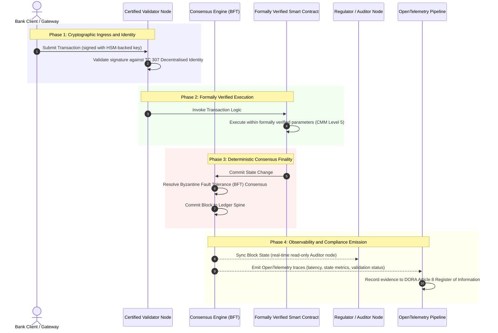

# প্রমাণ থেকে সত্যে: কেন প্রত্যয়িত ব্লকচেইন ব্যাংকিং আস্থার পরবর্তী যুগকে সংজ্ঞায়িত করবে

**অপরিবর্তনীয় মানেই বিশ্বস্ত নয়।** পাইকারি ব্যাংকিং যখন রিয়েল-টাইম নিষ্পত্তি ও সম্ভাব্যতানির্ভর AI-এর দিকে এগোচ্ছে, তখন যে খতিয়ান সত্য নির্ধারণ করে সেটিই একমাত্র স্তর যা ব্যাংকগুলি এখনও প্রত্যয়িত করতে পারে না। তারা Basel III-এর অধীনে প্রতিষ্ঠান, ISO 27001-এর অধীনে ক্লাউড এবং ISO 42001-এর অধীনে তাদের AI প্রত্যয়িত করে, কিন্তু বিতরণকৃত খতিয়ান, এর সুশাসন, ঐকমত্য, ক্রিপ্টোগ্রাফি ও স্মার্ট চুক্তি, বিক্রেতা-নির্দিষ্ট অনুমানের উপর ছেড়ে দেওয়া হয়। এই প্রতিবেদন যুক্তি দেয় যে সেই আস্থাগত ব্যবধান দূর করতে হলে ISO/IEC TC 307 নির্দেশনা থেকে নির্দেশমূলক নিশ্চয়তার দিকে যেতে হবে: একটি ৫-স্তরের প্রত্যয়িত ব্লকচেইন সূচকের বিপরীতে খতিয়ান স্কোর করা, যা প্রকৌশল মেট্রিককে বোর্ড-নিরীক্ষাযোগ্য, DORA-রক্ষণযোগ্য সত্যে রূপান্তরিত করে।

<!-- lead-start -->
<aside class="post-lead" aria-label="নিবন্ধের সারসংক্ষেপ">

<strong>সংক্ষেপে।</strong> ব্যাংকগুলি প্রতিষ্ঠান, ক্লাউড ও তাদের AI প্রত্যয়িত করে, কিন্তু যে খতিয়ান ক্রমবর্ধমানভাবে সত্য নির্ধারণ করে তা নয়। ISO/IEC TC 307 নির্দেশনা দেয়, নিশ্চয়তা নয়। একটি ৫-স্তরের প্রত্যয়িত ব্লকচেইন সূচক খতিয়ান সুশাসন, ঐকমত্য অখণ্ডতা, পরিচয় ও ক্রিপ্টোগ্রাফি, স্মার্ট-চুক্তি নিশ্চয়তা এবং পর্যবেক্ষণযোগ্যতাকে একটি পরিপক্বতা মডেলের বিপরীতে স্কোর করে, আস্থাগত ব্যবধান দূর করে এবং সম্ভাব্যতানির্ভর AI-কে একটি নির্ধারক নিরীক্ষা মেরুদণ্ড দেয়।

<strong>প্রধান গ্রহণযোগ্য বিষয়সমূহ</strong>

<ul class="post-lead-takeaways">
  <li><strong>আস্থাগত ঘর্ষণজনিত ব্যবধান।</strong> ব্যাংক (Basel III), ক্লাউড (ISO 27001) এবং AI সুশাসন ব্যবস্থা (ISO 42001) প্রত্যয়িত করা যায়; কিন্তু যে বিতরণকৃত খতিয়ান সত্য নির্ধারণ করে তা এখনও করা যায় না। এই অসামঞ্জস্য একটি সক্রিয় পরিচালনগত দুর্বলতা।</li>
  <li><strong>DORA একে ব্যক্তিগত করে তোলে।</strong> DORA Article 5-এর অধীনে, ব্যাংক বোর্ড তৃতীয়-পক্ষ ও খতিয়ান স্থাপনার সহনশীলতার জন্য সরাসরি, অ-অর্পণযোগ্য দায়ভার বহন করে, এবং ব্যর্থতার জন্য SM&amp;CR ব্যক্তিগত শাস্তি রয়েছে।</li>
  <li><strong>AI নিরীক্ষা মেরুদণ্ড।</strong> মেশিন লার্নিং পুনরুৎপাদনযোগ্য নয়; একটি প্রত্যয়িত ব্লকচেইন মডেল সংস্করণ, ইনপুট ও যাচাই সিদ্ধান্ত অন-চেইন নির্ধারকভাবে ধারণ করে, যা ISO 42001 ও মডেল-ঝুঁকি-ব্যবস্থাপনা মানদণ্ড পূরণ করে।</li>
  <li><strong>প্রত্যয়িত ব্লকচেইন সূচক।</strong> সুশাসন, ঐকমত্য, ক্রিপ্টোগ্রাফি, স্মার্ট চুক্তি ও পর্যবেক্ষণযোগ্যতা ০-থেকে-৫ CMM স্কোরকার্ডে পরিণত হয়, যা প্রকৌশল মেট্রিককে বোর্ড-অনুমোদিত ঝুঁকি প্রবণতা বিবৃতিতে (Risk Appetite Statements) রূপান্তরিত করে।</li>
</ul>

<strong>সম্পর্কিত পাঠ:</strong> <a href="https://sebastienrousseau.com/2026-07-02-certified-blockchains-banking-trust-tc307-assurance-2026">প্রত্যয়িত ব্লকচেইন ও ব্যাংকিং আস্থা: TC 307 নিশ্চয়তা</a>, <a href="https://sebastienrousseau.com/2026-07-24-global-payments-outlook-operating-model-risk-revenue">২০২৬ বৈশ্বিক পেমেন্ট আউটলুক</a>।

</aside>
<!-- lead-end -->

> **নির্বাহী সারসংক্ষেপ**
>
> - **পাইকারি ব্যাংকিং একটি সন্ধিক্ষণে দাঁড়িয়ে।** রিয়েল-টাইম ক্লিয়ারিং ও সম্ভাব্যতানির্ভর AI অ্যানালগ, ভূতাপেক্ষ নিশ্চয়তা মডেলকে ভেঙে দেয়: স্থির, প্রতিষ্ঠান-ভিত্তিক নিরীক্ষা আর আধুনিক ঝুঁকি-ব্যবস্থাপনা বা আস্থাগত চাহিদা পূরণ করে না।
> - **TC 307 একটি ভিত্তিরেখা, প্রত্যয়নপত্র নয়।** ISO/IEC TC 307 বিতরণকৃত খতিয়ানের জন্য শব্দভাণ্ডার, রেফারেন্স আর্কিটেকচার ও নিরাপত্তা নির্দেশনা মানসম্মত করেছে, কিন্তু তা বর্ণনামূলক। এটি সংজ্ঞায়িত করে ভালো দেখতে কেমন; কিন্তু উৎপাদন স্থাপনা অনুমোদন করতে ঝুঁকি কর্মকর্তা ও তত্ত্বাবধায়কদের যে নির্দেশমূলক যাচাই প্রয়োজন তা এটি সরবরাহ করে না।
> - **নিশ্চয়তা মানে খতিয়ানকে স্কোর করা।** সুশাসন, ঐকমত্য অখণ্ডতা, স্মার্ট-চুক্তি নিরাপত্তা ও ক্রিপ্টোগ্রাফিক ক্ষিপ্রতা, একটি কঠোর ৫-স্তরের পরিপক্বতা মডেলের বিপরীতে স্কোর করা হলে, ব্যাংকগুলিকে জোড়াতালি, বিক্রেতা-নির্দিষ্ট অনুমান থেকে প্রত্যয়নযোগ্য, বোর্ড-নিরীক্ষাযোগ্য আর্থিক সত্যে নিয়ে যায়।
> - **খতিয়ানই AI-এর নিরীক্ষা মেরুদণ্ড।** মডেল সংস্করণ, ইনপুট ও যাচাই সিদ্ধান্তকে নির্ধারক ঐকমত্যে নোঙর করলে পুনরুৎপাদন-অযোগ্য মেশিন লার্নিং ISO 42001, SR 11-7 ও PRA SS1/23-এর অধীনে একটি রক্ষণযোগ্য, পুনর্গঠনযোগ্য প্রামাণিক নথি পায়।

## ডিজিটাল ব্যাংকিংয়ে আস্থাগত ঘর্ষণজনিত ব্যবধান

প্রথাগত ব্যাংকিংয়ে আস্থা সম্পর্কনির্ভর, প্রাতিষ্ঠানিক ও ভূতাপেক্ষ। এটি স্বাধীন, তৃতীয়-পক্ষ নিরীক্ষকদের উপর নির্ভর করে যারা স্থির সময়বিন্দুতে আর্থিক অবস্থা পর্যালোচনা করে, দ্বিপাক্ষিক খতিয়ান সাইলোর মধ্যে অসঙ্গতি মিলিয়ে নেয়। ২০২৬ সালের রিয়েল-টাইম, API-চালিত বাজারে এই মডেল নিষেধমূলক বিলম্ব ও কাঠামোগত ঝুঁকি নিয়ে আসে।

যখন লেনদেন তাৎক্ষণিকভাবে নিষ্পত্তি হয়, দিনভর তারল্য পুল API গেটওয়ে দ্বারা গতিশীলভাবে পরিচালিত হয়, এবং সম্পদের মালিকানা ভাগ করা খতিয়ানজুড়ে টোকেনায়িত হয়, তখন ভূতাপেক্ষ নিরীক্ষা প্রতিরোধমূলক নিয়ন্ত্রণের বদলে ফরেনসিক অনুশীলনে পরিণত হয়। আস্থাভাজনরা আর কেবল কর্পোরেট প্রতিষ্ঠান প্রত্যয়নের উপর নির্ভর করতে পারে না। তাদের ডিজিটাল ভিত্তি নিজেই প্রত্যয়িত করতে হবে।

বর্তমানে, ব্যাংকগুলি একটি প্রকট স্থাপত্যগত অসামঞ্জস্যের অধীনে পরিচালিত হয়:

1. **প্রত্যয়িত ক্লাউড অবকাঠামো**: হার্ডওয়্যার নোড, ভার্চুয়ালাইজড কন্টেইনার ও ভৌত ডেটাসেন্টার ISO/IEC 27001 ও SOC 2 Type II নিয়ন্ত্রণের বিপরীতে যাচাই করা হয়।  
2. **প্রত্যয়িত ব্যবস্থাপনা প্রক্রিয়া**: পরিচালনগত ঝুঁকি নীতি, ব্যবসায়িক ধারাবাহিকতা পরিকল্পনা ও অ্যালগরিদমিক স্থাপনা কঠোর ঝুঁকি কাঠামোর অধীনে পরিচালিত হয়।  
3. **অপ্রত্যয়িত খতিয়ান ইঞ্জিন**: মূল বিতরণকৃত ঐকমত্য কৌশল, ভ্যালিডেটর নোড সরবরাহ শৃঙ্খল, স্মার্ট চুক্তির সীমানা ও নেটওয়ার্ক সুশাসন মডেল অপ্রত্যয়িত, কাস্টম, বা কনসোর্টিয়াম-নির্দিষ্ট অনুমানের উপর ছেড়ে দেওয়া হয়।

এই অসামঞ্জস্য একটি বড় ব্যর্থতাবিন্দু। একটি ব্যাংক নিরাপদ, ISO 27001-প্রত্যয়িত ক্লাউড কন্টেইনারের ভেতরে একটি যাচাইকৃত অ্যাপ্লিকেশন চালাতে পারে, কিন্তু সেই কন্টেইনার যদি কেন্দ্রীভূত ভ্যালিডেটর নিয়ন্ত্রণ, দুর্বল ঐকমত্য প্যারামিটার, বা অ-নিরীক্ষিত স্মার্ট চুক্তিসহ একটি বিতরণকৃত খতিয়ানে লেখে, তবে লেনদেনের অখণ্ডতা বিপন্ন হয়। এই ব্যবধান পূরণ করতে হলে খতিয়ান ইঞ্জিন নিজেই একটি প্রত্যয়নযোগ্য নিশ্চয়তা বস্তুতে পরিণত হতে হবে।

## ISO/IEC TC 307 মানকীকরণ ভিত্তিরেখা

বিতরণকৃত খতিয়ান মানসম্মত করতে প্রয়োজনীয় মৌলিক কাজ ISO/IEC Technical Committee 307 (TC 307\) (ব্লকচেইন ও বিতরণকৃত খতিয়ান প্রযুক্তি) দ্বারা প্রতিষ্ঠিত হচ্ছে। ব্লকচেইনকে একটি বিচ্ছিন্ন কারিগরি প্রোটোকল হিসেবে বিবেচনা না করে, TC 307 একে একটি প্রাতিষ্ঠানিক আস্থা অবকাঠামো হিসেবে দেখে, পাঁচটি মূল স্তম্ভজুড়ে তার কাজ সংগঠিত করে:

1. **শ্রেণিবিন্যাস ও শব্দভাণ্ডার (ISO 22739\)**: একটি অভিন্ন নামকরণ প্রতিষ্ঠা করে, বিভিন্ন এখতিয়ার, আর্থিক স্কিম ও প্রতিষ্ঠানজুড়ে সামঞ্জস্যপূর্ণ আইনি ও পরিচালনগত সংজ্ঞা নিশ্চিত করে।  
2. **রেফারেন্স আর্কিটেকচার (ISO/TR 23245\)**: একটি সম্মতিসম্পন্ন বিতরণকৃত খতিয়ান ব্যবস্থার সীমানা, স্তর, ডেটা প্রবাহ ও কার্যকরী উপাদান সংজ্ঞায়িত করে।  
3. **নিরাপত্তা, গোপনীয়তা ও স্মার্ট চুক্তি (ISO/TR 23244 / ISO 23613\)**: ডিজিটাল সম্পদ ব্যবস্থার জন্য ভিত্তিরেখা নিরাপত্তা নির্দেশিকা প্রতিষ্ঠা করে এবং স্মার্ট চুক্তির দুর্বলতা প্রশমন ও জীবনচক্র সুশাসনের সর্বোত্তম চর্চা বিশদভাবে ব্যাখ্যা করে।  
4. **আন্তঃকার্যক্ষমতা কাঠামো**: ভিন্নধর্মী খতিয়ান নেটওয়ার্কের মধ্যে ডেটা ও সম্পদ-বিনিময় কৌশল নিয়ে কাজ করে, বিচ্ছিন্ন টোকেনায়িত সাইলো গঠন প্রতিরোধ করে।  
5. **বিকেন্দ্রীভূত পরিচয় ও আস্থা নোঙর**: খতিয়ান-ভিত্তিক ক্রিপ্টোগ্রাফিক শনাক্তকারীকে আনুষ্ঠানিক পাবলিক-কী অবকাঠামো (PKI) ও রাষ্ট্র-অনুমোদিত রেজিস্ট্রির সাথে সমন্বিত করে।

সম্মিলিতভাবে, TC 307 DLT-এর একটি কাস্টম প্রকৌশল পছন্দ থেকে একটি মানসম্মত স্থাপত্যগত শৃঙ্খলায় রূপান্তরের সংকেত দেয়। তবে, TC 307 মূলত বর্ণনামূলকই থেকে যায়। এটি সংজ্ঞায়িত করে ভালো দেখতে কেমন (নির্দেশনা), কিন্তু ঝুঁকি কর্মকর্তা ও তত্ত্বাবধায়করা গুরুত্বপূর্ণ বা তাৎপর্যপূর্ণ কার্যাবলি (CIFs) উৎপাদন স্থাপনা অনুমোদন করতে যে নির্দেশমূলক যাচাই প্রোটোকল (নিশ্চয়তা) প্রয়োজন তা এটি সরবরাহ করে না।

## নির্দেশনা বনাম নিশ্চয়তা: আস্থাগত পার্থক্য

আর্থিক বাজারের অংশগ্রহণকারীরা প্রযুক্তি স্থাপন করে না কারণ তা উদ্ভাবনী বা মার্জিত; তারা তা স্থাপন করে যখন সেটিকে পরিচালনা, নিরীক্ষা, রক্ষা এবং মূলধন সংরক্ষিত প্রয়োজনীয়তার সাথে মিলিয়ে নেওয়া যায়। এই কারণেই ব্যাংকিংয়ে মানকীকরণ স্বাভাবিকভাবে দুটি স্তরে বিভক্ত হয়:

* **নির্দেশনা (কাঠামো)**: সর্বোত্তম চর্চা, রেফারেন্স লক্ষ্য ও স্থাপত্যগত নির্দেশিকা রূপরেখা দেয় (যেমন, ISO/IEC TC 307, NIST কাঠামো)।  
* **নিশ্চয়তা (প্রমাণ)**: স্বাধীন, ধারাবাহিক ও তৃতীয়-পক্ষ-যাচাইযোগ্য প্রমাণ সরবরাহ করে যে কাঠামোটি নকশা অনুযায়ী বাস্তবায়িত ও পরিচালিত হচ্ছে (যেমন, ISO 27001 প্রত্যয়ন, SOC 2 নিরীক্ষা, নিয়ন্ত্রক পরীক্ষা)।

ক্লাউড অবকাঠামো প্রত্যয়িত করার সময় অপ্রত্যয়িত খতিয়ান ঐকমত্যের উপর নির্ভর করা একটি গুরুতর নিয়ন্ত্রক ব্যবধান। যে ব্লকচেইন "অপরিবর্তনীয়" তা অগত্যা "প্রাতিষ্ঠানিকভাবে বিশ্বস্ত" নয়। অপরিবর্তনীয়তা কেবল নিশ্চিত করে যে প্রবেশ করানো ডেটা অপরিবর্তিত; এটি যাচাই করে না যে ভ্যালিডেটর নোডগুলি নিরাপদ, ঐকমত্য প্রোটোকল যোগসাজশের বিরুদ্ধে সহনশীল, স্মার্ট চুক্তির যুক্তি গাণিতিকভাবে সঠিক, বা ক্রিপ্টোগ্রাফিক কী ব্যবস্থাপনা পোস্ট-কোয়ান্টাম বাধ্যবাধকতা মেনে চলে।

এই ব্যবধান দূর করতে, ২০২৬ প্রত্যয়িত ব্লকচেইন সূচক এই প্রয়োজনীয়তাগুলিকে বৈশ্বিক ব্যাংকিং নিয়ন্ত্রণের সাথে মানচিত্রায়িত একটি পরিমাপযোগ্য পরিপক্বতা মডেলে (CMM) আনুষ্ঠানিক রূপ দেয়।

## ২০২৬ প্রত্যয়িত ব্লকচেইন সূচক

ঊর্ধ্বতন ব্যবস্থাপনাকে তাদের খতিয়ান প্ল্যাটফর্ম মূল্যায়ন ও প্রত্যয়িত করতে সক্ষম করতে, এই সূচক বিতরণকৃত খতিয়ান অবকাঠামোকে পাঁচটি নিরীক্ষাযোগ্য পরিচালনগত স্তরে গঠন করে, যা একটি ০-থেকে-৫ CMM স্কেলে স্কোর করা হয়।

### সারণি ১: প্রত্যয়িত ব্লকচেইন সূচক আর্কিটেকচার

| সূচক স্তর | পরিপক্বতা স্তর (CMM) | কারিগরি ও পরিচালনগত মেট্রিক | নিয়ন্ত্রক / আস্থাগত নিয়ন্ত্রণ রেফারেন্স |
| ---- | ---- | ---- | ---- |
| **খতিয়ান সুশাসন** | **Level 0**: অ্যাডহক কনসোর্টিয়াম**Level 3**: স্বয়ংক্রিয় ভ্যালিডেটর যাচাই ও ঘূর্ণন**Level 5**: বিকেন্দ্রীভূত, বহু-পক্ষীয় ক্রিপ্টোগ্রাফিক পরিচয় নোঙরকরণ | যাচাইকৃত আর্থিক প্রতিষ্ঠান দ্বারা পরিচালিত ভ্যালিডেটর নোডের %; ভ্যালিডেটর বিরোধ নিষ্পত্তির গড় সময়; নোডের ভৌগোলিক বণ্টন | **DORA Article 5** (সুশাসন ও সংগঠন); **CPMI-IOSCO PFMI Principle 2** (সুশাসন) ও **Principle 3** (ঝুঁকির সামগ্রিক ব্যবস্থাপনার কাঠামো) |
| **ঐকমত্য অখণ্ডতা** | **Level 0**: একক-নোড বা অস্বচ্ছ POW**Level 3**: নির্ধারক চূড়ান্ততাসহ নিরীক্ষিত BFT**Level 5**: ধারাবাহিক বিলম্ব পর্যবেক্ষণসহ বহু-এখতিয়ারভুক্ত, আনুষ্ঠানিকভাবে যাচাইকৃত ঐকমত্য | সর্বোচ্চ সহনীয় ঐকমত্য বিলম্ব; যোগসাজশ-প্রতিরোধ সীমা; অনুকরণকৃত নোড বিভাজনের অধীনে আপটাইম SLA | **DORA Article 6** (ICT ঝুঁকি ব্যবস্থাপনা কাঠামো); **CPMI-IOSCO PFMI Principle 8** (নিষ্পত্তি চূড়ান্ততা) |
| **পরিচয় ও ক্রিপ্টোগ্রাফি** | **Level 0**: দুর্বল RSA / ECDSA কী**Level 3**: HSM-সমর্থিত কী ব্যবস্থাপনাসহ মাল্টি-সিগ**Level 5**: কোয়ান্টাম-নিরাপদ হাইব্রিড কী (FIPS 203 ML-KEM) ও জিরো-নলেজ গোপনীয়তা গেট | HSM-সমর্থিত কী দিয়ে স্বাক্ষরিত খতিয়ান লেনদেনের %; PQC মাইগ্রেশন প্রস্তুতি স্কোর; ZK-প্রুফ বিলম্ব | **NIST FIPS 203 / 204**; **ISO/IEC 27001** (তথ্য নিরাপত্তা ব্যবস্থাপনা) |
| **স্মার্ট চুক্তি নিশ্চয়তা** | **Level 0**: অ-নিরীক্ষিত সলিডিটি স্ক্রিপ্ট**Level 3**: স্বয়ংক্রিয় কম্পাইলার যাচাই ও বাহ্যিক নিরীক্ষা**Level 5**: সার্কিট-ব্রেকার আপগ্রেডসহ আনুষ্ঠানিকভাবে যাচাইকৃত, অপরিবর্তনীয় স্মার্ট চুক্তি | গাণিতিক আনুষ্ঠানিক যাচাইসহ স্মার্ট চুক্তির %; কম্পাইলার সতর্কবার্তার সংখ্যা; দুর্বলতা স্ক্যান কভারেজ | **EBA Guidelines on Outsourcing Arrangements** (অনুচ্ছেদ 81, 113-117); **DORA Article 30** (ন্যূনতম চুক্তিগত ধারা) |
| **নিরীক্ষা ও পর্যবেক্ষণযোগ্যতা** | **Level 0**: ম্যানুয়াল লগ স্ক্র্যাপিং**Level 3**: কাঠামোবদ্ধ OTel ট্রেস ও কেবল-পঠনযোগ্য নিরীক্ষক নোড**Level 5**: Article 8 রেজিস্টারে স্বয়ংক্রিয়, ধারাবাহিক মিলকরণ | OpenTelemetry ট্রেস দ্বারা আচ্ছাদিত লেনদেনের %; খতিয়ান ব্লক-কমিট থেকে নিরীক্ষক-নোড সিঙ্ক পর্যন্ত বিলম্ব | **BCBS 239** (ঝুঁকি ডেটা সমষ্টিকরণ); **DORA Article 8** (তথ্য রেজিস্টার / ITS স্কিমা) |

### সারণি ২: বৈশ্বিক ব্যাংকিং মানদণ্ডে মানচিত্রায়িত প্রধান আস্থা সংকেত

| সংকেত / বেঞ্চমার্ক | মেট্রিক | ব্যাংকিং প্ল্যাটফর্মে প্রভাব | নিয়ন্ত্রক উৎস |
| ---- | ---- | ---- | ---- |
| **ISO/IEC TC 307 অগ্রগতি** | ISO/TR কারিগরি প্রতিবেদন থেকে আনুষ্ঠানিক প্রত্যয়ন স্কিমে রূপান্তর | বিতরণকৃত খতিয়ান ইঞ্জিন প্রত্যয়নের জন্য প্রথম মানসম্মত কাঠামো প্রতিষ্ঠা করে | **ISO/IEC JTC 1 / SC 44** (বিতরণকৃত খতিয়ান প্রযুক্তি) |
| **Project Agorá প্রোটোটাইপ পর্যায়** | ৪০+ অংশগ্রহণকারী বাণিজ্যিক ব্যাংক; টোকেনায়িত আমানতের একীভূত খতিয়ান পরীক্ষা | সীমান্ত-পার ক্লিয়ারিং মেসেজিং (SWIFT) থেকে অ্যাটমিক টোকেনায়িত নিষ্পত্তিতে স্থানান্তর | **Bank for International Settlements (BIS) Innovation Hub** |
| **DORA Article 30 তৃতীয়-পক্ষ নিরীক্ষা** | নোড প্রদানকারী ও অবকাঠামো হোস্টের ১০০% নিরাপত্তা মানদণ্ডের বিপরীতে নিরীক্ষিত | "ছায়া ভ্যালিডেটর নোড" দূর করে; সম্পূর্ণ সরবরাহ-শৃঙ্খল স্বচ্ছতা বাধ্যতামূলক করে | **European Supervisory Authorities (ESA)** |
| **ISO/IEC 42001 (AI সুশাসন)** | ক্রিপ্টোগ্রাফিকভাবে অপরিবর্তনীয়কৃত AI মডেল ও প্রশিক্ষণ লগ অন-চেইন | মেশিন লার্নিংয়ের জন্য ব্লকচেইনকে অপরিবর্তনীয় প্রামাণিক খতিয়ান ("নিরীক্ষা মেরুদণ্ড") হিসেবে ব্যবহার করে | **ISO/IEC 42001:2023** (তথ্য প্রযুক্তি, কৃত্রিম বুদ্ধিমত্তা) |
| **Basel III মূলধন পর্যাপ্ততা** | নথিভুক্ত জটিলতা হ্রাসের ভিত্তিতে পরিচালনগত ঝুঁকি মূলধন বাফার হ্রাস | মানসম্মত পরিচালনগত ঝুঁকি কাঠামো সরাসরি যাচাইকৃত খতিয়ান সহনশীলতাকে স্বীকৃতি দেয় | **Basel Committee on Banking Supervision (BCBS)** |

## AI "নিরীক্ষা মেরুদণ্ড": নির্ধারক অবকাঠামোর উপর সম্ভাব্যতানির্ভর বুদ্ধিমত্তা

২০২৬ সালে একটি প্রত্যয়িত ব্লকচেইনের অন্যতম শক্তিশালী কৌশলগত ভূমিকা হলো কৃত্রিম বুদ্ধিমত্তা স্থাপনার জন্য একটি **"নিরীক্ষা মেরুদণ্ড"** হিসেবে কাজ করা। আধুনিক আর্থিক ব্যবস্থা ক্রমবর্ধমানভাবে সম্ভাব্যতানির্ভর। ক্রেডিট স্কোরিং, রিয়েল-টাইম জালিয়াতি শনাক্তকরণ, অ্যালগরিদমিক ট্রেডিং ও স্বায়ত্তশাসিত গ্রাহক মিথস্ক্রিয়া এমন মেশিন লার্নিং মডেল দ্বারা চালিত যা সময়ের সাথে বিবর্তিত, বিচ্যুত ও অভিযোজিত হয়। এই মডেলগুলি অ-নির্ধারক: একই ইনপুট দুটি ভিন্ন সময়ে দিলে, গতিশীল ওজন ও ধারাবাহিক প্রশিক্ষণের কারণে ভিন্ন ফলাফল দিতে পারে।

এই অ-নির্ধারকতা **ISO/IEC 42001 (AI সুশাসন)** ও **মডেল ঝুঁকি ব্যবস্থাপনা (MRM)** মানদণ্ডের (যেমন **US Federal Reserve SR 11-7** ও **UK PRA SS1/23**) অধীনে একটি গভীর সুশাসন চ্যালেঞ্জ তৈরি করে: *যেসব সিদ্ধান্ত কঠোরভাবে পুনরুৎপাদনযোগ্য নয় সেগুলি আপনি কীভাবে নিরীক্ষা, ব্যাখ্যা ও রক্ষা করবেন?*

একটি প্রত্যয়িত বিতরণকৃত খতিয়ান নির্ধারক ভারসাম্য প্রদান করে। AI মডেল যখন সম্ভাব্যতানির্ভরভাবে কাজ করে, প্রত্যয়িত ব্লকচেইন তাদের প্যারামিটার নির্ধারকভাবে রেকর্ড করে, একটি অপরিবর্তনীয় প্রামাণিক মেরুদণ্ড প্রতিষ্ঠা করে:

* **মডেল সংস্করণকরণ ও ওজন নোঙরকরণ**: প্রতিটি স্থাপিত মডেল সংস্করণ, তার সংশ্লিষ্ট ওজন ও তার প্রশিক্ষণ ডেটা চেকসাম বিল্ড-টাইমে হ্যাশ করা হয় ও খতিয়ানে লেখা হয়, যা **SLSA Level 3** সরবরাহ-শৃঙ্খল প্রয়োজনীয়তা পূরণ করে।  
* **প্রাসঙ্গিক ইনপুট লগিং**: যখন একটি AI মডেল একটি গুরুত্বপূর্ণ সিদ্ধান্ত সম্পাদন করে (যেমন, একটি ঋণ অনুমোদন বা একটি লেনদেন চিহ্নিত করা), তখন সঠিক প্রাসঙ্গিক ইনপুট ও মডেল হ্যাশ খতিয়ানে লেখা হয়, যা একটি হস্তক্ষেপ-প্রমাণযোগ্য ইতিহাস তৈরি করে।  
* **কোড অ্যাক্সেস ছাড়াই নিরীক্ষাযোগ্যতা**: যদি কোনো নিয়ন্ত্রক জিজ্ঞাসা করে, "আপনার মডেল কেন ৩ জুন এই ক্রেডিট আবেদন প্রত্যাখ্যান করেছিল?" তবে ব্যাংকের মালিকানাধীন কোড উন্মোচন বা সঠিক মডেল অবস্থা পুনরায় তৈরি করার চেষ্টা করার প্রয়োজন নেই। এটি ইনপুট, ওজন ও যাচাই অবস্থার ক্রিপ্টোগ্রাফিকভাবে স্বাক্ষরিত, অন-চেইন খতিয়ান রেকর্ড উপস্থাপন করে।

মেশিন লার্নিং মডেলের সম্ভাব্যতানির্ভর সিদ্ধান্তকে একটি প্রত্যয়িত ব্লকচেইনের নির্ধারক ঐকমত্যে নোঙর করে, প্রতিষ্ঠান স্বয়ংক্রিয় পদক্ষেপের একটি রক্ষণযোগ্য, পুনর্গঠনযোগ্য ও স্বাধীনভাবে যাচাইযোগ্য সময়রেখা তৈরি করে।

## প্রত্যয়িত ঐকমত্য-থেকে-নিরীক্ষা পাইপলাইন দৃশ্যায়ন

নিম্নলিখিত ক্রম চিত্রটি একটি প্রত্যয়িত ব্লকচেইন প্ল্যাটফর্মের মধ্য দিয়ে যাওয়া একটি লেনদেনের জীবনচক্র চিত্রিত করে, দেখায় কীভাবে যাচাই গেট, ঐকমত্য অখণ্ডতা, স্মার্ট চুক্তি সম্পাদন ও টেলিমেট্রি নিঃসরণ পরস্পর সংযুক্ত হয়ে বোর্ড-প্রস্তুত নিয়ন্ত্রক প্রমাণ তৈরি করে:

এই লেনদেন ক্রমের গুরুত্বপূর্ণ পথের জন্য প্রয়োজন যে প্রতিটি যাচাই, সম্পাদন ও ঐকমত্য পদক্ষেপ ক্রিপ্টোগ্রাফিকভাবে স্বাক্ষরিত হয়, যা প্রান্ত-থেকে-প্রান্ত উৎসপ্রমাণ নিশ্চিত করে। নিয়ন্ত্রকের নিরীক্ষক নোড রিয়েল-টাইমে ব্লক অবস্থা সিঙ্ক্রোনাইজ করে, ভূতাপেক্ষ, ম্যানুয়াল আর্থিক মিলকরণের প্রয়োজন দূর করে।

## ঊর্ধ্বতন ব্যবস্থাপকদের জন্য বোর্ডরুম প্লেবুক

প্রাতিষ্ঠানিক আস্থা থেকে অবকাঠামোগত আস্থায় স্থানান্তর সফলভাবে পরিচালনা করতে, ব্যাংক নির্বাহী ও ঊর্ধ্বতন ব্যবস্থাপকদের অবিলম্বে চারটি মূল নির্দেশনা কার্যকর করা উচিত:

1. **এন্টারপ্রাইজ ঝুঁকি ব্যবস্থাপনায় (ERM) খতিয়ান নিরীক্ষা বাধ্যতামূলক করুন**: এমন একটি নীতি প্রয়োগ করুন যাতে কোনো বিতরণকৃত খতিয়ান প্ল্যাটফর্ম, ব্যক্তিগত, সর্বজনীন বা কনসোর্টিয়াম-ভিত্তিক যাই হোক, গুরুত্বপূর্ণ বা তাৎপর্যপূর্ণ কার্যাবলির (CIFs) জন্য স্থাপন করা না যায় যতক্ষণ না তা ৫-স্তরের **প্রত্যয়িত ব্লকচেইন সূচক আর্কিটেকচার**-এর বিপরীতে নিরীক্ষিত হয়েছে (ন্যূনতম CMM Level 3)।  
2. **ব্লকচেইনকে ISO 42001 AI প্রামাণিক মেরুদণ্ড হিসেবে সংহত করুন**: প্রধান ঝুঁকি কর্মকর্তা ও প্রধান AI আর্কিটেক্টকে নির্দেশ দিন সকল উচ্চ-প্রভাব মেশিন লার্নিং মডেলকে একটি প্রত্যয়িত ব্লকচেইনের সাথে সংহত করতে, মডেল সংস্করণ, ওজন, ইনপুট ও সিদ্ধান্তের একটি হস্তক্ষেপ-প্রমাণযোগ্য নিরীক্ষা খতিয়ান তৈরি করতে।  
3. **ভ্যালিডেটর নোড সরবরাহ শৃঙ্খল নিরীক্ষা করুন (DORA Article 30\)**: ক্রয় বিভাগকে ভ্যালিডেটর নোড হোস্টিং বা DLT নেটওয়ার্কের জন্য ক্লাউড হোস্টিং পরিচালনাকারী সকল তৃতীয়-পক্ষ প্রতিষ্ঠান নিরীক্ষা করতে বলুন, ব্যাংকের অভ্যন্তরীণ ক্লাউড নোডে প্রযোজ্য একই সাইবার নিরাপত্তা ও পরিচালনগত সহনশীলতা মানদণ্ড মেনে চলা বাধ্যতামূলক করুন।  
4. **খতিয়ান আর্কিটেকচারকে CPMI-IOSCO ও BCBS 239-এর সাথে সারিবদ্ধ করুন**: প্ল্যাটফর্ম প্রকৌশল দলকে নির্দেশ দিন খতিয়ান আউটপুট টেলিমেট্রিকে সরাসরি **BCBS 239** ডেটা প্রতিবেদন প্রয়োজনীয়তার সাথে সারিবদ্ধ করতে, এবং নিশ্চিত করুন যে ঐকমত্য ও নিষ্পত্তি চূড়ান্ততা প্যারামিটার কঠোরভাবে **CPMI-IOSCO Principles 8 and 9** মেনে চলে।

## প্রায়শই জিজ্ঞাসিত প্রশ্ন

**ISO/IEC TC 307 কি একটি প্রত্যয়ন মানদণ্ড?**  
না। ISO/IEC TC 307 একটি কারিগরি কমিটি যা শব্দভাণ্ডার, রেফারেন্স আর্কিটেকচার ও নিরাপত্তা নির্দেশিকা প্রতিষ্ঠা করে। যদিও এটি "ভালো দেখতে কেমন" (নির্দেশনা) সংজ্ঞায়িত করে, ব্যাংকিং তত্ত্বাবধায়কদের সন্তুষ্ট করতে শিল্পকে এই নথিগুলিকে আনুষ্ঠানিক, নিরীক্ষাযোগ্য প্রত্যয়ন স্কিমে (নিশ্চয়তা) রূপান্তরিত করতে হবে।

**একটি প্রত্যয়িত ব্লকচেইন কীভাবে DORA সম্মতি সমর্থন করে?**  
DORA Article 5-এর অধীনে, ব্যাংক বোর্ড প্রযুক্তি সহনশীলতার জন্য সরাসরি, ব্যক্তিগত দায়ভার বহন করে। একটি প্রত্যয়িত ব্লকচেইন ঐকমত্য অখণ্ডতা, ভ্যালিডেটর সরবরাহ-শৃঙ্খল নিয়ন্ত্রণ ও স্মার্ট চুক্তি নিরাপত্তার যাচাইযোগ্য, ক্রিপ্টোগ্রাফিক প্রমাণ সরবরাহ করে, বোর্ড সদস্যদের SM\&CR ব্যক্তিগত দায়ভার দাবির বিরুদ্ধে রক্ষা করতে প্রয়োজনীয় নথিভুক্তযোগ্য "যুক্তিসঙ্গত পদক্ষেপ" প্রদান করে।

**একটি প্রথাগত খতিয়ান নিরীক্ষা ও একটি প্রত্যয়িত ব্লকচেইন নিরীক্ষার মধ্যে পার্থক্য কী?**  
একটি প্রথাগত নিরীক্ষা ভূতাপেক্ষ, লেনদেন নিষ্পন্ন হওয়ার পরে ম্যানুয়াল এন্ট্রি ও স্থির ফাইল যাচাই করে। একটি প্রত্যয়িত ব্লকচেইন নিরীক্ষা ধারাবাহিক ও রিয়েল-টাইম; ভ্যালিডেটর নোড, BFT ঐকমত্য ইঞ্জিন ও আনুষ্ঠানিকভাবে যাচাইকৃত স্মার্ট চুক্তি লেনদেন নির্ধারকভাবে সম্পাদন করতে প্রত্যয়িত, কাঠামোবদ্ধ টেলিমেট্রি (OpenTelemetry) নিঃসরণ করে যা ধারাবাহিকভাবে ব্যবস্থার স্বাস্থ্য যাচাই করে।

**সর্বজনীন ব্লকচেইন কি ব্যাংকিং ব্যবহারের জন্য প্রত্যয়িত হতে পারে?**  
অধিকাংশ এখতিয়ারে, বিশুদ্ধ অনুমতিহীন সর্বজনীন ব্লকচেইন ভ্যালিডেটর পরিচয় যাচাইয়ের অভাব, অননুমেয় গ্যাস/লেনদেন খরচ ও অ-নির্ধারক চূড়ান্ততার (যেমন, সম্ভাব্যতানির্ভর প্রুফ-অফ-ওয়ার্ক/স্টেক ফর্ক) কারণে ব্যাংকিং নিয়ন্ত্রণ পূরণ করতে ব্যর্থ হয়। ব্যাংকিংয়ে প্রত্যয়িত ব্লকচেইন সাধারণত এন্টারপ্রাইজ অনুমতিপ্রাপ্ত বা উচ্চ-নিয়ন্ত্রিত সর্বজনীন-হাইব্রিড আর্কিটেকচার ব্যবহার করে যেখানে ভ্যালিডেটর নোড অপারেটররা শনাক্তকৃত ও নিরীক্ষিত আর্থিক প্রতিষ্ঠান।

## তথ্যসূত্র

* Basel Committee on Banking Supervision (BCBS), 2013\. *Principles for effective risk data aggregation and reporting (BCBS 239\)*. Basel: Bank for International Settlements. এখানে উপলভ্য: [Basel Committee on Banking Supervision (BCBS), 2013\.](https://www.bis.org/publ/bcbs239.pdf "Basel Committee on Banking Supervision (BCBS), 2013\.").  
* Committee on Payments and Market Infrastructures and Technical Committee of the International Organisation of Securities Commissions (CPMI-IOSCO), 2012\. *Principles for financial market infrastructures*. Basel: Bank for International Settlements. এখানে উপলভ্য: [Committee on Payments and Market Infrastructures and Technical Committee of the International Organisation of Securities Commissions (CPMI-IOSCO), 2012\.](https://www.bis.org/cpmi/publ/d101.htm "Committee on Payments and Market Infrastructures and Technical Committee of the International Organisation of Securities Commissions (CPMI-IOSCO), 2012\.").  
* European Banking Authority (EBA), 2019\. *EBA/GL/2019/02, Guidelines on outsourcing arrangements*. Paris: EBA. এখানে উপলভ্য: [European Banking Authority (EBA), 2019\.](https://www.eba.europa.eu/regulation-and-policy/internal-governance/guidelines-on-outsourcing-arrangements "European Banking Authority (EBA), 2019\.").  
* European Parliament and Council of the European Union, 2022\. *Regulation (EU) 2022/2554 on digital operational resilience for the financial sector (DORA)*. Brussels: Official Journal of the European Union. এখানে উপলভ্য: [European Parliament and Council of the European Union, 2022\.](https://eur-lex.europa.eu/legal-content/EN/TXT/?uri=CELEX%3A32022R2554 "European Parliament and Council of the European Union, 2022\.").  
* ISO/IEC JTC 1/SC 42, 2023\. *ISO/IEC 42001:2023, Information technology, Artificial intelligence, Management system*. Geneva: International Organisation for Standardisation. এখানে উপলভ্য: [ISO/IEC JTC 1/SC 42, 2023\.](https://www.iso.org/standard/81230.html "ISO/IEC JTC 1/SC 42, 2023\.").  
* ISO/IEC Technical Committee 307, 2020\. *ISO/IEC 22739:2020, Blockchain and distributed ledger technologies, Vocabulary*. Geneva: International Organisation for Standardisation. এখানে উপলভ্য: [ISO/IEC Technical Committee 307, 2020\.](https://www.iso.org/standard/73771.html "ISO/IEC Technical Committee 307, 2020\.").  
* National Institute of Standards and Technology (NIST), 2026\. *First Three Finalised Post-Quantum Encryption Standards (FIPS 203, 204, and 205\)*. Gaithersburg: U.S. Department of Commerce. এখানে উপলভ্য: [National Institute of Standards and Technology (NIST), 2026\.](https://www.nist.gov/news-events/news/2024/08/nist-releases-first-3-finalized-post-quantum-encryption-standards "National Institute of Standards and Technology (NIST), 2026\.").

