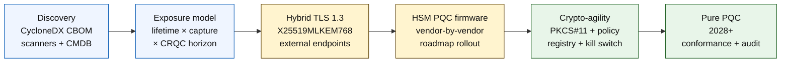

# Index kvantově bezpečného bankovnictví v roce 2026: postkvantová kryptografie, QKD, kryptografická agilita a riziko Harvest-Now-Decrypt-Later

<!-- lead-start: manual -->
<aside class="post-lead" aria-label="Shrnutí článku">

<strong>Stručně.</strong> Kvantově bezpečné bankovnictví v roce 2026 je dodací program s termínem stanoveným průsečíkem dvou křivek — životnosti důvěrnosti dat, která instituce dnes drží, a horizontem příchodu kryptograficky relevantního kvantového počítače (CRQC). NIST FIPS 203 / 204 / 205 jsou finální od srpna 2024; CNSA 2.0 stanovuje cílový stav federální správy USA na rok 2033; harvest-now-decrypt-later již probíhá u dat s dlouhou životností. Skóre kvantové připravenosti pro správní radu sleduje čtyři přesné procentuální ukazatele: úplnost inventarizace, expozice HNDL, postup migrace na NIST a připravenost kryptografické agility.

<strong>Klíčová zjištění</strong>

<ul class="post-lead-takeaways">
  <li><strong>Debata o algoritmech skončila 13. srpna 2024.</strong> ML-KEM (FIPS 203), ML-DSA (FIPS 204) a SLH-DSA (FIPS 205) jsou odpovědí. Banky, které v roce 2026 stále vedou interní vyhodnocování s cílem „vybrat vítěze", jsou o 18 měsíců pozadu.</li>
  <li><strong>Harvest-now-decrypt-later platí již dnes.</strong> Cokoli s životností důvěrnosti přesahující věrohodný příchod CRQC — třicetileté hypotéky, upisování životního pojištění, záznamy transakcí podle MiFID II / GDPR, retenční archivy M&amp;A — musí přejít na hybridní kvantově bezpečnou enkapsulaci klíčů nyní, nikoli až bude CRQC oznámen.</li>
  <li><strong>Inventarizace je vstupní bránou zralosti.</strong> Cryptographic Bill of Materials (CBOM) — protokol, knihovna, certifikát, oddíl HSM, dodavatelská závislost, vlastník aplikace, životnost dle klasifikace dat — je předpokladem všeho ostatního. Sledujte aktuálnost, nikoli pokrytí.</li>
  <li><strong>Hybridní TLS 1.3 je nasazení roku 2026.</strong> Hybridní key share X25519MLKEM768 je to, co Chrome / Firefox / Cloudflare / Akamai dnes reálně vyjednávají. Čisté ML-KEM TLS čeká na firmware HSM a připravenost certifikačních autorit.</li>
  <li><strong>Kryptografická agilita je trvalý výsledek.</strong> Abstrakce PKCS#11, označené klíče, registr politik mapující obchodní službu na povolenou množinu algoritmů. Bez ní bude další algoritmický přechod dalším víceletým programem.</li>
</ul>
</aside>
<!-- lead-end -->

Kvantově bezpečné bankovnictví v roce 2026 je o operační migraci, nikoli o spekulaci. NIST finalizoval první tři standardy postkvantové kryptografie a banky nyní musí pochopit, které systémy závisí na RSA, ECC, TLS, podpisech, HSM, certifikátech, platebních kanálech, archivech a důvěrných datech s dlouhou životností. Indexová otázka je jednoduchá: dokáže instituce nahradit kryptografii dříve, než se hrozba stane operativní?

---

> **Manažerské shrnutí / klíčová zjištění**
>
> - **Standardy NIST jsou nyní konkrétní.** FIPS 203 definuje ML-KEM pro enkapsulaci klíčů, FIPS 204 definuje ML-DSA pro podpisy a FIPS 205 definuje SLH-DSA jako bezstavový standard podpisů založených na hashi.
> - **Inventarizace je první branou zralosti.** Banka nemůže migrovat to, co neumí najít: certifikáty, klíče, protokoly, aplikace, dodavatele, HSM, API, archivy a embedované systémy musí být zmapovány.
> - **Kryptografická agilita je trvalým cílem.** Cílem není jednorázová výměna algoritmu; jde o schopnost měnit kryptografická primitiva bez přepracování celých aplikací.
> - **Dlouhověká data mění naléhavost.** Riziko harvest-now-decrypt-later znamená, že data zachycená dnes mohou být později čitelná, pokud si dostatečně dlouho udrží hodnotu.
> - **QKD je specializovaným doplňkem.** Kvantová distribuce klíčů může být relevantní pro nejhodnotnější kanály, ale nenahrazuje migraci PQC napříč institucí.
>
---

## Proč je rok 2026 rokem, kdy tento index začíná záležet

Tři posuny v letech 2024–2025 udělaly z kvantové bezpečnosti měřitelný bankovní program, nikoli pouhý výzkumný pozorovací bod. Za prvé, NIST 13. srpna 2024 finalizoval primární postkvantové standardy: [FIPS 203 (ML-KEM) ⧉](https://nvlpubs.nist.gov/nistpubs/FIPS/NIST.FIPS.203.pdf "FIPS 203 — Module-Lattice-Based Key-Encapsulation Mechanism"), [FIPS 204 (ML-DSA) ⧉](https://nvlpubs.nist.gov/nistpubs/FIPS/NIST.FIPS.204.pdf "FIPS 204 — Module-Lattice-Based Digital Signature Standard"), [FIPS 205 (SLH-DSA) ⧉](https://nvlpubs.nist.gov/nistpubs/FIPS/NIST.FIPS.205.pdf "FIPS 205 — Stateless Hash-Based Digital Signature Standard"). Debata o výběru algoritmu tímto datem skončila; banky, které v roce 2026 stále provozují interní proudy práce „které schéma vyhraje", jsou o 18 měsíců pozadu.

Za druhé, [CNSA 2.0 od NSA ⧉](https://media.defense.gov/2022/Sep/07/2003071834/-1/-1/0/CSA_CNSA_2.0_ALGORITHMS_.PDF "Commercial National Security Algorithm Suite 2.0") stanovuje cílový stav federální správy USA na rok 2033 s mezitermíny začínajícími v roce 2027 pro podepisování softwaru a firmware a v roce 2030 pro prohlížeče a operační systémy. Každá banka s expozicí vůči federálním protistranám USA — FedNow, treasury operace, federální klientské účty — sedí uvnitř tohoto perimetru u systémů dotýkajících se federálních dat. Hodiny už nejsou abstraktní.

Za třetí, [Harvest-Now-Decrypt-Later (HNDL) ⧉](https://csrc.nist.gov/Projects/post-quantum-cryptography "Program postkvantové kryptografie NIST") je nosným rizikovým argumentem pro naléhavost. Sofistikovaní protivníci již dnes zachycují platební zprávy chráněné TLS, SWIFT obálky, KYC dokumentaci a archivní šifrovaný text s dlouhou životností ve významných finančních centrech. Data zachycená v roce 2026 musí zůstat důvěrná pouze v okamžiku dešifrování — u třicetiletých hypoték, upisování životního pojištění, transakčních záznamů podle MiFID II / GDPR a retenčních archivů M&A se toto okno protahuje daleko za každý věrohodný odhad příchodu kryptograficky relevantního kvantového počítače (CRQC). Protivník dnes kvantový počítač nepotřebuje. Potřebuje ho dříve, než data přestanou mít význam.

Index kvantově bezpečného bankovnictví měří, zda vaše instituce stihne migraci dodat dříve, než tento průsečík nastane. Otázka už nezní, zda migrovat; jde o to, zda migrace doběhne v obhajitelném harmonogramu.

## Architektura indexu 2026

| Vrstva indexu | Směřování v roce 2026 | Ukazatel připravenosti | Riziko při špatném řízení |
|---|---|---|---|
| **Inventarizace** | Zmapovat kryptografická aktiva, protokoly, certifikáty, dodavatele a datové třídy | Procento inventarizovaného prostředí | Neznámé kvantově zranitelné závislosti |
| **Expozice** | Klasifikovat systémy podle životnosti důvěrnosti a transakční kritičnosti | Vysoce riziková aktiva podle hodnoty a životnosti | Špatně stanovené priority migrace |
| **Migrace** | Adoptovat hybridní a PQC-ready vzory v souladu se standardy NIST | Připravenost na ML-KEM a ML-DSA | Nouzové re-platforming pod tlakem termínu |
| **Kryptografická agilita** | Oddělit aplikační logiku od kryptografických primitiv | Pokrytí kryptografií řízenou politikou | Napevno zakódované algoritmy napříč prostředím |
| **Ujištění** | Testovat interoperabilitu, výkon, podporu HSM, certifikáty a připravenost dodavatelů | Míra úspěšnosti testů a backlog výjimek | Rozbité kanály nebo slabé kontroly náhradního řešení |

### Skóre kvantové připravenosti pro správní radu

Věrohodné skóre kvantové připravenosti vyžaduje sledování přesných procent, nikoli pouze statusů projektů:

1. **Úplnost inventarizace:** Procento aplikací úrovně 1 s plně zmapovaným Cryptographic Bill of Materials (CBOM).
2. **Expozice HNDL:** Objem dlouhověkých důvěrných dat (např. PII, obchodní tajemství) přenášených přes sítě bez hybridní kvantově bezpečné enkapsulace klíčů.
3. **Postup migrace na NIST:** Procento asymetrických šifrovacích klíčů a digitálních podpisů migrovaných na standardy FIPS 203 (ML-KEM) a FIPS 204 (ML-DSA).
4. **Připravenost kryptografické agility:** Procento kritických systémů, ve kterých lze kryptografické algoritmy rotovat centralizovanou politikou bez nutnosti rekompilace kódu.

## Aktuální signály k sledování

| Signál | Co to znamená pro banky | Zdroj |
|---|---|---|
| **FIPS 203 ML-KEM** | Primární standard NIST pro obecné ustanovení šifrovacích klíčů | [NIST ⧉](https://www.nist.gov/news-events/news/2024/08/nist-releases-first-3-finalized-post-quantum-encryption-standards "První tři finalizované postkvantové šifrovací standardy") |
| **FIPS 204 ML-DSA** | Primární standard NIST pro digitální podpisy | [NIST ⧉](https://www.nist.gov/news-events/news/2024/08/nist-releases-first-3-finalized-post-quantum-encryption-standards "První tři finalizované postkvantové šifrovací standardy") |
| **FIPS 205 SLH-DSA** | Alternativa podpisu založeného na hashi a záložní design | [NIST ⧉](https://www.nist.gov/news-events/news/2024/08/nist-releases-first-3-finalized-post-quantum-encryption-standards "První tři finalizované postkvantové šifrovací standardy") |
| **Doporučena okamžitá integrace** | NIST explicitně vyzývá administrátory, aby s integrací standardů začali, protože plná integrace vyžaduje čas | [NIST ⧉](https://www.nist.gov/news-events/news/2024/08/nist-releases-first-3-finalized-post-quantum-encryption-standards "První tři finalizované postkvantové šifrovací standardy") |
| **Bankovní kvantové programy se rozšiřují** | Hlavní banky zkoumají kvantové technologie a zároveň připravují přechod na PQC | [Quantum Insider ⧉](https://thequantuminsider.com/2026/03/27/15-plus-global-banks-probing-the-wonderful-world-of-quantum-technologies/ "Přehled globálních bank zkoumajících kvantové technologie") |

## Migrace začíná u rejstříku kryptografie

Sekvence migrace je v této chvíli dobře pochopena. Každá brána produkuje důkazy, které pohánějí tu následující; přeskočení nebo zkrácení brány je to, co generuje riziko nouzového re-platformingu uvedené ve sloupci selhání architektury indexu.

Prvním dodávaným výstupem není nový algoritmus; je to cryptographic bill of materials (CBOM). Banky potřebují živou inventarizaci, která propojuje obchodní služby s algoritmy, knihovnami, certifikáty, délkami klíčů, HSM, životnostmi dat, dodavateli a operačními vlastníky. Bez tohoto rejstříku se kvantově bezpečná migrace stává odhadováním.

Záznamový soubor CBOM by měl pro každé kryptografické primitivum zachytit: protokol nebo rozhraní (TLS 1.3, IPsec, SSH, vlastní formát platebních zpráv), algoritmus a sadu parametrů (RSA-2048, ECDH P-256, ML-KEM-768, ML-DSA-65), knihovnu a verzi (OpenSSL 3.4, hash commitu BoringSSL, build dodavatelského SDK), hardwarovou hranici (oddíl HSM, TPM, secure enclave, nebo žádná), identitu certifikátu, pokud je relevantní, vlastníka aplikace a životnost dle klasifikace dat. Nástroje, které se dostávají do produkce v letech 2025–2026 — IBM Quantum Safe Inventory, open-source [specifikace CycloneDX CBOM ⧉](https://cyclonedx.org/capabilities/cbom/ "CycloneDX Cryptography Bill of Materials"), podnikové skenery od CryptoNext / Sandbox / PQShield — se integrují do existujících CMDB pipeline. Žádný z nich není sám o sobě úplný; očekávejte 12–18měsíční cyklus budování CBOM i s dodavatelskými nástroji a vyčleněnými lidskými zdroji.

Ukazatel, který je třeba sledovat, je aktuálnost, nikoli pokrytí. CBOM, který je dva měsíce zastaralý, je horší než žádný CBOM, protože dává bezpečnostnímu týmu falešnou jistotu o tom, co bylo migrováno.

## Nejdříve hybridně, vždy agilně

Většina bank nepřepne všechno najednou. Realistickým vzorem je hybridní nasazení, kde klasické a postkvantové mechanismy běží společně, zatímco dodavatelé, protokoly, certifikáty a operační nástroje dozrávají. Dlouhodobým cílem je kryptografická agilita: kryptografické volby řízené politikou, které lze měnit bez přestavby obchodní aplikace.

[Vložit interaktivní komponentu: kalkulátor rizika Harvest-Now-Decrypt-Later (HNDL) — nástroj se slidery, kde manažeři zadávají životnost dat oproti odhadovanému kvantovému horizontu a vidí své okno expozice.]

> **Klíčový poznatek:** Pokud vaše data potřebují zůstat důvěrná po dobu 10 let a kryptograficky relevantní kvantový počítač (CRQC) je 7 let daleko, váš termín migrace není za 7 let — byl před 3 lety.

V praxi to znamená TLS 1.3 s hybridním key share `X25519MLKEM768` pro externí endpointy (Chrome / Firefox / Cloudflare / Akamai to dnes všichni podporují), klasické řetězce podpisů, dokud infrastruktura HSM a CA nedohoní vývoj, a abstrakční vrstvu PKCS#11, která umožňuje registru politik rotovat algoritmy bez rekompilace obchodních aplikací. Kryptografická agilita určuje, zda další algoritmický přechod (kdy, ne zda) bude šestitýdenní rotací, nebo dalším sedmiletým programem.

## Kam patří QKD

Kvantová distribuce klíčů patří do indexu jako vysoce citlivá kanálová volba, zejména pro infrastrukturu finančního trhu, konektivitu centrální banky a extrémně citlivé institucionální toky. Měla by být chápána jako doplněk PQC, nikoli jako záminka pro odkládání migrace v rámci podniku.

## Co to znamená podle typu banky

### Globální systémově významné banky

Tvrdým problémem je rozsah: desítky tisíc TLS endpointů, stovky HSM oddílů, desítky interních certifikačních autorit, stovky obchodních aplikací s vestavěnými kryptografickými primitivy a dodavatelská SDK, která banka nemůže modifikovat. Investicí není další pilot; jsou to nástroje CBOM, abstrakční vrstva PKCS#11 zapojená do každého nového buildu, plán konsolidace HSM, který vybere jednoho dodavatele vedoucího v PQC firmware a přijme víceletý ocas u ostatních, a registr politik, který se stává trvalým povrchem kryptografické agility ještě dlouho po dokončení migrace na FIPS 203 / 204 / 205.

### Transakční a korporátní banky

Rozsah migrace je užší než u úrovně G-SIB, ale expozice HNDL je akutní: SWIFT přeshraniční zprávy, strukturovaná platební data nesoucí PII korporátních protistran, platformy pro výměnu dokumentů držící dokumentaci trade finance a reportingové archivy s dlouhou retencí. Stanovte prioritu hybridního TLS na každém klientském endpointu a PQC v klidu pro retenční archivy. Tlačte na odpovědnost dodavatele HSM — tým platformy korporátního bankovnictví má přímou nákupní páku, kterou tým wholesale technologií často nemá.

### Regionální banky

Kupte dodavatelský stack, který už primitiva kryptografické agility má. Vyberte core bankovní platformu, jejíž dodavatel publikuje CBOM a zavazuje se k termínům podpory ML-KEM / ML-DSA. Ověřte, že roadmapa HSM dodavatele odpovídá termínu migrace banky. Inženýrská kapacita potřebná k budování kryptografické agility od nuly je víceletá; tuto cenu platí dodavatel napříč mnoha klienty a banka přebírá benefit. Validační práce — kontrola, že dodavatelské nároky obstojí v MRM procesu instituce — je legitimním interním rozsahem.

### Fintech, PSP a poskytovatelé infrastruktury

Konkurenční otázkou pro dodavatele prodávající bankám v roce 2026 není „podporujete PQC". Je to „dokážete vyrobit CycloneDX CBOM pro vaši platformu, matrici podpory HSM dodavatelů a písemné SLA pro rotaci algoritmů". Dodavatelé, kteří odpoví ano, projdou nákupními branami úrovně 1 v letech 2026–2027. Dodavatelé, kteří to nedokážou, ztratí obnovovací cyklus ve prospěch konkurenta, který to dokáže.

## Závěr

Kvantově bezpečné bankovnictví v roce 2026 není výzkumný pozorovací bod; je to dodací program s termínem stanoveným průsečíkem dvou křivek — životnosti důvěrnosti dat, která instituce dnes drží, a horizontem příchodu kryptograficky relevantního kvantového počítače. Instituce, které budou v roce 2030 vypadat věrohodně pro regulátory a protistrany, jsou ty, které začaly s konstrukcí CBOM v roce 2024, nasadily hybridní TLS na každý externí endpoint do konce roku 2026 a zaintegrovaly kryptografickou agilitu do každého nového buildu od prvního dne. Instituce, které to neudělaly, zjistí, zda jejich migrační okno už nezapadlo u dat, která jejich protivník dnes sklízí.

Měřte migraci tak, jak měříte jakýkoli operační program: rozsah znám, sekvenování s prioritami, termíny zavázány, registry výjimek poctivé. Čím tvrději se díváte na své vlastní prostředí, tím menší se migrační okno zdá.

## Často kladené otázky

**Co by banka měla inventarizovat jako první?**

Začněte u externě vystaveného TLS, platebních kanálů, autentizace klientů, mezibankovní konektivity, služeb krytých HSM, dlouhodobých archivů a systémů zpracovávajících důvěrná data s dlouhou užitnou hodnotou.

**Je PQC pouze otázkou kybernetické bezpečnosti?**

Není. Dotýká se plateb, identity, právních důkazů, podepisování transakcí, důvěry klientů, retence dat, řízení dodavatelů a operační odolnosti.

**Co znamená kryptografická agilita?**

Kryptografická agilita znamená schopnost měnit kryptografická primitiva prostřednictvím politik a platformových kontrol namísto napevno zakódovaných změn v aplikacích.

**Měly by banky čekat na další standardy?**

Ne. NIST vyzval administrátory, aby s integrací prvních finálních standardů začali, protože plná integrace vyžaduje čas.

## Reference

- NIST, (2026). [První tři finalizované postkvantové šifrovací standardy ⧉](https://www.nist.gov/news-events/news/2024/08/nist-releases-first-3-finalized-post-quantum-encryption-standards "První tři finalizované postkvantové šifrovací standardy").

<!-- enrich-start -->
<aside class="author-card" aria-label="O autorovi"><strong class="author-card-name"><a href="/about/index.html">Sebastien Rousseau</a></strong>Seniorní bankovní technolog, který píše o aplikované AI, infrastruktuře plateb, tokenizovaných penězích, ISO 20022, postkvantové bezpečnosti, cloud-native finančních službách a regulovaných digitálních trzích.Více než 20 let zkušeností napříč HSBC Commercial &amp; Investment Bank, PayPal, Barclays, Shazam, AKQA a Virgin Group. <a href="/about/index.html">Úplný profil</a> &middot; <a href="https://www.linkedin.com/in/sebastienrousseau/" rel="external noopener">LinkedIn</a> &middot; <a href="https://github.com/sebastienrousseau" rel="external noopener">GitHub</a></aside>

Naposledy ověřeno <time datetime="2026-06-04">2026-06-04</time>.

<!-- enrich-end -->
