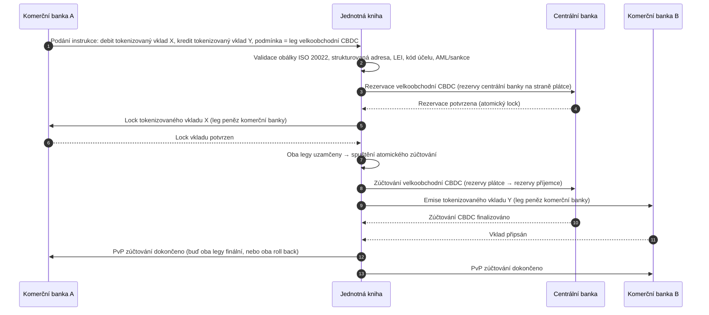

<!-- lead-start: manual -->
<aside class="post-lead" aria-label="Shrnutí článku">

<strong>Stručně.</strong> Velkoobchodní platby v roce 2026 leží na průsečíku dvou strukturálních posunů: ISO 20022 protlačuje strukturovaná platební data do provozního modelu a tokenizované vklady spolu s BIS Project Agorá posouvají přeshraniční zúčtování k atomickým, programovatelným a vždy dostupným kolejím. Otázka roku 2026 pro banku už nezní „dokončili jsme migraci zpráv", ale „jsou naše platební provozy měřitelné, směrovatelné a dozorovatelné" — a index ji rozkládá na čtyři přesná procenta: úplnost strukturovaných dat, optimalita směrování po kolejích, prodleva finality zúčtování a pokrytí koridorů Agorá.

<strong>Klíčová zjištění</strong>

<ul class="post-lead-takeaways">
  <li><strong>Listopad 2026 je tvrdý termín, nikoli doporučení.</strong> SWIFT v SR 2026 odstraňuje podporu nestrukturovaných adres; platby bez města a země v určených polích přestávají procházet. Náklady na repair, míra zamítnutí i kapacita provozu se posouvají z „metriky" do „postavení viditelného regulátorem".</li>
  <li><strong>Tokenizované vklady poráží stablecoiny v regulovaném velkoobchodu.</strong> Zachovávají vztah banka–vkladatel i zúčtovací aktivum centrální banky, ale otevírají programovatelnost. Stablecoiny si drží roli na okraji; tokenizované vklady kotví jádro.</li>
  <li><strong>BIS Project Agorá je referencí pro koridory.</strong> Pokud přeshraniční produkt banky neumí běžet uvnitř koridoru Agorá do roku 2027, soutěží na koleji, ze které zbytek trhu už odchází.</li>
  <li><strong>Orchestrace real-time kolejí je provozním modelem.</strong> Rozhodnutí o vícekolejovém směrování v roce 2026 (FedNow / RTP / TIPS / SEPA Inst / on-chain) není „která kolej" — je to registr politik, profil likvidity a směrovací motor, který kolej vybírá pro každou platbu.</li>
  <li><strong>Měřit, nebo být změřen.</strong> Čtyři procenta — úplnost strukturovaných dat, optimalita směrování po kolejích, prodleva finality zúčtování a pokrytí koridorů Agorá — promění postavení plateb v důkaz připravený pro dohled před auditním oknem 2026/27.</li>
</ul>
</aside>
<!-- lead-end -->

# Index velkoobchodních plateb v roce 2026: ISO 20022, tokenizované vklady, real-time koleje a přeshraniční zúčtování

Velkoobchodní platby v roce 2026 utvářejí dva souběžné posuny: strukturovaná platební data a programovatelné zúčtování. Listopadový milník strukturovaných adres SWIFT 2026 protlačuje kvalitu dat do provozního modelu, zatímco BIS Project Agorá a tokenizované vklady testují, zda přeshraniční zúčtování může být atomičtější, transparentnější a vždy dostupné.

---

> **Manažerské shrnutí / Klíčová zjištění**
>
> - **Listopad 2026 je tvrdý datový milník.** SWIFT uvádí, že platby obsahující nestrukturované adresy nebudou po změně SR 2026 podporovány.
> - **Strukturovaná data se stávají infrastrukturou produktu.** Město a země musí být minimálně v určených polích; kvalita platebních dat se mění v otázku klientskou, provozní i compliance.
> - **Tokenizované vklady jsou návrhovou volbou pro velkoobchod.** Project Agorá zkoumá tokenizované vklady komerčních bank a tokenizované rezervy centrální banky v modelu jednotné knihy.
> - **Index má měřit kvalitu zúčtování, nejen rychlost.** Finalita, transparentnost, míra repairů, využití likvidity, compliance data a viditelnost pro klienta váží stejně jako okamžité provedení.
> - **Přeshraniční platby zůstávají veřejno-soukromou agendou.** FSB nadále řídí roadmapu G20 přes implementační fázi v koordinaci veřejného a soukromého sektoru.
>
---

## Proč je rok 2026 ten, ve kterém tento index dává smysl

Stanford AI Index je užitečný proto, že rychle se měnící technologické pole pojímá jako něco, co lze měřit: výzkumný výstup, technický výkon, odpovědné nasazení, ekonomika, sektorové přijetí, politika a veřejné mínění jsou svedeny do jediného rámce ([Stanford HAI ⧉](https://hai.stanford.edu/ai-index/2026-ai-index-report "The 2026 AI Index Report")). Banky a finanční instituce nyní potřebují stejnou disciplínu pro infrastrukturu. Agentní AI, kvantově bezpečná bezpečnost, cloud-native odolnost a velkoobchodní platby už nejsou oddělené inovační trasy; sbíhají se do jediného provozního modelu.

Praktickou otázkou pro banku není, zda je každá doména důležitá. Otázkou je, zda instituce dokáže měřit připravenost napříč nimi všemi současně. Banka může nasadit agentní AI a přesto být křehká, pokud její kryptografie není připravená na migraci. Může modernizovat cloudové platformy a přesto selhat, pokud platební data zůstanou nestrukturovaná. Může provozovat tokenizační piloty a přesto vytvořit systémové riziko, pokud vrstvy zúčtování, likvidity, identity a auditního protokolu nejsou navrženy společně.

## Architektura indexu 2026

| Vrstva indexu | Směr 2026 | Metrika připravenosti | Riziko při špatném zacházení |
|---|---|---|---|
| **Data ISO 20022** | Přechod z nestrukturovaného textu na řízená strukturovaná pole | Připravenost strukturovaných adres a míra zamítnutí | Zamítnuté platby a manuální repair |
| **Orchestrace kolejí** | Směrování napříč RTGS, instant, korespondentní, stablecoinové a tokenizované koleje | Náklady, rychlost, finalita a směrování s ohledem na jurisdikci | Fragmentované koleje s duplikovanými kontrolami |
| **Tokenizované zúčtování** | Použití tokenizovaných vkladů a peněz centrální banky tam, kde snižují tření | Pokrytí DvP, PvP a atomického zúčtování | Pilotní aktiva bez hodnoty pro byznysový workflow |
| **Likvidita** | Optimalizace intradenní likvidity, uvězněné hotovosti a zúčtovacích oken | Ušetřená likvidita a snížení selhání zúčtování | Rychlejší odčerpání likvidity |
| **Compliance** | Zabudování AML, sankcí, FATF a auditních požadavků do platebních dat | Straight-through compliance a vysvětlitelnost | Bohatší data bez silnějších kontrol |

## Klíčové signály velkoobchodních plateb mapované na globální priority

Sada signálů 2026 není výzkumnou agendou. Je to dodací checklist, na kterém je Chief Payments Officer banky už dnes měřen. Náprava se odehrává na třech místech: v obálce zprávy, ve vrstvě orchestrace kolejí a v zúčtovací knize.

| Signál | Reference G20 / SWIFT / BIS | Implementace na technické platformě |
|---|---|---|
| **65 % platebních zpráv stále obsahuje nestrukturované adresy** | [SWIFT SR 2026 — milník strukturovaných adres, listopad 2026 ⧉](https://www.swift.com/news-events/news/iso-20022-milestone-november-2026-unstructured-addresses-be-removed "ISO 20022 November 2026 structured address milestone") | Validace schématu v middleware plateb dříve, než zpráva dorazí do adaptéru SWIFTNet; automatizovaný parsing adres na vstupu z korporátního kanálu i korespondentské banky. |
| **Cíl FSB G20: 75 % přeshraničních plateb dokončeno do 1 hodiny do roku 2027** | [Roadmapa přeshraničních plateb FSB, implementační fáze 2026 ⧉](https://www.fsb.org/2026/03/fsb-kicks-off-new-implementation-phase-to-enhance-cross-border-payments-through-public-private-partnership/ "FSB cross-border payments implementation phase") | Real-time brány pro FX konverzi s předem dohodnutými okny likvidity; háčky pro potvrzení T+0 v klientském portálu; směrovací motor kolejí, který vylučuje koridory neschopné dodržet hodinovou obálku. |
| **Cíl FSB G20: průměrný náklad přeshraniční transakce pod 1 %, retail pod 3 %** | [Kvantitativní cíle FSB G20 ⧉](https://www.fsb.org/2026/03/fsb-kicks-off-new-implementation-phase-to-enhance-cross-border-payments-through-public-private-partnership/ "FSB cross-border payments implementation phase") | Telemetrie atribuce nákladů na každém koridoru (FX spread, korespondentský poplatek, lifting cost); registr maržových politik, který vynese non-compliant pricing nahoru ještě před kotací. |
| **BIS Project Agorá vstupuje do prototypové fáze napříč sedmi centrálními bankami + 41 komerčními bankami** | [BIS Project Agorá ⧉](https://www.bis.org/about/bisih/topics/fmis/agora.htm "Project Agorá") | Integrační specifikace jednotné knihy: uzel pro knihu tokenizovaných vkladů + zúčtovací rovina velkoobchodní CBDC + KYC/AML háčky; on-chain pooly likvidity dimenzované na podíl banky v koridoru. |
| **Rámec „digitálních peněz" Deutsche Bank krystalizuje v klientské architektuře** | [Deutsche Bank — Digital Money: stablecoins, tokenised deposits and CBDCs ⧉](https://flow.db.com/publications/flow-white-papers-and-guides/digital-money-a-perspective-on-stablecoins-tokenised-deposits-and-cbdcs "Digital Money: stablecoins, tokenised deposits and CBDCs") | Wallet-agnostické zúčtovací API, které abstrahuje výběr stablecoinu / tokenizovaného vkladu / CBDC pro každou platbu; programovatelné podmínky vyhodnocované proti registru politik banky, nikoli klienta. |

## Inflexní bod platebních dat

ISO 20022 se posunulo z projektu formátu zpráv do provozního modelu kvality dat. Pokud jsou data o beneficientovi, dlužníkovi, věřiteli, agentovi, městu, zemi, účelu a stranách slabá, banka zažije zamítnutí, repairy, sankční tření, frustraci klientů a slabou analytiku.

**SR 2026 mění tohle v tvrdou smlouvu, ne v doporučení.** SWIFT Standards Release 2026 (listopad 2026) vynucuje pravidlo strukturované adresy na úrovni sítě — zprávy, jejichž element `<PstlAdr>` neobsahuje `<TwnNm>` a `<Ctry>`, budou zamítnuty při příjmu validačním stackem SWIFTNet, nikoli označeny k opravě. Repair queue přestává být back-office nákladovou položkou a stává se událostí selhání zúčtování s prodlevou viditelnou pro klienta. Provozní týmy, které SR 2026 berou jako „přísnější pokyn", pracují podle špatného runbooku.

### Shoda strukturovaných platebních dat v rámci ISO 20022

Plocha pro nápravu je úzká a dobře vymezená. XML elementy níže jsou body, kde listopadový validační stack SWIFTNet 2026 skutečně zprávy odmítá; vše ostatní jsou navazující důsledky.

| Datový element | XML tag ISO 20022 | Požadavek SWIFT pro listopad 2026 | Technická strategie nápravy |
|---|---|---|---|
| **Strukturovaná adresa** | `<PstlAdr>` obsahující `<TwnNm>` + `<Ctry>` | Povinné. Nestrukturovaný text v `<AdrLine>` spustí síťové zamítnutí na přijímajícím adaptéru SWIFTNet. | Automatizovaný parsing adres při iniciaci platby; přepis formulářů v korporátním kanálu; čištění back-booku u každé protistrany před dalším debetem. |
| **Legal Entity Identifier (LEI)** | `<Id>` pod `<OrgId>` | Důrazně doporučeno pro ověření neindividuálních finančních protistran; povinné v několika koridorech CBPR+. | Vyhledávání LEI + křížová kontrola s GLEIF při korporátním onboardingu; automatické obohacení protistran z back-booku přes referenční datové služby. |
| **Kódy účelu platby** | `<Purp>` obsahující `<Cd>` | Povinné v několika regionálních real-time koridorech (CBPR+, SEPA Inst, TIPS) pro automatický AML / sankční screening. | Mapování interních bankovních transakčních kódů na standardní seznam ISO 20022 ExternalPurposeCode; vystavení výběru účelu v UI korporátního kanálu; default-deny u neznámých kódů. |
| **Konečné strany** | `<UltmtDbtr>` / `<UltmtCdtr>` | Vystavit kontext konečného beneficienta pro splnění G20 FATF travel-rule + sankčních parametrů; povinné pro několik kódů typu platby. | Extrakce end-to-end názvů stran z pod-účtů hlavní knihy; sesouhlasení vůči KYC grafu; surfacing konečné strany v každém potvrzení. |
| **Informace o platbě (strukturované)** | `<RmtInf><Strd>` s `<RfrdDocInf>` | Vyžadováno pro sesouhlasitelné korporátní platby vázané na faktury v rámci CBPR+ Fáze 2. | Sběr strukturované remittance v okamžiku kotace v korporátním portálu; odmítnutí volnotextového fallbacku pro vysokohodnotové toky. |

## Tokenizované vklady a velkoobchodní CBDC

Tokenizované vklady zachovávají model peněz komerční banky a přidávají programovatelnost. Velkoobchodní peníze centrální banky uchovávají finalitu zúčtování. Zajímavým návrhovým vzorem je kombinace: peníze komerční banky pro klientské vztahy a úvěrovou intermediaci, peníze centrální banky pro finální zúčtování a systémovou důvěru.

Project Agorá tuto kombinaci zhmotňuje. Architektura níže je referenční vzor BIS pro atomické přeshraniční zúčtování v režimu platba-proti-platbě (PvP), které využívá současně knihu vkladů komerční banky a zúčtovací rovinu velkoobchodní CBDC, koordinované přes jednotnou knihu.

Zúčtování je atomické konstrukčně: buď oba legy commitnou, nebo se oba vrátí zpět. Finalita zúčtování na legu velkoobchodní CBDC činí převod tokenizovaného vkladu komerční banky účinným bez korespondentského rizika. Jednotná kniha je koordinační rovinou, nikoli platebním systémem v pravém slova smyslu — zúčtovací aktivum nadále emituje centrální banka a vkladový závazek nadále knihuje komerční banka.

## Nový velkoobchodní platební produkt

Produktem už není prostě platba. Je to balíček provedení, dat, likvidity, compliance, dohledatelnosti a řízení výjimek. Banky, které tyto schopnosti vystaví přes API a klientské dashboardy, promění compliance infrastruktury v hodnotu pro klienta.

## Co to znamená podle typu banky

### Globálně systémově významné banky

Globální banky by měly tento index pojmout jako scorecard podnikové architektury. Prioritou není další proof of concept; je to důkaz, že autonomní workflow, kryptografická migrace, závislost na cloudu a modernizace plateb lze řídit jako jediný systém rizika a hodnoty.

### Transakční a korporátní banky

Transakční banky by se měly soustředit na velkoobchodní platby, strukturovaná data, likviditu, tokenizované vklady a agentní treasury služby. Nejcennější klientskou nabídkou není samotný rychlejší pohyb peněz; je jím vysvětlitelný, auditovatelný, programovatelný pohyb peněz s méně vyšetřováními a lepší viditelností pracovního kapitálu.

### Regionální banky

Regionální banky by měly index použít k tomu, aby zabránily roztříštěnosti programů. Nemusí vést každou frontu, ale potřebují věrohodné pozice v governance AI, post-kvantovém inventáři, evidenci cloudového exitu a připravenosti platebních dat.

### Fintech, PSP a poskytovatelé infrastruktury

Fintech firmy a poskytovatelé infrastruktury by měli své produktové roadmapy navázat na měřitelnou připravenost bank. Nejlepší nabídky sníží integrační riziko, posílí evidenci a usnadní bankám řízení složité infrastruktury.

## Závěr

Hodnota indexového reportu je v tom, že roztříštěnou technologickou agendu mění v měřitelný provozní model. V roce 2026 vítězi ve finanční infrastruktuře nebudou instituce s nejvíce piloty. Budou to instituce, které dokážou doložit připravenost napříč autonomií, bezpečností, odolností, zúčtováním, ekonomikou a governance současně.

## Často kladené otázky

**Proč je ISO 20022 stále otázkou roku 2026?**

Protože migrace není hotová, dokud nejsou platební data strukturovaná, řízená, zachycená u zdroje a použitelná napříč kanály, klienty a tržními infrastrukturami.

**Co je tokenizovaný vklad?**

Tokenizovaný vklad je digitální reprezentace peněz komerční banky navržená tak, aby zachovala vztah banka–vkladatel a zároveň umožnila programovatelné zúčtování.

**Nahrazují tokenizované vklady stablecoiny?**

Ne všude. Stablecoiny mohou zůstat užitečné v některých digitálně-aktivových a přeshraničních kontextech, zatímco tokenizované vklady jsou strukturálně atraktivní pro regulované velkoobchodní bankovnictví.

**Co by banky měly měřit?**

Měřte připravenost strukturovaných dat, zamítnuté platby, náklady na repair, čas zúčtování, využití likvidity, výsledky směrování po kolejích a viditelnost pro klienta.

## Reference

- SWIFT, (2026). [ISO 20022 November 2026 structured address milestone ⧉](https://www.swift.com/news-events/news/iso-20022-milestone-november-2026-unstructured-addresses-be-removed "ISO 20022 November 2026 structured address milestone").
- BIS Innovation Hub, (2026). [Project Agorá ⧉](https://www.bis.org/about/bisih/topics/fmis/agora.htm "Project Agorá").
- FSB, (2026). [Cross-border payments implementation phase ⧉](https://www.fsb.org/2026/03/fsb-kicks-off-new-implementation-phase-to-enhance-cross-border-payments-through-public-private-partnership/ "Cross-border payments implementation phase").
- Deutsche Bank, (2026). [Digital Money: stablecoins, tokenised deposits and CBDCs ⧉](https://flow.db.com/publications/flow-white-papers-and-guides/digital-money-a-perspective-on-stablecoins-tokenised-deposits-and-cbdcs "Digital Money: stablecoins, tokenised deposits and CBDCs").

<!-- enrich-start -->
<aside class="author-card" aria-label="O autorovi"><strong class="author-card-name"><a href="/about/index.html">Sebastien Rousseau</a></strong>Senior bankovní technolog píšící o aplikované AI, platební infrastruktuře, tokenizovaných penězích, ISO 20022, post-kvantové bezpečnosti, cloud-native finančních službách a regulovaných digitálních trzích.20+ let napříč HSBC Commercial &amp; Investment Bank, PayPal, Barclays, Shazam, AKQA, Virgin Group. <a href="/about/index.html">Úplný profil</a> &middot; <a href="https://www.linkedin.com/in/sebastienrousseau/" rel="external noopener">LinkedIn</a> &middot; <a href="https://github.com/sebastienrousseau" rel="external noopener">GitHub</a></aside>

Naposledy revidováno <time datetime="2026-06-06">2026-06-06</time>.

<!-- enrich-end -->
