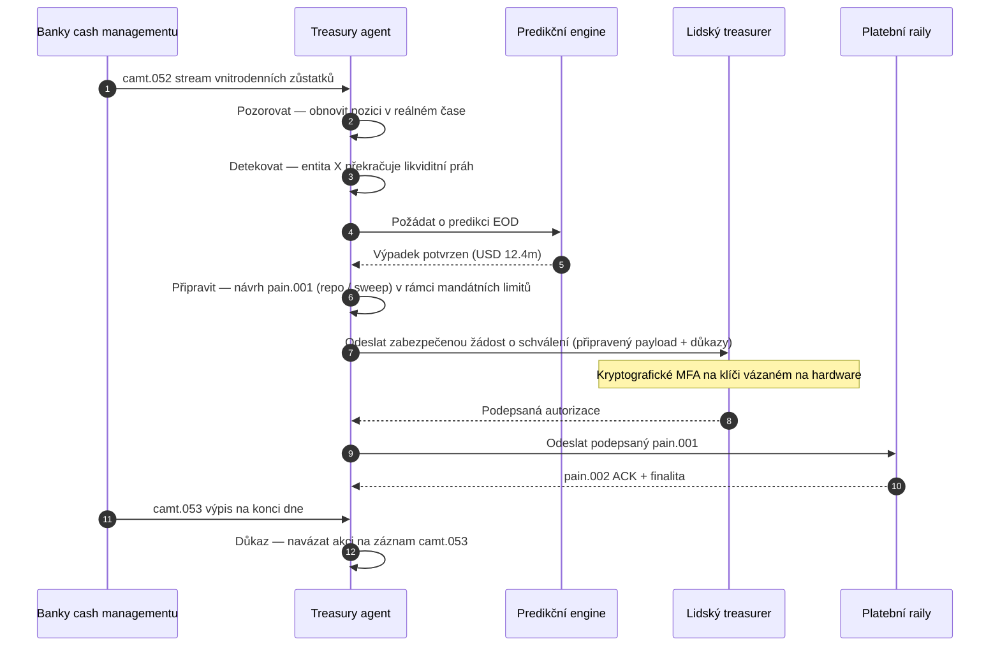

# Index autonomního treasury 2026: agentní treasury, programovatelná likvidita, tokenizované vklady a řízení hotovosti v reálném čase

<!-- lead-start -->
<aside class="post-lead" aria-label="Shrnutí článku">

<strong>Shrnutí.</strong> Index autonomního treasury pro rok 2026 — měří agentní workflowy, pokrytí programovatelné likvidity, integraci tokenizovaných vkladů, orchestraci plateb v reálném čase a automatizované řízení hotovosti jako jednu vrstvu provozního modelu.

<strong>Klíčová zjištění</strong>

<ul class="post-lead-takeaways">
  <li><strong>Treasury se mění v operační systém v reálném čase.</strong> Statické predikce hotovosti a dávkové sweepy už nejsou jednotkou měření; jsou jí agentní workflowy běžící nad daty v reálném čase.</li>
  <li><strong>Programovatelná likvidita je nyní proveditelná.</strong> Tokenizované vklady a real-time raily proměňují poskytování likvidity pro každou událost v primitivum workflowu, nikoli v kvartální iniciativu.</li>
  <li><strong>Tokenizované vklady jsou pro treasurera preferovanými digitálními penězi.</strong> Ekonomika bankovních peněz, programovatelnost a vnitrodenní jistota — bez otázek vydavatelského rizika a rezerv u stablecoinů.</li>
  <li><strong>Control plane je novou auditní plochou.</strong> Mandáty, limity, cesty ručního přepsání a důkazy o reverzi musí běžet jako platformová primitiva, nikoli jako ruční schvalování pro každou akci.</li>
  <li><strong>Skóre CFO je na úrovni rozhodnutí, nikoli kvartálu.</strong> Náklady hotovosti, snižování vnitrodenních likviditních polštářů, FX efektivita a přesnost predikce se měří rychlostí workflowu.</li>
</ul>

<strong>Související četba:</strong> <a href="https://sebastienrousseau.com/cs/2026-05-25-programmable-liquidity-ai-tokenised-deposits-real-time-treasury-2026/index.html">Programovatelná likvidita 2026: AI, tokenizované vklady, real-time treasury</a>, <a href="https://sebastienrousseau.com/cs/2026-05-21-tokenised-deposits-banking-services-status-2026/index.html">Tokenizované vklady v roce 2026: bankovní služby, konkurence stablecoinů a stav programovatelných peněz komerčních bank</a>.

</aside>
<!-- lead-end -->

Autonomní treasury je přirozeným průsečíkem agentní AI, wholesale plateb, tokenizovaných vkladů a likvidity v reálném čase. V roce 2026 nejlepší treasury architektury hotovost pouze nepredikují; doporučují, vysvětlují a postupně i vykonávají ohraničené likviditní akce napříč účty, měnami, raily a vypořádacími aktivy.

---

> **Exekutivní shrnutí / klíčová zjištění**
>
> - **Treasury se posouvá od reportingu ke kontrole.** Zůstatky v reálném čase, predikce, stavy plateb a pohyb likvidity se stávají součástí jednoho workflowu.
> - **Agentní AI vytváří nové rozhraní treasury.** Agenti mohou monitorovat pozice, upozorňovat na anomálie, připravovat financující akce a eskalovat rozhodnutí v rámci definovaných mandátů.
> - **Programovatelné peníze mění hotovostní nohu.** Tokenizované vklady a wholesale CBDC experimenty otevírají nové možnosti pro atomické vypořádání, podmíněné platby a stále dostupnou likviditu.
> - **Index musí měřit autoritu.** Otázkou není, zda agent může akci navrhnout; otázkou je, zda jsou autorita, limity, schvalování a důkazy jasné.
> - **Hodnota treasury je měřitelná.** Úspora likvidity, snížení manuálních šetření, eliminace selhání vypořádání a uvolněný provozní kapitál by měly definovat úspěch.
>
---

## Proč je rok 2026 obdobím, kdy tento index nabývá významu

Stanford AI Index je užitečný proto, že k rychle se vyvíjejícímu technologickému poli přistupuje jako k něčemu měřitelnému: výzkumný výstup, technický výkon, odpovědné nasazení, ekonomika, sektorová adopce, politika i veřejné mínění jsou zasazeny do jednoho rámce ([Stanford HAI ⧉](https://hai.stanford.edu/ai-index/2026-ai-index-report "Zpráva AI Index 2026")). Banky a finanční instituce nyní potřebují stejnou disciplínu pro svou infrastrukturu. Agentní AI, kvantově odolná bezpečnost, cloud-native odolnost a wholesale platby již nejsou samostatnými inovačními tratěmi; sbíhají se do jednoho provozního modelu.

Praktickou otázkou pro banku není, zda je každá doména důležitá. Otázkou je, zda instituce dokáže současně měřit připravenost napříč všemi. Banka může nasadit agentní AI a stále být křehká, pokud její kryptografie není připravena na migraci. Může modernizovat cloudové platformy a stále selhat, pokud platební data zůstanou nestrukturovaná. Může provozovat tokenizační piloty a stále vytvářet systémové riziko, pokud nejsou vrstvy vypořádání, likvidity, identity a auditu navrženy společně.

## Architektura indexu 2026

| Vrstva indexu | Směřování v roce 2026 | Metrika připravenosti | Riziko při špatném řízení |
|---|---|---|---|
| **Viditelnost** | Sjednotit data o účtech, platbách, likviditě a expozicích | Pokrytí pozic hotovosti v reálném čase | Roztříštěná viditelnost hotovosti |
| **Predikce** | Využívat AI k predikci zůstatků, toků a potřeby financování | Přesnost predikce a míra výjimek | Falešná jistota nad slabými daty |
| **Autonomie** | Udělit agentům ohraničenou autoritu k doporučením a akcím | Pokrytí mandáty a kvalita schvalování | Neautorizovaná či nevysvětlená akce |
| **Programovatelnost** | Tam, kde přidává hodnotu, využívat tokenizované vklady a smart podmínky | Případy podmíněných plateb a atomického vypořádání | Treasury piloty řízené technologií |
| **Kontroly** | Zabudovat limity, sankce, FX, likviditní a auditní kontroly | Důkazy o kontrolách pro každou treasury akci | Ruční governance až po exekuci |

## Aktuální signály ke sledování

| Signál | Co znamená pro banky | Zdroj |
|---|---|---|
| **52% adopce agentní AI ve finančních službách** | Treasury nyní dokáže absorbovat agentní workflowy přes řízené platformy | [Cambridge CCAF ⧉](https://www.jbs.cam.ac.uk/faculty-research/centres/alternative-finance/publications/2026-global-ai-in-financial-services-report/ "Globální zpráva o AI ve finančních službách 2026") |
| **Podmíněné platby v rámci Project Agorá** | Tokenizace může umožnit podmíněné a nepřetržitě dostupné platební funkce | [BIS ⧉](https://www.bis.org/about/bisih/topics/fmis/agora.htm "Project Agorá") |
| **Bank of England — Digital Securities Sandbox** | Dluhopisy a akcie vydané na DLT se vypořádávají na bázi 「Dodání proti platbě (DvP)」 — aktivní noha a hotovostní noha (wholesale CBDC nebo tokenizované vklady komerční banky) se vypořádávají ve stejné atomické transakci, čímž odstraňují principal counterparty riziko | [Bank of England ⧉](https://www.bankofengland.co.uk/financial-stability/digital-securities-sandbox "Digital Securities Sandbox") |
| **Termín pro strukturované adresy SWIFT** | Treasury data musí být správně zachycena u zdroje | [SWIFT ⧉](https://www.swift.com/news-events/news/iso-20022-milestone-november-2026-unstructured-addresses-be-removed "Milník ISO 20022 — strukturované adresy v listopadu 2026") |
| **Velké finanční instituce obtížně měří hodnotu AI** | Treasury automatizace potřebuje tvrdé ekonomické metriky | [Cambridge CCAF ⧉](https://www.jbs.cam.ac.uk/faculty-research/centres/alternative-finance/publications/2026-global-ai-in-financial-services-report/ "Globální zpráva o AI ve finančních službách 2026") |

## Mandát treasury agenta

Treasury agent by neměl být navržen jako univerzální asistent. Potřebuje mandát: sledovat účty, detekovat výjimky, predikovat mezery ve financování, připravovat akce, žádat o schválení, vykonávat v rámci limitů a produkovat důkazy. Každý krok by měl mít odlišný model autority.

Řídicí smyčka probíhá Pozorovat → Detekovat → Predikovat → Připravit → Požádat o schválení — a zastaví se. Agent nikdy nepřekročí kryptografickou autorizační hranici sám. Níže uvedený diagram trasuje jeden plný cyklus: vícemilionový vnitrodenní výpadek likvidity se objeví v telemetrii `camt.052`, agent předpoví pozici na konci dne, připraví repo nebo intercompany sweep jako plně sestavený `pain.001` a předá jej lidskému treasurerovi k vícefaktorovému kryptografickému podpisu na klíči vázaném na hardware. Agent poté odešle podepsaný payload; finalita dorazí jako `pain.002` ACK a další oficiální `camt.053`.

Smyslem je právě tato hranice — každá akce, která pohybuje skutečnými penězi, sedí za kryptografickou bránou, kterou agent sám nedokáže projít.

## Programovatelná likvidita

Programovatelná likvidita je schopnost přesouvat hodnotu pod podmínkami: pokud je překročen práh, pokud je kolaterál způsobilý, pokud protistrana projde screeningem, pokud je k dispozici finalita vypořádání nebo pokud je vnitrodenní likviditní polštář příliš nízký. Tokenizované vklady a wholesale vypořádací platformy činí tyto vzory praktičtějšími.

Programovatelná neznamená mimo standard. Cesta exekuce je `pain.001` — ISO 20022 Customer Credit Transfer Initiation. Připravená akce agenta je plně sestavený payload `pain.001` směrovaný do banky stejným kanálem, jaký by použil korporátní ERP, validovaný proti stejnému schématu, skórovaný stejnými fraud a sankčními enginy a potvrzený stejnými statusovými reporty `pain.002`. Vrstva podmíněnosti (práh, způsobilost kolaterálu, dostupnost finality, dolní mez polštáře) leží nad zprávou — řídí, *zda* je `pain.001` odeslán, nikoli *jakou má podobu*. Treasury platformy, které vymýšlejí vlastní payloady k vyjádření podmínek, vypadnou z bankovně konzumovatelné cesty zpět do bilaterální integrace.

## Treasury control room

Provozní model by měl vypadat jako řídicí středisko: pozice, predikce, stavy plateb, využití limitů, výjimky, schvalování a důkazy v jednom rozhraní. Index by měl penalizovat treasury stacky, které týmy nutí sešívat e-maily, tabulky, bankovní portály a nepropojené dashboardy.

Datová rovina za tímto rozhraním je ISO 20022 cash management. Vnitrodenní pozice je `camt.052` — Bank-to-Customer Account Report — streamovaná z každé banky cash managementu do pozorovací vrstvy agenta v takové frekvenci, v jaké banka publikuje (minuty u poskytovatelů GTB první ligy, konec cyklu u dlouhého chvostu). Reconciliace na konci dne je `camt.053` — Bank-to-Customer Statement — auditovatelný záznam, vůči kterému je predikce agenta následující ráno hodnocena. Treasury platformy, které čtou PDF výpisy nebo screen-scrapují bankovní portály, nemohou splnit 「Úroveň 4」 indexu; vnitrodenní telemetrie musí dorazit jako strukturovaný `camt.052`, aby se predikční smyčka uzavřela včas k akci.

## Co to znamená podle typu banky

### Globální systémově významné banky

Globální banky by měly s tímto indexem nakládat jako se skóre podnikové architektury. Prioritou není další proof of concept; je jí důkaz, že autonomní workflowy, kryptografická migrace, závislost na cloudu a modernizace plateb mohou být řízeny jako jediný systém rizik a hodnoty.

### Transakční a korporátní banky

Transakční banky by se měly soustředit na wholesale platby, strukturovaná data, likviditu, tokenizované vklady a agentní treasury služby. Nejhodnotnější klientskou nabídkou není jen rychlejší pohyb peněz; je jí vysvětlitelný, auditovatelný a programovatelný pohyb peněz s menším počtem šetření a lepší viditelností provozního kapitálu.

### Regionální banky

Regionální banky by měly tento index využít k zabránění rozbujení programů. Nemusí vést každou frontu, ale potřebují důvěryhodné pozice v oblasti AI governance, postkvantového inventáře, důkazů o možnosti odchodu z cloudu a připravenosti platebních dat.

### Fintechy, PSP a poskytovatelé infrastruktury

Fintechy a poskytovatelé infrastruktury by měli sladit své produktové roadmapy s měřitelnou připraveností bank. Nejlepší nabídky sníží integrační riziko, posílí důkazy a usnadní bankám řízení složité infrastruktury.

## Závěr

Hodnota zprávy ve formě indexu spočívá v tom, že proměňuje roztříštěnou technologickou agendu v měřitelný provozní model. V roce 2026 nebudou vítězi finanční infrastruktury instituce s nejvíce piloty. Budou to instituce, které dokážou současně prokázat připravenost napříč autonomií, bezpečností, odolností, vypořádáním, ekonomikou a governance.

## Často kladené otázky

**Co je autonomní treasury?**

Autonomní treasury je využití AI agentů, dat v reálném čase a programovatelných plateb k monitorování, doporučování a případnému vykonávání treasury akcí v rámci definovaných kontrol.

**Měli by treasury agenti směli vykonávat platby?**

Pouze v rámci úzkých mandátů, silných limitů, explicitních schválení a plné auditovatelnosti. Pravomoc k exekuci by se měla získávat skrze zralost.

**Jak tokenizované vklady pomáhají treasury?**

Mohou podporovat programovatelné vypořádání, atomickou exekuci a potenciálně lepší vnitrodenní řízení likvidity při zachování vztahů založených na penězích komerčních bank.

**Jaký je první implementační krok?**

Vybudovat viditelnost v reálném čase a kvalitu dat dříve, než udělíte autonomii. Agenti nedokážou bezpečně optimalizovat hotovost, kterou přesně nevidí.

## Reference

- Cambridge Centre for Alternative Finance, (2026). [Globální zpráva o AI ve finančních službách 2026 ⧉](https://www.jbs.cam.ac.uk/faculty-research/centres/alternative-finance/publications/2026-global-ai-in-financial-services-report/ "Globální zpráva o AI ve finančních službách 2026").
- SWIFT, (2026). [Milník ISO 20022 — strukturované adresy v listopadu 2026 ⧉](https://www.swift.com/news-events/news/iso-20022-milestone-november-2026-unstructured-addresses-be-removed "Milník ISO 20022 — strukturované adresy v listopadu 2026").
- BIS Innovation Hub, (2026). [Project Agorá ⧉](https://www.bis.org/about/bisih/topics/fmis/agora.htm "Project Agorá").
- Bank of England, (2026). [Utváření digitální finanční budoucnosti Spojeného království ⧉](https://www.bankofengland.co.uk/speech/2025/january/sasha-mills-speech-at-the-tokenisation-summit "Utváření digitální finanční budoucnosti Spojeného království").

<!-- enrich-start -->
<aside class="author-card" aria-label="O autorovi"><strong class="author-card-name"><a href="/about/index.html">Sebastien Rousseau</a></strong>Seniorní bankovní technolog, který se věnuje aplikované AI, platební infrastruktuře, tokenizovaným penězům, ISO 20022, postkvantové bezpečnosti, cloud-native finančním službám a regulovaným digitálním trhům.Více než 20 let zkušeností napříč HSBC Commercial &amp; Investment Bank, PayPal, Barclays, Shazam, AKQA a Virgin Group. <a href="/about/index.html">Úplný profil</a> &middot; <a href="https://www.linkedin.com/in/sebastienrousseau/" rel="external noopener">LinkedIn</a> &middot; <a href="https://github.com/sebastienrousseau" rel="external noopener">GitHub</a></aside>

Naposledy zkontrolováno <time datetime="2026-06-07">7. června 2026</time>.

<!-- enrich-end -->
