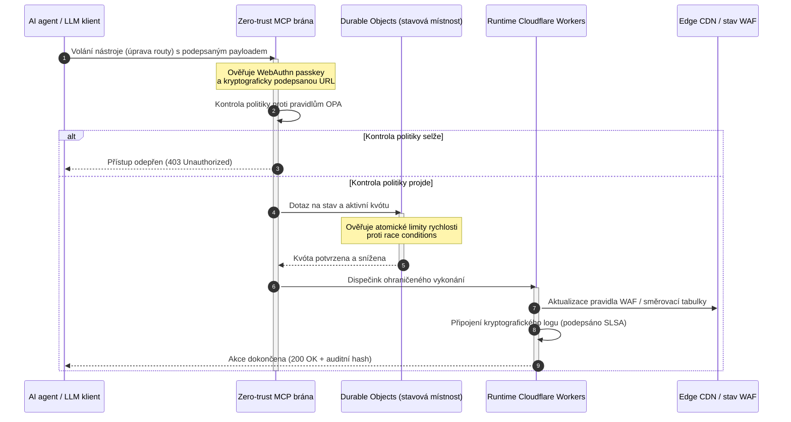

---

# Front Matter (YAML)

author: "contact@sebastienrousseau.com (Sebastien Rousseau)"
banner_alt: "Svítící stojan datového centra v noci — symbol zkontrolovatelného, agentně řiditelného open source edge, na kterém CloudCDN staví"
banner_height: "1597"
banner_width: "2584"
banner: "https://cloudcdn.pro/stocks/images/alis-po-IdVNRv-5wJo.webp"
cdn: "https://cloudcdn.pro"
charset: "UTF-8"
cname: "sebastienrousseau.com"
copyright: "© Copyright 2025 - 2026 - Sebastien Rousseau. All rights reserved."
date: "June 11, 2026"
description: "CloudCDN mění CDN v kryptograficky zabezpečenou, agentně řiditelnou řídicí rovinu na edge — zero-trust MCP brána, Durable Objects, SLSA Level 3, důkazy pro DORA."
format-detection: "telephone=no"
hreflang: "cs"
icon: "https://cloudcdn.pro/clients/sebastienrousseau/v1/logos/sebastienrousseau.svg"
id: "https://sebastienrousseau.com/cs/2026-06-11-cloudcdn-open-source-blueprint-ai-native-edge-2026"
image_alt: "Černobílý portrét Sebastiena Rousseaua"
image_height: "162"
image_width: "162"
image: "https://cloudcdn.pro/stocks/images/sebastienrousseau.webp"
keywords: "CloudCDN, AI-nativní edge, open source CDN, MCP server, Cloudflare Workers, Durable Objects, zero trust, WebAuthn, signed URLs, SLSA Level 3, DORA, řídicí rovina na edge"
language: "cs"
last_reviewed: "2026-06-11"
layout: "report"
locale: "cs_CZ"
logo_alt: "Logo Sebastiena Rousseaua"
logo_height: "44"
logo_width: "44"
logo: "https://cloudcdn.pro/clients/sebastienrousseau/v1/logos/sebastienrousseau.svg"
menu: ""
measurementID: "G-169G4ET5HQ"
name: "Sebastien Rousseau"
permalink: "https://sebastienrousseau.com/cs/2026-06-11-cloudcdn-open-source-blueprint-ai-native-edge-2026"
rating: "general"
referrer: "no-referrer"
robots: "index, follow"
schema: "FAQPage, Article"
seo_title: "CloudCDN: Open source plán AI-nativního edge"
short_name: "sebastienrousseau"
subtitle: "Globální CDN přechází od statické cache obsahu ke kryptograficky zabezpečené, agentně řiditelné řídicí rovině na edge."
tags: "CloudCDN, open source, CDN, edge, AI agenti, MCP, Cloudflare Workers, Durable Objects, omezování rychlosti, zero trust, WebAuthn, SLSA, DORA, BCBS 239, Basel III, cloud-native bankovnictví"
theme-color: "0, 83, 191"
title: "CloudCDN: Open source plán pro AI-nativní edge v roce 2026"
url: "https://sebastienrousseau.com/cs/2026-06-11-cloudcdn-open-source-blueprint-ai-native-edge-2026"
viewport: "width=device-width, initial-scale=1, shrink-to-fit=no"

# RSS - The RSS feed front matter (YAML).
atom_link: "https://sebastienrousseau.com/2026-06-11-cloudcdn-open-source-blueprint-ai-native-edge-2026/rss.xml"
category: "Technology"
docs: https://validator.w3.org/feed/docs/rss2.html
generator: "Static Site Generator (SSG) (version 0.0.26)"
item_description: "CloudCDN mění CDN v kryptograficky zabezpečenou, agentně řiditelnou řídicí rovinu na edge — zero-trust MCP brána, Durable Objects, SLSA Level 3, důkazy pro DORA."
item_guid: "https://sebastienrousseau.com/2026-06-11-cloudcdn-open-source-blueprint-ai-native-edge-2026/rss.xml"
item_link: "https://sebastienrousseau.com/2026-06-11-cloudcdn-open-source-blueprint-ai-native-edge-2026/rss.xml"
item_pub_date: "Thu, 11 Jun 2026 06:06:06 +0000"
item_title: "CloudCDN: Open source plán pro AI-nativní edge v roce 2026"
last_build_date: "Thu, 11 Jun 2026 06:06:06 +0000"
managing_editor: "contact@sebastienrousseau.com (Sebastien Rousseau)"
pub_date: "Thu, 11 Jun 2026 06:06:06 +0000"
ttl: "60"
type: "article"
webmaster: "contact@sebastienrousseau.com"

# Apple - The Apple front matter (YAML).
apple_mobile_web_app_orientations: "portrait"
apple_touch_icon_sizes: "192x192"
apple-mobile-web-app-capable: "yes"
apple-mobile-web-app-status-bar-inset: "black"
apple-mobile-web-app-status-bar-style: "black-translucent"
apple-mobile-web-app-title: "CloudCDN: Open source plán AI-nativního edge"
apple-touch-fullscreen: "yes"

# MS Application - The MS Application front matter (YAML).

msapplication-navbutton-color: "0, 83, 191"

# Twitter Card - The Twitter Card front matter (YAML).

twitter_card: "summary_large_image"
twitter_creator: "@wwdseb"
twitter_description: "CloudCDN mění CDN v kryptograficky zabezpečenou, agentně řiditelnou řídicí rovinu na edge — zero-trust MCP brána, Durable Objects, SLSA Level 3, důkazy pro DORA."
twitter_image: "https://cloudcdn.pro/clients/sebastienrousseau/v1/logos/sebastienrousseau.svg"
twitter_image_alt: "Logo Sebastiena Rousseaua"
twitter_site: "@wwdseb"
twitter_title: "CloudCDN: Open source plán AI-nativního edge"
twitter_url: "https://sebastienrousseau.com/2026-06-11-cloudcdn-open-source-blueprint-ai-native-edge-2026"

excerpt: "CloudCDN je open source blueprint pro AI-nativní edge — zero-trust MCP brána se 42 nástroji, atomické omezování rychlosti přes Durable Objects, WebAuthn passkeys, podepsané URL, provenience SLSA Level 3 a 3 185 testů při 100% pokrytí, mapováno na DORA, BCBS 239 a Basel III."

# Humans.txt - The Humans.txt front matter (YAML).
author_website: "https://sebastienrousseau.com"
author_twitter: "@wwdseb"
author_location: "London, UK"
thanks: "Děkujeme za přečtení!"
site_last_updated: "2026-06-11"
site_standards: "HTML5, CSS3, RSS, Atom, JSON, XML, YAML, Markdown, TOML"
site_components: "Kaishi, Kaishi Builder, Kaishi CLI, Kaishi Templates, Kaishi Themes"
site_software: "Static Site Generator, Rust"

---

# CloudCDN: Open source plán pro AI-nativní edge v roce 2026

<!-- lead-start: manual -->
<aside class="post-lead" aria-label="Stručný přehled">

<strong>Stručně.</strong> Podnikové technologie v roce 2026 definuje souběh globálně distribuovaného serverless vykonávání a agentní AI. Standardní CDN — postavené pro cache statických souborů a základní směrování provozu — jsou v éře aktivní orchestrace dat v reálném čase strukturálně zastaralé. CloudCDN je open source blueprint, který přetváří edge v aktivní řídicí rovinu: serverless runtimy, stavovou koordinaci přes Cloudflare Durable Objects a zero-trust bránu Model Context Protocol (MCP), která autonomním AI agentům umožňuje provozovat webovou infrastrukturu uvnitř ohraničených, kryptograficky zabezpečených provozních mantinelů.

<strong>Klíčové body</strong>

<ul class="post-lead-takeaways">
  <li><strong>Ze statické cache na ohraničenou řídicí rovinu.</strong> CloudCDN přesouvá provozní hranici na edge a mění uzly CDN v aktivní politické brány, které vykonávají submilisekundová rozhodnutí o bezpečnosti, směrování a řízení přístupu.</li>
  <li><strong>Stavová koordinace na edge.</strong> Cloudflare Durable Objects vynucují atomické omezování rychlosti a koordinaci stavu v reálném čase globálně — žádné distribuované race conditions, žádné systémové zneužívání kvót napříč edge regiony.</li>
  <li><strong>Bezpečná agentní správa infrastruktury přes MCP.</strong> Zero-trust brána vystavuje 42 specializovaných nástrojů MCP a umožňuje AI agentům inspekci, konfiguraci a provoz infrastruktury pod kryptograficky podepsanými mezemi.</li>
  <li><strong>Bezpečnost dodavatelského řetězce jako výstup pipeline.</strong> Provenience buildů SLSA Level 3 přes Sigstore/Cosign a 3 185 unit testů při 100% pokrytí v každém release.</li>
  <li><strong>Důkazy pro představenstvo, ne dashboardy.</strong> Telemetrie z edge se mapuje přímo na odpovědnost představenstva podle článku 5 DORA, rizikový reporting BCBS 239 a kapitálová pravidla operačního rizika Basel III.</li>
</ul>

<strong>Doporučená četba:</strong> <a href="/2026-05-16-best-cloud-infrastructure-architecture-2026/">Nejlepší cloudová architektura 2026</a> · <a href="/2026-06-05-cloud-native-banking-index-dora-resilience-platform-engineering-2026/">Index cloud-native bankovnictví 2026</a> · <a href="/2026-06-03-agentic-ai-index-banks-autonomy-governance-auditability-2026/">Index agentní AI pro banky 2026</a>

</aside>
<!-- lead-end -->

Debata o CDN skončila. Edge už není cache; je to řídicí rovina AI-nativního softwaru. Jakmile agenti volají nástroje, přesouvají data, mažou cache, žádají o podepsané URL a koordinují workflow, starý model neprůhledných dashboardů a proprietárních řídicích rovin přestává být nepříjemností a stává se regulatorním rizikem. CloudCDN obhajuje jiný model: otevřenou, zkontrolovatelnou, agentně řiditelnou edge platformu, která bezpečnost, přístupnost, výkon a auditovatelnost považuje za vymahatelné výchozí nastavení, nikoli za sliby dodavatele.

Open source referencí tohoto článku je [cloudcdn.pro ⧉](https://github.com/sebastienrousseau/cloudcdn.pro "cloudcdn.pro"). Repozitář je víceklientská, AI-nativní CDN, kterou lze přečíst od začátku do konce a nasadit nezávisle: TTFB pod 100 ms (sub-100ms) napříč PoP Cloudflare, řízení přes MCP, omezování rychlosti Durable Objects, přístupnost WCAG-AA, podepsané URL, passkeys, SLSA Level 3 a 3 185 testů při 100% pokrytí.

---

> **Shrnutí pro představenstvo / klíčové body**
>
> - **Edge se stává provozní hranicí.** CloudCDN mění standardní uzly CDN v aktivní politické brány vykonávající submilisekundovou bezpečnost, směrování a řízení přístupu.
> - **Durable Objects dělají omezování rychlosti atomickým.** Globálně konzistentní vynucování kvót v reálném čase zavírá okno race condition, které eventuálně konzistentní limitery nechávají otevřené útočníkům a vadným agentům.
> - **Agenti provozují infrastrukturu přes 42 ohraničených nástrojů MCP.** Každé volání je před vykonáním čehokoli validováno proti WebAuthn passkeys, podepsaným payloadům a politice OPA.
> - **Dodavatelský řetězec je součástí produktu.** Provenience SLSA Level 3 přes Sigstore/Cosign kryptograficky váže každý release na jeho auditovaný zdrojový kód.
> - **Telemetrie je důkaz compliance.** Operace na edge se mapují na článek 5 DORA, BCBS 239 a kapitál operačního rizika Basel III — přímo, nikoli přes dodatečný reporting.
>
---

## Proč na tomto open source projektu v roce 2026 záleží

Podnikové IT se v roce 2026 posunulo od statického provisioningu infrastruktury k event-driven orchestraci dat v reálném čase. Posun pohánějí dvě tržní síly.

První je rozmach agentní AI. Autonomní modely a softwaroví agenti dnes vykonávají komplexní provozní úlohy — automatizovanou mitigaci hrozeb, směrovací rozhodnutí, vyrovnávání účetních knih v reálném čase. Nepoužívají dashboardy. Volají nástroje.

Druhou je aktivní vymáhání [nařízení o digitální provozní odolnosti (DORA) ⧉](https://eur-lex.europa.eu/legal-content/EN/TXT/?uri=CELEX%3A32022R2554 "Nařízení (EU) 2022/2554 o digitální provozní odolnosti finančního sektoru"). Bankovní instituce se už nemohou spoléhat na neprůhledné, proprietární CDN třetích stran. Regulátoři požadují úplnou viditelnost do softwarového dodavatelského řetězce, ověřitelnou schopnost exitu a nezměnitelné kryptografické auditní stopy.

Centralizované serverové architektury s sebou nesou latenční penalizace, které orchestrace v reálném čase nedokáže absorbovat. Proprietární CDN fungují jako černé skříňky a vystavují instituce kompromitaci dodavatelského řetězce, kterou nevidí, natož aby ji doložily. CloudCDN tuto mezeru zavírá transparentním, zero-trust, open source blueprintem, který mění edge v aktivní řídicí rovinu. Pro technologické exekutivce posouvá konverzaci od nákladů na compliance k návratnosti odolnosti (Return on Resilience): kapitálu uchovanému automatizovanými, audit-ready provozními pipelines.

## Architektonická optika

Architektura CloudCDN je strukturována do pěti vrstev a nahrazuje centralizovaný middleware lokalizovanými, stavovými edge primitivy:

| Vrstva | Designové rozhodnutí | Proč na tom záleží | Riziko při špatném zacházení |
|---|---|---|---|
| **Edge runtime** | Cloudflare Workers a Pages | Eliminuje latenci centralizovaných VM; vykonává submilisekundové politiky globálně | Výkonnostní zisky bez politické disciplíny vedou k chaotickému driftu na edge |
| **Koordinace stavu** | Durable Objects | Garantuje atomickou konzistenci limitů rychlosti a sdíleného stavu napříč regiony v reálném čase | Distribuované race conditions, zneužívání zdrojů API, obejité perimetrické kvóty |
| **Rozhraní pro agenty** | Zero-trust MCP brána | Vystavuje 42 specializovaných nástrojů MCP, aby AI agenti provozovali infrastrukturu pod řízenými mezemi | Neohraničené volání nástrojů a neautorizované změny konfigurace |
| **Řízení přístupu** | WebAuthn passkeys a podepsané URL | Nahrazuje statická hesla kryptografickými podpisy pro auditovatelné operace | Slabě připsané změny; krádež přihlašovacích údajů vedoucí k průlomu perimetru |
| **Kvalitativní brány** | SLSA Level 3 a 100% pokrytí testy | Matematicky ověřuje zdroj buildu; blokuje injektáž škodlivých závislostí | Škodlivý kód vložený přes softwarový dodavatelský řetězec |

## Provozní signály ke sledování

Připravenost edge je měřitelná. Toto jsou kvantitativní ukazatele, které prokazují schopnost vykonávat, nikoli pouhý záměr:

| Signál | Metrika / benchmark | Regulatorní reference | Implementace na platformě |
|---|---|---|---|
| **42 nástrojů MCP** | Ohraničený počet nástrojů v registru pro automatizovanou správu | COBIT 2019 (BAI06) | MCP brána validující podpisy agentů proti politikám OPA |
| **Durable Objects** | Atomické vynucování kvót bez úniků, pod jednu milisekundu | DORA, článek 6 | Durable Objects sledující globální stav kvót API |
| **Passkeys a podepsané URL** | 100 % administrátorských relací ověřeno přes FIDO2 WebAuthn | DORA, článek 30 | Kontroly kryptografických podpisů vestavěné v edge routeru |
| **SLSA Level 3** | Kryptograficky podepsané build manifesty (Sigstore) | DORA, článek 30 | Pipelines GitHub Actions generující podepsaná build metadata |
| **3 185 unit testů** | 100% pokrytí; regresní brány v každém release | NIST CSF 2.0 (PR.DS-01) | CI pipelines zastavující nasazení při jakémkoli selhání testu |

## CDN se stává aktivní řídicí rovinou

Tradiční CDN byly navrženy kolem pasivní akcelerace statického obsahu. CloudCDN model redefinuje. S integrovanými Cloudflare Workers a Durable Objects funguje edge jako aktivní, stavová politická brána.

Když AI agent nebo automatizovaný proces požádá o změnu konfigurace infrastruktury nebo úpravu směrování, nemluví se zranitelnou, centralizovanou databází. Požadavek je zachycen na nejbližším edge uzlu a předtím, než se cokoli vykoná, projde kontrolami identity, politiky a kvót:

Každý krok v této sekvenci vytváří připsatelný, podepsaný záznam. To je rozdíl mezi CDN, která zrychluje obsah, a řídicí rovinou, nad kterou lze vykonávat governance.

## Proč open source mění model důvěry

Pro ředitele informační bezpečnosti představují neprůhledné proprietární CDN kumulující se riziko. Closed-source edge sítě jsou černé skříňky: pokud dodavatel utrpí interní kompromitaci, banka nemá žádnou viditelnost, dokud není průlom veřejně oznámen.

CloudCDN tuto asymetrii nahrazuje plně auditovatelným, open source modelem důvěry postaveným na třech mechanismech:

1. **Matematická provenience buildů.** Podle SLSA Level 3 je každý release kryptograficky vázán na svůj open source repozitář na GitHubu. CISO může ověřit — matematicky, ne smluvně — že binárka běžící na globálních edge uzlech Cloudflare obsahuje přesně auditovaný zdrojový kód.
2. **Průběžné, veřejné bezpečnostní audity.** Codebase prochází automatizovanými skeny, veřejným hlášením zranitelností a peer-reviewed audity kódu. Obskurita není kontrola; review ano.
3. **Žádný vendor lock-in (DORA, článek 28).** DORA vyžaduje, aby banky prokázaly jasnou, otestovanou exit strategii od kritických poskytovatelů třetích stran. Protože CloudCDN je open source a staví na standardních serverless primitivech, instituce mohou migrovat edge konfigurace z Cloudflare na jiné serverless runtimy nebo privátní Kubernetes clustery — a tuto schopnost doložit regulátorovi.

## Vzor edge v bankovní kvalitě

CloudCDN je navržen tak, aby splňoval compliance standardy globálního finančního sektoru, a mapuje technické operace na edge přímo na rámce, které dohledové orgány skutečně zkoumají:

- **Řízení modelového rizika ([US Fed SR 11-7 ⧉](https://www.federalreserve.gov/supervisionreg/srletters/sr1107.htm "Dohledové pokyny k řízení modelového rizika") / UK PRA SS1/23).** Autonomní modely vykonávající provozní úlohy spadají pod governance modelového rizika. MCP brána CloudCDN zachází s agentními nástroji jako s kvantitativními modely: přísné politické meze, logování v reálném čase a povinné lidské schválení (human-in-the-loop) u akcí s vysokým dopadem.
- **BCBS 239 (agregace rizikových dat).** Zachycením, otagováním a strukturováním transakčních dat na edge vznikají provozní metriky v reálném čase — v souladu s požadavky BCBS 239 na integritu dat, včasnost a regulatorní dohledatelnost.
- **DORA, článek 5 (odpovědnost představenstva).** Představenstvo nese konečnou osobní odpovědnost za provozní odolnost. CloudCDN překládá telemetrii z edge do kvantifikovaných, ověřitelných důkazů, které netechničtí členové představenstva mohou přinést k auditu osobní odpovědnosti.
- **Kapitál operačního rizika Basel III.** Banky drží regulatorní kapitál proti operačnímu riziku. Automatizovaný DR failover a provenience SLSA Level 3 snižují profil operačního rizika instituce — uchovávají kapitál na rozvaze, nejen uspokojují audit.

## Co to znamená podle typu banky

### Globální systémově významné banky (G-SIB)

G-SIB zpracovávají masivní objemy transakcí napříč více jurisdikcemi. Prioritou je nahradit fragmentované legacy perimetrické kontroly jedinou, jednotnou edge rovinou. Nasazením vzoru CloudCDN může G-SIB globálně standardizovat bezpečnostní politiky, API brány a agentní governance — a generovat důkazní pipelines v souladu s DORA jako vedlejší produkt provozu, nikoli jako čtvrtletní shon.

### Transakční a korporátní banky

Pro transakční banky je klientský produkt balíkem rychlosti vykonání, bezpečnosti a transparentnosti dat. Vzor CloudCDN těmto bankám umožňuje vystavit korporátním treasurerům bezpečné API dashboardy a sledování hotovosti v reálném čase — odolnou edge pozici, která brání podnikové vklady.

### Regionální a menší banky

Regionální banky čelí stejným útočníkům jako G-SIB, ale bez jejich inženýrských rozpočtů. Open source edge blueprint v bankovní kvalitě poskytuje kontroly rovnou v základu: okamžité regulatorní zarovnání bez nákladů na proprietární licence a zdrojový kód jako důkaz.

## Playbook pro představenstvo

Provozní odolnost už není neviditelná back-office IT metrika; je to priorita představenstva s osobní odpovědností. Instituce, které si v roce 2026 udrží důvěru regulátorů, klientů a akcionářů, zacházejí s technologií jako s ověřitelným, pozorovatelným aktivem.

Roadmapa pro seniorní technologické lídry je krátká:

1. **Nařiďte důkazy jako produkt.** Rozpočtujte automatizované, samodokumentující pipelines na edge — důkazy generované provozem, ne sestavované pro auditora.
2. **Přejděte na stavové řízení na edge.** Přesuňte omezování rychlosti, WAF a ověřování identity z centralizovaných serverů na atomické edge primitivy.
3. **Zaveďte kryptografické agentní meze.** Vynucujte zero-trust MCP brány s validací passkey a OPA pro každé automatizované volání nástroje.
4. **Vyžadujte open source audity buildů.** Udělejte z provenience buildů SLSA Level 3 podmínku nasazení, ne aspiraci.

## Často kladené otázky

**Je CloudCDN připraven na audity DORA?**

Ano. CloudCDN je navržen tak, aby produkoval automatizované důkazy compliance, které se mapují přímo na šablony ITS pro registr informací (RT.01 až RT.15) a smluvní ustanovení článku 30 DORA.

**Jaká je výhoda použití Durable Objects pro omezování rychlosti?**

Tradiční distribuované limitery spoléhají na eventuální konzistenci, která nechává latenční okno zneužitelné útočníky nebo vadnými agenty. Durable Objects garantují okamžitou, atomickou konzistenci globálně a okno race condition zcela zavírají.

**Co dělá CloudCDN AI-nativním?**

Operace řízené přes MCP a model kontroly počítající s agenty. Infrastruktura se provozuje přes 42 řízených nástrojů s kryptografickou identitou a politickými mezemi — navrženo pro autonomní workflow, nejen pro lidské dashboardy.

**Zvyšuje open source kód riziko zero-day exploitů?**

Ne. Proprietární, closed-source CDN spoléhají na bezpečnost skrze obskuritu. Codebase CloudCDN je průběžně podrobován automatizovanému testování, veřejnému peer review a validaci SLSA Level 3 — ověřitelně vyššímu prahu důvěry.

## Reference

- Evropský parlament a Rada Evropské unie, (2022). [Nařízení (EU) 2022/2554 o digitální provozní odolnosti finančního sektoru (DORA) ⧉](https://eur-lex.europa.eu/legal-content/EN/TXT/?uri=CELEX%3A32022R2554 "Nařízení (EU) 2022/2554 o digitální provozní odolnosti finančního sektoru (DORA)"). Brusel: Úřední věstník Evropské unie.
- Basilejský výbor pro bankovní dohled (BCBS), (2013). [Zásady efektivní agregace rizikových dat a vykazování rizik (BCBS 239) ⧉](https://www.bis.org/publ/bcbs239.htm "Zásady efektivní agregace rizikových dat a vykazování rizik (BCBS 239)"). Basilej: Banka pro mezinárodní platby.
- Rada guvernérů Federálního rezervního systému, (2011). [Dohledové pokyny k řízení modelového rizika (SR Letter 11-7) ⧉](https://www.federalreserve.gov/supervisionreg/srletters/sr1107.htm "Dohledové pokyny k řízení modelového rizika (SR Letter 11-7)"). Washington D.C.: Federal Reserve.
- Cloudflare, (2026). [Dokumentace Durable Objects: stavová koordinace na edge ⧉](https://developers.cloudflare.com/durable-objects/ "Dokumentace Durable Objects"). San Francisco: Cloudflare.
- Cloudflare, (2026). [Stavba AI agentů s MCP, autentizací a Durable Objects ⧉](https://blog.cloudflare.com/building-ai-agents-with-mcp-authn-authz-and-durable-objects/ "Stavba AI agentů s MCP, autentizací a Durable Objects").
- GitHub, (2026). [Repozitář cloudcdn.pro ⧉](https://github.com/sebastienrousseau/cloudcdn.pro "Repozitář cloudcdn.pro").

<!-- enrich-start -->
<aside class="author-card" aria-label="O autorovi"><strong class="author-card-name"><a href="/about/index.html">Sebastien Rousseau</a></strong>Seniorní bankovní technolog, který se věnuje aplikované AI, platební infrastruktuře, tokenizovaným penězům, ISO 20022, postkvantové bezpečnosti, cloud-native finančním službám, open source infrastruktuře a regulovaným digitálním trhům.Více než 20 let zkušeností napříč HSBC Commercial &amp; Investment Bank, PayPal, Barclays, Shazam, AKQA a Virgin Group. <a href="/about/index.html">Úplný profil</a> &middot; <a href="https://www.linkedin.com/in/sebastienrousseau/" rel="external noopener">LinkedIn</a> &middot; <a href="https://github.com/sebastienrousseau" rel="external noopener">GitHub</a></aside>

Naposledy zkontrolováno <time datetime="2026-06-11">2026-06-11</time>.

<!-- enrich-end -->
