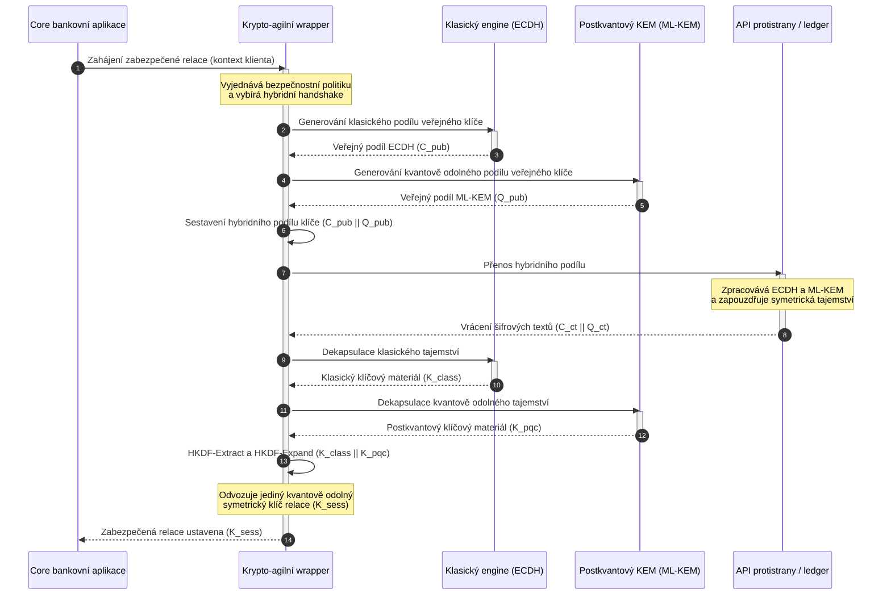

# KyberLib a postkvantová migrace bank 2026: od standardů ke kódu

<!-- lead-start: manual -->
<aside class="post-lead" aria-label="Shrnutí článku">

<strong>Stručně.</strong> Bankovní infrastruktura čelí v roce 2026 systémové hrozbě se známým koncem: výpočty kvantového rozsahu prolomí výměnu klíčů RSA a ECC, která dnes chrání provoz při přenosu. Federální standardy a dohledové politické dokumenty zvýšily povědomí; technické provedení zůstává roztříštěné. <a href="https://github.com/sebastienrousseau/kyberlib">KyberLib</a> je open source inženýrský blueprint, který posouvá postkvantový příběh do konkrétního, paměťově bezpečného kódu v Rustu — implementuje ML-KEM standardizovaný NIST (FIPS 203) za krypto-agilními abstrakčními hranicemi, takže instituce mohou modernizovat transportní bezpečnost a zapouzdření klíčů dříve, než útoky typu „Store Now, Decrypt Later" dosáhnou jejich archivů.

<strong>Klíčové body</strong>

<ul class="post-lead-takeaways">
  <li><strong>Od politiky ke zkontrolovatelnému kódu.</strong> KyberLib posouvá postkvantovou kryptografii z abstraktních strategických plánů do konkrétních, vysoce výkonných a auditovatelných implementací v Rustu.</li>
  <li><strong>Standardizované provedení FIPS 203 ML-KEM.</strong> Knihovna implementuje ML-KEM — algoritmus pro ustavení klíčů finalizovaný v NIST FIPS 203 — a udržuje konformitu v souladu s globálními regulatorními očekáváními.</li>
  <li><strong>Krypto-agilita už v návrhu.</strong> Stabilní abstrakční hranice umožňují bankovním aplikacím vyměňovat kryptografické primitivy bez nákladných a chybových přepisů aplikací.</li>
  <li><strong>Paměťová bezpečnost díky Rustu.</strong> Pravidla vlastnictví vynucovaná při kompilaci odstraňují přetečení bufferů a úniky paměti, které sužují starší kryptografické knihovny v C, a to při rychlosti abstrakcí s nulovými náklady.</li>
  <li><strong>Zmírnění fiduciární odpovědnosti.</strong> Pozorovatelné, testovatelné důkazy o migraci dávají členům představenstva záznam o „přiměřených krocích", který audity osobní odpovědnosti podle článku 5 DORA vyžadují.</li>
</ul>

<strong>Související čtení:</strong> <a href="/2026-05-18-quantum-cryptography-standards-developments-2026/">Standardy kvantové kryptografie 2026</a> · <a href="/2026-05-28-dora-ai-act-data-sovereignty-banking-compliance-stack-2026/">Compliance stack DORA + AI Act</a> · <a href="/2026-05-20-cloud-native-banking-financial-institutions-2026/">Cloud-native bankovnictví</a>

</aside>
<!-- lead-end -->

Postkvantová migrace přestala být plánovacím cvičením. V roce 2026 je aktivním provozním požadavkem a mezera mezi regulatorním záměrem a inženýrským provedením je místem, kde dnes sedí riziko. [KyberLib ⧉](https://github.com/sebastienrousseau/kyberlib "kyberlib") část této mezery uzavírá: produkčně orientovaná, paměťově bezpečná knihovna v Rustu, která implementuje ML-KEM podle finalizovaných parametrů FIPS 203 a obaluje jej krypto-agilními hranicemi, jaké transakční systémy banky skutečně potřebují.

---

> **Shrnutí pro představenstvo / klíčové body**
>
> - **Hrozba je už provozní.** Protivníci dnes provádějí sklizeň typu „Store Now, Decrypt Later"; důvěrnost dat selže zpětně v den, kdy dorazí kryptograficky relevantní kvantový počítač.
> - **Standardy jsou finalizované.** NIST FIPS 203 (ML-KEM) a FIPS 204 (ML-DSA) dávají výborům pro audit jasné, testovatelné měřítko — obhajoba „čekáme na standardy" už neobstojí.
> - **KyberLib je inženýrský blueprint.** Paměťově bezpečný Rust, kompilace `no_std` pro HSM a čipové karty a vzory hybridního handshaku, které zachovávají klasickou interoperabilitu.
> - **Krypto-agilita je trvalý cíl.** Stabilní abstrakční hranice umožňují měnit primitivy bez přepisů aplikací — lekce, která přežije každý jednotlivý algoritmus.
> - **Odpovědnost nesou představenstva.** Článek 5 DORA ukládá členům představenstva osobní odpovědnost; zkontrolovatelný, pozorovatelný migrační kód je důkaz, který ji naplňuje.
>
---

## Proč na tomto open source projektu v roce 2026 záleží

Jak se asymetrická kryptografie blíží zastarání, hrozba nečeká na sestrojení kryptograficky relevantního kvantového počítače. Protivníci provádějí útoky **„Store Now, Decrypt Later" (SNDL)** už nyní — sklízejí šifrované přenosové toky korporátních bankovních transakcí, obchodních tajemství a institucionální komunikace se záměrem dešifrovat je, jakmile kvantové schopnosti dozrají. Pro banku je každý dnešní klasický handshake na lince porušením důvěrnosti s odloženým datem detonace.

Regulátoři odpověděli konkrétními povinnostmi:

1. **Článek 6 DORA (řízení rizik ICT)** vyžaduje, aby instituce zmapovaly, identifikovaly a zmírnily zranitelnosti napříč svým kryptografickým majetkem — včetně asymetrické výměny klíčů ukryté v middlewaru, který nikdo neinventarizoval.
2. **NIST FIPS 203 a 204** ustavují oficiální postkvantové standardy pro zapouzdření klíčů (ML-KEM) a digitální podpisy (ML-DSA) a dávají výborům pro audit standardizované měřítko, podle něhož se měří postup migrace.

Provést tuto migraci bez narušení živého provozu vyžaduje posun od politických dokumentů ke **zkontrolovatelné open source kryptografické infrastruktuře**. [KyberLib ⧉](https://github.com/sebastienrousseau/kyberlib "kyberlib") dodává přesně to: paměťově bezpečnou knihovnu v Rustu konformní s FIPS 203, která mění postkvantový přechod v měřitelný, ověřitelný inženýrský pipeline — a posouvá debatu o technologických investicích směrem k hmatatelné návratnosti odolnosti.

## Architektonická optika

KyberLib sedí za stabilními hranicemi API a izoluje klíčové transakční aplikace banky od změn v nízkoúrovňových kryptografických primitivech.

| Vrstva | Designové rozhodnutí | Proč na tom záleží | Riziko při špatném řízení |
|---|---|---|---|
| **Primitivum** | Zapouzdření klíčů FIPS 203 ML-KEM | Nahrazuje klasickou výměnu klíčů Diffie-Hellman a RSA strukturami založenými na mřížkách | Nekonformita s finalizovanými parametry FIPS 203 vedoucí k neúspěšným auditům compliance |
| **Jazyk** | Paměťově bezpečná implementace v Rustu | Eliminuje zranitelnosti z poškození paměti (přetečení bufferů, use-after-free) endemické pro C/C++ | Bujení závislostí ohrožující integritu build řetězce |
| **Abstrakce** | Stabilní krypto-agilní hranice | Aplikace přepínají algoritmy za jednotným rozhraním podle vývoje standardů | Napevno zakódované primitivy vynucující ruční přepisy při každé budoucí migraci |
| **Nasazení** | Hybridní šifrovací handshaky | Kombinuje postkvantové KEM s klasickými algoritmy ve dvojitě zabalené obálce | Ztráta interoperability se staršími systémy nebo tichý drift konfigurace |
| **Záruky** | Provenience SLSA Level 3 a zkontrolovatelné testy | Garantuje původ a provenienci kódu; příklady lze auditovat řádek po řádku | Bezpečnostní divadlo — black-box knihovny, jejichž implementační chyby se projeví až v produkci |

## Provozní signály, které sledovat

Prokazování postkvantové compliance dozorčím orgánům a regulátorům znamená sledovat konkrétní, kvantifikovatelné metriky:

| Signál | Metrika | Regulatorní reference | Implementace na platformě |
|---|---|---|---|
| **Konformita FIPS 203 ML-KEM** | 100% soulad s finalizovanými parametry (ML-KEM-512/768/1024) | NIST FIPS 203 | Parametricky ověřená mřížková kryptografie kompilovaná uvnitř modulů KyberLib |
| **Kryptografická inventarizace** | Úplná inventura použití asymetrické výměny klíčů napříč všemi systémy | NIST SP 1800-38 | Automatizovaní skenovací agenti zapisující aktivní šifrovací sady do centrálního registru |
| **Hybridní výměna klíčů** | Procento handshaků transportní vrstvy probíhajících v hybridní obálce | Článek 6 DORA | Síťové proxy obalující klasické handshaky TLS 1.3 do PQC zapouzdření |
| **Kompilace `no_std`** | Schopnost kompilovat bez standardní knihovny Rustu pro omezené cíle | Článek 30 DORA | Podmíněná kompilace `no_std` v KyberLib pro hardwarové bezpečnostní moduly (HSM) |
| **Index krypto-agility** | Čas v minutách na výměnu kryptografického primitiva napříč API gateway | UK PRA SS1/23 | Abstrahované směrovací registry řídící alokaci algoritmů přes runtime proměnné |

## Proč na Rustu v postkvantové kryptografii záleží

Implementace postkvantových algoritmů, jako je ML-KEM, vyžaduje složité nízkoúrovňové matematické operace nad polynomiálními okruhy. Historicky znamenalo provozování těchto operací produkční rychlostí ručně psané C/C++ nebo assembler — velkou útočnou plochu pro poškození paměti, a to přesně v kódu, kde si banka chybu může dovolit nejméně.

Rust mění bezpečnostní pozici kryptografického inženýrství třemi konkrétními způsoby:

1. **Paměťová bezpečnost v době kompilace.** Model vlastnictví Rustu garantuje, že přetečení bufferů, dvojitá uvolnění a chyby use-after-free jsou zachyceny už při kompilaci. To je akutně důležité u postkvantových knihoven, kde jsou velikosti klíčů a šifrových textů výrazně větší než u jejich klasických protějšků.
2. **Deterministické abstrakce s nulovými náklady.** Rust se kompiluje do nativního strojového kódu bez garbage collectoru, takže rychlost provádění a paměťová stopa odpovídají knihovnám v C nebo je překonávají, při zachování bezpečnosti.
3. **Kompatibilita s `no_std`.** KyberLib se kompiluje bez standardní knihovny Rustu, takže běží v omezených, bare-metal prostředích — včetně hardwarových bezpečnostních modulů (HSM) a čipových karet — a udržuje kryptografii bankovní úrovně uvnitř fyzických bezpečnostních hranic.

## Návrh krypto-agilní architektury

Klasickým režimem selhání kryptografických migrací je napevno zakódovaný kód: předpoklady specifické pro algoritmus vepsané přímo do aplikační logiky, bolestivě znovuobjevované při každém přechodu. Trvalým cílem pro rok 2026 je **krypto-agilita** — abstrakční vrstva, která zachází s algoritmy jako s vyměnitelnými moduly za stabilním rozhraním, takže příští migrace je změnou konfigurace, nikoli přepisem celého systémového majetku.

Sekvence níže ukazuje, jak krypto-agilní wrapper KyberLib koordinuje hybridní (klasický plus postkvantový) handshake výměny klíčů:

Hybridní obálka je provozně rozhodující detail. Dokud postkvantové primitivy nenasbírají roky produkčního prověřování, odvozuje se klíč relace z klasického i postkvantového tajemství: útočník musí prolomit ECDH **a** ML-KEM, aby kanál získal. Protistrany, které nemigrovaly, fungují dál; protistrany, které migrovaly, získávají mřížkovou ochranu okamžitě.

## Příručka pro představenstvo

Postkvantová bezpečnost není šifrovací starost back office; je to otázka governance na úrovni představenstva s osobními sázkami. Vrcholoví manažeři by měli migraci rámovat skrze fiduciární odpovědnost:

- **Článek 5 DORA (governance a organizace)** ukládá osobní odpovědnost za bezpečnost ICT představenstvu. Open source, pozorovatelné testy jsou přímým důkazem, který audit osobní odpovědnosti požaduje — „vybrali jsme zkontrolovatelnou implementaci FIPS 203 a zde jsou její konformitní běhy" je obhajitelná odpověď; „náš dodavatel nás ujistil" nikoli.
- **Řízení modelového rizika (US Fed SR 11-7 / UK PRA SS1/23)** se vztahuje na architektury kryptografických wrapperů stejně jako na oceňovací modely. Abstrakční vrstvy by měly projít validací MRM, včetně výkonu za scénářů extrémního narušení.
- **Kapitál na operační riziko podle Basel III** odměňuje prokázanou zralost kontrol. Otestované hybridní handshaky snižují dlouhodobý profil operačního rizika instituce, krátí kapitálovou přirážku a uvolňují bilanční kapacitu pro aktivní nasazení treasury.

## Co to znamená podle typu banky

### Globální systémově významné banky (G-SIB)

G-SIB provozují transakční systémy zatížené legacy technologiemi, takže jejich limitujícím omezením je discovery: vědět, kde k asymetrické výměně klíčů skutečně dochází. Na prvním místě stojí průběžné kryptografické inventury podle vodítek NIST SP 1800-38; KyberLib pak poskytuje standardizovanou, paměťově bezpečnou knihovnu pro provádění postkvantového zapouzdření klíčů na každém moderním uzlu, který inventura odhalí.

### Transakční a korporátní banky

Důvěrnost napříč platebními kolejemi je podstatou franšízy. Protože se KyberLib kompiluje pro bare-metal cíle `no_std`, mohou transakční banky nasadit postkvantové handshaky přímo do hardwaru pro směrování plateb a řízení likvidity na edge — nejen do aplikační vrstvy.

### Regionální a menší banky

Regionální instituce čelí stejné státem sponzorované sklizni dat bez výzkumných rozpočtů G-SIB. Zkontrolovatelná open source implementace v Rustu jim dává okamžitou hotovou cestu ke konformitě s NIST FIPS 203, bez vyjednávání o black-box plánech dodavatelů.

## Od plánů ke kompilujícímu kódu

Postkvantový přechod je aktivní inženýrský úkol a institucemi, které si v průběhu roku 2026 udrží důvěru dohledových orgánů, protistran a korporátních treasurerů, budou ty, jež se posunou od abstraktních plánů k pozorovatelnému, kompilujícímu kódu. Exekutivní mandát z toho plyne přímo: auditovat zastaralé body výměny klíčů, nasadit hybridní handshaky na kanálech s nejvyšší hodnotou a vybudovat stabilní abstrakční hranice, díky nimž bude každá budoucí výměna primitiva rutinou. KyberLib činí z každého z těchto kroků měřitelnou provozní schopnost, nikoli závazek na slajdech.

## Často kladené otázky

**Je KyberLib v souladu s finalizovanými NIST standardy?**

Ano. KyberLib je navržen kolem parametrů ML-KEM finalizovaných ve FIPS 203, takže kompilovaná knihovna zůstává v souladu s federálními i globálními regulatorními očekáváními.

**Vyžaduje postkvantová knihovna specializovaný hardware?**

Ne. Implementace KyberLib v Rustu se kompiluje pro standardní systémové architektury. Schopnost `no_std` jí navíc umožňuje běžet na specializovaných hardwarových bezpečnostních modulech (HSM) a čipových kartách, kde je vyžadována fyzická úschova klíčů.

**Jak „Store Now, Decrypt Later" ovlivňuje současnou compliance?**

Pokud transportní vrstva spoléhá na klasické RSA nebo ECC, mohou protivníci provoz sklízet už dnes a dešifrovat jej, jakmile kvantová schopnost dozraje. Hybridní výměna klíčů nasazená nyní udrží zachycená data za mřížkovou ochranou.

**Proč hybridní handshaky místo přímého přechodu na postkvantové primitivy?**

Hybridní obálky odvozují klíč relace z klasického i postkvantového tajemství, takže bezpečnost drží, dokud nejsou prolomena obě. To zachovává interoperabilitu s nemigrovanými protistranami, zatímco nové primitivy sbírají produkční prověření.

## Reference

- National Institute of Standards and Technology, (2024). [FIPS 203: standard mechanismu zapouzdření klíčů na bázi modulových mřížek ⧉](https://www.nist.gov/news-events/news/2024/08/nist-releases-first-3-finalized-post-quantum-encryption-standards "Oznámení NIST FIPS 203").
- Board of Governors of the Federal Reserve System, (2011). [Dohledová vodítka k řízení modelového rizika (SR Letter 11-7) ⧉](https://www.federalreserve.gov/supervisionreg/srletters/sr1107.htm "Federal Reserve SR 11-7").
- Evropský parlament a Rada Evropské unie, (2022). [Nařízení (EU) 2022/2554 o digitální provozní odolnosti finančního sektoru (DORA) ⧉](https://eur-lex.europa.eu/legal-content/EN/TXT/?uri=CELEX%3A32022R2554 "Nařízení DORA").
- NIST National Cybersecurity Center of Excellence, (2025). [Migrace na postkvantovou kryptografii (NIST SP 1800-38) ⧉](https://www.nccoe.nist.gov/projects/migration-post-quantum-cryptography "NIST SP 1800-38").
- GitHub, (2026). [Open source repozitář kyberlib ⧉](https://github.com/sebastienrousseau/kyberlib "Repozitář kyberlib").

<!-- enrich-start -->
<aside class="author-card" aria-label="O autorovi"><strong class="author-card-name"><a href="/about/index.html">Sebastien Rousseau</a></strong>Seniorní bankovní technolog, který se věnuje aplikované AI, platební infrastruktuře, tokenizovaným penězům, ISO 20022, postkvantové bezpečnosti, cloud-native finančním službám a regulovaným digitálním trhům.Více než 20 let zkušeností napříč HSBC Commercial &amp; Investment Bank, PayPal, Barclays, Shazam, AKQA a Virgin Group. <a href="/about/index.html">Úplný profil</a> &middot; <a href="https://www.linkedin.com/in/sebastienrousseau/" rel="external noopener">LinkedIn</a> &middot; <a href="https://github.com/sebastienrousseau" rel="external noopener">GitHub</a></aside>

Naposledy zkontrolováno <time datetime="2026-06-12">2026-06-12</time>.

<!-- enrich-end -->
