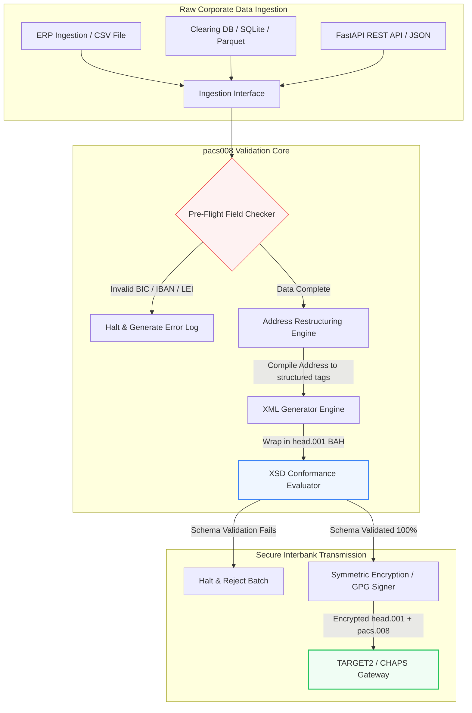

---

# Front Matter (YAML)

author: "contact@sebastienrousseau.com (Sebastien Rousseau)"
banner_alt: "Pracovník v kanceláři s hlasovým asistentem a notebookem — symbol strukturovaných, strojově čitelných mezibankovních platebních zpráv, které automatizace pacs.008 zpřístupňuje programátorsky"
banner_height: "1597"
banner_width: "2584"
banner: "https://cloudcdn.pro/stocks/images/tyler-prahm-lmV3gJSAgbo.webp"
cdn: "https://cloudcdn.pro"
charset: "UTF-8"
cname: "sebastienrousseau.com"
copyright: "© Copyright 2025 - 2026 - Sebastien Rousseau. All rights reserved."
date: "June 15, 2026"
description: "Pacs008 je open source Python knihovna, která automatizuje generování a validaci ISO 20022 pacs.008 FI-to-FI klientských úvěrových převodů — strukturované adresy, BAH head.001 obálka, kontrolní součty BIC/LEI/IBAN, OpenTelemetry sledování UETR — připravená na SWIFT cutover v listopadu 2026."
format-detection: "telephone=no"
hreflang: "cs"
icon: "https://cloudcdn.pro/clients/sebastienrousseau/v1/logos/sebastienrousseau.svg"
id: "https://sebastienrousseau.com/2026-06-15-pacs008-automation-iso-20022-interbank-payments-2026"
image_alt: "Černobílý portrét Sebastiena Rousseaua"
image_height: "162"
image_width: "162"
image: "https://cloudcdn.pro/stocks/images/sebastienrousseau.webp"
keywords: "pacs008, ISO 20022 pacs.008, FI-to-FI klientský úvěrový převod, strukturovaná adresa, SWIFT CBPR+, BAH head.001, TARGET2, CHAPS, Fedwire, DORA, BCBS 239, Basel III, UETR, validace LEI, SEPA VoP"
language: "cs-CZ"
last_reviewed: "2026-06-15"
layout: "report"
locale: "cs_CZ"
logo_alt: "Logo Sebastiena Rousseaua"
logo_height: "44"
logo_width: "44"
logo: "https://cloudcdn.pro/clients/sebastienrousseau/v1/logos/sebastienrousseau.svg"
menu: ""
measurementID: "G-169G4ET5HQ"
name: "Sebastien Rousseau"
permalink: "https://sebastienrousseau.com/2026-06-15-pacs008-automation-iso-20022-interbank-payments-2026"
rating: "general"
referrer: "no-referrer"
robots: "index, follow"
schema: "FAQPage, Article"
seo_title: "Automatizace pacs.008 pro éru ISO 20022"
short_name: "sebastienrousseau"
subtitle: "Zpráva pacs.008 je místem, kde se potkávají data mezibankovních plateb, strukturované adresy, compliance, směrování a operace zúčtování."
tags: "pacs008, ISO 20022, mezibankovní platby, velkoobchodní platby, Python"
theme-color: "0, 83, 191"
title: "Budujeme automatizaci pacs.008 pro mezibankovní éru ISO 20022 v roce 2026"
url: "https://sebastienrousseau.com/2026-06-15-pacs008-automation-iso-20022-interbank-payments-2026"
viewport: "width=device-width, initial-scale=1, shrink-to-fit=no"

# RSS - The RSS feed front matter (YAML).
atom_link: "https://sebastienrousseau.com/2026-06-15-pacs008-automation-iso-20022-interbank-payments-2026/rss.xml"
category: "Finance"
docs: https://validator.w3.org/feed/docs/rss2.html
generator: "Static Site Generator (SSG) (version 0.0.26)"
item_description: "Pacs008 nabízí open source Python základ pro automatizaci ISO 20022 FI-to-FI klientských úvěrových převodů v éře mezibankovních plateb."
item_guid: "https://sebastienrousseau.com/2026-06-15-pacs008-automation-iso-20022-interbank-payments-2026/rss.xml"
item_link: "https://sebastienrousseau.com/2026-06-15-pacs008-automation-iso-20022-interbank-payments-2026/rss.xml"
item_pub_date: "Mon, 15 Jun 2026 06:06:06 +0000"
item_title: "Budujeme automatizaci pacs.008 pro mezibankovní éru ISO 20022 v roce 2026"
last_build_date: "Mon, 15 Jun 2026 06:06:06 +0000"
managing_editor: "contact@sebastienrousseau.com (Sebastien Rousseau)"
pub_date: "Mon, 15 Jun 2026 06:06:06 +0000"
ttl: "60"
type: "article"
webmaster: "contact@sebastienrousseau.com"

# Apple - The Apple front matter (YAML).
apple_mobile_web_app_orientations: "portrait"
apple_touch_icon_sizes: "192x192"
apple-mobile-web-app-capable: "yes"
apple-mobile-web-app-status-bar-inset: "black"
apple-mobile-web-app-status-bar-style: "black-translucent"
apple-mobile-web-app-title: "Automatizace pacs.008 pro éru ISO 20022"
apple-touch-fullscreen: "yes"

# MS Application - The MS Application front matter (YAML).

msapplication-navbutton-color: "0, 83, 191"

# Twitter Card - The Twitter Card front matter (YAML).

twitter_card: "summary_large_image"
twitter_creator: "@wwdseb"
twitter_description: "Pacs008 nabízí open source Python základ pro automatizaci ISO 20022 FI-to-FI klientských úvěrových převodů v éře mezibankovních plateb."
twitter_image: "https://cloudcdn.pro/clients/sebastienrousseau/v1/logos/sebastienrousseau.svg"
twitter_image_alt: "Logo Sebastiena Rousseaua"
twitter_site: "@wwdseb"
twitter_title: "Automatizace pacs.008 pro éru ISO 20022"
twitter_url: "https://sebastienrousseau.com/2026-06-15-pacs008-automation-iso-20022-interbank-payments-2026"

excerpt: "pacs008 je open source Python toolkit, který zpřístupňuje ISO 20022 FI-to-FI klientské úvěrové převody programátorsky — strukturované adresy, validace, směrování, compliance háčky a termín SWIFT z listopadu 2026 zabudované jako výchozí nastavení."

# Humans.txt - The Humans.txt front matter (YAML).
author_website: "https://sebastienrousseau.com"
author_twitter: "@wwdseb"
author_location: "London, UK"
thanks: "Děkujeme za přečtení!"
site_last_updated: "2026-06-15"
site_standards: "HTML5, CSS3, RSS, Atom, JSON, XML, YAML, Markdown, TOML"
site_components: "Kaishi, Kaishi Builder, Kaishi CLI, Kaishi Templates, Kaishi Themes"
site_software: "Static Site Generator, Rust"

---

# Automatizace ISO 20022 pacs.008 mezibankovních plateb v open source Pythonu v roce 2026

<!-- lead-start -->
<aside class="post-lead" aria-label="Shrnutí článku">

<strong>Stručně.</strong> Podle pokynů SWIFT CBPR+ vyřadí 14. listopadu 2026 nestrukturovaných poštovních adres (Structured Address Cliff) napříč TARGET2, CHAPS, Fedwire, Lynx a SEPA. Pacs008 je open source Python knihovna, která automatizuje generování a validaci ISO 20022 FI-to-FI klientského úvěrového převodu (pacs.008), obaluje platby do Business Application Headers (BAH head.001) a zapéká compliance se strukturovanou adresou do datové cesty dřív, než se zpráva dotkne zúčtovací sítě.

<strong>Klíčové body</strong>

<ul class="post-lead-takeaways">
  <li><strong>Termín pro strukturované adresy je absolutní.</strong> Po 14. listopadu 2026 končí nestrukturované adresní bloky. Pacs008 vynucuje strukturované prvky poštovní adresy (<code>&lt;TwnNm&gt;</code>, <code>&lt;Ctry&gt;</code>, <code>&lt;PstCd&gt;</code>) při kompilaci dat, aby zabránil zamítnutí na hranici sítě.</li>
  <li><strong>Sjednocená orchestrace zpráv.</strong> Obaluje hlavní platební payload pacs.008 do compliance obálky Business Application Header (head.001), čímž poskytuje standardní model zpracování round-trip.</li>
  <li><strong>Algoritmická integrita.</strong> Vestavěné validátory pro BIC a Legal Entity Identifiers (LEI) využívající kontrolní součty podle ISO 7064 Modulo 97-10.</li>
  <li><strong>Sledovatelnost na úrovni DORA.</strong> Plná instrumentace OpenTelemetry s klíčem na Unique End-to-End Transaction Reference (UETR) pro auditní logy v reálném čase a kryptografické auditní podpisy.</li>
  <li><strong>Zachování fiduciární odpovědnosti na úrovni představenstva.</strong> Sladí přesnost mezibankovních zpráv s DORA článkem 5, vykazováním BCBS 239 a úsporami kapitálu pro operační riziko podle Basel III.</li>
</ul>

<strong>Související četba:</strong> <a href="https://sebastienrousseau.com/2026-05-19-global-wholesale-payments-economics-2026">Globální velkoobchodní platby v roce 2026: ISO 20022, obnova RTGS a ekonomika interoperability</a>, <a href="https://sebastienrousseau.com/2026-05-27-ai-operating-system-payments-fraud-routing-resilience-compliance-2026">AI jako operační systém plateb: podvody, směrování, odolnost a compliance v roce 2026</a>, <a href="https://sebastienrousseau.com/2026-05-12-iso-20022-pacs008-structured-address-deadline">Termín pacs.008 pro strukturované adresy v listopadu 2026: šestiměsíční pohled</a>.

</aside>
<!-- lead-end -->

Přemostění mezery mezi legacy finančními daty a strukturovaným mezibankovním zasíláním zpráv prostřednictvím auditovatelné Python pipeline validované proti schématu.

Open source referenčním bodem tohoto článku je [pacs008 ⧉](https://github.com/sebastienrousseau/pacs008 "pacs008 — open source Python knihovna"). Repozitář je pozicován jako Python knihovna pro automatizaci ISO 20022 pacs.008 FI-to-FI XML zpráv klientského úvěrového převodu.

## Proč na tomto open source projektu v roce 2026 záleží

Globální mezibankovní zúčtovací infrastruktura prochází nejhlubší modernizací za téměř půl století.

V červnu 2026 se sektor finančních služeb rychle blíží **SWIFT Structured Address Cliff 14. listopadu 2026**. Od tohoto data pokyny SWIFT CBPR+ spolu s TARGET2, CHAPS, Fedwire a kanadským Lynx oficiálně vyřadí nestrukturované řádky poštovních adres (používající pouze `<AdrLine>` v rámci bloků `<PstlAdr>`). Všechny zúčastněné finanční instituce musí přenášet adresy buď v hybridním formátu (strukturované `<TwnNm>` a `<Ctry>` s maximálně dvěma prvky `<AdrLine>` pro zbývající detaily), nebo plně strukturovaném formátu (jednotlivé prvky pro název ulice, číslo budovy a poštovní směrovací číslo). Jakákoli zpráva, která toto kritérium nesplní, bude zamítnuta na hranici sítě.

Pro finanční instituce tento přechod vytváří zásadní provozní omezení:

1. **Penalizace zamítnutím na hranici.** Platby, které nesplní kritéria strukturované adresy, čeká okamžité zamítnutí sítí, vyvolávající transakční zpoždění, blokování likvidity a provozní nedodělky.
2. **SEPA Verification of Payee (VoP).** Ukládá všem poskytovatelům platebních služeb (PSP) uvnitř zóny SEPA povinnost ověřit shodu mezi jménem příjemce a IBAN před provedením úvěrového převodu, čímž přidává další validační bránu k iniciaci zprávy.

[Pacs008](https://github.com/sebastienrousseau/pacs008) tento problém řeší. Je to open source, odlehčená Python knihovna, která automatizuje konverzi surových finančních dat do plně validovaných ISO 20022 pacs.008 mezibankovních klientských úvěrových převodů odpovídajících schématu. Překlenutím mezery mezi legacy a strukturovanými daty dodává pacs008 vysoký Return on Resilience (RoR), chrání pracovní kapitál a zajišťuje provedení v reálném čase napříč globálními platebními kolejnicemi.

## Proč jsem pacs008 postavil právě takto

Napsal jsem `pacs008` i jeho předřazenou sestru `pain001` a svůj pracovní život
věnuji velkoobchodním platbám a produktovému řízení API. Právě tato kombinace
vysvětluje podobu knihovny, a proto stojí za to vyslovit rozhodnutí výslovně,
místo abych je nechal skryté v kódu.

**Validace běží před generováním, ne po něm.** Instinkt většiny platebních
prostředí je vygenerovat zprávu a teprve pak ji zkontrolovat, protože tak je
tvarován kontrolní proces: vznikne soubor, někdo jej prohlédne, výjimky putují do
fronty. Toto pořadí zaručuje, že se vady najdou v místě nejmenší páky — až když
je práce na sestavení zprávy hotová, a často až když zpráva opustila instituci.
Validovat nejdřív znamená, že nevyhovující adresa nebo chybný IBAN je selháním
buildu, nikoli odmítnutím v síti.

**Licence je MIT, protože banky musí validační logiku číst, ne jí věřit.**
Uzavřený validátor žádá instituci, aby na slovo přijala cizí výklad prováděcích
pokynů. To není rozumné chtít po týmu, který nese regulatorní povinnost. Každé
pravidlo v této knihovně lze prohlédnout, zpochybnit a forknout.

**Validuje se proti oficiálním XSD schématům, ne proti vlastní
reimplementaci.** Ručně psaná aproximace pravidel ISO 20022 se odchýlí od
skutečné smlouvy sítě, jakmile se kterákoli strana změní. Schémata jsou ta
smlouva; cokoli jiného je druhý zdroj pravdy čekající, až si budou odporovat.

**Míří na CI, ne na krok revize.** Validátor, na jehož spuštění si musí někdo
vzpomenout, je validátor, který se pod tlakem termínů přestane spouštět — tedy
přesně tehdy, kdy je nejdůležitější.

Co knihovna záměrně nedělá, je stejně záměrné. Je to nástroj vrstvy zpráv.
Nenahrazuje platební engine, systém sankčního screeningu ani očistu kmenových dat
klientů, kterou instituce musí provést u zdroje. Činí tuto očistu vymahatelnou;
nedělá ji za vás.

## Architektonická optika pacs008 2026

Knihovna pacs008 je strukturována jako izolovaný validační a generační engine, který zajišťuje, že surové vstupy jsou systematicky parsovány, obohaceny a obaleny do standardních obálek:

| Vrstva | Designové rozhodnutí | Proč na tom záleží | Riziko při špatném zacházení |
|---|---|---|---|
| **Vstupní vrstva** | Příjem CSV, JSON, SQLite a Parquet | Setkává bankovní integrační týmy tam, kde jejich data již žijí, a předchází migracím platforem. | Příjem surových, nevalidovaných nebo poškozených datových payloadů. |
| **Validační vrstva** | Pre-flight validace proti oficiálním XSD schématům a vlastním obchodním pravidlům | Zastaví vykonávání a označí chyby dřív, než je platební soubor odeslán do zúčtovací sítě. | Neplatné XML soubory vyvolávající okamžitá zamítnutí sítí a zpoždění zúčtování. |
| **Vrstva BAH obálky** | Automatické obalení Business Application Header (head.001) | Standardizuje odesílání a směrování zpráv na základě tagu `<MsgDefIdr>`. | Přenos surových pacs.008 payloadů bez požadované vnější obálky, způsobující zamítnutí systémem. |
| **Serializační vrstva** | Standardní XML a podpora JSON odpovídajícího ISO (TS 23029) | Umožňuje přímý překlad mezi XML a JSON payloady, podporuje moderní REST API a streamování přes Kafka. | Fragmentované reprezentace dat porušující oficiální ISO pokyny. |
| **Vrstva observability** | OpenTelemetry trasování s klíčem na UETR | Zachycuje detailní vykonávací cesty a logy, poskytuje auditovatelnost v reálném čase. | Mezery v trasování blokující provozní viditelnost a audit. |

## Klíčové mezibankovní signály a regulatorní milníky

Aby prokázali transakční provozní odolnost, musí senior technologičtí a riziko manažeři sledovat specifické, kvantifikovatelné indikátory compliance:

| Signál | Metrika / Provozní benchmark | Reference G20 / SWIFT / DORA | Implementace na technické platformě |
|---|---|---|---|
| **Compliance strukturované adresy** | % zpráv pacs.008 využívajících plně strukturovaná pole `<PstlAdr>` s určenými `<TwnNm>` a `<Ctry>`. | SWIFT SR 2026 termín | Pre-flight schémové kontroly v pacs008 zamítající nestrukturované adresní řádky. |
| **SEPA Verification of Payee** | Validace shody mezi jménem příjemce a IBAN před vykonáním zprávy. | SEPA VoP nařízení | Vestavěné VoP helper třídy vykonávající pre-validační dotazy na IBAN/BIC. |
| **Integrace BAH head.001** | Procento odchozích platebních payloadů úspěšně obalených do Business Application Headers. | Pokyny TARGET2 / CBPR+ | Subsystém BAH wrappingu kompilující vnější XML obálku automaticky. |
| **LEI Modulo kontrolní součet** | Validace kontrolní číslice ISO 7064 Modulo 97-10 na blocích `<LEI>` dlužníka a věřitele. | Mandát Bank of England | Algoritmický kontrolor ověřující integritu 20znakového identifikátoru. |
| **Přesnost sledování UETR** | 100 % generovaných plateb obsahuje platný Unique End-to-End Transaction Reference. | SWIFT UETR specifikace | Automatizovaná generace a trasování 36znakového UUIDv4 referenčního kódu. |

## Proč je Python ideální nájezdovou rampou pro mezibankovní automatizaci

Moderní platební huby a týmy treasury operací v roce 2026 silně spoléhají na Python pro datovou transformaci, finanční modelování a integraci ERP databází.

Využitím open source Python knihovny získávají instituce zásadní výhody:

1. **Nízká kognitivní zátěž a vysoká interoperabilita.** Python funguje jako soudržný most. Umožňuje vývojářům psát jednoduché skripty, které stáhnou surové platební instrukce z legacy databází, validují je proti komplexním mezinárodním bankovním pravidlům a vyprodukují XML odpovídající compliance v rámci jediného sjednoceného workflow.
2. **Eliminace „black-box" neprůhledných překladačů.** Proprietární bankovní portály často účtují vysoké licenční poplatky za vlastní překladače platebních souborů. Tyto překladače jsou proprietární černé skříňky, kvůli nimž je pro bezpečnostní týmy nemožné auditovat, jak jsou data zpracována nebo kde jsou uloženy klíče. Open source, prozkoumatelná knihovna jako pacs008 zajišťuje úplnou transparentnost kódu.
3. **Bezešvá integrace CI/CD.** Pacs008 se integruje přímo do pipeline pro kontinuální integraci a nasazení, což vývojářům umožňuje automatizovat testování platebních souborů jako součást standardního cyklu doručování software.

## Návrh ohraničené mezibankovní pipeline

Hlavní zranitelností mezibankovního zúčtování je „neřízené dávkové generování" — generování souborů bez jasné, ohraničené verifikační smyčky. Pacs008 je navržen tak, aby fungoval jako jádrový validační engine uvnitř striktně řízené, vícestupňové transakční pipeline.

Provozní tok níže ukazuje, jak surová transakční data procházejí pipeline pacs008 a generují kryptograficky zabezpečený pacs.008 soubor odpovídající schématu obalený v BAH obálce:

## Playbook pro představenstvo a fiduciární odpovědnost

Automatizace mezibankovních plateb je otázkou řízení rizik a corporate governance na úrovni představenstva. Senior manažeři musí přistupovat ke kvalitě transakčních dat optikou fiduciární odpovědnosti a snižování operačního rizika:

- **DORA článek 5 (odpovědnost představenstva).** Přenáší přímou, osobní odpovědnost na členy představenstva za odolnost a bezpečnost ICT operací instituce. Protože mezibankovní zúčtování je kritickou korporátní funkcí, představenstva musí prokázat, že implementovala robustní, validované a automatizované transakční kontroly k prevenci provozních narušení nebo opožděných plateb.
- **BCBS 239 (agregace a vykazování rizikových dat).** Požaduje, aby vykazování finančních transakcí bylo přesné, úplné a generované v reálném čase. Pacs008 pomáhá institucím dosáhnout souladu s BCBS 239 tím, že zajistí čisté strukturování a validaci platebních dat u zdroje, čímž eliminuje datové mezery a chyby manuálního odsouhlasení, které trápí legacy tabulky.
- **Snížení kapitálových nároků na operační riziko (Basel III).** Podle pokynů Basel III vysoké chybovosti plateb a režie manuálních zásahů zvyšují kapitálové požadavky banky na operační riziko a vážou kapitál, který by jinak mohl být nasazen pro úvěrování nebo investice. Automatizace platební pipeline tyto kapitálové prémie přímo minimalizuje a chrání hodnotu rozvahy.

## Co to znamená podle typu banky

### Globální systémově významné banky (G-SIBs)

G-SIBs spravují masivní přeshraniční objemy korporátních transakcí. Jejich hlavní výzvou je remediace nestrukturovaných legacy dat dřív, než se dostanou do zúčtovací sítě. Integrací pacs008 do svých korporátních bankovních gateway mohou G-SIBs poskytovat automatizované validační nástroje svým korporátním klientům, snížit režii manuálních platebních oprav a zajistit provedení v reálném čase napříč sítí SWIFT.

### Transakční a korporátní banky

Pro transakční banky je kvalita platebních dat konkurenční diferenciátor. Nabídkou open source, prozkoumatelného validačního nástroje jako pacs008 klientům korporátního treasury mohou tyto banky urychlit onboarding, minimalizovat zamítnutí platebních souborů a budovat důvěru zákazníků skrze nadprůměrné míry straight-through processing.

### Regionální a menší banky

Regionální banky musí udržovat compliance s mezinárodními platebními standardy bez masivních technologických rozpočtů G-SIBs. Pacs008 poskytuje odlehčené, nákladově efektivní a plně compliance řešení založené na Pythonu, které menším institucím umožňuje nabídnout moderní, strukturované iniciační schopnosti plateb bez drahých licencí proprietárního middlewaru.

## Závěr: Roadmapa mezibankovního zúčtování

Nadcházející termín SWIFT pro strukturované adresy v listopadu 2026 představuje tvrdou hranici pro operace korporátního treasury. Spoléhání na legacy tabulky, manuální zadávání dat a nestrukturované platební soubory je aktivní obchodní riziko.

Aby zajistili kontinuitu transakcí a minimalizovali provozní režii, senior technologičtí a finanční manažeři by měli dnes vykonat jasnou zúčtovací roadmapu:

1. **Vynucujte validaci u zdroje.** Mandujte, aby všechny platební instrukce byly validovány a formátovány podle oficiálních ISO 20022 XSD schémat dřív, než opustí hranice korporátního ERP.
2. **Auditujte datovou pipeline.** Odejděte od manuálního zpracování tabulek a implementujte automatizované, prozkoumatelné workflow založené na Pythonu pomocí pacs008.
3. **Implementujte hybridní bezpečnost.** Zajistěte, aby vygenerované platební soubory byly kryptograficky podepsány a zašifrovány před přenosem, čímž splníte očekávání zero-trust sítě.
4. **Sladění s fiduciárními prioritami.** Formálně reportujte metriky automatizace plateb a kvality dat představenstvu, rámcujte investici jako kritický program snižování operačního rizika podle DORA.

## Často kladené otázky

**Je pacs008 compliance s nadcházejícími pravidly SWIFT SR 2026 pro adresy?**

Ano. Pacs008 je navržen tak, aby podporoval striktní milník strukturovaných adres SWIFT z listopadu 2026, vynucující povinné oddělení prvků poštovní adresy (město, země, PSČ) do určených ISO 20022 XML polí.

**Umí pacs008 obalit platební payloady do Business Application Headers?**

Ano. Protože pacs008 nativně podporuje obalení Business Application Header (BAH head.001), automaticky kompiluje vnější obálku požadovanou sítěmi TARGET2, CHAPS a CBPR+.

**Proč je open source knihovna preferována před proprietárními překladači souborů?**

Proprietární překladače jsou neprůhledné černé skříňky, což znemožňuje bezpečnostní audity. Open source, peer-reviewed knihovna jako pacs008 nabízí úplnou transparentnost kódu, což bezpečnostním týmům umožňuje ověřit, že žádná citlivá platební data nejsou během zpracování vystavena.

**Jaké identifikátory pacs008 validuje?**

Pacs008 přichází s vestavěnými validátory pro Bank Identifier Codes (BIC) a Legal Entity Identifiers (LEI) využívajícími kontrolní součty ISO 7064 Modulo 97-10, plus validaci kontrolní číslice IBAN a kontroly unikátnosti UETR.

## Reference

- SWIFT, (2024). *ISO 20022 November 2026 Structured Address Milestone*. La Hulpe: SWIFT. Dostupné na: [SWIFT ISO 20022 Milestone ⧉](https://www.swift.com/standards/iso-20022/iso-20022-bytes/call-action-november-2026 "Milník SWIFT ISO 20022").
- Basel Committee on Banking Supervision (BCBS), (2013). *Principles for effective risk data aggregation and risk reporting (BCBS 239)*. Basel: Bank for International Settlements. Dostupné na: [BCBS 239 Principles ⧉](https://www.bis.org/publ/bcbs239.htm "Principy BCBS 239").
- European Parliament and Council of the European Union, (2022). *Regulation (EU) 2022/2554 on digital operational resilience for the financial sector (DORA)*. Brussels: Official Journal of the European Union. Dostupné na: [DORA Regulation ⧉](https://eur-lex.europa.eu/legal-content/EN/TXT/?uri=CELEX%3A32022R2554 "Nařízení DORA").
- GitHub, (2026). *pacs008 open-source repository*. Dostupné na: [pacs008 Repository ⧉](https://github.com/sebastienrousseau/pacs008 "Repozitář pacs008").

<!-- enrich-start -->
<aside class="author-card" aria-label="O autorovi"><strong class="author-card-name"><a href="/about/index.html">Sebastien Rousseau</a></strong>Seniorní bankovní technolog píšící o aplikované AI, migraci ISO 20022, postkvantové kryptografii pro finanční služby a strukturální transformaci velkoobchodních plateb.Více než 20 let zkušeností napříč HSBC Commercial &amp; Investment Bank, PayPal, Barclays, Shazam, AKQA, Virgin Group. <a href="/about/index.html">Úplný profil</a> &middot; <a href="https://www.linkedin.com/in/sebastienrousseau/" rel="external noopener">LinkedIn</a> &middot; <a href="https://github.com/sebastienrousseau" rel="external noopener">GitHub</a></aside>

Naposledy zkontrolováno <time datetime="2026-06-15">2026-06-15</time>.

<aside class="related-posts" aria-labelledby="related-heading">
<h2 id="related-heading" class="related-heading">Související četba</h2>

<article class="related-card"><footer class="related-body"><h3><a href="https://sebastienrousseau.com/2026-05-19-global-wholesale-payments-economics-2026">Globální velkoobchodní platby v roce 2026: ISO 20022, obnova RTGS a ekonomika interoperability</a></h3>
<time datetime="2026-05-19">2026-05-19</time>
</footer></article>
<article class="related-card"><footer class="related-body"><h3><a href="https://sebastienrousseau.com/2026-05-27-ai-operating-system-payments-fraud-routing-resilience-compliance-2026">AI jako operační systém plateb: podvody, směrování, odolnost a compliance v roce 2026</a></h3>
<time datetime="2026-05-27">2026-05-27</time>
</footer></article>
<article class="related-card"><footer class="related-body"><h3><a href="https://sebastienrousseau.com/2026-05-12-iso-20022-pacs008-structured-address-deadline">Termín pacs.008 pro strukturované adresy v listopadu 2026: šestiměsíční pohled</a></h3>
<time datetime="2026-05-12">2026-05-12</time>
</footer></article>

</aside>
<!-- enrich-end -->
