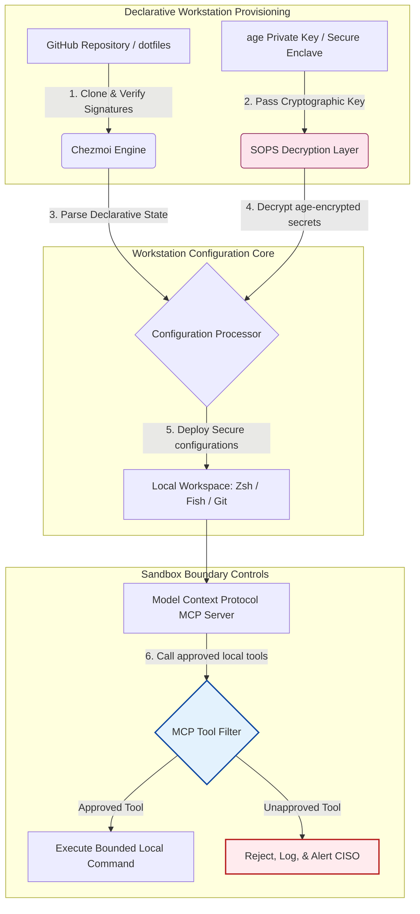

---

# Front Matter (YAML)

author: "contact@sebastienrousseau.com (Sebastien Rousseau)"
banner_alt: "Vývojářská pracovní stanice v tlumeném světle — symbolizuje AI-aware, reprodukovatelné a bezpečné dotfiles pro MCP servery, podepisování SLSA, tajné klíče age/SOPS a paritu více shellů"
banner_height: "1597"
banner_width: "2584"
banner: "https://cloudcdn.pro/stocks/images/almas-salakhov-Vq2ap8aFFEs.webp"
cdn: "https://cloudcdn.pro"
charset: "UTF-8"
cname: "sebastienrousseau.com"
copyright: "© Copyright 2025 - 2026 - Sebastien Rousseau. All rights reserved."
date: "June 16, 2026"
description: "AI-aware dotfiles jsou bezpečný a reprodukovatelný vzor pracovní stanice pro éru MCP — deklarativní konfigurace přes Chezmoi, tajné klíče SOPS/age, původ SLSA Level 3, parita více shellů a vymezené hranice sandboxu pro lokální AI agenty."
format-detection: "telephone=no"
hreflang: "cs"
icon: "https://cloudcdn.pro/clients/sebastienrousseau/v1/logos/sebastienrousseau.svg"
id: "https://sebastienrousseau.com/2026-06-16-ai-aware-dotfiles-secure-reproducible-workstation-2026"
image_alt: "Černobílý portrét Sebastiena Rousseaua"
image_height: "162"
image_width: "162"
image: "https://cloudcdn.pro/stocks/images/sebastienrousseau.webp"
keywords: "dotfiles, Chezmoi, MCP, Model Context Protocol, SLSA, SOPS, šifrování age, deklarativní konfigurace, vývojářská pracovní stanice, DORA článek 5, NIST CSF 2.0, bezpečnost dodavatelského řetězce, agentická AI, parita více shellů, Zsh, Fish, Nushell"
language: "cs-CZ"
last_reviewed: "2026-06-16"
layout: "report"
locale: "cs_CZ"
logo_alt: "Logo Sebastiena Rousseaua"
logo_height: "44"
logo_width: "44"
logo: "https://cloudcdn.pro/clients/sebastienrousseau/v1/logos/sebastienrousseau.svg"
menu: ""
measurementID: "G-169G4ET5HQ"
name: "Sebastien Rousseau"
permalink: "https://sebastienrousseau.com/2026-06-16-ai-aware-dotfiles-secure-reproducible-workstation-2026"
rating: "general"
referrer: "no-referrer"
robots: "index, follow"
schema: "FAQPage, Article"
seo_title: "AI-aware dotfiles pro bezpečnou vývojářskou stanici"
short_name: "sebastienrousseau"
subtitle: "Vývojářská pracovní stanice je dnes součástí dodavatelského řetězce AI; dotfiles potřebují bezpečnost, reprodukovatelnost, hygienu tajných klíčů a workflow vědomé MCP."
tags: "dotfiles, vývojářské nástroje, MCP, SLSA, bezpečná pracovní stanice, chezmoi, macOS, Linux, WSL"
theme-color: "0, 83, 191"
title: "AI-aware dotfiles 2026: bezpečná, reprodukovatelná vývojářská stanice pro MCP, SLSA a paritu více shellů"
url: "https://sebastienrousseau.com/2026-06-16-ai-aware-dotfiles-secure-reproducible-workstation-2026"
viewport: "width=device-width, initial-scale=1, shrink-to-fit=no"

# RSS - The RSS feed front matter (YAML).
atom_link: "https://sebastienrousseau.com/2026-06-16-ai-aware-dotfiles-secure-reproducible-workstation-2026/rss.xml"
category: "Technology"
docs: https://validator.w3.org/feed/docs/rss2.html
generator: "Static Site Generator (SSG) (version 0.0.26)"
item_description: "Pohled na deklarativní dotfiles pro bezpečnou a reprodukovatelnou vývojářskou pracovní stanici napříč macOS, Linux a WSL — s vědomím MCP, SLSA, age, SOPS a paritou více shellů."
item_guid: "https://sebastienrousseau.com/2026-06-16-ai-aware-dotfiles-secure-reproducible-workstation-2026/rss.xml"
item_link: "https://sebastienrousseau.com/2026-06-16-ai-aware-dotfiles-secure-reproducible-workstation-2026/rss.xml"
item_pub_date: "Tue, 16 Jun 2026 06:06:06 +0000"
item_title: "AI-aware dotfiles 2026: bezpečná, reprodukovatelná vývojářská stanice pro MCP, SLSA a paritu více shellů"
last_build_date: "Tue, 16 Jun 2026 06:06:06 +0000"
managing_editor: "contact@sebastienrousseau.com (Sebastien Rousseau)"
pub_date: "Tue, 16 Jun 2026 06:06:06 +0000"
ttl: "60"
type: "article"
webmaster: "contact@sebastienrousseau.com"

# Apple - The Apple front matter (YAML).
apple_mobile_web_app_orientations: "portrait"
apple_touch_icon_sizes: "192x192"
apple-mobile-web-app-capable: "yes"
apple-mobile-web-app-status-bar-inset: "black"
apple-mobile-web-app-status-bar-style: "black-translucent"
apple-mobile-web-app-title: "AI-aware dotfiles pro bezpečnou stanici"
apple-touch-fullscreen: "yes"

# MS Application - The MS Application front matter (YAML).

msapplication-navbutton-color: "0, 83, 191"

# Twitter Card - The Twitter Card front matter (YAML).

twitter_card: "summary_large_image"
twitter_creator: "@wwdseb"
twitter_description: "Pohled na deklarativní dotfiles pro bezpečnou a reprodukovatelnou vývojářskou pracovní stanici napříč macOS, Linux a WSL — s vědomím MCP, SLSA, age, SOPS a paritou více shellů."
twitter_image: "https://cloudcdn.pro/clients/sebastienrousseau/v1/logos/sebastienrousseau.svg"
twitter_image_alt: "Logo Sebastiena Rousseaua"
twitter_site: "@wwdseb"
twitter_title: "AI-aware dotfiles pro bezpečnou vývojářskou stanici"
twitter_url: "https://sebastienrousseau.com/2026-06-16-ai-aware-dotfiles-secure-reproducible-workstation-2026"

excerpt: "AI-aware dotfiles v roce 2026 chápou vývojářskou pracovní stanici jako infrastrukturu dodavatelského řetězce — deklarativní konfigurace spravovaná přes chezmoi s vědomím MCP, vydáními podepsanými SLSA, tajnými klíči age/SOPS, spuštěním pod sekundu a paritou macOS/Linux/WSL."

# Humans.txt - The Humans.txt front matter (YAML).
author_website: "https://sebastienrousseau.com"
author_twitter: "@wwdseb"
author_location: "London, UK"
thanks: "Děkujeme za přečtení!"
site_last_updated: "2026-06-16"
site_standards: "HTML5, CSS3, RSS, Atom, JSON, XML, YAML, Markdown, TOML"
site_components: "Kaishi, Kaishi Builder, Kaishi CLI, Kaishi Templates, Kaishi Themes"
site_software: "Static Site Generator, Rust"

---

# AI-aware dotfiles 2026: bezpečná, reprodukovatelná vývojářská stanice pro MCP, SLSA a paritu více shellů

<!-- lead-start -->
<aside class="post-lead" aria-label="Shrnutí článku">

<strong>Stručně.</strong> Vývojářská pracovní stanice už není jen koncovým bodem; je aktivním účastníkem softwarového dodavatelského řetězce a přímým rozhraním lokální kontrolní roviny AI. Terminálové AI asistenty a servery <a href="https://modelcontextprotocol.io">Model Context Protocol (MCP)</a> spouštějí lokální příkazy shellu, prohlížejí repozitáře a přímo čtou citlivé konfigurační soubory. <a href="https://github.com/sebastienrousseau/dotfiles">Dotfiles Sebastiena Rousseaua</a> jsou deklarativní open-source framework, který staví bezpečné a reprodukovatelné pracovní stanice napříč macOS, Linux a Windows Subsystem for Linux (WSL) — s integrací <a href="https://www.chezmoi.io/">Chezmoi</a>, <a href="https://github.com/getsops/sops">SOPS, age</a> a původu SLSA Level 3 pro memory-safe izolaci tajných klíčů a vymezené cesty spouštění pro lokální AI modely.

<strong>Klíčové body</strong>

<ul class="post-lead-takeaways">
  <li><strong>Pracovní stanice je infrastruktura dodavatelského řetězce.</strong> Konfigurace vývojářského prostředí musí být řízena se stejnou deklarativní přísností jako nasazení produkčních serverů, aby se eliminoval ruční konfigurační drift.</li>
  <li><strong>Výzva kontrolní roviny AI.</strong> Terminálové AI modely a nástroje MCP mají přístup k lokálním adresářům. Dotfiles musí vynucovat vymezené hranice sandboxu, přísné seznamy povolených nástrojů a neměnitelné lokální logy, aby zabránily úniku dat.</li>
  <li><strong>Absolutní parita napříč platformami.</strong> Identický, subsekundový výkon shellu a stejné bezpečnostní profily napříč macOS, Linux (Zsh, Fish, Nushell) a WSL zkracují onboarding vývojářů z týdnů na minuty.</li>
  <li><strong>Kryptograficky bezpečná izolace tajných klíčů.</strong> Šifrování souborů SOPS a age zabraňuje, aby natvrdo zakódovaná pověření (GitHub tokeny, přístupové klíče ke cloudu) skončila v Gitu nebo byla přečtena lokálními LLM.</li>
  <li><strong>Fiduciární hodnota na úrovni představenstva.</strong> Převádí compliance konfigurace pracovní stanice do jasných priorit pro radu, podporuje DORA článek 5, koncové standardy NIST CSF 2.0 a snížení operačního rizika dle Basel III.</li>
</ul>

<strong>Doporučené čtení:</strong> <a href="https://sebastienrousseau.com/2026-05-23-agentic-payments-banking-consent-liability-new-payment-ux-2026">Agentické platby v bankovnictví: souhlas, odpovědnost a nové UX plateb v roce 2026</a>, <a href="https://sebastienrousseau.com/2024-03-12-revolutionising-real-time-speech-recognition-on-macos-with-openai-whisper/index.html">Rychlé rozpoznávání řeči v reálném čase na macOS: OpenAI Whisper</a>, <a href="https://sebastienrousseau.com/2024-02-26-google-gemma-ai-transforming-open-source-ai-development/index.html">Google Gemma AI: proměna open-source vývoje AI</a>.

</aside>
<!-- lead-end -->

Most mezi deklarativní konfigurací pracovní stanice a bezpečným softwarovým dodavatelským řetězcem v době lokálních AI modelů a agentických vývojářských nástrojů.

Open-source referenčním bodem tohoto článku jsou [dotfiles ⧉](https://github.com/sebastienrousseau/dotfiles "dotfiles — deklarativní konfigurace pracovní stanice"). Repozitář je vymezen jako: deklarativní dotfiles pro macOS, Linux a WSL, nabízející paritu více shellů, spuštění pod sekundu, vydání podepsaná SLSA a konfiguraci vědomou AI/MCP.

## Proč tento open-source projekt v roce 2026 záleží

V červnu 2026 je vývojářská pracovní stanice nejslabším článkem softwarového dodavatelského řetězce a vysoce hodnotným cílem sofistikovaných státem sponzorovaných i kriminálních kybernetických syndikátů.

Bezpečnostní prostředí vývojového prostředí se radikálně proměnilo s nástupem terminálových AI kódovacích asistentů (například Claude Code) a s přijetím Model Context Protocol (MCP). Lokální vývojářské terminály dnes hostí aktivní, autonomní AI agenty schopné:

- Číst a upravovat lokální zdrojové soubory.
- Volat lokální CLI nástroje (`git`, `npm`, `aws`, `kubectl`).
- Prohlížet proměnné prostředí shellu, lokální databáze a konfigurační nastavení.

Pokud lokální prostředí vývojáře postrádá přísné hranice, mohou tyto autonomní AI nástroje nedopatřením přečíst citlivá osobní data, vynést cloudová pověření do veřejných LLM API nebo během automatizovaných buildů spustit škodlivé balíčky.

Podle Digital Operational Resilience Act (DORA) a NIST Cybersecurity Framework (CSF) 2.0 jsou finanční instituce zákonně povinny ověřovat původ a bezpečnostní integritu každého zařízení, které přistupuje k softwarovému dodavatelskému řetězci. „Notebooky-sněhové vločky" — ručně konfigurované, neauditované, driftující konfigurace — už nejsou v souladu s globálními bankovními standardy.

[Dotfiles Sebastiena Rousseaua](https://github.com/sebastienrousseau/dotfiles) tento problém řeší. Jde o open-source deklarativní framework pro správu pracovních stanic, který buduje bezpečné a reprodukovatelné vývojářské prostředí. Vynucováním standardizované, auditovatelné konfigurační základny dodává projekt vysokou návratnost odolnosti (Return on Resilience, RoR), zkracuje onboarding vývojářů z týdnů na hodiny a chrání citlivé finanční dodavatelské řetězce před zranitelnostmi koncových bodů.

## Architektonická optika AI-aware pracovní stanice 2026

Framework dotfiles funguje jako bezpečný deklarativní správce prostředí — všechny lokální shelly, nástroje a tajné klíče jsou systematicky spravovány, auditovány a izolovány:

| Vrstva | Designové rozhodnutí | Proč na tom záleží | Riziko při zanedbání |
|---|---|---|---|
| **Provisioning vrstva** | Deklarativní správa konfigurace přes Chezmoi | Staví plně reprodukovatelné pracovní stanice napříč macOS, Linux a WSL a eliminuje drift. | Konfigurace-sněhové vločky s neauditovanými, zranitelnými lokálními stavy. |
| **Vrstva shellů** | Parita více shellů (Zsh, Fish, Nushell) | Zajišťuje identické subsekundové spuštění a konzistentní chování aliasů napříč různými prostředími. | Nekonzistence shellových příkazů způsobující neočekávané výsledky skriptů. |
| **Vrstva tajných klíčů** | Šifrování souborů přes SOPS a age | Zabraňuje, aby natvrdo zakódovaná pověření a holé klíče skončily v Gitu nebo byly vystaveny lokálním LLM. | Pověření uniklá do historie veřejných repozitářů nebo kompromitovaná lokálními agenty. |
| **Vrstva AI/MCP** | Hraniční kontrolní mechanismy Model Context Protocol | Omezuje lokální AI agenty na konkrétní seznam schválených nástrojů a loguje všechna lokální spuštění. | Neomezení AI agenti spouštějící divoké nebo destruktivní příkazy lokálně. |
| **Vrstva dodavatelského řetězce** | Vydání podepsaná SLSA a verifikace Sigstore | Kryptograficky prokazuje pravost bootstrap skriptů a konfiguračních souborů. | Kompromitované setup skripty vkládající škodlivá zadní vrátka do vývojářských prostředí. |

## Klíčové signály bezpečnosti a automatizace pracovní stanice

Pro udržení absolutní bezpečnosti napříč vývojovým prostředím musí Chief Information Security Officers (CISO) a technologičtí manažeři sledovat konkrétní, kvantifikovatelné provozní ukazatele:

| Signál | Metrika / Provozní benchmark | Reference NIST CSF / DORA | Implementace na technické platformě |
|---|---|---|---|
| **Reprodukovatelnost pracovní stanice** | % vývojářských notebooků plně spravovaných přes deklarativní repozitáře dotfiles bez konfiguračního driftu. | NIST CSF 2.0 (PR.DS-01) | Audity driftu Chezmoi spouštěné automaticky při startu terminálu. |
| **Hygiena pověření** | Nulové nešifrované tajné klíče nebo klíče uložené v plaintextu napříč lokálními konfiguračními soubory. | DORA článek 6 (Bezpečnost ICT) | Pre-commit hooky Gitu a lokální skeny odmítající nešifrované soubory. |
| **Původ buildu** | 100 % bootstrap utilit pracovní stanice ověřeno kryptograficky podepsanými manifesty. | DORA článek 30 (Dodavatelský řetězec) | Verifikace Sigstore a SLSA Level 3 zapracovaná do setup pipelines. |
| **Doba onboardingu vývojáře** | Čas od přidělení holého hardwaru po plně nakonfigurované, compliance-konformní vývojové prostředí. | Return on Resilience (RoR) | Automatizované deklarativní setup skripty sestavující prostředí pod 15 minut. |
| **Vymezený přístup AI agenta** | Ověření, že lokální AI nástroje pracují v definovaných adresářových limitech s výchozím režimem jen pro čtení. | Model Risk Management | Konfigurační profily MCP omezující katalogy nástrojů agenta na schválené operace. |

## Proč je deklarativní konfigurace jádrem bezpečnosti pracovní stanice

Tradiční přístupy k nastavení vývojářské pracovní stanice jsou silně manuální a vedou k „notebookům-sněhovým vločkám" — prostředím, kde konfigurace driftují, jak vývojáři instalují vlastní nástroje, upravují proměnné a mění lokální skripty. Tento drift vytváří několik kritických zranitelností:

1. **Nesledované stínové konfigurace.** Driftující notebooky často provozují zastaralé, zranitelné softwarové balíčky nebo lokální skripty, které obcházejí podnikové bezpečnostní nástroje.
2. **Únik tajných klíčů.** Vývojáři často natvrdo zakódují API klíče, GitHub tokeny nebo AWS pověření přímo do plaintextových skriptů nebo profilů shellu, což z nich činí snadný cíl krádeže.
3. **Neefektivní onboarding.** Manuální nastavení nové vývojářské pracovní stanice může zabrat až dva týdny inženýrského času a tlumí rychlost týmu.

Přechodem na deklarativní, modelově řízenou konfiguraci s Chezmoi se celé vývojářské prostředí stává verzovaným, reprodukovatelným systémem záznamů. Každá změna, alias, balíčková závislost i bezpečnostní default je zdokumentován v Gitu, validován proti organizačním compliance politikám a kryptograficky ověřen ještě před aplikací na fyzický notebook.

## Návrh vymezeného vývojářského prostředí pro AI

Aby lokální AI agenti a nástroje MCP nezískaly neomezený přístup k lokálním aktivům, musí pracovní stanice fungovat jako vymezená rovina spouštění.

Provozní tok níže ukazuje, jak framework dotfiles koordinuje Chezmoi, SOPS a age při dešifrování a nasazování bezpečných dotfiles a zároveň udržuje izolovanou, sandboxovanou hranici spouštění pro lokální AI agenty volající nástroje MCP:

## Playbook pro představenstvo a fiduciární odpovědnost

Bezpečnost vývojářské pracovní stanice a integrita dodavatelského řetězce jsou kritickými prioritami pro představenstvo. Senior manažeři musí pohlížet na riziko vývojářského prostředí optikou fiduciární odpovědnosti, regulatorní compliance a ochrany obchodní hodnoty:

- **DORA článek 5 (odpovědnost představenstva).** Ukládá, že řídicí orgán (představenstvo) nese konečnou odpovědnost za řízení ICT rizik instituce. Protože vývojářské pracovní stanice jsou bránou do softwarového dodavatelského řetězce, musí členové představenstva ověřit, že koncové body jsou bezpečné, plně auditovatelné a spravované pod přísnými, reprodukovatelnými konfiguračními frameworky, aby uspěly v regulatorních auditech.
- **NIST CSF 2.0 compliance (bezpečnost koncových bodů).** Vyžaduje, aby do firemních sítí a repozitářů měla přístup pouze autorizovaná a validovaná zařízení s standardizovanými, bezpečnými konfiguracemi. Deklarativní dotfiles umožňují bezpečnostním týmům matematicky prokázat, že všechna vývojářská prostředí jsou v souladu s bezpečnostní základnou organizace, a eliminují riziko neauditovaných nastavení „sněhové vločky".
- **Ochrana hodnoty rozvahy.** Jediné kompromitované vývojářské pověření nebo průlom dodavatelského řetězce může instituci stát miliony dolarů na nápravě, regulatorních pokutách a reputační škodě. Přechod na bezpečné, deklarativní vývojářské prostředí toto riziko přímo minimalizuje, chrání hodnotu rozvahy a důvěru zákazníků.

## Co to znamená podle typu banky

### Globální systémově významné banky (G-SIB)

G-SIB spravují tisíce vývojářských pracovních stanic napříč více kontinenty a regulatorními jurisdikcemi. Jejich hlavní výzvou je udržet konzistenci konfigurace a zabránit úniku pověření napříč obrovskými inženýrskými týmy. Přijetím deklarativního open-source dotfiles modelu s Chezmoi mohou G-SIB standardizovat bezpečnost koncových bodů, automatizovat compliance audity a zkrátit dobu onboardingu vývojářů z týdnů na minuty napříč celou globální organizací.

### Transakční a korporátní banky

Transakční banky provozují citlivé platební brány a velkoobchodní clearingové infrastruktury. Prokázat absolutní integritu kódu nasazeného do těchto produkčních prostředí je nepřekročitelným regulatorním požadavkem. Standardizace vývojářských pracovních stanic pod bezpečným SLSA-konformním frameworkem dotfiles garantuje, že softwarový dodavatelský řetězec je plně auditovaný a chráněný před zranitelnostmi lokálních vývojářských koncových bodů.

### Regionální a menší banky

Regionální banky musí udržovat vysoké kybernetické standardy bez masivních bezpečnostních rozpočtů G-SIB. Tento open-source framework dotfiles poskytuje lehké, nákladově efektivní a vysoce bezpečné Python a Rust friendly řešení, které menším institucím umožňuje zavést bezpečnost koncových bodů a ochranu dodavatelského řetězce na podnikové úrovni bez drahých proprietárních softwarových licencí.

## Závěr: plán pro vývojářskou pracovní stanici

Vývojářská pracovní stanice už není periferním zařízením; je kritickou kontrolní rovinou softwarového dodavatelského řetězce. Umožnit ručně konfigurovaným, neauditovaným „notebookům-sněhovým vločkám" přístup k firemním aktivům je vážným provozním i regulatorním rizikem.

K zabezpečení softwarového dodavatelského řetězce a ochraně koncových bodů před zranitelnostmi lokálních AI agentů musí senior technologičtí a bezpečnostní manažeři dnes provést jasný vývojový plán:

1. **Nařídit deklarativní provisioning.** Vyřadit manuální, dokumentačně vedené procesy nastavení a nařídit, aby všechna vývojářská prostředí byla provisionována deklarativně přes Chezmoi.
2. **Vynutit hygienu tajných klíčů.** Vynutit přísné pre-commit hooky a skenovací utility, aby na lokálních konfiguracích pracovních stanic nezůstala nulová holá pověření, klíče ani API tokeny v plaintextu.
3. **Zavést hranice AI sandboxu.** Implementovat bezpečné, vymezené konfigurační profily MCP, které omezí lokální AI kódovací asistenty a agenty na schválené nástroje a adresáře jen pro čtení.
4. **Zabezpečit dodavatelský řetězec.** Zajistit, že všechny bootstrap skripty a konfigurace prostředí budou před nasazením kryptograficky ověřeny pomocí původu SLSA Level 3.

## Často kladené otázky

**Co je Chezmoi a proč se používá pro dotfiles?**

Chezmoi je open-source, bezpečný deklarativní správce dotfiles. Umožňuje vývojářům spravovat lokální konfigurace jako verzovaný repozitář a zajišťuje absolutní konzistenci a reprodukovatelnost napříč různými operačními systémy (macOS, Linux, WSL).

**Jak framework chrání tajné klíče?**

Framework používá šifrování souborů SOPS (Secrets Operations) a age k zašifrování citlivých pověření (například GitHub tokenů nebo cloudových přístupových klíčů) přímo uvnitř repozitáře dotfiles. To zabraňuje, aby klíče skončily v plaintextu nebo aby je přečetli neoprávnění lokální AI agenti.

**Co je Model Context Protocol (MCP) a jak ovlivňuje bezpečnost?**

MCP je otevřený standard, který AI modelům umožňuje bezpečně spouštět lokální nástroje a přistupovat k souborům. Framework dotfiles implementuje přísné konfigurační soubory MCP, které lokální AI nástroje a agenty omezují na schválené adresáře a příkazy.

**Které shelly framework podporuje?**

Bash, Zsh, Fish, Nushell a PowerShell — s paritou napříč macOS, Linux a WSL, takže chování příkazů zůstává identické bez ohledu na to, který terminál vývojář otevře.

## Reference

- Open Source Security Foundation (OpenSSF), (2024). *Supply-chain Levels for Software Artifacts (SLSA)*. Dostupné z: [framework SLSA ⧉](https://slsa.dev/ "framework SLSA").
- NIST, (2024). *NIST Cybersecurity Framework 2.0*. Gaithersburg: National Institute of Standards and Technology. Dostupné z: [NIST CSF 2.0 ⧉](https://www.nist.gov/cyberframework "NIST Cybersecurity Framework 2.0").
- Evropský parlament a Rada Evropské unie, (2022). *Nařízení (EU) 2022/2554 o digitální provozní odolnosti finančního sektoru (DORA)*. Brusel: Úřední věstník Evropské unie. Dostupné z: [nařízení DORA ⧉](https://eur-lex.europa.eu/legal-content/EN/TXT/?uri=CELEX%3A32022R2554 "nařízení DORA").
- GitHub, (2026). *open-source repozitář dotfiles*. Dostupné z: [repozitář dotfiles ⧉](https://github.com/sebastienrousseau/dotfiles "repozitář dotfiles").

<!-- enrich-start -->
<aside class="author-card" aria-label="O autorovi"><strong class="author-card-name"><a href="/about/index.html">Sebastien Rousseau</a></strong>Senior bankovní technolog píšící o aplikované AI, migraci ISO 20022, postkvantové kryptografii pro finanční služby a o strukturální transformaci velkoobchodních plateb.20+ let napříč HSBC Commercial &amp; Investment Bank, PayPal, Barclays, Shazam, AKQA, Virgin Group. <a href="/about/index.html">Plný profil</a> &middot; <a href="https://www.linkedin.com/in/sebastienrousseau/" rel="external noopener">LinkedIn</a> &middot; <a href="https://github.com/sebastienrousseau" rel="external noopener">GitHub</a></aside>

Naposledy revidováno <time datetime="2026-06-16">2026-06-16</time>.

<aside class="related-posts" aria-labelledby="related-heading">
<h2 id="related-heading" class="related-heading">Doporučené čtení</h2>

<article class="related-card"><footer class="related-body"><h3><a href="https://sebastienrousseau.com/2026-05-23-agentic-payments-banking-consent-liability-new-payment-ux-2026">Agentické platby v bankovnictví: souhlas, odpovědnost a nové UX plateb v roce 2026</a></h3>
<time datetime="2026-05-23">2026-05-23</time>
</footer></article>
<article class="related-card"><footer class="related-body"><h3><a href="https://sebastienrousseau.com/2024-03-12-revolutionising-real-time-speech-recognition-on-macos-with-openai-whisper/index.html">Rychlé rozpoznávání řeči v reálném čase na macOS: OpenAI Whisper</a></h3>
<time datetime="2024-03-12">2024-03-12</time>
</footer></article>
<article class="related-card"><footer class="related-body"><h3><a href="https://sebastienrousseau.com/2024-02-26-google-gemma-ai-transforming-open-source-ai-development/index.html">Google Gemma AI: proměna open-source vývoje AI</a></h3>
<time datetime="2024-02-26">2024-02-26</time>
</footer></article>

</aside>
<!-- enrich-end -->
