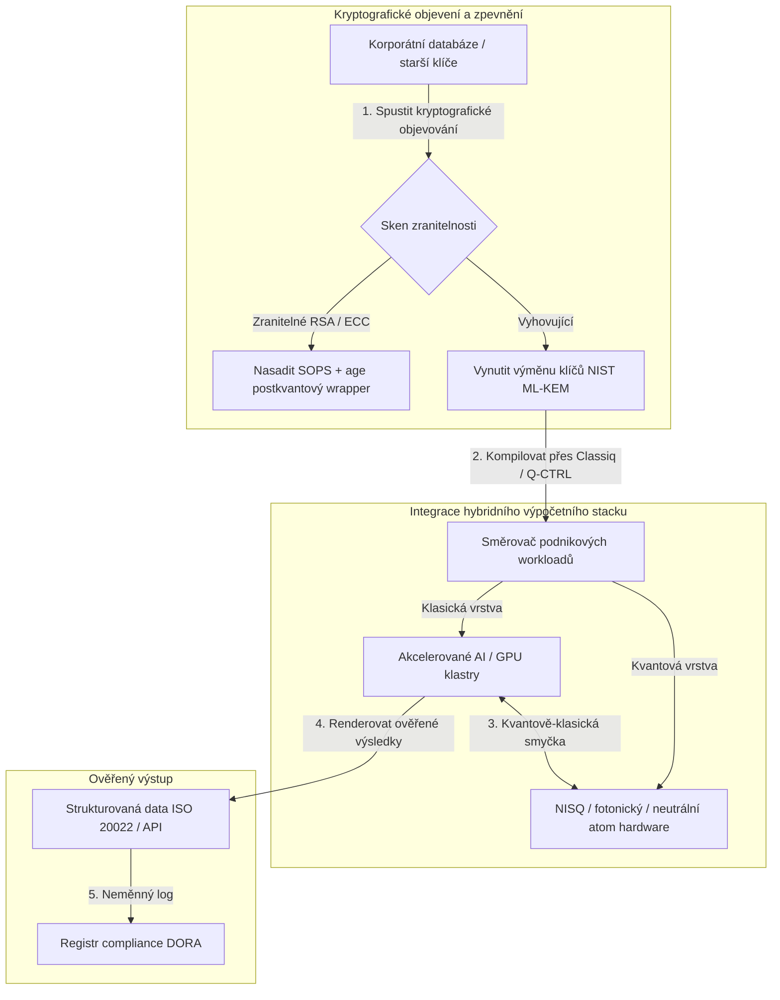

---

# Front Matter (YAML)

author: "contact@sebastienrousseau.com (Sebastien Rousseau)"
banner_alt: "Pohled na pódium summitu Economist Impact 5th Annual Commercialising Quantum Global 2026 v Londýně — symbolizuje přechod kvantové technologie z fyzikálního výzkumu do firemních workflow připravených pro nasazení"
banner_height: "1597"
banner_width: "2584"
banner: "https://cloudcdn.pro/stocks/images/sebastien-rousseau-20260617-5th-commercialising-quantum-2.webp"
cdn: "https://cloudcdn.pro"
charset: "UTF-8"
cname: "sebastienrousseau.com"
copyright: "© Copyright 2025 - 2026 - Sebastien Rousseau. All rights reserved."
date: "June 17, 2026"
description: "Závěry pro představenstvo ze summitu Economist Impact 5th Annual Commercialising Quantum Global 2026 — nárůst financování o 1,3 mld. USD, hybridní stacky bez lítosti, urgentní migrace na postkvantovou kryptografii, komercializace kvantového snímání a direktiva HSBC, že čekání je nevynucenou chybou."
format-detection: "telephone=no"
hreflang: "cs"
icon: "https://cloudcdn.pro/clients/sebastienrousseau/v1/logos/sebastienrousseau.svg"
id: "https://sebastienrousseau.com/2026-06-17-economist-commercialising-quantum-summit-2026"
image_alt: "Černobílý portrét Sebastiena Rousseaua"
image_height: "162"
image_width: "162"
image: "https://cloudcdn.pro/stocks/images/sebastienrousseau.webp"
keywords: "Commercialising Quantum Global 2026, summit Economist Impact, postkvantová kryptografie, NIST ML-KEM, harvest-now decrypt-later, SNDL, kvantové HSBC, Philip Intallura, kvantové snímání, navigace nezávislá na GPS, NQCC, EU Quantum Act, Quantcore, cena qBIG, Lord Vallance, hybridní kvantově-klasický, DORA článek 6"
language: "cs-CZ"
last_reviewed: "2026-06-17"
layout: "report"
locale: "cs_CZ"
logo_alt: "Logo Sebastiena Rousseaua"
logo_height: "44"
logo_width: "44"
logo: "https://cloudcdn.pro/clients/sebastienrousseau/v1/logos/sebastienrousseau.svg"
menu: ""
measurementID: "G-169G4ET5HQ"
name: "Sebastien Rousseau"
permalink: "https://sebastienrousseau.com/2026-06-17-economist-commercialising-quantum-summit-2026"
rating: "general"
referrer: "no-referrer"
robots: "index, follow"
schema: "FAQPage, Article"
seo_title: "Commercialising Quantum 2026: závěry pro představenstvo"
short_name: "sebastienrousseau"
subtitle: "Kvantové technologie přešly ze spekulativní laboratorní vědy do hybridních firemních workflow; představenstvo musí reagovat na 1,3 mld. USD financování v roce 2026, okamžitou postkvantovou migraci a direktivu HSBC přestat čekat."
tags: "kvantové technologie, postkvantová kryptografie, NIST ML-KEM, harvest-now decrypt-later, kvantové snímání, HSBC, Economist Impact, hybridní výpočty, DORA, EU Quantum Act, NQCC, závěry summitu"
theme-color: "0, 83, 191"
title: "Od qubitů k zisku: strategické závěry z 5. ročníku summitu Economist Commercialising Quantum Global 2026"
url: "https://sebastienrousseau.com/2026-06-17-economist-commercialising-quantum-summit-2026"
viewport: "width=device-width, initial-scale=1, shrink-to-fit=no"

# RSS - The RSS feed front matter (YAML).
atom_link: "https://sebastienrousseau.com/2026-06-17-economist-commercialising-quantum-summit-2026/rss.xml"
category: "Technology"
docs: https://validator.w3.org/feed/docs/rss2.html
generator: "Static Site Generator (SSG) (version 0.0.26)"
item_description: "Závěry pro představenstvo ze summitu Economist Impact 5th Annual Commercialising Quantum Global 2026 — nárůst financování o 1,3 mld. USD, hybridní stacky bez lítosti, urgentní migrace na postkvantovou kryptografii, komercializace kvantového snímání a direktiva HSBC, že čekání je nevynucenou chybou."
item_guid: "https://sebastienrousseau.com/2026-06-17-economist-commercialising-quantum-summit-2026/rss.xml"
item_link: "https://sebastienrousseau.com/2026-06-17-economist-commercialising-quantum-summit-2026/rss.xml"
item_pub_date: "Wed, 17 Jun 2026 06:06:06 +0000"
item_title: "Od qubitů k zisku: strategické závěry z 5. ročníku summitu Economist Commercialising Quantum Global 2026"
last_build_date: "Wed, 17 Jun 2026 06:06:06 +0000"
managing_editor: "contact@sebastienrousseau.com (Sebastien Rousseau)"
pub_date: "Wed, 17 Jun 2026 06:06:06 +0000"
ttl: "60"
type: "article"
webmaster: "contact@sebastienrousseau.com"

# Apple - The Apple front matter (YAML).
apple_mobile_web_app_orientations: "portrait"
apple_touch_icon_sizes: "192x192"
apple-mobile-web-app-capable: "yes"
apple-mobile-web-app-status-bar-inset: "black"
apple-mobile-web-app-status-bar-style: "black-translucent"
apple-mobile-web-app-title: "Commercialising Quantum 2026: závěry"
apple-touch-fullscreen: "yes"

# MS Application - The MS Application front matter (YAML).

msapplication-navbutton-color: "0, 83, 191"

# Twitter Card - The Twitter Card front matter (YAML).

twitter_card: "summary_large_image"
twitter_creator: "@wwdseb"
twitter_description: "Závěry pro představenstvo ze summitu Economist Impact 5th Annual Commercialising Quantum Global 2026 — nárůst financování o 1,3 mld. USD, hybridní stacky bez lítosti, urgentní migrace na postkvantovou kryptografii, komercializace kvantového snímání a direktiva HSBC, že čekání je nevynucenou chybou."
twitter_image: "https://cloudcdn.pro/clients/sebastienrousseau/v1/logos/sebastienrousseau.svg"
twitter_image_alt: "Logo Sebastiena Rousseaua"
twitter_site: "@wwdseb"
twitter_title: "Commercialising Quantum 2026: závěry pro představenstvo"
twitter_url: "https://sebastienrousseau.com/2026-06-17-economist-commercialising-quantum-summit-2026"

excerpt: "Summit Economist Impact 5th Annual Commercialising Quantum Global 2026 potvrdil obrat kvantových technologií k firemním workflow: 1,3 mld. USD získaných za pět měsíců, postkvantová kryptografie je fiduciární otázka na úrovni představenstva pod tlakem SNDL sběru, kvantové snímání se dnes dodává pro navigaci nezávislou na GPS a Philip Intallura z HSBC oznámil direktivu, že čekat na hardware odolný proti chybám je nevynucenou chybou."

# Humans.txt - The Humans.txt front matter (YAML).
author_website: "https://sebastienrousseau.com"
author_twitter: "@wwdseb"
author_location: "London, UK"
thanks: "Děkujeme za přečtení!"
site_last_updated: "2026-06-17"
site_standards: "HTML5, CSS3, RSS, Atom, JSON, XML, YAML, Markdown, TOML"
site_components: "Kaishi, Kaishi Builder, Kaishi CLI, Kaishi Templates, Kaishi Themes"
site_software: "Static Site Generator, Rust"

---

# Od qubitů k zisku: strategické závěry z 5. ročníku summitu Economist Commercialising Quantum Global 2026

Připravenost podniků, migrace na postkvantovou kryptografii, hybridní výpočetní stacky a vznikající komerční prostředí kvantového snímání a sítí.

**Stručně.** 5. ročník konference Commercialising Quantum Global 2026 pořádaný Economist Impact ve dnech 16.–17. června 2026 v Business Design Centre v Londýně shromáždil přes 1 100 globálních lídrů z podnikové sféry, financí, politiky a výzkumu. Ústřední téma znamenalo jasný strukturální obrat: kvantové technologie přešly ze spekulativní laboratorní vědy do praktických hybridních firemních workflow. Podpořena 1,3 miliardami USD rizikového kapitálu získanými jen za prvních pět měsíců roku 2026 se debata v představenstvech již nesoustředí na počítání fyzických qubitů, ale na zavádění hybridních výpočetních stacků „bez lítosti", zabezpečení digitálních aktiv proti kryptografické hrozbě „harvest-now, decrypt-later" (SNDL) a nasazování krátkodobých systémů kvantového snímání pro navigaci nezávislou na GPS.

## Klíčové závěry

- **Posun podniků k praktickým workflow.** Lídři odvětví ([Steve Suarez](https://www.linkedin.com/in/stevesuarez) z HorizonX, [Phil Intallura](https://www.linkedin.com/in/intallura) z HSBC) zdůraznili, že integrace kvantových technologií už není problémem fyziky, ale provozu. Banky a podniky nasazují hybridní kvantově-klasické piloty, aby připravily talenty a optimalizovaly aktivní workloady.
- **Postkvantová kryptografie (PQC) je prioritou představenstva.** Bezpečnostní a právní experti (CMS UK, [Joanne Miller](https://www.linkedin.com/in/joanne-miller-nso) z Microsoftu, [Craig Farrell](https://www.linkedin.com/in/craig-farrell) z EY) varovali, že organizace nemohou čekat na hardware odolný proti chybám, aby nasadily PQC. Sběr „harvest-now, decrypt-later" probíhá již dnes, čímž se migrace na standardy NIST ML-KEM stává okamžitou fiduciární otázkou.
- **Kvantové snímání vede v krátkodobé ziskovosti.** Zatímco výpočty odolné proti chybám zůstávají roky vzdálené, kvantové snímání ([Matthew Kinsella](https://www.linkedin.com/in/matthewkinsella) z Infleqtion) se rychle škáluje. Kvantové hodiny a inerciální senzory se nasazují v navigaci nezávislé na GPS, národní bezpečnosti a ultra-stabilních energetických sítích.
- **Suverenita, klastry a politická naléhavost.** Britský ministr pro vědu [Lord Vallance](https://www.linkedin.com/in/patrick-vallance) a [Lord William Hague](https://www.linkedin.com/in/williamhague) představili národní mise k přeměně výzkumu na průmyslové „superklastry" koordinované s National Quantum Computing Centre (NQCC). Připravovaný EU Quantum Act dále zdůrazňuje geopolitický spěch o suverénní výpočetní kapacitu.
- **Quantcore vyhrává cenu qBIG.** Spin-out University of Glasgow Quantcore získal cenu IOP qBIG za průlomové supravodivé komponenty na bázi niobu, které pracují při vyšších teplotách než tradiční materiály, čímž výrazně snižují nároky na kryogenní infrastrukturu.

**Doporučené čtení:** [KyberLib a migrace bankovnictví na postkvantovou kryptografii v roce 2026: od standardů ke kódu](https://sebastienrousseau.com/2026-06-12-kyberlib-post-quantum-banking-migration-standards-code-2026/), [Index bankovní odolnosti v roce 2026: AI, cloud, kvantové technologie, platby a riziko koncentrace třetích stran](https://sebastienrousseau.com/2026-06-08-banking-resilience-index-ai-cloud-quantum-payments-third-party-risk-2026/), [Index cloud-native bankovnictví v roce 2026: DORA, platformové inženýrství, suverénní cloud a provozní odolnost](https://sebastienrousseau.com/2026-06-05-cloud-native-banking-index-dora-resilience-platform-engineering-2026/).

## 01. Proč na summitu 2026 záleží představenstvu

Ročník 2026 summitu Economist Commercialising Quantum Global znamenal trvalý posun v tom, jak korporátní svět hodnotí deep tech.

Historicky byly kvantové výpočty odsunuty do oddělení výzkumu a vývoje jako několikadekádové vědecké úsilí. V červnu 2026 je tato perspektiva zastaralá. Organizace musí přejít od „fyzikálně-centrické" zvědavosti k „byznysově-centrické" implementaci. Důvod je dvojí:

1. **Konvergence kvantových technologií a AI.** Stacky vysoce výkonných výpočtů (HPC) spojují klasické, akcelerované AI a NISQ (Noisy Intermediate-Scale Quantum) uzly do jediné, sjednocené výpočetní vrstvy. Organizace, které odloží budování kvantově připravených aplikací, zjistí, že okno pro získání strategické výhody se zavírá rychleji, než se očekávalo.
2. **Geopolitická a fiduciární naléhavost.** S britským kvantovým programem řízeným misemi a připravovaným EU Quantum Act se kvantová kapacita stala otázkou národní suverenity a kontinuity podnikání.

Postkvantová kybernetická bezpečnost navíc už není budoucím požadavkem compliance. Hrozba útoků „store now, decrypt later" (SNDL) znamená, že korporátní data zachycená dnes budou dešifrována, jakmile se komerční kvantové systémy škálují, což vytváří okamžitou odpovědnost podle globálních mandátů provozní odolnosti, jako je Digital Operational Resilience Act (DORA).

## 02. Strategická optika Commercialising Quantum 2026

Lídři podnikových technologií musí zmapovat kvantovou zralost napříč pěti odlišnými provozními vrstvami a vyhodnotit časové horizonty a rizika rozvahy.

### Tabulka 1: Strategická optika Commercialising Quantum 2026

| Vrstva | Korporátní zaměření | Časová osa / horizont | Klíčové korporátní riziko |
| ---- | ---- | ---- | ---- |
| **Hardware a kompilátor** | Volba mezi konkurenčními přístupy (supravodivé, iontové pasti, neutrální atomy, fotonika) | 3 – 5 let (odolnost proti chybám) | Uzamčení do slepé architektury nebo příliš brzká sázka na jedinou platformu. |
| **Kryptografické zpevnění** | Objevení a inventarizace kryptografických závislostí; migrace na NIST ML-KEM | Okamžité (aktivní migrace) | Systémové úniky dat a selhání compliance podle DORA a NIST CSF 2.0. |
| **Kvantové snímání** | Nasazení navigace nezávislé na GPS, ultra-stabilních hodin a gravimetrů | 1 – 2 roky (okamžitá komercializace) | Provozní narušení logistiky, lodní dopravy a energetických sítí kvůli rušení GPS. |
| **Systémová integrace** | Připojení kvantového hardwaru do existujících klasických HPC a superpočítačových datových center | 1 – 3 roky (hybridní fáze) | Vysoká latence, úzká hrdla přenosu dat a fragmentovaná výpočetní sila. |
| **Podnikový software** | Zpřístupnění kvantových algoritmů přes vysokoúrovňové abstrakční vrstvy a API (Classiq, Q-CTRL) | Okamžité (budování dovedností) | Izolace talentu a workflow od skutečné inženýrské realizace. |

## 03. Klíčové kvantové signály a spouštěče pro představenstvo

Lídři technologií musí monitorovat konkrétní, kvantifikovatelné tržní a regulatorní metriky, aby řídili své kvantové investice.

### Tabulka 2: Klíčové kvantové signály a spouštěče pro představenstvo

| Signál | Kvantitativní metrika | Regulatorní / politická reference | Akční platformová priorita |
| ---- | ---- | ---- | ---- |
| **Nárůst kvantového financování** | 1,3 miliardy USD získaných globálně v prvních pěti měsících 2026 | Return on Resilience (RoR) | Přesunout rozpočty ze spekulativních pilotů na „bez lítosti" hybridní kvantově-klasické workloady. |
| **Expozice dešifrování dat** | 100 % šifrovaných dat přenášených veřejnými kanály vystaveno sběru SNDL | DORA článek 6 (bezpečnost ICT) | Implementovat nástroje kryptografického objevování k identifikaci zranitelných RSA/ECC klíčů napříč infrastrukturou. |
| **Suverénní infrastruktura** | 2,5 miliardy GBP alokovaných v britské Národní kvantové strategii | UK Quantum Missions / Lord Vallance | Navázat lokální partnerství s národními superklastry, jako je NQCC. |
| **Termíny compliance** | 14. listopadu 2026, přechod SWIFT na strukturované adresy | Direktiva SWIFT SR 2026 | Vyčistit a naformátovat mezibankovní databáze tak, aby splňovaly strukturované XML specifikace. |

## 04. Detailní pohled na hlavní témata summitu

### Kvantové technologie dosahují bodu zlomu v investicích

Financování rizikovým kapitálem zaznamenalo výrazné zrychlení a získalo **1,3 miliardy USD** jen za prvních pět měsíců roku 2026. Na rozdíl od spekulativních hype cyklů předchozích let je současná kapitálová vlna podpořena reálnými, krátkodobými workloady. Řečníci ze společností Classiq a IBM Quantum Platform předvedli, jak softwarové abstrakční vrstvy a automatizované kompilátory umožňují nespecialistickým vývojářským týmům spouštět hybridní kvantově-klasické algoritmy na dnešní klasické infrastruktuře. Tato strategie „bez lítosti" umožňuje organizacím okamžitě budovat kvantově připravené talenty a workflow.

### Právní a regulatorní varování ohledně „harvest now, decrypt later"

Právní partneři a vedoucí kybernetické bezpečnosti vyvolali velký zájem kolem bezprostřednosti datového rizika. Zástupci sponzorské advokátní kanceláře CMS UK a CSO Microsoftu [Joanne Miller](https://www.linkedin.com/in/joanne-miller-nso) doručili vrcholovému managementu jasné varování: *čekání na příchod hardwaru odolného proti chybám před nasazením postkvantové kryptografie je kritickým fiduciárním selháním.*

V paradigmatu „store now, decrypt later" (SNDL) nepřátelské subjekty aktivně sbírají šifrovaná korporátní data již dnes s úmyslem dešifrovat je, jakmile se objeví kryptograficky relevantní kvantové počítače. Organizace musí okamžitě nasadit postkvantovou ochranu (například NIST ML-KEM), aby chránily dlouhodobě citlivé datové sady, duševní vlastnictví a historické zákaznické záznamy.

### Přerovnání hype kolem „kvantového snímání"

Zatímco kvantové výpočty odolné proti chybám zůstávají roky vzdálené, summit vyzdvihl kvantové snímání jako první skutečně ziskovou vlnu reálného nasazení. Generální ředitel [Matthew Kinsella](https://www.linkedin.com/in/matthewkinsella) z Infleqtion popsal, jak se kvantové hodiny, inerciální senzory a radiofrekvenční systémy rychle škálují napříč více odvětvími.

Protože tyto technologie měří fyzikální konstanty se subatomární přesností, umožňují **navigaci nezávislou na GPS**, ultra-stabilní energetické sítě a telekomunikace v hlubokém vesmíru. Tyto aplikace jsou vysoce relevantní pro letectví, námořní dopravu a národně-obranné systémy čelící rostoucím hrozbám rušení GPS.

### Spolupráce ekosystému a klastrů

Britský kvantový ekosystém využil londýnský summit k představení domácích inovačních superklastrů. Živé aktualizace z National Quantum Computing Centre (NQCC) a Digital Catapult ukázaly, jak rané deep-tech spin-outy mohou překlenout „technologickou propast" přímou integrací kvantového hardwaru do klasických superpočítačových datových center.

[Wridhdhisom Karar](https://www.linkedin.com/in/wridhdhisomkarar), spoluzakladatel skotského kvantového startupu Quantcore, převzal prestižní cenu Institute of Physics (IOP) Quantum Business Innovation and Growth (qBIG) za supravodivé komponenty společnosti na bázi niobu. Tyto komponenty pracují při vyšších teplotách než tradiční materiály, čímž výrazně snižují nároky na kryogenní infrastrukturu potřebnou ke škálování kvantových procesorů.

### Případová studie HSBC: proč je čekání na kvantové technologie „nevynucenou chybou"

Postřehy [**Philipa Intallury, Ph.D.**](https://www.linkedin.com/in/intallura) (Global Head of Quantum Technologies v HSBC, poradce vlády Spojeného království a poradce představenstva) na 5. ročníku Economist Commercialising Quantum Event (2026) doručily silnou direktivu pro představenstvo: *„Čekání na kvantové technologie odolné proti chybám, než začnete, je nevynucenou chybou."*

Dr. Intallura argumentoval, že běžný přístup „počkáme a uvidíme" mezi finančními institucemi je vlastní gól postavený na třech nesprávných předpokladech:

- **Krátkodobá ROI je reálná.** V empirickém testování HSBC překonalo modely aktuálně běžící v produkci, propojilo kvantovou práci s dalšími částmi byznysu, využilo kvantové technologie k prohloubení vztahů s některými z největších klientů a přilákalo významný nový byznys do **HSBC Innovation Banking**.
- **Kvantové technologie mají strmou křivku adopce.** Budování kapacit, nastavení strategie, zajištění financování a běh experimentálních cyklů uvnitř silně regulované organizace není krátké úsilí. Procesy musí být systematicky testovány a přizpůsobeny technologii.
- **Kvantové technologie jsou ekosystém.** Žádný jediný hráč tam nedojde sám. Každý výzkumný článek, POC a pilot, který HSBC realizovala, vznikl v úzké spolupráci s kvantovým poskytovatelem — a v některých případech se spolupráce rozšiřuje na akademickou sféru, regulátory a vládu.

**Závěrečná direktiva pro představenstvo:** *„Schopnost, kterou budete potřebovat v den jedna odolnosti proti chybám, je schopnost, kterou budujete nyní."*

## 05. Pipeline podnikové kvantové integrace a kryptografie

K zajištění digitálních aktiv při budování kvantové připravenosti musí podnik zavést jasnou integrační pipeline.

## 06. Playbook pro představenstvo: akční imperativy

K převedení poznatků ze summitu Commercialising Quantum Global 2026 do okamžité obchodní hodnoty by měl vrcholový management vykonat následující čtyřkrokový playbook pro představenstvo:

1. **Nařídit kryptografické objevování.** Pověřit Chief Information Security Officer (CISO) katalogizací všech kryptografických aktiv a zmapováním každého staršího klíče RSA a ECC napříč podnikem v rámci přípravy na postkvantovou migraci.
2. **Nasadit hybridní strategii „bez lítosti".** Vyhnout se čekání na dokonalý hardware. Investovat do kvantově inspirovaného softwaru a hybridních klasicko-kvantových pilotů k rozvoji interních talentů a optimalizaci komplexní logistiky či rizikových portfolií již dnes.
3. **Vyhodnotit kvantové snímání pro logistiku.** Pokud vaše organizace závisí na globálních dodavatelských řetězcích, lodní dopravě nebo kritické infrastruktuře, aktivně vyhodnoťte systémy kvantového snímání (například navigaci nezávislou na GPS) ke zmírnění rizik geopolitického narušení.
4. **Zaregistrovat se na Insight Hour 30. června.** Zajistěte, aby se vaši technologičtí lídři zaregistrovali na virtuální **Commercialising Quantum Global Insight Hour** 30. června 2026 v 15:00 BST (s podporou IonQ) pro další sledování strategií řízení podnikového rizika a alokace talentu.

## 07. Často kladené otázky

**Co je „harvest now, decrypt later" (SNDL) a proč na tom záleží dnes?**
SNDL je praxe zachycování a uchovávání šifrovaných dat dnes s úmyslem je dešifrovat později, jakmile budou k dispozici kryptograficky relevantní kvantové počítače. Dlouhodobě citlivé datové sady — duševní vlastnictví, zákaznické záznamy, vládní komunikace — jsou již cíleny. Migrace na NIST ML-KEM je fiduciární rozhodnutí, které představenstvo nemůže odkládat.

**Proč je kvantové snímání první komerční vlnou místo výpočtů?**
Kvantové senzory měří fyzikální konstanty se subatomární přesností a nevyžadují hardware odolný proti chybám, který kvantové výpočty potřebují. Kvantové hodiny, gravimetry a inerciální senzory jsou již v pilotním nasazení pro navigaci nezávislou na GPS, ultra-stabilní energetické sítě a komunikaci v hlubokém vesmíru.

**Je kvantová práce HSBC jen výzkum a vývoj, nebo přinesla měřitelné výnosy?**
Podle Philipa Intallury na summitu HSBC překonala modely aktuálně běžící v produkci, využila kvantové technologie k prohloubení vztahů se svými největšími klienty a přilákala významný nový byznys do HSBC Innovation Banking. Práce se posunula z výzkumu do provozní integrace.

## 08. Reference

- **Economist Impact, (2026).** *5th Annual Commercialising Quantum Global 2026.* Živý průběh konference, 16.–17. června 2026. Londýn: Business Design Centre. Dostupné z: [Economist Impact](https://events.economist.com/commercialising-quantum/).
- **National Institute of Standards and Technology (NIST), (2024).** *První tři finalizované postkvantové šifrovací standardy (FIPS 203, 204 a 205).* Gaithersburg: U.S. Department of Commerce. Dostupné z: [standardy NIST](https://www.nist.gov/news-events/news/2024/08/nist-releases-first-3-finalized-post-quantum-encryption-standards).
- **Evropský parlament a Rada Evropské unie, (2022).** *Nařízení (EU) 2022/2554 o digitální provozní odolnosti finančního sektoru (DORA).* Brusel: Úřední věstník Evropské unie. Dostupné z: [nařízení DORA](https://eur-lex.europa.eu/legal-content/EN/TXT/?uri=CELEX%3A32022R2554).
- **SWIFT, (2024).** *Milník strukturované adresy ISO 20022, listopad 2026.* La Hulpe: SWIFT. Dostupné z: [milník SWIFT ISO 20022](https://www.swift.com/standards/iso-20022/iso-20022-bytes/call-action-november-2026).
