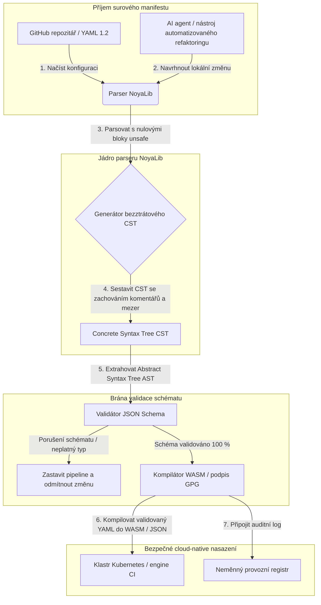

---

# Front Matter (YAML)

author: "contact@sebastienrousseau.com (Sebastien Rousseau)"
banner_alt: "Architektonická geometrie pod dramatickým světlem — symbolizuje roli NoyaLib jako nosného bezpečného Rust YAML parseru pod CI, Kubernetes, MCP a konfigurací finančních služeb"
banner_height: "1597"
banner_width: "2584"
banner: "https://cloudcdn.pro/stocks/images/ken-cheung-KonWFWUaAuk.webp"
cdn: "https://cloudcdn.pro"
charset: "UTF-8"
cname: "sebastienrousseau.com"
copyright: "© Copyright 2025 - 2026 - Sebastien Rousseau. All rights reserved."
date: "June 18, 2026"
description: "NoyaLib — zero-unsafe Rust YAML 1.2 parser se 406/406 shodou se specifikací, validací JSON Schema, ztrátovým CST a vazbami MCP/WASM."
format-detection: "telephone=no"
hreflang: "cs"
icon: "https://cloudcdn.pro/clients/sebastienrousseau/v1/logos/sebastienrousseau.svg"
id: "https://sebastienrousseau.com/2026-06-18-noyalib-safe-yaml-rust-ai-mcp-financial-infrastructure-2026"
image_alt: "Černobílý portrét Sebastiena Rousseaua"
image_height: "162"
image_width: "162"
image: "https://cloudcdn.pro/stocks/images/sebastien-rousseau.png"
keywords: "bezpečnější Rust YAML parser, NoyaLib, shoda se specifikací YAML 1.2, zero-unsafe Rust, validace JSON Schema, bezztrátový Concrete Syntax Tree, CST, MCP, Model Context Protocol, WebAssembly, manifesty Kubernetes, konfigurace CI/CD, DORA článek 5, BCBS 239, provozní riziko Basel III, finanční infrastruktura, bezpečnost konfigurace, dodavatelský řetězec softwaru"
language: "cs-CZ"
last_reviewed: "2026-06-18"
layout: "report"
locale: "cs_CZ"
logo_alt: "Logo Sebastiena Rousseaua"
logo_height: "44"
logo_width: "44"
logo: "https://cloudcdn.pro/clients/sebastienrousseau/v1/logos/sebastienrousseau.svg"
menu: ""
measurementID: "G-169G4ET5HQ"
name: "Sebastien Rousseau"
permalink: "https://sebastienrousseau.com/2026-06-18-noyalib-safe-yaml-rust-ai-mcp-financial-infrastructure-2026"
rating: "general"
referrer: "no-referrer"
robots: "index, follow"
schema: "FAQPage, Article"
seo_title: "Bezpečnější Rust YAML parser pro AI, MCP a finance"
short_name: "sebastienrousseau"
subtitle: "Bezpečnější Rust YAML stack — NoyaLib — mění YAML 1.2 z pohodlného značkování na kryptograficky zabezpečenou, se specifikací plně sladěnou konfigurační řídicí rovinu pro AI agenty, MCP, Kubernetes a infrastrukturu finančních služeb."
tags: "bezpečnější Rust YAML parser, NoyaLib, YAML 1.2, zero-unsafe Rust, JSON Schema, MCP, WebAssembly, Kubernetes, DORA, BCBS 239, Basel III, finanční infrastruktura, bezpečnost dodavatelského řetězce"
theme-color: "0, 83, 191"
title: "Proč YAML potřebuje bezpečnější Rust stack pro AI, MCP a finanční infrastrukturu v roce 2026"
url: "https://sebastienrousseau.com/2026-06-18-noyalib-safe-yaml-rust-ai-mcp-financial-infrastructure-2026"
viewport: "width=device-width, initial-scale=1, shrink-to-fit=no"

# RSS - The RSS feed front matter (YAML).
atom_link: "https://sebastienrousseau.com/2026-06-18-noyalib-safe-yaml-rust-ai-mcp-financial-infrastructure-2026/rss.xml"
category: "Technology"
docs: https://validator.w3.org/feed/docs/rss2.html
generator: "Static Site Generator (SSG) (version 0.0.26)"
item_description: "NoyaLib — zero-unsafe Rust YAML 1.2 parser se 406/406 shodou se specifikací, validací JSON Schema, ztrátovým CST a vazbami MCP/WASM."
item_guid: "https://sebastienrousseau.com/2026-06-18-noyalib-safe-yaml-rust-ai-mcp-financial-infrastructure-2026/rss.xml"
item_link: "https://sebastienrousseau.com/2026-06-18-noyalib-safe-yaml-rust-ai-mcp-financial-infrastructure-2026/rss.xml"
item_pub_date: "Thu, 18 Jun 2026 06:06:06 +0000"
item_title: "Proč YAML potřebuje bezpečnější Rust stack pro AI, MCP a finanční infrastrukturu v roce 2026"
last_build_date: "Thu, 18 Jun 2026 06:06:06 +0000"
managing_editor: "contact@sebastienrousseau.com (Sebastien Rousseau)"
pub_date: "Thu, 18 Jun 2026 06:06:06 +0000"
ttl: "60"
type: "article"
webmaster: "contact@sebastienrousseau.com"

# Apple - The Apple front matter (YAML).
apple_mobile_web_app_orientations: "portrait"
apple_touch_icon_sizes: "192x192"
apple-mobile-web-app-capable: "yes"
apple-mobile-web-app-status-bar-inset: "black"
apple-mobile-web-app-status-bar-style: "black-translucent"
apple-mobile-web-app-title: "Bezpečnější Rust YAML parser"
apple-touch-fullscreen: "yes"

# MS Application - The MS Application front matter (YAML).

msapplication-navbutton-color: "0, 83, 191"

# Twitter Card - The Twitter Card front matter (YAML).

twitter_card: "summary_large_image"
twitter_creator: "@wwdseb"
twitter_description: "NoyaLib — zero-unsafe Rust YAML 1.2 parser se 406/406 shodou se specifikací, validací JSON Schema, ztrátovým CST a vazbami MCP/WASM."
twitter_image: "https://cloudcdn.pro/clients/sebastienrousseau/v1/logos/sebastienrousseau.svg"
twitter_image_alt: "Logo Sebastiena Rousseaua"
twitter_site: "@wwdseb"
twitter_title: "Bezpečnější Rust YAML parser pro AI, MCP a finance"
twitter_url: "https://sebastienrousseau.com/2026-06-18-noyalib-safe-yaml-rust-ai-mcp-financial-infrastructure-2026"

excerpt: "NoyaLib je bezpečnější Rust YAML stack — bez bloků unsafe, 406/406 shoda se specifikací YAML 1.2, bezztrátový Concrete Syntax Tree, validace JSON Schema (Draft 2020-12) a vazby MCP/WASM — navržený pro AI agenty, Kubernetes, CI/CD a konfigurační řídicí rovinu za finanční infrastrukturou."

# Humans.txt - The Humans.txt front matter (YAML).
author_website: "https://sebastienrousseau.com"
author_twitter: "@wwdseb"
author_location: "London, UK"
thanks: "Děkujeme za přečtení!"
site_last_updated: "2026-06-18"
site_standards: "HTML5, CSS3, RSS, Atom, JSON, XML, YAML, Markdown, TOML"
site_components: "Kaishi, Kaishi Builder, Kaishi CLI, Kaishi Templates, Kaishi Themes"
site_software: "Static Site Generator, Rust"

---

# Proč YAML potřebuje bezpečnější Rust stack pro AI, MCP a finanční infrastrukturu v roce 2026

Bezpečnější Rust YAML stack je důležitý proto, že YAML dnes nese pipeline CI/CD, manifesty Kubernetes, pravidla [Open Policy Agent](https://www.openpolicyagent.org/) a registry nástrojů Model Context Protocol (MCP) — a jediný nejednoznačný parse může rozbít zúčtovací systém, špatně nastavit bezpečnostní skupinu nebo předat lokálnímu AI agentovi nesprávná oprávnění. [NoyaLib](https://github.com/sebastienrousseau/noyalib) je čistě rustový, zero-unsafe ekosystém pro parsování a validaci [YAML 1.2](https://yaml.org/spec/1.2.2/), navržený tak, aby tuto infrastrukturu standardně zabezpečil.

## Rychlá odpověď

**Co je NoyaLib jednou větou?** NoyaLib je open-source, čistě rustový parser a validační ekosystém pro YAML 1.2 s nulovým `unsafe` kódem, 100% shodou se specifikací napříč oficiální 406testovou sadou YAML, bezztrátovým Concrete Syntax Tree a real-time validací [JSON Schema](https://json-schema.org/) — navržený tak, aby konfigurace pro AI agenty, MCP, Kubernetes a finanční infrastrukturu byly standardně bezpečné.

## Shrnutí pro představenstvo

YAML vypadá nenápadně, dokud nejednoznačný parse nebo porušení schématu nerozbije produkční zúčtovací systém za miliardy dolarů. V roce 2026 je YAML de facto standardem pro pipeline [CI/CD](https://docs.github.com/en/actions/learn-github-actions/workflow-syntax-for-github-actions), manifesty [Kubernetes](https://kubernetes.io/docs/concepts/configuration/overview/), pravidla [Open Policy Agent](https://www.openpolicyagent.org/) a registry nástrojů Model Context Protocol (MCP). Neprůhledné starší parsery — s paměťovými zranitelnostmi a destruktivním parsováním — představují nepřijatelné bezpečnostní riziko. NoyaLib je čistě rustový, zero-unsafe ekosystém YAML 1.2: 100% shoda se specifikací napříč všemi 406 oficiálními testy, bezztrátový Concrete Syntax Tree (CST), který zachovává komentáře a mezery, a vestavěná validace JSON Schema. Výsledkem je YAML přepracovaný na auditovatelnou, bezpečnou a pro agenty přístupnou konfigurační řídicí rovinu.

## Klíčové závěry

- **Konfigurace je produkční kód.** Jediný špatně utvořený soubor YAML může chybně nastavit cloud-native bezpečnostní skupiny nebo oprávnění AI agenta. NoyaLib zachází s YAML jako s kritickou infrastrukturou.
- **Zero-unsafe návrh.** NoyaLib je postavena výhradně v bezpečném Rustu s nulovými bloky `unsafe` a eliminuje zranitelnosti paměťové bezpečnosti — přetečení bufferu, vzdálené spuštění kódu — v jádrových vrstvách parsování.
- **Absolutní shoda se specifikací 406/406.** Matematicky validuje strukturu konfigurací, eliminuje rozdíly v parsování a strukturální drift mezi staging a produkčním prostředím.
- **Bezztrátový Concrete Syntax Tree.** Na rozdíl od starších parserů, které zahazují komentáře a formátování, NoyaLib zachovává mezery i poznámky a umožňuje bezpečný, round-trip automatizovaný refaktoring AI agenty.
- **Fiduciární hodnota na úrovni představenstva.** Propojuje integritu konfigurace s [článkem 5 DORA](https://eur-lex.europa.eu/legal-content/EN/TXT/?uri=CELEX%3A32022R2554) a metrikami kapitálu pro provozní riziko podle [Basel III](https://www.bis.org/bcbs/publ/d424.htm), čímž přímo chrání vrcholový management před osobní odpovědností.

**Doporučené čtení:** [KyberLib a migrace bankovnictví na postkvantovou kryptografii v roce 2026: od standardů ke kódu](https://sebastienrousseau.com/2026-06-12-kyberlib-post-quantum-banking-migration-standards-code-2026/), [Index cloud-native bankovnictví v roce 2026: DORA, platformové inženýrství, suverénní cloud a provozní odolnost](https://sebastienrousseau.com/2026-06-05-cloud-native-banking-index-dora-resilience-platform-engineering-2026/), [AI-aware dotfiles v roce 2026: budování bezpečné a reprodukovatelné vývojářské stanice pro MCP, SLSA a multi-shell paritu](https://sebastienrousseau.com/2026-06-16-ai-aware-dotfiles-secure-reproducible-workstation-2026/).

## 01. Proč na bezpečnějším Rust YAML stacku v roce 2026 záleží

V červnu 2026 jsou podnikové IT infrastruktury vysoce distribuované a stále více automatizované.

YAML se nenápadně stal nosným konfiguračním jazykem celého softwarově-inženýrského stacku. Nese workflow kontinuální integrace (CI), které kompilují produkční artefakty, manifesty [Kubernetes](https://kubernetes.io/docs/concepts/overview/), které orchestrují globální cloud-native klastry, i schémata serverů [Model Context Protocol](https://modelcontextprotocol.io/) (MCP), která udělují lokálním AI agentům oprávnění provádět lokální operace.

Starší parsery YAML — [PyYAML](https://pyyaml.org/), [yaml-cpp](https://github.com/jbeder/yaml-cpp), [libyaml](https://github.com/yaml/libyaml) — nesou dvě strukturální rizika:

1. **Zranitelnosti typové koerce (problém „Norway").** Starší parsery často převádějí necitované řetězce (kód země `NO` na booleovskou `false`, podobně i `yes`/`no`) — viz [boolean tag YAML 1.1 vs 1.2](https://yaml.org/type/bool.html) — což způsobuje kritická selhání systémů nebo tichá bezpečnostní pochybení.
2. **Exploity paměťové bezpečnosti.** Neprůhledné parsery psané v C/C++ trpí úniky paměti a přetečením bufferů, což může vést ke vzdálenému spuštění kódu (RCE) na klíčových build serverech.

[NoyaLib](https://github.com/sebastienrousseau/noyalib) tyto problémy řeší. Je to čistě rustový, zero-unsafe ekosystém pro parsování a validaci YAML 1.2. Dosažením absolutní shody se specifikací 406/406 a vynucováním přísné validace JSON Schema přímo během parsování poskytuje NoyaLib vysokou **Return on Resilience (RoR)** — předchází výpadkům způsobeným konfigurací a zabezpečuje softwarové dodavatelské řetězce úrovně finančního provozu.

## 02. Architektonická optika NoyaLib 2026

Ekosystém NoyaLib funguje jako bezpečný, bezztrátový konfigurační parser. Každý lokální i cloudový manifest je strukturálně validován a chráněn v nejnižší exekuční vrstvě.

### Tabulka 1: Architektonické vrstvy NoyaLib a zmírnění rizika

| Vrstva | Návrhové rozhodnutí | Proč na tom záleží | Riziko při špatném zacházení |
| ---- | ---- | ---- | ---- |
| **Vrstva parseru** | Parser kompatibilní s YAML 1.2, čistě v Rustu, s nulovými bloky `unsafe` | Eliminuje zranitelnosti paměťové bezpečnosti a přetečení bufferů v nejnižší exekuční vrstvě. | Vzdálené spuštění kódu (RCE) na klíčových build serverech. |
| **Vrstva shody** | 100% shoda napříč 406/406 oficiálními testy sady YAML 1.2 | Eliminuje rozdíly v parsování a drift typové koerce mezi staging a produkcí. | Chyby typové koerce „Norway problem" deaktivující bezpečnostní skupiny. |
| **Vrstva syntaktického stromu** | Bezztrátový Concrete Syntax Tree (CST) | Zachovává komentáře, mezery a pořadí během round-trip parsování a programového refaktoringu. | Automatizovaný AI refaktoring ničící vývojářské poznámky. |
| **Validační vrstva** | Validace [JSON Schema (Draft 2020-12)](https://json-schema.org/draft/2020-12/release-notes) během parsování | Vynucuje přísné datové modely na konfiguračních souborech ještě před tím, než se dostanou do produkčních klastrů. | Špatně utvořené konfigurační soubory spouštějící pády cloud-native klastrů. |
| **Rozhraní** | Vazby WebAssembly (WASM) a MCP | Umožňují, aby validace konfigurace běžela přímo v prohlížečích, edge uzlech a sadách lokálních agentů. | Sila nástrojů, kde validace nemůže běžet na edge zařízeních. |

## 03. Klíčové signály bezpečnosti pracovní stanice a konfigurace

Pro udržení absolutní bezpečnosti napříč vývojářským a provozním majetkem musí Chief Information Security Officers (CISO) sledovat konkrétní kvantifikovatelné metriky.

### Tabulka 2: Signály bezpečnosti pracovní stanice a konfigurace

| Signál | Metrika / provozní benchmark | Reference NIST CSF / DORA | Technická platformová implementace |
| ---- | ---- | ---- | ---- |
| **Shoda parseru** | 100% míra úspěšnosti napříč oficiální testovací sadou YAML 1.2 (406/406 testů). | [DORA článek 6](https://eur-lex.europa.eu/legal-content/EN/TXT/?uri=CELEX%3A32022R2554) (bezpečnost ICT) | Jádro parseru NoyaLib validující všechny manifesty před spuštěním CI. |
| **Profil paměťové bezpečnosti** | Nulové bloky `unsafe` Rustu uvnitř parseru a serializačních závislostí. | DORA článek 30 (dodavatelský řetězec) | Automatizované kontroly kompilátoru ([`forbid(unsafe_code)`](https://doc.rust-lang.org/reference/attributes/diagnostics.html#the-forbid-attribute)) v cargo buildech. |
| **Validace schématu** | 100 % parsovaných konfiguračních souborů ověřeno proti platným modelům [JSON Schema](https://json-schema.org/). | [NIST CSF 2.0](https://www.nist.gov/cyberframework) (PR.DS-01) | Real-time validační brána zastavující build pipeline při porušení schématu. |
| **Konfigurační drift** | Real-time detekce a obnova lokálních konfiguračních souborů do stavu verzovaného v gitu. | Return on Resilience (RoR) | Kontinuální telemetrie logující všechny modifikace lokálních souborů. |
| **Řízení přístupu agentů** | Omezená, read-only oprávnění pro lokální AI nástroje operující přes konfigurace MCP. | Řízení modelového rizika ([SR 11-7](https://www.federalreserve.gov/supervisionreg/srletters/sr1107.htm)) | Hranice MCP serveru omezující operace agentů na schválené adresáře. |

## 04. Falešná představa neprůhledného parsování konfigurací

Závažnou zranitelností v cloud-native provozu je *neprůhledné parsování* — používání parserů, které zahazují strukturální metadata (komentáře, bílé znaky, pořadí dokumentů) nebo během kompilace tiše převádějí typy. Toto chování zavádí dvě závažná bezpečnostní rizika:

1. **Destruktivní refaktoring.** Když AI kódovací asistent nebo automatizovaný refaktorovací nástroj aktualizuje deployment manifest, tradiční parsery zahodí vývojářské komentáře a formátování a zničí kontext potřebný pro lidskou revizi a forenzní analýzu po incidentu.
2. **Rozdíly v parsování.** Pokud staging prostředí používá pythonový parser a produkce běží na céčkovém parseru, drobné rozdíly v shodě se specifikací YAML 1.2 mohou způsobit, že platný staging manifest v produkci selže nebo se chová odlišně, čímž vznikají skryté bezpečnostní zranitelnosti.

**Bezztrátový Concrete Syntax Tree (CST)** od NoyaLib to řeší. Zachovává každou mezeru, komentář i řádek dokumentu během smyčky parse–serialize. Automatizovaní AI asistenti mohou upravovat, refaktorovat a commitovat konfigurační soubory při zachování 100 % lidských poznámek — absolutní auditní stopa.

## 05. Návrh ohraničené pipeline AI konfigurace

Aby se zabránilo tomu, aby se škodlivé konfigurační změny dostaly do produkce, musí organizace zavést striktně ohraničenou, schématem validovanou konfigurační pipeline.

Provozní tok níže ukazuje, jak NoyaLib parsuje surový YAML, sestavuje bezztrátový CST, validuje AST proti modelu JSON Schema a kompiluje WebAssembly vazby pro prohlížečová a edge prostředí.

## 06. Playbook pro představenstvo a fiduciární odpovědnost

Bezpečnost konfigurace a integrita softwarového dodavatelského řetězce jsou kritickými prioritami představenstva. Vrcholoví manažeři musí ke správě konfigurací přistupovat optikou fiduciární povinnosti a provozní odolnosti.

- **DORA článek 5 (odpovědnost představenstva).** Stanoví, že představenstvo nese konečnou, nedelegovatelnou odpovědnost za řízení ICT rizika instituce. Protože konfigurační soubory řídí kritické cloud-native bezpečnostní skupiny a směrovací cesty plateb, představenstvo musí ověřit, že systémy parsující tyto manifesty jsou paměťově bezpečné a plně v souladu se specifikací, aby vyhověly regulatorním auditům. ([Nařízení (EU) 2022/2554](https://eur-lex.europa.eu/legal-content/EN/TXT/?uri=CELEX%3A32022R2554))
- **BCBS 239 (agregace a reporting rizikových dat).** Vyžaduje, aby reporting rizik a metriky infrastruktury byly přesné, úplné a generované pod přísnou kontrolou datové kvality. NoyaLib podporuje BCBS 239 tím, že parsuje a validuje konfigurační soubory proti přísným schématům přímo u zdroje, čímž brání tichým únikům dat a výpadkům způsobeným špatnou konfigurací. ([Standard BCBS 239](https://www.bis.org/publ/bcbs239.htm))
- **Snížení kapitálových poplatků za provozní riziko (Basel III).** Výpadky způsobené konfigurací přímo navyšují kapitálové poplatky za provozní riziko podle Basel III a vážou kapitál rozvahy. Standardizace podnikového konfiguračního stacku na bezpečném, čistě rustovém parseru typu NoyaLib toto riziko minimalizuje, chrání kapitál i důvěru zákazníků. ([Standardy Basel III](https://www.bis.org/bcbs/publ/d424.htm))

## 07. Co to znamená podle typu banky

### Globální systémově významné banky (G-SIB)

G-SIB spravují tisíce mikroslužeb a deployment pipeline napříč více jurisdikcemi. Jejich hlavní výzvou je udržet konzistenci konfigurace a předejít bezpečnostnímu driftu napříč rozsáhlými cloud-native portfolii. Standardizace na bezpečnějším Rust YAML stacku jako NoyaLib zaručuje, že všechny manifesty Kubernetes, pipeline CI/CD a bezpečnostní politiky jsou parsovány a validovány v rámci jednotného, paměťově bezpečného rámce — což eliminuje riziko neauditovaných „snowflake" konfigurací.

### Transakční a korporátní banky

Transakční banky provozují citlivé platební brány a velkoobchodní zúčtovací infrastrukturu. Prokázání absolutní bezpečnosti kódu a konfigurace nasazené v těchto produkčních prostředích je nediskutabilní regulatorní požadavek. Integrace NoyaLib zaručuje, že softwarový dodavatelský řetězec je plně auditovaný, bezztrátový a chráněný před zranitelnostmi parsování — kontrola, která se přímo mapuje na DORA článek 6 a [PCI DSS v4.0](https://www.pcisecuritystandards.org/document_library/) sekci 6.

### Regionální a menší banky

Regionální banky musí udržovat vysoké standardy kybernetické bezpečnosti bez technologických rozpočtů ve velikosti G-SIB. Open-source rámec NoyaLib poskytuje lehké, nákladově efektivní a vysoce bezpečné Rust-friendly řešení, které menším institucím umožňuje implementovat konfigurační bezpečnost a ochranu dodavatelského řetězce na podnikové úrovni bez proprietárních licenčních poplatků.

## 08. Závěr: cestovní mapa bezpečnosti konfigurace

Vývojářské pracovní stanice a cloud-native konfigurace infrastruktury jsou kritickými řídicími rovinami softwarového dodavatelského řetězce. Připustit, aby se neauditované, nejednoznačné nebo nebezpečné konfigurační soubory dostávaly k firemním aktivům, je nepřijatelné provozní i regulatorní riziko.

K zabezpečení softwarového dodavatelského řetězce a ochraně koncových bodů před konfiguračními zranitelnostmi by měli vrcholoví technologičtí a bezpečnostní manažeři vykonat jasnou vývojovou cestovní mapu již dnes:

1. **Nařídit deklarativní konfiguraci.** Postupně ukončit ruční, neauditované úpravy konfigurací a nařídit, aby všechny manifesty byly spravovány jako verzovaný, deklarativní systém záznamů.
2. **Vynutit validaci schématu.** Vynutit přísné pre-commit hooky a skenovací nástroje k zajištění toho, aby všechny konfigurační soubory byly před nasazením validovány proti platným modelům JSON Schema.
3. **Implementovat bezztrátový round-trip.** Zajistit, aby všichni automatizovaní AI kódovací asistenti a refaktorovací nástroje používali bezztrátové parsování a zachovávaly komentáře, mezery i vývojářský kontext.
4. **Zabezpečit dodavatelský řetězec.** Zajistit, aby všechna nastavení konfigurace a parsovací nástroje byly před spuštěním kryptograficky ověřeny pomocí čistě rustových, zero-unsafe knihoven typu NoyaLib. ([Rámec SLSA](https://slsa.dev/))

## 09. Často kladené otázky

**Co je NoyaLib a proč se používá pro parsování YAML?**
NoyaLib je open-source, čistě rustový, zero-unsafe parser YAML 1.2. Dosahuje 100% shody se specifikací napříč oficiální 406testovou sadou, vynucuje přísnou validaci [JSON Schema](https://json-schema.org/) během parsování a vystavuje vazby WASM a [MCP](https://modelcontextprotocol.io/) — čímž se stává bezpečnějším Rust YAML stackem pro AI agenty, Kubernetes a finanční infrastrukturu.

**Proč je zero-unsafe návrh důležitý pro parsování konfigurací?**
Zranitelnosti paměťové bezpečnosti — přetečení bufferů, use-after-free — uvnitř starších parserů psaných v C/C++ mohou vést ke vzdálenému spuštění kódu na klíčových build serverech. Čistě rustový návrh NoyaLib s [`#![forbid(unsafe_code)]`](https://doc.rust-lang.org/reference/attributes/diagnostics.html#the-forbid-attribute) matematicky eliminuje tyto zranitelnosti v době kompilace.

**Co je bezztrátový Concrete Syntax Tree (CST) a proč na něm záleží?**
Tradiční parsery zahazují komentáře a formátování, čímž se automatizované úpravy AI agenty stávají destruktivními. Bezztrátový Concrete Syntax Tree NoyaLib zachovává každý komentář, mezeru i řádek dokumentu — takže AI asistenti mohou bezpečně upravovat a refaktorovat konfigurační soubory při zachování vývojářského kontextu, forenzní analýzy po incidentu a auditní stopy.

**Jak se NoyaLib mapuje na DORA, BCBS 239 a Basel III?**
DORA článek 5 ukládá odpovědnost za ICT riziko představenstvu; BCBS 239 vyžaduje kontroly datové kvality v reportingu rizik; Basel III zatěžuje kapitál pro provozní riziko. NoyaLib dodává schématem validovanou, paměťově bezpečnou vrstvu parsování, kterou tato nařízení vyžadují pro konfiguraci jako kód — což činí regulatorní mapování přímočarým a kapitálový poplatek za provozní riziko nižším.

## 10. Reference

- **YAML, (2026).** *Specifikace YAML 1.2*. Dostupné z: [specifikace YAML 1.2](https://yaml.org/spec/1.2.2/).
- **JSON Schema, (2026).** *Poznámky k vydání JSON Schema Draft 2020-12*. Dostupné z: [JSON Schema Draft 2020-12](https://json-schema.org/draft/2020-12/release-notes).
- **Evropský parlament a Rada Evropské unie, (2022).** *Nařízení (EU) 2022/2554 o digitální provozní odolnosti finančního sektoru (DORA)*. Brusel: Úřední věstník Evropské unie. Dostupné z: [nařízení DORA](https://eur-lex.europa.eu/legal-content/EN/TXT/?uri=CELEX%3A32022R2554).
- **Basel Committee on Banking Supervision, (2013).** *Principles for effective risk data aggregation and risk reporting (BCBS 239)*. Basel: Bank for International Settlements. Dostupné z: [standard BCBS 239](https://www.bis.org/publ/bcbs239.htm).
- **Basel Committee on Banking Supervision, (2017).** *Basel III: finalising post-crisis reforms*. Basel: Bank for International Settlements. Dostupné z: [standardy Basel III](https://www.bis.org/bcbs/publ/d424.htm).
- **Anthropic, (2025).** *Specifikace Model Context Protocol (MCP)*. Dostupné z: [Model Context Protocol](https://modelcontextprotocol.io/).
- **GitHub, (2026).** *Open-source repozitář noyalib*. Dostupné z: [repozitář NoyaLib](https://github.com/sebastienrousseau/noyalib).
