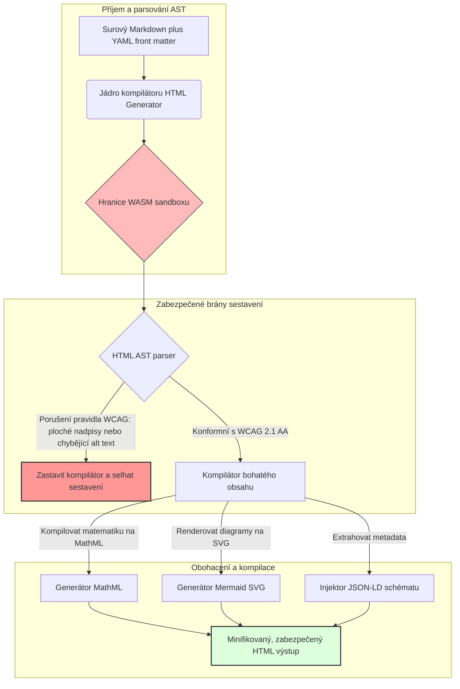

---

# Front Matter (YAML)

author: "contact@sebastienrousseau.com (Sebastien Rousseau)"
banner_alt: "Architektonická geometrie pod strukturovaným světlem — symbolizující roli HTML Generator jako kompilátorem řízeného pipeline pro převod Markdown na HTML v přístupné, SEO-ready a sandboxované publikační infrastruktuře"
banner_height: "1597"
banner_width: "2584"
banner: "https://cloudcdn.pro/stocks/images/ricardo-gomez-angel-IGPmtHvbe2g-unsplash.webp"
cdn: "https://cloudcdn.pro"
charset: "UTF-8"
cname: "sebastienrousseau.com"
copyright: "© Copyright 2025 - 2026 - Sebastien Rousseau. All rights reserved."
date: "June 20, 2026"
description: "HTML Generator je knihovna v Rustu, která převádí Markdown na WCAG-konformní, SEO-ready HTML s JSON-LD — přístupnost jako kód, podpora MathML a Mermaid a WebAssembly sandbox pro bezpečné enterprise publikování."
format-detection: "telephone=no"
hreflang: "cs"
icon: "https://cloudcdn.pro/clients/sebastienrousseau/v1/logos/sebastienrousseau.svg"
id: "https://sebastienrousseau.com/2026-06-20-html-generator-accessible-seo-structured-markdown-rust-2026"
image_alt: "Černobílý portrét Sebastiena Rousseaua"
image_height: "162"
image_width: "162"
image: "https://cloudcdn.pro/stocks/images/sebastien-rousseau.png"
keywords: "html-generator, Rust Markdown na HTML, přístupnost jako kód, WCAG 2.1 AA, SEO-ready HTML, JSON-LD, MathML, Mermaid, WebAssembly, EAA, DORA, ADA Title III, přístupné publikování, sandboxované parsování, open source"
language: "cs-CZ"
last_reviewed: "2026-06-20"
layout: "report"
locale: "cs_CZ"
logo_alt: "Logo Sebastiena Rousseaua"
logo_height: "44"
logo_width: "44"
logo: "https://cloudcdn.pro/clients/sebastienrousseau/v1/logos/sebastienrousseau.svg"
menu: ""
measurementID: "G-169G4ET5HQ"
name: "Sebastien Rousseau"
permalink: "https://sebastienrousseau.com/2026-06-20-html-generator-accessible-seo-structured-markdown-rust-2026"
rating: "general"
referrer: "no-referrer"
robots: "index, follow"
schema: "FAQPage, Article"
seo_title: "Přístupnost jako kód: Markdown na AAA HTML s Rustem v roce 2026"
short_name: "sebastienrousseau"
subtitle: "Transformace firemního webového publikování, produktové dokumentace a klientských portálů z nepřístupných textových souborů na vysoce strukturovaná, konformní a sandboxovaná digitální aktiva."
tags: "html-generator, Rust, Markdown, přístupnost, WCAG, SEO, JSON-LD, MathML, Mermaid, WebAssembly, EAA, DORA, ADA, AI-discovery, RAG, open source, bankovní infrastruktura"
theme-color: "0, 83, 191"
title: "Převod Markdown na přístupné, SEO-ready a strukturované HTML s Rustem v roce 2026"
url: "https://sebastienrousseau.com/2026-06-20-html-generator-accessible-seo-structured-markdown-rust-2026"
viewport: "width=device-width, initial-scale=1, shrink-to-fit=no"

# RSS - The RSS feed front matter (YAML).
atom_link: "https://sebastienrousseau.com/2026-06-20-html-generator-accessible-seo-structured-markdown-rust-2026/rss.xml"
category: "Technology"
docs: https://validator.w3.org/feed/docs/rss2.html
generator: "Static Site Generator (SSG) (version 0.0.40)"
item_description: "HTML Generator je knihovna v Rustu, která převádí Markdown na WCAG-konformní, SEO-ready HTML s JSON-LD — přístupnost jako kód, podpora MathML a Mermaid a WebAssembly sandbox pro bezpečné enterprise publikování."
item_guid: "https://sebastienrousseau.com/2026-06-20-html-generator-accessible-seo-structured-markdown-rust-2026/rss.xml"
item_link: "https://sebastienrousseau.com/2026-06-20-html-generator-accessible-seo-structured-markdown-rust-2026/rss.xml"
item_pub_date: "Sat, 20 Jun 2026 06:06:06 +0000"
item_title: "Převod Markdown na přístupné, SEO-ready a strukturované HTML s Rustem v roce 2026"
last_build_date: "Sat, 20 Jun 2026 06:06:06 +0000"
managing_editor: "contact@sebastienrousseau.com (Sebastien Rousseau)"
pub_date: "Sat, 20 Jun 2026 06:06:06 +0000"
ttl: "60"
type: "article"
webmaster: "contact@sebastienrousseau.com"

# Apple - The Apple front matter (YAML).
apple_mobile_web_app_orientations: "portrait"
apple_touch_icon_sizes: "192x192"
apple-mobile-web-app-capable: "yes"
apple-mobile-web-app-status-bar-inset: "black"
apple-mobile-web-app-status-bar-style: "black-translucent"
apple-mobile-web-app-title: "Markdown na AAA HTML s Rustem"
apple-touch-fullscreen: "yes"

# MS Application - The MS Application front matter (YAML).

msapplication-navbutton-color: "0, 83, 191"

# Twitter Card - The Twitter Card front matter (YAML).

twitter_card: "summary_large_image"
twitter_creator: "@wwdseb"
twitter_description: "HTML Generator je knihovna v Rustu, která převádí Markdown na WCAG-konformní, SEO-ready HTML s JSON-LD — přístupnost jako kód, podpora MathML a Mermaid a WebAssembly sandbox pro bezpečné enterprise publikování."
twitter_image: "https://cloudcdn.pro/clients/sebastienrousseau/v1/logos/sebastienrousseau.svg"
twitter_image_alt: "Logo Sebastiena Rousseaua"
twitter_site: "@wwdseb"
twitter_title: "Přístupnost jako kód: Markdown na AAA HTML s Rustem"
twitter_url: "https://sebastienrousseau.com/2026-06-20-html-generator-accessible-seo-structured-markdown-rust-2026"

# Humans.txt - The Humans.txt front matter (YAML).
author_website: "https://sebastienrousseau.com"
author_twitter: "@wwdseb"
author_location: "London, UK"
thanks: "Děkujeme za přečtení!"
site_last_updated: "2026-06-20"
site_standards: "HTML5, CSS3, RSS, Atom, JSON, XML, YAML, Markdown, TOML"
site_components: "Kaishi, Kaishi Builder, Kaishi CLI, Kaishi Templates, Kaishi Themes"
site_software: "Static Site Generator, Rust"

---

# Převod Markdown na přístupné, SEO-ready a strukturované HTML s Rustem v roce 2026

<!-- lead-start -->
<aside class="post-lead" aria-label="Shrnutí článku">

<strong>TL;DR.</strong> HTML Generator je čistě-rustový kompilátor Markdown na HTML, který vynucuje WCAG 2.1 AA již při sestavení, vkládá JSON-LD v souladu se schématy, nativně renderuje MathML a Mermaid SVG a izoluje parsování uvnitř WebAssembly sandboxu — čímž mění publikování v kompilátorem řízený řídicí systém pro přístupnost, SEO a bezpečnost ICT.

<strong>Klíčové poznatky</strong>

<ul class="post-lead-takeaways">
  <li><strong>Stručná odpověď.</strong> Co je HTML Generator v jedné větě?</li>
  <li><strong>Shrnutí pro vedení.</strong> Renderování Markdown vypadá triviálně; dosáhnout HTML vhodného pro profesionální publikování je problém souladu s předpisy.</li>
  <li><strong>01. Proč záleží na kompilátoru HTML zaměřeném na přístupnost v roce 2026.</strong> EAA a ADA Title III posunuly přístupnost z technické hygieny na fiduciární odpovědnost.</li>
  <li><strong>02. Architektura HTML Generator v roce 2026.</strong> Vícestupňový, kompilátorem řízený pipeline od surového Markdown po zabezpečený HTML výstup.</li>
</ul>

<strong>Související čtení:</strong> <a href="https://sebastienrousseau.com/2026-06-18-noyalib-safe-yaml-rust-ai-mcp-financial-infrastructure-2026">Proč YAML potřebuje bezpečnější Rust stack pro AI, MCP a finanční infrastrukturu v roce 2026</a>, <a href="https://sebastienrousseau.com/2026-06-17-static-site-generator-secure-default-ai-era-publishing-2026">Bezpečný Static Site Generator pro publikování v éře AI v roce 2026</a>, <a href="https://sebastienrousseau.com/2026-06-11-cloudcdn-open-source-blueprint-ai-native-edge-2026">CloudCDN: Open-source plán pro AI-nativní edge v roce 2026</a>.

</aside>
<!-- lead-end -->

V roce 2026 spotřebovávají webový obsah stejnou měrou AI vyhledávací crawlery, vyhledávací nástroje s LLM a Retrieval-Augmented Generation (RAG) pipeline jako lidští čtenáři. Plochý nebo chybně sestavený HTML komplikuje strojové vyhledávání, zatímco nesplnění přísných globálních předpisů, jako jsou [Evropský akt o přístupnosti (EAA)](https://www.accessibility-act.eu/) a [americký ADA Title III](https://www.ada.gov/topics/title-iii/), představuje dnes jednoznačnou občanskoprávní odpovědnost. [HTML Generator](https://github.com/sebastienrousseau/html-generator) je vysokovýkonná Rust knihovna navržená k odstranění těchto nedostatků — na úrovni kompilátoru, nikoli v záplatkách po nasazení.

## Stručná odpověď

**Co je HTML Generator v jedné větě?** HTML Generator je open-source, čistě-rustový kompilátor Markdown na HTML, který vynucuje [WCAG 2.1 AA](https://www.w3.org/TR/WCAG21/) při sestavení, automaticky generuje sémantické orientační body a ARIA atributy, vkládá schéma-konformní [JSON-LD](https://json-ld.org/) metadata z YAML front matter, renderuje Mermaid diagramy a matematické výrazy na přístupné SVG a MathML a funguje uvnitř [WebAssembly](https://webassembly.org/) sandboxu — čímž mění firemní publikování v kompilátorem řízený řídicí systém s fiduciárním standardem.

## Shrnutí pro vedení

Renderování Markdown vypadá triviálně. HTML vhodné pro profesionální publikování je problém souladu s předpisy. V červnu 2026 každý firemní bod kontaktu — portály pro investory, regulatorní výkazy, zákaznická dokumentace, reference API, marketingové weby — parsují jak lidé, tak stroje. Každou stránku svírají dva tlaky: [EAA](https://www.accessibility-act.eu/) a [ADA Title III](https://www.ada.gov/topics/title-iii/) mění přístupnost v právní expozici na úrovni představenstva, zatímco AI zpracování a RAG pipeline odměňují strukturovaný, strojově čitelný výstup. Standardní Markdown knihovny produkují plochý HTML, který selže na obou branách. HTML Generator přistupuje ke generování dokumentů jako ke kompilátorem řízenému pipeline: validace WCAG je chybou sestavení, JSON-LD pochází z YAML front matter bez ručního označování, MathML a Mermaid se renderují přístupně a celý engine je dodáván jako WebAssembly cíl, takže parsování nedůvěryhodných dokumentů zůstává v sandboxu odděleném od hostitele.

## Klíčové poznatky

- **Přístupnost jako kód je novým standardem.** EAA ukládá přístupnost pro spotřebitelské digitální služby. HTML Generator vyhodnocuje strom dokumentu při kompilaci, automaticky generuje sémantické orientační body a ARIA atributy — méně oprav po nasazení, méně rozpočtů na nápravu, žádný chybějící alt text v produkci.
- **Strukturovaná data pro AI vyhledávání.** Moderní vyhledávání a RAG závisí na strojově čitelných metadatech. Kompilátor parsuje YAML front matter a vkládá [JSON-LD v souladu se Schema.org](https://schema.org/) přímo do hlavičky dokumentu, čímž obsah zpřístupňuje pro [Google Rich Results](https://developers.google.com/search/docs/appearance/structured-data/intro-structured-data), [Bing Webmaster](https://www.bing.com/webmasters) a LLM crawlery.
- **Excelence technického obsahu.** Technické publikování není plochý text. HTML Generator kompiluje rozšíření Markdown pro matematiku na přístupné [MathML](https://www.w3.org/Math/) a renderuje diagramy [Mermaid.js](https://mermaid.js.org/) na responzivní SVG — obojí zachovává WCAG-konformní strukturu místo použití neprůhledných obrázků.
- **Sandboxování přes WebAssembly.** Parsování nedůvěryhodného Markdown je bezpečnostní riziko. Nasměrováním na [WASM](https://webassembly.org/) se HTML Generator spouští uvnitř izolovaného sandboxu, který brání spuštění libovolného kódu a chrání hostitelský systém — což přímo naplňuje povinnosti v oblasti bezpečnosti ICT podle [DORA Article 6](https://eur-lex.europa.eu/legal-content/EN/TXT/?uri=CELEX%3A32022R2554).
- **Fiduciární ochrana pro představenstvo.** Technická nesoulad s předpisy se přesunul do zasedacích místností. Standardizace na kompilátorem řízeném HTML engine chrání ředitele a vrcholový management před osobní občanskoprávní a regulatorní expozicí podle DORA, EAA a ADA Title III.

**Související čtení:** [Proč YAML potřebuje bezpečnější Rust stack pro AI, MCP a finanční infrastrukturu v roce 2026](https://sebastienrousseau.com/2026-06-18-noyalib-safe-yaml-rust-ai-mcp-financial-infrastructure-2026/), [Bezpečný Static Site Generator pro publikování v éře AI v roce 2026](https://sebastienrousseau.com/2026-06-17-static-site-generator-secure-default-ai-era-publishing-2026/), [CloudCDN: Open-source plán pro AI-nativní edge v roce 2026](https://sebastienrousseau.com/2026-06-11-cloudcdn-open-source-blueprint-ai-native-edge-2026/).

## 01. Proč záleží na kompilátoru HTML zaměřeném na přístupnost v roce 2026

Firemní webové prostředí, knihovny dokumentace a střediska nápovědy k produktům jsou klíčovými digitálními body kontaktu. Dnes jsou vystaveny dvěma intenzivním, vzájemně se prolínajícím tlakům.

Prvním je **AI zpracování a vyhledatelnost**. Obsah stále více zpracovávají velké jazykové modely a Retrieval-Augmented Generation pipeline. Plochý nebo chybně sestavený HTML mate parsování crawlerů, čímž firemní výzkum a dokumentace zůstávají neviditelné pro moderní vyhledávací paradigmata — včetně [Google Search Generative Experience](https://blog.google/products/search/generative-ai-search/), prohlížení [ChatGPT](https://chat.openai.com/) a enterprise RAG agentů.

Druhým je **přísná globální legislativa o přístupnosti**. Podle [Evropského aktu o přístupnosti](https://www.accessibility-act.eu/) (plně platného od června 2025) a [amerického ADA Title III](https://www.ada.gov/topics/title-iii/) musí firemní publikační platformy zaručovat úplnou digitální přístupnost. Nesplnění [WCAG 2.1 AA](https://www.w3.org/TR/WCAG21/) již není technickým pochybením; je to občanskoprávní a regulatorní odpovědnost, která vyústila v víceciferné milionové dolarové vypořádání.

[HTML Generator](https://github.com/sebastienrousseau/html-generator) se oběma tlakům věnuje přímo. Jde o vlákno-bezpečnou Rust knihovnu navrženou pro transformaci Markdown na přístupný, SEO-ready a strukturovaný HTML. Tím, že zachází s generováním dokumentů jako s kompilátorem řízeným pipeline, dosahuje engine vysoké **návratnosti odolnosti (RoR)** — chrání bilance před soudními spory o přístupnost a maximalizuje strojovou čitelnost pro AI vyhledávání.

## 02. Architektura HTML Generator v roce 2026

Framework je navržen jako zabezpečený vícestupňový kompilační pipeline, který převádí surový Markdown text na kryptograficky ověřená, vysoce přístupná statická aktiva.

### Tabulka 1: Vrstvy architektury HTML Generator a zmírnění rizik

| Vrstva | Projektové rozhodnutí | Proč je to důležité | Riziko při nesprávné správě |
| ---- | ---- | ---- | ---- |
| **Vstupní vrstva** | Parser Markdown plus YAML front matter | Oslovuje autory tam, kde jsou; odděluje prózu od strukturálních metadat. | Nekonzistentní metadata, nefunkční sitemaps, mezery v indexaci. |
| **Strukturní vrstva** | Automatizovaný obsah a sémantické orientační body s ARIA tagy | Konstrukčně vytváří přístupné, navigovatelné stromy dokumentů. | Plochý HTML, který poruší čtečky obrazovky a poruší WCAG. |
| **Vrstva bohatého obsahu** | Nativní renderování MathML a Mermaid.js SVG | Kompiluje vzorce a diagramy na přístupné SVG a MathML. | Prodleva při renderování JS na straně klienta a porucha výstupu pro asistivní technologie. |
| **Vrstva SEO a dat** | Integrované generování JSON-LD a strukturovaných metadat | Vkládá [Schema.org](https://schema.org/) konformní JSON-LD přímo do hlavičky. | Vyhledávací nástroje a AI crawlery špatně čtou autora, kontext, licencování. |
| **Běhová vrstva** | Nativní Rust kompilátor s WebAssembly cílem | Umožňuje bezpečné, sandboxované spouštění na serverech, edge uzlech a prohlížečích. | Spuštění libovolného kódu při parsování nedůvěryhodného Markdown. |

## 03. Klíčové signály webové bezpečnosti a přístupnosti

Aby vrcholoví technologičtí manažeři ověřili, že veřejně přístupná publikační aktiva splňují moderní regulatorní a bezpečnostní audity, musí sledovat konkrétní, kvantifikovatelné metriky.

### Tabulka 2: Signály webové bezpečnosti a přístupnosti

| Signál | Metrika / provozní benchmark | Reference EAA / DORA / W3C | Technická implementace |
| ---- | ---- | ---- | ---- |
| **Shoda s přístupností** | 100 % kompilovaných stránek validováno podle pravidel WCAG 2.1 AA. | [EAA](https://www.accessibility-act.eu/) a [ADA Title III](https://www.ada.gov/topics/title-iii/) | HTML parser při sestavení vyhodnocující alt tagy obrázků a sémantické orientační body. |
| **Sandbox pro WASM spouštění** | 100 % nedůvěryhodných Markdown vstupů kompilováno v izolovaném WebAssembly runtime. | [DORA Article 6](https://eur-lex.europa.eu/legal-content/EN/TXT/?uri=CELEX%3A32022R2554) (bezpečnost ICT) | Izolace parsovacího prostředí od hostitelského serveru. |
| **Pokrytí strukturovanými metadaty** | 100 % publikovaných článků vloženo s platnými, schéma-konformními JSON-LD hlavičkami. | Specifikace [Schema.org](https://schema.org/) | Automatické parsování front matter a konverze na JSON-LD objekty. |
| **Propustnost kompilace** | Cíl stránek za sekundu nad 10 000 na běžném hardwaru. | Návratnost odolnosti (RoR) | Vysoce paralelizovaný Rust AST kompilátor. |
| **Ověření rich snippetů** | Nulové chyby parsování při spuštění [Google Rich Results](https://search.google.com/test/rich-results) a [Schema validator](https://validator.schema.org/). | Pokyny Google Search | Strukturální validace generovaného JSON-LD během pipeline sestavení. |

## 04. Mýtus jednoduchého renderování Markdown

Častou mylnou představou mezi technologickými manažery je, že konverze Markdown na HTML je jednoduché textové nahrazování. Mnoho standardních knihoven překládá formátování Markdown do plochého, nestrukturovaného HTML. Výstup se sice vykreslí vidoucímu čtenáři v prohlížeči, ale představuje regulatorní past.

Plochý HTML typicky postrádá tři věci.

1. **Správné hierarchie nadpisů.** Standardní Markdown nevynucuje pořadí nadpisů. Přechod z `<h1>` na `<h4>` porušuje WCAG 2.1 AA a ruší navigaci v dokumentu pro čtečky obrazovky.
2. **Explicitní sémantiku tabulek.** Standardní Markdown tabulky jsou zřídka renderovány se správnými atributy scope pro `<th>` a `<tbody>` požadovanými pro přístupné parsování.
3. **Strojově čitelná metadata.** Standardní HTML postrádá JSON-LD háčky, na kterých závisí moderní AI vyhledávací platformy a RAG systémy pro příjem dat.

HTML Generator to řeší parsováním Markdown do **abstraktního syntaktického stromu (AST)**. Engine vyhodnocuje strukturu dokumentu před emisí HTML, validuje vnořování nadpisů, vkládá vhodné ARIA atributy a ověřuje, že každý mediální prostředek nese alternativní text — čímž mění přístupnost z manuálního auditu v garantovaný invariant při kompilaci.

## 05. Návrh pipeline pro sestavení s přístupností jako kódem

Aby se zabránilo tomu, aby se nepřístupná nebo neindexovaná aktiva kdy dostala do veřejného nasazení, musí být přístupnost přísnou kompilátorovou branou. Následující pipeline ukazuje, jak HTML Generator vyhodnocuje Markdown, spouští WebAssembly-izolovanou validaci a emituje zabezpečený, strukturovaný HTML.

## 06. Příručka pro představenstvo a fiduciární odpovědnost

Moderní soulad s přístupností a bezpečností webu jsou pro zasedací místnosti nepopiratelné otázky. Vrcholový management musí přistupovat k publikační infrastruktuře optikou právního rizika, ochrany financí a regulatorní expozice.

- **Evropský akt o přístupnosti (EAA).** Ukládá přímé, právně závazné mandáty pro veřejné i soukromé digitální portály. Nesoulad může přinést závažné finanční sankce, občanskoprávní soudní spory a okamžité stažení aktiva z trhu EU. Integrací přístupnosti jako kódu mohou představenstva certifikovat, že nesoulad s předpisy nemůže být dodán — čímž se reaktivní náprava mění ve strukturální právní štít.
- **DORA Article 6 (Bezpečná prostředí ICT).** Stanovuje přísná pravidla pro bezpečnost prostředí ICT. Izolací kompilace Markdown uvnitř WebAssembly sandboxu organizace zajišťují, že parsování dokumentace nahrané zákazníky nebo partnerských feedů nemůže vystavit hostitelské servery spuštění libovolného kódu, čímž chrání kritické bankovní portály.
- **Snížení nákladů na audity souladu.** Tradiční soulad s přístupností se opírá o drahé, retrospektivní audity po nasazení — desítky tisíc dolarů ročně na web. Implementace validace WCAG jako bloku při kompilaci tyto retrospektivní náklady eliminuje a přesouvá rozpočet na soulad s předpisy od obrany k inovaci.

## 07. Co to znamená podle typu banky / podniku

### Globálně systémově důležité banky (G-SIBs)

G-SIBs provozují masivní vícejazyčné veřejné prostředí, které publikuje tisíce výzkumných prací, regulatorních zveřejnění a dokumentů pro vztahy s investory napříč mnoha jurisdikcemi. Jejich výzvou je rozsah a multijazyčná parita. WebAssembly cíl HTML Generator a vysokovýkonný Rust engine umožňují aktualizaci, kompilaci a globální nasazení rozsáhlých lokalizovaných výzkumných knihoven během sekund — bez prodlevy renderování nebo regrese přístupnosti.

### Transakční a korporátní banky

Pro transakční banky jsou zákaznické portály, dokumentační centra a vývojářské API průvodce klíčovými digitálními body kontaktu. Kompilace těchto aktiv přes HTML Generator znamená, že klientské komunikační kanály nenesou žádnou XSS expozici, žádné vektory únosu závislostí a žádné deficity přístupnosti — čímž se zachovává institucionální důvěra a snižuje se povrch pro soudní spory.

### Regionální banky a fintech společnosti

Regionální banky a agilní fintechové soutěží o digitální zkušenost bez G-SIB inženýrských rozpočtů. HTML Generator dává těmto týmům enterprise-grade publikační pipeline hned po vybalení, což menším subjektům umožňuje dodat přístupná, SEO-ready a sandboxovaná aktiva, která obstojí jak před regulátory, tak před potenciálními firemními klienty.

## 08. Plán pro publikační infrastrukturu

Veřejně přístupné firemní webové prostředí je klíčovou součástí provozní odolnosti. Spoléhat na pomalé, dynamicky zranitelné, databázové webové enginy — nebo na nepodepsaná statická aktiva — je nepřijatelným obchodním rizikem.

Pro zabezpečení veřejných digitálních bodů kontaktu a ochranu bilancí před soudními spory o přístupnost by vrcholoví technologičtí a bezpečnostní manažeři měli realizovat jasný plán.

1. **Přechod na statické architektury.** Vyřadit starší dynamické CMS platformy pro výzkumné, marketingové a dokumentační prostředí. Přesunout obsah do kompilátorem řízených pipeline jako HTML Generator.
2. **Vynucovat přístupnost při sestavení.** Implementovat přístupnost jako kód. Automaticky selhat kompilační pipeline při jakémkoliv porušení WCAG 2.1 AA.
3. **Izolovat parsování ve WebAssembly.** Sandboxovat veškeré parsování dokumentů a obsahu uvnitř WASM runtime, aby nedůvěryhodný vstup nikdy nezasáhl hostitelské systémy.
4. **Vkládat bohatá JSON-LD metadata.** Zajistit, aby každé publikované aktivum neslo schéma-konformní JSON-LD hlavičky pro maximalizaci vyhledatelnosti pro AI.

## 09. Nejčastěji kladené otázky

**Jak HTML Generator vynucuje přístupnost?**

Parsuje generovaný HTML abstraktní syntaktický strom při sestavení a vyhodnocuje dokument oproti pravidlům [WCAG 2.1 AA](https://www.w3.org/TR/WCAG21/). Pokud je pravidlo porušeno — chybějící atribut alt, přeskočení nadpisu, neoznačený ovládací prvek formuláře — kompilátor zastaví sestavení a přistupuje k přístupnosti jako ke kompilačnímu invariantu, nikoli jako k úkolu auditu po nasazení.

**Proč je izolace WebAssembly důležitá?**

[WebAssembly](https://webassembly.org/) umožňuje parsovacímu enginu Markdown spouštět se uvnitř izolovaného sandboxu, odděleného od hostitelského serveru. I když nepřátelský aktér nahraje upravený Markdown dokument navržený k zneužití zranitelností parseru, spuštění je zachyceno — čímž se chrání hostitelské systémy a splňují povinnosti bezpečnosti ICT podle DORA Article 6.

**Jak JSON-LD prospívá vyhledatelnosti v roce 2026?**

[JSON-LD](https://json-ld.org/) poskytuje strukturovaná, strojově čitelná metadata v hlavičce dokumentu. [Google Rich Results](https://developers.google.com/search/docs/appearance/structured-data/intro-structured-data), crawlery Bing a LLM vyhledávací agenti okamžitě identifikují autora, licenci, datum publikace a sémantický kontext — obcházejí nejednoznačnost standardního HTML a zvyšují viditelnost v AI vyhledávání.

**Pro koho je HTML Generator určen?**

Tvůrcům statických webů, dokumentačním týmům, technickým autorům, Rust vývojářům a platformním inženýrům dodávajícím prostředí kritická pro přístupnost nebo regulátory. Je také životaschopnou vrstvou pro zpracování obsahu uvnitř rozsáhlejších pipeline bezpečného publikování, jako je [Static Site Generator (SSG)](https://github.com/sebastienrousseau/static-site-generator).

## 10. Reference

- World Wide Web Consortium (W3C), 2024. [Web Content Accessibility Guidelines (WCAG) 2.1 ⧉](https://www.w3.org/TR/WCAG21/ "Web Content Accessibility Guidelines 2.1").
- Schema.org, 2026. [Specifikace strukturovaných dat Schema.org ⧉](https://schema.org/ "Specifikace strukturovaných dat Schema.org").
- Evropský parlament a Rada Evropské unie, 2022. [Nařízení (EU) 2022/2554 o digitální provozní odolnosti finančního sektoru (DORA) ⧉](https://eur-lex.europa.eu/legal-content/EN/TXT/?uri=CELEX%3A32022R2554 "Nařízení DORA").
- Evropská komise, 2025. [Evropský akt o přístupnosti ⧉](https://www.accessibility-act.eu/ "Evropský akt o přístupnosti").
- Ministerstvo spravedlnosti USA, 2024. [ADA Title III ⧉](https://www.ada.gov/topics/title-iii/ "ADA Title III").
- WebAssembly Community Group, 2026. [Specifikace WebAssembly ⧉](https://webassembly.org/ "WebAssembly").
- GitHub, 2026. [Repozitář HTML Generator ⧉](https://github.com/sebastienrousseau/html-generator "Open-source repozitář HTML Generator").

<!-- enrich-start -->
<aside class="author-card" aria-label="O autorovi"><strong class="author-card-name"><a href="/about/index.html">Sebastien Rousseau</a></strong>Vedoucí bankovní technolog píšící o aplikované AI, platební infrastruktuře, tokenizovaných penězích, ISO 20022, post-kvantové bezpečnosti, cloud-nativních finančních službách, open-source infrastruktuře a regulovaných digitálních trzích.20+ let napříč HSBC Commercial &amp; Investment Bank, PayPal, Barclays, Shazam, AKQA, Virgin Group. <a href="/about/index.html">Úplný profil</a> &middot; <a href="https://www.linkedin.com/in/sebastienrousseau/" rel="external noopener">LinkedIn</a> &middot; <a href="https://github.com/sebastienrousseau" rel="external noopener">GitHub</a></aside>

Naposledy zkontrolováno <time datetime="2026-06-20">2026-06-20</time>.

<!-- enrich-end -->
