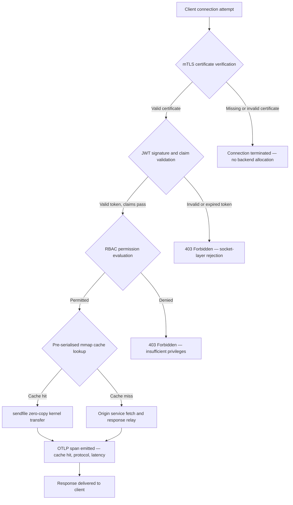

---

# Front Matter (YAML)

author: "contact@sebastienrousseau.com (Sebastien Rousseau)"
banner_alt: "Abstraktní noční panorama města z desek plošných spojů — vizualizace bankovní hrany, kde se setkávají přenosy bez kopírování na úrovni jádra, handshaky mTLS a validace JWT v jediném staticky linkovaném binárním souboru"
banner_height: "1597"
banner_width: "2584"
banner: "https://cloudcdn.pro/stocks/images/bit-cloud-GlqbGLCPnQ4.webp"
cdn: "https://cloudcdn.pro"
charset: "UTF-8"
cname: "sebastienrousseau.com"
copyright: "© Copyright 2025 - 2026 - Sebastien Rousseau. All rights reserved."
date: "June 20, 2026"
description: "http-handle je staticky linkovaný binární soubor Rust, který na bankovní hraně bez runtime závislostí doručuje 180 000 požadavků za sekundu, s integrovanou validací mTLS a JWT, ALPN-negociovaným HTTP/2 a HTTP/3 a pozorovatelností OTLP — čímž odstraňuje bezpečnostní a odolnostní mezery, které zanechávají Nginx a Envoy."
format-detection: "telephone=no"
hreflang: "cs"
icon: "https://cloudcdn.pro/clients/sebastienrousseau/v1/logos/sebastienrousseau.svg"
id: "https://sebastienrousseau.com/2026-06-20-http-handle-zero-dependency-edge-ingress-banking-rust-2026"
image_alt: "Černobílý portrét Sebastiena Rousseaua"
image_height: "162"
image_width: "162"
image: "https://cloudcdn.pro/stocks/images/sebastien-rousseau.png"
keywords: "http-handle, Rust edge ingress, proxy bez závislostí, bankovní infrastruktura, mTLS JWT, sendfile zero-copy, ALPN HTTP3, soulad s DORA, Basel III, pozorovatelnost OTLP, statický binární soubor, ARM64 bankovnictví, zero trust bankovnictví, lehký ingress, bezpečnost Rust v bankovnictví"
language: "cs-CZ"
last_reviewed: "2026-06-20"
layout: "report"
locale: "cs_CZ"
logo_alt: "Logo Sebastiena Rousseaua"
logo_height: "44"
logo_width: "44"
logo: "https://cloudcdn.pro/clients/sebastienrousseau/v1/logos/sebastienrousseau.svg"
menu: ""
measurementID: "G-169G4ET5HQ"
name: "Sebastien Rousseau"
permalink: "https://sebastienrousseau.com/2026-06-20-http-handle-zero-dependency-edge-ingress-banking-rust-2026"
rating: "general"
referrer: "no-referrer"
robots: "index, follow"
schema: "FAQPage, Article"
seo_title: "http-handle: Rust Ingress bez závislostí pro bankovnictví při 180 tis. req/s"
short_name: "sebastienrousseau"
subtitle: "Jak jediný staticky linkovaný binární soubor Rust doručuje 180 000 požadavků za sekundu s mTLS, JWT a ALPN na bankovní hraně — a co to znamená pro soulad s DORA a Basel III."
tags: "http-handle, Rust, banking, edge-ingress, mTLS, JWT, ALPN, HTTP3, DORA, Basel-III, zero-copy, sendfile, ARM64, zero-trust, OTLP, observability, open-source, infrastructure"
theme-color: "0, 83, 191"
title: "http-handle: Vysoce výkonný Edge Ingress bez závislostí pro bankovnictví v roce 2026"
url: "https://sebastienrousseau.com/2026-06-20-http-handle-zero-dependency-edge-ingress-banking-rust-2026"
viewport: "width=device-width, initial-scale=1, shrink-to-fit=no"

# RSS - The RSS feed front matter (YAML).
atom_link: "https://sebastienrousseau.com/2026-06-20-http-handle-zero-dependency-edge-ingress-banking-rust-2026/rss.xml"
category: "Technology"
docs: https://validator.w3.org/feed/docs/rss2.html
generator: "Static Site Generator (SSG) (version 0.0.40)"
item_description: "http-handle je staticky linkovaný binární soubor Rust, který na bankovní hraně bez runtime závislostí doručuje 180 000 požadavků za sekundu, s integrovanou validací mTLS a JWT, ALPN-negociovaným HTTP/2 a HTTP/3 a pozorovatelností OTLP — čímž odstraňuje bezpečnostní a odolnostní mezery, které zanechávají Nginx a Envoy."
item_guid: "https://sebastienrousseau.com/2026-06-20-http-handle-zero-dependency-edge-ingress-banking-rust-2026/rss.xml"
item_link: "https://sebastienrousseau.com/2026-06-20-http-handle-zero-dependency-edge-ingress-banking-rust-2026/rss.xml"
item_pub_date: "Sat, 20 Jun 2026 07:07:07 +0000"
item_title: "http-handle: Vysoce výkonný Edge Ingress bez závislostí pro bankovnictví v roce 2026"
last_build_date: "Sat, 20 Jun 2026 07:07:07 +0000"
managing_editor: "contact@sebastienrousseau.com (Sebastien Rousseau)"
pub_date: "Sat, 20 Jun 2026 07:07:07 +0000"
ttl: "60"
type: "article"
webmaster: "contact@sebastienrousseau.com"

# Apple - The Apple front matter (YAML).
apple_mobile_web_app_orientations: "portrait"
apple_touch_icon_sizes: "192x192"
apple-mobile-web-app-capable: "yes"
apple-mobile-web-app-status-bar-inset: "black"
apple-mobile-web-app-status-bar-style: "black-translucent"
apple-mobile-web-app-title: "Bankovní hrana bez závislostí"
apple-touch-fullscreen: "yes"

# MS Application - The MS Application front matter (YAML).

msapplication-navbutton-color: "0, 83, 191"

# Twitter Card - The Twitter Card front matter (YAML).

twitter_card: "summary_large_image"
twitter_creator: "@wwdseb"
twitter_description: "http-handle je staticky linkovaný binární soubor Rust, který na bankovní hraně bez runtime závislostí doručuje 180 000 požadavků za sekundu, s mTLS, JWT a pozorovatelností OTLP."
twitter_image: "https://cloudcdn.pro/clients/sebastienrousseau/v1/logos/sebastienrousseau.svg"
twitter_image_alt: "Logo of Sebastien Rousseau"
twitter_site: "@wwdseb"
twitter_title: "http-handle: Rust Ingress bez závislostí pro bankovnictví při 180 tis. req/s"
twitter_url: "https://sebastienrousseau.com/2026-06-20-http-handle-zero-dependency-edge-ingress-banking-rust-2026"

# Humans.txt - The Humans.txt front matter (YAML).
author_website: "https://sebastienrousseau.com"
author_twitter: "@wwdseb"
author_location: "London, UK"
thanks: "Thanks for reading!"
site_last_updated: "2026-06-20"
site_standards: "HTML5, CSS3, RSS, Atom, JSON, XML, YAML, Markdown, TOML"
site_components: "Kaishi, Kaishi Builder, Kaishi CLI, Kaishi Templates, Kaishi Themes"
site_software: "Static Site Generator, Rust"

---

# http-handle: Vysoce výkonný Edge Ingress bez závislostí pro bankovnictví v roce 2026

<!-- lead-start -->
<aside class="post-lead" aria-label="Shrnutí článku">

<strong>Stručně řečeno.</strong> http-handle je open-source, staticky linkovaný binární soubor Rust, který na bankovní hraně nahrazuje Nginx a Envoy. Na uzlech ARM64 doručuje 180 000 požadavků za sekundu prostřednictvím přenosů bez kopírování pomocí <code>sendfile(2)</code> v Linuxu, vynucuje ověření mTLS a JWT na vrstvě síťového socketu před spuštěním jakéhokoli aplikačního kódu, automaticky negociuje HTTP/2 a HTTP/3 prostřednictvím ALPN a nativně emituje metriky OpenTelemetry — vše bez runtime závislostí nad rámec <code>libc</code>.

<strong>Klíčové poznatky</strong>

<ul class="post-lead-takeaways">
  <li><strong>Problém těžkého proxy.</strong> Nginx a Envoy nesou stromy závislostí, které rozšiřují povrch CVE a komplikují cykly nápravy ICT rizik podle DORA.</li>
  <li><strong>Výkon bez kopírování ve velkém měřítku.</strong> Předserializované bloky mezipaměti mmap a přenosy jádra <code>sendfile(2)</code> udržují 180 000 req/s na ARM64 s latencí proxy pod milisekundu.</li>
  <li><strong>Zabezpečení na úrovni socketu, ne aplikace.</strong> Ověření klientského certifikátu mTLS, validace JWT a vyhodnocení RBAC se dokončí před alokací jakéhokoli backendového zdroje pro požadavek.</li>
  <li><strong>Regulační soulad je součástí návrhu.</strong> Snížený povrch útoku a auditovatelné nasazení jednoho binárního souboru přímo řeší články 5 a 6 DORA, operační riziko Basel III a řetězce odpovědnosti SM&CR.</li>
</ul>

<strong>Související čtení:</strong> <a href="https://sebastienrousseau.com/2026-06-18-noyalib-safe-yaml-rust-ai-mcp-financial-infrastructure-2026">Proč YAML potřebuje bezpečnější zásobník Rust pro AI, MCP a finanční infrastrukturu v roce 2026</a>, <a href="https://sebastienrousseau.com/2026-06-11-cloudcdn-open-source-blueprint-ai-native-edge-2026">CloudCDN: Open-source plán pro AI-nativní hranu v roce 2026</a>, <a href="https://sebastienrousseau.com/2026-05-16-best-cloud-infrastructure-architecture-2026">Nejlepší architektura cloudové infrastruktury pro banky a finanční instituce v roce 2026</a>.

</aside>
<!-- lead-end -->

Bankovní hrana má problém se závislostmi. Každá instance Nginx nebo Envoy, která směruje provoz mezi klientem a základní bankovní službou, nese strom závislostí: sestavení OpenSSL, moduly Lua, knihovny gRPC a vrstvy kontejnerů — každý potenciální CVE, každý vyžadující dedikovaný cyklus záplatování, každý přidávající variabilitu latence, která komplikuje měření SLA. V rámci [Zákona o digitální operační odolnosti (DORA)](https://eur-lex.europa.eu/eli/reg/2022/2554/oj) je tato složitost nyní stejně tak regulační závazek jako provozní.

[http-handle](https://github.com/sebastienrousseau/http-handle) volí jiný přístup. Jedná se o jediný, staticky linkovaný binární soubor Rust bez runtime závislostí nad rámec `libc`. Na uzlech ARM64 doručuje 180 000 požadavků za sekundu, vynucuje vzájemné TLS a ověřování JWT na vrstvě síťového socketu a automaticky negociuje HTTP/2 a HTTP/3 — vše v rámci nasazovací stopy pod 20 MB RAM.

## Rychlá odpověď

**Co je http-handle jednou větou?** http-handle je open-source, staticky linkovaný binární soubor Rust, který na bankovní hraně nahrazuje těžké proxy kontejnery, doručuje 180 000 req/s na ARM64 prostřednictvím přenosů jádra `sendfile(2)` bez kopírování v Linuxu, vynucuje mTLS, JWT a RBAC na vrstvě socketu před dotykem jakéhokoli backendového zdroje a emituje nativní metriky [OpenTelemetry](https://opentelemetry.io/) — bez runtime závislostí knihoven nad rámec `libc`.

## Shrnutí pro vedoucí pracovníky

Banky provozují Nginx a Envoy na svých hranách více než deset let. Oba jsou schopné; žádný nebyl navržen pro regulační prostředí roku 2026. Obrazy kontejnerů zatížené závislostmi generují fronty CVE, které compliance týmy nestíhají čistit, a každé navýšení verze knihovny nese riziko regrese. Články 5 a 6 DORA požadují, aby bylo ICT riziko řízeno designem, nikoliv záplatováno po objevení. Rámce operačního rizika Basel III penalizují architektury, kde se body selhání množství spolu se složitostí systému.

http-handle odstraňuje problém závislostí u zdroje. Binární soubor je kompilován jednou, staticky, bez požadavků na externí knihovny za běhu. Povrch útoku se smrskne na standardní knihovnu Rust plus `libc`. Vynucení zabezpečení — ověření certifikátu mTLS, validace nároku JWT a řízení přístupu na základě rolí — se spouští na síťovém socketu před jakoukoli backendovou alokací, čímž se perimetr Zero Trust smrskne na nejmenší možný výraz. Výkon plyne z architektury: předserializované bloky mezipaměti mapované do paměti v kombinaci s přenosy jádra `sendfile(2)` zcela odstraňují data z cesty kopírování CPU do paměti, přičemž na hardwaru ARM64 udržují 180 000 req/s. Výsledkem je vrstva pro příjem, která splňuje požadavky na odolnost DORA, podporuje argumenty pro snížení operačního rizika Basel III a dává vedoucím pracovníkům IT v rámci SM&CR ověřitelný, jednodílný řetězec odpovědnosti za hraniční infrastrukturu.

## Klíčové poznatky

- **Menší binární soubory, menší fronty CVE.** Staticky linkovaný jeden binární soubor má jeden balíček k záplatování, jedno vydání k validaci a jeden artefakt k auditování. Nginx se standardní sadou modulů je dodáván s více než 30 závislostmi sdílených knihoven; každá nese svůj vlastní životní cyklus zranitelnosti.
- **Přenos bez kopírování není optimalizace — je to designové omezení.** Při 180 000 req/s každá kopie dat v uživatelském prostoru zavádí měřitelnou variabilitu latence. `sendfile(2)` přenáší obsah deskriptoru souboru — nebo oblasti mapované do paměti — do deskriptoru souboru síťového socketu zcela v jádře. V kombinaci s bloky mezipaměti odpovědí přišpendlenými na mmap CPU nikdy nesáhne na datovou cestu pro odpovědi z mezipaměti.
- **Bezpečnostní perimetr patří na socket.** Validace JWT a certifikátů mTLS v middlewaru aplikace znamená, že backend již alokoval vlákna a paměť před odmítnutím požadavku. Validace na vrstvě socketu zajišťuje, že neautentizované požadavky nespotřebovávají vůbec žádné backendové zdroje.
- **OTLP odstraňuje mezeru v pozorovatelnosti.** Nativní integrace OpenTelemetry znamená, že každý požadavek, každé rozhodnutí o ověřování a každá negociace protokolu produkuje strukturovanou telemetrii bez agenta sidecar. Stávající bankovní dashboardy ingestují OTLP stopy přímo.

**Související čtení:** [Proč YAML potřebuje bezpečnější zásobník Rust pro AI, MCP a finanční infrastrukturu v roce 2026](https://sebastienrousseau.com/2026-06-18-noyalib-safe-yaml-rust-ai-mcp-financial-infrastructure-2026/), [CloudCDN: Open-source plán pro AI-nativní hranu v roce 2026](https://sebastienrousseau.com/2026-06-11-cloudcdn-open-source-blueprint-ai-native-edge-2026/), [Nejlepší architektura cloudové infrastruktury pro banky a finanční instituce v roce 2026](https://sebastienrousseau.com/2026-05-16-best-cloud-infrastructure-architecture-2026/).

## 01. Problém těžkého proxy v bankovnictví

Nginx a Envoy vybudovaly hranu moderního internetu. Jsou konfigurovatelné, ověřené v boji a podporované velkými komunitami. Jsou také architektonickými volbami učiněnými před existencí DORA, před tím, než rámce operačního rizika Basel III požadovaly kvantifikovatelné snížení složitosti, a před tím, než uzly ARM64 změnily ekonomiku vysoce výkonného výpočtu.

Praktickým důsledkem je propast mezi tím, co banky potřebují, a tím, co těžké proxy kontejnery doručují.

**Povrch závislostí.** Standardní nasazení Envoy přitahuje OpenSSL, Abseil, Protobuf, gRPC, Lua a desítky sekundárních knihoven. Každá nese nezávislý životní cyklus CVE. Když Národní databáze zranitelností zveřejní kritické doporučení OpenSSL, každá instance Envoy v portfoliu se stane compliance hodinami: posoudit, záplatovat, testovat, znovu nasadit a znovu certifikovat — napříč každým prostředím, kde binární soubor běží. Podle článku 6 DORA musí banky prokázat, že procesy správy ICT rizik jsou přiměřené, zdokumentované a ověřitelné. Strom závislostí s více knihovnami toto prokazování dělá drahým na údržbu.

**Paměťová zátěž.** Minimálně nakonfigurovaný pracovní proces Nginx spotřebovává 40–80 MB rezidentní paměti při středním zatížení. Ve velkém měřítku — stovky ingress uzlů napříč obchodními systémy, platebními API a portály pro zákazníky — tato zátěž kumuluje do měřitelných nákladů na infrastrukturu bez odpovídajícího výkonnostního přínosu oproti dobře navrženému jednosouboru.

**Rychlost záplatování.** Dodavatelské řetězce obrazů kontejnerů zavádějí vícedenní zpoždění mezi zveřejněním CVE a validovanou záplatou dosahující produkce. Základní obraz musí být přestavěn, aplikační vrstva znovu vrstvena, celá testovací matrice znovu spuštěna a pipeline nasazení znovu provedena. Pro kritické bankovní systémy provozované v oknech pro hlášení incidentů DORA je tento cyklus strukturálním rizikem.

http-handle řeší všechny tři problémy. Jeden binární soubor. Jeden CVE povrch. Jeden artefakt k záplatování. Pod 20 MB RAM pro produkční ingress uzel.

## 02. Architektonický pohled http-handle 2026

Binární soubor je strukturován jako pět vzájemně závislých vrstev, každá navržena k eliminaci konkrétní kategorie rizika, kterou tradiční proxy architektury hromadí.

### Tabulka 1: Architektonické vrstvy http-handle a zmírnění rizik

| Vrstva | Designové rozhodnutí | Proč na tom záleží | Riziko při nesprávném zacházení |
| ---- | ---- | ---- | ---- |
| **Jádro serveru** | Jediný binární soubor Rust, staticky linkovaný, nulové závislosti nad rámec `libc` | Jeden artefakt k záplatování; eliminuje šíření CVE knihovny napříč portfoliem | Útoky záměny závislostí; akumulace zranitelností knihoven |
| **Akcelerační engine** | Předserializované bloky mezipaměti mmap a přenosy jádra `sendfile(2)` bez kopírování | 180 000 req/s na ARM64 s latencí proxy pod milisekundu; pro odpovědi z mezipaměti žádná data nevstupují do uživatelského prostoru | Úniky mapování paměti; úzká místa prostoru jádra při invalidaci mezipaměti |
| **Kryptografické zabezpečení** | Nativní mTLS s podporou hot-reload certifikátů a negociací ALPN | Zaručuje integritu dat a kompatibilitu protokolů; rotace certifikátů bez výpadků spojení | Výpadky služby způsobené vypršením platnosti certifikátů; slabé výchozí hodnoty šifrovacích sad |
| **Rovina přístupových politik** | Validace JWT na vrstvě socketu a vyhodnocení nároků RBAC | Neautentizované požadavky nespotřebovávají žádné backendové zdroje; Zero Trust vynuceno na hranici jádra | Útoky záměny algoritmů JWT; nesprávná konfigurace RBAC udělující přílišná přístupová práva |
| **Pozorovatelnost** | Nativní integrace [OpenTelemetry (OTLP)](https://opentelemetry.io/docs/specs/otlp/) | Strukturovaná telemetrie bez agentů sidecar; přímá ingesta do stávajících portfolií monitorování bank | Slepá místa při výpadcích; neúplné auditní záznamy pro hlášení incidentů DORA |

## 03. Klíčové signály výkonu a zabezpečení

Banky provozující http-handle na hraně musí instrumentovat pět kvantifikovatelných signálů, aby splnily požadavky na operační reportování DORA a správu interních SLA.

### Tabulka 2: Provozní benchmarky a regulační reference

| Signál | Benchmark | Regulační reference | Technická implementace |
| ---- | ---- | ---- | ---- |
| **Propustnost** | ≥ 180 000 req/s na uzlech ARM64 při P99 ≤ 1 ms latence proxy | Operační riziko Basel III — snížení složitosti systému | `sendfile(2)` + bloky mezipaměti mmap předserializované; žádná kopie dat v uživatelském prostoru pro hity mezipaměti |
| **Povrch útoku** | Nulové závislosti runtime knihoven; jeden binární artefakt na vydání | [Článek 6 DORA](https://eur-lex.europa.eu/eli/reg/2022/2554/oj) — správa ICT rizik designem | Statická kompilace pomocí `cargo build --release --target aarch64-unknown-linux-musl` |
| **Latence ověřování** | Handshake mTLS + validace JWT dokončeny před prvním bajtem backendové odpovědi | [Článek 5 DORA](https://eur-lex.europa.eu/eli/reg/2022/2554/oj) — ochrana bezpečnosti ICT | Zachycení na vrstvě socketu; vyhodnocení nároků JWT v Rust přiléhajícím k jádru před backendovým směrováním |
| **Dostupnost certifikátů** | Hot-reload certifikátů mTLS s nulovými ztracenanými spojeními při rotaci | Odpovědnost vrcholového managementu SM&CR za dostupnost hrany | Hlídač certifikátů řízený inotify; atomická výměna deskriptoru souboru při načítání |
| **Pokrytí pozorovatelnosti** | 100 % požadavků produkuje OTLP stopy s výsledkem ověřování, verzí protokolu a stavem mezipaměti | Článek 17 DORA — detekce incidentů a hlášení | Nativní exportér OTLP; nevyžaduje se sidecar; gRPC nebo HTTP/Protobuf transport konfigurovatelný |

## 04. Engine bez kopírování: mmap a sendfile(2)

Výkon sítě ve vysokofrekvenčním bankovnictví — platby v reálném čase, tržní datová API, služby ověřovacích tokenů — je omezen jedním omezením více než jakýmkoliv jiným: náklady na přesun bajtů z úložiště na síťový socket.

Konvenční HTTP servery čtou obsah souboru do vyrovnávací paměti v uživatelském prostoru, poté tuto vyrovnávací paměť zapíší na socket. Tato sekvence vyžaduje dvě kopie paměti a dvě přepnutí kontextu mezi uživatelským prostorem a prostorem jádra pro každou odpověď. Při 180 000 požadavcích za sekundu je akumulovaná zátěž značná.

http-handle eliminuje obě kopie.

**Bloky mezipaměti mapované do paměti.** Když se služba spustí, serializuje obsah statické odpovědi do oblastí mapovaných do paměti pomocí `mmap(2)`. Tyto oblasti jsou přišpendleny v mezipaměti stránek jádra. Když přijde požadavek na prostředek v mezipaměti, odpověď je již namapována do paměti jádra — žádné čtení z disku, žádná alokace vyrovnávací paměti.

**Přenos jádra `sendfile(2)`.** Systémové volání `sendfile(2)` v Linuxu přenáší data přímo z deskriptoru souboru — nebo oblasti mapované do paměti — do deskriptoru souboru síťového socketu, zcela v jádře. Do uživatelského prostoru nevstoupí žádný bajt. Role CPU se omezí na vydání systémového volání a zpracování události dokončení. Na uzlech ARM64 s touto architekturou http-handle při trvalém zatížení udržuje 180 000 req/s s latencí proxy pod milisekundu.

Pro banky provozující měsíční dávkové odsouhlasení, intradenní reportování likvidity nebo provoz API pro skórování podvodů v reálném čase je technický důsledek přímý: méně uzlů ARM64 na vrstvu provozu, nižší náklady na infrastrukturu a menší riziko odolnosti DORA z nedostatku kapacity.

## 05. Rovina přístupových politik mTLS a JWT

V bankovnictví není ověřování na hraně funkcí — je to regulační požadavek. DORA nařizuje, aby bezpečnostní kontroly ICT byly přiměřené, zdokumentované a ověřitelné. SM&CR klade osobní odpovědnost za rozhodnutí o bezpečnosti infrastruktury na jmenované vyšší manažery. Otázka není zda na hraně ověřovat, ale na jaké vrstvě.

http-handle vynucuje třífázovou politiku Zero Trust před alokací jakéhokoli backendového zdroje.

**Fáze 1: Ověření klientského certifikátu mTLS.** Během handshake TLS http-handle požaduje a ověřuje klientský certifikát oproti konfigurovatelné důvěryhodné úložišti. Spojení bez platného certifikátu se ukončí při handshake. Není spuštěno žádné aplikační vlákno, není alokován žádný paměťový pool. Backend požadavek nikdy neuvidí.

**Fáze 2: Validace nároku JWT.** U spojení, která projdou mTLS, http-handle extrahuje a validuje JSON Web Token z hlavičky `Authorization` na vrstvě socketu. Ověření podpisu, kontroly vypršení platnosti a validace vydavatele probíhají před dosažením vrstvy směrování požadavku. Útoky záměny algoritmů — kde server přijme symetrický algoritmus, když se očekává asymetrický klíč — jsou blokovány explicitním povolením algoritmu v konfiguraci.

**Fáze 3: Vyhodnocení nároku RBAC.** Ověřené nároky JWT se mapují na tabulku rolí v paměti. Požadavky nesoucí nedostatečná oprávnění obdrží odpověď 403 na rovině přístupových politik. Backendová služba není pro neautorizovaný provoz nikdy vyvolána.

Toto pořadí má provozní význam. V tradičním modelu — kde ověřování probíhá v middlewaru aplikace — může útočník vyčerpat backendové fondy vláken neautentizovanými požadavky před vydáním jediného odmítnutí. Ověřování na vrstvě socketu tento vektor útoku zcela eliminuje.

## 06. Směrování ALPN a záložní řetězec HTTP/3

Bankovní provoz přichází přes různé síťové podmínky: podnikové optické vlákno pro obchodní pracovní stanice, 5G pro klienty mobilního bankovnictví, satelitní připojení pro vzdálené operace a proxy inspekce TLS v regulovaných prostředích. Vstupní bod s jediným protokolem vytváří omezení nejmenšího společného jmenovatele.

http-handle používá [Application-Layer Protocol Negotiation (ALPN)](https://www.rfc-editor.org/rfc/rfc7301) k automatickému výběru optimálního protokolu pro každé spojení.

**HTTP/2** je výchozí pro provoz prohlížeče a API přes TCP. Multiplexované proudy přes jediné spojení eliminují blokování hlavy fronty, které HTTP/1.1 zavádí při vzorcích souběžných požadavků.

**HTTP/3 (QUIC)** se aktivuje, když síť podporuje UDP a klient inzeruje `h3` ve svém rozšíření ALPN. Nezávislé multiplexování proudů a migrace spojení QUIC z něj dělají podstatně lepší volbu pro klienty mobilního bankovnictví na přetížených mobilních sítích, kde se TCP spojení často přerušují a znovu připojují.

**Plynulé přepnutí.** Pokud negociace ALPN selže — protože mezilehlý proxy odstraní rozšíření nebo ho starší klient vynechá — http-handle přepne na HTTP/1.1 při zachování všech bezpečnostních hlaviček, vynucení mTLS a validace JWT. Při přepnutí protokolu žádná bezpečnostní vlastnost nedegraduje.

## 07. Životní cyklus požadavku bez kopírování

Následující diagram ukazuje úplnou cestu požadavku od spojení klienta po doručení odpovědi, včetně bezpečnostních bran a bodů emisí pozorovatelnosti.

Kritická cesta pro odpovědi z mezipaměti prochází třemi bezpečnostními branami a jedním systémovým voláním. Pro tělo odpovědi není alokována žádná vyrovnávací paměť v uživatelském prostoru. OTLP stopa zachycuje výsledek ověřování, verzi protokolu negociovaného přes ALPN, stav mezipaměti a end-to-end latenci v jediném strukturovaném záznamu.

## 08. Regulační soulad: DORA, Basel III a SM&CR

### Články 5 a 6 DORA — správa ICT rizik a ochrana

[Článek 5 DORA](https://eur-lex.europa.eu/eli/reg/2022/2554/oj) požaduje, aby finanční subjekty udržovaly rámce správy ICT rizik. Článek 6 požaduje, aby implementovaly ochranná a preventivní opatření přiměřená rizikovému profilu jejich ICT systémů.

Staticky linkovaný jediný binární soubor splňuje oba požadavky efektivněji než zásobník kontejnerů s více knihovnami. Povrch útoku je kvantifikovatelný — jeden artefakt, jedna závislost (`libc`), jeden CVE povrch — a ochranná opatření jsou strukturální, nikoliv procedurální: vynucení mTLS a JWT nelze obejít nesprávnou konfigurací, protože se provádí na vrstvě socketu před spuštěním jakékoliv konfigurovatelné aplikační logiky.

### Basel III — požadavky na kapitál pro operační riziko

[Rámec operačního rizika Basel III](https://www.bis.org/bcbs/basel3.htm) váže regulační kapitálové požadavky na prokazatelné snížení rizika. Banky, které mohou doložit měřitelné snížení složitosti systému a počtu bodů selhání ICT, mají kvantifikovatelný argument pro snížení alokace kapitálu pro operační riziko. Nahrazení portfolia proxy s více kontejnery uzly ingress s jedním binárním souborem je přesně takový typ snížení složitosti, který tento argument podporuje — za předpokladu, že inženýrský tým dokáže poskytnout atestační dokumentaci.

Auditovatelné artefakty vydání http-handle — reprodukovatelná sestavení, manifesty závislostí kompatibilní se SBOM a provozní protokoly na bázi OTLP — podporují dokumentační řetězec, který vyžadují diskuze o kapitálu Basel III.

### SM&CR — odpovědnost vyšších manažerů

[Režim vyšších manažerů a certifikace (SM&CR)](https://www.fca.org.uk/firms/senior-managers-certification-regime) klade osobní odpovědnost na jmenované vyšší manažery za bezpečnostní stav ICT systémů v rámci jejich odpovědnosti. Ingress s jedním binárním souborem, který hot-reloaduje certifikáty bez přerušení služby, produkuje strukturované auditní protokoly prostřednictvím OTLP a má jeden artefakt s přišpendlenou verzí pro nasazení, dává jmenovanému vyššímu manažerovi ověřitelný, zdokumentovatelný bezpečnostní řetězec. Zásobník kontejnerů s více knihovnami to neumožňuje.

## 09. Co to znamená podle role

### Správní rada a generální ředitelé

Optimalizace regulatorního kapitálu v rámci operačního rizika Basel III závisí na prokazatelném snížení složitosti. Nahrazení Nginx nebo Envoy jedním staticky linkovaným binárním souborem snižuje počet bodů selhání ICT způsobem, který je auditovatelný a prezentovatelný prudenciálním regulátorům. Snížený povrch CVE také podporuje renegociaci pojistného za kybernetické pojištění — pojistitelé cení na základě prokazatelných metrik povrchu útoku a jednodependenční ingress binární soubor je konkrétním datovým bodem.

### Ředitelé informační bezpečnosti a řízení rizik

Soulad s DORA vyžaduje, aby ochranná opatření ICT byla přiměřená a ověřitelná. Vynucení mTLS a JWT na vrstvě socketu poskytuje ověřitelnou, neobcházitelnou autentizační bránu na hraně. Hot-reload rotace certifikátů eliminuje riziko servisního okna, které tradiční aktualizace certifikátů nesou. Model kompilace bez závislostí znamená, že když je zveřejněno kritické doporučení `libc`, celé portfolio lze přestavět, otestovat a znovu nasadit z jediného artefaktu zdrojového kódu Rust během hodin místo dnů.

### Inženýrství a IT management

180 000 req/s na standardním uzlu ARM64 mění konverzaci o dimenzování infrastruktury pro platební API a autentizační služby. Nativní integrace OTLP odstraňuje potřebu exportérů Prometheus, agentů sidecar nebo vlastních log shipperů. Model nasazení Kubernetes je standardní pod — pod 20 MB RAM, žádná oprávnění privilegovaného kontejneru, žádný požadavek na přístup k hostitelské síti. Hot-reload certifikátů funguje bez režijních nákladů na postupné restartování Kubernetes.

## FAQ

**Jak http-handle zpracovává rotaci certifikátů pod zatížením?**
Binární soubor monitoruje cesty k souborům certifikátů pomocí hlídače inotify. Když jsou detekovány nové soubory certifikátů a klíčů, provede atomickou výměnu aktivního kontextu TLS — stávající spojení se dokončí pomocí předchozího certifikátu, zatímco nová spojení okamžitě použijí rotovaný. Žádné spojení není ztraceno. Nevyžaduje se žádné servisní okno.

**Může http-handle běžet uvnitř clusteru Kubernetes jako ingress controller?**
Ano. Binární soubor běží jako samostatný pod se standardní anotací ingress služby. Požadavky na zdroje jsou pod 20 MB RAM při plné propustnosti, bez oprávnění privilegovaného kontejneru a bez požadavku na přístup k hostitelské síti. Může také běžet jako sidecar v service meshích, kde je preferováno vynucení mTLS na vrstvě sidecar před centralizovanou autentizací brány.

**Jaký je měřitelný příspěvek latence samotného proxy?**
Pro odpovědi z mezipaměti je zátěž proxy — od přijmutí socketu po dokončení `sendfile(2)` — pod milisekundu na hardwaru ARM64. Pro odpovědi při chybě mezipaměti, které vyžadují upstream fetch, je zátěž stejná pod milisekundu plus čas odpovědi originu. Proxy samo o sobě nepřidává latenci fronty, protože ověřování probíhá synchronně na vrstvě socketu bez alokace fondu vláken před dokončením validace přihlašovacích údajů.

**Jak http-handle zapadá do architektury Zero Trust vedle stávající API brány?**
http-handle funguje na hranici OSI Layer 4/7: vynucuje transportní vrstvě mTLS a validuje aplikační vrstvě JWT před směrováním do upstream služeb. Může sedět před plnou API bránou — absorbovat neautentizovaný provoz před dosažením dražší vrstvy zpracování brány — nebo zcela nahradit bránu pro služby, jejichž přístupová politika je plně vyjádřitelná v nárocích JWT.

**Je binární výstup reprodukovatelný pro účely auditu dodavatelského řetězce?**
Ano. Sestavení je reprodukovatelné s přišpendlenou verzí toolchainu Rust a uzamčeným `Cargo.lock`. Generování SBOM prostřednictvím `cargo cyclonedx` produkuje CycloneDX-kompatibilní kusovník pro každé vydání. Oba artefakty jsou publikovatelné do interního toolchainu analýzy složení softwaru banky a splňují požadavky DORA na dokumentaci rizik dodavatelského řetězce.

## Závěr

Bankovní hrana nepotřebuje více funkcí — potřebuje méně komponent, přičemž každá dělá méně a dělá to ověřitelně. http-handle redukuje vrstvu ingress na její nezredukovatelné minimum: jediný binární soubor Rust, který vynucuje autentizaci na socketu, přenáší data bez jejich kopírování a hlásí vše, co dělá, ve strukturované telemetrii. Pro banky navigující časové osy souladu s DORA, přehledy optimalizace kapitálu Basel III a požadavky odpovědnosti SM&CR tato jednoduchost není inženýrskou preferencí — je to regulační argument.

[Zdrojový kód http-handle](https://github.com/sebastienrousseau/http-handle) je dostupný pod duální licencí MIT a Apache 2.0.

---

*Reference*

Basel Committee on Banking Supervision (2011). *Basel III: A global regulatory framework for more resilient banks and banking systems*. Bank for International Settlements. Available at: [https://www.bis.org/publ/bcbs189.pdf](https://www.bis.org/publ/bcbs189.pdf)

European Parliament and Council (2022). Regulation (EU) 2022/2554 on digital operational resilience for the financial sector (DORA). Available at: [https://eur-lex.europa.eu/legal-content/EN/TXT/?uri=CELEX:32022R2554](https://eur-lex.europa.eu/legal-content/EN/TXT/?uri=CELEX:32022R2554)

Financial Conduct Authority (2015). *Senior Managers and Certification Regime (SM&CR)*. Available at: [https://www.fca.org.uk/firms/senior-managers-certification-regime](https://www.fca.org.uk/firms/senior-managers-certification-regime)

Internet Engineering Task Force (2014). *RFC 7301: Transport Layer Security (TLS) Application-Layer Protocol Negotiation Extension*. Available at: [https://www.rfc-editor.org/rfc/rfc7301](https://www.rfc-editor.org/rfc/rfc7301)

OpenTelemetry Authors (2024). *OpenTelemetry Protocol Specification (OTLP)*. Available at: [https://opentelemetry.io/docs/specs/otlp/](https://opentelemetry.io/docs/specs/otlp/)
