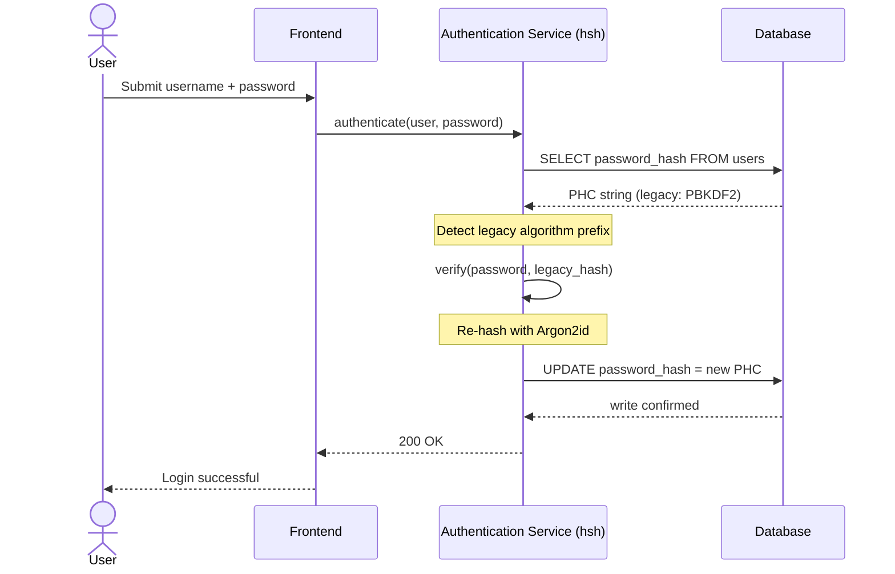
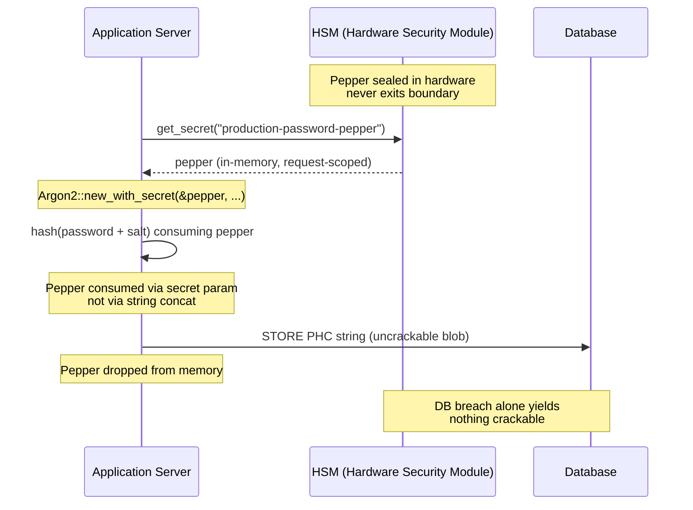

---
# Front Matter (YAML)
author: "contact@sebastienrousseau.com (Sebastien Rousseau)"
banner_alt: "Detailní záběr vývojářského terminálu rolujícího výstup Rust kompilátoru — viditelná disciplína paměťově bezpečného, auditovatelného kryptografického podloží pod podnikovou bankovní autentizační infrastrukturou"
banner_height: "1597"
banner_width: "2584"
banner: "https://cloudcdn.pro/stocks/images/rustlogs.webp"
cdn: "https://cloudcdn.pro"
charset: "UTF-8"
cname: "sebastienrousseau.com"
copyright: "© Copyright 2025 - 2026 - Sebastien Rousseau. All rights reserved."
date: "22. června 2026"
description: "hsh je čistě rustový kryptografický rámec, který umožňuje tier-1 bankám migrovat starší hashe hesel na Argon2id bez výpadku, integrovat HSM peppering a odstranit paměťové zranitelnosti C-based FFI — vše v souladu s DORA."
format-detection: "telephone=no"
hreflang: "cs"
icon: "https://cloudcdn.pro/clients/sebastienrousseau/v1/logos/sebastienrousseau.svg"
id: "https://sebastienrousseau.com/2026-06-22-hsh-zero-downtime-cryptographic-stewardship-rust-banking-2026"
image_alt: "Černobílý portrét Sebastiena Rousseaua"
image_height: "162"
image_width: "162"
image: "https://cloudcdn.pro/stocks/images/sebastienrousseau.webp"
keywords: "hsh, Rust kryptografie, hashování hesel, Argon2id, bezpečnost bankovnictví, HSM interlock, soulad s DORA, Basel III, migrace bez výpadku, paměťová bezpečnost, PBKDF2, scrypt, kybernetické obnovení"
language: "cs-CZ"
last_reviewed: "2026-06-22"
layout: "report"
locale: "cs_CZ"
logo_alt: "Logo Sebastiena Rousseaua"
logo_height: "44"
logo_width: "44"
logo: "https://cloudcdn.pro/clients/sebastienrousseau/v1/logos/sebastienrousseau.svg"
measurementID: "G-169G4ET5HQ"
name: "Sebastien Rousseau"
permalink: "https://sebastienrousseau.com/2026-06-22-hsh-zero-downtime-cryptographic-stewardship-rust-banking-2026"
rating: "general"
referrer: "no-referrer"
robots: "index, follow"
schema: "FAQPage, Article"
seo_title: "hsh: Kryptografická správa hesel v Rustu bez výpadku pro banky"
short_name: "sebastienrousseau"
subtitle: "Jak čistě rustový kryptografický rámec umožňuje bankám plynule povýšit starší hesla na Argon2id s HSM interlockem — a co to znamená pro soulad s DORA a Basel III."
tags: "hsh, Rust, bankovnictví, kryptografie, Argon2id, HSM, DORA, Basel-III, bezpečnost, open-source, provozní odolnost"
theme-color: "0, 83, 191"
title: "Zabezpečení správy hesel v podnikovém bankovnictví: vícealgoritmické hashování a upgrady s hsh"
url: "https://sebastienrousseau.com/2026-06-22-hsh-zero-downtime-cryptographic-stewardship-rust-banking-2026"
viewport: "width=device-width, initial-scale=1, shrink-to-fit=no"

# RSS
atom_link: "https://sebastienrousseau.com/2026-06-22-hsh-zero-downtime-cryptographic-stewardship-rust-banking-2026/rss.xml"
category: "Technology"
generator: "Static Site Generator (SSG) (version 0.0.40)"
item_description: "hsh je čistě rustový kryptografický rámec, který umožňuje tier-1 bankám migrovat starší hashe hesel na Argon2id bez výpadku, integrovat HSM peppering a odstranit paměťové zranitelnosti C-based FFI — vše v souladu s DORA."
item_pub_date: "Mon, 22 Jun 2026 07:07:07 +0000"
item_title: "Zabezpečení správy hesel v podnikovém bankovnictví: vícealgoritmické hashování a upgrady s hsh"
pub_date: "Mon, 22 Jun 2026 07:07:07 +0000"
type: "article"

# Twitter Card
twitter_card: "summary_large_image"
twitter_creator: "@wwdseb"
twitter_description: "hsh umožňuje tier-1 bankám migrovat starší hashe hesel na Argon2id bez výpadku, s HSM interlockem a paměťově bezpečným Rustem."
twitter_image: "https://cloudcdn.pro/clients/sebastienrousseau/v1/logos/sebastienrousseau.svg"
twitter_title: "hsh: Kryptografická správa hesel v Rustu bez výpadku"
twitter_url: "https://sebastienrousseau.com/2026-06-22-hsh-zero-downtime-cryptographic-stewardship-rust-banking-2026"

excerpt: "V éře GPU-akcelerovaného prolamování a mandátů DORA je kryptografický rozklad systémovým rizikem. Každý starší PBKDF2 nebo scrypt hash uložený v bankovní databázi je odpočtem do kompromitace. hsh mění pravidla hry — migrace bez výpadku, paměťově bezpečné upgrady..."

# Added by fix_hsh_frontmatter.py (template completeness)
apple_mobile_web_app_orientations: "portrait"
apple_touch_icon_sizes: "192x192"
apple-mobile-web-app-capable: "yes"
apple-mobile-web-app-status-bar-inset: "black"
apple-mobile-web-app-status-bar-style: "black-translucent"
apple-touch-fullscreen: "yes"
author_location: "London, United Kingdom"
author_twitter: "@wwdseb"
author_website: "https://sebastienrousseau.com"
docs: https://validator.w3.org/feed/docs/rss2.html
item_guid: "https://sebastienrousseau.com/2026-06-22-hsh-zero-downtime-cryptographic-stewardship-rust-banking-2026/rss.xml"
item_link: "https://sebastienrousseau.com/2026-06-22-hsh-zero-downtime-cryptographic-stewardship-rust-banking-2026/rss.xml"
last_build_date: "Mon, 22 Jun 2026 06:06:06 +0000"
managing_editor: "contact@sebastienrousseau.com (Sebastien Rousseau)"
menu: "active"
msapplication-navbutton-color: "0, 83, 191"
site_components: "Kaishi, Kaishi Builder, Kaishi CLI, Kaishi Templates, Kaishi Themes"
site_last_updated: "2023-07-05"
site_software: "Static Site Generator, Rust"
site_standards: "HTML5, CSS3, RSS, Atom, JSON, XML, YAML, Markdown, TOML"
ttl: "60"
twitter_site: "@wwdseb"
webmaster: "contact@sebastienrousseau.com"
apple-mobile-web-app-title: "hsh: Rust password hashing"
thanks: "Děkuji za přečtení!"
twitter_image_alt: "Černobílý portrét Sebastiena Rousseaua"
---

# Zabezpečení správy hesel v podnikovém bankovnictví: vícealgoritmické hashování a upgrady s hsh

<!-- lead-start: manual -->
<aside class="post-lead" aria-label="Shrnutí článku">
<p class="post-lead-tldr"><strong>TL;DR.</strong> <a href="https://github.com/sebastienrousseau/hsh">hsh</a> je open-source, čistě rustový kryptografický rámec, který umožňuje tier-1 bankám migrovat starší hashe hesel na moderní standardy typu Argon2id bez přerušení služby. Integrací HSM-podporovaného pepperingu a vynucováním přísné paměťové bezpečnosti bez C-based FFI wrapperů uzavírá zranitelnosti kryptografického rozkladu, které přímo ohrožují soulad s DORA a Basel III.</p>
<p class="post-lead-heading"><strong>Klíčové závěry</strong></p>
<ul class="post-lead-takeaways">
  <li><strong>Problém kryptografického rozkladu.</strong> Starší algoritmy typu PBKDF2 exponenciálně slábnou s rychlostí hardwaru a rozšiřují útočný povrch pro credential-stuffing a offline brute-force kampaně.</li>
  <li><strong>Migrace bez výpadku.</strong> Vzor <code>verify_and_upgrade</code> transparentně přehashuje přihlašovací údaje uživatelů během standardních přihlašovacích událostí a odstraňuje provozní riziko hromadných databázových migrací.</li>
  <li><strong>Hardwarový interlock a peppering.</strong> Hashe jsou zabaleny pomocí Hardware Security Modulů (HSM) nebo cloud KMS architektur, takže samotné prolomení databáze nevynese žádná prolomitelná hesla.</li>
  <li><strong>Paměťová bezpečnost jako regulatorní základ.</strong> Celý kód je přepsán v bezpečném Rustu a vynucen přísnou hygienou závislostí. hsh eliminuje rizika přetečení bufferu a dodavatelského řetězce, která jsou vlastní starším C-based kryptografickým knihovnám.</li>
</ul>
<p class="post-lead-related"><strong>Doporučené čtení:</strong> <a href="https://sebastienrousseau.com/2026-06-20-http-handle-zero-dependency-edge-ingress-banking-rust-2026">http-handle: vysoce výkonný edge ingress bez závislostí pro bankovnictví v roce 2026</a>, <a href="https://sebastienrousseau.com/2026-06-07-autonomous-treasury-index-programmable-liquidity-tokenised-deposits-2026/index.html">Index autonomního treasury v roce 2026</a>.</p>
</aside>
<!-- lead-end -->

> **Manažerské shrnutí.** Bankovní autentizace postavená proti modelu hrozeb z roku 2018 už není pod regulatorním režimem roku 2026 vhodná k účelu. GPU-akcelerované prolamování, hustota ASIC a blížící se postkvantový horizont zhroutily bezpečnostní rezervu PBKDF2 a raných parametrů scryptu; článek 5 DORA proměnil tento rozklad v odpovědnost před představenstvem. hsh, open-source čistě rustový rámec, řeší problém paralelně ve třech vrstvách: dispatcher `verify_and_upgrade`, který při každém úspěšném přihlášení přehashuje uložený přihlašovací údaj na aktuální parametry Argon2id bez údržbového okna; vrstva pepperingu propojená s HSM nebo KMS, díky níž samotné prolomení databáze nevynese nic prolomitelného; a paměťově bezpečný dodavatelský řetězec, který eliminuje útočnou plochu rozhraní cizích funkcí (FFI) vlastní C-podporovaným kryptografickým knihovnám. Výsledkem je podloží, které uspokojuje DORA, disciplínu provozního rizika Basel III, odpovědnost vrcholového managementu SM&CR i horizont postkvantové migrace NIST IR 8547 — bez programu hromadného resetu, který byl historicky nutný pro upgrade autentizační infrastruktury.

Většina autentizace v podnikovém bankovnictví stále spočívá na heslové vrstvě vytvrzené proti modelu hrozeb z roku 2018. Hardware, který ji láme, se posunul dál. Jak rostou GPU farmy a kryptograficky relevantní kvantové počítače (CRQC) se přibližují, starší hashování — PBKDF2, raný scrypt — slábne s každou hodinou výpočtů, kterou útočníci stráví na offline crack queue. Rozklad je tichý: nic v produkční databázi vám neřekne, že hash, který byl včera silný, už silný není.

Podle [Nařízení o digitální provozní odolnosti (DORA)](https://eur-lex.europa.eu/eli/reg/2022/2554/oj "Nařízení (EU) 2022/2554 — Digital Operational Resilience Act") ponechání nerotovaných starších kryptografických aktiv v produkci už není technický dluh. Je to jmenovitě regulatorní odpovědnost.

[hsh](https://github.com/sebastienrousseau/hsh "hsh — čistě rustový rámec pro hashování hesel") tuto mezeru uzavírá. Čistě rustový rámec spravuje více hash formátů vedle sebe a upgraduje slabé přihlašovací údaje za běhu během aktivních přihlašovacích relací. Autentizační infrastruktura odpovídá mandátům odolnosti roku 2026 bez údržbového okna, bez vynuceného resetu, bez jediné sekundy výpadku.

## 01. Problém kryptografického rozkladu v bankovnictví

Pochopit nezbytnost rámce jako hsh znamená pochopit životní cyklus hashe hesla. Algoritmy nestárnou s grácií; rozpadají se relativně k hardwaru, který je dokáže prolomit.

**Mezera v ASIC/GPU akceleraci.** Algoritmy jako PBKDF2 byly navrženy jako výpočetně náročné pro CPU. Útočníci dnes používají vysoce paralelizované GPU k provádění offline slovníkových útoků. Starší hash vygenerovaný v roce 2018 je proti soupeři z roku 2026 výrazně slabší.

**Riziko big-bang migrace.** Když se CISO rozhodne přejít z PBKDF2 na paměťově náročný algoritmus jako Argon2id, hashe nelze obrátit a znovu zašifrovat. Tradiční řešení — vynucené resety hesel u milionů uživatelů — způsobují masivní třenice se zákazníky a provozní riziko.

**Dodavatelský řetězec C-knihoven.** Bankovní middleware se historicky spoléhal na knihovny jako `argonautica` nebo přímá C bindingy pro hashování. Tyto knihovny nesou skryté riziko dodavatelského řetězce: jediné přetečení paměťového bufferu v autentizačním modulu může vést ke vzdálenému spuštění kódu (RCE) v nejvíce privilegované vrstvě bankovního stacku.

### Srovnání algoritmů — odolnost vůči hardwaru a prostor pro ladění

Tři algoritmy, na které banka v migračním korpusu reálně narazí, se liší méně volbou kryptografické primitivy a více tím, jak stárnou pod tlakem hardwaru. Tabulka níže shrnuje praktickou pozici.

| Algoritmus | Memory-hard | Odolnost vůči GPU / ASIC | Prostor pro ladění | Stav v roce 2026 |
| ---- | ---- | ---- | ---- | ---- |
| **PBKDF2** | Ne | Nízká — vektorizuje se na GPU; sub-milisekundový čas na odhad na běžném hardwaru. | Pouze počet iterací. | Legacy. Přípustný pouze jako verify-side fallback během migrace. |
| **scrypt** | Ano (mírně) | Střední — paměťová náročnost poráží jednoduché GPU farmy; ve velkém měřítku amortizovatelný ASIC. | `N` (CPU/paměť), `r` (velikost bloku), `p` (paralelismus). | Pro nové nasazení zastaralý. Aktivní v migračních korpusech. |
| **Argon2id** | Ano (silně) | Vysoká — paměťově i časově náročný; odolný vůči postranním kanálům a TMTO útokům. | Paměťová cena (`m`), časová cena (`t`), paralelismus (`p`), tajemství (pepper). | Doporučený výchozí stav. OWASP, NIST SP 800-63B-4 draft, FedRAMP. |

Závěr pro migrační plán je úzký: PBKDF2 je stav *verify-side*, nikoli destinace *write-side*. Každé úspěšné přihlášení proti záznamu PBKDF2 by mělo na cestě ven vyprodukovat záznam Argon2id.

## 02. Architektonická optika hsh 2026

Rámec je strukturován v pěti jádrových vrstvách. Každá je navržena tak, aby zmírnila konkrétní kategorii provozního rizika.

### Tabulka 1: Architektonické vrstvy hsh a zmírnění rizika

| Vrstva | Návrhové rozhodnutí | Proč na tom záleží | Riziko při špatném zacházení |
| ---- | ---- | ---- | ---- |
| **Kryptografické primitivy** | Sjednocený formát PHC String podporující Argon2id, scrypt a PBKDF2 | Poskytuje nejlepší odolnost proti GPU útokům v třídě a zachovává zpětnou kompatibilitu. | Datová sila; slabé algoritmy umožňující 100B+ odhadů/sekundu offline. |
| **Policy engine** | `verify_and_upgrade` dispatch | Dynamicky automatizuje přechod ze starších politik na moderní při přihlášení. | Bezpečnostní rozklad; aktivní uživatelé zůstávající na snadno prolomitelných starších typech hashe. |
| **Hardwarový interlock** | HSM a Cloud KMS „peppering" schopnosti | Zajišťuje, že samotný únik databáze neodhalí kandidátní hesla. | Offline brute-force útoky úspěšné po průniku SQL injection. |
| **Bezpečnostní hygiena** | Vynucení `deny.toml` a čistý Rust | Plně blokuje nebezpečné FFI a nedůvěryhodné externí C-závislosti. | Katastrofické útoky na dodavatelský řetězec a CVE v paměťové korupci. |

## 03. Cesta přehashování bez výpadku

Vzor `verify_and_upgrade` řeší migraci dat inteligentním, stav vědomým dispatch systémem, který nevyžaduje žádný výpadek databáze.

Když uživatel odešle své přihlašovací údaje, hsh přečte uložený řetězec Password Hashing Competition (PHC). Pokud obsahuje starší hash (např. zastaralou konfiguraci PBKDF2), systém vykoná následující tok:

1. **Identifikace:** Parsuje starší algoritmus a jeho konkrétní parametry.
2. **Verifikace:** Validuje kandidátní heslo proti staršímu hashi.
3. **Upgrade v reálném čase:** Po úspěšné shodě vezme plaintextové kandidátní heslo v paměti a okamžitě vypočítá nový hash pomocí vysoce bezpečné politiky Argon2id.
4. **Persistence:** Vrací nový PHC řetězec bankovní aplikaci, která přepíše starší záznam v databázi.

Tento proces je zcela transparentní pro koncového uživatele. Účinně migruje nejaktivnější účty do nejvyšší bezpečnostní úrovně už první den a organicky dramaticky zmenšuje útočný povrch banky v čase.

Sekvence níže ukazuje, co se odehrává během jediné přihlašovací události, když je uložený záznam na starším algoritmu. Uživatel nevidí žádnou změnu; autentizační prostředí banky se posiluje o jeden záznam.



### Implementační vzor — dispatch `verify_and_upgrade`

Integrační plocha uvnitř autentizační služby je malá. Starší kódová cesta zůstává jako fallback; nová kódová cesta je dispatcher.

```rust
use hsh::{Hasher, UpgradeResult};

struct UserRecord {
    username: String,
    password_hash: String, // PHC string
}

async fn authenticate(user: UserRecord, password_attempt: &str) -> Result<bool, AuthError> {
    let hasher = Hasher::new();
    match hasher.verify_and_upgrade(password_attempt, &user.password_hash) {
        Ok(UpgradeResult::Verified(is_valid)) => Ok(is_valid),
        Ok(UpgradeResult::Upgraded(new_hash)) => {
            db::update_user_hash(&user.username, new_hash).await?;
            Ok(true)
        }
        Err(_) => Err(AuthError::InvalidCredentials),
    }
}
```

Záleží na třech vlastnostech:

- **Stavová vědomost.** `verify_and_upgrade` zkoumá prefix PHC řetězce. Pokud je marker algoritmu starší, rámec automaticky spustí přehashování proti nakonfigurované politice Argon2id. Žádné větvení ve volajícím kódu.
- **Atomicita.** Přehashování se odehrává teprve po úspěšné verifikaci starší verze, uvnitř stejné autentizační události. Žádná samostatná dávková úloha, žádné plánované migrační okno a žádná destruktivní hromadná migrace, kterou by bylo nutné vracet zpět.
- **Persistence.** Varianta `UpgradeResult::Upgraded` nese nový PHC řetězec. Aplikace jej perzistuje stejnou datovou cestou, jaká už pro starší záznam existuje — žádná paralelní zápisová plocha, žádný dvoufázový zápisový protokol.

**Režimy selhání.** Pokud během upgrade zápisu selže databáze nebo je KMS krátkodobě nedostupné, relace stále uspěje proti staršímu hashi a záznam zůstane na starém algoritmu. Příští úspěšné přihlášení upgrade zopakuje. Neexistuje žádný napůl migrovaný stav a žádné selhání viditelné pro uživatele — migrace je napříč přihlašovacími událostmi monotónní a cena selhaného upgradu na jeden záznam je přesně jedno opakování při příštím přihlášení.

## 04. Peppered hashe přes HSM / KMS interlock

Standardní hashování hesel chrání proti přímým únikům databáze. Pokud však útočník získá databázi celou (hashe i soli), může provádět offline prolamování.

hsh zavádí robustní vrstvu „peppered" zabezpečení. Integrací s Hardware Security Moduly (HSM) nebo cloud-native Key Management Services (KMS) je výstup Argon2id kryptograficky zabalen vysoce entropickým klíčem, který nikdy neopouští hranici zabezpečeného hardwaru. Pokud je uživatelská databáze exfiltrována, útočník vlastní pouze zašifrované bloby. Bez prolomení fyzicky izolované HSM infrastruktury banky nemůže začít prolamovat hesla.

Architektonický diagram níže sleduje cestu tajemství. Pepper se nikdy nedostane do databáze; databáze sama o sobě nedrží nic adresovatelného. Obě úložiště mohou selhat nezávisle — systém ztrácí důvěrnost pouze tehdy, selžou-li obě současně.



### Implementační vzor — HSM-podporovaný peppered Argon2id

Pepper je čerpán z HSM v okamžiku požadavku, nikoli z konfiguračního souboru. `Argon2::new_with_secret` jej konzumuje prostřednictvím parametru tajemství algoritmu, nikoli řetězcovou konkatenací.

```rust
use argon2::{
    Argon2, Algorithm, Version, Params,
    PasswordHasher, PasswordVerifier,
    password_hash::{PasswordHash, SaltString, rand_core::OsRng},
};

async fn authenticate_with_hsm(
    user: UserRecord,
    password_attempt: &str,
) -> Result<bool, AuthError> {
    let pepper = hsm::client::get_secret("production-password-pepper").await?;
    let hasher = Argon2::new_with_secret(
        &pepper,
        Algorithm::Argon2id,
        Version::V0x13,
        Params::default(),
    )
    .map_err(|_| AuthError::Internal)?;

    let parsed = PasswordHash::new(&user.password_hash)
        .map_err(|_| AuthError::InvalidCredentials)?;
    if hasher.verify_password(password_attempt.as_bytes(), &parsed).is_ok() {
        if is_legacy_hash(&user.password_hash) {
            let new_hash = hasher
                .hash_password(
                    password_attempt.as_bytes(),
                    &SaltString::generate(&mut OsRng),
                )
                .map_err(|_| AuthError::Internal)?
                .to_string();
            db::update_user_hash(&user.username, new_hash).await?;
        }
        return Ok(true);
    }
    Err(AuthError::InvalidCredentials)
}
```

Z tohoto tvaru vyplývají tři důsledky sladěné s DORA:

- **Rotace klíčů jako problém správy klíčů.** Pepper žije za hranicí HSM/KMS, nikoli v databázi. Rotace se stává změnou ve správě klíčů, nikoli kampaní přehashování napříč uživatelskou základnou. Nové hashe se vážou na aktuální verzi pepperu; staré hashe se verifikují pod svou vázanou verzí, dokud přirozeně neproběhne jejich upgrade.
- **Oddělení povinností.** Servisní identita, která pepper čte, musí být auditovatelná a s nejmenšími nutnými oprávněními. Plná exfiltrace databáze bez odpovídajícího HSM grantu nepřinese nic prolomitelného. Kompromitace HSM grantu bez databáze nepřinese nic adresovatelného. Dopadový rádius kteréhokoli jednotlivého selhání je ohraničený.
- **Eliminace length-extension a konkatenačních chyb.** Použití parametru tajemství v Argon2 namísto řetězcové konkatenace odstraňuje z implementační plochy celou třídu kryptografických nástrah — length-extension, špatně typované UTF-8 konkatenace, chyby v pořadí salt/pepper.

## 05. Regulatorní soulad: DORA, Basel III a SM&CR

- **DORA, články 5 a 6:** Vyžaduje, aby finanční subjekty udržovaly rámce řízení ICT rizika. Strategie spoléhající na nerotované, deset let staré hashe hesel tyto principy porušuje. hsh poskytuje dokumentovaný, automatizovaný mechanismus pro kontinuální zvyšování kryptografické ochrany.
- **Basel III:** Spojuje regulatorní kapitál s pravděpodobností a závažností ztrátových událostí. Implementace Argon2id s HSM interlockem dramaticky snižuje závažnost úniku databáze, což podporuje kvantifikovatelné argumenty pro nižší alokaci kapitálu na provozní riziko.
- **SM&CR odpovědnost:** Schválení architektury, která aktivně sanuje kryptografický rozklad, poskytuje jmenovitým vrcholovým manažerům verifikovatelný a dokumentovatelný řetězec snižování rizika.

## Často kladené otázky

**Je hsh připraven do produkce pro autentizační cestu tier-1 banky?**
Knihovna je open-source, dokumentovaná a používá Argon2id přes stejný `argon2` crate, který tvoří základ ekosystému hashování hesel RustCrypto. Nasazení v tier-1 prostředí následuje vlastní due-diligence banky: nezávislý code review, atestaci reprodukovatelného buildu, pinning stromu závislostí, integrační testování s dodavatelem HSM a schválení provozního rizika. hsh poskytuje podloží; banka certifikuje nasazení.

**Jak `verify_and_upgrade` eliminuje riziko hromadné migrace?**
Verifikátor zkoumá PHC řetězec při parsování, spustí starší algoritmus k validaci hesla a — pokud uložený algoritmus nebo sada parametrů jsou pod aktuální úrovní — atomicky přehashuje plaintext pod Argon2id s vázaným HSM pepperem a zapíše nový PHC řetězec zpět. Uživatel zažívá normální přihlášení. Infrastruktura se posiluje o jeden záznam za úspěšnou autentizaci. Žádná resetovací kampaň, žádné údržbové okno, žádná událost provozního rizika.

**Co se stane s neaktivními účty, které se nikdy nepřihlásí?**
Záznamy, které se neautentizují, se nikdy nepřehashují. Banky to řeší dvěma doplňujícími politikami: dokumentovaným prahem nečinnosti (často 18–24 měsíců), po kterém je účet administrativně rotován v rámci řízené resetovací kampaně, a syntetickým přehashováním během plánované údržby pro účty ve vymezených kohortách (vysoká hodnota, vysoké oprávnění, regulované). Obojí jsou politiky, nikoli chování knihovny; hsh zaznamenává rozhodnutí dispatche do auditní telemetrie, aby provozní vlastník mohl prokázat pokrytí.

**Nezavádí HSM pepper jediný bod selhání na autentizační cestě?**
Stejné HSM, které podepisuje platební zprávy a rotuje klíče zálohované KMS, je na cestě. Riziko je shodné s existující pozicí banky; hsh ji dědí, nikoli zavádí. Mitigace jsou standardní: páry HSM v HA, KMS regiony hot-spare, načítání pepperu v rámci požadavku s circuit-breaker fall-back na režim read-only a explicitní provozní runbook pro nedostupnost HSM. Pepper je parametr tajemství `argon2`, konzumovaný v procesu a odhozený z paměti po použití.

**Kde stojí hsh vzhledem k postkvantové migraci?**
hsh je rámec pro hashování hesel a tajemství, nikoli primitiv pro key-encapsulation nebo podpis. Přechod PQC dokumentovaný v [NIST IR 8547](https://csrc.nist.gov/pubs/ir/8547/ipd "Transition to Post-Quantum Cryptography Standards") cílí na ustavení klíčů (ML-KEM, FIPS 203) a podpisy (ML-DSA, FIPS 204; SLH-DSA, FIPS 205). Vrstva hashování, kterou hsh pokrývá, je s touto migrací z velké části ortogonální. Obě se sbíhají na úrovni podloží — obě chtějí paměťově bezpečný, auditovatelný, reprodukovatelný kryptografický dodavatelský řetězec — což je přesně pozice, kterou hsh dnes umožňuje.

## Závěr

Deploy-and-forget hashování hesel je u konce. DORA posunula kryptografickou pasivitu z technického dluhu do jmenovité regulatorní odpovědnosti a hardwarová křivka je každý rok strmější. Příspěvkem hsh není silnější algoritmus — Argon2id je dostupný roky. Příspěvkem je provozní mechanika, která umožňuje na něj migrovat bez plánování výpadku, bez vynucených resetů uživatelů a bez svěření autentizační cesty banky C-based FFI shimům.

[Zdrojový kód hsh](https://github.com/sebastienrousseau/hsh "hsh — čistě rustový rámec pro hashování hesel, duální licence MIT a Apache 2.0") je dostupný pod duální licencí MIT a Apache 2.0.

## Reference

Basel Committee on Banking Supervision (2011). *Basel III: A global regulatory framework for more resilient banks and banking systems*. Bank for International Settlements. Dostupné z: [https://www.bis.org/publ/bcbs189.pdf](https://www.bis.org/publ/bcbs189.pdf "Basel III: A global regulatory framework for more resilient banks and banking systems")

Biryukov, A., Dinu, D., Khovratovich, D., a Josefsson, S. (2021). *RFC 9106: Argon2 Memory-Hard Function for Password Hashing and Proof-of-Work Applications*. Internet Engineering Task Force. Dostupné z: [https://datatracker.ietf.org/doc/html/rfc9106](https://datatracker.ietf.org/doc/html/rfc9106 "RFC 9106 — Argon2 Memory-Hard Function for Password Hashing")

Evropský parlament a Rada (2022). *Nařízení (EU) 2022/2554 o digitální provozní odolnosti finančního sektoru (DORA)*. Dostupné z: [https://eur-lex.europa.eu/eli/reg/2022/2554/oj](https://eur-lex.europa.eu/eli/reg/2022/2554/oj "Nařízení (EU) 2022/2554 — DORA")

Financial Conduct Authority (2015). *Senior Managers and Certification Regime (SM&CR)*. Dostupné z: [https://www.fca.org.uk/firms/senior-managers-certification-regime](https://www.fca.org.uk/firms/senior-managers-certification-regime "Senior Managers and Certification Regime")

National Institute of Standards and Technology (2024). *Initial Public Draft — Transition to Post-Quantum Cryptography Standards (NIST IR 8547)*. Dostupné z: [https://csrc.nist.gov/pubs/ir/8547/ipd](https://csrc.nist.gov/pubs/ir/8547/ipd "NIST IR 8547 — Transition to Post-Quantum Cryptography Standards")

OWASP Foundation (2024). *Password Storage Cheat Sheet*. Dostupné z: [https://cheatsheetseries.owasp.org/cheatsheets/Password_Storage_Cheat_Sheet.html](https://cheatsheetseries.owasp.org/cheatsheets/Password_Storage_Cheat_Sheet.html "OWASP Password Storage Cheat Sheet")

<!-- enrich-start -->
<aside class="author-card" aria-label="O autorovi"><span class="author-card-body"><strong class="author-card-name"><a href="/about/index.html">Sebastien Rousseau</a></strong><span class="author-card-bio">Senior bankovní technolog píšící o aplikované AI, migraci ISO 20022, postkvantové kryptografii pro finanční služby a o strukturální transformaci velkoobchodních plateb.</span><span class="author-credentials">20+ let napříč HSBC Commercial &amp; Investment Bank, PayPal, Barclays, Shazam, AKQA, Virgin Group. <a href="/about/index.html">Plný profil</a> &middot; <a href="https://www.linkedin.com/in/sebastienrousseau/" rel="external noopener">LinkedIn</a> &middot; <a href="https://github.com/sebastienrousseau" rel="external noopener">GitHub</a></span></span></aside>
<p class="post-reviewed">Naposledy revidováno <time datetime="2026-06-22">2026-06-22</time>.</p>
<!-- enrich-end -->
