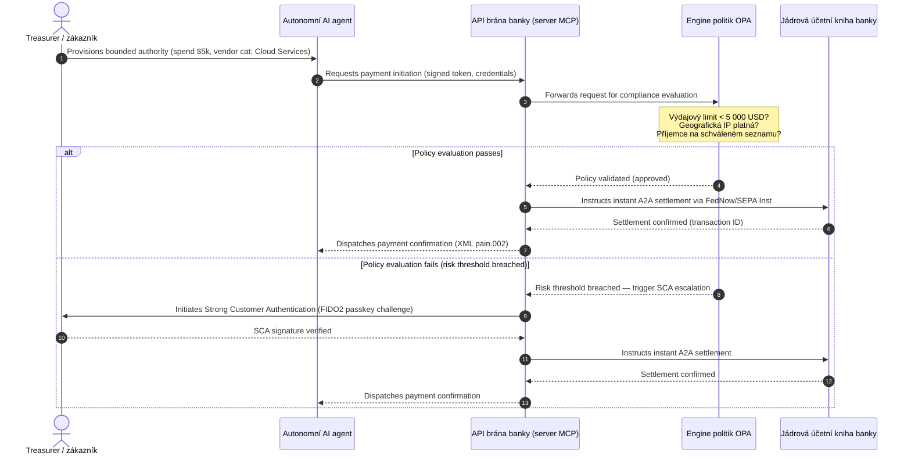

# Globální výhled plateb 2026: Provozní model, riziko a výnosy v agentním, neviditelném světě reálného času

Globální cyklus plateb roku 2026 definují tři sbíhající se síly — agentní obchod, neviditelné integrované platby a vykonávání v reálném čase — postavené na tokenizované sjednocené účetní knize v rámci Project Agorá a tvrdém termínu přepnutí na strukturovanou adresu SWIFT v listopadu 2026.

<!-- lead-start -->
<aside class="post-lead" aria-label="Shrnutí článku">

<strong>TL;DR.</strong> Platební krajina roku 2026 se posunula od migrace zpráv k vícerozměrnému provoznímu modelu, kde riziko a výnosy diktuje vykonávání v reálném čase. Tento text syntetizuje výhledy J.P. Morgan, Global Payments, HSBC a Payments Association na rok 2026 do čtyřpilířového provozního plánu G-SIB, který pokrývá agentní obchod iniciovaný modelem, nepřetržitě dostupná treasury API, tokenizované sjednocené účetní knihy v rámci BIS Project Agorá a termíny strukturované adresy SWIFT a SEPA 14./15. listopadu 2026 (Swift CBPR+: 14. listopadu 2026; pravidla EPC SEPA: 15. listopadu 2026).

<strong>Klíčová zjištění</strong>

<ul class="post-lead-takeaways">
  <li><strong>Agentní obchod otevírá hranici delegované odpovědnosti.</strong> Autonomní AI agenti by měli do roku 2030 zprostředkovat 3–5 bilionů USD ročního obchodu. Banky musí definovat dozor MCP, delegování SCA v rámci PSD3/PSR a vlastnictví KYC/AML v rámci víceagentních platebních řetězců.</li>
  <li><strong>Nepřetržitě dostupná likvidita je nyní provozní a regulatorní výchozí úrovní.</strong> Treasury API a virtuální účty s režimem 24/7 minimalizují uvízlé prostředky a zvyšují laťku odolnosti. Pro systémově významná API treasury v reálném čase se dostupnost pěti devítek (99,999 %) stává interním inženýrským cílem, který si banky stanovují, aby u dohledových orgánů prokázaly odolnost na úrovni DORA. Samotná DORA neukládá univerzální práh pěti devítek; pokrývá řízení ICT rizik, hlášení incidentů, testy odolnosti, riziko třetích stran a dohled nad kritickými ICT poskytovateli.</li>
  <li><strong>Tokenizace dospěla k regulovaným sjednoceným účetním knihám.</strong> Project Agorá je největším veřejno-soukromým rámcem pro tokenizované vklady komerčních bank a rezervy centrálních bank. Banky potřebují pětifázovou cestu tokenizace s explicitním prudenciálním ošetřením.</li>
  <li><strong>Přepnutí na strukturovanou adresu 14./15. listopadu 2026 má pevně daný termín.</strong> Swift CBPR+ odstraňuje nestrukturovaný blok `<AdrLine>` od 14. listopadu 2026; pravidla EPC SEPA umožňují nestrukturovanou adresu pouze do 15. listopadu 2026. Po přepnutí oba spustí odmítnutí. Vyžaduje se čisté řízení dat napříč týmy produktu, technologie a compliance.</li>
</ul>

<strong>Související četba:</strong> <a href="https://sebastienrousseau.com/2026-06-23-iso-20022-pain001-programmable-liquidity-autonomic-treasury-2026">Od Pain.001 k programovatelné likviditě: ISO 20022 jako autonomní nervová soustava treasury v roce 2026</a>, <a href="https://sebastienrousseau.com/2026-06-24-cross-border-iso-20022-open-finance-tokenised-deposits-treasury-2026">Přeshraniční rok 2026: ISO 20022, otevřené finance a tokenizované vklady v podnikovém treasury</a>, <a href="https://sebastienrousseau.com/2026-06-25-quantum-dawn-cib-kyberlib-quantum-resilient-payments-stack-2026">Kvantové svítání pro CIB: Od KyberLib ke kvantově odolnému platebnímu zásobníku</a>.

</aside>
<!-- lead-end -->

Pro globální transakční banky je cyklus 2026–2028 strukturální okno. Moderní platební infrastruktura již není administrativní službou — je jádrem technologické strategie na bankovní úrovni. Uvnitř G-SIB a velkých regionálních institucí se technologie, regulace a očekávání zákazníků sbíhají do jediné provozní roviny.

Tento cyklus definují tři síly, z nichž každá se přímo váže na jednu starost výkonné úrovně.

- **Agentní obchod** — distribuce kanálů, návrh produktu, přiřazení odpovědnosti a Model Risk Management pod dohledem regulátora.
- **Neviditelné platby** — zákaznická zkušenost, s rizikem dezintermediace tam, kde banky nezasadí svoji účetní knihu do firemních a obchodnických front-endů.
- **Vykonávání v reálném čase** — rychlost kapitálu, s návaznou změnou řízení likvidity, úvěrového rizika, provozní odolnosti a obrany proti podvodům.

Finanční sázky jsou hmatatelné. Podvody rostou v rychlosti i sofistikovanosti; regulatorní termíny jsou tvrdé; a banky, které proaktivně modernizují své jádrové systémy, otevírají podstatné poplatkové výnosy. Cena nečinnosti je opačná: okamžitá odmítnutí transakcí, provozní úzká místa, regulatorní pokuty a rychlá eroze tržního podílu.

## Žebřík jistoty — co je datováno, regulováno nebo predikováno

Ne každá položka v této zprávě nese stejnou míru jistoty. Otázka na úrovni představenstva zní, které delty jsou termíny, které jsou očekáváními dohledu a které jsou stále tržními projekcemi — protože odpověď mění rozpočtovou konverzaci.

| Kategorie | Příklady |
| --- | --- |
| **Pevné termíny** | Přepnutí Swift CBPR+ na strukturovanou adresu (14. listopadu 2026); pravidla EPC SEPA (15. listopadu 2026) |
| **Regulatorní povinnosti** | ICT rizika DORA + testy odolnosti + dohled nad třetími stranami (EU); delegování SCA v rámci PSD3/PSR; MRM v rámci SR 11-7 + PRA SS1/23 |
| **Tržní posuny s vysokou pravděpodobností** | API treasury v reálném čase, obrana proti podvodům řízená AI, likvidita založená na API, biometrické podvody řízené deepfaky |
| **Strategické opce** | Tokenizované vklady, sjednocené účetní knihy v rámci Project Agorá, koridory agentního obchodu, kontinuální FX (Wire 365) |
| **Predikce** | `$3-$5 trillion` ročních toků agentního obchodu do roku 2030 (základní scénář McKinsey) |

S horními dvěma řádky zacházejte jako s fakty compliance, které vyvolávají rozpočtový řádek bez ohledu na to, zda banka zachytí jakýkoli upside. Se spodními dvěma řádky zacházejte jako se strategickými opcemi — s vysokou jistotou ohledně směru, ale kde je načasování exekuce volbou představenstva, nikoli zápisem v kalendáři regulátora.

## Sbližování globálních platebních autorit

Tato zpráva syntetizuje výhledy plateb a obchodu na rok 2026 ze čtyř autoritativních hlasů odvětví — [J.P. Morgan Payments](https://www.jpmorgan.com/payments/newsroom/payments-outlook-2026-trends-report-released "J.P. Morgan Payments — Outlook 2026"), [Global Payments](https://investors.globalpayments.com/news-events/press-releases/detail/497/global-payments-releases-its-2026-commerce-and-payment "Global Payments — 2026 Commerce and Payment Trends Report"), HSBC a The Payments Association — a triangulizuje je proti [G20 Roadmap for Enhancing Cross-Border Payments](https://www.fsb.org/2026/03/fsb-kicks-off-new-implementation-phase-to-enhance-cross-border-payments-through-public-private-partnership/ "FSB — cross-border payments implementation phase, March 2026").

Každá organizace přistupuje k ekosystému z jiného tržního úhlu, ale jejich zjištění se sbíhají na třech neměnných.

1. **Okamžité, API řízené rails jsou výchozí úrovní.** Starší dávkové modely zpracování jsou pro přeshraniční toky a vysokohodnotné platby okrajové; rychlost transakcí v těchto segmentech diktuje nepřetržitě dostupné zpracování zpráv v reálném čase.
2. **AI je hrozbou i obranou.** Generativní nástroje a deepfake škálují podvody s transakcemi a vyžadují vícevrstvé protiobrany strojového učení v reálném čase.
3. **Tokenizace je infrastruktura připravená pro produkci.** Účetní knihy se sjednocují, aby hostily tokenizované komerční závazky a velkoobchodní digitální měny centrálních bank.

| Zpráva | Hlavní publikum | Zaměření | Klíčový pilíř | Důsledek pro banku |
| --- | --- | --- | --- | --- |
| **J.P. Morgan Payments** | Corporate treasurers, G-SIBs | Real-time liquidity, fraud | APIs, AI biometrics | Rebuild liquidity, FX, and risk systems for continuous 365-day settlement. |
| **Global Payments** | Merchants, e-commerce | POS evolution, omnichannel | Agentic commerce, frictionless checkout | Build secure, API-gated merchant payment corridors for autonomous AI agents. |
| **HSBC Insights** | Multinational corporates | ERP integrations (SAP/Oracle), real-time cash | Treasury-as-a-Service, cash visibility | Monetise transactional API suites and embed real-time cash ledger reporting at source. |
| **The Payments Association** | Fintechs, payment institutions | Stablecoins, tokenisation, global regulation | Regulated digital assets, policy compliance | Prepare balance sheets for tokenised deposits and navigate PSD3/PSR liability structures. |

Tyto čtyři výhledy fakticky definují provozní zásobník soukromého sektoru, který běží na infrastruktuře politik veřejného sektoru G20, a převádějí politický záměr na konkrétní rozhodnutí o likviditě, tokenizaci, datech a obraně proti podvodům uvnitř bank.

## Pilíř 1 — Agentní obchod a neviditelné platby

Agentní obchod je přechod od lidsky řízeného nákupu kliknutím k autonomnímu, modelem řízenému zahájení transakce. Předpovědi odvětví se sbíhají na 3–5 bilionech USD ročního obchodu zprostředkovaného autonomními agenty do roku 2030 — nízký jednociferný podíl globálního objemu plateb provedených bez toho, aby člověk klikl na „koupit".

Maloobchodní a komerční ekosystém má odpovídající mezeru. Jasná většina spotřebitelů nyní očekává téměř bezfrikční platby, avšak méně než polovina obchodníků dala prioritu nákupu jedním kliknutím nebo katalogům produktů přístupným přes API. AI agenti nedokáží navigovat starší vícekrokové nákupní obrazovky navržené pro lidské oči; potřebují strukturované API handshakes typu stroj-stroj.

### Priority bank a provozní dopad

- **Vlastnictví KYC a AML.** Banky musí definovat, kdo nese compliance povinnost uvnitř agentního transakčního řetězce. Pokud osobní AI agent spotřebitele zahájí transakci přes agentní pokladnu obchodníka, banka musí ověřit, že původní delegované oprávnění je kryptograficky vázáno na primárního majitele účtu.
- **Přepracování odpovědnosti a zpětného zúčtování.** Schémata karet a A2A koleje byly navrženy kolem lidské autorizace. Když AI agent provede chybný nákup — například nabude nesprávnou průmyslovou zásobu kvůli chybě při parsování dat — banky musí jasně rozdělit odpovědnost mezi spotřebitele, poskytovatele agenta a obchodníka.
- **Risk-rating agentních toků.** Engine pro směrování plateb musí dynamicky hodnotit riziko agentních plateb a uplatňovat vyšší rezervní požadavky nebo sazby interchange na transakce, které nezahájil člověk, dokud nevznikne stabilní historie vypořádání.

### Omezené jednání a omezené oprávnění

K omezení „neomezeného jednání" — kdy podnikový nákupní agent kvůli softwarové chybě spustí nekonečnou rekurzivní smyčku nákupů — banky musí nasadit **API brány s omezeným oprávněním**. Brány vynucují limity na úrovni politik ve třech dimenzích.

1. **Vícestupňové finanční limity** — výdaje agenta omezené velikostí transakce, denní kumulativní hodnotou a kategorií obchodníka.
2. **Kontextová bezpečnostní opatření** — sekundární signály (denní doba, IP geolokace, frekvence transakcí) vyhodnocené před tím, než účetní kniha uvolní prostředky.
3. **Eskalace s člověkem ve smyčce** — povinná lidská autorizace spuštěná přes Strong Customer Authentication (SCA) v rámci PSD3 / PSR vždy, když transakce překročí prahové hodnoty rizika.

Mermaid sekvence níže ukazuje cílovou architekturu, kterou mnoho bank rozpozná jako agentní platební tok s omezeným oprávněním.

### Model Context Protocol (MCP)

K propojení lokalizovaných AI modelů s vrstvami vykonávání řízenými bankou se odvětví standardizuje kolem [Model Context Protocol (MCP)](https://modelcontextprotocol.io "Model Context Protocol — open standard for LLM tool integration") — otevřeného protokolu, který umožňuje LLM volat jasně vymezené, auditovatelné nástroje a API bez surového přístupu k jádrovým systémům.

Zabalení bankovních API (zahájení platby, dotaz na zůstatek, ověření strany) do serveru MCP udržuje LLM mimo databázové tabulky a system-root kontroly. Model interaguje s účetní knihou pouze přes strukturované, auditované, rate-limitované endpointy — bezpečnost je vynucována na hranici agentního vykonávání nástrojů, nikoli zakopána uvnitř modelu.

## Pilíř 2 — Transformace treasury a likvidita znovu promyšlená

Rychlost transakčního bankovnictví v roce 2026 určuje posun od dávkového zpracování na konci dne k nepřetržitým, real-time operacím treasury. Nadnárodní korporace již netolerují uvízlé prostředky — likviditu nečinně ležící na lokálních účtech přes víkendy nebo svátky, protože jsou systémy vypořádání zavřené.

### Ekonomický argument pro likviditu v reálném čase

J.P. Morgan i HSBC shodně uvádějí, že korporace s pokročilými schopnostmi reálného času pro hotovost a data podstatně častěji předstihují srovnatelné společnosti v růstu výnosů a kapitálové efektivitě, hlavně snížením uvízlých prostředků a optimalizací cyklů pracovního kapitálu.

K získání této hodnoty banky dodávají **API produkty Treasury-as-a-Service (TaaS)**, které umožňují firemním ERP (SAP, Oracle) připojit se přímo k účetní knize banky.

- **API zůstatků v reálném čase** používající schéma `camt.052` — nahrazují protokoly pro přenos souborů okamžitým, událostmi řízeným reportingem hotovostní pozice.
- **API hromadného zahájení plateb** používající `pain.001` — přímé, sjednocené vykonání dávek plateb dodavatelům z ERP účetní knihy.
- **Kontinuální FX API** — engine treasury uzamkne real-time, algoritmické směnné kurzy pro přeshraniční vypořádání a eliminuje riziko mezery na trhu přes noc.
- **API virtuálních účtů** — korporace dynamicky vytvářejí a rušit tisíce podúčtů pro automatizované párování pohledávek a oddělení účetní knihy.

### Provozní odolnost a DORA

Nabídka nepřetržité likvidity transformuje rizikový profil banky. Pro systémově významná API treasury v reálném čase se dostupnost pěti devítek (99,999 %) stává interním inženýrským cílem, který si banky stanovují, aby u dohledových orgánů prokázaly odolnost na úrovni DORA. Samotná DORA neukládá univerzální práh pěti devítek; pokrývá řízení ICT rizik, hlášení incidentů, testy odolnosti, riziko třetích stran a dohled nad kritickými ICT poskytovateli.

V rámci [Digital Operational Resilience Act (DORA)](https://eur-lex.europa.eu/legal-content/EN/TXT/?uri=CELEX%3A32022R2554 "Regulation (EU) 2022/2554 — Digital Operational Resilience Act") to není IT KPI — je to přísný regulatorní požadavek. Regulátoři očekávají, že banky prokáží, že povrch API treasury v reálném čase a databáze účetní knihy absorbují závažné, ale věrohodné kyberútoky, výpadky sítí a narušení hyperscalerů, aniž by přerušily kritické platby nebo ohrozily systémovou likviditu. To vyžaduje geograficky redundantní, active-active multi-cloud databázové architektury, vrstvy detekce hrozeb v reálném čase a automatizovaný failover — viditelné v řádku nákladů na změny, nejen v auditní dokumentaci.

### Kontinuální FX a přeshraniční inovace

Treasury v reálném čase nemůže žít uvnitř hranic jediné měny. G-SIB nasazují kontinuální FX infrastrukturu — platforma [Wire 365](https://www.jpmorgan.com/insights/payments/fx-cross-border/wire-365-global-clearing "J.P. Morgan — Wire 365 global clearing reinvented") J.P. Morganu zpracovává přeshraniční platby a FX konverze v jakýkoli den v roce, mimo tradiční hodiny RTGS centrálních bank. Tato vrstva se přímo propojuje s tokenizovanými vklady a systémy sjednocené účetní knihy probíranými v Pilíři 3.

## Pilíř 3 — Tokenizované vklady a sjednocená účetní kniha

Tokenizace dospěla od izolovaných pilotů proof-of-concept ke škálovatelné monetární infrastruktuře na bankovní úrovni. Pozornost se posunula od soukromých stablecoinů a spekulativních kryptoaktiv k **tokenizovaným vkladům komerčních bank** a **velkoobchodním digitálním měnám centrálních bank (wCBDC)** běžícím na programovatelných sjednocených účetních knihách.

Referenčním rámcem je [Project Agorá](https://www.bis.org/about/bisih/topics/fmis/agora.htm "BIS Project Agorá — tokenisation of wholesale cross-border payments") — významná veřejno-soukromá spolupráce svolaná BIS a IIF, zahrnující **osmi centrálních bank** a více než 40 soukromých finančních institucí (podle stránky BIS Agorá, aktualizováno 27. května 2026). Projekt zkoumá, jak se tokenizované vklady komerčních bank integrují s tokenizovanými velkoobchodními CBDC na sdílené programovatelné účetní knize, aby eliminovaly tření přeshraničního vypořádání, koordinovaly compliance kontroly a umožnily atomickou finalitu 24/7.

### Pětifázová cesta tokenizace

Pro G-SIB a velké regionální banky je tokenizace postupnou cestou od interní optimalizace k interoperabilitě otevřeného trhu.

1. **Interní treasury likvidita** — tokenizace interních firemních hotovostních zůstatků (např. JPM Coin nebo ekvivalentní soukromé bankovní účetní knihy) k umožnění okamžitého přeshraničního převodu 24/7 a nettingu napříč pobočkami banky.
2. **Omezené víceankovní koridory** — uzavřená, regulovaná konsorcia (sandbox Project Agorá) k testování mezibankovního vypořádání a sdíleného stavu účetní knihy napříč odlišnými institucemi.
3. **Kontinuální programovatelné FX** — smart kontrakty na sjednocené účetní knize provádějí okamžité Payment-versus-Payment (PvP) FX a eliminují riziko vypořádání napříč časovými pásmy.
4. **Tokenizovaná reálná aktiva (RWA)** — tokenizovaná hotovostní noha se integruje s tokenizovanými cennými papíry, dluhem nebo obchodními účetními knihami pro okamžitou finalitu Delivery-versus-Payment (DvP) a snižuje uzamčení kapitálu z dnů na milisekundy.
5. **Regulovaná veřejná/hybridní interoperabilita** — bezpečné gateway obaly umožňují institucionální likviditě bezpečně interagovat s otevřenými veřejnými sítěmi.

### Prudenciální a bilanční důsledky

Tokenizovanou hotovost je třeba pečlivě navigovat prudenciálními rámci. Dozor zdůrazňuje, že tokenizovaný vklad musí být ekonomicky ekvivalentní tradičnímu vkladu komerční banky — tedy nezajištěným závazkem v rozvaze banky se stejným pokrytím pojištění vkladů.

Provozně tokenizované vklady přinášejí rizika, která klasické modely zátěžových testů likvidity nebyly stavěné simulovat. Smart kontrakty vykonávají programovatelné výběry rychlostí a objemy, které starší předpoklady nezachycují. V rámci Basel III musí banky zajistit, aby risk engine modeloval programovatelné odlivy hotovosti a aby tokenizovaná účetní kniha čistě interoperovala se staršími systémy RTGS v denním cyklu likvidity.

### Stablecoiny vs. tokenizované vklady — nuancovaný postoj

Soukromé plně rezervované stablecoiny (USDC atd.) si nadále získávají tržní podíl v retailových přeshraničních remitencích a decentralizovaném obchodu, ale postrádají schopnost vytváření úvěru a finalitu vypořádání komerčního bankovního systému.

Místo aby konkurovaly na retailových rails, transakční banky zavádějí custody, vydávají vlastní regulované tokenizované nástroje závazků a budují bezpečné on-/off-ramp brány. Firemní klienti získávají programátorskou flexibilitu, přičemž kapitál zůstává uvnitř regulovaného perimetru.

### Otázky, které by představenstvo mělo klást ohledně tokenizovaných peněz

- **Účast na sjednocené účetní knize.** Jaká je naše aktivní strategická roadmapa pro účast na velkoobchodních veřejno-soukromých iniciativách sjednocených účetních knih jako Project Agorá?
- **Bilance a modelování rizik.** Aktualizovaly naše risk engine a rámce kapitálové přiměřenosti zátěžové testování tak, aby zohledňovaly rychlost odlivů tokenů spouštěných smart kontrakty?
- **Klientské segmenty s first-mover výhodou.** Které z našich segmentů firemního treasury a komerčního bankovnictví by okamžitě profitovaly z programovatelného, tokenizovaného vypořádání DvP/PvP?

## Pilíř 4 — Strukturovaná data a obrana proti podvodům

Infrastruktura compliance v roce 2026 je dominována **přepnutím na strukturovanou adresu 14./15. listopadu 2026** — dvěma sousedními termíny, které společně uzavírají cestu nestrukturované adresy napříč přeshraničními a vnitro-EU kolejemi. V rámci [SWIFT Standards Release (SR) 2026](https://www.swift.com/standards/iso-20022/removal-unstructured-address "SWIFT — Removal of unstructured address, November 2026") Swift CBPR+ odstraňuje nestrukturovaný blok `<AdrLine>` od **14. listopadu 2026**. Pravidla EPC SEPA z roku 2025 umožňují nestrukturovanou adresu pouze do **15. listopadu 2026**. Po přepnutích bude jakákoli přeshraniční nebo domácí zpráva nesoucí nestrukturovanou adresu tam, kde se očekávají strukturované prvky, sítí zpožděna nebo odmítnuta.

Většina institucí termín zná. Mnohé jej považují za povrchní mapovací cvičení na úrovni rozhraní. Realitou je hlubší výzva kvality dat a řízení dat. Aby se vyhnuly katastrofálním mírám odmítnutí, platební operace potřebují jasný cross-funkční rámec řízení.

- **Produkt a operace.** Zachycení dat u zdroje. Zákaznicky orientované digitální portály, onboardingová rozhraní a vstupní pole firemních ERP musí vynutit strukturovaná pole adres (`<StrtNm>`, `<PstCd>`, `<TwnNm>`, `<Ctry>`) v bodě zahájení platby.
- **Technologie.** Parsování, mapování, validace schémat. Validační engine blokují starší soubory dříve, než zasáhnou rozhraní SWIFT. Lokálně nasazené modely strojového učení parsují starší nestrukturované adresní bloky do XML-kompatibilních tagů pod `<PstlAdr>`.
- **Compliance a riziko.** Sankční screening, monitoring transakcí a AML logika aktualizované k absorpci strukturovaných XML polí — snižují míry false-positive a manuální vyšetřování.

### Business case pro strukturovaná data

Brán jako náklad compliance, program strukturovaných dat je drahý. Brán jako enabler výnosů, sám se zaplatí.

1. **Pokročilé úvěrové rozhodování.** Strukturovaná data o faktuře, remitenci a koncovém dlužníkovi umožňují bankám budovat automatizované, přesné programy financování pracovního kapitálu a faktoringu faktur v dodavatelském řetězci pro firemní klienty.
2. **Automatizované párování pohledávek.** Vystavení strukturovaných identifikátorů strany a faktury podporuje prémiové produkty rekonciliace hotovosti a pooling virtuálních účtů, generuje nové výnosy z transakčních poplatků.
3. **Monetizovatelná analytika transakcí.** Banky balí a prodávají granulární dashboardy real-time likvidity a vzorců nákupu firemním CFO a treasurerům.

### Vrstvená AI obrana proti podvodům

Jak se rychlosti transakcí zrychlují k reálnému času, techniky podvodů škálují. [Entrust 2026 Identity Fraud Report](https://www.entrust.com/resources/reports/identity-fraud-report "Entrust 2026 Identity Fraud Report") uvádí deepfaky jako **jeden z pěti pokusů o biometrický podvod**; dřívější analýza Entrust umisťovala deepfaky konkrétně na **40 % pokusů o videobiometrický podvod**. V obou rámcích jsou syntetická média nyní materiálním kanálem pro překonání kontrol hlasu a rozpoznávání obličeje při onboardingu a platebních tocích.

Obranou je **třívrstvý AI model proti podvodům**.

1. **Vrstva identity.** Biometricky ověřené [FIDO2](https://fidoalliance.org/fido2/ "FIDO Alliance — FIDO2 specification") passkeys, kryptograficky podepsané vázání na hardwarové zařízení a decentralizované peněženky digitální identity k zabezpečení přístupu k platbám.
2. **Behaviorální vrstva.** Kontinuální behaviorální biometrika — tempo navigace v relaci, kadence psaní, orientace zařízení — k detekci automatizovaného botového vykonávání nebo pokusů o únos relace.
3. **Transakční vrstva.** Strukturovaná pole ISO 20022 napájejí risk engine strojového učení v reálném čase, křížově odkazují metadata transakce se sdílenou consorciální inteligencí na úrovni sítě, aby identifikovaly podezřelé transakce během milisekund od zahájení.

K uspokojení dozoru AI modely transakční vrstvy zahrnují přísné **parametry vysvětlitelnosti** a fungují v rámci dedikovaného programu Model Risk Management (MRM). Regulátoři očekávají, že banky vysvětlí konkrétní datové body a algoritmickou logiku, které spustily automatický blok nebo upozornění na podvod, v souladu s [US Federal Reserve SR 11-7](https://www.federalreserve.gov/frrs/guidance/supervisory-guidance-on-model-risk-management.htm "US Federal Reserve — Supervisory Guidance on Model Risk Management, SR 11-7") a [PRA SS1/23](https://www.bankofengland.co.uk/prudential-regulation/publication/2023/may/model-risk-management-principles-for-banks-ss "Bank of England PRA SS1/23 — Model Risk Management principles for banks") Bank of England.

## Agenda představenstva 2026–2028

K vykonání napříč čtyřmi pilíři by řídicí orgány G-SIB a regionálních bank měly uspořádat provozní a technologické investice podle jasné tříhorizontové roadmapy.

### Horizont 1 — Okamžitá compliance a zpevnění jádra (0–12 měsíců)

- **Zaměření.** Standardizovat kvalitu dat ISO 20022 a zabezpečit základní cesty transakcí v reálném čase.
- **Indikátor úspěchu (KPI).** Nulová odmítnutí kvůli nestrukturované adrese na SWIFT a SEPA po přepnutích 14./15. listopadu 2026.
- **Výkonný vlastník.** Chief Operating Officer / Head of Payment Operations.
- **Typ deliverable.** No-regrets krok. Aktualizace schématu jádrové databáze a validační engine SWIFT SR 2026.

### Horizont 2 — Automatizace a agentní bezpečnostní opatření (12–24 měsíců)

- **Zaměření.** API brány omezeného oprávnění pro agenty a kontinuální architektura obrany proti podvodům.
- **Indikátor úspěchu (KPI).** 100 % API transakcí typu stroj-stroj a AI iniciovaných validovaných přes hardware binding FIDO2 a engine politik omezeného oprávnění.
- **Výkonný vlastník.** Chief Information Officer / Chief Risk Officer.
- **Typ deliverable.** No-regrets krok (obrana proti podvodům) plus strategická opce (agentní obchod). Zavedení MCP a třívrstvá AI proti podvodům.

### Horizont 3 — Tokenizace platformy a sjednocené účetní knihy (24–36 měsíců)

- **Zaměření.** Přechod treasury aktiv na tokenizované vklady a účast na sdílených přeshraničních účetních knihách.
- **Indikátor úspěchu (KPI).** Alespoň 15 % objemu vypořádání firemního treasury vysokohodnotných plateb zpracovaného nativně přes tokenizované vkladové nástroje nebo uspořádání sjednocené účetní knihy (např. koridory Project Agorá).
- **Výkonný vlastník.** Group Treasurer / Head of Transaction Banking.
- **Typ deliverable.** Strategická opce. Programovatelná infrastruktura účetní knihy, pravidla likvidity smart kontraktů, adaptéry vypořádání DvP/PvP.

## Co dělat v pondělí ráno — šestibodový kontrolní seznam pro banky

Tříhorizontová roadmapa je plán cyklu. Kontrolní seznam níže je to, co CIO, COO nebo Head of Transaction Banking mohou mít na stole do konce příštího pracovního týdne, bez ohledu na to, jak je zbytek programu vyzrálý.

1. **Inventarizujte expozici nestrukturované adrese** podle kanálu a typu zprávy. Každá starší souborová cesta, každý starší API endpoint, každé firemní ERP, které stále vydává volně textový `<AdrLine>`. Výstup: počet, vlastník a termín nápravy na zdroj.
2. **Stanovte taxonomii rizika agentních plateb.** Kategorizujte toky neiniciované člověkem podle metody zahájení (spotřebitelský agent, agent obchodníka, firemní nákupní agent), typu protistrany a koleje. Výstup: jednostránková taxonomie a ticket pro směrovací engine.
3. **Definujte limity politiky delegované pravomoci pro AI iniciované platby.** Vícestupňové limity podle velikosti transakce, kategorie obchodníka, geografie. Výstup: návrh specifikace politika-jako-kód, který může OPA engine vynucovat.
4. **Zmapujte DORA-kritická API treasury a závislosti na třetích stranách.** Která API sedí v inventáři závažných-ale-věrohodných scénářů; na kterých třetích stranách závisí; které smlouvy již splňují DORA Article 28. Výstup: řádek registru kritických ICT třetích stran na API.
5. **Identifikujte dva případy užití tokenizovaných vkladů s měřitelnou treasury hodnotou.** Interní netting mezi pobočkami a jeden koridor přilehlý k Project Agorá jsou realistické první dva. Výstup: ovládnutý business case pro každý, s vlastníkem a 90denním rozhodovacím termínem.
6. **Vytvořte rámec řízení rizik modelů pro podvody a agentní rozhodování.** Zmapujte každý ML model v cestách podvodů a agentních plateb na očekávání SR 11-7 / PRA SS1/23: dokumentovaný účel, lineage dat, vysvětlitelnost, monitoring, cesta override. Výstup: jednostránková kontrolní matice MRM na model.

Pointou seznamu není, že by cokoli z toho bylo nové. Pointou je, že je dostatečně malý na to, aby bylo možné začít tento týden, dostatečně pozorovatelný, aby bylo možné sledovat ho na příštím výkonném výboru, a strukturálně sladěný se čtyřmi pilíři, takže raná práce krmí program, místo aby s ním soutěžila.

## FAQ

**Dosáhne agentní obchod skutečně 3–5 bilionů USD do roku 2030?**
Základní odhad McKinsey ukazuje na 5 bilionů USD v prodejích agentního obchodu do roku 2030, s rozsahem nezávislých prognóz mezi 3 a 5 biliony USD. Variance odráží, jak agresivně obchodníci dodávají strojově čitelná API pokladen a jak rychle banky umožní agentům transagovat v rámci delegování SCA — úzkým hrdlem je strana banky a obchodníka, nikoli schopnosti agenta.

**Vztahují se přepnutí 14./15. listopadu 2026 také na domácí toky SEPA?**
Ano. Požadavek na strukturovanou adresu se vztahuje na CBPR+ přeshraniční a na platební zprávy SEPA. Banky provozující obě koleje potřebují jediné kanonické schéma adresy proti proudu rozhraní SWIFT, nikoli dvě paralelní mapování.

**Je tokenizovaný vklad totéž co stablecoin?**
Ne. Tokenizovaný vklad je nezajištěný závazek v rozvaze regulované banky se stejným pokrytím pojištění vkladů jako tradiční vklad. Stablecoin je obvykle plně rezervovaný nástroj vydaný nebankou bez schopnosti vytváření úvěru. Design Project Agorá předpokládá, že tokenizované vklady stojí vedle velkoobchodních CBDC na sdílené programovatelné účetní knize; stablecoiny ve velkoobchodní noze vypořádání nefigurují.

**Jak Project Agorá souvisí s existujícími piloty wCBDC?**
Agorá je integrující rámec. Národní experimenty wCBDC pokrývají nohu peněz centrální banky; Agorá přivádí tokenizované komerční vklady na stejnou programovatelnou účetní knihu, takže přeshraniční vypořádání je atomické napříč oběma typy peněz. Osmi zúčastněných centrálních bank a 40+ soukromých institucí z něj činí největší veřejno-soukromou návrhovou půdu pro architekturu velkoobchodních tokenizovaných peněz.

**Jaký je minimální postoj compliance DORA pro TaaS API?**
Geograficky redundantní nasazení active-active, zdokumentované závažné-ale-věrohodné kyberscénáře s jmenovanými vlastníky v rámci SM&CR (UK) a otestovaný failover, který nepřerušuje kritické platby. Bez toho je produkt TaaS regulatorním závazkem dříve, než je řádkem výnosů.

## Reference

- Bank for International Settlements (BIS) Innovation Hub. (2026). *Project Agorá: exploring tokenisation of wholesale cross-border payments*. [BIS Project Agorá](https://www.bis.org/about/bisih/topics/fmis/agora.htm).
- Deutsche Bank. (2026). *Digital Money: a perspective on stablecoins, tokenised deposits and CBDCs*. [Deutsche Bank Flow](https://flow.db.com/publications/flow-white-papers-and-guides/digital-money-a-perspective-on-stablecoins-tokenised-deposits-and-cbdcs).
- European Parliament and Council. (2022). *Regulation (EU) 2022/2554 on Digital Operational Resilience (DORA)*. [DORA Regulation](https://eur-lex.europa.eu/legal-content/EN/TXT/?uri=CELEX%3A32022R2554).
- Financial Stability Board. (2026). *FSB kicks off new implementation phase to enhance cross-border payments*. [FSB statement](https://www.fsb.org/2026/03/fsb-kicks-off-new-implementation-phase-to-enhance-cross-border-payments-through-public-private-partnership/).
- Global Payments. (2025). *2026 Commerce and Payment Trends Report — press release*. [Global Payments press release](https://investors.globalpayments.com/news-events/press-releases/detail/497/global-payments-releases-its-2026-commerce-and-payment).
- J.P. Morgan Payments. (2026). *Payments Outlook 2026 Trends Report Released*. [J.P. Morgan Newsroom](https://www.jpmorgan.com/payments/newsroom/payments-outlook-2026-trends-report-released).
- J.P. Morgan Insights. (2026). *5 Payment Trends to Watch for in 2026*. [J.P. Morgan Trends](https://www.jpmorgan.com/insights/payments/trends-innovation/five-payment-trends-in-2026).
- J.P. Morgan FX & Cross-Border. (2026). *Wire 365: Global Clearing Reinvented*. [J.P. Morgan FX Wire 365](https://www.jpmorgan.com/insights/payments/fx-cross-border/wire-365-global-clearing).
- SWIFT. (2026). *ISO 20022 milestone for November 2026: unstructured addresses to be removed*. [SWIFT ISO 20022 Milestone](https://www.swift.com/news-events/news/iso-20022-milestone-november-2026-unstructured-addresses-be-removed).
- SWIFT Standards. (2026). *Removal of unstructured address*. [SWIFT Standards](https://www.swift.com/standards/iso-20022/removal-unstructured-address).
- Bank of England. (2023). *Supervisory Statement (SS1/23) — Model Risk Management principles for banks*. [Bank of England PRA SS1/23](https://www.bankofengland.co.uk/prudential-regulation/publication/2023/may/model-risk-management-principles-for-banks-ss).
- US Federal Reserve. (2011). *Supervisory Guidance on Model Risk Management (SR 11-7)*. [SR 11-7](https://www.federalreserve.gov/frrs/guidance/supervisory-guidance-on-model-risk-management.htm).
- McKinsey & Company. (2025). *McKinsey forecast: $5 trillion in agentic commerce sales by 2030* (via Digital Commerce 360). [McKinsey agentic forecast](https://www.digitalcommerce360.com/2025/10/20/mckinsey-forecast-5-trillion-agentic-commerce-sales-2030/).
- HSBC Business. (2026). *HSBC Business Insights*. [HSBC Insights](https://www.business.hsbc.com/en-gb/insights).
- Bright Defense. (2026). *Deepfake Statistics: A Growing Security Concern*. [Deepfake fraud statistics](https://www.brightdefense.com/resources/deepfake-statistics/).
- European Banking Authority. (2019). *Guidelines on outsourcing arrangements (EBA/GL/2019/02)*. [EBA Outsourcing Guidelines](https://www.eba.europa.eu/regulation-and-policy/internal-governance/guidelines-on-outsourcing-arrangements).

<!-- enrich-start -->
<aside class="author-card" aria-label="O autorovi"><strong class="author-card-name"><a href="/about/index.html">Sebastien Rousseau</a></strong>Senior bankovní technolog píšící o aplikované AI, migraci ISO 20022, postkvantové kryptografii pro finanční služby a strukturální transformaci velkoobchodních plateb.20+ let napříč HSBC Commercial &amp; Investment Bank, PayPal, Barclays, Shazam, AKQA, Virgin Group. <a href="/about/index.html">Celý profil</a> &middot; <a href="https://www.linkedin.com/in/sebastienrousseau/" rel="external noopener">LinkedIn</a> &middot; <a href="https://github.com/sebastienrousseau" rel="external noopener">GitHub</a></aside>

Naposledy revidováno <time datetime="2026-06-25">2026-06-25</time>.

<!-- enrich-end -->
