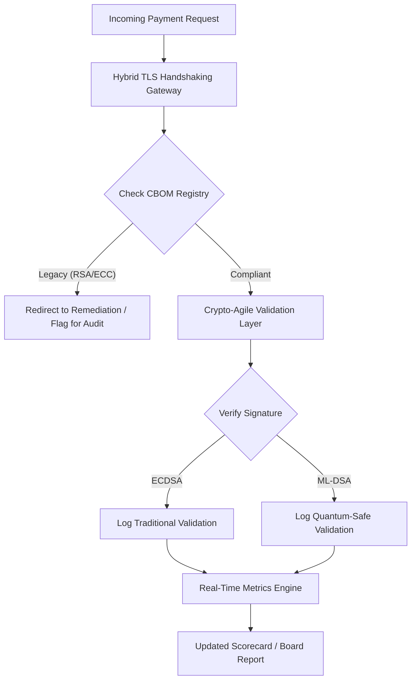

# Postkvantový bezpečnostní scorecard 2026: metrický rámec představenstva pro fiduciární kryptografickou agilitu

<aside class="post-lead" aria-label="Shrnutí článku">

<strong>TL;DR.</strong> Od června 2026 přešla postkvantová kryptografie (PQC) z experimentálního technického tématu na primární fiduciární povinnost. Představenstva musí nyní dohlížet na systematickou migraci staršího šifrování na standardy NIST FIPS 203 a 204, aby zmírnila systémová finanční a provozní rizika podle DORA.

<strong>Klíčové poznatky</strong>

<ul class="post-lead-takeaways">
  <li><strong>Sladění G20 a pevné termíny.</strong> Mezinárodní regulátoři stanovili konec dvacátých let jako pevný termín pro přechod na kvantově odolné systémy a vyžadují od institucí prokazatelný a měřitelný pokrok v migraci.</li>
  <li><strong>Cryptographic Bill of Materials (CBOM).</strong> Obdobně jako softwarový BOM je CBOM živá, automatizovaná inventura všech kryptografických aktiv, nezbytná pro zajištění viditelnosti napříč dodavatelským řetězcem.</li>
  <li><strong>Expozice Harvest-Now-Decrypt-Later (HNDL).</strong> Protivníci dnes aktivně zachycují a archivují šifrovaná data o velkoobchodních platbách s vysokou hodnotou; zmírnění tohoto rizika vyžaduje okamžité nasazení hybridních PQC architektur.</li>
  <li><strong>Fiduciární řízení skrze krypto-agilitu.</strong> Krypto-agilita je měřitelnou metrikou řízení. Schopnost vyměnit kryptografické primitivy bez přepracování jádra systému (pomocí knihoven jako KyberLib) je nyní odpovědností na úrovni představenstva podle SM&CR.</li>
</ul>

<strong>Související čtení:</strong> <a href="https://sebastienrousseau.com/2026-06-12-kyberlib-post-quantum-banking-migration-standards-code-2026">KyberLib a postkvantová migrace v bankovnictví v roce 2026</a>, <a href="https://sebastienrousseau.com/2023-11-19-crystals-kyber-the-safeguarding-algorithm-in-a-quantum-age/index.html">CRYSTALS-Kyber: ochranný algoritmus v kvantové éře</a>.

</aside>
Postkvantová bezpečnost už není výzkumný projekt. „Dohledové hodiny“ tikají směrem k vynucovacím termínům na konci dvacátých let. Finalizace [NIST FIPS 203 (ML-KEM)](https://csrc.nist.gov/pubs/fips/203/final) a [NIST FIPS 204 (ML-DSA)](https://csrc.nist.gov/pubs/fips/204/final) kodifikovala standardy pro zapouzdření klíčů a digitální podpisy.

Regulátoři dnes očekávají, že banky první třídy postoupí dál než k pilotním programům. V roce 2026 se pozornost přesunula k industrializaci těchto standardů. Neschopnost prokázat jasnou cestu k migraci nese významné regulatorní sankce podle [Digital Operational Resilience Act (DORA)](https://eur-lex.europa.eu/eli/reg/2022/2554/oj) a potenciální osobní odpovědnost ředitelů, kteří ignorují předvídatelnou hrozbu kvantového dešifrování.

## 01. Kvantový scorecard pro představenstvo

Následující metriky poskytují standardizovaný rámec, podle něhož mohou představenstva vyhodnocovat kvantovou připravenost a kryptografické zdraví v rámci celého korporátního a investičního bankovnictví (CIB).

### Tabulka 1: PQC scorecard — metriky a tolerance

| Metrika | Matematický vzorec | Tolerance schválené představenstvem | Riziko při překročení tolerance |
| ---- | ---- | ---- | ---- |
| **Inventory Completeness Percentage (ICP)** | (Identifikovaná kryptoaktiva / Celkem odhadnutá aktiva) × 100 | > 98 % | Stínové šifrování a slepá místa v datových tocích vysoce hodnotného clearingu. |
| **HNDL Exposure Rate (HER)** | (Dlouhodobá data na zastaralé kryptografii / Celkem dlouhodobá data) × 100 | < 5 % | Trvalá kompromitace obchodních tajemství, evidence státního dluhu a záznamů o velkoobchodních platbách. |
| **NIST Migration Progress Rate (MPR)** | (Systémy běžící na FIPS 203/204 / Celkem kritické systémy) × 100 | > 60 % (do konce roku 2026) | Nesoulad s regulací a vyloučení z protistran sladěných se zeměmi G20. |
| **Crypto-Agility Readiness Index (CARI)** | (Aplikace s abstrahovanými kryptovrstvami / Celkem jádrové aplikace) × 100 | > 85 % | Závažný technický dluh a neschopnost reagovat na budoucí ukončení podpory algoritmů. |

## 02. Cryptographic Bill of Materials (CBOM)

Metrika ICP je kalibrována komplexní **fází objevování CBOM**. Jde o automatizovaný proces, který identifikuje každý kryptografický endpoint v podniku.

- **Objevování endpointů:** Skenování interních a cloudových sítí na aktivní TLS relace pro identifikaci zastaralého použití RSA nebo ECC.
- **Inventura klíčů:** Mapování párů veřejných a soukromých klíčů na jejich vlastníky a přesné mapování dat expirace.
- **Mapování závislostí:** Identifikace knihoven a API třetích stran, které se opírají o vyřazené algoritmy.

Tato objevovací fáze vytváří jediný zdroj pravdy a umožňuje CISO reportovat kryptografické zdraví se stejnou granularitou jako finanční výkonnost.

## 03. Eliminace expozice HNDL u velkoobchodních plateb

Protivníci aktivně cílí na velkoobchodní platby a dlouhodobé korporátní databáze. Tyto útoky typu „Harvest-Now-Decrypt-Later“ (HNDL) zahrnují zachycení a archivaci dnes šifrovaného provozu.

I když dnes neexistuje kryptograficky relevantní kvantový počítač (CRQC), data zachycená nyní budou v budoucnu zranitelná. Zmírnění vyžaduje prioritní migraci dlouhodobých dat (např. identifikační záznamy, třicetileté dluhopisové smlouvy a právní archivy), což přímo snižuje metriku HER. Povýšení platebních kanálů na hybridní PQC-tradiční šifrování (s použitím ML-KEM vedle X25519) poskytuje okamžitou obranu proti archivním hrozbám.

## 04. Operacionalizace krypto-agility skrze dobře navržená rozhraní

Krypto-agilita se realizuje přes inženýrské abstrakce. Moderní knihovny jako [KyberLib](https://sebastienrousseau.com/2026-06-12-kyberlib-post-quantum-banking-migration-standards-code-2026) ukazují, jak mohou vývojáři implementovat kvantově odolné moduly bez přepisování celého aplikačního stacku.

- **Abstrahované wrappery:** Aplikace volají generickou funkci `encrypt()` nebo `sign()` namísto rutin specifických pro algoritmus.
- **Výměna za běhu:** Podkladový modul lze zaměnit z ECDSA na ML-DSA pomocí konfiguračních změn, nikoli složitými nasazeními kódu.

Tato architektura zajišťuje, že pokud bude konkrétní PQC algoritmus v budoucnu kompromitován, organizace dokáže přepnout v řádu hodin, nikoli let.

## 05. Workflow validace kvantově odolného ingressu

Následující diagram ilustruje životní cyklus dat vstupujících do bezpečnostního perimetru v kvantově agilním bankovním prostředí.

## Závěr

Kryptografický majetek banky první třídy už není záležitostí CISO. Je to fiduciární infrastruktura. NIST FIPS 203 a 204 stanovují algoritmy; článek 5 DORA vymezuje plochu odpovědnosti; SM&CR ji připíná na konkrétního vedoucího pracovníka. Výše uvedený scorecard — úplnost inventáře, expozice HNDL, pokrok migrace, krypto-agilita — dává představenstvu čtyři čísla, která potřebuje k řízení tohoto majetku, aniž by muselo číst kryptografický kód.

Číslem, na kterém záleží nejvíc, je expozice HNDL. Každý záznam zašifrovaný zastaralým algoritmem, který dnes leží v archivu velkoobchodních plateb, bude čitelný v den, kdy bude dodán první kryptograficky relevantní kvantový počítač. Odpočet je tichý a asymetrický: obránci mohou jednat pouze s daty, která drží, protivníci mohou jednat s daty, která už exfiltrovali před lety. Třicetiletá korporátní dluhopisová smlouva zašifrovaná RSA-2048 v roce 2024 je smlouva, která ztratí záruku důvěrnosti v den, kdy CRQC zahájí provoz.

[KyberLib](https://sebastienrousseau.com/2026-06-12-kyberlib-post-quantum-banking-migration-standards-code-2026) a jeho protějšky mění tuto úlohu z víceletého přepisu platformy na konfigurační změnu. Úkolem představenstva není psát kód. Úkolem představenstva je požadovat, aby Crypto-Agility Readiness Index — podíl jádrových aplikací za abstrahovaným kryptografickým rozhraním — překročil 85 % do dvanácti měsíců, a číst čtvrtletní scorecard.

<aside class="author-card" aria-label="O autorovi"><strong class="author-card-name"><a href="/about/index.html">Sebastien Rousseau</a></strong>Senior bankovní technolog píšící o aplikované AI, migraci na ISO 20022, postkvantové kryptografii pro finanční služby a o strukturální proměně velkoobchodních plateb.Více než 20 let zkušeností ve společnostech HSBC Commercial & Investment Bank, PayPal, Barclays a Shazam. <a href="https://www.linkedin.com/in/sebastienrousseau/" rel="external noopener">LinkedIn</a> &middot; <a href="https://github.com/sebastienrousseau" rel="external noopener">GitHub</a></aside>

Naposledy revidováno <time datetime="2026-06-29">2026-06-29</time>.

