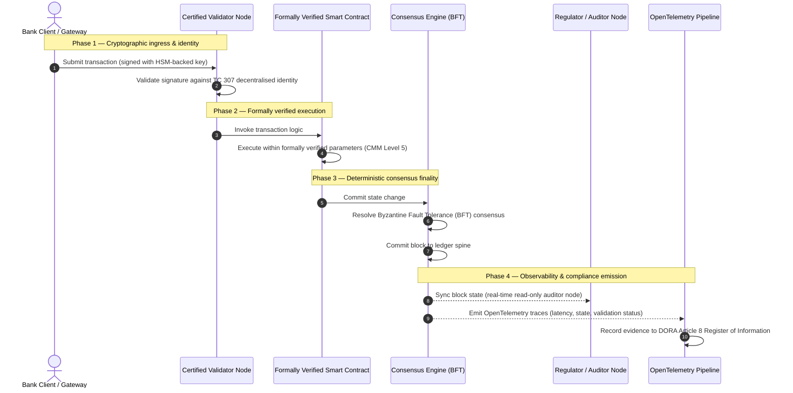

# Od důkazu k pravdě: proč certifikované blockchainy určí příští éru bankovní důvěry

## Strategické shrnutí (to podstatné)

Velkoobchodní bankovnictví a globální transakce se v roce 2026 nacházejí v historickém bodě zlomu. Jak finanční služby přecházejí na nativně digitální, realtimové zúčtovací sítě a umělá inteligence zavádí pravděpodobnostní nedeterminismus, tradiční analogové, retrospektivní modely ujištění (jako statické audity založené na entitě) přestávají splňovat moderní požadavky na řízení rizik a fiduciární povinnosti.

Technická komise ISO/IEC TC 307 stanovila normalizovaný základ pro technologie distribuovaných registrů. Skutečné institucionální přijetí však vyžaduje přechod od popisných pokynů k předepisujícímu, nezávisle certifikovatelnému ujištění blockchainu. Hodnocením správy registru, integrity konsenzu, bezpečnosti chytrých kontraktů a kryptografické agility podle přísného pětiúrovňového modelu zralosti schopností (CMM) mohou banky přejít od roztříštěných předpokladů specifických pro dodavatele k certifikovatelné, představenstvem auditovatelné finanční pravdě.

## Klíčové poznatky

* **Fiduciární třecí mezera**: dnes umíme certifikovat banku (Basel III), cloud (ISO 27001) i systémy správy AI (ISO 42001), ale ještě neumíme certifikovat distribuovaný registr, který stále více určuje, co je pravda. Tato asymetrie je zásadní provozní zranitelností.  
* **DORA vynucuje přímou fiduciární odpovědnost**: podle článku 5 DORA nesou představenstva bank přímou, nedelegovatelnou osobní odpovědnost za provozní odolnost všech nasazení třetích stran a registrů, s přísnými osobními sankcemi v rámci režimu SM&CR za selhání.  
* **Auditní páteř AI**: tam, kde strojové učení produkuje neopakovatelné, pravděpodobnostní výsledky, poskytuje certifikovaný blockchain deterministické zachycení stavu. Zaznamenávání verzí modelů, vstupů a validačních rozhodnutí on-chain splňuje ISO 42001 a standardy řízení modelového rizika.  
* **Index certifikovaných blockchainů**: tento index formalizuje správu, konsenzus, chytré kontrakty a pozorovatelnost do ověřitelné, auditně připravené výsledkové karty na škále CMM od 0 do 5 a překládá inženýrské metriky do představenstvem schválených prohlášení o rizikovém apetitu.

## 01. Fiduciární třecí mezera v digitálním bankovnictví

V klasickém bankovnictví je důvěra vztahová, institucionální a retrospektivní. Spoléhá na nezávislé auditory třetích stran, kteří prověřují finanční stav v pevných okamžicích a odsouhlasují rozdíly mezi silami bilaterálních registrů. Na realtimových, API řízených trzích roku 2026 tento model zavádí prohibitivní latence a strukturální rizika.

Když se transakce vypořádávají okamžitě, vnitrodenní likviditní fondy jsou dynamicky řízeny API branami a vlastnictví aktiv je tokenizováno napříč sdílenými registry, stávají se retrospektivní audity forenzními cvičeními spíše než preventivními kontrolami. Fiduciáři se již nemohou spoléhat pouze na certifikaci právního subjektu. Musí certifikovat samotný digitální substrát.

V současnosti banky fungují v prostředí do očí bijící architektonické asymetrie:

1. **Certifikovaná cloudová infrastruktura**: hardwarové uzly, virtualizované kontejnery a fyzická datová centra jsou validovány vůči kontrolám ISO/IEC 27001 a SOC 2 Type II.  
2. **Certifikované procesy řízení**: politiky provozního rizika, plány kontinuity činnosti a algoritmická nasazení podléhají přísným rizikovým rámcům.  
3. **Necertifikované registrové motory**: distribuované konsenzuální mechanismy, dodavatelské řetězce validačních uzlů, hranice chytrých kontraktů a modely správy sítě jsou ponechány necertifikovaným, zakázkovým nebo konsorciálně specifickým předpokladům.

Tato asymetrie je zásadním bodem selhání. Banka může provozovat validovanou aplikaci uvnitř bezpečného, ISO 27001 certifikovaného cloudového kontejneru, ale pokud tento kontejner zapisuje do distribuovaného registru s centralizovanou kontrolou validátorů, zranitelnými konsenzuálními parametry nebo neauditovanými chytrými kontrakty, je integrita transakce ohrožena. Aby se tato mezera překlenula, musí se samotný registrový motor stát certifikovatelným objektem ujištění.

## 02. Normalizační základ ISO/IEC TC 307

Zásadní práci nezbytnou pro normalizaci distribuovaných registrů vykonává technická komise ISO/IEC TC 307 (Technologie blockchainu a distribuovaných registrů). Namísto toho, aby blockchain považovala za izolovaný technický protokol, přistupuje k němu TC 307 jako k institucionální infrastruktuře důvěry a organizuje svou práci kolem pěti základních pilířů:

1. **Taxonomie a slovník (ISO 22739)**: stanoví společnou nomenklaturu a zajišťuje konzistentní právní a provozní definice napříč jurisdikcemi, finančními schématy a institucemi.  
2. **Referenční architektura (ISO/TR 23245)**: definuje hranice, vrstvy, datové toky a funkční komponenty vyhovujícího systému distribuovaného registru.  
3. **Bezpečnost, soukromí a chytré kontrakty (ISO/TR 23244 / ISO 23613)**: stanoví základní bezpečnostní pokyny pro systémy digitálních aktiv a podrobně popisuje osvědčené postupy pro zmírňování zranitelností chytrých kontraktů a správu jejich životního cyklu.  
4. **Rámce interoperability**: řeší mechanismy výměny dat a aktiv mezi heterogenními registrovými sítěmi a brání vzniku izolovaných tokenizovaných sil.  
5. **Decentralizovaná identita a kotvy důvěry**: integruje kryptografické identifikátory založené na registru s formálními infrastrukturami veřejných klíčů (PKI) a státem autorizovanými registry.

Souhrnně TC 307 signalizuje přechod DLT od zakázkové inženýrské volby k normalizované architektonické disciplíně. TC 307 však zůstává převážně popisná. Definuje, jak vypadá excelence (pokyny), ale neposkytuje předepisující verifikační protokol (ujištění), který rizikoví pracovníci a dohledové orgány potřebují k autorizaci produkčních nasazení kritických nebo důležitých funkcí (CIF).

## 03. Pokyny versus ujištění: fiduciární rozlišení

Účastníci finančních trhů nenasazují technologii proto, že je inovativní nebo elegantní; nasazují ji, když ji lze řídit, auditovat, obhájit a odsouhlasit s požadavky na kapitálové rezervy. Proto se normalizace v bankovnictví přirozeně rozpadá do dvou vrstev:

* **Pokyny (rámec)**: nastiňují osvědčené postupy, referenční cíle a architektonické směrnice (např. ISO/IEC TC 307, rámce NIST).  
* **Ujištění (důkaz)**: poskytuje nezávislé, průběžné a třetí stranou ověřitelné důkazy, že rámec je implementován a funguje podle návrhu (např. certifikace ISO 27001, audity SOC 2, regulatorní prověrky).

Spoléhat se na necertifikovaný konsenzus registru a přitom certifikovat cloudovou infrastrukturu je kritická regulatorní mezera. „Neměnný" blockchain není nutně „institucionálně důvěryhodný". Neměnnost zaručuje pouze to, že vložená data zůstanou nezměněna; neověřuje, zda jsou validační uzly bezpečné, zda je konsenzuální protokol odolný vůči koluzi, zda je logika chytrých kontraktů matematicky správná nebo zda správa kryptografických klíčů splňuje postkvantové mandáty.

Aby tuto mezeru uzavřel, Index certifikovaných blockchainů 2026 formalizuje tyto požadavky do kvantifikovatelného modelu zralosti schopností (CMM), namapovaného na globální bankovní regulace.

## 04. Index certifikovaných blockchainů 2026

Aby vrcholovému vedení umožnil hodnotit a certifikovat jejich registrové platformy, strukturuje tento index infrastrukturu distribuovaného registru do pěti auditovatelných provozních vrstev, hodnocených na škále CMM od 0 do 5.

## Tabulka 1: architektura Indexu certifikovaných blockchainů

| Vrstva indexu | Úroveň zralosti (CMM) | Technická a provozní metrika | Regulatorní / fiduciární kontrolní reference |
| ---- | ---- | ---- | ---- |
| **Správa registru** | **Úroveň 0**: ad hoc konsorcium**Úroveň 3**: automatizované prověřování a rotace validátorů**Úroveň 5**: decentralizované, víceúčastnické kryptografické ukotvení identity | % validačních uzlů provozovaných prověřenými finančními subjekty; průměrná doba řešení sporů validátorů; geografické rozložení uzlů | **DORA článek 5** (Správa a organizace); **CPMI-IOSCO PFMI Princip 2** (Správa) a **Princip 3** (Rámec komplexního řízení rizik) |
| **Integrita konsenzu** | **Úroveň 0**: jediný uzel nebo neprůhledný PoW**Úroveň 3**: auditovaný BFT s deterministickou finalitou**Úroveň 5**: mnohojurisdikční, formálně ověřený konsenzus s průběžným monitorováním latence | max. tolerovatelná latence konsenzu; práh odolnosti vůči koluzi; SLA dostupnosti při simulovaném rozdělení uzlů | **DORA článek 6** (Rámec řízení rizik ICT); **CPMI-IOSCO PFMI Princip 8** (Finalita vypořádání) |
| **Identita a kryptografie** | **Úroveň 0**: slabé klíče RSA / ECDSA**Úroveň 3**: vícepodpis se správou klíčů podporovanou HSM**Úroveň 5**: kvantově bezpečné hybridní klíče (FIPS 203 ML-KEM) a brány soukromí s nulovou znalostí | % transakcí registru podepsaných klíči podporovanými HSM; skóre připravenosti na migraci PQC; latence důkazů ZK | **NIST FIPS 203 / 204**; **ISO/IEC 27001** (Řízení bezpečnosti informací) |
| **Ujištění chytrých kontraktů** | **Úroveň 0**: neauditované skripty Solidity**Úroveň 3**: automatizovaná validace kompilátoru a externí audit**Úroveň 5**: formálně ověřené, neměnné chytré kontrakty s aktualizacemi typu jistič | % chytrých kontraktů s matematickou formální verifikací; počet varování kompilátoru; pokrytí skenů zranitelností | **Pokyny EBA k outsourcingu** (odstavce 81, 113-117); **DORA článek 30** (Minimální smluvní ujednání) |
| **Audit a pozorovatelnost** | **Úroveň 0**: ruční sběr logů**Úroveň 3**: strukturované stopy OTel a auditorské uzly jen pro čtení**Úroveň 5**: automatizované, průběžné odsouhlasení s registrem podle článku 8 | % transakcí pokrytých stopami OpenTelemetry; latence od potvrzení bloku po synchronizaci auditorského uzlu | **BCBS 239** (Agregace rizikových dat); **DORA článek 8** (Registr informací / schémata ITS) |

## Tabulka 2: klíčové signály důvěry namapované na globální bankovní standardy

| Signál / měřítko | Metrika | Dopad na bankovní platformy | Regulatorní zdroj |
| ---- | ---- | ---- | ---- |
| **Pokrok ISO/IEC TC 307** | Přechod od technických zpráv ISO/TR k formálním certifikačním schématům | Zavádí první normalizovaný rámec pro certifikaci motorů distribuovaných registrů | **ISO/IEC JTC 1 / SC 44** (Technologie distribuovaných registrů) |
| **Prototypová fáze Projektu Agorá** | Přes 40 zúčastněných komerčních bank; test jednotného registru tokenizovaných vkladů | Přesouvá přeshraniční zúčtování od zpráv (SWIFT) k atomickému tokenizovanému vypořádání | **Innovation Hub Banky pro mezinárodní platby (BIS)** |
| **Audit třetí strany DORA článek 30** | 100 % poskytovatelů uzlů a hostitelů infrastruktury auditováno podle bezpečnostních kritérií | Eliminuje „stínové validační uzly"; nařizuje úplnou transparentnost dodavatelského řetězce | **Evropské orgány dohledu (ESA)** |
| **ISO/IEC 42001 (správa AI)** | Logy modelů a trénování AI učiněny kryptograficky neměnnými on-chain | Využívá blockchain jako neměnný důkazní registr („auditní páteř") pro strojové učení | **ISO/IEC 42001:2023** (Informační technologie — Umělá inteligence) |
| **Kapitálová přiměřenost Basel III** | Snížení kapitálových polštářů pro provozní riziko na základě zdokumentovaného snížení složitosti | Normalizované rámce provozního rizika přímo zohledňují ověřenou odolnost registru | **Basilejský výbor pro bankovní dohled (BCBS)** |

## 05. „Auditní páteř" AI: pravděpodobnostní inteligence na deterministické infrastruktuře

Jednou z nejmocnějších strategických rolí certifikovaného blockchainu v roce 2026 je působit jako **„auditní páteř"** pro nasazení umělé inteligence. Moderní finanční systémy jsou stále více pravděpodobnostní. Kreditní skóring, detekce podvodů v reálném čase, algoritmické obchodování a autonomní interakce se zákazníky jsou poháněny modely strojového učení, které se vyvíjejí, driftují a přizpůsobují v čase. Tyto modely jsou nedeterministické: při stejném vstupu ve dvou různých okamžicích mohou kvůli dynamickým vahám a průběžnému trénování produkovat odlišné výstupy.

Tento nedeterminismus přináší hlubokou výzvu v oblasti správy podle **ISO/IEC 42001 (správa AI)** a standardů řízení modelového rizika (MRM) (jako je **SR 11-7 amerického Federálního rezervního systému** a **SS1/23 britského PRA**): *jak auditovat, vysvětlit a obhájit rozhodnutí, která nejsou striktně reprodukovatelná?*

Certifikovaný distribuovaný registr poskytuje deterministickou protiváhu. Tam, kde modely AI fungují pravděpodobnostně, certifikovaný blockchain zaznamenává jejich parametry deterministicky a vytváří nezměnitelnou důkazní páteř:

* **Verzování modelů a ukotvení vah**: každá nasazená verze modelu, její přiřazené váhy a kontrolní součty jejích trénovacích dat jsou při sestavení zahašovány a zapsány do registru, čímž splňují požadavky dodavatelského řetězce **SLSA Level 3**.  
* **Kontextové logování vstupů**: když model AI provede kritické rozhodnutí (např. schválí půjčku nebo označí transakci), přesné kontextové vstupy a haše modelu se zapíší do registru a vytvoří historii odolnou proti manipulaci.  
* **Auditovatelnost bez přístupu ke kódu**: pokud se regulátor zeptá „proč váš model zamítl tuto žádost o úvěr 3. června?", banka nemusí odhalovat svůj proprietární kód ani se pokoušet znovu vytvořit přesný stav modelu. Předloží kryptograficky podepsaný on-chain záznam vstupů, vah a stavu validace.

Ukotvením pravděpodobnostních rozhodnutí modelů strojového učení k deterministickému konsenzu certifikovaného blockchainu vytváří instituce obhajitelnou, rekonstruovatelnou a nezávisle ověřitelnou časovou osu automatizovaných akcí.

## 06. Vizualizace certifikovaného toku od konsenzu k auditu

Následující sekvenční diagram ilustruje životní cyklus transakce procházející certifikovanou blockchainovou platformou a ukazuje, jak se validační brány, integrita konsenzu, provádění chytrých kontraktů a emise telemetrie propojují, aby vytvořily regulatorní důkaz připravený pro představenstvo:

Kritická cesta této transakční sekvence vyžaduje, aby každý krok validace, provádění a konsenzu byl kryptograficky podepsán, čímž se zajistí provenience od začátku do konce. Auditorský uzel regulátora synchronizuje stav bloků v reálném čase, čímž odpadá potřeba retrospektivního, ručního finančního odsouhlasení.

## 07. Příručka představenstva pro vrcholové manažery

Aby úspěšně zvládli přechod od organizační důvěry k infrastrukturní důvěře, měli by vedoucí pracovníci a vrcholový management bank neprodleně provést čtyři klíčové direktivy:

1. **Zavést povinné audity registru v řízení podnikových rizik (ERM)**: prosadit politiku, podle níž žádná platforma distribuovaného registru — soukromá, veřejná ani konsorciální — nesmí být nasazena pro kritické nebo důležité funkce (CIF), aniž by byla auditována vůči pětivrstvé **architektuře Indexu certifikovaných blockchainů** (minimálně CMM Úroveň 3).  
2. **Integrovat blockchainy jako důkazní páteř AI podle ISO 42001**: pověřit ředitele pro rizika a hlavního architekta AI integrací všech vysoce významných modelů strojového učení s certifikovaným blockchainem a vytvořit auditní registr verzí modelů, vah, vstupů a rozhodnutí odolný proti manipulaci.  
3. **Auditovat dodavatelský řetězec validačních uzlů (DORA článek 30)**: požadovat, aby oddělení nákupu auditovalo všechny třetí strany hostující validační uzly nebo spravující cloudový hosting pro sítě DLT, a nařídit stejné standardy kybernetické bezpečnosti a provozní odolnosti, jaké platí pro interní cloudové uzly banky.  
4. **Sladit architektury registru s CPMI-IOSCO a BCBS 239**: pověřit tým platformového inženýrství sladěním výstupní telemetrie registru přímo s požadavky na vykazování dat podle **BCBS 239** a zajistit, aby parametry konsenzu a finality vypořádání striktně splňovaly **Principy 8 a 9 CPMI-IOSCO**.

## 08. Často kladené otázky

**Je ISO/IEC TC 307 certifikační standard?**  
Ne. ISO/IEC TC 307 je technická komise, která stanoví slovník, referenční architektury a bezpečnostní pokyny. Ačkoli definuje, „jak vypadá excelence" (pokyny), odvětví musí tyto dokumenty operacionalizovat do formálních, auditovatelných certifikačních schémat (ujištění), aby uspokojilo bankovní dohledové orgány.

**Jak certifikovaný blockchain podporuje soulad s DORA?**  
Podle článku 5 DORA nesou představenstva bank přímou osobní odpovědnost za technologickou odolnost. Certifikovaný blockchain poskytuje ověřitelné kryptografické důkazy o integritě konsenzu, kontrole dodavatelského řetězce validátorů a bezpečnosti chytrých kontraktů, čímž dává členům představenstva dokumentovatelné „přiměřené kroky" potřebné k obraně proti nárokům na osobní odpovědnost v rámci SM&CR.

Jaký je rozdíl mezi tradičním auditem registru a auditem certifikovaného blockchainu?  
Tradiční audit je retrospektivní: ověřuje ruční záznamy a statické soubory poté, co byly transakce vypořádány. Audit certifikovaného blockchainu je průběžný a probíhá v reálném čase; validační uzly, konsenzuální motor BFT a formálně ověřené chytré kontrakty jsou certifikovány k deterministickému provádění transakcí a vysílají strukturovanou telemetrii (OpenTelemetry), která průběžně validuje zdraví systému.

Lze veřejné blockchainy certifikovat pro bankovní použití?  
Ve většině jurisdikcí čistě bezpovolenkové veřejné blockchainy nesplňují bankovní regulace kvůli chybějícímu ověření identity validátorů, nepředvídatelným transakčním nákladům a nedeterministické finalitě (např. pravděpodobnostní forky proof-of-work/stake). Certifikované blockchainy v bankovnictví obvykle využívají podnikové povolenkové architektury nebo silně regulované veřejno-hybridní architektury, kde jsou provozovatelé validačních uzlů identifikované a auditované finanční subjekty.

## 09. Reference

* Basilejský výbor pro bankovní dohled (BCBS), 2013. *Principles for effective risk data aggregation and reporting (BCBS 239)*. Basilej: Banka pro mezinárodní platby. Dostupné z: [https://www.bis.org/publ/bcbs239.pdf](https://www.bis.org/publ/bcbs239.pdf).  
* Committee on Payments and Market Infrastructures a Technical Committee of the International Organization of Securities Commissions (CPMI-IOSCO), 2012. *Principles for financial market infrastructures*. Basilej: Banka pro mezinárodní platby. Dostupné z: [https://www.bis.org/cpmi/publ/d101a.pdf](https://www.bis.org/cpmi/publ/d101a.pdf).  
* Evropský orgán pro bankovnictví (EBA), 2019. *EBA/GL/2019/02 — Guidelines on outsourcing arrangements*. Paříž: EBA. Dostupné z: [https://www.eba.europa.eu/regulation-and-policy/internal-governance/guidelines-on-outsourcing-arrangements](https://www.eba.europa.eu/regulation-and-policy/internal-governance/guidelines-on-outsourcing-arrangements).  
* Evropský parlament a Rada Evropské unie, 2022. *Nařízení (EU) 2022/2554 o digitální provozní odolnosti finančního sektoru (DORA)*. Brusel: Úřední věstník Evropské unie. Dostupné z: [https://eur-lex.europa.eu/legal-content/CS/TXT/?uri=CELEX%3A32022R2554](https://eur-lex.europa.eu/legal-content/CS/TXT/?uri=CELEX%3A32022R2554).  
* ISO/IEC JTC 1/SC 42, 2023. *ISO/IEC 42001:2023 — Information technology — Artificial intelligence — Management system*. Ženeva: Mezinárodní organizace pro normalizaci. Dostupné z: [https://www.iso.org/standard/81230.html](https://www.iso.org/standard/81230.html).  
* Technická komise ISO/IEC 307, 2020. *ISO/IEC 22739:2020 — Blockchain and distributed ledger technologies — Vocabulary*. Ženeva: Mezinárodní organizace pro normalizaci. Dostupné z: [https://www.iso.org/standard/73771.html](https://www.iso.org/standard/73771.html).  
* National Institute of Standards and Technology (NIST), 2026. *First Three Finalized Post-Quantum Encryption Standards (FIPS 203, 204, and 205)*. Gaithersburg: U.S. Department of Commerce. Dostupné z: [https://www.nist.gov/news-events/news/2024/08/nist-releases-first-3-finalized-post-quantum-encryption-standards](https://www.nist.gov/news-events/news/2024/08/nist-releases-first-3-finalized-post-quantum-encryption-standards).
