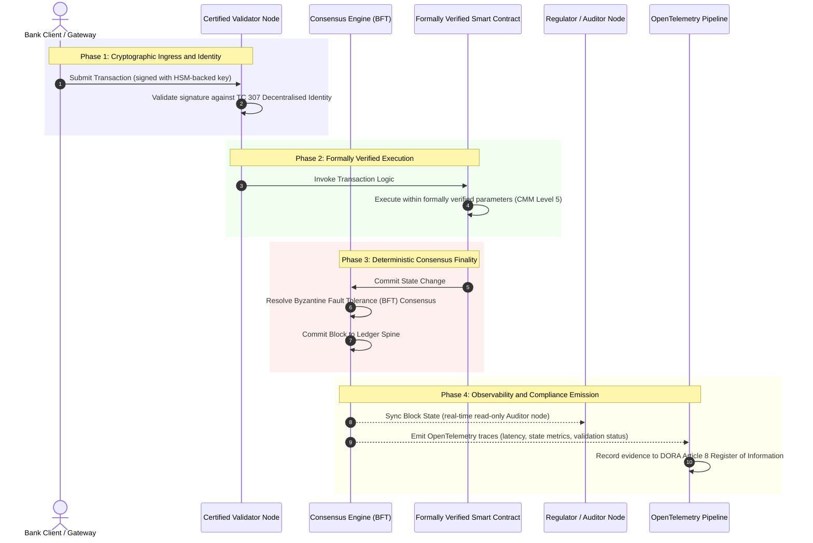

# Od důkazů k pravdě: Proč certifikované blockchainy vymezí novou éru bankovní důvěry

**Neměnné není totéž co důvěryhodné.** Jak velkoobchodní bankovnictví přechází na vypořádání v reálném čase a pravděpodobnostní AI, stala se účetní kniha, která rozhoduje o tom, co je pravda, jedinou vrstvou, kterou banky stále nedokážou certifikovat. Certifikují subjekt podle Basel III, cloud podle ISO 27001 a svou AI podle ISO 42001, ale distribuovaná účetní kniha, její správa, konsenzus, kryptografie a chytré kontrakty jsou ponechány na předpokladech specifických pro dodavatele. Tento report tvrdí, že uzavření této fiduciární mezery vyžaduje přechod od pokynů ISO/IEC TC 307 k preskriptivnímu ujištění: bodování účetní knihy podle pětiúrovňového indexu certifikovaného blockchainu, který mění technické metriky v pravdu auditovatelnou představenstvem a obhajitelnou dle DORA.

<!-- lead-start -->
<aside class="post-lead" aria-label="Shrnutí článku">

<strong>Shrnutí.</strong> Banky certifikují subjekt, cloud i svou AI, ale ne účetní knihu, která stále více určuje, co je pravda. ISO/IEC TC 307 poskytuje pokyny, nikoli ujištění. Pětiúrovňový index certifikovaného blockchainu boduje správu účetní knihy, integritu konsenzu, identitu a kryptografii, ujištění chytrých kontraktů a pozorovatelnost podle modelu zralosti schopností, čímž uzavírá fiduciární mezeru a dává pravděpodobnostní AI deterministickou páteř auditu.

<strong>Klíčová zjištění</strong>

<ul class="post-lead-takeaways">
  <li><strong>Fiduciární třecí mezera.</strong> Banku (Basel III), cloud (ISO 27001) a systém správy AI (ISO 42001) lze certifikovat; distribuovanou účetní knihu, která rozhoduje o tom, co je pravda, zatím nikoli. Tato asymetrie je aktivní provozní zranitelností.</li>
  <li><strong>DORA to činí osobním.</strong> Podle DORA Article 5 nesou představenstva bank přímou, nepřenositelnou odpovědnost za odolnost nasazení třetích stran a účetních knih, s osobními sankcemi SM&amp;CR za selhání.</li>
  <li><strong>Páteř auditu AI.</strong> Strojové učení je nereprodukovatelné; certifikovaný blockchain deterministicky zachycuje verze modelů, vstupy a validační rozhodnutí přímo na řetězci, čímž vyhovuje ISO 42001 a standardům řízení rizik modelů.</li>
  <li><strong>Index certifikovaného blockchainu.</strong> Správa, konsenzus, kryptografie, chytré kontrakty a pozorovatelnost se stávají hodnoticí kartou CMM od 0 do 5, která převádí technické metriky do prohlášení o rizikovém apetitu schválených představenstvem.</li>
</ul>

<strong>Související četba:</strong> <a href="https://sebastienrousseau.com/2026-07-02-certified-blockchains-banking-trust-tc307-assurance-2026">Certifikované blockchainy a bankovní důvěra: ujištění TC 307</a>, <a href="https://sebastienrousseau.com/2026-07-24-global-payments-outlook-operating-model-risk-revenue">Globální výhled plateb 2026</a>.

</aside>
<!-- lead-end -->

> **Shrnutí pro vedení**
>
> - **Velkoobchodní bankovnictví je v bodě zlomu.** Clearing v reálném čase a pravděpodobnostní AI rozbíjejí analogový, retrospektivní model ujištění: statické, na subjektu založené audity již nesplňují moderní požadavky řízení rizik ani fiduciární požadavky.
> - **TC 307 je základní úroveň, nikoli certifikát.** ISO/IEC TC 307 standardizoval slovník, referenční architekturu a bezpečnostní pokyny pro distribuované účetní knihy, ale je popisný. Definuje, jak vypadá dobrý stav; neposkytuje preskriptivní ověření, které pracovníci řízení rizik a dohledové orgány potřebují k autorizaci produkčního nasazení.
> - **Ujištění znamená bodovat účetní knihu.** Správa, integrita konsenzu, bezpečnost chytrých kontraktů a kryptografická agilita, bodované podle striktního pětiúrovňového modelu zralosti schopností, posouvají banky od záplatovaných, na dodavateli závislých předpokladů k certifikovatelné, představenstvem auditovatelné finanční pravdě.
> - **Účetní kniha je páteří auditu pro AI.** Ukotvení verzí modelů, vstupů a validačních rozhodnutí k deterministickému konsenzu dává nereprodukovatelnému strojovému učení obhajitelný, rekonstruovatelný důkazní záznam podle ISO 42001, SR 11-7 a PRA SS1/23.

## Fiduciární třecí mezera v digitálním bankovnictví

V klasickém bankovnictví je důvěra vztahová, institucionální a retrospektivní. Závisí na nezávislých auditorech třetích stran, kteří kontrolují finanční stav ve statických časových bodech a odsouhlasují nesrovnalosti napříč bilaterálními sily účetních knih. Na trzích roku 2026, řízených v reálném čase a přes API, tento model zavádí neúnosné latence a strukturální rizika.

Když se transakce vypořádávají okamžitě, vnitrodenní likviditní fondy jsou dynamicky spravovány API branami a vlastnictví aktiv je tokenizováno napříč sdílenými účetními knihami, stávají se retrospektivní audity spíše forenzními cvičeními než preventivními kontrolami. Fiduciáři se již nemohou spoléhat pouze na certifikaci korporátního subjektu. Musí certifikovat samotný digitální substrát.

V současnosti banky fungují za nápadné architektonické asymetrie:

1. **Certifikovaná cloudová infrastruktura**: Hardwarové uzly, virtualizované kontejnery a fyzická datacentra jsou validovány podle kontrol ISO/IEC 27001 a SOC 2 Type II.  
2. **Certifikované řídicí procesy**: Zásady operačního rizika, plány kontinuity provozu a algoritmická nasazení jsou řízeny podle striktních rizikových rámců.  
3. **Necertifikované enginy účetních knih**: Klíčové mechanismy distribuovaného konsenzu, dodavatelské řetězce validačních uzlů, hranice chytrých kontraktů a modely správy sítě jsou ponechány na necertifikovaných, vlastních nebo konsorciálně specifických předpokladech.

Tato asymetrie je hlavním bodem selhání. Banka může provozovat validovanou aplikaci uvnitř zabezpečeného, podle ISO 27001 certifikovaného cloudového kontejneru, ale pokud tento kontejner zapisuje do distribuované účetní knihy s centralizovanou kontrolou validátorů, zranitelnými parametry konsenzu nebo neauditovanými chytrými kontrakty, je integrita transakce narušena. K překlenutí této mezery se musí engine účetní knihy sám stát certifikovatelným objektem ujištění.

## Standardizační základ ISO/IEC TC 307

Základní práci potřebnou ke standardizaci distribuovaných účetních knih zavádí ISO/IEC Technická komise 307 (TC 307\) (Blockchain a technologie distribuovaných účetních knih). Namísto toho, aby k blockchainu přistupovala jako k izolovanému technickému protokolu, TC 307 jej řeší jako institucionální infrastrukturu důvěry a organizuje svou práci do pěti základních pilířů:

1. **Taxonomie a slovník (ISO 22739\)**: Zavádí společnou nomenklaturu, čímž zajišťuje konzistentní právní a provozní definice napříč různými jurisdikcemi, finančními schématy a institucemi.  
2. **Referenční architektura (ISO/TR 23245\)**: Definuje hranice, vrstvy, datové toky a funkční komponenty vyhovujícího systému distribuované účetní knihy.  
3. **Bezpečnost, soukromí a chytré kontrakty (ISO/TR 23244 / ISO 23613\)**: Zavádí základní bezpečnostní pokyny pro systémy digitálních aktiv a podrobně popisuje osvědčené postupy pro zmírňování zranitelností chytrých kontraktů a správu jejich životního cyklu.  
4. **Rámce interoperability**: Řeší mechanismy výměny dat a aktiv mezi heterogenními sítěmi účetních knih a předchází vzniku izolovaných tokenizovaných sil.  
5. **Decentralizovaná identita a kotvy důvěry**: Integruje kryptografické identifikátory založené na účetní knize s formálními infrastrukturami veřejných klíčů (PKI) a státem autorizovanými registry.

Souhrnně TC 307 signalizuje přechod DLT z vlastní inženýrské volby ke standardizované architektonické disciplíně. TC 307 však zůstává primárně popisný. Definuje, jak vypadá dobrý stav (pokyny), ale neposkytuje preskriptivní ověřovací protokol (ujištění), který pracovníci řízení rizik a dohledové orgány vyžadují k autorizaci produkčního nasazení kritických nebo důležitých funkcí (CIFs).

## Pokyny vs. ujištění: fiduciární rozlišení

Účastníci finančního trhu nenasazují technologii proto, že je inovativní nebo elegantní; nasazují ji tehdy, když ji lze řídit, auditovat, obhájit a odsouhlasit s požadavky na kapitálové rezervy. Proto se standardizace v bankovnictví přirozeně rozkládá do dvou vrstev:

* **Pokyny (rámec)**: Nastiňují osvědčené postupy, referenční cíle a architektonické směrnice (např. ISO/IEC TC 307, rámce NIST).  
* **Ujištění (důkaz)**: Poskytuje nezávislý, kontinuální a třetí stranou ověřitelný důkaz, že je rámec implementován a funguje podle návrhu (např. certifikace ISO 27001, audity SOC 2, regulatorní kontroly).

Spoléhat se na necertifikovaný konsenzus účetní knihy a přitom certifikovat cloudovou infrastrukturu je kritická regulatorní mezera. Blockchain, který je „neměnný", není nutně „institucionálně důvěryhodný". Neměnnost pouze zaručuje, že vložená data zůstanou nezměněna; neověřuje, že jsou validační uzly zabezpečené, že je konsenzuální protokol odolný vůči koluzi, že je logika chytrého kontraktu matematicky správná ani že správa kryptografických klíčů vyhovuje postkvantovým mandátům.

K uzavření této mezery formalizuje index certifikovaného blockchainu 2026 tyto požadavky do kvantifikovatelného modelu zralosti schopností (CMM) navázaného na globální bankovní regulace.

## Index certifikovaného blockchainu 2026

Aby vrcholové vedení mohlo hodnotit a certifikovat své platformy účetních knih, strukturuje tento index infrastrukturu distribuované účetní knihy do pěti auditovatelných provozních vrstev bodovaných na škále CMM od 0 do 5.

### Tabulka 1: Architektura indexu certifikovaného blockchainu

| Vrstva indexu | Úroveň zralosti schopností (CMM) | Technická a provozní metrika | Regulatorní / fiduciární kontrolní reference |
| ---- | ---- | ---- | ---- |
| **Správa účetní knihy** | **Level 0**: Ad hoc konsorcium**Level 3**: Automatizované prověřování a rotace validátorů**Level 5**: Decentralizované, víceúčastnické kryptografické ukotvení identity | % validačních uzlů provozovaných prověřenými finančními subjekty; průměrná doba do vyřešení sporů validátorů; geografické rozložení uzlů | **DORA Article 5** (Správa a organizace); **CPMI-IOSCO PFMI Principle 2** (Správa) & **Principle 3** (Rámec pro komplexní řízení rizik) |
| **Integrita konsenzu** | **Level 0**: Jednouzlový nebo neprůhledný POW**Level 3**: Auditovaný BFT s deterministickou neodvolatelností**Level 5**: Multijurisdikční, formálně ověřený konsenzus s kontinuálním monitoringem latence | Maximální tolerovatelná latence konsenzu; práh odolnosti vůči koluzi; SLA dostupnosti při simulovaném rozdělení uzlů | **DORA Article 6** (Rámec řízení ICT rizik); **CPMI-IOSCO PFMI Principle 8** (Neodvolatelnost vypořádání) |
| **Identita & kryptografie** | **Level 0**: Slabé klíče RSA / ECDSA**Level 3**: Multi-sig se správou klíčů podpořenou HSM**Level 5**: Kvantově bezpečné hybridní klíče (FIPS 203 ML-KEM) a brány soukromí s nulovými znalostmi | % transakcí účetní knihy podepsaných klíči podpořenými HSM; skóre připravenosti na migraci PQC; latence ZK-důkazu | **NIST FIPS 203 / 204**; **ISO/IEC 27001** (Řízení bezpečnosti informací) |
| **Ujištění chytrých kontraktů** | **Level 0**: Neauditované skripty v Solidity**Level 3**: Automatizovaná validace kompilátorem & externí audit**Level 5**: Formálně ověřené, neměnné chytré kontrakty s upgrady typu pojistka | % chytrých kontraktů s matematickou formální verifikací; počet varování kompilátoru; pokrytí skenováním zranitelností | **EBA Guidelines on Outsourcing Arrangements** (Odstavce 81, 113-117); **DORA Article 30** (Minimální smluvní ustanovení) |
| **Audit & pozorovatelnost** | **Level 0**: Ruční procházení logů**Level 3**: Strukturované trasy OTel & jen pro čtení určené auditorské uzly**Level 5**: Automatizované, kontinuální odsouhlasení vůči registru Article 8 | % transakcí pokrytých trasami OpenTelemetry; latence od potvrzení bloku účetní knihy po synchronizaci auditorského uzlu | **BCBS 239** (Agregace rizikových dat); **DORA Article 8** (Registr informací / ITS schémata) |

### Tabulka 2: Klíčové signály důvěry navázané na globální bankovní standardy

| Signál / benchmark | Metrika | Dopad na bankovní platformy | Regulatorní zdroj |
| ---- | ---- | ---- | ---- |
| **Postup ISO/IEC TC 307** | Přechod od technických reportů ISO/TR k formálním certifikačním schématům | Zavádí první standardizovaný rámec pro certifikaci enginů distribuovaných účetních knih | **ISO/IEC JTC 1 / SC 44** (Technologie distribuovaných účetních knih) |
| **Prototypová fáze Project Agorá** | 40+ zúčastněných komerčních bank; testování jednotné účetní knihy tokenizovaných vkladů | Přesun přeshraničního clearingu od zasílání zpráv (SWIFT) k atomickému tokenizovanému vypořádání | **Bank for International Settlements (BIS) Innovation Hub** |
| **Audit třetích stran DORA Article 30** | 100 % poskytovatelů uzlů a hostitelů infrastruktury auditováno podle bezpečnostních kritérií | Eliminuje „stínové validační uzly"; nařizuje úplnou transparentnost dodavatelského řetězce | **European Supervisory Authorities (ESA)** |
| **ISO/IEC 42001 (správa AI)** | Kryptograficky zneměnitelněné logy AI modelů a trénování na řetězci | Využívá blockchain jako neměnnou důkazní účetní knihu („páteř auditu") pro strojové učení | **ISO/IEC 42001:2023** (Informační technologie, Umělá inteligence) |
| **Kapitálová přiměřenost Basel III** | Snížení kapitálových rezerv na operační riziko na základě doložené redukce složitosti | Standardizované rámce operačního rizika přímo zohledňují ověřenou odolnost účetní knihy | **Basel Committee on Banking Supervision (BCBS)** |

## Páteř auditu AI: pravděpodobnostní inteligence na deterministické infrastruktuře

Jednou z nejmocnějších strategických rolí certifikovaného blockchainu v roce 2026 je působit jako **„páteř auditu"** pro nasazení umělé inteligence. Moderní finanční systémy jsou stále více pravděpodobnostní. Kreditní scoring, detekce podvodů v reálném čase, algoritmické obchodování a autonomní interakce se zákazníky jsou řízeny modely strojového učení, které se v čase vyvíjejí, driftují a adaptují. Tyto modely jsou nedeterministické: při stejném vstupu ve dvou různých časech mohou kvůli dynamickým vahám a kontinuálnímu trénování poskytnout různé výstupy.

Tato nedeterminovanost zavádí zásadní výzvu pro správu podle **ISO/IEC 42001 (správa AI)** a standardů **řízení rizik modelů (MRM)** (jako je **US Federal Reserve SR 11-7** a **UK PRA SS1/23**): *Jak auditovat, vysvětlit a obhájit rozhodnutí, která nejsou striktně reprodukovatelná?*

Certifikovaná distribuovaná účetní kniha poskytuje deterministickou protiváhu. Zatímco AI modely fungují pravděpodobnostně, certifikovaný blockchain deterministicky zaznamenává jejich parametry a zavádí nezměnitelnou důkazní páteř:

* **Verzování modelů a ukotvení vah**: Každá nasazená verze modelu, její přidružené váhy a kontrolní součty trénovacích dat jsou při buildu hashovány a zapsány do účetní knihy, čímž vyhovují požadavkům dodavatelského řetězce **SLSA Level 3**.  
* **Logování kontextových vstupů**: Když AI model provede kritické rozhodnutí (např. schválení úvěru nebo označení transakce), jsou přesné kontextové vstupy a hashe modelu zapsány do účetní knihy, čímž vzniká historie odolná vůči manipulaci.  
* **Auditovatelnost bez přístupu ke kódu**: Pokud se regulátor zeptá: „Proč váš model zamítl tuto žádost o úvěr 3. června?", banka nemusí odhalovat proprietární kód ani se pokoušet znovu vytvořit přesný stav modelu. Předloží kryptograficky podepsaný záznam na řetězci o vstupech, vahách a validačním stavu.

Ukotvením pravděpodobnostních rozhodnutí modelů strojového učení k deterministickému konsenzu certifikovaného blockchainu vytváří instituce obhajitelnou, rekonstruovatelnou a nezávisle ověřitelnou časovou osu automatizovaných akcí.

## Vizualizace certifikovaného kanálu od konsenzu k auditu

Následující sekvenční diagram ilustruje životní cyklus transakce procházející platformou certifikovaného blockchainu a ukazuje, jak validační brány, integrita konsenzu, provádění chytrých kontraktů a emise telemetrie do sebe zapadají, aby vytvořily regulatorní důkaz připravený pro představenstvo:

Kritická cesta této transakční sekvence vyžaduje, aby byl každý krok validace, provádění a konsenzu kryptograficky podepsán, čímž se zajistí provenience od konce ke konci. Auditorský uzel regulátora synchronizuje stav bloku v reálném čase, čímž odpadá potřeba retrospektivního, ručního finančního odsouhlasení.

## Playbook pro představenstvo a vrcholové manažery

Aby banky úspěšně zvládly posun od organizační důvěry k infrastrukturní důvěře, měli by vedoucí pracovníci a vrcholoví manažeři okamžitě provést čtyři klíčové direktivy:

1. **Nařídit audity účetních knih v rámci podnikového řízení rizik (ERM)**: Prosadit zásadu, že žádná platforma distribuované účetní knihy, ať už soukromá, veřejná nebo konsorciální, nesmí být nasazena pro kritické nebo důležité funkce (CIFs), pokud nebyla auditována podle pětivrstvé **architektury indexu certifikovaného blockchainu** (minimálně CMM Level 3).  
2. **Integrovat blockchainy jako důkazní páteř AI podle ISO 42001**: Nasměrovat ředitele pro rizika a vedoucího AI architekta, aby integrovali všechny modely strojového učení s vysokým dopadem s certifikovaným blockchainem a vytvořili tak auditní účetní knihu odolnou vůči manipulaci obsahující verze modelů, váhy, vstupy a rozhodnutí.  
3. **Auditovat dodavatelský řetězec validačních uzlů (DORA Article 30\)**: Požadovat po nákupním oddělení, aby auditovalo všechny třetí strany hostující validační uzly nebo spravující cloudový hosting pro sítě DLT, a nařídit shodu se stejnými standardy kybernetické bezpečnosti a provozní odolnosti, jaké se uplatňují na interní cloudové uzly banky.  
4. **Sladit architektury účetních knih s CPMI-IOSCO a BCBS 239**: Instruovat platformový inženýrský tým, aby sladil výstupní telemetrii účetní knihy přímo s požadavky na vykazování dat **BCBS 239**, a zajistit, aby parametry konsenzu a neodvolatelnosti vypořádání striktně vyhovovaly **principům 8 a 9 CPMI-IOSCO**.

## Často kladené otázky

**Je ISO/IEC TC 307 certifikační standard?**  
Ne. ISO/IEC TC 307 je technická komise, která zavádí slovník, referenční architektury a bezpečnostní pokyny. Přestože definuje, „jak vypadá dobrý stav" (pokyny), musí odvětví tyto dokumenty zprovoznit do formálních, auditovatelných certifikačních schémat (ujištění), aby uspokojilo bankovní dohledové orgány.

**Jak certifikovaný blockchain podporuje shodu s DORA?**  
Podle DORA Article 5 nesou představenstva bank přímou, osobní odpovědnost za odolnost technologií. Certifikovaný blockchain poskytuje ověřitelný, kryptografický důkaz integrity konsenzu, kontroly dodavatelského řetězce validátorů a bezpečnosti chytrých kontraktů, čímž dává členům představenstva doložitelné „přiměřené kroky" potřebné k obraně proti nárokům z osobní odpovědnosti podle SM&CR.

**Jaký je rozdíl mezi tradičním auditem účetní knihy a auditem certifikovaného blockchainu?**  
Tradiční audit je retrospektivní a ověřuje ruční záznamy a statické soubory poté, co byly transakce vypořádány. Audit certifikovaného blockchainu je kontinuální a v reálném čase; validační uzly, konsenzuální engine BFT a formálně ověřené chytré kontrakty jsou certifikovány k deterministickému provádění transakcí a vydávají strukturovanou telemetrii (OpenTelemetry), která kontinuálně validuje zdraví systému.

**Lze veřejné blockchainy certifikovat pro bankovní použití?**  
Ve většině jurisdikcí čistě bezpovolenkové veřejné blockchainy nesplňují bankovní regulace kvůli chybějícímu ověření identity validátorů, nepředvídatelným nákladům na plyn/transakce a nedeterministické neodvolatelnosti (např. pravděpodobnostní forky proof-of-work/stake). Certifikované blockchainy v bankovnictví obvykle využívají podnikové povolenkové nebo silně regulované veřejně-hybridní architektury, kde jsou provozovatelé validačních uzlů identifikovanými a auditovanými finančními subjekty.

## Reference

* Basel Committee on Banking Supervision (BCBS), 2013\. *Principles for effective risk data aggregation and reporting (BCBS 239\)*. Basel: Bank for International Settlements. Available at: [Basel Committee on Banking Supervision (BCBS), 2013\.](https://www.bis.org/publ/bcbs239.pdf "Basel Committee on Banking Supervision (BCBS), 2013\.").  
* Committee on Payments and Market Infrastructures and Technical Committee of the International Organisation of Securities Commissions (CPMI-IOSCO), 2012\. *Principles for financial market infrastructures*. Basel: Bank for International Settlements. Available at: [Committee on Payments and Market Infrastructures and Technical Committee of the International Organisation of Securities Commissions (CPMI-IOSCO), 2012\.](https://www.bis.org/cpmi/publ/d101a.pdf "Committee on Payments and Market Infrastructures and Technical Committee of the International Organisation of Securities Commissions (CPMI-IOSCO), 2012\.").  
* European Banking Authority (EBA), 2019\. *EBA/GL/2019/02, Guidelines on outsourcing arrangements*. Paris: EBA. Available at: [European Banking Authority (EBA), 2019\.](https://www.eba.europa.eu/regulation-and-policy/internal-governance/guidelines-on-outsourcing-arrangements "European Banking Authority (EBA), 2019\.").  
* European Parliament and Council of the European Union, 2022\. *Regulation (EU) 2022/2554 on digital operational resilience for the financial sector (DORA)*. Brussels: Official Journal of the European Union. Available at: [European Parliament and Council of the European Union, 2022\.](https://eur-lex.europa.eu/legal-content/EN/TXT/?uri=CELEX%3A32022R2554 "European Parliament and Council of the European Union, 2022\.").  
* ISO/IEC JTC 1/SC 42, 2023\. *ISO/IEC 42001:2023, Information technology, Artificial intelligence, Management system*. Geneva: International Organisation for Standardisation. Available at: [ISO/IEC JTC 1/SC 42, 2023\.](https://www.iso.org/standard/81230.html "ISO/IEC JTC 1/SC 42, 2023\.").  
* ISO/IEC Technical Committee 307, 2020\. *ISO/IEC 22739:2020, Blockchain and distributed ledger technologies, Vocabulary*. Geneva: International Organisation for Standardisation. Available at: [ISO/IEC Technical Committee 307, 2020\.](https://www.iso.org/standard/73771.html "ISO/IEC Technical Committee 307, 2020\.").  
* National Institute of Standards and Technology (NIST), 2026\. *First Three Finalised Post-Quantum Encryption Standards (FIPS 203, 204, and 205\)*. Gaithersburg: U.S. Department of Commerce. Available at: [National Institute of Standards and Technology (NIST), 2026\.](https://www.nist.gov/news-events/news/2024/08/nist-releases-first-3-finalised-post-quantum-encryption-standards "National Institute of Standards and Technology (NIST), 2026\.").
