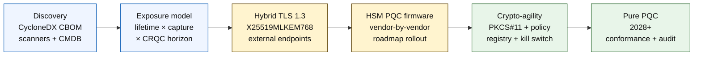

# Der Quantum-Safe-Banking-Index 2026: Post-Quanten-Kryptografie, QKD, Krypto-Agilität und Harvest-now-decrypt-later-Risiko

<!-- lead-start: manual -->
<aside class="post-lead" aria-label="Article summary">

<strong>TL;DR.</strong> Quantum-Safe-Banking 2026 ist ein Lieferprogramm mit einer Deadline, die durch den Schnittpunkt zweier Kurven bestimmt wird — die Vertraulichkeits-Lebensdauer der Daten, die das Institut heute hält, und den Eintrittshorizont eines kryptografisch relevanten Quantencomputers (CRQC). NIST FIPS 203 / 204 / 205 sind seit August 2024 final; CNSA 2.0 legt den US-Bundesendzustand auf 2033 fest; Harvest-now-decrypt-later trifft langlebige Daten bereits heute. Die Quantum-Scorecard auf Vorstandsebene verfolgt vier exakte Prozentsätze: Inventarvollständigkeit, HNDL-Exposition, NIST-Migrationsfortschritt, Krypto-Agilitäts-Reife.

<strong>Wichtigste Erkenntnisse</strong>

<ul class="post-lead-takeaways">
  <li><strong>Die Algorithmusdebatte endete am 13. August 2024.</strong> ML-KEM (FIPS 203), ML-DSA (FIPS 204), SLH-DSA (FIPS 205) sind die Antworten. Banken, die 2026 noch interne Bewertungen fahren, um „den Sieger zu küren", sind 18 Monate im Rückstand.</li>
  <li><strong>Harvest-now-decrypt-later gilt bereits.</strong> Alles mit einer Vertraulichkeits-Lebensdauer über den glaubwürdigen CRQC-Eintritt hinaus — 30-jährige Hypotheken, Lebensversicherungs-Underwriting, Transaktionsaufzeichnungen nach MiFID II / DSGVO, M&amp;A-Aufbewahrungsarchive — muss jetzt auf hybride Quantum-Safe-Schlüsselkapselung umstellen, nicht erst, wenn ein CRQC angekündigt wird.</li>
  <li><strong>Inventar ist die entscheidende Reifestufe.</strong> Eine kryptografische Stückliste (CBOM) — Protokoll, Bibliothek, Zertifikat, HSM-Partition, Lieferantenabhängigkeit, Anwendungsverantwortlicher, Datenklassifizierungs-Lebensdauer — ist die Vorbedingung für alles andere. Verfolgen Sie die Aktualität, nicht die Abdeckung.</li>
  <li><strong>Hybrides TLS 1.3 ist die Bereitstellung für 2026.</strong> Den Hybrid-Schlüsselaustausch X25519MLKEM768 verhandeln Chrome / Firefox / Cloudflare / Akamai heute tatsächlich. Reines ML-KEM-TLS wartet auf HSM-Firmware und CA-Reife.</li>
  <li><strong>Krypto-Agilität ist das dauerhafte Ergebnis.</strong> PKCS#11-Abstraktion, beschriftete Schlüssel, Policy-Register, das den Geschäftsdienst auf den zulässigen Algorithmensatz abbildet. Ohne sie wird der nächste Algorithmuswechsel zum nächsten mehrjährigen Programm.</li>
</ul>
</aside>
<!-- lead-end -->

Quantum-Safe-Banking 2026 geht um operative Migration, nicht um Spekulation. NIST hat die ersten drei Post-Quanten-Kryptografie-Standards finalisiert, und Banken müssen jetzt verstehen, welche Systeme auf RSA, ECC, TLS, Signaturen, HSMs, Zertifikaten, Zahlungskanälen, Archiven und langlebigen vertraulichen Daten beruhen. Die Index-Frage ist einfach: Kann das Institut die Kryptografie ersetzen, bevor die Bedrohung operativ wird?

---

> **Executive Summary / Wichtigste Erkenntnisse**
>
> - **Die NIST-Standards sind jetzt konkret.** FIPS 203 definiert ML-KEM für die Schlüsselkapselung, FIPS 204 definiert ML-DSA für Signaturen, und FIPS 205 definiert SLH-DSA als zustandslosen hashbasierten Signaturstandard.
> - **Inventar ist die erste Reifestufe.** Eine Bank kann nicht migrieren, was sie nicht findet: Zertifikate, Schlüssel, Protokolle, Anwendungen, Lieferanten, HSMs, APIs, Archive und eingebettete Systeme müssen erfasst werden.
> - **Krypto-Agilität ist das dauerhafte Ziel.** Es geht nicht um einen einmaligen Algorithmuswechsel, sondern um die Fähigkeit, kryptografische Primitive zu ändern, ohne ganze Anwendungen neu zu entwerfen.
> - **Langlebige Daten verändern die Dringlichkeit.** Das Harvest-now-decrypt-later-Risiko bedeutet, dass heute erfasste Daten später lesbar werden können, sofern sie lange genug wertvoll bleiben.
> - **QKD ist eine spezialisierte Ergänzung.** Quantenschlüsselverteilung mag für die höchstwertigen Kanäle relevant sein, ersetzt aber keine institutionsweite PQC-Migration.
>
---

## Warum 2026 das Jahr ist, in dem dieser Index zählt

Drei Verschiebungen in den Jahren 2024–2025 haben Quantum-Safe von einer Forschungsbeobachtung zu einem messbaren Bankenprogramm gemacht. Erstens hat NIST am 13. August 2024 die primären Post-Quanten-Standards finalisiert: [FIPS 203 (ML-KEM) ⧉](https://nvlpubs.nist.gov/nistpubs/FIPS/NIST.FIPS.203.pdf "FIPS 203 — Module-Lattice-basierter Schlüsselkapselungsmechanismus"), [FIPS 204 (ML-DSA) ⧉](https://nvlpubs.nist.gov/nistpubs/FIPS/NIST.FIPS.204.pdf "FIPS 204 — Module-Lattice-basierter digitaler Signaturstandard"), [FIPS 205 (SLH-DSA) ⧉](https://nvlpubs.nist.gov/nistpubs/FIPS/NIST.FIPS.205.pdf "FIPS 205 — Zustandsloser hashbasierter Signaturstandard"). Die Algorithmus-Auswahldebatte endete an diesem Datum; Banken, die 2026 noch interne Workstreams nach dem Muster „welches Verfahren gewinnt" betreiben, sind 18 Monate im Rückstand.

Zweitens legt die [CNSA 2.0 der NSA ⧉](https://media.defense.gov/2022/Sep/07/2003071834/-1/-1/0/CSA_CNSA_2.0_ALGORITHMS_.PDF "Commercial National Security Algorithm Suite 2.0") den US-Bundesendzustand auf 2033 fest, mit Zwischenfristen ab 2027 für Software- und Firmware-Signierung und 2030 für Browser und Betriebssysteme. Jede Bank mit US-Bundeskontrahentenexposition — FedNow, Treasury-Operationen, Bundeskundenkonten — liegt für jene Systeme innerhalb dieses Perimeters, die mit Bundesdaten in Berührung kommen. Die Uhr tickt nicht mehr abstrakt.

Drittens ist [Harvest-now-decrypt-later (HNDL) ⧉](https://csrc.nist.gov/Projects/post-quantum-cryptography "NIST-Post-Quanten-Kryptografie-Programm") das tragende Risikoargument für die Dringlichkeit. Hochentwickelte Angreifer fangen bereits heute TLS-geschützte Zahlungsnachrichten, SWIFT-Hüllen, KYC-Dokumentation und langlebige Archiv-Chiffretexte an den großen Finanzplätzen ab. Die 2026 erfassten Daten müssen nur zum Zeitpunkt der Entschlüsselung noch vertraulich sein — für 30-jährige Hypotheken, Lebensversicherungs-Underwriting, Transaktionsaufzeichnungen nach MiFID II / DSGVO und M&A-Aufbewahrungsarchive reicht dieses Fenster weit über jede glaubwürdige Schätzung für einen kryptografisch relevanten Quantencomputer (CRQC) hinaus. Der Angreifer braucht heute keinen Quantencomputer. Er braucht einen, bevor die Daten an Bedeutung verlieren.

Der Quantum-Safe-Banking-Index misst, ob Ihr Institut die Migration vor diesem Schnittpunkt ausliefern kann. Es geht nicht mehr darum, ob migriert wird, sondern darum, ob die Migration auf einem belastbaren Zeitplan abgeschlossen ist.

## Die Index-Architektur 2026

| Index-Schicht | Richtung 2026 | Reifemetrik | Risiko bei Fehlsteuerung |
|---|---|---|---|
| **Inventar** | Kryptografische Assets, Protokolle, Zertifikate, Lieferanten und Datenklassen erfassen | Prozent des inventarisierten Bestands | Unbekannte quantenanfällige Abhängigkeiten |
| **Exposition** | Systeme nach Vertraulichkeits-Lebensdauer und Transaktionskritikalität klassifizieren | Hochrisiko-Assets nach Wert und Lebensdauer | Falsch priorisierte Migration |
| **Migration** | Hybride und PQC-fähige Muster an NIST-Standards ausrichten | ML-KEM- und ML-DSA-Reife | Notfall-Replatforming unter Termindruck |
| **Krypto-Agilität** | Anwendungslogik von kryptografischen Primitiven trennen | Policy-gesteuerte Kryptoabdeckung | Hartkodierte Algorithmen im gesamten Bestand |
| **Assurance** | Interoperabilität, Performance, HSM-Unterstützung, Zertifikate und Lieferantenreife prüfen | Testbestehensquote und offene Ausnahmen | Defekte Kanäle oder schwache Fallback-Kontrollen |

### Die Quantum-Scorecard auf Vorstandsebene

Eine glaubwürdige Quantum-Readiness-Scorecard erfordert die Verfolgung exakter Prozentsätze, nicht nur von Projektstatus:

1. **Inventarvollständigkeit:** Der Prozentsatz der Tier-1-Anwendungen mit vollständig erfasster kryptografischer Stückliste (CBOM).
2. **HNDL-Exposition:** Das Volumen langlebiger vertraulicher Daten (z. B. PII, Geschäftsgeheimnisse), das ohne hybride Quantum-Safe-Schlüsselkapselung über Netze übertragen wird.
3. **NIST-Migrationsfortschritt:** Der Prozentsatz asymmetrischer Verschlüsselungsschlüssel und digitaler Signaturen, der auf die Standards FIPS 203 (ML-KEM) und FIPS 204 (ML-DSA) migriert wurde.
4. **Krypto-Agilitäts-Reife:** Der Prozentsatz kritischer Systeme, in denen kryptografische Algorithmen über zentrale Policy rotiert werden können, ohne dass eine Neukompilierung des Codes erforderlich ist.

## Aktuelle Signale, die zu verfolgen sind

| Signal | Was es für Banken bedeutet | Quelle |
|---|---|---|
| **FIPS 203 ML-KEM** | Primärer NIST-Standard für allgemeine Schlüsseletablierung bei der Verschlüsselung | [NIST ⧉](https://www.nist.gov/news-events/news/2024/08/nist-releases-first-3-finalized-post-quantum-encryption-standards "Die ersten drei finalisierten Post-Quanten-Verschlüsselungsstandards") |
| **FIPS 204 ML-DSA** | Primärer NIST-Standard für digitale Signaturen | [NIST ⧉](https://www.nist.gov/news-events/news/2024/08/nist-releases-first-3-finalized-post-quantum-encryption-standards "Die ersten drei finalisierten Post-Quanten-Verschlüsselungsstandards") |
| **FIPS 205 SLH-DSA** | Hashbasierte Signaturalternative und Backup-Design | [NIST ⧉](https://www.nist.gov/news-events/news/2024/08/nist-releases-first-3-finalized-post-quantum-encryption-standards "Die ersten drei finalisierten Post-Quanten-Verschlüsselungsstandards") |
| **Sofortige Integration empfohlen** | NIST fordert Administratoren ausdrücklich auf, mit der Integration der Standards zu beginnen, da die vollständige Integration Zeit kostet | [NIST ⧉](https://www.nist.gov/news-events/news/2024/08/nist-releases-first-3-finalized-post-quantum-encryption-standards "Die ersten drei finalisierten Post-Quanten-Verschlüsselungsstandards") |
| **Quantenprogramme der Banken weiten sich aus** | Große Banken erkunden Quantentechnologien, während sie PQC-Übergänge vorbereiten | [Quantum Insider ⧉](https://thequantuminsider.com/2026/03/27/15-plus-global-banks-probing-the-wonderful-world-of-quantum-technologies/ "Überblick über globale Banken, die Quantentechnologien erkunden") |

## Die Migration beginnt mit dem Hauptbuch der Kryptografie

Die Migrationssequenz ist inzwischen gut verstanden. Jedes Gate liefert Evidenz, die das nächste antreibt; ein Gate zu überspringen oder zu komprimieren erzeugt genau jenes Notfall-Replatforming-Risiko, das in der Fehlerspalte der Index-Architektur landet.

Das erste Lieferergebnis ist kein neuer Algorithmus, sondern eine kryptografische Stückliste (CBOM). Banken brauchen ein lebendes Inventar, das Geschäftsdienste mit Algorithmen, Bibliotheken, Zertifikaten, Schlüssellängen, HSMs, Datenlebensdauern, Lieferanten und operativen Verantwortlichen verknüpft. Ohne dieses Hauptbuch wird Quantum-Safe-Migration zur Mutmaßung.

Der CBOM-Datensatz sollte für jedes kryptografische Primitiv Folgendes erfassen: Protokoll oder Schnittstelle (TLS 1.3, IPsec, SSH, eigenes Zahlungsnachrichtenformat), Algorithmus und Parametersatz (RSA-2048, ECDH P-256, ML-KEM-768, ML-DSA-65), Bibliothek und Version (OpenSSL 3.4, BoringSSL-Commit-Hash, Lieferanten-SDK-Build), Hardwaregrenze (HSM-Partition, TPM, Secure Enclave oder keine), gegebenenfalls die Zertifikatsidentität, den Anwendungsverantwortlichen und die Datenklassifizierungs-Lebensdauer. Werkzeuge, die 2025–2026 in den Produktivbetrieb gehen — IBM Quantum Safe Inventory, die Open-Source-[CycloneDX-CBOM-Spezifikation ⧉](https://cyclonedx.org/capabilities/cbom/ "CycloneDX Cryptography Bill of Materials"), Enterprise-Scanner von CryptoNext / Sandbox / PQShield — integrieren sich in bestehende CMDB-Pipelines. Keines ist für sich allein vollständig; rechnen Sie selbst mit Lieferantentooling und dediziertem Personal mit einem 12- bis 18-monatigen CBOM-Aufbauzyklus.

Die zu verfolgende Metrik ist Aktualität, nicht Abdeckung. Eine CBOM, die zwei Monate veraltet ist, ist schlechter als gar keine CBOM, weil sie dem Sicherheitsteam falsches Vertrauen darüber vermittelt, was bereits migriert wurde.

## Erst hybrid, dauerhaft agil

Die meisten Banken werden nicht alles auf einmal umstellen. Das realistische Muster ist die hybride Bereitstellung, bei der klassische und Post-Quanten-Mechanismen parallel laufen, während Lieferanten, Protokolle, Zertifikate und operatives Tooling reifen. Das langfristige Ziel ist Krypto-Agilität: policy-gesteuerte kryptografische Entscheidungen, die sich ohne Umbau der Geschäftsanwendung ändern lassen.

[Interaktive Komponente einfügen: Harvest-now-decrypt-later-Risikorechner (HNDL) — ein schiebereglerbasiertes Werkzeug, in das Führungskräfte die Daten-Haltbarkeit gegenüber dem geschätzten Quanten-Zeitstrahl eingeben, um ihr Expositionsfenster zu sehen.]

> **Kernaussage:** Wenn Ihre Daten 10 Jahre vertraulich bleiben müssen und ein kryptografisch relevanter Quantencomputer (CRQC) 7 Jahre entfernt ist, liegt Ihre Migrations-Deadline nicht in 7 Jahren — sie lag vor 3 Jahren.

In der Praxis bedeutet das TLS 1.3 mit dem hybriden Schlüsselaustausch `X25519MLKEM768` für nach außen exponierte Endpunkte (Chrome / Firefox / Cloudflare / Akamai unterstützen das heute), klassische Signaturketten, bis HSM- und CA-Infrastruktur nachziehen, und eine PKCS#11-Abstraktionsschicht, die dem Policy-Register erlaubt, Algorithmen ohne Neukompilierung der Geschäftsanwendungen zu rotieren. Krypto-Agilität entscheidet darüber, ob der nächste Algorithmusübergang (wann, nicht ob) eine sechswöchige Rotation oder ein weiteres siebenjähriges Programm wird.

## Wo QKD hineinpasst

Quantenschlüsselverteilung gehört als Option für Kanäle mit hoher Sensibilität in den Index, insbesondere für Finanzmarktinfrastruktur, Zentralbankanbindung und besonders sensible institutionelle Flüsse. Sie ist als Ergänzung zur PQC zu behandeln, nicht als Vorwand, die unternehmensweite Migration zu verzögern.

## Was das nach Banktyp bedeutet

### Global systemrelevante Banken

Das harte Problem ist die Skalierung: Zehntausende TLS-Endpunkte, Hunderte HSM-Partitionen, Dutzende interne Zertifizierungsstellen, Hunderte Geschäftsanwendungen mit eingebetteten kryptografischen Primitiven und Lieferanten-SDKs, die die Bank nicht ändern kann. Die Investition ist kein weiterer Pilot, sondern das CBOM-Tooling, die in jeden Neubau eingebettete PKCS#11-Abstraktionsschicht, der HSM-Konsolidierungsplan, der einen Lieferanten als Leitanbieter für PQC-Firmware wählt und einen mehrjährigen Ausläufer bei den übrigen akzeptiert, und das Policy-Register, das lange nach Abschluss der Migration nach FIPS 203 / 204 / 205 zur dauerhaften Krypto-Agilitäts-Oberfläche wird.

### Transaktions- und Firmenkundenbanken

Der Migrationsumfang ist enger als auf G-SIB-Niveau, aber die HNDL-Exposition ist akut: grenzüberschreitende SWIFT-Nachrichten, strukturierte Zahlungsdaten mit PII von Firmenkundenkontrahenten, Dokumentenaustausch-Plattformen mit Handelsfinanzierungs-Dokumentation und Reporting-Archive mit langer Aufbewahrung. Priorisieren Sie hybrides TLS auf jedem kundenseitigen Endpunkt und PQC at rest für Aufbewahrungsarchive. Drängen Sie HSM-Lieferanten in die Verantwortung — das Plattformteam des Firmenkundengeschäfts hat direkte Beschaffungs-Hebel, die dem Wholesale-Technologie-Team oft fehlen.

### Regionalbanken

Kaufen Sie den Lieferantenstack, der die Krypto-Agilitäts-Primitive bereits enthält. Wählen Sie eine Kernbankenplattform, deren Anbieter eine CBOM veröffentlicht und sich auf ML-KEM- / ML-DSA-Support-Zeitpläne festlegt. Validieren Sie, dass die HSM-Roadmap des Anbieters mit der Migrations-Deadline der Bank übereinstimmt. Die Engineering-Kapazität, um Krypto-Agilität von Grund auf zu bauen, ist mehrjährig; der Anbieter trägt diese Kosten über viele Kunden hinweg, und die Bank profitiert davon. Die Validierungsarbeit — zu prüfen, ob die Aussagen des Anbieters den MRM-Prozess des Instituts überstehen — ist der legitime interne Scope.

### Fintechs, PSPs und Infrastrukturanbieter

Die wettbewerbliche Frage für Anbieter, die 2026 an Banken verkaufen, lautet nicht „unterstützen Sie PQC". Sie lautet: „Können Sie eine CycloneDX-CBOM für Ihre Plattform, eine HSM-Lieferanten-Supportmatrix und ein schriftliches Algorithmus-Rotations-SLA vorlegen?". Anbieter, die mit Ja antworten, passieren 2026–2027 die Beschaffungs-Gates der Tier-1-Banken. Anbieter, die das nicht können, verlieren den Verlängerungszyklus an einen Wettbewerber, der es kann.

## Fazit

Quantum-Safe-Banking 2026 ist keine Forschungsbeobachtung; es ist ein Lieferprogramm mit einer Deadline, die durch den Schnittpunkt zweier Kurven bestimmt wird — Vertraulichkeits-Lebensdauer der heute gehaltenen Daten und Eintrittshorizont eines kryptografisch relevanten Quantencomputers. Die Institute, die 2030 vor Aufsicht und Gegenparteien glaubwürdig wirken, sind diejenigen, die 2024 mit dem CBOM-Aufbau begonnen, bis Ende 2026 hybrides TLS auf jedem externen Endpunkt ausgerollt und Krypto-Agilität ab Tag eins in jeden Neubau eingebaut haben. Die anderen werden herausfinden, ob ihr Migrationsfenster für die Daten, die ihr Angreifer heute erntet, bereits geschlossen ist.

Messen Sie die Migration wie jedes operative Programm: Scope bekannt, Sequenzierung priorisiert, Termine zugesagt, Ausnahmenregister ehrlich. Je genauer Sie auf den eigenen Bestand schauen, desto enger wirkt das Migrationsfenster.

## Häufig gestellte Fragen

**Was sollte eine Bank zuerst inventarisieren?**

Beginnen Sie mit extern exponiertem TLS, Zahlungskanälen, Kundenauthentifizierung, Interbanken-Konnektivität, HSM-gestützten Diensten, Langzeitarchiven und Systemen, die vertrauliche Daten mit langer Nutzdauer verarbeiten.

**Ist PQC ausschließlich ein Cybersicherheitsthema?**

Nein. Sie betrifft Zahlungsverkehr, Identität, juristische Beweissicherung, Transaktionssignierung, Kundenvertrauen, Datenaufbewahrung, Lieferantenmanagement und operative Resilienz.

**Was bedeutet Krypto-Agilität?**

Krypto-Agilität bedeutet die Fähigkeit, kryptografische Primitive über Policy- und Plattformkontrollen zu ändern, statt über hartkodierte Änderungen in den Anwendungen.

**Sollten Banken auf weitere Standards warten?**

Nein. NIST hat Administratoren ermutigt, mit der Integration der ersten finalen Standards zu beginnen, weil die vollständige Integration Zeit braucht.

## Quellen

- NIST, (2026). [Die ersten drei finalisierten Post-Quanten-Verschlüsselungsstandards ⧉](https://www.nist.gov/news-events/news/2024/08/nist-releases-first-3-finalized-post-quantum-encryption-standards "Die ersten drei finalisierten Post-Quanten-Verschlüsselungsstandards").

<!-- enrich-start -->
<aside class="author-card" aria-label="Über den Autor"><strong class="author-card-name"><a href="/about/index.html">Sebastien Rousseau</a></strong>Senior Banking-Technologe, der über angewandte KI, Zahlungsverkehrsinfrastruktur, tokenisiertes Geld, ISO 20022, Post-Quanten-Sicherheit, Cloud-native Finanzdienstleistungen und regulierte digitale Märkte schreibt.Mehr als 20 Jahre Erfahrung bei HSBC Commercial &amp; Investment Bank, PayPal, Barclays, Shazam, AKQA und Virgin Group. <a href="/about/index.html">Vollständiges Profil</a> &middot; <a href="https://www.linkedin.com/in/sebastienrousseau/" rel="external noopener">LinkedIn</a> &middot; <a href="https://github.com/sebastienrousseau" rel="external noopener">GitHub</a></aside>

Zuletzt geprüft <time datetime="2026-06-04">2026-06-04</time>.

<!-- enrich-end -->
