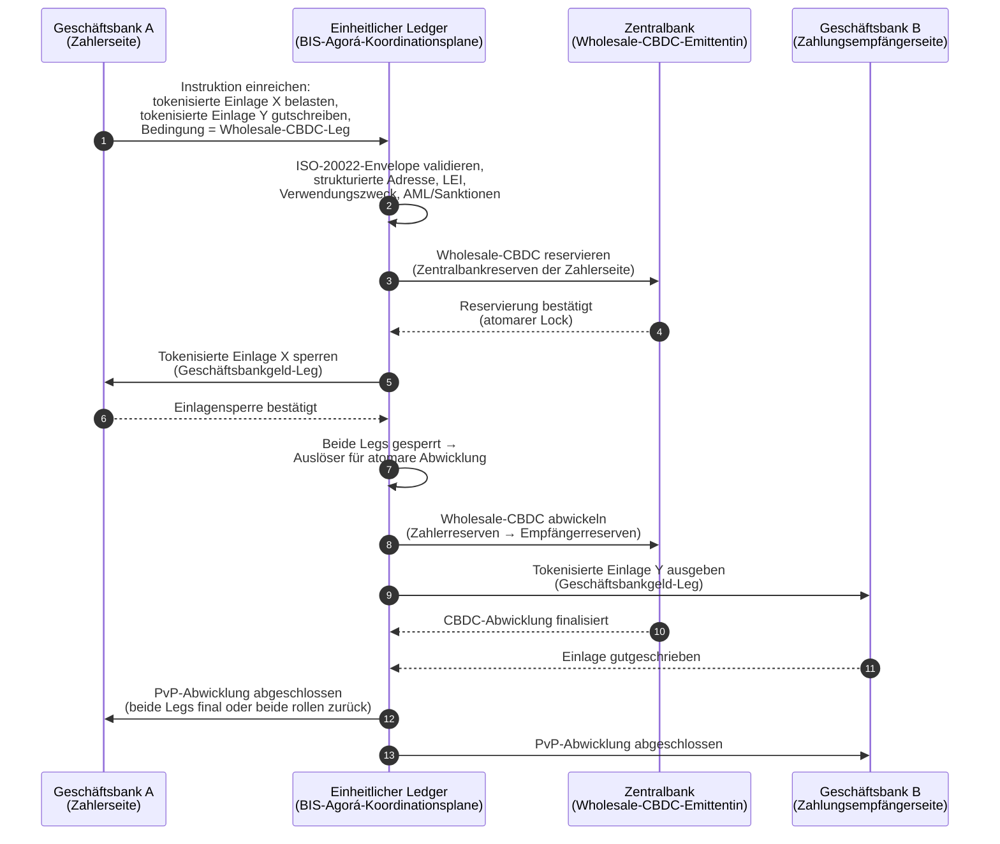

<!-- lead-start: manual -->
<aside class="post-lead" aria-label="Artikelzusammenfassung">

<strong>Kurzfassung.</strong> Der Großbetragszahlungsverkehr steht 2026 im Schnittpunkt zweier struktureller Verschiebungen: ISO 20022 zwingt strukturierte Zahlungsdaten in das Betriebsmodell, während tokenisierte Einlagen und BIS Project Agorá die grenzüberschreitende Abwicklung in Richtung atomarer, programmierbarer und stets verfügbarer Rails verlagern. Die Frage 2026 für eine Bank lautet nicht mehr „haben wir die Nachrichten migriert", sondern „sind unsere Zahlungsoperationen messbar, geroutet und beaufsichtigbar" — und der Index zerlegt das in vier exakte Prozentwerte: Vollständigkeit strukturierter Daten, Optimalität des Rail-Routings, Verzögerung der Abrechnungsendgültigkeit und Abdeckung der Agorá-Korridore.

<strong>Wesentliche Erkenntnisse</strong>

<ul class="post-lead-takeaways">
  <li><strong>November 2026 ist eine harte Frist, keine Empfehlung.</strong> SWIFT entfernt die Unterstützung für unstrukturierte Adressen in SR 2026; Zahlungen ohne Ort und Land in den vorgesehenen Feldern werden nicht mehr geclearet. Reparaturkosten, Reject-Quote und Operations-Kapazität wechseln allesamt von „Kennzahl" zu „aufsichtssichtbarer Aufstellung".</li>
  <li><strong>Tokenisierte Einlagen schlagen Stablecoins im regulierten Großbetragsgeschäft.</strong> Sie bewahren die Bank-Einleger-Beziehung und das Abrechnungsasset der Zentralbank, machen aber Programmierbarkeit verfügbar. Stablecoins behalten eine Rolle an der Peripherie; tokenisierte Einlagen verankern den Kern.</li>
  <li><strong>BIS Project Agorá ist die Korridor-Referenz.</strong> Wenn ein grenzüberschreitendes Produkt einer Bank bis 2027 nicht innerhalb eines Agorá-Korridors laufen kann, konkurriert es auf einer Rail, die der Rest des Marktes bereits verlässt.</li>
  <li><strong>Die Orchestrierung von Echtzeit-Rails ist das Betriebsmodell.</strong> Die Multi-Rail-Entscheidung 2026 (FedNow / RTP / TIPS / SEPA Inst / On-Chain) ist nicht „welche Rail" — sie ist das Policy-Register, das Liquiditätsprofil und die Routing-Engine, die die Rail je Zahlung auswählt.</li>
  <li><strong>Messen oder gemessen werden.</strong> Vier Prozentwerte — Vollständigkeit strukturierter Daten, Optimalität des Rail-Routings, Verzögerung der Abrechnungsendgültigkeit, Abdeckung der Agorá-Korridore — übersetzen die Zahlungsverkehrs-Aufstellung vor dem Prüfungsfenster 2026/27 in aufsichtsreife Nachweise.</li>
</ul>
</aside>
<!-- lead-end -->

# Der Großbetragszahlungsverkehr-Index 2026: ISO 20022, tokenisierte Einlagen, Echtzeit-Rails und grenzüberschreitende Abwicklung

Der Großbetragszahlungsverkehr wird 2026 durch zwei gleichzeitige Verschiebungen umgeformt: strukturierte Zahlungsdaten und programmierbare Abwicklung. Der SWIFT-Meilenstein für strukturierte Adressen im November 2026 zwingt Datenqualität in das Betriebsmodell, während BIS Project Agorá und tokenisierte Einlagen prüfen, ob die grenzüberschreitende Abwicklung atomarer, transparenter und stets verfügbar werden kann.

---

> **Executive Summary / Wesentliche Erkenntnisse**
>
> - **November 2026 ist ein harter Datenmeilenstein.** SWIFT erklärt, dass Zahlungen mit unstrukturierten Adressen nach der SR-2026-Umstellung nicht mehr unterstützt werden.
> - **Strukturierte Daten werden zur Produktinfrastruktur.** Ort und Land müssen mindestens in den vorgesehenen Feldern stehen, womit Zahlungsdatenqualität zu einer Kunden-, Operations- und Compliance-Frage wird.
> - **Tokenisierte Einlagen sind eine Designoption im Großbetragsgeschäft.** Project Agorá erprobt tokenisierte Geschäftsbank-Einlagen und tokenisierte Zentralbankreserven in einem einheitlichen Ledger-Modell.
> - **Der Index sollte Abwicklungsqualität messen, nicht nur Geschwindigkeit.** Endgültigkeit, Transparenz, Reparaturquoten, Liquiditätsnutzung, Compliance-Daten und Kundensichtbarkeit zählen ebenso wie sofortige Ausführung.
> - **Der grenzüberschreitende Zahlungsverkehr bleibt eine öffentlich-private Agenda.** Das FSB treibt den G20-Fahrplan über die Implementierung weiter voran, mit Koordination zwischen öffentlichem und privatem Sektor.
>
---

## Warum 2026 das Jahr ist, in dem dieser Index zählt

Der Stanford AI Index ist nützlich, weil er ein sich schnell bewegendes Technologiefeld als etwas Messbares behandelt: Forschungsoutput, technische Leistung, verantwortlicher Einsatz, Ökonomie, sektorale Adoption, Politik und öffentliche Stimmungslage werden in einen einzigen Rahmen gebracht ([Stanford HAI ⧉](https://hai.stanford.edu/ai-index/2026-ai-index-report "The 2026 AI Index Report")). Banken und Finanzinstitute brauchen nun dieselbe Disziplin für Infrastruktur. Agentische KI, quantensichere Sicherheit, Cloud-native Resilienz und Großbetragszahlungsverkehr sind keine getrennten Innovationsspuren mehr; sie laufen in einem einzigen Betriebsmodell zusammen.

Die praktische Frage für eine Bank ist nicht, ob jede Domäne wichtig ist. Sie lautet, ob das Institut die Reife über alle gleichzeitig messen kann. Eine Bank kann agentische KI ausrollen und dennoch fragil sein, wenn ihre Kryptografie nicht migrationsbereit ist. Sie kann Cloud-Plattformen modernisieren und dennoch scheitern, wenn die Zahlungsdaten unstrukturiert bleiben. Sie kann Tokenisierungs-Piloten betreiben und dennoch systemisches Risiko schaffen, wenn Abwicklung, Liquidität, Identität und Auditebenen nicht zusammen entworfen werden.

## Die Architektur des Index 2026

| Indexebene | Richtung 2026 | Reifegrad-Kennzahl | Risiko bei Fehlsteuerung |
|---|---|---|---|
| **ISO-20022-Daten** | Von unstrukturiertem Text zu geregelten strukturierten Feldern | Reife strukturierter Adressen und Reject-Quote | Zahlungs-Rejects und manuelle Reparatur |
| **Rail-Orchestrierung** | Routing über RTGS, Instant, Korrespondenzbankenpfad, Stablecoin- und tokenisierte Rails | Kosten, Geschwindigkeit, Endgültigkeit und jurisdiktionsbewusstes Routing | Fragmentierte Rails mit duplizierten Kontrollen |
| **Tokenisierte Abwicklung** | Tokenisierte Einlagen und Zentralbankgeld dort einsetzen, wo sie Reibung reduzieren | DvP-, PvP-, atomare Abwicklungsabdeckung | Pilotassets ohne Mehrwert im Geschäftsablauf |
| **Liquidität** | Innertagesliquidität, festsitzende Mittel und Abwicklungsfenster optimieren | Eingesparte Liquidität und Reduktion von Abwicklungsausfällen | Schnellere Liquiditätsabflüsse |
| **Compliance** | AML-, Sanktions-, FATF- und Auditanforderungen in Zahlungsdaten einbetten | Straight-Through-Compliance und Erklärbarkeit | Reichere Daten ohne stärkere Kontrollen |

## Zentrale Signale im Großbetragszahlungsverkehr, abgebildet auf globale Prioritäten

Das Signal-Set 2026 ist keine Forschungsagenda. Es ist eine Lieferliste, an der ein Chief Payments Officer einer Bank bereits gemessen wird. Die Remediation findet an drei Stellen statt: im Nachrichten-Envelope, in der Rail-Orchestrierungsschicht und im Abwicklungsledger.

| Signal | Referenz G20 / SWIFT / BIS | Technische Plattform-Umsetzung |
|---|---|---|
| **65 % der Zahlungsnachrichten enthalten weiterhin unstrukturierte Adressen** | [SWIFT SR 2026 — Meilenstein strukturierte Adressen, Nov. 2026 ⧉](https://www.swift.com/news-events/news/iso-20022-milestone-november-2026-unstructured-addresses-be-removed "ISO 20022 November 2026 strukturierter Adress-Meilenstein") | Schemavalidierung in der Zahlungsverkehrs-Middleware, bevor die Nachricht den SWIFTNet-Adapter erreicht; automatisiertes Address-Parsing am Ingress aus Firmenkundenkanälen und Korrespondenzbanken. |
| **FSB-G20-Ziel: 75 % der grenzüberschreitenden Zahlungen bis 2027 innerhalb von 1 Stunde abgeschlossen** | [FSB-Fahrplan für grenzüberschreitenden Zahlungsverkehr, Umsetzungsphase 2026 ⧉](https://www.fsb.org/2026/03/fsb-kicks-off-new-implementation-phase-to-enhance-cross-border-payments-through-public-private-partnership/ "Umsetzungsphase für den grenzüberschreitenden Zahlungsverkehr") | Echtzeit-FX-Konvertierungs-Gateways mit vorvereinbarten Liquiditätsfenstern; T+0-Bestätigungs-Hooks im Kundenportal; Rail-Routing-Engine, die jeden Korridor ausschließt, der die 1-Stunden-Vorgabe nicht einhalten kann. |
| **FSB-G20-Ziel: durchschnittliche grenzüberschreitende Transaktionskosten unter 1 %, im Retail unter 3 %** | [FSB G20 quantitative Zielwerte ⧉](https://www.fsb.org/2026/03/fsb-kicks-off-new-implementation-phase-to-enhance-cross-border-payments-through-public-private-partnership/ "Umsetzungsphase für den grenzüberschreitenden Zahlungsverkehr") | Kostenzuordnungs-Telemetrie je Korridor (FX-Spread, Korrespondenzbankgebühr, Lifting-Kosten); Margenpolitik-Register, das nicht-konforme Bepreisung vor dem Quote sichtbar macht. |
| **BIS Project Agorá tritt in die Prototypphase mit sieben Zentralbanken + 41 Geschäftsbanken ein** | [BIS Project Agorá ⧉](https://www.bis.org/about/bisih/topics/fmis/agora.htm "Project Agorá") | Integrationsspezifikation für den einheitlichen Ledger: Ledger-Node für tokenisierte Einlagen + Settlement-Plane für Wholesale-CBDC + KYC-/AML-Hooks; On-Chain-Liquiditätspools, dimensioniert auf den Korridor-Anteil der Bank. |
| **Rahmen der Deutschen Bank zu „digitalem Geld" verfestigt sich in der Kundenarchitektur** | [Deutsche Bank — Digital Money: stablecoins, tokenised deposits and CBDCs ⧉](https://flow.db.com/publications/flow-white-papers-and-guides/digital-money-a-perspective-on-stablecoins-tokenised-deposits-and-cbdcs "Digital Money: stablecoins, tokenised deposits and CBDCs") | Wallet-agnostische Settlement-API, die die Auswahl zwischen Stablecoin, tokenisierter Einlage und CBDC pro Zahlung abstrahiert; programmierbare Bedingungen, ausgewertet gegen das Policy-Register der Bank, nicht des Kunden. |

## Der Wendepunkt der Zahlungsdaten

ISO 20022 hat sich von einem Nachrichtenformatprojekt zu einem Datenqualitäts-Betriebsmodell weiterentwickelt. Sind Begünstigten-, Auftraggeber-, Empfänger-, Agent-, Ort-, Land-, Verwendungszweck- und Parteidaten schwach, erlebt die Bank Rejects, Reparaturen, Reibung bei Sanktionsprüfungen, Kundenfrust und schwache Analytik. Der SWIFT-Standard CBPR+ und der Übergang von SWIFT MT zu MX in der pacs.008 sind dabei nicht abstrakte Formate, sondern die operativen Tatsachen, an denen sich das Reparatur- und Untersuchungsaufkommen 2026 bemisst.

**SR 2026 macht daraus einen harten Vertrag, keine Empfehlung.** Der SWIFT Standards Release 2026 (November 2026) erzwingt die Regel zur strukturierten Adresse auf Netzwerkebene — Nachrichten, deren `<PstlAdr>`-Element kein `<TwnNm>` und `<Ctry>` führt, werden vom Validierungs-Stack von SWIFTNet beim Empfang abgelehnt und nicht zur Reparatur markiert. Die Reparatur-Warteschlange ist nicht länger eine Backoffice-Kostenstelle, sondern wird zum Abwicklungsausfall mit kundensichtbarer Verzögerung. Operations-Teams, die SR 2026 als „strengere Leitlinie" behandeln, arbeiten aus dem falschen Runbook.

### Konformität strukturierter Zahlungsdaten nach ISO 20022

Die Remediationsoberfläche ist eng und klar definiert. Die unten genannten XML-Elemente sind die Stellen, an denen der SWIFTNet-Validierungs-Stack im November 2026 Nachrichten tatsächlich ablehnt; alles andere ist nachgelagerte Konsequenz.

| Datenelement | ISO-20022-XML-Tag | SWIFT-Anforderung November 2026 | Technische Remediationsstrategie |
|---|---|---|---|
| **Strukturierte Adresse** | `<PstlAdr>` mit `<TwnNm>` + `<Ctry>` | Pflicht. Unstrukturierter `<AdrLine>`-Text löst beim empfangenden SWIFTNet-Adapter eine Netzwerkablehnung aus. | Automatisiertes Address-Parsing bei der Zahlungsinitiierung; Umbau der Eingabemasken in den Firmenkundenkanälen; Backbook-Bereinigung jeder Gegenpartei vor der nächsten Belastung. |
| **Legal Entity Identifier (LEI)** | `<Id>` unter `<OrgId>` | Stark empfohlen für die Verifikation nicht-individueller Finanzgegenparteien; in mehreren CBPR+-Korridoren Pflicht. | LEI-Lookup + GLEIF-Abgleich beim Firmenkunden-Onboarding; automatische Anreicherung für Backbook-Gegenparteien über Stammdaten-Services. |
| **Verwendungszweck-Codes** | `<Purp>` mit `<Cd>` | Pflicht in mehreren regionalen Echtzeit-Korridoren (CBPR+, SEPA Inst, TIPS) für automatisiertes AML-/Sanktions-Screening. | Mapping bank-interner Altcodes auf die Standard-Liste ISO 20022 ExternalPurposeCode; Auswahl des Verwendungszwecks in der Firmenkanal-UI sichtbar machen; Default-Deny bei unbekannten Codes. |
| **Ultimative Parteien** | `<UltmtDbtr>` / `<UltmtCdtr>` | Ultimativen Begünstigtenkontext offenlegen, um die FATF-Travel-Rule- und Sanktionsparameter der G20 zu erfüllen; für mehrere Payment-Type-Codes Pflicht. | End-to-End-Parteinamen aus Ledger-Unterkonten extrahieren; gegen den KYC-Graphen abgleichen; ultimative Partei auf jeder Bestätigung ausweisen. |
| **Strukturierte Verwendungsinformation** | `<RmtInf><Strd>` mit `<RfrdDocInf>` | Erforderlich für rechenbare, rechnungsverknüpfte Firmenkundenzahlungen nach CBPR+ Phase 2. | Strukturierte Verwendungsinformation zum Quote-Zeitpunkt im Firmenkundenportal erfassen; Freitext-Fallback für hochvolumige Flüsse ablehnen. |

## Tokenisierte Einlagen und Wholesale-CBDC

Tokenisierte Einlagen bewahren das Modell des Geschäftsbankgeldes, fügen aber Programmierbarkeit hinzu. Wholesale-Zentralbankgeld bewahrt die Abrechnungsendgültigkeit. Das interessante Designmuster ist die Kombination: Geschäftsbankgeld für Kundenbeziehungen und Kreditintermediation, Zentralbankgeld für die endgültige Abwicklung und das systemische Vertrauen.

Project Agorá macht die Kombination konkret. Die Architektur unten ist das BIS-Referenzmuster für eine atomare, grenzüberschreitende Payment-versus-Payment-Abwicklung (PvP) unter Nutzung sowohl eines Geschäftsbank-Einlagenledgers als auch einer Wholesale-CBDC-Settlement-Plane, koordiniert über einen einheitlichen Ledger.

Die Abwicklung ist konstruktionsbedingt atomar: beide Legs committen oder beide rollen zurück. Die Abrechnungsendgültigkeit auf dem Wholesale-CBDC-Leg macht den Transfer der tokenisierten Geschäftsbank-Einlage wirksam, ohne Korrespondenzbank-Risiko. Der einheitliche Ledger ist die Koordinationsplane, kein Zahlungssystem für sich — die Zentralbank emittiert weiterhin das Abrechnungsasset und die Geschäftsbank bucht weiterhin die Einlagenverbindlichkeit.

## Das neue Großbetrags-Zahlungsprodukt

Das Produkt ist nicht länger schlicht eine Zahlung. Es ist ein Bündel aus Ausführung, Daten, Liquidität, Compliance, Nachverfolgbarkeit und Ausnahmemanagement. Banken, die diese Fähigkeiten über APIs und Kunden-Dashboards exponieren, machen aus Infrastruktur-Compliance einen Kundennutzen.

## Was das je nach Banktyp bedeutet

### Global systemrelevante Banken

Globale Banken sollten diesen Index als Enterprise-Architecture-Scorecard behandeln. Die Priorität ist kein weiterer Proof of Concept, sondern der Nachweis, dass autonome Workflows, kryptografische Migration, Cloud-Abhängigkeit und Zahlungsmodernisierung als ein einziges Risiko- und Wertesystem gesteuert werden können.

### Transaktions- und Firmenkundenbanken

Transaktionsbanken sollten sich auf Großbetragszahlungsverkehr, strukturierte Daten, Liquidität, tokenisierte Einlagen und agentische Treasury-Dienste konzentrieren. Das wertvollste Kundenversprechen ist nicht allein schnellere Geldbewegung; es ist erklärbare, prüfbare, programmierbare Geldbewegung mit weniger Untersuchungen und besserer Sichtbarkeit des Working Capitals.

### Regionale Banken

Regionale Banken sollten den Index nutzen, um Programmwucherung zu vermeiden. Sie müssen nicht jede Front anführen, brauchen aber glaubwürdige Positionen zu KI-Governance, Post-Quanten-Inventar, Cloud-Exit-Nachweisen und Zahlungsdaten-Reife.

### Fintechs, PSPs und Infrastrukturanbieter

Fintechs und Infrastrukturanbieter sollten ihre Produkt-Roadmaps an messbarer Bankenreife ausrichten. Die besten Angebote senken das Integrationsrisiko, stärken die Nachweisführung und machen komplexe Infrastruktur für Banken leichter steuerbar.

## Fazit

Der Wert eines Index-Reports liegt darin, dass er eine fragmentierte Technologieagenda in ein messbares Betriebsmodell übersetzt. 2026 werden in der Finanzinfrastruktur nicht die Institute gewinnen, die die meisten Piloten haben. Es werden die Institute sein, die gleichzeitig Reife in Autonomie, Sicherheit, Resilienz, Abwicklung, Ökonomie und Governance nachweisen können.

## Häufig gestellte Fragen

**Warum ist ISO 20022 2026 noch ein Thema?**

Weil die Migration erst abgeschlossen ist, wenn die Zahlungsdaten strukturiert, geregelt, an der Quelle erfasst und über Kanäle, Kunden und Marktinfrastrukturen hinweg nutzbar sind.

**Was ist eine tokenisierte Einlage?**

Eine tokenisierte Einlage ist eine digitale Darstellung von Geschäftsbankgeld, gestaltet, um die Bank-Einleger-Beziehung zu bewahren und gleichzeitig programmierbare Abwicklung zu ermöglichen.

**Ersetzen tokenisierte Einlagen Stablecoins?**

Nicht überall. Stablecoins können in manchen Digital-Asset- und grenzüberschreitenden Kontexten nützlich bleiben, während tokenisierte Einlagen für reguliertes Großbetragsbanking strukturell attraktiv sind.

**Was sollten Banken messen?**

Reife strukturierter Daten, Zahlungs-Rejects, Reparaturkosten, Abwicklungszeit, Liquiditätsnutzung, Rail-Routing-Ergebnisse und Kundensichtbarkeit.

## Quellenverzeichnis

- SWIFT, (2026). [ISO 20022 November 2026 strukturierter Adress-Meilenstein ⧉](https://www.swift.com/news-events/news/iso-20022-milestone-november-2026-unstructured-addresses-be-removed "ISO 20022 November 2026 strukturierter Adress-Meilenstein").
- BIS Innovation Hub, (2026). [Project Agorá ⧉](https://www.bis.org/about/bisih/topics/fmis/agora.htm "Project Agorá").
- FSB, (2026). [Umsetzungsphase für den grenzüberschreitenden Zahlungsverkehr ⧉](https://www.fsb.org/2026/03/fsb-kicks-off-new-implementation-phase-to-enhance-cross-border-payments-through-public-private-partnership/ "Umsetzungsphase für den grenzüberschreitenden Zahlungsverkehr").
- Deutsche Bank, (2026). [Digital Money: stablecoins, tokenised deposits and CBDCs ⧉](https://flow.db.com/publications/flow-white-papers-and-guides/digital-money-a-perspective-on-stablecoins-tokenised-deposits-and-cbdcs "Digital Money: stablecoins, tokenised deposits and CBDCs").

<!-- enrich-start -->
<aside class="author-card" aria-label="Über den Autor"><strong class="author-card-name"><a href="/about/index.html">Sebastien Rousseau</a></strong>Senior Banking-Technologe, der über angewandte KI, Zahlungsverkehrsinfrastruktur, tokenisiertes Geld, ISO 20022, Post-Quanten-Sicherheit, Cloud-native Finanzdienstleistungen und regulierte digitale Märkte schreibt.Mehr als 20 Jahre Erfahrung bei HSBC Commercial &amp; Investment Bank, PayPal, Barclays, Shazam, AKQA und Virgin Group. <a href="/about/index.html">Vollständiges Profil</a> &middot; <a href="https://www.linkedin.com/in/sebastienrousseau/" rel="external noopener">LinkedIn</a> &middot; <a href="https://github.com/sebastienrousseau" rel="external noopener">GitHub</a></aside>

Zuletzt geprüft <time datetime="2026-06-06">2026-06-06</time>.

<!-- enrich-end -->
