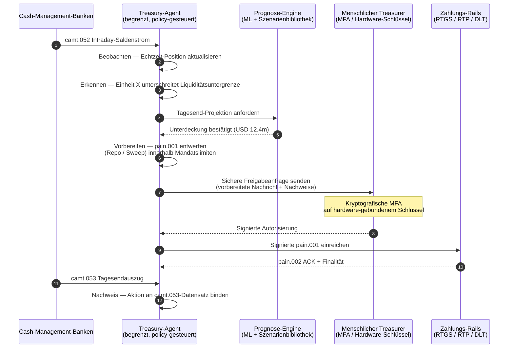

# Autonomous Treasury Index 2026: Agentisches Treasury, programmierbare Liquidität, tokenisierte Einlagen und Echtzeit-Cash-Steuerung

<!-- lead-start -->
<aside class="post-lead" aria-label="Artikelzusammenfassung">

<strong>Kurzfassung.</strong> Ein Index 2026 für autonomes Treasury — gemessen werden agentische Workflows, die Abdeckung programmierbarer Liquidität, die Integration tokenisierter Einlagen, die Echtzeit-Zahlungsorchestrierung und die automatisierte Echtzeit-Cash-Steuerung als ein gemeinsames Betriebsmodell.

<strong>Kernaussagen</strong>

<ul class="post-lead-takeaways">
  <li><strong>Treasury wird zum Echtzeit-Betriebssystem.</strong> Statische Liquiditätsprognosen und Batch-Sweeps sind nicht mehr die Messgröße; agentische Workflows auf Echtzeit-Daten sind es.</li>
  <li><strong>Programmierbare Liquidität ist nun praktisch umsetzbar.</strong> Tokenisierte Einlagen plus Echtzeit-Rails machen ereignisbezogene Liquiditätsbereitstellung zu einem Workflow-Primitiv und nicht zu einer Quartalsinitiative.</li>
  <li><strong>Tokenisierte Einlagen sind das bevorzugte digitale Geld des Treasurers.</strong> Bankgeld-Ökonomie, Programmierbarkeit und Intraday-Sicherheit — ohne die Emittenten- und Reservefragen von Stablecoins.</li>
  <li><strong>Die Control Plane ist die neue Audit-Fläche.</strong> Mandate, Limite, Übersteuerungspfade und Reversal-Nachweise müssen als Plattform-Primitive laufen, nicht als manuelle Einzelfreigaben.</li>
  <li><strong>Die CFO-Scorecard zählt pro Entscheidung, nicht pro Quartal.</strong> Kosten der Liquidität, Reduktion des Intraday-Liquiditätspuffers, FX-Effizienz und Prognosegenauigkeit werden in Workflow-Geschwindigkeit gemessen.</li>
</ul>

<strong>Weiterführende Lektüre:</strong> <a href="https://sebastienrousseau.com/2026-05-25-programmable-liquidity-ai-tokenised-deposits-real-time-treasury-2026/index.html">Programmierbare Liquidität 2026: KI, tokenisierte Einlagen und Echtzeit-Treasury-Orchestrierung</a>, <a href="https://sebastienrousseau.com/2026-05-21-tokenised-deposits-banking-services-status-2026/index.html">Tokenisierte Einlagen 2026: Bankdienste, Stablecoin-Wettbewerb und der Status programmierbaren Geschäftsbankgeldes</a>.

</aside>
<!-- lead-end -->

Autonomes Treasury ist der natürliche Treffpunkt von agentischer KI, Wholesale-Zahlungsverkehr, tokenisierten Einlagen und Echtzeit-Liquidität. 2026 werden die besten Treasury-Architekturen Liquidität nicht nur prognostizieren; sie werden begrenzte Liquiditätsaktionen über Konten, Währungen, Rails und Settlement-Assets hinweg empfehlen, erläutern und schließlich auch ausführen.

---

> **Executive Summary / Kernaussagen für den Vorstand**
>
> - **Treasury verschiebt sich vom Reporting zur Steuerung.** Echtzeit-Salden, Prognosen, Zahlungsstatus und Liquiditätsbewegungen werden Teil eines gemeinsamen Workflows.
> - **Agentische KI schafft eine neue Treasury-Oberfläche.** Agenten können Positionen überwachen, Anomalien sichtbar machen, Funding-Aktionen vorbereiten und Entscheidungen innerhalb definierter Mandate eskalieren.
> - **Programmierbares Geld verändert den Cash-Leg.** Tokenisierte Einlagen und Wholesale-CBDC-Experimente eröffnen neue Möglichkeiten für atomares Settlement, bedingte Zahlungen und permanent verfügbare Liquidität.
> - **Der Index muss Autorität messen.** Die Frage ist nicht, ob ein Agent eine Aktion vorschlagen kann; entscheidend ist, ob Autorität, Limite, Freigaben und Nachweise klar geregelt sind.
> - **Treasury-Wert ist messbar.** Eingesparte Liquidität, reduzierte manuelle Untersuchungen, vermiedene Settlement-Fehler und freigesetztes Working Capital sollten den Erfolg definieren.
>
---

## Warum 2026 das Jahr ist, in dem dieser Index zählt

Der Stanford AI Index ist deshalb nützlich, weil er ein schnelllebiges Technologiefeld als etwas behandelt, das gemessen werden kann: Forschungsoutput, technische Leistung, verantwortungsvolle Bereitstellung, Ökonomie, Branchenadoption, Politik und öffentliche Wahrnehmung werden in einem gemeinsamen Rahmen zusammengeführt ([Stanford HAI ⧉](https://hai.stanford.edu/ai-index/2026-ai-index-report "Der AI Index Report 2026")). Banken und Finanzinstitute brauchen heute dieselbe Disziplin für ihre Infrastruktur. Agentische KI, quantensichere Sicherheit, Cloud-native Resilienz und Wholesale-Zahlungsverkehr sind keine getrennten Innovationsstränge mehr; sie konvergieren zu einem einzigen Betriebsmodell.

Die praktische Frage für eine Bank lautet nicht, ob jede Domäne wichtig ist. Sie lautet, ob das Institut die Bereitschaft über alle Domänen gleichzeitig messen kann. Eine Bank kann agentische KI einführen und dennoch fragil bleiben, wenn ihre Kryptografie nicht migrationsfähig ist. Sie kann Cloud-Plattformen modernisieren und dennoch scheitern, wenn Zahlungsdaten unstrukturiert bleiben. Sie kann Tokenisierungs-Piloten durchführen und dennoch systemisches Risiko erzeugen, wenn Settlement-, Liquiditäts-, Identitäts- und Audit-Schichten nicht gemeinsam entworfen sind.

## Die Architektur des Index 2026

| Indexschicht | Richtung 2026 | Bereitschaftsmetrik | Risiko bei Fehlsteuerung |
|---|---|---|---|
| **Sichtbarkeit** | Konto-, Zahlungs-, Liquiditäts- und Expositionsdaten zusammenführen | Abdeckung der Echtzeit-Cash-Positionen | Fragmentierte Cash-Sicht |
| **Prognose** | KI für Prognose von Salden, Strömen und Funding-Bedarfen einsetzen | Prognosegenauigkeit und Ausnahmequote | Falsche Sicherheit aus schwachen Daten |
| **Autonomie** | Agenten mit begrenzter Autorität für Empfehlungen und Aktionen ausstatten | Mandatsabdeckung und Freigabequalität | Unautorisierte oder unerklärte Aktionen |
| **Programmierbarkeit** | Tokenisierte Einlagen und Smart-Bedingungen dort einsetzen, wo sie Nutzen bringen | Anwendungsfälle für bedingte Zahlungen und atomares Settlement | Technologiegetriebene Treasury-Piloten |
| **Kontrollen** | Limite, Sanktionen, FX, Liquidität und Audit-Kontrollen einbetten | Kontrollnachweis je Treasury-Aktion | Manuelle Governance nach Ausführung |

## Aktuelle Signale, die zu beobachten sind

| Signal | Was es für Banken bedeutet | Quelle |
|---|---|---|
| **52 % Adoption agentischer KI im Finanzdienstleistungssektor** | Treasury kann agentische Workflows nun über gesteuerte Plattformen aufnehmen | [Cambridge CCAF ⧉](https://www.jbs.cam.ac.uk/faculty-research/centres/alternative-finance/publications/2026-global-ai-in-financial-services-report/ "Global AI in Financial Services Report 2026") |
| **Bedingte Zahlungen unter Project Agorá** | Tokenisierung kann bedingte und permanent verfügbare Zahlungsfunktionen ermöglichen | [BIS ⧉](https://www.bis.org/about/bisih/topics/fmis/agora.htm "Project Agorá") |
| **Bank of England Digital Securities Sandbox** | Per DLT begebene Anleihen und Aktien werden auf Basis von Lieferung gegen Zahlung (DvP) abgewickelt — der Asset-Leg und der Cash-Leg (Wholesale-CBDC oder tokenisierte Geschäftsbankeinlagen) werden in derselben atomaren Transaktion abgewickelt, wodurch das Principal-Counterparty-Risiko entfällt | [Bank of England ⧉](https://www.bankofengland.co.uk/financial-stability/digital-securities-sandbox "Digital Securities Sandbox") |
| **SWIFT-Frist für strukturierte Adressen** | Treasury-Daten müssen an der Quelle korrekt erfasst werden | [SWIFT ⧉](https://www.swift.com/news-events/news/iso-20022-milestone-november-2026-unstructured-addresses-be-removed "ISO-20022-Meilenstein November 2026: strukturierte Adressen") |
| **Großbanken tun sich schwer, KI-Wert zu messen** | Treasury-Automatisierung braucht harte ökonomische Kennzahlen | [Cambridge CCAF ⧉](https://www.jbs.cam.ac.uk/faculty-research/centres/alternative-finance/publications/2026-global-ai-in-financial-services-report/ "Global AI in Financial Services Report 2026") |

## Das Mandat des Treasury-Agenten

Ein Treasury-Agent sollte nicht als Allzweck-Assistent konzipiert werden. Er braucht ein Mandat: Konten beobachten, Ausnahmen erkennen, Funding-Lücken prognostizieren, Aktionen vorbereiten, Freigaben anfordern, innerhalb von Limiten ausführen und Nachweise erzeugen. Jeder Schritt sollte ein eigenes Autoritätsmodell besitzen.

Die Kontrollschleife läuft Beobachten → Erkennen → Prognostizieren → Vorbereiten → Freigabe anfordern — und hält dort an. Der Agent überschreitet die kryptografische Autorisierungsgrenze niemals von sich aus. Das folgende Diagramm zeichnet einen vollständigen Zyklus nach: Eine mehrere Millionen Dollar schwere Intraday-Liquiditätslücke wird in der `camt.052`-Telemetrie sichtbar, der Agent prognostiziert die Tagesendposition, bereitet einen Repo- oder Konzern-Sweep als vollständig ausgeformte `pain.001` vor und übergibt diese dem menschlichen Treasurer zur kryptografischen Mehrfaktor-Freigabe auf einem hardware-gebundenen Schlüssel. Anschließend reicht der Agent die signierte Nachricht ein; die Finalität trifft als `pain.002`-ACK ein und mündet in den nächsten `camt.053` als Buchungsbeleg.

Die Grenze ist der Punkt — jede Aktion, die echtes Geld bewegt, sitzt hinter einem kryptografischen Tor, das der Agent allein nicht passieren kann.

## Programmierbare Liquidität

Programmierbare Liquidität ist die Fähigkeit, Werte unter Bedingungen zu bewegen: wenn eine Schwelle überschritten wird, wenn Sicherheiten zulässig sind, wenn eine Gegenpartei die Prüfung besteht, wenn die Settlement-Finalität verfügbar ist oder wenn ein Intraday-Liquiditätspuffer zu niedrig wird. Tokenisierte Einlagen und Wholesale-Settlement-Plattformen machen diese Muster praktikabler.

Programmierbar bedeutet nicht abseits des Standards. Der Ausführungspfad ist `pain.001` — ISO 20022 Customer Credit Transfer Initiation. Die vom Agenten vorbereitete Aktion ist eine vollständig ausgeformte `pain.001`-Nachricht, die über denselben Kanal an die Bank geroutet wird, den ein Firmenkunden-ERP nutzen würde, gegen dasselbe Schema validiert, von denselben Betrugs- und Sanktionsprüfungen bewertet und über dieselben `pain.002`-Statusberichte bestätigt. Die Bedingungsschicht (Schwelle, Zulässigkeit der Sicherheit, Verfügbarkeit der Finalität, Pufferuntergrenze) liegt oberhalb der Nachricht — sie steuert, *ob* eine `pain.001` gesendet wird, nicht *wie* sie aussieht. Treasury-Plattformen, die eigene Sondernachrichten erfinden, um Bedingungen abzubilden, fallen aus dem bankseitig konsumierbaren Pfad heraus und zurück in bilaterale Integration.

## Der Treasury-Kontrollraum

Das Betriebsmodell sollte einem Kontrollraum gleichen: Positionen, Prognosen, Zahlungsstatus, Limitnutzung, Ausnahmen, Freigaben und Nachweise in einer Oberfläche. Der Index sollte Treasury-Stacks abwerten, in denen Teams E-Mails, Tabellen, Bankportale und unverbundene Dashboards zusammenkleben müssen.

Die Datenebene hinter dieser Oberfläche ist ISO 20022 Cash Management. Die Intraday-Position ist `camt.052` — Bank-to-Customer Account Report — gestreamt aus jeder Cash-Management-Bank in die Beobachtungsschicht des Agenten in der Frequenz, mit der die Bank veröffentlicht (Minutentakt bei Tier-1-GTB-Anbietern, am Zyklusende beim langen Ausläufer). Die Tagesabschluss-Abstimmung ist `camt.053` — Bank-to-Customer Statement — der prüfbare Datensatz, an dem die Prognose des Agenten am nächsten Morgen gemessen wird. Treasury-Plattformen, die PDF-Auszüge lesen oder Bankportale per Screen-Scraping abgreifen, erreichen Stufe 4 des Index nicht; die Intraday-Telemetrie muss als strukturierte `camt.052` eintreffen, damit sich die Prognoseschleife rechtzeitig schließt, um zu handeln.

## Was das je Banktyp bedeutet

### Global systemrelevante Banken

Globale Banken sollten diesen Index als Scorecard für die Unternehmensarchitektur behandeln. Die Priorität ist nicht ein weiterer Proof of Concept; sie ist der Nachweis, dass autonome Workflows, kryptografische Migration, Cloud-Abhängigkeit und Modernisierung des Zahlungsverkehrs als ein einziges Risiko- und Wertsystem geführt werden können.

### Transaktionsbanken und Firmenkundenbanken

Transaktionsbanken sollten sich auf Wholesale-Zahlungsverkehr, strukturierte Daten, Liquidität, tokenisierte Einlagen und agentische Treasury-Dienste konzentrieren. Das wertvollste Kundenversprechen ist nicht allein schnellerer Zahlungsverkehr; es ist erklärbarer, prüfbarer und programmierbarer Zahlungsverkehr mit weniger Untersuchungen und besserer Working-Capital-Sicht.

### Regionalbanken

Regionalbanken sollten den Index nutzen, um Programmwucherung zu vermeiden. Sie müssen nicht an jeder Front führen, brauchen aber belastbare Positionen zu KI-Governance, Post-Quanten-Inventar, Cloud-Exit-Nachweisen und der Datenbereitschaft im Zahlungsverkehr.

### Fintechs, PSPs und Infrastrukturanbieter

Fintechs und Infrastrukturanbieter sollten ihre Produkt-Roadmaps an messbarer Bankbereitschaft ausrichten. Die besten Angebote senken das Integrationsrisiko, stärken den Nachweis und machen komplexe Infrastruktur für Banken besser steuerbar.

## Fazit

Der Wert eines Berichts im Index-Format liegt darin, dass er eine fragmentierte Technologieagenda in ein messbares Betriebsmodell überführt. 2026 werden die Gewinner in der Finanzinfrastruktur nicht die Institute mit den meisten Piloten sein. Es werden jene Institute sein, die Bereitschaft über Autonomie, Sicherheit, Resilienz, Settlement, Ökonomie und Governance gleichzeitig nachweisen können.

## Häufig gestellte Fragen

**Was ist autonomes Treasury?**

Autonomes Treasury bezeichnet den Einsatz von KI-Agenten, Echtzeit-Daten und programmierbaren Zahlungen, um Treasury-Aktionen innerhalb definierter Kontrollen zu überwachen, zu empfehlen und potenziell auszuführen.

**Sollten Treasury-Agenten Zahlungen ausführen dürfen?**

Nur innerhalb enger Mandate, starker Limite, expliziter Freigaben und vollständiger Prüfbarkeit. Ausführungsautorität sollte durch Reifegrad verdient werden.

**Wie helfen tokenisierte Einlagen dem Treasury?**

Sie können programmierbares Settlement, atomare Ausführung und potenziell eine bessere Intraday-Liquiditätssteuerung unterstützen, während die Beziehungen zu Geschäftsbankgeld erhalten bleiben.

**Was ist der erste Umsetzungsschritt?**

Echtzeit-Sichtbarkeit und Datenqualität schaffen, bevor Autonomie gewährt wird. Agenten können Liquidität, die sie nicht präzise sehen, nicht sicher optimieren.

## Quellen

- Cambridge Centre for Alternative Finance, (2026). [Global AI in Financial Services Report 2026 ⧉](https://www.jbs.cam.ac.uk/faculty-research/centres/alternative-finance/publications/2026-global-ai-in-financial-services-report/ "Global AI in Financial Services Report 2026").
- SWIFT, (2026). [ISO-20022-Meilenstein November 2026: strukturierte Adressen ⧉](https://www.swift.com/news-events/news/iso-20022-milestone-november-2026-unstructured-addresses-be-removed "ISO-20022-Meilenstein November 2026: strukturierte Adressen").
- BIS Innovation Hub, (2026). [Project Agorá ⧉](https://www.bis.org/about/bisih/topics/fmis/agora.htm "Project Agorá").
- Bank of England, (2026). [Die digitale Finanzzukunft Großbritanniens gestalten ⧉](https://www.bankofengland.co.uk/speech/2025/january/sasha-mills-speech-at-the-tokenisation-summit "Die digitale Finanzzukunft Großbritanniens gestalten").

<!-- enrich-start -->
<aside class="author-card" aria-label="Über den Autor"><strong class="author-card-name"><a href="/about/index.html">Sebastien Rousseau</a></strong>Senior Banking-Technologe, der über angewandte KI, Zahlungsinfrastruktur, tokenisiertes Geld, ISO 20022, Post-Quanten-Sicherheit, Cloud-native Finanzdienstleistungen und regulierte digitale Märkte schreibt.Mehr als 20 Jahre Erfahrung bei HSBC Commercial &amp; Investment Bank, PayPal, Barclays, Shazam, AKQA und Virgin Group. <a href="/about/index.html">Vollständiges Profil</a> &middot; <a href="https://www.linkedin.com/in/sebastienrousseau/" rel="external noopener">LinkedIn</a> &middot; <a href="https://github.com/sebastienrousseau" rel="external noopener">GitHub</a></aside>

Zuletzt geprüft <time datetime="2026-06-07">2026-06-07</time>.

<!-- enrich-end -->
