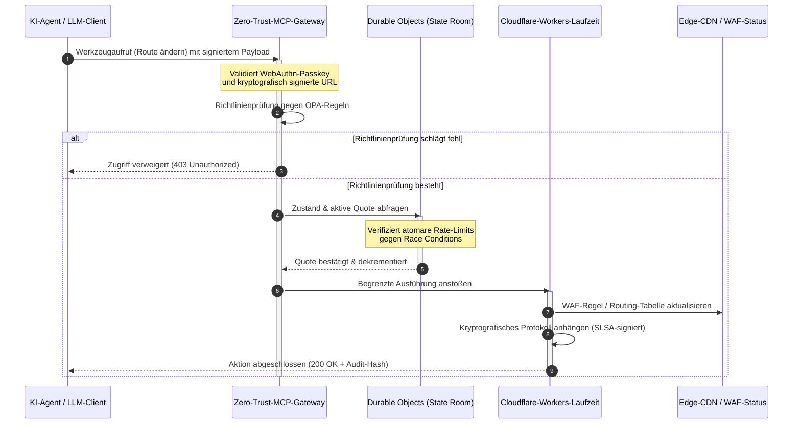

---

# Front Matter (YAML)

author: "contact@sebastienrousseau.com (Sebastien Rousseau)"
banner_alt: "Leuchtender Rechenzentrums-Rack-Stack bei Nacht — Sinnbild für die inspizierbare, agentensteuerbare, quelloffene Edge, auf der CloudCDN aufbaut"
banner_height: "1597"
banner_width: "2584"
banner: "https://cloudcdn.pro/stocks/images/alis-po-IdVNRv-5wJo.webp"
cdn: "https://cloudcdn.pro"
charset: "UTF-8"
cname: "sebastienrousseau.com"
copyright: "© Copyright 2025 - 2026 - Sebastien Rousseau. Alle Rechte vorbehalten."
date: "11. Juni 2026"
description: "CloudCDN macht die Edge zur kryptografisch gesicherten, agentensteuerbaren Steuerungsebene — Zero-Trust-MCP-Gateway, Durable Objects, SLSA Level 3, DORA-Evidenz."
format-detection: "telephone=no"
hreflang: "de"
icon: "https://cloudcdn.pro/clients/sebastienrousseau/v1/logos/sebastienrousseau.svg"
id: "https://sebastienrousseau.com/de/2026-06-11-cloudcdn-open-source-blueprint-ai-native-edge-2026"
image_alt: "Schwarz-Weiß-Porträt von Sebastien Rousseau"
image_height: "162"
image_width: "162"
image: "https://cloudcdn.pro/stocks/images/sebastienrousseau.webp"
keywords: "CloudCDN, KI-native Edge, Open-Source-CDN, MCP-Server, Cloudflare Workers, Durable Objects, Zero Trust, WebAuthn, signierte URLs, SLSA Level 3, DORA, Edge-Steuerungsebene"
language: "de"
last_reviewed: "2026-06-11"
layout: "report"
locale: "de_DE"
logo_alt: "Logo von Sebastien Rousseau"
logo_height: "44"
logo_width: "44"
logo: "https://cloudcdn.pro/clients/sebastienrousseau/v1/logos/sebastienrousseau.svg"
menu: ""
measurementID: "G-169G4ET5HQ"
name: "Sebastien Rousseau"
permalink: "https://sebastienrousseau.com/de/2026-06-11-cloudcdn-open-source-blueprint-ai-native-edge-2026"
rating: "general"
referrer: "no-referrer"
robots: "index, follow"
schema: "FAQPage, Article"
seo_title: "CloudCDN: Quelloffene Blaupause für die KI-native Edge"
short_name: "sebastienrousseau"
subtitle: "Das globale CDN wandert vom statischen Content-Caching zur kryptografisch gesicherten, agentensteuerbaren Edge-Steuerungsebene."
tags: "CloudCDN, Open Source, CDN, Edge, KI-Agenten, MCP, Cloudflare Workers, Durable Objects, Rate-Limiting, Zero Trust, WebAuthn, SLSA, DORA, BCBS 239, Basel III, Cloud-natives Banking"
theme-color: "0, 83, 191"
title: "CloudCDN: Eine quelloffene Blaupause für die KI-native Edge 2026"
url: "https://sebastienrousseau.com/de/2026-06-11-cloudcdn-open-source-blueprint-ai-native-edge-2026"
viewport: "width=device-width, initial-scale=1, shrink-to-fit=no"

# RSS - The RSS feed front matter (YAML).
atom_link: "https://sebastienrousseau.com/2026-06-11-cloudcdn-open-source-blueprint-ai-native-edge-2026/rss.xml"
category: "Technology"
docs: https://validator.w3.org/feed/docs/rss2.html
generator: "Static Site Generator (SSG) (version 0.0.26)"
item_description: "CloudCDN macht die Edge zur kryptografisch gesicherten, agentensteuerbaren Steuerungsebene — Zero-Trust-MCP-Gateway, Durable Objects, SLSA Level 3, DORA-Evidenz."
item_guid: "https://sebastienrousseau.com/2026-06-11-cloudcdn-open-source-blueprint-ai-native-edge-2026/rss.xml"
item_link: "https://sebastienrousseau.com/2026-06-11-cloudcdn-open-source-blueprint-ai-native-edge-2026/rss.xml"
item_pub_date: "Thu, 11 Jun 2026 06:06:06 +0000"
item_title: "CloudCDN: Eine quelloffene Blaupause für die KI-native Edge 2026"
last_build_date: "Thu, 11 Jun 2026 06:06:06 +0000"
managing_editor: "contact@sebastienrousseau.com (Sebastien Rousseau)"
pub_date: "Thu, 11 Jun 2026 06:06:06 +0000"
ttl: "60"
type: "article"
webmaster: "contact@sebastienrousseau.com"

# Apple - The Apple front matter (YAML).
apple_mobile_web_app_orientations: "portrait"
apple_touch_icon_sizes: "192x192"
apple-mobile-web-app-capable: "yes"
apple-mobile-web-app-status-bar-inset: "black"
apple-mobile-web-app-status-bar-style: "black-translucent"
apple-mobile-web-app-title: "CloudCDN: Quelloffene KI-native Edge-Blaupause"
apple-touch-fullscreen: "yes"

# MS Application - The MS Application front matter (YAML).

msapplication-navbutton-color: "0, 83, 191"

# Twitter Card - The Twitter Card front matter (YAML).

twitter_card: "summary_large_image"
twitter_creator: "@wwdseb"
twitter_description: "CloudCDN macht die Edge zur kryptografisch gesicherten, agentensteuerbaren Steuerungsebene — Zero-Trust-MCP-Gateway, Durable Objects, SLSA Level 3, DORA-Evidenz."
twitter_image: "https://cloudcdn.pro/clients/sebastienrousseau/v1/logos/sebastienrousseau.svg"
twitter_image_alt: "Logo von Sebastien Rousseau"
twitter_site: "@wwdseb"
twitter_title: "CloudCDN: Quelloffene Blaupause für die KI-native Edge"
twitter_url: "https://sebastienrousseau.com/de/2026-06-11-cloudcdn-open-source-blueprint-ai-native-edge-2026"

excerpt: "CloudCDN ist eine quelloffene Blaupause für die KI-native Edge — ein Zero-Trust-MCP-Gateway mit 42 Werkzeugen, atomares Durable-Objects-Rate-Limiting, WebAuthn-Passkeys, signierte URLs, SLSA Level 3 Provenance und 3.185 Tests bei 100 % Abdeckung, abgebildet auf DORA, BCBS 239 und Basel III."

# Humans.txt - The Humans.txt front matter (YAML).
author_website: "https://sebastienrousseau.com"
author_twitter: "@wwdseb"
author_location: "London, UK"
thanks: "Danke fürs Lesen!"
site_last_updated: "2026-06-11"
site_standards: "HTML5, CSS3, RSS, Atom, JSON, XML, YAML, Markdown, TOML"
site_components: "Kaishi, Kaishi Builder, Kaishi CLI, Kaishi Templates, Kaishi Themes"
site_software: "Static Site Generator, Rust"

---

# CloudCDN: Eine quelloffene Blaupause für die KI-native Edge 2026

<!-- lead-start: manual -->
<aside class="post-lead" aria-label="Artikelzusammenfassung">

<strong>Kurzfassung.</strong> Unternehmens-IT wird 2026 durch die Konvergenz von global verteilter Serverless-Ausführung und agentischer KI bestimmt. Standard-CDNs — gebaut für statisches Datei-Caching und einfaches Traffic-Routing — sind in einer Ära aktiver Echtzeit-Datenorchestrierung strukturell obsolet. CloudCDN ist eine quelloffene Blaupause, die die Edge zur aktiven Steuerungsebene umwidmet: Serverless-Laufzeiten, zustandsbehaftete Koordination über Cloudflare Durable Objects und ein Zero-Trust-Gateway für das Model Context Protocol (MCP), das autonome KI-Agenten Web-Infrastruktur innerhalb begrenzter, kryptografisch gesicherter Betriebsgrenzen bedienen lässt.

<strong>Kernaussagen</strong>

<ul class="post-lead-takeaways">
  <li><strong>Vom statischen Cache zur begrenzten Steuerungsebene.</strong> CloudCDN verlagert die operative Grenze an die Edge und macht CDN-Knoten zu aktiven Richtlinien-Gates, die Sicherheits-, Routing- und Zugriffsentscheidungen im Submillisekundenbereich ausführen.</li>
  <li><strong>Zustandsbehaftete Edge-Koordination.</strong> Cloudflare Durable Objects erzwingen atomares Echtzeit-Rate-Limiting und globale Zustandskoordination — keine verteilten Race Conditions, kein systemischer Quotenmissbrauch über Edge-Regionen hinweg.</li>
  <li><strong>Sichere agentische Infrastruktursteuerung über MCP.</strong> Ein Zero-Trust-Gateway exponiert 42 spezialisierte MCP-Werkzeuge, mit denen KI-Agenten Infrastruktur unter kryptografisch signierten Grenzen inspizieren, konfigurieren und betreiben.</li>
  <li><strong>Lieferketten-Sicherheit als Pipeline-Ergebnis.</strong> SLSA Level 3 Build-Provenance über Sigstore/Cosign und 3.185 Unit-Tests bei 100 % Abdeckung in jedem Release.</li>
  <li><strong>Nachweise auf Vorstandsebene statt Dashboards.</strong> Edge-Telemetrie bildet direkt auf die Vorstandsverantwortung nach DORA Artikel 5, das Risikoreporting nach BCBS 239 und die Basel-III-Regeln zum operationellen Risikokapital ab.</li>
</ul>

<strong>Weiterführende Beiträge:</strong> <a href="/2026-05-16-best-cloud-infrastructure-architecture-2026/">Beste Cloud-Infrastruktur-Architektur 2026</a> · <a href="/2026-06-05-cloud-native-banking-index-dora-resilience-platform-engineering-2026/">Cloud-Native-Banking-Index 2026</a> · <a href="/2026-06-03-agentic-ai-index-banks-autonomy-governance-auditability-2026/">Agentic-AI-Index für Banken 2026</a>

</aside>
<!-- lead-end -->

Die CDN-Debatte ist entschieden. Die Edge ist kein Cache mehr; sie ist die Steuerungsebene für KI-native Software. Während Agenten Werkzeuge aufrufen, Daten verschieben, Caches leeren, signierte URLs anfordern und Workflows koordinieren, ist das alte Modell aus undurchsichtigen Dashboards und proprietären Steuerungsebenen keine Unannehmlichkeit mehr, sondern ein regulatorisches Haftungsrisiko. CloudCDN plädiert für ein anderes Modell: eine offene, inspizierbare, agentensteuerbare Edge-Plattform, die Sicherheit, Barrierefreiheit, Leistung und Prüfbarkeit als erzwingbare Voreinstellungen behandelt — nicht als Anbieterversprechen.

Der quelloffene Referenzpunkt für diesen Beitrag ist [cloudcdn.pro ⧉](https://github.com/sebastienrousseau/cloudcdn.pro "cloudcdn.pro"). Das Repository ist ein mandantenfähiges, KI-natives CDN, das Ende zu Ende gelesen und unabhängig deployt werden kann: TTFB unter 100 ms über die Cloudflare-PoPs hinweg, MCP-Steuerung, Durable-Objects-Rate-Limiting, WCAG-AA-Barrierefreiheit, signierte URLs, Passkeys, SLSA Level 3 und 3.185 Tests bei 100 % Abdeckung.

---

> **Executive Summary / Kernaussagen für den Vorstand**
>
> - **Die Edge wird zur operativen Grenze.** CloudCDN macht Standard-CDN-Knoten zu aktiven Richtlinien-Gates, die Sicherheit, Routing und Zugriffskontrolle im Submillisekundenbereich ausführen.
> - **Durable Objects machen Rate-Limiting atomar.** Globale, in Echtzeit konsistente Quotendurchsetzung schließt das Race-Condition-Fenster, das eventual-konsistente Limiter Angreifern und fehlfunktionierenden Agenten offenlassen.
> - **Agenten bedienen Infrastruktur über 42 begrenzte MCP-Werkzeuge.** Jeder Aufruf wird gegen WebAuthn-Passkeys, signierte Payloads und OPA-Richtlinien validiert, bevor irgendetwas ausgeführt wird.
> - **Die Lieferkette ist Teil des Produkts.** SLSA Level 3 Provenance über Sigstore/Cosign verknüpft jedes Release kryptografisch mit seinem auditierten Quellcode.
> - **Telemetrie ist Compliance-Nachweis.** Edge-Vorgänge bilden auf DORA Artikel 5, BCBS 239 und das operationelle Risikokapital nach Basel III ab — direkt, nicht über nachgelagertes Reporting.
>
---

## Warum dieses Open-Source-Projekt 2026 relevant ist

Die Unternehmens-IT hat sich 2026 von statischer Infrastruktur-Bereitstellung zur ereignisgesteuerten Echtzeit-Datenorchestrierung bewegt. Zwei Marktkräfte treiben diesen Wandel.

Die erste ist die Verbreitung agentischer KI. Autonome Modelle und Software-Agenten führen inzwischen komplexe operative Aufgaben aus — automatisierte Bedrohungsabwehr, Routing-Entscheidungen, Echtzeit-Saldierung von Ledgern. Sie benutzen keine Dashboards. Sie rufen Werkzeuge auf.

Die zweite ist die aktive Durchsetzung des [Digital Operational Resilience Act (DORA) ⧉](https://eur-lex.europa.eu/legal-content/EN/TXT/?uri=CELEX%3A32022R2554 "Verordnung (EU) 2022/2554 über die digitale operationale Resilienz im Finanzsektor"). Banken können sich nicht länger auf undurchsichtige, proprietäre Dritt-CDNs verlassen. Aufsichtsbehörden verlangen vollständige Sichtbarkeit in die Software-Lieferkette, nachweisbare Exit-Fähigkeit und unveränderliche kryptografische Audit-Trails.

Zentralisierte Server-Architekturen erzeugen Latenzkosten, die Echtzeit-Orchestrierung nicht absorbieren kann. Proprietäre CDNs funktionieren als Blackboxes, die Institute einer Lieferketten-Kompromittierung aussetzen, die sie weder sehen noch belegen können. CloudCDN schließt diese Lücke mit einer transparenten, quelloffenen Zero-Trust-Blaupause, die die Edge zur aktiven Steuerungsebene macht. Für Technologievorstände verschiebt das die Diskussion von den Kosten der Compliance zum Return on Resilience: Kapital, das durch automatisierte, audit-fähige operative Pipelines erhalten bleibt.

## Die Architektur-Linse

Die CloudCDN-Architektur ist in fünf Schichten gegliedert und ersetzt zentralisierte Middleware durch lokalisierte, zustandsbehaftete Edge-Primitive:

| Schicht | Designentscheidung | Warum es zählt | Risiko bei Fehlsteuerung |
|---|---|---|---|
| **Edge-Laufzeitumgebung** | Cloudflare Workers und Pages | Eliminiert die Latenz zentralisierter VMs; führt Richtlinien global im Submillisekundenbereich aus | Leistungsgewinne ohne Richtliniendisziplin erzeugen chaotische Edge-Drift |
| **Zustandskoordination** | Durable Objects | Garantiert atomare Echtzeit-Konsistenz für Rate-Limits und gemeinsamen Zustand über Regionen hinweg | Verteilte Race Conditions, Missbrauch von API-Ressourcen, umgangene Perimeter-Quoten |
| **Agenten-Schnittstelle** | Zero-Trust-MCP-Gateway | Exponiert 42 spezialisierte MCP-Werkzeuge, damit KI-Agenten Infrastruktur unter regulierten Grenzen bedienen | Unbegrenzter Werkzeugaufruf und unautorisierte Konfigurationsänderungen |
| **Zugriffskontrolle** | WebAuthn-Passkeys und signierte URLs | Ersetzt statische Passwörter durch kryptografische Signaturen für prüfbare Vorgänge | Schwach zugeordnete Änderungen; Credential-Diebstahl bis zum Perimeter-Durchbruch |
| **Qualitätsgates** | SLSA Level 3 und 100 % Testabdeckung | Verifiziert die Build-Quelle mathematisch; blockiert bösartige Dependency-Injection | Über die Software-Lieferkette eingeschleuster Schadcode |

## Zu verfolgende operative Signale

Edge-Reife ist messbar. Dies sind die quantitativen Indikatoren, die Umsetzungsfähigkeit statt Absichtserklärungen belegen:

| Signal | Metrik / Benchmark | Regulatorische Referenz | Plattform-Implementierung |
|---|---|---|---|
| **42 MCP-Werkzeuge** | Begrenzter Werkzeug-Registry-Umfang für automatisiertes Management | COBIT 2019 (BAI06) | MCP-Gateway, das Agentensignaturen gegen OPA-Richtlinien validiert |
| **Durable Objects** | Leckfreie, atomare Quotendurchsetzung im Submillisekundenbereich | DORA Artikel 6 | Durable Objects, die den globalen API-Quotenstatus führen |
| **Passkeys und signierte URLs** | 100 % der Admin-Sessions über FIDO2 WebAuthn verifiziert | DORA Artikel 30 | Kryptografische Signaturprüfungen direkt im Edge-Router |
| **SLSA Level 3** | Kryptografisch signierte Build-Manifeste (Sigstore) | DORA Artikel 30 | GitHub-Actions-Pipelines, die signierte Build-Metadaten erzeugen |
| **3.185 Unit-Tests** | 100 % Abdeckung; Regressions-Gates in jedem Release | NIST CSF 2.0 (PR.DS-01) | CI-Pipelines, die das Deployment bei jedem Testfehler stoppen |

## Das CDN wird zur aktiven Steuerungsebene

Traditionelle CDNs wurden um passive, statische Inhaltsbeschleunigung herum entworfen. CloudCDN definiert das Modell neu. Mit integrierten Cloudflare Workers und Durable Objects funktioniert die Edge als aktives, zustandsbehaftetes Richtlinien-Gate.

Wenn ein KI-Agent oder ein automatisierter Prozess eine Infrastruktur-Konfigurationsänderung oder eine Routing-Anpassung anfordert, spricht er nicht mit einer verwundbaren, zentralisierten Datenbank. Die Anfrage wird am nächstgelegenen Edge-Knoten abgefangen und durch Identitäts-, Richtlinien- und Quotenprüfungen geführt, bevor irgendetwas ausgeführt wird:

Jeder Schritt in dieser Sequenz erzeugt einen zuordenbaren, signierten Datensatz. Das ist der Unterschied zwischen einem CDN, das Inhalte beschleunigt, und einer Steuerungsebene, die sich tatsächlich steuern lässt.

## Warum Open Source das Vertrauensmodell verändert

Für Chief Information Security Officers stellen undurchsichtige proprietäre CDNs ein sich aufschaukelndes Risiko dar. Closed-Source-Edge-Netzwerke sind Blackboxes: Erleidet der Anbieter eine interne Kompromittierung, hat die Bank null Sichtbarkeit, bis der Vorfall öffentlich bekannt wird.

CloudCDN ersetzt diese Asymmetrie durch ein vollständig prüfbares, quelloffenes Vertrauensmodell auf drei Mechanismen:

1. **Mathematische Build-Provenance.** Unter SLSA Level 3 ist jedes Release kryptografisch mit seinem quelloffenen GitHub-Repository verknüpft. Ein CISO kann verifizieren — mathematisch, nicht vertraglich —, dass das Binary auf den globalen Edge-Knoten von Cloudflare exakt den auditierten Quellcode enthält.
2. **Kontinuierliche, öffentliche Sicherheitsaudits.** Die Codebasis durchläuft automatisierte Scans, öffentliche Schwachstellen-Offenlegung und peer-reviewte Code-Audits. Verschleierung ist keine Kontrolle; Review ist es.
3. **Kein Vendor-Lock-in (DORA Artikel 28).** DORA verlangt von Banken den Nachweis einer klaren, getesteten Exit-Strategie für kritische Drittanbieter. Weil CloudCDN quelloffen ist und auf Standard-Serverless-Primitiven aufbaut, können Institute Edge-Konfigurationen von Cloudflare auf andere Serverless-Laufzeiten oder private Kubernetes-Cluster migrieren — und diese Fähigkeit gegenüber der Aufsicht belegen.

## Das bankfähige Edge-Muster

CloudCDN ist darauf ausgelegt, die Compliance-Standards des globalen Finanzsektors zu erfüllen, und bildet technische Edge-Vorgänge direkt auf die Rahmenwerke ab, die Aufseher tatsächlich prüfen:

- **Modellrisikomanagement ([US Fed SR 11-7 ⧉](https://www.federalreserve.gov/supervisionreg/srletters/sr1107.htm "Supervisory Guidance on Model Risk Management") / UK PRA SS1/23).** Autonome Modelle, die operative Aufgaben ausführen, fallen unter die Modellrisiko-Governance. Das MCP-Gateway von CloudCDN behandelt agentische Werkzeuge wie quantitative Modelle: strikte Richtliniengrenzen, Echtzeit-Protokollierung und verpflichtende Human-in-the-Loop-Freigaben für Aktionen mit hoher Tragweite.
- **BCBS 239 (Risikodatenaggregation).** Durch das Erfassen, Taggen und Strukturieren von Transaktionsdaten an der Edge entstehen operative Metriken in Echtzeit — passend zu den BCBS-239-Anforderungen an Datenintegrität, Aktualität und aufsichtsrechtliche Nachvollziehbarkeit.
- **DORA Artikel 5 (Vorstandsverantwortung).** Der Vorstand trägt die letztliche persönliche Haftung für operationale Resilienz. CloudCDN übersetzt Edge-Telemetrie in quantifizierte, verifizierbare Nachweise, die auch nicht-technische Direktoren in ein Audit mit persönlicher Haftung mitnehmen können.
- **Operationelles Risikokapital nach Basel III.** Banken halten regulatorisches Kapital gegen operationelle Risiken vor. Automatisiertes DR-Failover und SLSA Level 3 Provenance senken das operationelle Risikoprofil des Instituts — und erhalten Kapital in der Bilanz, statt nur ein Audit zu bestehen.

## Was das je Banktyp bedeutet

### Global systemrelevante Banken (G-SIBs)

G-SIBs verarbeiten massive Transaktionsvolumina über mehrere Jurisdiktionen hinweg. Die Priorität liegt darin, fragmentierte Legacy-Perimeterkontrollen durch eine einzige, einheitliche Edge-Ebene zu ersetzen. Mit dem CloudCDN-Muster kann eine G-SIB Sicherheitsrichtlinien, API-Gateways und agentische Governance global standardisieren — und DORA-konforme Nachweis-Pipelines als Nebenprodukt des Betriebs erzeugen statt im vierteljährlichen Endspurt.

### Transaktions- und Firmenkundenbanken

Für Transaktionsbanken ist das kundenseitige Produkt ein Bündel aus Ausführungsgeschwindigkeit, Sicherheit und Datentransparenz. Das CloudCDN-Muster erlaubt diesen Banken, Corporate Treasurern sichere API-Dashboards und Echtzeit-Cash-Tracking anzubieten — eine resiliente Edge-Aufstellung, die Unternehmenseinlagen verteidigt.

### Regionale und kleinere Banken

Regionalbanken stehen denselben Angreifern gegenüber wie G-SIBs, ohne deren Engineering-Budgets. Eine quelloffene, bankfähige Edge-Blaupause liefert die Kontrollen ab Werk: sofortige regulatorische Ausrichtung ohne proprietäre Lizenzkosten — und den Quellcode als Beleg.

## Das Playbook für den Vorstand

Operationale Resilienz ist keine unsichtbare Backoffice-IT-Kennzahl mehr; sie ist eine Vorstandspriorität mit persönlicher Haftung. Die Institute, die 2026 das Vertrauen von Aufsehern, Kunden und Aktionären behalten, behandeln Technologie als verifizierbaren, beobachtbaren Vermögenswert.

Die Roadmap für Senior-Technologieverantwortliche ist kurz:

1. **Nachweise als Produkt verankern.** Budget für automatisierte, selbstdokumentierende Pipelines an der Edge — Nachweise, die der Betrieb erzeugt, nicht der Auditor zusammenträgt.
2. **Auf zustandsbehaftete Edge-Kontrolle umstellen.** Rate-Limiting, WAF und Identitätsprüfung von zentralisierten Servern auf atomare Edge-Primitive verlagern.
3. **Kryptografische Agentengrenzen etablieren.** Zero-Trust-MCP-Gateways mit Passkey- und OPA-Validierung für jeden automatisierten Werkzeugaufruf erzwingen.
4. **Quelloffene Build-Audits verlangen.** SLSA Level 3 Build-Provenance zur Deployment-Bedingung machen, nicht zur Absichtserklärung.

## Häufig gestellte Fragen

**Ist CloudCDN bereit für DORA-Audits?**

Ja. CloudCDN ist darauf ausgelegt, automatisierte Compliance-Nachweise zu erzeugen, die direkt auf die ITS-Templates des Informationsregisters (RT.01 bis RT.15) und die Vertragsklauseln nach DORA Artikel 30 abbilden.

**Was ist der Vorteil von Durable Objects für das Rate-Limiting?**

Traditionelle verteilte Rate-Limiter beruhen auf Eventual Consistency, was ein Latenzfenster offenlässt, das Angreifer oder fehlfunktionierende Agenten ausnutzen können. Durable Objects garantieren sofortige, atomare Konsistenz weltweit und schließen das Race-Condition-Fenster vollständig.

**Was macht CloudCDN KI-nativ?**

Seine MCP-gesteuerten Vorgänge und sein agentensensitives Steuerungsmodell. Infrastruktur wird über 42 regulierte Werkzeuge mit kryptografischer Identität und Richtliniengrenzen bedient — entworfen für autonome Workflows, nicht nur für menschliche Dashboards.

**Erhöht quelloffener Code das Risiko von Zero-Day-Exploits?**

Nein. Proprietäre Closed-Source-CDNs setzen auf Sicherheit durch Verschleierung. Die Codebasis von CloudCDN durchläuft kontinuierlich automatisierte Tests, öffentliches Peer-Review und SLSA Level 3 Validierung — eine nachweisbar höhere Vertrauensschwelle.

## Quellen

- Europäisches Parlament und Rat der Europäischen Union, (2022). [Verordnung (EU) 2022/2554 über die digitale operationale Resilienz im Finanzsektor (DORA) ⧉](https://eur-lex.europa.eu/legal-content/EN/TXT/?uri=CELEX%3A32022R2554 "Verordnung (EU) 2022/2554 über die digitale operationale Resilienz im Finanzsektor (DORA)"). Brüssel: Amtsblatt der Europäischen Union.
- Basler Ausschuss für Bankenaufsicht (BCBS), (2013). [Grundsätze für die effektive Aggregation von Risikodaten und die Risikoberichterstattung (BCBS 239) ⧉](https://www.bis.org/publ/bcbs239.htm "Grundsätze für die effektive Aggregation von Risikodaten und die Risikoberichterstattung (BCBS 239)"). Basel: Bank für Internationalen Zahlungsausgleich.
- Board of Governors of the Federal Reserve System, (2011). [Supervisory Guidance on Model Risk Management (SR Letter 11-7) ⧉](https://www.federalreserve.gov/supervisionreg/srletters/sr1107.htm "Supervisory Guidance on Model Risk Management (SR Letter 11-7)"). Washington D.C.: Federal Reserve.
- Cloudflare, (2026). [Dokumentation zu Durable Objects: zustandsbehaftete Edge-Koordination ⧉](https://developers.cloudflare.com/durable-objects/ "Dokumentation zu Durable Objects"). San Francisco: Cloudflare.
- Cloudflare, (2026). [KI-Agenten mit MCP, Authentifizierung und Durable Objects bauen ⧉](https://blog.cloudflare.com/building-ai-agents-with-mcp-authn-authz-and-durable-objects/ "KI-Agenten mit MCP, Authentifizierung und Durable Objects bauen").
- GitHub, (2026). [cloudcdn.pro-Repository ⧉](https://github.com/sebastienrousseau/cloudcdn.pro "cloudcdn.pro-Repository").

<!-- enrich-start -->
<aside class="author-card" aria-label="Über den Autor"><strong class="author-card-name"><a href="/about/index.html">Sebastien Rousseau</a></strong>Senior Banking-Technologe, der über angewandte KI, Zahlungsinfrastruktur, tokenisiertes Geld, ISO 20022, Post-Quanten-Sicherheit, Cloud-native Finanzdienstleistungen, quelloffene Infrastruktur und regulierte digitale Märkte schreibt.Mehr als 20 Jahre Erfahrung bei HSBC Commercial &amp; Investment Bank, PayPal, Barclays, Shazam, AKQA und Virgin Group. <a href="/about/index.html">Vollständiges Profil</a> &middot; <a href="https://www.linkedin.com/in/sebastienrousseau/" rel="external noopener">LinkedIn</a> &middot; <a href="https://github.com/sebastienrousseau" rel="external noopener">GitHub</a></aside>

Zuletzt geprüft <time datetime="2026-06-11">2026-06-11</time>.

<!-- enrich-end -->
