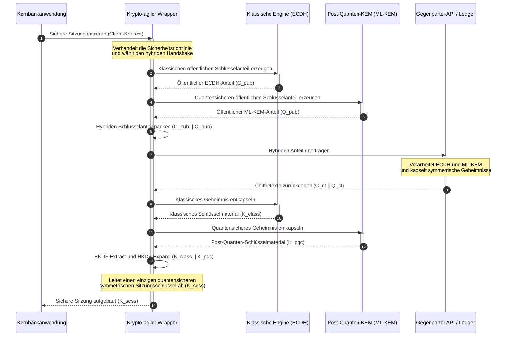

# KyberLib und die Post-Quanten-Migration der Banken 2026: Von Normen zu Code

<!-- lead-start: manual -->
<aside class="post-lead" aria-label="Artikelzusammenfassung">

<strong>Kurzfassung.</strong> Die Bankeninfrastruktur steht 2026 vor einer systemischen Bedrohung mit bekanntem Endpunkt: Rechenleistung im Quantenmaßstab wird den RSA- und ECC-Schlüsselaustausch brechen, der den heutigen Transitverkehr schützt. Bundesnormen und aufsichtsrechtliche Positionspapiere haben das Bewusstsein geschärft; die technische Umsetzung bleibt fragmentiert. <a href="https://github.com/sebastienrousseau/kyberlib">KyberLib</a> ist ein quelloffener Engineering-Bauplan, der das Post-Quanten-Narrativ in konkreten, speichersicheren Rust-Code überführt — mit dem NIST-standardisierten ML-KEM (FIPS 203) hinter krypto-agilen Abstraktionsgrenzen, damit Institute Transportsicherheit und Schlüsselkapselung aufrüsten, bevor „Store Now, Decrypt Later"-Angriffe ihre Archive erreichen.

<strong>Kernaussagen</strong>

<ul class="post-lead-takeaways">
  <li><strong>Von der Richtlinie zu inspizierbarem Code.</strong> KyberLib überführt Post-Quanten-Kryptografie aus abstrakten strategischen Roadmaps in konkrete, hochperformante, prüfbare Rust-Implementierungen.</li>
  <li><strong>Standardisierte FIPS 203 ML-KEM-Umsetzung.</strong> Die Bibliothek implementiert ML-KEM — den unter NIST FIPS 203 finalisierten Schlüsselvereinbarungsalgorithmus — und hält die Konformität an den globalen regulatorischen Erwartungen ausgerichtet.</li>
  <li><strong>Krypto-Agilität als Designprinzip.</strong> Stabile Abstraktionsgrenzen erlauben Bankanwendungen den Austausch kryptografischer Primitive ohne teure, fehleranfällige Neuentwicklungen.</li>
  <li><strong>Speichersicherheit durch Rust.</strong> Ownership-Regeln zur Kompilierzeit beseitigen die Pufferüberläufe und Speicherlecks, die C-basierte Alt-Kryptobibliotheken plagen — bei Zero-Cost-Abstraction-Geschwindigkeit.</li>
  <li><strong>Minderung der Organhaftung.</strong> Beobachtbare, testbare Migrationsnachweise liefern Verwaltungsräten genau die Dokumentation „angemessener Schritte", die Prüfungen der persönlichen Verantwortlichkeit nach DORA Artikel 5 verlangen.</li>
</ul>

<strong>Weiterführende Beiträge:</strong> <a href="/2026-05-18-quantum-cryptography-standards-developments-2026/">Der Quantenkryptografie-Reset 2026: PQC-Normen, QKD-Zusicherung und die Migrationsarbeit, die Banken nicht aufschieben können</a>, <a href="/2026-05-28-dora-ai-act-data-sovereignty-banking-compliance-stack-2026/">DORA, EU-KI-Verordnung und Datensouveränität: Der Compliance-Stack 2026 für Banken</a>, <a href="/2026-05-20-cloud-native-banking-financial-institutions-2026/">Cloud-natives Banking 2026</a>.

</aside>
<!-- lead-end -->

Die Post-Quanten-Migration ist keine Planungsübung mehr. 2026 ist sie eine aktive betriebliche Anforderung, und die Lücke zwischen regulatorischer Absicht und technischer Umsetzung ist der Ort, an dem das Risiko jetzt sitzt. [KyberLib ⧉](https://github.com/sebastienrousseau/kyberlib "kyberlib") schließt einen Teil dieser Lücke: eine produktionsorientierte, speichersichere Rust-Bibliothek, die ML-KEM nach den finalisierten FIPS 203-Parametern implementiert und in die krypto-agilen Grenzen einbettet, die der Transaktionsbestand einer Bank tatsächlich braucht.

---

> **Executive Summary / Kernaussagen für den Vorstand**
>
> - **Die Bedrohung ist bereits operativ.** Angreifer betreiben „Store Now, Decrypt Later"-Abschöpfung schon heute; die Vertraulichkeit von Daten fällt rückwirkend an dem Tag, an dem ein kryptografisch relevanter Quantencomputer eintrifft.
> - **Die Normen sind finalisiert.** NIST FIPS 203 (ML-KEM) und FIPS 204 (ML-DSA) geben Prüfungsausschüssen einen klaren, testbaren Maßstab — die Verteidigungslinie „wir warten auf Normen" existiert nicht mehr.
> - **KyberLib ist der Engineering-Bauplan.** Speichersicheres Rust, `no_std`-Kompilierung für HSM und Smartcards sowie hybride Handshake-Muster, die klassische Interoperabilität bewahren.
> - **Krypto-Agilität ist das dauerhafte Ziel.** Stabile Abstraktionsgrenzen erlauben den Wechsel von Primitiven ohne Anwendungs-Neuentwicklung — die Lektion, die jeden einzelnen Algorithmus überdauert.
> - **Vorstände tragen die Haftung.** DORA Artikel 5 weist Direktoren persönliche Verantwortung zu; inspizierbarer, beobachtbarer Migrationscode ist der Nachweis, der sie erfüllt.
>
---

## Warum dieses Open-Source-Projekt 2026 zählt

Während sich die asymmetrische Kryptografie ihrem Ablaufdatum nähert, wartet die Bedrohung nicht auf den Bau eines kryptografisch relevanten Quantencomputers. Angreifer führen **„Store Now, Decrypt Later" (SNDL)**-Angriffe bereits heute aus — sie schöpfen verschlüsselte Transitströme von Firmenkundentransaktionen, Geschäftsgeheimnissen und institutioneller Kommunikation ab, um sie zu entschlüsseln, sobald Quantenkapazitäten ausreifen. Für eine Bank ist jeder klassische Handshake, der heute über die Leitung geht, ein Vertraulichkeitsbruch mit verzögertem Zünddatum.

Die Regulierer haben mit konkreten Pflichten reagiert:

1. **DORA Artikel 6 (IKT-Risikomanagement)** verpflichtet Institute, Schwachstellen über ihren gesamten kryptografischen Bestand zu kartieren, zu identifizieren und zu mindern — einschließlich des asymmetrischen Schlüsselaustauschs, der in Middleware vergraben liegt, die niemand inventarisiert hat.
2. **NIST FIPS 203 und 204** etablieren die offiziellen Post-Quanten-Normen für Schlüsselkapselung (ML-KEM) und digitale Signaturen (ML-DSA) und geben Prüfungsausschüssen einen standardisierten Maßstab, an dem der Migrationsfortschritt gemessen wird.

Diese Migration ohne Störung des laufenden Betriebs auszuführen erfordert den Schritt über Richtlinienpapiere hinaus zu **inspizierbarer, quelloffener kryptografischer Infrastruktur**. [KyberLib ⧉](https://github.com/sebastienrousseau/kyberlib "kyberlib") liefert genau das: eine speichersichere, FIPS 203-konforme Rust-Bibliothek, die den Post-Quanten-Übergang in eine messbare, verifizierbare Engineering-Pipeline verwandelt — und das Gespräch über Technologieinvestitionen auf einen greifbaren Return on Resilience verlagert.

## Die Architektur-Linse

KyberLib sitzt hinter stabilen API-Grenzen und schirmt die transaktionalen Kernanwendungen einer Bank gegen Änderungen an niedrigstufigen kryptografischen Primitiven ab.

| Schicht | Designentscheidung | Warum es zählt | Risiko bei Fehlsteuerung |
|---|---|---|---|
| **Primitiv** | FIPS 203 ML-KEM-Schlüsselkapselung | Ersetzt klassischen Diffie-Hellman- und RSA-Schlüsselaustausch durch gitterbasierte Strukturen | Nichtkonformität mit den finalisierten FIPS 203-Parametern und damit gescheiterte Compliance-Prüfungen |
| **Sprache** | Speichersichere Rust-Implementierung | Eliminiert die Speicherkorruptions-Schwachstellen (Pufferüberläufe, Use-after-free), die für C/C++ endemisch sind | Wuchernde Abhängigkeiten, die die Integrität der Build-Kette kompromittieren |
| **Abstraktion** | Stabile krypto-agile Grenzen | Anwendungen wechseln Algorithmen hinter einer einheitlichen Schnittstelle, während sich Normen weiterentwickeln | Fest verdrahtete Primitive, die bei jeder künftigen Migration manuelle Neuentwicklungen erzwingen |
| **Bereitstellung** | Hybride Verschlüsselungs-Handshakes | Kombiniert Post-Quanten-KEMs mit klassischen Algorithmen in einer doppelt gekapselten Hülle | Verlust der Alt-Interoperabilität oder schleichende Konfigurationsdrift |
| **Zusicherung** | SLSA Level 3-Provenienz und inspizierbare Tests | Garantiert Codequelle und Herkunft; Beispiele lassen sich Zeile für Zeile prüfen | Sicherheitstheater — Blackbox-Bibliotheken, deren Implementierungsfehler erst in der Produktion auftauchen |

## Zu verfolgende operative Signale

Post-Quanten-Compliance gegenüber Aufsichtsgremien und Regulierern nachzuweisen heißt, spezifische, quantifizierbare Kennzahlen zu verfolgen:

| Signal | Metrik | Regulatorische Referenz | Plattform-Implementierung |
|---|---|---|---|
| **FIPS 203 ML-KEM-Konformität** | 100 % Konformität mit den finalisierten Parametern (ML-KEM-512/768/1024) | NIST FIPS 203 | Parameterverifizierte Gitterkryptografie, kompiliert in KyberLib-Modulen |
| **Kryptografisches Inventar** | Vollständiges Inventar der Nutzung asymmetrischen Schlüsselaustauschs über alle Systeme | NIST SP 1800-38 | Automatisierte Scan-Agenten, die aktive Cipher-Suites in ein zentrales Register protokollieren |
| **Hybrider Schlüsselaustausch** | Anteil der Transport-Handshakes, die in einer hybriden Hülle ausgeführt werden | DORA Artikel 6 | Netzwerk-Proxys, die klassische TLS 1.3-Handshakes in PQC-Kapselung einbetten |
| **`no_std`-Kompilierung** | Fähigkeit, ohne Rusts Standardbibliothek für ressourcenbeschränkte Ziele zu kompilieren | DORA Artikel 30 | Bedingte `no_std`-Kompilierung in KyberLib für Hardware-Sicherheitsmodule (HSM) |
| **Krypto-Agilitätsindex** | Zeit in Minuten für den Austausch eines kryptografischen Primitivs am API-Gateway | UK PRA SS1/23 | Abstrahierte Routing-Register, die die Algorithmuszuteilung über Laufzeitvariablen steuern |

## Warum Rust für Post-Quanten-Kryptografie zählt

Post-Quanten-Algorithmen wie ML-KEM zu implementieren erfordert komplexe, niedrigstufige mathematische Operationen auf Polynomringen. Historisch bedeutete der Betrieb dieser Operationen in Produktionsgeschwindigkeit handgeschriebenes C/C++ oder Assembler — eine große Angriffsfläche für Speicherkorruption, ausgerechnet in dem Code, den sich eine Bank am wenigsten falsch leisten kann.

Rust verändert die Sicherheitslage des Kryptografie-Engineerings auf drei konkrete Arten:

1. **Speichersicherheit zur Kompilierzeit.** Rusts Ownership-Modell garantiert, dass Pufferüberläufe, Double-frees und Use-after-free-Fehler bereits beim Kompilieren verhindert werden. Das wiegt bei Post-Quanten-Bibliotheken besonders schwer, weil Schlüsselgrößen und Chiffretexte deutlich größer ausfallen als ihre klassischen Gegenstücke.
2. **Deterministische Zero-Cost-Abstraktionen.** Rust kompiliert ohne Garbage Collector zu nativem Maschinencode; Ausführungsgeschwindigkeit und Speicherbedarf erreichen oder übertreffen C-basierte Bibliotheken — bei erhaltener Sicherheit.
3. **`no_std`-Kompatibilität.** KyberLib kompiliert ohne Rusts Standardbibliothek und läuft damit in ressourcenbeschränkten Bare-Metal-Umgebungen — Hardware-Sicherheitsmodule (HSM) und Smartcards eingeschlossen — und hält bankfeste Kryptografie innerhalb physischer Sicherheitsgrenzen.

## Eine krypto-agile Architektur entwerfen

Der klassische Fehlermodus kryptografischer Migrationen ist das Festverdrahten: algorithmusspezifische Annahmen, direkt in die Anwendungslogik eingebettet und bei jedem Übergang schmerzhaft neu entdeckt. Das dauerhafte Ziel für 2026 ist **Krypto-Agilität** — eine Abstraktionsschicht, die Algorithmen als austauschbare Module hinter einer stabilen Schnittstelle behandelt, sodass die nächste Migration eine Konfigurationsänderung ist statt einer Neuentwicklung über den gesamten Bestand.

Die folgende Sequenz zeigt, wie der krypto-agile Wrapper von KyberLib einen hybriden (klassischen plus post-quanten) Schlüsselaustausch-Handshake koordiniert:

Die hybride Hülle ist das operativ entscheidende Detail. Bis Post-Quanten-Primitive Jahre an Produktionsprüfung angesammelt haben, wird der Sitzungsschlüssel sowohl aus dem klassischen als auch aus dem Post-Quanten-Geheimnis abgeleitet: Ein Angreifer muss ECDH **und** ML-KEM brechen, um den Kanal zu kompromittieren. Gegenparteien, die noch nicht migriert haben, bleiben arbeitsfähig; Gegenparteien, die migriert haben, erhalten sofort gitterbasierten Schutz.

## Das Playbook für den Vorstand

Post-Quanten-Sicherheit ist kein Backoffice-Verschlüsselungsthema, sondern eine Governance-Frage des Vorstands mit persönlichem Einsatz. Die Geschäftsleitung sollte die Migration durch die Linse der Treuepflicht rahmen:

- **DORA Artikel 5 (Governance und Organisation)** weist dem Leitungsorgan persönliche Verantwortung für die IKT-Sicherheit zu. Quelloffene, beobachtbare Tests sind der direkte Nachweis, den eine Prüfung der persönlichen Haftung verlangt — „wir haben eine inspizierbare FIPS 203-Implementierung gewählt, und hier sind ihre Konformitätsläufe" ist eine verteidigungsfähige Antwort; „unser Anbieter hat es uns zugesichert" ist es nicht.
- **Modellrisikomanagement (US Fed SR 11-7 / UK PRA SS1/23)** gilt für kryptografische Wrapper-Architekturen ebenso wie für Bewertungsmodelle. Abstraktionsschichten sollten die MRM-Validierung durchlaufen, einschließlich Performance unter extremen Störungsszenarien.
- **Operationelles Risikokapital nach Basel III** belohnt nachgewiesene Kontrollreife. Getestete hybride Handshakes senken das langfristige operationelle Risikoprofil des Instituts, verringern den Kapitalaufschlag und setzen Bilanzkapazität für den aktiven Treasury-Einsatz frei.

## Was das je Banktyp bedeutet

### Global systemrelevante Banken (G-SIBs)

G-SIBs betreiben transaktionale Bestände mit hohem Altsystemanteil; ihre bindende Restriktion ist daher die Entdeckung: zu wissen, wo asymmetrischer Schlüsselaustausch tatsächlich stattfindet. Kontinuierliche kryptografische Inventare nach den Leitlinien von NIST SP 1800-38 kommen zuerst; KyberLib liefert anschließend die standardisierte, speichersichere Bibliothek, um Post-Quanten-Schlüsselkapselung auf jedem modernen Knoten auszuführen, den das Inventar zutage fördert.

### Transaktions- und Firmenkundenbanken

Vertraulichkeit über die Zahlungsschienen hinweg ist das Kerngeschäft. Weil KyberLib auf Bare-Metal-`no_std`-Ziele kompiliert, können Transaktionsbanken Post-Quanten-Handshakes direkt in der Hardware für Zahlungs-Routing und Liquiditätssteuerung am Netzrand ausbringen — nicht nur in der Anwendungsschicht.

### Regionale und kleinere Banken

Regionale Institute stehen derselben staatlich gestützten Datenabschöpfung gegenüber — ohne die Forschungsbudgets der G-SIBs. Eine inspizierbare, quelloffene Rust-Implementierung gibt ihnen sofort einen schlüsselfertigen Pfad zur NIST FIPS 203-Konformität, ohne über Blackbox-Roadmaps von Anbietern verhandeln zu müssen.

## Von Roadmaps zu kompilierendem Code

Der Post-Quanten-Übergang ist eine aktive Engineering-Aufgabe, und die Institute, die das Vertrauen von Aufsehern, Gegenparteien und Corporate Treasurern durch 2026 hindurch bewahren, sind diejenigen, die von abstrakten Roadmaps zu beobachtbarem, kompilierendem Code übergehen. Das Mandat der Geschäftsleitung folgt daraus unmittelbar: die Alt-Schlüsselaustauschpunkte auditieren, hybride Handshakes auf den werthaltigsten Kanälen ausbringen und die stabilen Abstraktionsgrenzen bauen, die jeden künftigen Primitivwechsel zur Routine machen. KyberLib macht jeden dieser Schritte zu einer messbaren operativen Fähigkeit statt einer Folienzusage.

## Häufig gestellte Fragen

**Ist KyberLib konform mit den finalisierten NIST-Normen?**

Ja. KyberLib ist um die Parameter von ML-KEM herum entworfen, wie sie in FIPS 203 finalisiert wurden, und hält die kompilierte Bibliothek an den föderalen und globalen regulatorischen Erwartungen ausgerichtet.

**Erfordert eine Post-Quanten-Bibliothek spezialisierte Hardware?**

Nein. Die Rust-Implementierung von KyberLib kompiliert auf Standard-Systemarchitekturen. Die `no_std`-Fähigkeit erlaubt zusätzlich den Betrieb auf spezialisierten Hardware-Sicherheitsmodulen (HSM) und Smartcards, wo physische Schlüsselverwahrung erforderlich ist.

**Wie wirkt sich „Store Now, Decrypt Later" auf die heutige Compliance aus?**

Stützt sich die Transportschicht auf klassisches RSA oder ECC, können Angreifer den Verkehr heute abschöpfen und entschlüsseln, sobald Quantenkapazität ausreift. Jetzt ausgebrachter hybrider Schlüsselaustausch hält erbeutete Daten hinter gitterbasiertem Schutz.

**Warum hybride Handshakes statt eines direkten Wechsels zu Post-Quanten-Primitiven?**

Hybride Hüllen leiten den Sitzungsschlüssel sowohl aus einem klassischen als auch aus einem Post-Quanten-Geheimnis ab; die Sicherheit hält, solange nicht beide gebrochen sind. Das bewahrt die Interoperabilität mit nicht migrierten Gegenparteien, während die neuen Primitive Produktionsprüfung ansammeln.

## Quellen

- National Institute of Standards and Technology, (2024). [FIPS 203: Module-Lattice-Based Key-Encapsulation Mechanism Standard ⧉](https://www.nist.gov/news-events/news/2024/08/nist-releases-first-3-finalized-post-quantum-encryption-standards "NIST-Ankündigung zu FIPS 203").
- Board of Governors of the Federal Reserve System, (2011). [Supervisory Guidance on Model Risk Management (SR Letter 11-7) ⧉](https://web.archive.org/web/20260414150921/https://www.federalreserve.gov/supervisionreg/srletters/sr1107.htm "Federal Reserve SR 11-7").
- Europäisches Parlament und Rat der Europäischen Union, (2022). [Verordnung (EU) 2022/2554 über die digitale operationale Resilienz im Finanzsektor (DORA) ⧉](https://eur-lex.europa.eu/legal-content/EN/TXT/?uri=CELEX%3A32022R2554 "DORA-Verordnung").
- NIST National Cybersecurity Center of Excellence, (2025). [Migration to Post-Quantum Cryptography (NIST SP 1800-38) ⧉](https://www.nccoe.nist.gov/projects/migration-post-quantum-cryptography "NIST SP 1800-38").
- GitHub, (2026). [Quelloffenes kyberlib-Repository ⧉](https://github.com/sebastienrousseau/kyberlib "kyberlib-Repository").

<!-- enrich-start -->
<aside class="author-card" aria-label="Über den Autor"><strong class="author-card-name"><a href="/about/index.html">Sebastien Rousseau</a></strong>Senior Banking-Technologe, der über angewandte KI, Zahlungsinfrastruktur, tokenisiertes Geld, ISO 20022, Post-Quanten-Sicherheit, Cloud-native Finanzdienstleistungen, quelloffene Infrastruktur und regulierte digitale Märkte schreibt.Mehr als 20 Jahre Erfahrung bei HSBC Commercial &amp; Investment Bank, PayPal, Barclays, Shazam, AKQA und Virgin Group. <a href="/about/index.html">Vollständiges Profil</a> &middot; <a href="https://www.linkedin.com/in/sebastienrousseau/" rel="external noopener">LinkedIn</a> &middot; <a href="https://github.com/sebastienrousseau" rel="external noopener">GitHub</a></aside>

Zuletzt geprüft <time datetime="2026-06-12">12. Juni 2026</time>.

<!-- enrich-end -->
