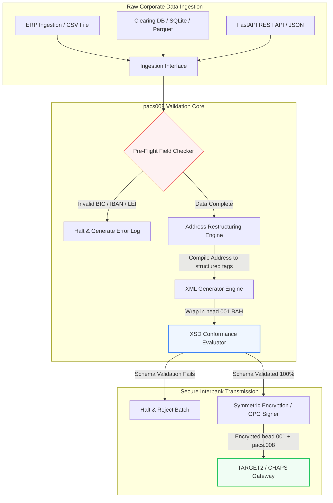

---

# Front Matter (YAML)

author: "contact@sebastienrousseau.com (Sebastien Rousseau)"
banner_alt: "Büromitarbeiter mit Sprachassistent und Laptop — sinnbildlich für die strukturierten, maschinenlesbaren Interbankzahlungs-Nachrichten, die pacs.008-Automatisierung programmierbar macht"
banner_height: "1597"
banner_width: "2584"
banner: "https://cloudcdn.pro/stocks/images/tyler-prahm-lmV3gJSAgbo.webp"
cdn: "https://cloudcdn.pro"
charset: "UTF-8"
cname: "sebastienrousseau.com"
copyright: "© Copyright 2025 - 2026 - Sebastien Rousseau. Alle Rechte vorbehalten."
date: "15. Juni 2026"
description: "pacs008 ist eine Open-Source-Python-Bibliothek, die ISO 20022 pacs.008 FI-to-FI-Kundenüberweisungen automatisiert — strukturierte Adressen, BAH head.001-Umhüllung, BIC/LEI/IBAN-Prüfsummen, OpenTelemetry-UETR-Tracing — gebaut für die SWIFT-Umstellung im November 2026."
format-detection: "telephone=no"
hreflang: "de"
icon: "https://cloudcdn.pro/clients/sebastienrousseau/v1/logos/sebastienrousseau.svg"
id: "https://sebastienrousseau.com/2026-06-15-pacs008-automation-iso-20022-interbank-payments-2026"
image_alt: "Schwarz-Weiß-Porträt von Sebastien Rousseau"
image_height: "162"
image_width: "162"
image: "https://cloudcdn.pro/stocks/images/sebastien-rousseau.png"
keywords: "pacs008, ISO 20022 pacs.008, FI-to-FI-Kundenüberweisung, strukturierte Adresse, SWIFT CBPR+, BAH head.001, TARGET2, CHAPS, Fedwire, DORA, BCBS 239, Basel III, UETR, LEI-Validierung, SEPA VoP"
language: "de-DE"
last_reviewed: "2026-06-15"
layout: "report"
locale: "de_DE"
logo_alt: "Logo von Sebastien Rousseau"
logo_height: "44"
logo_width: "44"
logo: "https://cloudcdn.pro/clients/sebastienrousseau/v1/logos/sebastienrousseau.svg"
menu: ""
measurementID: "G-169G4ET5HQ"
name: "Sebastien Rousseau"
permalink: "https://sebastienrousseau.com/2026-06-15-pacs008-automation-iso-20022-interbank-payments-2026"
rating: "general"
referrer: "no-referrer"
robots: "index, follow"
schema: "FAQPage, Article"
seo_title: "pacs.008-Automatisierung im ISO-20022-Zeitalter"
short_name: "sebastienrousseau"
subtitle: "Die pacs.008-Nachricht ist der Ort, an dem Interbankzahlungs-Daten, strukturierte Adressen, Compliance, Routing und Abwicklung zusammenkommen."
tags: "pacs008, ISO 20022, Interbankzahlungen, Wholesale-Zahlungsverkehr, Python"
theme-color: "0, 83, 191"
title: "pacs.008-Automatisierung für das ISO-20022-Interbankzeitalter 2026"
url: "https://sebastienrousseau.com/2026-06-15-pacs008-automation-iso-20022-interbank-payments-2026"
viewport: "width=device-width, initial-scale=1, shrink-to-fit=no"

# RSS - The RSS feed front matter (YAML).
atom_link: "https://sebastienrousseau.com/2026-06-15-pacs008-automation-iso-20022-interbank-payments-2026/rss.xml"
category: "Finance"
docs: https://validator.w3.org/feed/docs/rss2.html
generator: "Static Site Generator (SSG) (version 0.0.26)"
item_description: "pacs008 liefert eine Open-Source-Python-Basis für die Automatisierung von ISO 20022 FI-to-FI-Kundenüberweisungen im Zeitalter der Interbankzahlungen."
item_guid: "https://sebastienrousseau.com/2026-06-15-pacs008-automation-iso-20022-interbank-payments-2026/rss.xml"
item_link: "https://sebastienrousseau.com/2026-06-15-pacs008-automation-iso-20022-interbank-payments-2026/rss.xml"
item_pub_date: "Mon, 15 Jun 2026 06:06:06 +0000"
item_title: "pacs.008-Automatisierung für das ISO-20022-Interbankzeitalter 2026"
last_build_date: "Mon, 15 Jun 2026 06:06:06 +0000"
managing_editor: "contact@sebastienrousseau.com (Sebastien Rousseau)"
pub_date: "Mon, 15 Jun 2026 06:06:06 +0000"
ttl: "60"
type: "article"
webmaster: "contact@sebastienrousseau.com"

# Apple - The Apple front matter (YAML).
apple_mobile_web_app_orientations: "portrait"
apple_touch_icon_sizes: "192x192"
apple-mobile-web-app-capable: "yes"
apple-mobile-web-app-status-bar-inset: "black"
apple-mobile-web-app-status-bar-style: "black-translucent"
apple-mobile-web-app-title: "pacs.008-Automatisierung"
apple-touch-fullscreen: "yes"

# MS Application - The MS Application front matter (YAML).

msapplication-navbutton-color: "0, 83, 191"

# Twitter Card - The Twitter Card front matter (YAML).

twitter_card: "summary_large_image"
twitter_creator: "@wwdseb"
twitter_description: "pacs008 liefert eine Open-Source-Python-Basis für die Automatisierung von ISO 20022 FI-to-FI-Kundenüberweisungen im Zeitalter der Interbankzahlungen."
twitter_image: "https://cloudcdn.pro/clients/sebastienrousseau/v1/logos/sebastienrousseau.svg"
twitter_image_alt: "Logo von Sebastien Rousseau"
twitter_site: "@wwdseb"
twitter_title: "pacs.008-Automatisierung im ISO-20022-Zeitalter"
twitter_url: "https://sebastienrousseau.com/2026-06-15-pacs008-automation-iso-20022-interbank-payments-2026"

excerpt: "pacs008 ist ein Open-Source-Python-Toolkit, das ISO 20022 FI-to-FI-Kundenüberweisungen programmierbar macht — strukturierte Adressen, Validierung, Routing, Compliance-Hooks und die SWIFT-Frist im November 2026 sind als Standard verankert."

# Humans.txt - The Humans.txt front matter (YAML).
author_website: "https://sebastienrousseau.com"
author_twitter: "@wwdseb"
author_location: "London, UK"
thanks: "Danke fürs Lesen!"
site_last_updated: "2026-06-15"
site_standards: "HTML5, CSS3, RSS, Atom, JSON, XML, YAML, Markdown, TOML"
site_components: "Kaishi, Kaishi Builder, Kaishi CLI, Kaishi Templates, Kaishi Themes"
site_software: "Static Site Generator, Rust"

---

# Automatisierung von ISO 20022 pacs.008 Interbankzahlungen mit Open-Source-Python im Jahr 2026

<!-- lead-start -->
<aside class="post-lead" aria-label="Artikelzusammenfassung">

<strong>Kurzfassung.</strong> Gemäß SWIFT-CBPR+-Vorgaben werden mit der Strukturierten-Adressen-Klippe am 14. November 2026 unstrukturierte Postadressen in TARGET2, CHAPS, Fedwire, Lynx und SEPA außer Dienst gestellt. pacs008 ist eine Open-Source-Python-Bibliothek, die die Erzeugung und Validierung von ISO 20022 FI-to-FI-Kundenüberweisungs-Nachrichten (pacs.008) automatisiert, Zahlungen in Business Application Headern (BAH head.001) umhüllt und die Konformität strukturierter Adressen in den Datenpfad einbettet, bevor die Nachricht ein Clearing-Netz berührt.

<strong>Kernaussagen</strong>

<ul class="post-lead-takeaways">
  <li><strong>Die Frist für strukturierte Adressen ist absolut.</strong> Nach dem 14. November 2026 sind unstrukturierte Adressblöcke außer Dienst. pacs008 erzwingt strukturierte Postadressen-Elemente (<code>&lt;TwnNm&gt;</code>, <code>&lt;Ctry&gt;</code>, <code>&lt;PstCd&gt;</code>) bei der Datenkompilierung, um Grenzabweisungen zu verhindern.</li>
  <li><strong>Einheitliche Nachrichtenorchestrierung.</strong> Umhüllt die zentrale pacs.008-Zahlungs-Payload in einem konformen Business Application Header (head.001) und liefert ein Standard-Verarbeitungsmodell für den Hin- und Rücktransport.</li>
  <li><strong>Algorithmische Integrität.</strong> Eingebaute Validierer für BICs und Legal Entity Identifier (LEIs) auf Basis von ISO 7064 Modulo 97-10-Prüfsummen.</li>
  <li><strong>DORA-konforme Nachvollziehbarkeit.</strong> Vollständige OpenTelemetry-Instrumentierung, verschlüsselt auf die Unique End-to-End Transaction Reference (UETR), für Echtzeit-Audit-Protokolle und kryptografische Audit-Signaturen.</li>
  <li><strong>Erhalt der Vorstandsverantwortung.</strong> Bringt die Genauigkeit von Interbank-Nachrichten in Einklang mit DORA Artikel 5, BCBS 239-Berichtspflichten und Kapitaleinsparungen beim operationellen Risiko nach Basel III.</li>
</ul>

<strong>Weiterführende Beiträge:</strong> <a href="https://sebastienrousseau.com/2026-05-19-global-wholesale-payments-economics-2026">Globaler Wholesale-Zahlungsverkehr 2026: ISO 20022, RTGS-Erneuerung und die Ökonomie der Interoperabilität</a>, <a href="https://sebastienrousseau.com/2026-05-27-ai-operating-system-payments-fraud-routing-resilience-compliance-2026">KI als Betriebssystem des Zahlungsverkehrs: Betrug, Routing, Resilienz und Compliance 2026</a>, <a href="https://sebastienrousseau.com/2026-05-12-iso-20022-pacs008-structured-address-deadline">Die pacs.008-Frist für strukturierte Adressen im November 2026: Eine Sechs-Monats-Perspektive</a>.

</aside>
<!-- lead-end -->

Brückenschlag zwischen Legacy-Finanzdaten und strukturierten Interbank-Nachrichten über eine auditierbare, schemavalidierte Python-Pipeline.

Der Open-Source-Referenzpunkt für diesen Beitrag ist [pacs008 ⧉](https://github.com/sebastienrousseau/pacs008 "pacs008 — Open-Source-Python-Bibliothek"). Das Repository ist als Python-Bibliothek zur Automatisierung von ISO 20022 pacs.008 FI-to-FI-Kundenüberweisungs-XML-Nachrichten positioniert.

## Warum dieses Open-Source-Projekt 2026 zählt

Die globale Clearing-Infrastruktur für Interbankzahlungen erlebt ihre tiefgreifendste Modernisierung seit fast einem halben Jahrhundert.

Im Juni 2026 nähert sich der Finanzdienstleistungssektor rasch der **SWIFT-Strukturierten-Adressen-Klippe am 14. November 2026**. Ab diesem Datum stellen SWIFT-CBPR+-Vorgaben sowie TARGET2, CHAPS, Fedwire und das kanadische Lynx unstrukturierte Postadresszeilen (nur `<AdrLine>` innerhalb von `<PstlAdr>`-Blöcken) offiziell außer Dienst. Alle teilnehmenden Finanzinstitute müssen Adressen entweder im Hybridformat (strukturierte `<TwnNm>` und `<Ctry>`, mit maximal zwei `<AdrLine>`-Elementen für verbleibende Details) oder vollständig strukturiert (eigene Elemente für Straßenname, Hausnummer und Postleitzahl) übermitteln. Nachrichten, die dieses Kriterium nicht erfüllen, werden an der Netzgrenze abgewiesen.

Für Finanzinstitute entstehen aus diesem Übergang erhebliche operative Zwänge:

1. **Die Strafe für Grenzabweisungen.** Zahlungen, die das Kriterium der strukturierten Adresse nicht erfüllen, werden sofort vom Netz abgewiesen, was Transaktionsverzögerungen, Liquiditätsblockaden und operative Rückstaus auslöst.
2. **SEPA Verification of Payee (VoP).** Verpflichtet alle Zahlungsdienstleister (PSPs) innerhalb der SEPA-Zone, vor Ausführung einer Überweisung den Abgleich zwischen Begünstigtennamen und IBAN zu prüfen — eine weitere Validierungsstufe bei der Nachrichtenerstellung.

[pacs008](https://github.com/sebastienrousseau/pacs008) löst dieses Problem. Es ist eine schlanke, quelloffene Python-Bibliothek, die die Umwandlung von Roh-Finanzdaten in vollständig validierte, schemakonforme ISO 20022 pacs.008 Interbank-Kundenüberweisungs-Nachrichten automatisiert. Indem sie die Lücke zwischen Legacy- und strukturierten Daten schließt, liefert pacs008 einen hohen Return on Resilience (RoR), sichert das Working Capital und gewährleistet die Echtzeit-Ausführung über globale Rails.

## Die Architekturperspektive von pacs008 für 2026

Die pacs008-Bibliothek ist als gekapselte Validierungs- und Erzeugungs-Engine aufgebaut und stellt sicher, dass rohe Eingaben systematisch geparst, angereichert und in Standard-Hüllen verpackt werden:

| Schicht | Designentscheidung | Warum es zählt | Risiko bei Fehlsteuerung |
|---|---|---|---|
| **Eingabeschicht** | Aufnahme von CSV, JSON, SQLite und Parquet | Holt Banken-Integrationsteams dort ab, wo ihre Daten bereits liegen, und vermeidet Plattformmigrationen. | Aufnahme roher, unvalidierter oder beschädigter Daten-Payloads. |
| **Validierungsschicht** | Vorabprüfung gegen offizielle XSD-Schemata und individuelle Geschäftsregeln | Stoppt die Ausführung und markiert Fehler, bevor die Zahlungsdatei an das Clearing-Netz übermittelt wird. | Ungültige XML-Dateien, die sofortige Netzabweisungen und Clearing-Verzögerungen auslösen. |
| **BAH-Hüllen-Schicht** | Automatische Umhüllung mit Business Application Header (head.001) | Standardisiert Nachrichtenversand und Routing auf Basis des `<MsgDefIdr>`-Tags. | Übertragung roher pacs.008-Payloads ohne erforderliche äußere Hülle, was zur Systemabweisung führt. |
| **Serialisierungsschicht** | Standard-XML und ISO-konforme JSON-Unterstützung (TS 23029) | Ermöglicht direkte Übersetzung zwischen XML- und JSON-Payloads, unterstützt moderne REST-APIs und Kafka-Streaming. | Fragmentierte Datenrepräsentationen, die offizielle ISO-Vorgaben verletzen. |
| **Beobachtbarkeitsschicht** | OpenTelemetry-Tracing verschlüsselt auf die UETR | Erfasst detaillierte Ausführungspfade und Protokolle und liefert Echtzeit-Auditierbarkeit. | Tracing-Lücken, die operative Sichtbarkeit und Auditierung blockieren. |

## Wichtige Interbank-Signale und regulatorische Meilensteine

Um die operative Resilienz im Transaktionsgeschäft nachzuweisen, müssen Senior-Technologie- und Risikoverantwortliche spezifische, quantifizierbare Compliance-Indikatoren verfolgen:

| Signal | Kennzahl / operativer Maßstab | G20- / SWIFT- / DORA-Referenz | Technische Plattform-Umsetzung |
|---|---|---|---|
| **Konformität strukturierter Adressen** | Anteil der pacs.008-Nachrichten mit vollständig strukturierten `<PstlAdr>`-Feldern mit ausgewiesenen `<TwnNm>` und `<Ctry>`. | SWIFT-SR-2026-Frist | Vorab-Schemaprüfungen in pacs008, die unstrukturierte Adresszeilen abweisen. |
| **SEPA Verification of Payee** | Validierung des Abgleichs zwischen Begünstigtenname und IBAN vor Nachrichtenausführung. | SEPA-VoP-Verordnung | Eingebaute VoP-Hilfsklassen, die Vorab-Validierungsabfragen auf IBAN/BIC ausführen. |
| **BAH head.001-Integration** | Prozentsatz der ausgehenden Zahlungs-Payloads, die erfolgreich in Business Application Header eingehüllt sind. | TARGET2- / CBPR+-Vorgaben | BAH-Hüll-Subsystem, das die äußere XML-Hülle automatisch erstellt. |
| **LEI-Modulo-Prüfsumme** | ISO 7064 Modulo 97-10-Prüfziffernvalidierung der Schuldner- und Gläubiger-`<LEI>`-Blöcke. | Bank-of-England-Vorgabe | Algorithmischer Prüfer, der die Integrität des 20-stelligen Identifikators verifiziert. |
| **UETR-Tracking-Genauigkeit** | 100 % der erzeugten Zahlungen mit einer gültigen Unique End-to-End Transaction Reference versehen. | SWIFT-UETR-Spezifikationen | Automatisierte Erzeugung und Nachverfolgung des 36-stelligen UUIDv4-Referenzcodes. |

## Warum Python die ideale Einstiegsplattform für Interbank-Automatisierung ist

Moderne Payment Hubs und Treasury-Teams setzen 2026 stark auf Python für Datenumwandlung, Finanzmodellierung und ERP-Datenbankintegration.

Durch den Einsatz einer Open-Source-Python-Bibliothek erzielen Institute deutliche Vorteile:

1. **Geringe kognitive Last und hohe Interoperabilität.** Python wirkt als bindende Brücke. Entwickler können einfache Skripte schreiben, die rohe Zahlungsanweisungen aus Legacy-Datenbanken ziehen, sie gegen komplexe internationale Bankenregeln validieren und konformes XML in einem einzigen, durchgängigen Arbeitsablauf ausgeben.
2. **Beseitigung undurchsichtiger „Black-Box"-Übersetzer.** Proprietäre Bankenportale verlangen oft hohe Lizenzgebühren für individuelle Zahlungsdatei-Übersetzer. Diese Übersetzer sind proprietäre Black Boxes, was es Sicherheitsteams unmöglich macht, die Datenverarbeitung oder die Schlüsselablage zu prüfen. Eine quelloffene, einsehbare Bibliothek wie pacs008 stellt vollständige Code-Transparenz sicher.
3. **Nahtlose CI/CD-Integration.** pacs008 lässt sich direkt in Continuous-Integration- und Deployment-Pipelines einbinden und ermöglicht es Entwicklern, Zahlungsdatei-Tests als Teil ihres regulären Software-Auslieferungszyklus zu automatisieren.

## Eine eingegrenzte Interbank-Pipeline entwerfen

Eine zentrale Schwachstelle im Interbank-Clearing ist die „unkontrollierte Batch-Erzeugung" — das Generieren von Dateien ohne klar abgegrenzte Verifikationsschleife. pacs008 ist so konzipiert, dass es als zentrale Validierungs-Engine innerhalb einer streng gesteuerten, mehrstufigen Transaktionspipeline arbeitet.

Der nachstehende operative Ablauf zeigt, wie rohe Transaktionsdaten die pacs008-Pipeline durchlaufen, um eine kryptografisch gesicherte, schemakonforme pacs.008-Datei zu erzeugen, die in einer BAH-Hülle eingebettet ist:

## Das Vorstands-Playbook und die treuhänderische Haftung

Die Automatisierung von Interbankzahlungen ist eine Frage von Risikomanagement und Corporate Governance auf Vorstandsebene. Senior Manager müssen die Qualität der Transaktionsdaten unter dem Blickwinkel treuhänderischer Verantwortung und Reduktion des operationellen Risikos behandeln:

- **DORA Artikel 5 (Vorstandsverantwortung).** Begründet eine direkte, persönliche Haftung der Vorstandsmitglieder für Resilienz und Sicherheit der IKT-Operationen des Instituts. Da Interbank-Clearing eine kritische Unternehmensfunktion ist, müssen Vorstände nachweisen, dass sie robuste, validierte und automatisierte Transaktionskontrollen eingeführt haben, um Betriebsstörungen oder Zahlungsverzögerungen zu verhindern.
- **BCBS 239 (Risikodaten-Aggregation und Berichterstattung).** Fordert, dass die Berichterstattung über Finanztransaktionen genau, vollständig und in Echtzeit erfolgt. pacs008 unterstützt Institute dabei, BCBS 239-Konformität zu erreichen, indem es sicherstellt, dass Zahlungsdaten bereits an der Quelle sauber strukturiert und validiert sind — und damit die Datenlücken und manuellen Abstimmungsfehler beseitigt werden, die Legacy-Tabellenkalkulationen plagen.
- **Minderung der Eigenmittelanforderung für operationelles Risiko (Basel III).** Unter den Basel-III-Vorgaben erhöhen hohe Fehlerquoten im Zahlungsverkehr und der Aufwand für manuelle Eingriffe die Kapitalanforderungen für das operationelle Risiko der Bank — Kapital, das ansonsten für Kreditvergabe oder Investitionen eingesetzt werden könnte. Die Automatisierung der Zahlungspipeline senkt diese Kapitalaufschläge direkt und erhält den Bilanzwert.

## Was das je Bankentyp bedeutet

### Global Systemrelevante Banken (G-SIBs)

G-SIBs verwalten massive, grenzüberschreitende Transaktionsvolumina von Firmenkunden. Ihre Hauptaufgabe ist die Bereinigung unstrukturierter Legacy-Daten, bevor sie das Clearing-Netz erreichen. Durch die Integration von pacs008 in ihre Firmenkunden-Gateways können G-SIBs ihren Firmenkunden automatisierte Validierungs-Utilities bereitstellen, den Aufwand manueller Zahlungsreparaturen verringern und die Echtzeit-Ausführung über das SWIFT-Netz absichern.

### Transaction- und Firmenkundenbanken

Für Transaction Banks ist die Qualität der Zahlungsdaten ein Wettbewerbsmerkmal. Indem sie ein quelloffenes, einsehbares Validierungswerkzeug wie pacs008 ihren Treasury-Kunden anbieten, können diese Banken das Onboarding beschleunigen, die Ablehnung von Zahlungsdateien minimieren und durch überlegene Straight-Through-Processing-Quoten Vertrauen aufbauen.

### Regionalbanken und kleinere Institute

Regionalbanken müssen internationale Zahlungsverkehrsstandards einhalten, ohne über die massiven Technologiebudgets der G-SIBs zu verfügen. pacs008 bietet eine schlanke, kostengünstige und vollständig konforme Python-basierte Lösung, mit der kleinere Institute moderne, strukturierte Zahlungsinitiierung anbieten können — ohne teure proprietäre Middleware-Lizenzen.

## Fazit: Die Clearing-Roadmap für den Interbankzahlungsverkehr

Die anstehende SWIFT-Frist für strukturierte Adressen im November 2026 ist eine harte Grenze für die Treasury-Operationen von Firmenkunden. Sich auf Legacy-Tabellenkalkulationen, manuelle Dateneingabe und unstrukturierte Zahlungsdateien zu verlassen, ist ein aktives Geschäftsrisiko.

Um Transaktionskontinuität zu sichern und operativen Aufwand zu minimieren, sollten Senior-Technologie- und Finanzverantwortliche heute eine klare Clearing-Roadmap umsetzen:

1. **Validierung an der Quelle erzwingen.** Verpflichten Sie alle Zahlungsanweisungen dazu, gemäß den offiziellen ISO 20022-XSD-Schemata validiert und formatiert zu werden, bevor sie die ERP-Grenzen des Unternehmens verlassen.
2. **Die Datenpipeline auditieren.** Steigen Sie aus manueller Tabellenkalkulationsverarbeitung aus und setzen Sie automatisierte, einsehbare Python-basierte Workflows mit pacs008 um.
3. **Hybride Sicherheit umsetzen.** Stellen Sie sicher, dass erzeugte Zahlungsdateien vor der Übertragung kryptografisch signiert und verschlüsselt werden, damit Zero-Trust-Netzwerk-Anforderungen erfüllt sind.
4. **An treuhänderischen Prioritäten ausrichten.** Berichten Sie Zahlungsautomatisierung und Kennzahlen zur Datenqualität formal an den Vorstand und positionieren Sie die Investition als kritisches Programm zur Reduktion des operationellen Risikos unter DORA.

## Häufig gestellte Fragen

**Ist pacs008 konform mit den kommenden SWIFT-SR-2026-Adressregeln?**

Ja. pacs008 unterstützt den strikten SWIFT-Meilenstein für strukturierte Adressen im November 2026 und erzwingt die obligatorische Trennung von Postadress-Elementen (Ort, Land, Postleitzahl) in eigene ISO 20022-XML-Felder.

**Kann pacs008 Zahlungs-Payloads in Business Application Header einhüllen?**

Ja. Da pacs008 die Umhüllung mit Business Application Header (BAH head.001) nativ unterstützt, erstellt es die für TARGET2-, CHAPS- und CBPR+-Netze erforderliche äußere Hülle automatisch.

**Warum ist eine quelloffene Bibliothek proprietären Datei-Übersetzern vorzuziehen?**

Proprietäre Übersetzer sind undurchsichtige Black Boxes, die Sicherheitsaudits unmöglich machen. Eine quelloffene, peer-reviewte Bibliothek wie pacs008 bietet vollständige Code-Transparenz und erlaubt Sicherheitsteams zu verifizieren, dass während der Verarbeitung keine sensiblen Zahlungsdaten offengelegt werden.

**Welche Identifikatoren validiert pacs008?**

pacs008 liefert eingebaute Validierer für Bank Identifier Codes (BICs) und Legal Entity Identifier (LEIs) auf Basis von ISO 7064 Modulo 97-10-Prüfsummen sowie IBAN-Prüfziffernvalidierung und UETR-Eindeutigkeitsprüfungen.

## Quellen

- SWIFT, (2024). *ISO 20022 Meilenstein November 2026 für strukturierte Adressen*. La Hulpe: SWIFT. Verfügbar unter: [SWIFT-ISO-20022-Meilenstein ⧉](https://www.swift.com/standards/iso-20022/iso-20022-bytes/call-action-november-2026 "SWIFT-ISO-20022-Meilenstein").
- Basler Ausschuss für Bankenaufsicht (BCBS), (2013). *Grundsätze für wirksame Risikodaten-Aggregation und Risikoberichterstattung (BCBS 239)*. Basel: Bank für Internationalen Zahlungsausgleich. Verfügbar unter: [BCBS-239-Grundsätze ⧉](https://www.bis.org/publ/bcbs239.htm "BCBS 239-Grundsätze").
- Europäisches Parlament und Rat der Europäischen Union, (2022). *Verordnung (EU) 2022/2554 über die digitale operationale Resilienz im Finanzsektor (DORA)*. Brüssel: Amtsblatt der Europäischen Union. Verfügbar unter: [DORA-Verordnung ⧉](https://eur-lex.europa.eu/legal-content/EN/TXT/?uri=CELEX%3A32022R2554 "DORA-Verordnung").
- GitHub, (2026). *pacs008 quelloffenes Repository*. Verfügbar unter: [pacs008-Repository ⧉](https://github.com/sebastienrousseau/pacs008 "pacs008-Repository").

<!-- enrich-start -->
<aside class="author-card" aria-label="Über den Autor"><strong class="author-card-name"><a href="/about/index.html">Sebastien Rousseau</a></strong>Senior-Banking-Technologe mit Schwerpunkt angewandte KI, ISO-20022-Migration, Post-Quanten-Kryptografie für Finanzdienstleistungen und die strukturelle Transformation des Wholesale-Zahlungsverkehrs.Mehr als 20 Jahre Erfahrung bei HSBC Commercial &amp; Investment Bank, PayPal, Barclays, Shazam, AKQA, Virgin Group. <a href="/about/index.html">Vollständiges Profil</a> &middot; <a href="https://www.linkedin.com/in/sebastienrousseau/" rel="external noopener">LinkedIn</a> &middot; <a href="https://github.com/sebastienrousseau" rel="external noopener">GitHub</a></aside>

Zuletzt geprüft <time datetime="2026-06-15">2026-06-15</time>.

<aside class="related-posts" aria-labelledby="related-heading">
<h2 id="related-heading" class="related-heading">Weiterführende Beiträge</h2>

<article class="related-card"><footer class="related-body"><h3><a href="https://sebastienrousseau.com/2026-05-19-global-wholesale-payments-economics-2026">Globaler Wholesale-Zahlungsverkehr 2026: ISO 20022, RTGS-Erneuerung und die Ökonomie der Interoperabilität</a></h3>
<time datetime="2026-05-19">2026-05-19</time>
</footer></article>
<article class="related-card"><footer class="related-body"><h3><a href="https://sebastienrousseau.com/2026-05-27-ai-operating-system-payments-fraud-routing-resilience-compliance-2026">KI als Betriebssystem des Zahlungsverkehrs: Betrug, Routing, Resilienz und Compliance 2026</a></h3>
<time datetime="2026-05-27">2026-05-27</time>
</footer></article>
<article class="related-card"><footer class="related-body"><h3><a href="https://sebastienrousseau.com/2026-05-12-iso-20022-pacs008-structured-address-deadline">Die pacs.008-Frist für strukturierte Adressen im November 2026: Eine Sechs-Monats-Perspektive</a></h3>
<time datetime="2026-05-12">2026-05-12</time>
</footer></article>

</aside>
<!-- enrich-end -->
