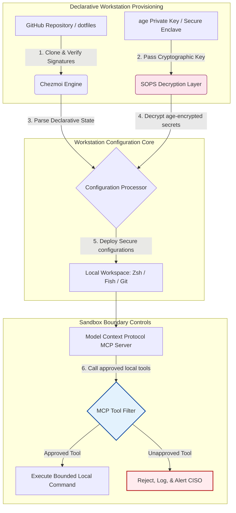

---

# Front Matter (YAML)

author: "contact@sebastienrousseau.com (Sebastien Rousseau)"
banner_alt: "Entwickler-Workstation in gedämpftem Licht — Sinnbild für KI-bewusste, reproduzierbare, sichere dotfiles mit MCP-Servern, SLSA-Signierung, age/SOPS-Secrets und Multi-Shell-Parität"
banner_height: "1597"
banner_width: "2584"
banner: "https://cloudcdn.pro/stocks/images/almas-salakhov-Vq2ap8aFFEs.webp"
cdn: "https://cloudcdn.pro"
charset: "UTF-8"
cname: "sebastienrousseau.com"
copyright: "© Copyright 2025 - 2026 - Sebastien Rousseau. Alle Rechte vorbehalten."
date: "16. Juni 2026"
description: "KI-bewusste dotfiles sind das Muster für sichere, reproduzierbare Workstations in der MCP-Ära — deklarative Konfiguration über Chezmoi, SOPS/age-Secrets, SLSA-Level-3-Provenienz, Multi-Shell-Parität und abgegrenzte Sandbox-Grenzen für lokale KI-Agenten."
format-detection: "telephone=no"
hreflang: "de"
icon: "https://cloudcdn.pro/clients/sebastienrousseau/v1/logos/sebastienrousseau.svg"
id: "https://sebastienrousseau.com/2026-06-16-ai-aware-dotfiles-secure-reproducible-workstation-2026"
image_alt: "Schwarz-Weiß-Porträt von Sebastien Rousseau"
image_height: "162"
image_width: "162"
image: "https://cloudcdn.pro/stocks/images/sebastien-rousseau.png"
keywords: "dotfiles, Chezmoi, MCP, Model Context Protocol, SLSA, SOPS, age-Verschlüsselung, deklarative Konfiguration, Entwickler-Workstation, DORA Artikel 5, NIST CSF 2.0, Lieferkettensicherheit, agentische KI, Multi-Shell-Parität, Zsh, Fish, Nushell"
language: "de-DE"
last_reviewed: "2026-06-16"
layout: "report"
locale: "de_DE"
logo_alt: "Logo von Sebastien Rousseau"
logo_height: "44"
logo_width: "44"
logo: "https://cloudcdn.pro/clients/sebastienrousseau/v1/logos/sebastienrousseau.svg"
menu: ""
measurementID: "G-169G4ET5HQ"
name: "Sebastien Rousseau"
permalink: "https://sebastienrousseau.com/2026-06-16-ai-aware-dotfiles-secure-reproducible-workstation-2026"
rating: "general"
referrer: "no-referrer"
robots: "index, follow"
schema: "FAQPage, Article"
seo_title: "KI-bewusste dotfiles für eine sichere Entwickler-Workstation"
short_name: "sebastienrousseau"
subtitle: "Die Entwickler-Workstation ist heute Teil der KI-Lieferkette; dotfiles brauchen Sicherheit, Reproduzierbarkeit, Secret-Hygiene und MCP-bewusste Workflows."
tags: "dotfiles, Entwicklerwerkzeuge, MCP, SLSA, sichere Workstation, chezmoi, macOS, Linux, WSL"
theme-color: "0, 83, 191"
title: "KI-bewusste dotfiles 2026: Eine sichere, reproduzierbare Entwickler-Workstation für MCP, SLSA und Multi-Shell-Parität bauen"
url: "https://sebastienrousseau.com/2026-06-16-ai-aware-dotfiles-secure-reproducible-workstation-2026"
viewport: "width=device-width, initial-scale=1, shrink-to-fit=no"

# RSS - The RSS feed front matter (YAML).
atom_link: "https://sebastienrousseau.com/2026-06-16-ai-aware-dotfiles-secure-reproducible-workstation-2026/rss.xml"
category: "Technology"
docs: https://validator.w3.org/feed/docs/rss2.html
generator: "Static Site Generator (SSG) (version 0.0.26)"
item_description: "Ein Blick auf deklarative dotfiles für sichere, reproduzierbare Entwickler-Workstations unter macOS, Linux und WSL — mit MCP-Bewusstsein, SLSA, age, SOPS und Multi-Shell-Parität."
item_guid: "https://sebastienrousseau.com/2026-06-16-ai-aware-dotfiles-secure-reproducible-workstation-2026/rss.xml"
item_link: "https://sebastienrousseau.com/2026-06-16-ai-aware-dotfiles-secure-reproducible-workstation-2026/rss.xml"
item_pub_date: "Tue, 16 Jun 2026 06:06:06 +0000"
item_title: "KI-bewusste dotfiles 2026: Eine sichere, reproduzierbare Entwickler-Workstation für MCP, SLSA und Multi-Shell-Parität bauen"
last_build_date: "Tue, 16 Jun 2026 06:06:06 +0000"
managing_editor: "contact@sebastienrousseau.com (Sebastien Rousseau)"
pub_date: "Tue, 16 Jun 2026 06:06:06 +0000"
ttl: "60"
type: "article"
webmaster: "contact@sebastienrousseau.com"

# Apple - The Apple front matter (YAML).
apple_mobile_web_app_orientations: "portrait"
apple_touch_icon_sizes: "192x192"
apple-mobile-web-app-capable: "yes"
apple-mobile-web-app-status-bar-inset: "black"
apple-mobile-web-app-status-bar-style: "black-translucent"
apple-mobile-web-app-title: "KI-bewusste dotfiles für eine sichere Entwickler-Workstation"
apple-touch-fullscreen: "yes"

# MS Application - The MS Application front matter (YAML).

msapplication-navbutton-color: "0, 83, 191"

# Twitter Card - The Twitter Card front matter (YAML).

twitter_card: "summary_large_image"
twitter_creator: "@wwdseb"
twitter_description: "Ein Blick auf deklarative dotfiles für sichere, reproduzierbare Entwickler-Workstations unter macOS, Linux und WSL — mit MCP-Bewusstsein, SLSA, age, SOPS und Multi-Shell-Parität."
twitter_image: "https://cloudcdn.pro/clients/sebastienrousseau/v1/logos/sebastienrousseau.svg"
twitter_image_alt: "Logo von Sebastien Rousseau"
twitter_site: "@wwdseb"
twitter_title: "KI-bewusste dotfiles für eine sichere Entwickler-Workstation"
twitter_url: "https://sebastienrousseau.com/2026-06-16-ai-aware-dotfiles-secure-reproducible-workstation-2026"

excerpt: "KI-bewusste dotfiles behandeln die Entwickler-Workstation 2026 als Lieferketten-Infrastruktur — deklarative, chezmoi-verwaltete Konfiguration mit MCP-Bewusstsein, SLSA-signierten Releases, age/SOPS-Secrets, Sub-Sekunden-Start und Parität über macOS/Linux/WSL."

# Humans.txt - The Humans.txt front matter (YAML).
author_website: "https://sebastienrousseau.com"
author_twitter: "@wwdseb"
author_location: "London, UK"
thanks: "Danke fürs Lesen!"
site_last_updated: "2026-06-16"
site_standards: "HTML5, CSS3, RSS, Atom, JSON, XML, YAML, Markdown, TOML"
site_components: "Kaishi, Kaishi Builder, Kaishi CLI, Kaishi Templates, Kaishi Themes"
site_software: "Static Site Generator, Rust"

---

# KI-bewusste dotfiles 2026: Eine sichere, reproduzierbare Entwickler-Workstation für MCP, SLSA und Multi-Shell-Parität bauen

<!-- lead-start -->
<aside class="post-lead" aria-label="Artikelzusammenfassung">

<strong>Kurzfassung.</strong> Die Entwickler-Workstation ist kein Endpunkt mehr; sie ist ein aktiver Teilnehmer in der Software-Lieferkette und eine direkte Schnittstelle zur lokalen KI-Steuerungsebene. Terminal-basierte KI-Assistenten und <a href="https://modelcontextprotocol.io">Model Context Protocol (MCP)</a>-Server führen lokale Shell-Befehle aus, inspizieren Repositories und lesen sensible Konfigurationsdateien direkt. <a href="https://github.com/sebastienrousseau/dotfiles">Sebastien Rousseaus dotfiles</a> sind ein deklaratives Open-Source-Framework, das sichere, reproduzierbare Workstations über macOS, Linux und Windows Subsystem for Linux (WSL) hinweg aufbaut — mit Integration von <a href="https://www.chezmoi.io/">Chezmoi</a>, <a href="https://github.com/getsops/sops">SOPS, age</a> und SLSA-Level-3-Build-Provenienz für speichersichere Secret-Isolation und abgegrenzte Ausführungspfade für lokale KI-Modelle.

<strong>Kernaussagen</strong>

<ul class="post-lead-takeaways">
  <li><strong>Workstations sind Lieferketten-Infrastruktur.</strong> Konfigurationen der Entwicklungsumgebung müssen mit derselben deklarativen Strenge behandelt werden wie produktive Server-Deployments. Manuelle Konfigurations-Drift entfällt.</li>
  <li><strong>Die Herausforderung der KI-Steuerungsebene.</strong> Terminal-basierte KI-Modelle und MCP-Werkzeuge können auf lokale Verzeichnisse zugreifen. dotfiles müssen abgegrenzte Sandbox-Grenzen, strikte Werkzeug-Berechtigungslisten und unveränderbare lokale Logs durchsetzen, um Datenabflüsse zu verhindern.</li>
  <li><strong>Absolute plattformübergreifende Parität.</strong> Identische Sub-Sekunden-Shell-Performance und Sicherheitsprofile über macOS, Linux (Zsh, Fish, Nushell) und WSL — Entwickler-Onboarding sinkt von Wochen auf Minuten.</li>
  <li><strong>Kryptografisch sichere Secret-Isolation.</strong> Dateiverschlüsselung mit SOPS und age verhindert, dass fest codierte Credentials (GitHub-Tokens, Cloud-Zugangsschlüssel) ins Git eingecheckt oder von lokalen LLMs gelesen werden.</li>
  <li><strong>Treuhänderischer Wert auf Vorstandsebene.</strong> Übersetzt die Konformität der Workstation-Konfiguration in klare Vorstandsprioritäten — gestützt auf DORA Artikel 5, NIST-CSF-2.0-Endpunktstandards und die Reduktion des operationellen Risikos unter Basel III.</li>
</ul>

<strong>Weiterführende Lektüre:</strong> <a href="https://sebastienrousseau.com/2026-05-23-agentic-payments-banking-consent-liability-new-payment-ux-2026">Agentische Zahlungen im Banking: Einwilligung, Haftung und die neue Bezahl-UX 2026</a>, <a href="https://sebastienrousseau.com/2024-03-12-revolutionising-real-time-speech-recognition-on-macos-with-openai-whisper/index.html">Schnelle Echtzeit-Spracherkennung auf macOS: OpenAI Whisper</a>, <a href="https://sebastienrousseau.com/2024-02-26-google-gemma-ai-transforming-open-source-ai-development/index.html">Google Gemma AI: Open-Source-KI-Entwicklung im Wandel</a>.

</aside>
<!-- lead-end -->

Die Brücke zwischen deklarativer Workstation-Konfiguration und sicheren Software-Lieferketten in einer Zeit lokaler KI-Modelle und agentischer Entwicklerwerkzeuge.

Der Open-Source-Referenzpunkt dieses Artikels ist [dotfiles ⧉](https://github.com/sebastienrousseau/dotfiles "dotfiles — deklarative Workstation-Konfiguration"). Das Repository positioniert sich als: deklarative dotfiles für macOS, Linux und WSL — mit Multi-Shell-Parität, Sub-Sekunden-Start, SLSA-signierten Releases und KI/MCP-bewusster Konfiguration.

## Warum dieses Open-Source-Projekt 2026 zählt

Im Juni 2026 ist die Entwickler-Workstation das schwächste Glied in der Software-Lieferkette und ein hochwertiges Ziel für anspruchsvolle staatlich gesponserte und kriminelle Cyber-Syndikate.

Die Sicherheitslage der Entwicklungsumgebung hat sich mit dem Aufstieg terminal-basierter KI-Coding-Assistenten (etwa Claude Code) und der Einführung des Model Context Protocol (MCP) radikal verschoben. Lokale Entwickler-Terminals beherbergen heute aktive, autonome KI-Agenten, die in der Lage sind,:

- lokale Quelldateien zu lesen und zu bearbeiten.
- lokale CLI-Werkzeuge aufzurufen (`git`, `npm`, `aws`, `kubectl`).
- Shell-Umgebungsvariablen, lokale Datenbanken und Konfigurationseinstellungen zu inspizieren.

Fehlen der lokalen Umgebung des Entwicklers strikte Grenzen, können diese autonomen KI-Werkzeuge unbeabsichtigt sensible personenbezogene Daten lesen, Cloud-Credentials an öffentliche LLM-APIs leaken oder bösartige Pakete während automatisierter Builds ausführen.

Unter dem Digital Operational Resilience Act (DORA) und dem NIST Cybersecurity Framework (CSF) 2.0 sind Finanzinstitute gesetzlich verpflichtet, die Provenienz und sicherheitsbezogene Integrität jedes Geräts zu verifizieren, das auf die Software-Lieferkette zugreift. „Snowflake-Notebooks" — manuell konfigurierte, ungeprüfte, driftende Konfigurationen — sind unter globalen Banking-Standards nicht mehr konform.

[Sebastien Rousseaus dotfiles](https://github.com/sebastienrousseau/dotfiles) lösen dieses Problem. Es handelt sich um ein Open-Source-Framework für deklaratives Workstation-Management, das sichere, reproduzierbare Entwickler-Workstations etabliert. Indem es eine standardisierte, prüfbare Konfigurations-Baseline durchsetzt, liefert das Projekt einen hohen Return on Resilience (RoR), senkt die Onboarding-Zeit von Wochen auf Stunden und schützt sensible Finanzlieferketten vor Endpunkt-Schwachstellen.

## Architektur-Perspektive der KI-bewussten Workstation 2026

Das dotfiles-Framework arbeitet als sicherer, deklarativer Umgebungsmanager — alle lokalen Shells, Werkzeuge und Secrets werden systematisch verwaltet, geprüft und isoliert:

| Schicht | Designentscheidung | Warum es zählt | Risiko bei Fehlsteuerung |
|---|---|---|---|
| **Provisionierungsschicht** | Deklaratives Konfigurationsmanagement über Chezmoi | Baut vollständig reproduzierbare Workstations über macOS, Linux und WSL — Drift entfällt. | Snowflake-Konfigurationen mit ungeprüften, verwundbaren lokalen Zuständen. |
| **Shell-Schicht** | Multi-Shell-Parität (Zsh, Fish, Nushell) | Sichert identischen, Sub-Sekunden-Start und konsistentes Alias-Verhalten über verschiedene Umgebungen. | Inkonsistenzen bei Shell-Befehlen, die unerwartete Skript-Ergebnisse erzeugen. |
| **Secrets-Schicht** | Dateiverschlüsselung mit SOPS und age | Verhindert, dass fest codierte Credentials und Rohschlüssel ins Git eingecheckt oder lokalen LLMs preisgegeben werden. | Credentials gelangen in öffentliche Repository-Historien oder werden von lokalen Agenten kompromittiert. |
| **KI/MCP-Schicht** | Model-Context-Protocol-Grenzkontrollen | Beschränkt lokale KI-Agenten auf eine bestimmte Liste freigegebener Werkzeuge und protokolliert alle lokalen Ausführungen. | Unbegrenzte KI-Agenten führen entgleiste oder destruktive Befehle lokal aus. |
| **Lieferketten-Schicht** | SLSA-signierte Releases und Sigstore-Verifikation | Belegt kryptografisch die Authentizität von Bootstrap-Skripten und Konfigurationsdateien. | Kompromittierte Setup-Skripte schleusen bösartige Hintertüren in Entwicklerumgebungen ein. |

## Wichtige Signale für Workstation-Sicherheit und Automatisierung

Um absolute Sicherheit im gesamten Entwicklungs-Estate zu wahren, müssen Chief Information Security Officers (CISO) und Technologie-Verantwortliche spezifische, quantifizierbare operative Indikatoren verfolgen:

| Signal | Metrik / operativer Benchmark | NIST-CSF-/DORA-Referenz | Technische Plattform-Umsetzung |
|---|---|---|---|
| **Workstation-Reproduzierbarkeit** | % der Entwickler-Notebooks, die vollständig über deklarative dotfile-Repositories ohne Konfigurations-Drift verwaltet werden. | NIST CSF 2.0 (PR.DS-01) | Chezmoi-Drift-Erkennungsaudits, die automatisch beim Terminal-Start ausgeführt werden. |
| **Credential-Hygiene** | Null unverschlüsselte Secrets oder Schlüssel im Klartext in lokalen Konfigurationsdateien. | DORA Artikel 6 (IKT-Sicherheit) | Git-Pre-Commit-Hooks und lokale Scans, die unverschlüsselte Dateien ablehnen. |
| **Build-Provenienz** | 100 % der Workstation-Bootstrap-Werkzeuge mit kryptografisch signierten Manifesten verifiziert. | DORA Artikel 30 (Lieferkette) | Sigstore- und SLSA-Level-3-Verifikation in Setup-Pipelines eingebettet. |
| **Entwickler-Onboarding-Zeit** | Verstrichene Zeit von der reinen Hardware-Bereitstellung bis zur voll konfigurierten, konformen Entwicklungsumgebung. | Return on Resilience (RoR) | Automatisierte, deklarative Setup-Skripte, die die Umgebung in unter 15 Minuten zusammenstellen. |
| **Abgegrenzter KI-Agent-Zugriff** | Verifikation, dass lokale KI-Werkzeuge innerhalb definierter Verzeichnisgrenzen mit Read-only-Voreinstellungen arbeiten. | Model Risk Management | MCP-Konfigurationsprofile, die Agenten-Werkzeugkataloge auf freigegebene Operationen beschränken. |

## Warum deklarative Konfiguration der Kern der Workstation-Sicherheit ist

Klassische Ansätze zum Einrichten von Entwickler-Workstations sind stark manuell und erzeugen „Snowflake-Notebooks" — Umgebungen, in denen Konfigurationen über die Zeit driften, wenn Entwickler eigene Werkzeuge installieren, Variablen anpassen und lokale Skripte ändern. Diese Drift erzeugt mehrere kritische Schwachstellen:

1. **Ungetrackte Schatten-Konfigurationen.** Driftende Notebooks führen häufig veraltete, verwundbare Softwarepakete oder lokale Skripte aus, die unternehmensweite Sicherheitswerkzeuge umgehen.
2. **Secret-Abfluss.** Entwickler codieren API-Schlüssel, GitHub-Tokens oder AWS-Credentials häufig direkt in Klartext-Skripte oder Shell-Profile — hochgradig anfällig für Diebstahl.
3. **Ineffizientes Onboarding.** Das manuelle Einrichten einer neuen Entwickler-Workstation kann bis zu zwei Wochen Engineering-Zeit verschlingen und drückt das Tempo des Teams.

Mit dem Übergang zu einer deklarativen, modellgetriebenen Konfiguration via Chezmoi wird die gesamte Entwickler-Umgebung zu einem versionierten, reproduzierbaren System of Record. Jede Änderung, jeder Alias, jede Paketabhängigkeit und jede Sicherheitsvoreinstellung ist in Git dokumentiert, gegen organisatorische Compliance-Richtlinien validiert und kryptografisch verifiziert, bevor sie auf das physische Notebook angewendet wird.

## Eine abgegrenzte KI-Entwicklungsumgebung entwerfen

Damit lokale KI-Agenten und MCP-Werkzeuge keinen unbegrenzten Zugriff auf lokale Assets erhalten, muss die Workstation als abgegrenzte Ausführungsebene arbeiten.

Der folgende Ablauf zeigt, wie das dotfiles-Framework Chezmoi, SOPS und age koordiniert, um sichere dotfiles zu entschlüsseln und auszurollen — unter Wahrung einer isolierten, sandboxed Ausführungsgrenze für lokale KI-Agenten, die MCP-Werkzeuge aufrufen:

## Das Vorstands-Playbook und die treuhänderische Haftung

Workstation-Sicherheit und Lieferketten-Integrität sind kritische Vorstandsthemen. Senior Manager müssen das Risiko der Entwicklungsumgebung durch die Brille treuhänderischer Verantwortung, regulatorischer Konformität und Erhalt des Geschäftswerts betrachten:

- **DORA Artikel 5 (Vorstandsverantwortung).** Sieht vor, dass das Leitungsorgan (der Vorstand) die letztliche Verantwortung für das IKT-Risikomanagement des Instituts trägt. Weil Entwickler-Workstations das Tor zur Software-Lieferkette sind, müssen Vorstandsmitglieder sicherstellen, dass Endpunkte sicher, vollständig prüfbar und unter strikten, reproduzierbaren Konfigurations-Frameworks verwaltet sind — sonst halten Aufsichtsprüfungen nicht stand.
- **NIST-CSF-2.0-Konformität (Endpunkt-Sicherheit).** Verlangt, dass nur autorisierte und validierte Geräte mit standardisierten, sicheren Konfigurationen auf Unternehmensnetzwerke und Repositories zugreifen. Deklarative dotfiles erlauben Security-Teams den mathematischen Nachweis, dass alle Entwicklungsumgebungen mit der Sicherheits-Baseline der Organisation konform sind — das Risiko ungeprüfter „Snowflake"-Setups entfällt.
- **Erhalt des Bilanzwerts.** Ein einziges kompromittiertes Entwickler-Credential oder ein Lieferketten-Vorfall kann ein Institut Millionen an Behebung, Bußgeldern und Reputationsschaden kosten. Der Wechsel zu einer sicheren, deklarativen Entwicklungsumgebung senkt dieses Risiko unmittelbar, schützt den Bilanzwert und das Vertrauen der Kunden.

## Was das je nach Banktyp bedeutet

### Global Systemically Important Banks (G-SIBs)

G-SIBs verwalten Tausende Entwickler-Workstations über mehrere Kontinente und Aufsichtsregime hinweg. Ihre wichtigste Aufgabe ist Konfigurations-Konsistenz und die Verhinderung von Credential-Abfluss in massiven Engineering-Teams. Mit einem deklarativen, quelloffenen dotfiles-Modell auf Basis von Chezmoi können G-SIBs Endpunkt-Sicherheit standardisieren, Compliance-Prüfungen automatisieren und das Entwickler-Onboarding global von Wochen auf Minuten verkürzen.

### Transaktions- und Firmenkundenbanken

Transaktionsbanken betreiben sensible Zahlungs-Gateways und Wholesale-Clearing-Infrastrukturen. Der Nachweis der absoluten Integrität des Codes, der in diese Produktivumgebungen deployt wird, ist eine nicht verhandelbare regulatorische Anforderung. Die Standardisierung der Entwickler-Workstations unter einem sicheren, SLSA-konformen dotfiles-Framework garantiert, dass die Software-Lieferkette vollständig geprüft und vor lokalen Endpunkt-Schwachstellen der Entwickler geschützt ist.

### Regional- und kleinere Banken

Regionalbanken müssen hohe Cybersicherheitsstandards halten, ohne über die massiven Sicherheitsbudgets der G-SIBs zu verfügen. Dieses Open-Source-dotfiles-Framework bietet eine schlanke, kostengünstige und hochgradig sichere Python- und Rust-freundliche Lösung, mit der kleinere Institute Endpunkt-Sicherheit und Lieferkettenschutz auf Enterprise-Niveau ohne teure proprietäre Softwarelizenzen umsetzen können.

## Fazit: Die Roadmap der Entwickler-Workstation

Die Entwickler-Workstation ist kein peripheres Gerät mehr; sie ist eine kritische Steuerungsebene in der Software-Lieferkette. Manuell konfigurierte, ungeprüfte „Snowflake-Notebooks" auf Unternehmens-Assets zugreifen zu lassen, ist ein erhebliches operatives und regulatorisches Risiko.

Um die Software-Lieferkette zu sichern und Endpunkte vor Schwachstellen lokaler KI-Agenten zu schützen, sollten Senior Technology- und Security-Verantwortliche heute eine klare Entwicklungs-Roadmap umsetzen:

1. **Deklarative Provisionierung verpflichtend machen.** Manuelle, dokumentengetriebene Setup-Prozesse abschaffen und vorgeben, dass alle Entwicklungsumgebungen deklarativ via Chezmoi bereitgestellt werden.
2. **Secret-Hygiene durchsetzen.** Strikte Pre-Commit-Hooks und Scanning-Werkzeuge erzwingen, damit null Rohzugangsdaten, Schlüssel oder API-Tokens im Klartext in lokalen Workstation-Konfigurationen liegen.
3. **KI-Sandbox-Grenzen etablieren.** Sichere, abgegrenzte MCP-Konfigurationsprofile umsetzen, die lokale KI-Coding-Assistenten und Agenten auf freigegebene, Read-only-Werkzeuge und -Verzeichnisse beschränken.
4. **Die Lieferkette absichern.** Sicherstellen, dass alle Bootstrap-Skripte und Umgebungskonfigurationen vor dem Deployment kryptografisch über SLSA-Level-3-Provenienz verifiziert werden.

## Häufig gestellte Fragen

**Was ist Chezmoi und warum wird es für dotfiles eingesetzt?**

Chezmoi ist ein quelloffener, sicherer, deklarativer dotfile-Manager. Entwickler können ihre lokalen Konfigurationen als versioniertes Repository verwalten — und sichern damit absolute Konsistenz und Reproduzierbarkeit über verschiedene Betriebssysteme (macOS, Linux, WSL).

**Wie schützt das Framework Secrets?**

Das Framework nutzt SOPS (Secrets Operations) und age-Dateiverschlüsselung, um sensible Credentials (etwa GitHub-Tokens oder Cloud-Zugangsschlüssel) direkt innerhalb des dotfile-Repositories zu verschlüsseln. Damit landen Schlüssel weder im Klartext im Commit noch werden sie von unautorisierten lokalen KI-Agenten gelesen.

**Was ist das Model Context Protocol (MCP) und wie wirkt es auf die Sicherheit?**

MCP ist ein offener Standard, der KI-Modellen die sichere Ausführung lokaler Werkzeuge und den Zugriff auf Dateien erlaubt. Das dotfiles-Framework setzt strikte MCP-Konfigurationsdateien um, die lokale KI-Werkzeuge und Agenten auf freigegebene Verzeichnisse und Befehle beschränken.

**Welche Shells unterstützt das Framework?**

Bash, Zsh, Fish, Nushell und PowerShell — mit Parität über macOS, Linux und WSL, sodass das Befehlsverhalten identisch bleibt, ganz gleich, welches Terminal ein Entwickler öffnet.

## Referenzen

- Open Source Security Foundation (OpenSSF), (2024). *Supply-chain Levels for Software Artifacts (SLSA)*. Verfügbar unter: [SLSA-Framework ⧉](https://slsa.dev/ "SLSA-Framework").
- NIST, (2024). *NIST Cybersecurity Framework 2.0*. Gaithersburg: National Institute of Standards and Technology. Verfügbar unter: [NIST CSF 2.0 ⧉](https://www.nist.gov/cyberframework "NIST Cybersecurity Framework 2.0").
- Europäisches Parlament und Rat der Europäischen Union, (2022). *Verordnung (EU) 2022/2554 über die digitale operationale Resilienz im Finanzsektor (DORA)*. Brüssel: Amtsblatt der Europäischen Union. Verfügbar unter: [DORA-Verordnung ⧉](https://eur-lex.europa.eu/legal-content/EN/TXT/?uri=CELEX%3A32022R2554 "DORA-Verordnung").
- GitHub, (2026). *dotfiles Open-Source-Repository*. Verfügbar unter: [dotfiles-Repository ⧉](https://github.com/sebastienrousseau/dotfiles "dotfiles-Repository").

<!-- enrich-start -->
<aside class="author-card" aria-label="Über den Autor"><strong class="author-card-name"><a href="/about/index.html">Sebastien Rousseau</a></strong>Senior Banking-Technologe mit Schwerpunkt auf angewandter KI, ISO-20022-Migration, Post-Quantum-Kryptografie für Finanzdienstleistungen und der strukturellen Transformation des Wholesale-Zahlungsverkehrs.20+ Jahre bei HSBC Commercial &amp; Investment Bank, PayPal, Barclays, Shazam, AKQA, Virgin Group. <a href="/about/index.html">Vollständiges Profil</a> &middot; <a href="https://www.linkedin.com/in/sebastienrousseau/" rel="external noopener">LinkedIn</a> &middot; <a href="https://github.com/sebastienrousseau" rel="external noopener">GitHub</a></aside>

Zuletzt geprüft am <time datetime="2026-06-16">16.06.2026</time>.

<aside class="related-posts" aria-labelledby="related-heading">
<h2 id="related-heading" class="related-heading">Weiterführende Lektüre</h2>

<article class="related-card"><footer class="related-body"><h3><a href="https://sebastienrousseau.com/2026-05-23-agentic-payments-banking-consent-liability-new-payment-ux-2026">Agentische Zahlungen im Banking: Einwilligung, Haftung und die neue Bezahl-UX 2026</a></h3>
<time datetime="2026-05-23">2026-05-23</time>
</footer></article>
<article class="related-card"><footer class="related-body"><h3><a href="https://sebastienrousseau.com/2024-03-12-revolutionising-real-time-speech-recognition-on-macos-with-openai-whisper/index.html">Schnelle Echtzeit-Spracherkennung auf macOS: OpenAI Whisper</a></h3>
<time datetime="2024-03-12">2024-03-12</time>
</footer></article>
<article class="related-card"><footer class="related-body"><h3><a href="https://sebastienrousseau.com/2024-02-26-google-gemma-ai-transforming-open-source-ai-development/index.html">Google Gemma AI: Open-Source-KI-Entwicklung im Wandel</a></h3>
<time datetime="2024-02-26">2024-02-26</time>
</footer></article>

</aside>
<!-- enrich-end -->
