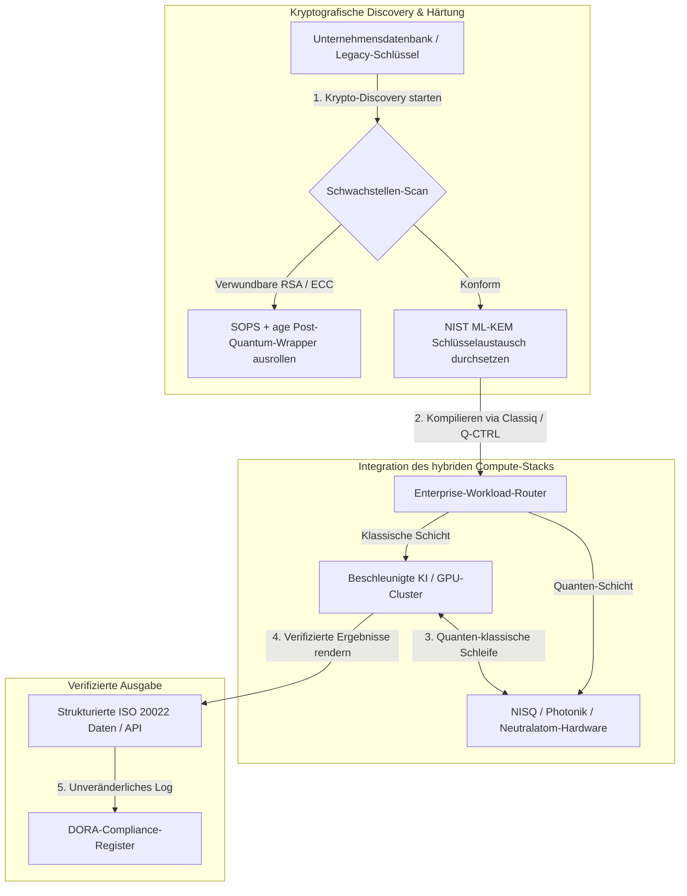

---

# Front Matter (YAML)

author: "contact@sebastienrousseau.com (Sebastien Rousseau)"
banner_alt: "Bühnenansicht des Economist Impact 5th Annual Commercialising Quantum Global 2026 Summit in London — Sinnbild für den Übergang der Quantentechnologie von der Physikforschung zu unternehmensreifen Arbeitsabläufen"
banner_height: "1597"
banner_width: "2584"
banner: "https://cloudcdn.pro/stocks/images/sebastien-rousseau-20260617-5th-commercialising-quantum-2.webp"
cdn: "https://cloudcdn.pro"
charset: "UTF-8"
cname: "sebastienrousseau.com"
copyright: "© Copyright 2025 - 2026 - Sebastien Rousseau. Alle Rechte vorbehalten."
date: "17. Juni 2026"
description: "Vorstandsrelevante Erkenntnisse vom Economist Impact 5th Annual Commercialising Quantum Global 2026 Summit — 1,3 Mrd. USD Finanzierungsschub, „No-Regrets\"-Hybrid-Stacks, Dringlichkeit der Post-Quantum-Migration, Kommerzialisierung des Quantum Sensing und HSBCs Direktive, dass Abwarten ein vermeidbarer Fehler ist."
format-detection: "telephone=no"
hreflang: "de"
icon: "https://cloudcdn.pro/clients/sebastienrousseau/v1/logos/sebastienrousseau.svg"
id: "https://sebastienrousseau.com/2026-06-17-economist-commercialising-quantum-summit-2026"
image_alt: "Schwarz-Weiß-Porträt von Sebastien Rousseau"
image_height: "162"
image_width: "162"
image: "https://cloudcdn.pro/stocks/images/sebastienrousseau.webp"
keywords: "Commercialising Quantum Global 2026, Economist Impact Summit, Post-Quantum-Kryptografie, NIST ML-KEM, Harvest-Now-Decrypt-Later, SNDL, HSBC Quantum, Philip Intallura, Quantum Sensing, GPS-unabhängige Navigation, NQCC, EU Quantum Act, Quantcore, qBIG-Preis, Lord Vallance, hybrid Quanten-klassisch, DORA Artikel 6"
language: "de-DE"
last_reviewed: "2026-06-17"
layout: "report"
locale: "de_DE"
logo_alt: "Logo von Sebastien Rousseau"
logo_height: "44"
logo_width: "44"
logo: "https://cloudcdn.pro/clients/sebastienrousseau/v1/logos/sebastienrousseau.svg"
menu: ""
measurementID: "G-169G4ET5HQ"
name: "Sebastien Rousseau"
permalink: "https://sebastienrousseau.com/2026-06-17-economist-commercialising-quantum-summit-2026"
rating: "general"
referrer: "no-referrer"
robots: "index, follow"
schema: "FAQPage, Article"
seo_title: "Commercialising Quantum 2026: Erkenntnisse für den Vorstand"
short_name: "sebastienrousseau"
subtitle: "Quantum hat den Sprung von spekulativer Laborwissenschaft zu hybriden Unternehmens-Workflows geschafft; der Vorstand muss auf 1,3 Mrd. USD Finanzierung in 2026, die unmittelbare Post-Quantum-Migration und HSBCs Direktive reagieren, das Abwarten zu beenden."
tags: "Quantum, Post-Quantum-Kryptografie, NIST ML-KEM, Harvest-Now-Decrypt-Later, Quantum Sensing, HSBC, Economist Impact, Hybrid Compute, DORA, EU Quantum Act, NQCC, Summit-Erkenntnisse"
theme-color: "0, 83, 191"
title: "Von Qubits zu Profiten: Strategische Erkenntnisse vom Economist's 5th Annual Commercialising Quantum Global 2026 Summit"
url: "https://sebastienrousseau.com/2026-06-17-economist-commercialising-quantum-summit-2026"
viewport: "width=device-width, initial-scale=1, shrink-to-fit=no"

# RSS - The RSS feed front matter (YAML).
atom_link: "https://sebastienrousseau.com/2026-06-17-economist-commercialising-quantum-summit-2026/rss.xml"
category: "Technology"
docs: https://validator.w3.org/feed/docs/rss2.html
generator: "Static Site Generator (SSG) (version 0.0.26)"
item_description: "Vorstandsrelevante Erkenntnisse vom Economist Impact 5th Annual Commercialising Quantum Global 2026 Summit — 1,3 Mrd. USD Finanzierungsschub, „No-Regrets\"-Hybrid-Stacks, Dringlichkeit der Post-Quantum-Migration, Kommerzialisierung des Quantum Sensing und HSBCs Direktive, dass Abwarten ein vermeidbarer Fehler ist."
item_guid: "https://sebastienrousseau.com/2026-06-17-economist-commercialising-quantum-summit-2026/rss.xml"
item_link: "https://sebastienrousseau.com/2026-06-17-economist-commercialising-quantum-summit-2026/rss.xml"
item_pub_date: "Wed, 17 Jun 2026 06:06:06 +0000"
item_title: "Von Qubits zu Profiten: Strategische Erkenntnisse vom Economist's 5th Annual Commercialising Quantum Global 2026 Summit"
last_build_date: "Wed, 17 Jun 2026 06:06:06 +0000"
managing_editor: "contact@sebastienrousseau.com (Sebastien Rousseau)"
pub_date: "Wed, 17 Jun 2026 06:06:06 +0000"
ttl: "60"
type: "article"
webmaster: "contact@sebastienrousseau.com"

# Apple - The Apple front matter (YAML).
apple_mobile_web_app_orientations: "portrait"
apple_touch_icon_sizes: "192x192"
apple-mobile-web-app-capable: "yes"
apple-mobile-web-app-status-bar-inset: "black"
apple-mobile-web-app-status-bar-style: "black-translucent"
apple-mobile-web-app-title: "Commercialising Quantum 2026: Erkenntnisse für den Vorstand"
apple-touch-fullscreen: "yes"

# MS Application - The MS Application front matter (YAML).

msapplication-navbutton-color: "0, 83, 191"

# Twitter Card - The Twitter Card front matter (YAML).

twitter_card: "summary_large_image"
twitter_creator: "@wwdseb"
twitter_description: "Vorstandsrelevante Erkenntnisse vom Economist Impact 5th Annual Commercialising Quantum Global 2026 Summit — 1,3 Mrd. USD Finanzierungsschub, „No-Regrets\"-Hybrid-Stacks, Dringlichkeit der Post-Quantum-Migration, Kommerzialisierung des Quantum Sensing und HSBCs Direktive, dass Abwarten ein vermeidbarer Fehler ist."
twitter_image: "https://cloudcdn.pro/clients/sebastienrousseau/v1/logos/sebastienrousseau.svg"
twitter_image_alt: "Logo von Sebastien Rousseau"
twitter_site: "@wwdseb"
twitter_title: "Commercialising Quantum 2026: Erkenntnisse für den Vorstand"
twitter_url: "https://sebastienrousseau.com/2026-06-17-economist-commercialising-quantum-summit-2026"

excerpt: "Der Economist Impact 5th Annual Commercialising Quantum Global 2026 Summit hat den Schwenk von Quantum hin zu Unternehmens-Workflows bestätigt: 1,3 Mrd. USD in fünf Monaten eingesammelt, Post-Quantum-Kryptografie ist unter SNDL-Harvesting eine Treuhandfrage auf Vorstandsebene, Quantum Sensing wird heute für GPS-unabhängige Navigation ausgeliefert, und HSBCs Philip Intallura hat die Direktive ausgesprochen, dass das Warten auf fehlertolerante Hardware ein vermeidbarer Fehler ist."

# Humans.txt - The Humans.txt front matter (YAML).
author_website: "https://sebastienrousseau.com"
author_twitter: "@wwdseb"
author_location: "London, UK"
thanks: "Danke fürs Lesen!"
site_last_updated: "2026-06-17"
site_standards: "HTML5, CSS3, RSS, Atom, JSON, XML, YAML, Markdown, TOML"
site_components: "Kaishi, Kaishi Builder, Kaishi CLI, Kaishi Templates, Kaishi Themes"
site_software: "Static Site Generator, Rust"

---

# Von Qubits zu Profiten: Strategische Erkenntnisse vom Economist's 5th Annual Commercialising Quantum Global 2026 Summit

Unternehmensreife, Post-Quantum-Kryptografie-Migrationen, hybride Compute-Stacks und die entstehende kommerzielle Landschaft von Quantum Sensing und Networking.

**Kurzfassung.** Die 5th Annual Commercialising Quantum Global 2026 Konferenz, ausgerichtet von Economist Impact am 16. und 17. Juni 2026 im Business Design Centre in London, versammelte über 1.100 Führungskräfte aus Industrie, Finanzwesen, Politik und Forschung. Das Leitthema markierte einen klaren strukturellen Schwenk: Quantentechnologie hat den Sprung von spekulativer Laborwissenschaft zu praktischen, hybriden Unternehmens-Workflows vollzogen. Gestützt auf 1,3 Mrd. USD Venture Capital, die allein in den ersten fünf Monaten des Jahres 2026 eingesammelt wurden, zählt im Vorstand nicht mehr das Abzählen physischer Qubits, sondern der Aufbau von „No-Regrets\"-Hybrid-Stacks, die Absicherung digitaler Vermögenswerte gegen die kryptografische Bedrohung „Harvest-Now, Decrypt-Later\" (SNDL) und der Einsatz kurzfristig verfügbarer Quantum-Sensing-Systeme für GPS-unabhängige Navigation.

## Kernaussagen

- **Unternehmens-Schwenk zu praktischen Workflows.** Branchenführer ([Steve Suarez](https://www.linkedin.com/in/stevesuarez) von HorizonX, [Phil Intallura](https://www.linkedin.com/in/intallura) von HSBC) betonten, dass die Integration von Quantum kein Physikproblem mehr ist, sondern ein operatives. Banken und Unternehmen rollen hybride Quanten-klassische Piloten aus, um Talente vorzubereiten und aktive Workloads zu optimieren.
- **Post-Quantum-Kryptografie (PQC) ist Vorstandspriorität.** Sicherheits- und Rechtsexperten (CMS UK, [Joanne Miller](https://www.linkedin.com/in/joanne-miller-nso) von Microsoft, [Craig Farrell](https://www.linkedin.com/in/craig-farrell) von EY) warnten, dass Organisationen nicht auf fehlertolerante Hardware warten dürfen, bevor sie PQC ausrollen. „Harvest-Now, Decrypt-Later\"-Harvesting findet heute statt — die Migration auf NIST-ML-KEM-Standards wird damit zu einer unmittelbaren treuhänderischen Pflicht.
- **Quantum Sensing führt bei kurzfristiger Profitabilität.** Während fehlertolerantes Rechnen noch Jahre entfernt ist, skaliert Quantum Sensing ([Matthew Kinsella](https://www.linkedin.com/in/matthewkinsella) von Infleqtion) rasant. Quantenuhren und Trägheitssensoren werden in der GPS-unabhängigen Navigation, in der nationalen Sicherheit und in hochstabilen Energienetzen eingesetzt.
- **Souveränität, Cluster und politische Dringlichkeit.** UK-Wissenschaftsminister [Lord Vallance](https://www.linkedin.com/in/patrick-vallance) und [Lord William Hague](https://www.linkedin.com/in/williamhague) skizzierten nationale Missionen, um Forschung in industrielle „Supercluster\" zu überführen — in enger Abstimmung mit dem National Quantum Computing Centre (NQCC). Der bevorstehende EU Quantum Act unterstreicht den geopolitischen Wettlauf um souveräne Rechenkapazität.
- **Quantcore gewinnt den qBIG-Preis.** Das Spin-out Quantcore der University of Glasgow sichert sich den IOP-qBIG-Preis für seine bahnbrechenden Niob-basierten supraleitenden Komponenten, die bei höheren Temperaturen arbeiten als klassische Materialien und so den kryogenen Infrastrukturaufwand deutlich senken.

**Weiterführende Lektüre:** [KyberLib und die Post-Quantum-Banking-Migration 2026: Von Standards zu Code](https://sebastienrousseau.com/2026-06-12-kyberlib-post-quantum-banking-migration-standards-code-2026/), [Der Banking Resilience Index 2026: KI, Cloud, Quantum, Zahlungen und das Drittparteien-Konzentrationsrisiko](https://sebastienrousseau.com/2026-06-08-banking-resilience-index-ai-cloud-quantum-payments-third-party-risk-2026/), [Der Cloud-Native-Banking-Index 2026: DORA, Platform Engineering, souveräne Cloud und operative Resilienz](https://sebastienrousseau.com/2026-06-05-cloud-native-banking-index-dora-resilience-platform-engineering-2026/).

## 01. Warum der Summit 2026 für den Vorstand zählt

Die 2026er-Ausgabe des Economist's Commercialising Quantum Global Summit markierte eine dauerhafte Verschiebung in der Art, wie die Unternehmenswelt Deep Tech bewertet.

Historisch war Quantum Computing als mehrere Jahrzehnte umspannendes wissenschaftliches Vorhaben den F&E-Abteilungen vorbehalten. Im Juni 2026 ist diese Sicht überholt. Organisationen müssen vom „physikzentrierten\" Forschen zur „geschäftszentrierten\" Umsetzung übergehen. Der Grund ist zweifach:

1. **Die Konvergenz von Quantum und KI.** High-Performance-Computing-Stacks (HPC) verschmelzen klassische, beschleunigte KI- und NISQ-Knoten (Noisy Intermediate-Scale Quantum) zu einer einheitlichen Rechenschicht. Wer den Aufbau quantenfähiger Anwendungen aufschiebt, wird feststellen, dass sich das Fenster für strategischen Vorsprung schneller schließt als erwartet.
2. **Geopolitische und treuhänderische Dringlichkeit.** Mit dem missionsgetriebenen Quantenprogramm des Vereinigten Königreichs und dem bevorstehenden EU Quantum Act ist Quantenkapazität zu einer Frage nationaler Souveränität und unternehmerischer Geschäftskontinuität geworden.

Darüber hinaus ist Post-Quantum-Cybersicherheit keine zukünftige Compliance-Anforderung mehr. Die Bedrohung durch gegnerische „Store-Now, Decrypt-Later\"-Angriffe (SNDL) bedeutet: Unternehmensdaten, die heute abgefangen werden, lassen sich entschlüsseln, sobald kommerzielle Quantensysteme skalieren — und erzeugen damit unmittelbar Haftungsrisiken unter globalen Resilienzvorgaben wie dem Digital Operational Resilience Act (DORA).

## 02. Die strategische Linse von Commercialising Quantum 2026

Technologieverantwortliche im Unternehmen müssen die Quantum-Reife über fünf operative Ebenen kartieren — entlang von Zeithorizont und Bilanzrisiko.

### Tabelle 1: Die strategische Linse von Commercialising Quantum 2026

| Ebene | Fokus im Unternehmen | Zeithorizont | Zentrales Unternehmensrisiko |
| ---- | ---- | ---- | ---- |
| **Hardware & Compiler** | Auswahl zwischen konkurrierenden Ansätzen (supraleitend, Ionenfallen, neutrale Atome, Photonik) | 3 – 5 Jahre (Fehlertoleranz) | Festlegung auf eine Sackgassen-Architektur oder zu früher Wette auf eine Einzelplattform. |
| **Kryptografische Härtung** | Discovery und Inventarisierung kryptografischer Abhängigkeiten; Migration zu NIST ML-KEM | Unmittelbar (aktive Migration) | Systemische Datenschutzverletzungen und Compliance-Versagen unter DORA und NIST CSF 2.0. |
| **Quantum Sensing** | Einsatz GPS-unabhängiger Navigation, hochstabiler Uhren und Gravimeter | 1 – 2 Jahre (unmittelbar kommerziell) | Operative Disruption von Logistik, Schifffahrt und Energienetzen durch GPS-Störungen. |
| **Systemintegration** | Anbindung von Quanten-Hardware an bestehende klassische HPC- und Supercomputing-Rechenzentren | 1 – 3 Jahre (Hybrid-Phase) | Hohe Latenz, Datentransfer-Engpässe und fragmentierte Compute-Silos. |
| **Unternehmenssoftware** | Bereitstellung von Quantenalgorithmen über High-Level-Abstraktionsschichten und APIs (Classiq, Q-CTRL) | Unmittelbar (Skill-Aufbau) | Isolation von Talenten und Workflows gegenüber der tatsächlichen Engineering-Umsetzung. |

## 03. Wichtige Quantum-Signale und Vorstandsauslöser

Technologieverantwortliche müssen spezifische, quantifizierbare Markt- und Regulierungskennzahlen verfolgen, um Quanteninvestitionen zu steuern.

### Tabelle 2: Wichtige Quantum-Signale und Vorstandsauslöser

| Signal | Quantitative Kennzahl | Regulatorischer Bezug | Plattform-Priorität (Handlung) |
| ---- | ---- | ---- | ---- |
| **Quantum-Finanzierungsschub** | 1,3 Mrd. USD weltweit in den ersten fünf Monaten 2026 eingesammelt | Return on Resilience (RoR) | Budgets von spekulativen Piloten auf „No-Regrets\"-Hybrid-Quanten-klassische Workloads umlenken. |
| **Entschlüsselungs-Exponierung** | 100 % der über öffentliche Kanäle übertragenen verschlüsselten Daten sind dem SNDL-Harvesting ausgesetzt | DORA Artikel 6 (IKT-Sicherheit) | Kryptografische Discovery-Werkzeuge einsetzen, um verwundbare RSA-/ECC-Schlüssel im gesamten Bestand zu identifizieren. |
| **Souveräne Infrastruktur** | 2,5 Mrd. £ Allokation der UK National Quantum Strategy | UK Quantum Missions / Lord Vallance | Lokale Partnerschaften mit nationalen Superclustern wie dem NQCC aufbauen. |
| **Compliance-Fristen** | Umstellung auf strukturierte SWIFT-Adressen am 14. November 2026 | SWIFT SR 2026 Directive | Interbankendatenbanken bereinigen und in strukturiertes XML überführen. |

## 04. Tiefenanalyse der zentralen Summit-Themen

### Quantum erreicht den Investitions-Wendepunkt

Die Venture-Capital-Finanzierung hat deutlich an Tempo gewonnen — **1,3 Mrd. USD** wurden allein in den ersten fünf Monaten 2026 eingesammelt. Anders als die spekulativen Hype-Zyklen früherer Jahre stützt sich die aktuelle Kapitalwelle auf reale, kurzfristig nutzbare Workloads. Sprecherinnen und Sprecher von Classiq und IBM Quantum Platform zeigten, wie Software-Abstraktionsschichten und automatisierte Compiler es nicht-spezialisierten Entwicklerteams erlauben, hybride Quanten-klassische Algorithmen auf der heutigen klassischen Infrastruktur auszuführen. Diese „No-Regrets\"-Strategie ermöglicht es Organisationen, schon heute quantenfähige Talente und Workflows aufzubauen.

### Rechtliche und regulatorische Warnungen zu „Harvest-Now, Decrypt-Later\"

Rechtspartner und Cybersicherheits-Verantwortliche sorgten für hohe Resonanz mit der Unmittelbarkeit der Datenrisiken. Vertreter der Sponsoren-Kanzlei CMS UK und Microsoft-CSO [Joanne Miller](https://www.linkedin.com/in/joanne-miller-nso) übermittelten dem Senior Management eine eindeutige Warnung: *Auf das Eintreffen fehlertoleranter Hardware zu warten, bevor Post-Quantum-Kryptografie ausgerollt wird, ist ein kritisches treuhänderisches Versäumnis.*

Unter dem „Store-Now, Decrypt-Later\"-Paradigma (SNDL) sammeln feindliche Akteure heute aktiv verschlüsselte Unternehmensdaten, mit der Absicht, sie zu entschlüsseln, sobald kryptografisch relevante Quantencomputer verfügbar werden. Organisationen müssen Post-Quantum-Schutz (etwa NIST ML-KEM) unverzüglich ausrollen, um langlebige sensible Datensätze, geistiges Eigentum und historische Kundendaten zu schützen.

### Die Neujustierung des „Quantum Sensing\"-Hype

Während fehlertolerantes Quantencomputing noch Jahre entfernt ist, hob der Summit Quantum Sensing als die erste wirklich profitable Welle realer Einsätze hervor. Chief Executive [Matthew Kinsella](https://www.linkedin.com/in/matthewkinsella) von Infleqtion legte dar, wie Quantenuhren, Trägheitssensoren und Radiofrequenzsysteme branchenübergreifend rasant skalieren.

Weil diese Technologien physikalische Konstanten mit subatomarer Präzision messen, ermöglichen sie **GPS-unabhängige Navigation**, hochstabile Energienetze und Weltraumkommunikation. Diese Anwendungen sind hochrelevant für Luftfahrt, Seeverkehr und nationale Verteidigungssysteme, die zunehmend mit GPS-Störungen konfrontiert sind.

### Ökosystem- und Cluster-Kooperation

Das britische Quantum-Ökosystem nutzte den Londoner Summit, um heimische Innovations-Supercluster zu präsentieren. Live-Updates aus dem National Quantum Computing Centre (NQCC) und vom Digital Catapult zeigten, wie Deep-Tech-Spin-outs in der Frühphase die „Technologiekluft\" überbrücken können, indem sie Quanten-Hardware direkt in klassische Supercomputing-Rechenzentren integrieren.

[Wridhdhisom Karar](https://www.linkedin.com/in/wridhdhisomkarar), Mitgründer des schottischen Quantum-Start-ups Quantcore, nahm den renommierten Preis des Institute of Physics (IOP) Quantum Business Innovation and Growth (qBIG) für die Niob-basierten supraleitenden Komponenten des Unternehmens entgegen. Diese Komponenten arbeiten bei höheren Temperaturen als klassische Materialien und senken den für die Skalierung von Quantenprozessoren erforderlichen kryogenen Infrastrukturaufwand deutlich.

### Die HSBC-Fallstudie: warum Warten auf Quantum ein „vermeidbarer Fehler\" ist

Die Beiträge von [**Philip Intallura, Ph.D.**](https://www.linkedin.com/in/intallura) (Global Head of Quantum Technologies bei HSBC, Berater der britischen Regierung und Board Advisor) auf dem Economist's 5th Annual Commercialising Quantum Event (2026) lieferten eine wirkungsvolle Direktive für den Vorstand: *„Auf fehlertolerantes Quantum zu warten, bevor Sie beginnen, ist ein vermeidbarer Fehler.\"*

Dr. Intallura argumentierte, dass die unter Finanzinstituten verbreitete „Abwarten und Schauen\"-Haltung ein Eigentor sei, das auf drei falschen Annahmen beruht:

- **Kurzfristiger ROI ist real.** In empirischen Tests hat HSBC bestehende Produktivmodelle übertroffen, Quantum-Arbeit mit anderen Geschäftsbereichen verzahnt, Quantum genutzt, um Beziehungen zu einigen der größten Kunden zu vertiefen, und signifikantes Neugeschäft für die **HSBC Innovation Banking** gewonnen.
- **Quantum ist eine steile Adoptionskurve.** Capability-Aufbau, Strategiebildung, Finanzierung sichern und Experimentzyklen innerhalb einer streng regulierten Organisation durchzulaufen, ist kein kurzes Unterfangen. Prozesse müssen systematisch getestet und auf die Technologie angepasst werden.
- **Quantum ist ein Ökosystem.** Niemand schafft es allein. Jedes Forschungspaper, jeder PoC und jeder Pilot, den HSBC durchgeführt hat, entstand in enger Zusammenarbeit mit einem Quantum-Anbieter — und in einigen Fällen reicht die Kooperation bis in die Wissenschaft, zu Regulatoren und zur Regierung.

**Abschluss-Direktive für den Vorstand:** *„Die Fähigkeit, die Sie an Tag eins der Fehlertoleranz brauchen, ist die Fähigkeit, die Sie jetzt aufbauen.\"*

## 05. Quantum-Integration im Unternehmen und Kryptografie-Pipeline

Um digitale Vermögenswerte abzusichern und gleichzeitig Quantum-Reife aufzubauen, muss das Unternehmen eine klare Integrations-Pipeline etablieren.

## 06. Das Vorstands-Playbook: Handlungsimperative

Um die Erkenntnisse des Commercialising Quantum Global 2026 Summit in unmittelbaren Geschäftswert zu übersetzen, sollte das Senior Management das folgende vierstufige Playbook umsetzen:

1. **Kryptografische Discovery anordnen.** Den Chief Information Security Officer (CISO) beauftragen, sämtliche kryptografischen Vermögenswerte zu katalogisieren und jeden Legacy-RSA- und ECC-Schlüssel im Unternehmen zu erfassen, um die Post-Quantum-Migration vorzubereiten.
2. **Eine „No-Regrets\"-Hybrid-Strategie ausrollen.** Nicht auf perfekte Hardware warten. In Quantum-inspirierte Software und hybride klassisch-quanten-Piloten investieren, um schon heute Talente im Haus zu entwickeln und komplexe Logistik- oder Risikoportfolios zu optimieren.
3. **Quantum Sensing für die Logistik prüfen.** Wenn Ihr Unternehmen von globalen Lieferketten, Schifffahrt oder kritischer Infrastruktur abhängt, sollten Sie Quantum-Sensing-Systeme (etwa GPS-unabhängige Navigation) aktiv evaluieren, um geopolitische Disruptionsrisiken zu mindern.
4. **Für die Insight Hour am 30. Juni anmelden.** Sorgen Sie dafür, dass Ihre Technologieverantwortlichen sich für die virtuelle **Commercialising Quantum Global Insight Hour** am 30. Juni 2026 um 15:00 Uhr BST (unterstützt von IonQ) registrieren, um Enterprise Risk Management und Talent-Allokation kontinuierlich zu verfolgen.

## 07. Häufig gestellte Fragen

**Was ist „Harvest-Now, Decrypt-Later\" (SNDL) und warum ist das heute relevant?**
SNDL ist die Praxis, verschlüsselte Daten heute abzufangen und zu speichern, um sie später zu entschlüsseln, sobald kryptografisch relevante Quantencomputer verfügbar sind. Langlebige sensible Datensätze — geistiges Eigentum, Kundendaten, Regierungskommunikation — werden bereits aktiv ins Visier genommen. Die Migration auf NIST ML-KEM ist eine treuhänderische Entscheidung, die der Vorstand nicht aufschieben kann.

**Warum ist Quantum Sensing die erste kommerzielle Welle und nicht das Rechnen?**
Quantensensoren messen physikalische Konstanten mit subatomarer Präzision und benötigen die fehlertolerante Hardware nicht, die für Quantum Computing erforderlich ist. Quantenuhren, Gravimeter und Trägheitssensoren sind bereits in Pilotbetrieben für GPS-unabhängige Navigation, hochstabile Energienetze und Weltraumkommunikation im Einsatz.

**Ist HSBCs Quantum-Arbeit reine F&E oder hat sie messbare Erträge geliefert?**
Laut Philip Intallura auf dem Summit hat HSBC Modelle übertroffen, die derzeit produktiv laufen, Quantum genutzt, um Beziehungen zu seinen größten Kunden zu vertiefen, und signifikantes Neugeschäft für die HSBC Innovation Banking gewonnen. Die Arbeit ist von der Forschung zur operativen Integration übergegangen.

## 08. Referenzen

- **Economist Impact, (2026).** *5th Annual Commercialising Quantum Global 2026.* Live-Konferenzprotokoll, 16.–17. Juni 2026. London: Business Design Centre. Verfügbar unter: [Economist Impact](https://events.economist.com/commercialising-quantum/).
- **National Institute of Standards and Technology (NIST), (2024).** *First Three Finalized Post-Quantum Encryption Standards (FIPS 203, 204 und 205).* Gaithersburg: U.S. Department of Commerce. Verfügbar unter: [NIST Standards](https://www.nist.gov/news-events/news/2024/08/nist-releases-first-3-finalized-post-quantum-encryption-standards).
- **Europäisches Parlament und Rat der Europäischen Union, (2022).** *Verordnung (EU) 2022/2554 über die digitale operationale Resilienz im Finanzsektor (DORA).* Brüssel: Amtsblatt der Europäischen Union. Verfügbar unter: [DORA-Verordnung](https://eur-lex.europa.eu/legal-content/EN/TXT/?uri=CELEX%3A32022R2554).
- **SWIFT, (2024).** *ISO 20022 November 2026 Structured Address Milestone.* La Hulpe: SWIFT. Verfügbar unter: [SWIFT ISO 20022 Meilenstein](https://www.swift.com/standards/iso-20022/iso-20022-bytes/call-action-november-2026).
