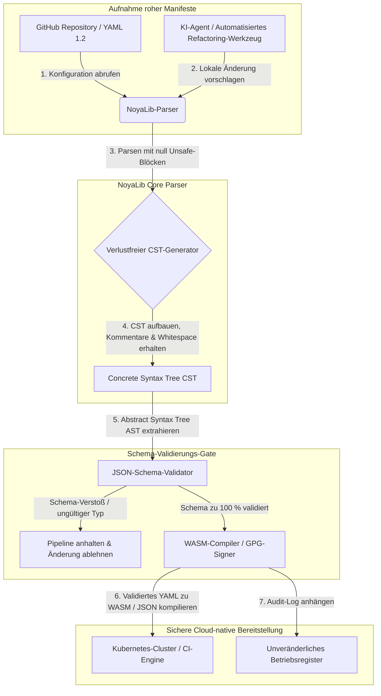

---

# Front Matter (YAML)

author: "contact@sebastienrousseau.com (Sebastien Rousseau)"
banner_alt: "Architekturgeometrie unter dramatischem Licht — Sinnbild für NoyaLibs Rolle als tragender, sicherer Rust-YAML-Parser unter CI, Kubernetes, MCP und der Konfiguration in der Finanzdienstleistungsbranche"
banner_height: "1597"
banner_width: "2584"
banner: "https://cloudcdn.pro/stocks/images/ken-cheung-KonWFWUaAuk.webp"
cdn: "https://cloudcdn.pro"
charset: "UTF-8"
cname: "sebastienrousseau.com"
copyright: "© Copyright 2025 - 2026 - Sebastien Rousseau. Alle Rechte vorbehalten."
date: "18. Juni 2026"
description: "NoyaLib: ein zero-unsafe Rust-YAML-1.2-Parser mit 406/406-Spec-Konformität, JSON-Schema-Validierung, verlustfreiem CST und MCP-/WASM-Bindings für Finanzinfrastruktur."
format-detection: "telephone=no"
hreflang: "de"
icon: "https://cloudcdn.pro/clients/sebastienrousseau/v1/logos/sebastienrousseau.svg"
id: "https://sebastienrousseau.com/2026-06-18-noyalib-safe-yaml-rust-ai-mcp-financial-infrastructure-2026"
image_alt: "Schwarz-Weiß-Porträt von Sebastien Rousseau"
image_height: "162"
image_width: "162"
image: "https://cloudcdn.pro/stocks/images/sebastienrousseau.webp"
keywords: "sicherer Rust-YAML-Parser, NoyaLib, YAML 1.2 Spec-Konformität, zero-unsafe Rust, JSON-Schema-Validierung, verlustfreier Concrete Syntax Tree, CST, MCP, Model Context Protocol, WebAssembly, Kubernetes-Manifeste, CI/CD-Konfiguration, DORA Artikel 5, BCBS 239, Basel III operationelles Risiko, Finanzinfrastruktur, Konfigurationssicherheit, Software-Lieferkette"
language: "de-DE"
last_reviewed: "2026-06-18"
layout: "report"
locale: "de_DE"
logo_alt: "Logo von Sebastien Rousseau"
logo_height: "44"
logo_width: "44"
logo: "https://cloudcdn.pro/clients/sebastienrousseau/v1/logos/sebastienrousseau.svg"
menu: ""
measurementID: "G-169G4ET5HQ"
name: "Sebastien Rousseau"
permalink: "https://sebastienrousseau.com/2026-06-18-noyalib-safe-yaml-rust-ai-mcp-financial-infrastructure-2026"
rating: "general"
referrer: "no-referrer"
robots: "index, follow"
schema: "FAQPage, Article"
seo_title: "Sicherer Rust-YAML-Parser für KI, MCP & Finanzen"
short_name: "sebastienrousseau"
subtitle: "Ein sicherer Rust-YAML-Stack — NoyaLib — macht aus YAML 1.2 mehr als bequemes Markup: eine kryptografisch abgesicherte, spec-konforme Konfigurations-Steuerungsebene für KI-Agenten, MCP, Kubernetes und die Infrastruktur der Finanzdienstleistungsbranche."
tags: "sicherer Rust-YAML-Parser, NoyaLib, YAML 1.2, zero-unsafe Rust, JSON-Schema, MCP, WebAssembly, Kubernetes, DORA, BCBS 239, Basel III, Finanzinfrastruktur, Sicherheit der Lieferkette"
theme-color: "0, 83, 191"
title: "Warum YAML 2026 einen sichereren Rust-Stack für KI, MCP und Finanzinfrastruktur braucht"
url: "https://sebastienrousseau.com/2026-06-18-noyalib-safe-yaml-rust-ai-mcp-financial-infrastructure-2026"
viewport: "width=device-width, initial-scale=1, shrink-to-fit=no"

# RSS - The RSS feed front matter (YAML).
atom_link: "https://sebastienrousseau.com/2026-06-18-noyalib-safe-yaml-rust-ai-mcp-financial-infrastructure-2026/rss.xml"
category: "Technology"
docs: https://validator.w3.org/feed/docs/rss2.html
generator: "Static Site Generator (SSG) (version 0.0.26)"
item_description: "NoyaLib: ein zero-unsafe Rust-YAML-1.2-Parser mit 406/406-Spec-Konformität, JSON-Schema-Validierung, verlustfreiem CST und MCP-/WASM-Bindings für Finanzinfrastruktur."
item_guid: "https://sebastienrousseau.com/2026-06-18-noyalib-safe-yaml-rust-ai-mcp-financial-infrastructure-2026/rss.xml"
item_link: "https://sebastienrousseau.com/2026-06-18-noyalib-safe-yaml-rust-ai-mcp-financial-infrastructure-2026/rss.xml"
item_pub_date: "Thu, 18 Jun 2026 06:06:06 +0000"
item_title: "Warum YAML 2026 einen sichereren Rust-Stack für KI, MCP und Finanzinfrastruktur braucht"
last_build_date: "Thu, 18 Jun 2026 06:06:06 +0000"
managing_editor: "contact@sebastienrousseau.com (Sebastien Rousseau)"
pub_date: "Thu, 18 Jun 2026 06:06:06 +0000"
ttl: "60"
type: "article"
webmaster: "contact@sebastienrousseau.com"

# Apple - The Apple front matter (YAML).
apple_mobile_web_app_orientations: "portrait"
apple_touch_icon_sizes: "192x192"
apple-mobile-web-app-capable: "yes"
apple-mobile-web-app-status-bar-inset: "black"
apple-mobile-web-app-status-bar-style: "black-translucent"
apple-mobile-web-app-title: "Sicherer Rust-YAML-Parser für KI, MCP & Finanzen"
apple-touch-fullscreen: "yes"

# MS Application - The MS Application front matter (YAML).

msapplication-navbutton-color: "0, 83, 191"

# Twitter Card - The Twitter Card front matter (YAML).

twitter_card: "summary_large_image"
twitter_creator: "@wwdseb"
twitter_description: "NoyaLib: ein zero-unsafe Rust-YAML-1.2-Parser mit 406/406-Spec-Konformität, JSON-Schema-Validierung, verlustfreiem CST und MCP-/WASM-Bindings für Finanzinfrastruktur."
twitter_image: "https://cloudcdn.pro/clients/sebastienrousseau/v1/logos/sebastienrousseau.svg"
twitter_image_alt: "Logo von Sebastien Rousseau"
twitter_site: "@wwdseb"
twitter_title: "Sicherer Rust-YAML-Parser für KI, MCP & Finanzen"
twitter_url: "https://sebastienrousseau.com/2026-06-18-noyalib-safe-yaml-rust-ai-mcp-financial-infrastructure-2026"

excerpt: "NoyaLib ist ein sichererer Rust-YAML-Stack — null unsafe-Blöcke, 406/406 YAML-1.2-Spec-Konformität, verlustfreier Concrete Syntax Tree, JSON-Schema-Validierung (Draft 2020-12) und MCP-/WASM-Bindings — entwickelt für KI-Agenten, Kubernetes, CI/CD und die Konfigurations-Steuerungsebene hinter Finanzinfrastruktur."

# Humans.txt - The Humans.txt front matter (YAML).
author_website: "https://sebastienrousseau.com"
author_twitter: "@wwdseb"
author_location: "London, UK"
thanks: "Danke fürs Lesen!"
site_last_updated: "2026-06-18"
site_standards: "HTML5, CSS3, RSS, Atom, JSON, XML, YAML, Markdown, TOML"
site_components: "Kaishi, Kaishi Builder, Kaishi CLI, Kaishi Templates, Kaishi Themes"
site_software: "Static Site Generator, Rust"

---

# Warum YAML 2026 einen sichereren Rust-Stack für KI, MCP und Finanzinfrastruktur braucht

Ein sichererer Rust-YAML-Stack zählt, weil YAML inzwischen CI/CD-Pipelines, Kubernetes-Manifeste, [Open Policy Agent](https://www.openpolicyagent.org/)-Regeln und Tool-Registries des Model Context Protocol (MCP) trägt — und ein einziger mehrdeutiger Parse kann ein Clearing-System lahmlegen, eine Sicherheitsgruppe falsch konfigurieren oder einem lokalen KI-Agenten die falschen Berechtigungen verleihen. [NoyaLib](https://github.com/sebastienrousseau/noyalib) ist ein reines Rust-Ökosystem für YAML-1.2-Parsing und -Validierung, zero-unsafe und so entwickelt, dass diese Infrastruktur standardmäßig sicher ist.

## Kurze Antwort

**Was ist NoyaLib in einem Satz?** NoyaLib ist ein quelloffenes, reines Rust-Ökosystem für YAML-1.2-Parsing und -Validierung mit null `unsafe`-Code, 100 % Spec-Konformität über die offizielle 406-Test-YAML-Suite, einem verlustfreien Concrete Syntax Tree und Echtzeit-Validierung gegen [JSON Schema](https://json-schema.org/) — entwickelt, damit Konfiguration für KI-Agenten, MCP, Kubernetes und Finanzinfrastruktur standardmäßig sicher ist.

## Executive Summary

YAML wirkt unscheinbar — bis ein mehrdeutiger Parse oder ein Schema-Verstoß ein milliardenschweres produktives Clearing-System bricht. 2026 ist YAML der De-facto-Standard für [CI/CD](https://docs.github.com/en/actions/learn-github-actions/workflow-syntax-for-github-actions)-Pipelines, [Kubernetes](https://kubernetes.io/docs/concepts/configuration/overview/)-Manifeste, [Open Policy Agent](https://www.openpolicyagent.org/)-Regeln und Tool-Registries des Model Context Protocol (MCP). Undurchsichtige Legacy-Parser — mit Speicher-Schwachstellen und destruktivem Parsing — sind ein inakzeptables Sicherheitsrisiko. NoyaLib ist ein reines Rust-YAML-1.2-Ökosystem, zero-unsafe: 100 % Spec-Konformität über alle 406 offiziellen Suite-Tests, ein verlustfreier Concrete Syntax Tree (CST), der Kommentare und Whitespace erhält, sowie integrierte JSON-Schema-Validierung. Das Ergebnis: YAML wird zur prüffähigen, sicheren und für Agenten ansprechbaren Konfigurations-Steuerungsebene.

## Kernaussagen

- **Konfiguration ist Produktionscode.** Eine einzige fehlerhafte YAML-Datei kann Cloud-native Sicherheitsgruppen oder die Berechtigungen eines KI-Agenten falsch konfigurieren. NoyaLib behandelt YAML als kritische Infrastruktur.
- **Zero-unsafe-Design.** Vollständig in sicherem Rust ohne `unsafe`-Blöcke gebaut, eliminiert NoyaLib Speichersicherheits-Schwachstellen — Buffer Overflows, RCE — in den zentralen Parsing-Schichten.
- **Absolute 406/406-Spec-Konformität.** Validiert Konfigurationsstrukturen mathematisch und beseitigt Parsing-Diskrepanzen sowie strukturellen Drift zwischen Staging- und Produktivumgebungen.
- **Verlustfreier Concrete Syntax Tree.** Anders als Legacy-Parser, die Kommentare und Formatierung verwerfen, erhält NoyaLib Whitespace und Annotationen — und ermöglicht damit sicheres, automatisiertes Round-Trip-Refactoring durch KI-Agenten.
- **Treuhänderischer Wert auf Vorstandsebene.** Verknüpft Konfigurationsintegrität mit [DORA Artikel 5](https://eur-lex.europa.eu/legal-content/EN/TXT/?uri=CELEX%3A32022R2554) und den Kapitalkennzahlen für operationelle Risiken nach [Basel III](https://www.bis.org/bcbs/publ/d424.htm) — und schützt damit das Senior Management unmittelbar vor persönlicher Haftung.

**Weiterführende Lektüre:** [KyberLib und die Post-Quantum-Banking-Migration 2026: Von Standards zu Code](https://sebastienrousseau.com/2026-06-12-kyberlib-post-quantum-banking-migration-standards-code-2026/), [Der Cloud-Native-Banking-Index 2026: DORA, Platform Engineering, souveräne Cloud und operative Resilienz](https://sebastienrousseau.com/2026-06-05-cloud-native-banking-index-dora-resilience-platform-engineering-2026/), [KI-bewusste Dotfiles 2026: Aufbau einer sicheren, reproduzierbaren Entwickler-Workstation für MCP, SLSA und Multi-Shell-Parität](https://sebastienrousseau.com/2026-06-16-ai-aware-dotfiles-secure-reproducible-workstation-2026/).

## 01. Warum ein sichererer Rust-YAML-Stack 2026 zählt

Im Juni 2026 sind Unternehmens-IT-Infrastrukturen hochgradig verteilt und zunehmend automatisiert.

YAML hat sich still zur tragenden Konfigurationssprache des gesamten Software-Engineering-Stacks entwickelt. Es trägt die Continuous-Integration-Workflows (CI), die Produktionsartefakte kompilieren, die [Kubernetes](https://kubernetes.io/docs/concepts/overview/)-Manifeste, die global verteilte Cloud-native Cluster orchestrieren, und die Server-Schemata des [Model Context Protocol](https://modelcontextprotocol.io/) (MCP), die lokalen KI-Agenten die Berechtigung zur Ausführung lokaler Operationen erteilen.

Legacy-YAML-Parser — [PyYAML](https://pyyaml.org/), [yaml-cpp](https://github.com/jbeder/yaml-cpp), [libyaml](https://github.com/yaml/libyaml) — bergen zwei strukturelle Risiken:

1. **Typkonvertierungs-Schwachstellen (das „Norway-Problem").** Legacy-Parser coercen häufig unquotierte Strings (den Ländercode `NO` zu einem Booleschen `false`, ebenso `yes`/`no`) — siehe den [YAML-1.1- vs. -1.2-Boolean-Tag](https://yaml.org/type/bool.html) — und verursachen kritische Systemausfälle oder stille Sicherheits-Fehlkonfigurationen.
2. **Speichersicherheits-Exploits.** Undurchsichtige, in C/C++ geschriebene Parser leiden unter Speicherleck- und Buffer-Overflow-Exploits, die zu Remote Code Execution (RCE) auf zentralen Build-Servern führen können.

[NoyaLib](https://github.com/sebastienrousseau/noyalib) löst diese Herausforderungen. Es ist ein reines Rust-Ökosystem für YAML-1.2-Parsing und -Validierung, zero-unsafe. Indem es absolute 406/406-Spec-Konformität erreicht und strikte JSON-Schema-Validierung direkt während des Parsens erzwingt, liefert NoyaLib einen hohen **Return on Resilience (RoR)** — verhindert konfigurationsbedingte Ausfallzeiten und sichert Software-Lieferketten auf Finanzdienstleister-Niveau.

## 02. Die NoyaLib-Architektur-Linse 2026

Das NoyaLib-Ökosystem arbeitet als sicherer, verlustfreier Konfigurations-Parser. Jedes lokale und Cloud-Manifest wird auf der untersten Ausführungsschicht strukturell validiert und geschützt.

### Tabelle 1: NoyaLib-Architekturschichten und Risikominderung

| Schicht | Designentscheidung | Warum sie zählt | Risiko bei Fehlhandhabung |
| ---- | ---- | ---- | ---- |
| **Parser-Schicht** | YAML-1.2-konformer reiner Rust-Parser mit null `unsafe`-Blöcken | Beseitigt Speichersicherheits-Schwachstellen und Buffer Overflows auf der untersten Ausführungsschicht. | Remote Code Execution (RCE) auf zentralen Build-Servern. |
| **Konformitätsschicht** | 100 % Konformität über die 406/406 offiziellen YAML-1.2-Suite-Tests | Beseitigt Parsing-Diskrepanzen und Typkonvertierungs-Drift zwischen Staging und Produktion. | „Norway-Problem"-Typkonvertierungsfehler, die Sicherheitsgruppen deaktivieren. |
| **Syntaxbaum-Schicht** | Verlustfreier Concrete Syntax Tree (CST) | Erhält Kommentare, Whitespace und Reihenfolge beim Round-Trip-Parsing und beim programmatischen Refactoring. | Automatisiertes KI-Refactoring zerstört Entwickler-Annotationen. |
| **Validierungsschicht** | Validierung gegen [JSON Schema (Draft 2020-12)](https://json-schema.org/draft/2020-12/release-notes) während des Parsens | Erzwingt strikte Datenmodelle für Konfigurationsdateien, bevor sie Produktiv-Cluster erreichen. | Fehlerhafte Konfigurationsdateien lösen Cloud-native Cluster-Crashes aus. |
| **Schnittstellenschicht** | WebAssembly (WASM)- und MCP-Bindings | Erlaubt es, Konfigurationsvalidierung direkt in Browsern, Edge-Knoten und lokalen Agenten-Toolkits auszuführen. | Tooling-Silos, in denen Validierung auf Edge-Geräten nicht laufen kann. |

## 03. Wichtige Signale zur Workstation- und Konfigurationssicherheit

Um absolute Sicherheit über das Entwicklungs- und Betriebsumfeld hinweg aufrechtzuerhalten, müssen Chief Information Security Officers (CISOs) spezifische, quantifizierbare Kennzahlen überwachen.

### Tabelle 2: Workstation- und Konfigurationssicherheits-Signale

| Signal | Kennzahl / operativer Benchmark | NIST-CSF-/DORA-Bezug | Technische Plattform-Umsetzung |
| ---- | ---- | ---- | ---- |
| **Parser-Konformität** | 100 % Bestehensquote über die offizielle YAML-1.2-Testsuite (406/406 Tests). | [DORA Artikel 6](https://eur-lex.europa.eu/legal-content/EN/TXT/?uri=CELEX%3A32022R2554) (IKT-Sicherheit) | NoyaLib-Parser-Kern validiert alle Manifeste vor der CI-Ausführung. |
| **Speichersicherheits-Profil** | Null `unsafe`-Rust-Blöcke in den Parser- und Serializer-Abhängigkeiten. | DORA Artikel 30 (Lieferkette) | Automatisierte Compiler-Checks ([`forbid(unsafe_code)`](https://doc.rust-lang.org/reference/attributes/diagnostics.html#the-forbid-attribute)) in den Cargo-Builds. |
| **Schema-Validierung** | 100 % der geparsten Konfigurationsdateien gegen gültige [JSON-Schema](https://json-schema.org/)-Modelle verifiziert. | [NIST CSF 2.0](https://www.nist.gov/cyberframework) (PR.DS-01) | Echtzeit-Validierungs-Gate hält Build-Pipelines bei Schema-Verstößen an. |
| **Konfigurations-Drift** | Echtzeit-Erkennung und Wiederherstellung lokaler Konfigurationsdateien auf den git-versionierten Zustand. | Return on Resilience (RoR) | Kontinuierliche Telemetrie protokolliert alle lokalen Dateiänderungen. |
| **Agenten-Zugriffskontrolle** | Begrenzte, schreibgeschützte Berechtigungen für lokale KI-Werkzeuge, die über MCP-Konfigurationen arbeiten. | Modellrisikomanagement ([SR 11-7](https://www.federalreserve.gov/supervisionreg/srletters/sr1107.htm)) | MCP-Server-Grenzen schränken Agenten-Operationen auf freigegebene Verzeichnisse ein. |

## 04. Der Trugschluss des undurchsichtigen Konfigurations-Parsings

Eine zentrale Schwachstelle im Cloud-nativen Betrieb ist *undurchsichtiges Parsing* — die Nutzung von Parsern, die strukturelle Metadaten (Kommentare, Whitespace, Dokumentreihenfolge) verwerfen oder Typen während der Kompilierung stillschweigend coercen. Dieses Verhalten erzeugt zwei gravierende Sicherheitsrisiken:

1. **Destruktives Refactoring.** Aktualisiert ein KI-Coding-Assistent oder ein automatisiertes Refactoring-Werkzeug ein Deployment-Manifest, verwerfen traditionelle Parser Kommentare und Formatierung der Entwicklerinnen und Entwickler — und zerstören damit den Kontext, den menschliche Reviews und forensische Auswertungen nach Vorfällen benötigen.
2. **Parsing-Diskrepanzen.** Nutzt eine Staging-Umgebung einen Python-basierten Parser und die Produktion einen C-basierten Parser, können kleinste Unterschiede in der YAML-1.2-Spec-Konformität dazu führen, dass ein gültiges Staging-Manifest in der Produktion scheitert oder sich anders verhält — und schaffen damit verdeckte Sicherheits-Schwachstellen.

NoyaLibs **verlustfreier Concrete Syntax Tree (CST)** löst das. Er erhält jeden Whitespace, jeden Kommentar und jede Dokumentzeile während der Parse-und-Serialisier-Schleife. Automatisierte KI-Assistenten können Konfigurationsdateien bearbeiten, refaktorieren und committen — und dabei 100 % der von Menschen geschriebenen Annotationen bewahren. Ein lückenloser Audit-Trail.

## 05. Eine begrenzte KI-Konfigurations-Pipeline gestalten

Um zu verhindern, dass bösartige Konfigurationsänderungen Produktivumgebungen erreichen, muss die Organisation eine strikt begrenzte, schema-validierte Konfigurations-Pipeline implementieren.

Der nachstehende Betriebsablauf zeigt, wie NoyaLib rohes YAML parst, einen verlustfreien CST aufbaut, den AST gegen ein JSON-Schema-Modell validiert und WebAssembly-Bindings für Browser- oder Edge-Umgebungen kompiliert.

## 06. Das Vorstands-Playbook und treuhänderische Haftung

Konfigurationssicherheit und Integrität der Software-Lieferkette sind kritische Themen für den Vorstand. Senior Manager müssen Konfigurationsmanagement durch die Linse der treuhänderischen Pflicht und der operativen Resilienz betrachten.

- **DORA Artikel 5 (Verantwortung des Vorstands).** Schreibt vor, dass der Vorstand die letzte, nicht delegierbare Verantwortung für das Management des IKT-Risikos des Instituts trägt. Weil Konfigurationsdateien kritische Cloud-native Sicherheitsgruppen und Zahlungsrouten steuern, muss der Vorstand verifizieren, dass die parsenden Systeme speichersicher und vollständig spec-konform sind — um regulatorische Audits zu bestehen. ([Verordnung (EU) 2022/2554](https://eur-lex.europa.eu/legal-content/EN/TXT/?uri=CELEX%3A32022R2554))
- **BCBS 239 (Aggregation und Berichterstattung von Risikodaten).** Verlangt, dass Risikoberichte und Infrastrukturkennzahlen genau, vollständig und unter strengen Datenqualitätskontrollen erzeugt werden. NoyaLib unterstützt BCBS 239, indem es Konfigurationsdateien an der Quelle gegen strikte Schemata parst und validiert — und so stille Datenlecks oder fehlkonfigurationsbedingte Ausfälle verhindert. ([BCBS-239-Standard](https://www.bis.org/publ/bcbs239.htm))
- **Reduktion der Kapitalanforderungen für operationelle Risiken (Basel III).** Konfigurationsbedingte Ausfälle treiben die Kapitalanforderungen für operationelle Risiken unter Basel III unmittelbar in die Höhe und binden Bilanzkapital. Die Standardisierung des Unternehmens-Konfigurations-Stacks auf einen sicheren, reinen Rust-Parser wie NoyaLib minimiert dieses Risiko — bewahrt Kapital und schützt das Kundenvertrauen. ([Basel-III-Standards](https://www.bis.org/bcbs/publ/d424.htm))

## 07. Was das je nach Banktyp bedeutet

### Global Systemrelevante Banken (G-SIBs)

G-SIBs betreiben tausende Microservices und Deployment-Pipelines über mehrere Jurisdiktionen hinweg. Ihre zentrale Herausforderung ist es, Konfigurationskonsistenz zu wahren und Sicherheits-Drift über riesige Cloud-native Bestände hinweg zu verhindern. Die Standardisierung auf einen sichereren Rust-YAML-Stack wie NoyaLib garantiert, dass alle Kubernetes-Manifeste, CI/CD-Pipelines und Sicherheitsrichtlinien unter einem einheitlichen, speichersicheren Rahmenwerk geparst und validiert werden — und eliminiert das Risiko nicht auditierter „Snowflake"-Konfigurationen.

### Transaction- und Firmenkundenbanken

Transaction-Banken betreiben sensible Zahlungsgateways und Wholesale-Clearing-Infrastrukturen. Die absolute Sicherheit des in diese Produktivumgebungen ausgelieferten Codes und der Konfigurationen nachzuweisen, ist eine nicht verhandelbare regulatorische Anforderung. Die Integration von NoyaLib garantiert, dass die Software-Lieferkette vollständig auditiert, verlustfrei und gegen Parsing-Schwachstellen geschützt ist — eine Kontrolle, die sich sauber auf DORA Artikel 6 und [PCI DSS v4.0](https://www.pcisecuritystandards.org/document_library/) Abschnitt 6 abbilden lässt.

### Regional- und kleinere Banken

Regionalbanken müssen hohe Cybersicherheits-Standards ohne G-SIB-Technologiebudgets halten. Das quelloffene NoyaLib-Framework liefert eine schlanke, kosteneffiziente und hochsichere Rust-freundliche Lösung — und ermöglicht kleineren Instituten, Konfigurationssicherheit und Lieferkettenschutz auf Enterprise-Niveau ohne proprietäre Lizenzgebühren umzusetzen.

## 08. Fazit: Die Roadmap für Konfigurationssicherheit

Die Konfigurationen der Entwickler-Workstations und der Cloud-nativen Infrastruktur sind kritische Steuerungsebenen in der Software-Lieferkette. Nicht auditierte, mehrdeutige oder unsichere Konfigurationsdateien an Unternehmenswerte gelangen zu lassen, ist ein inakzeptables operatives und regulatorisches Risiko.

Um die Software-Lieferkette zu sichern und Endpunkte vor Konfigurations-Schwachstellen zu schützen, sollte das Senior Technology- und Security-Management heute eine klare Entwicklungs-Roadmap umsetzen:

1. **Deklarative Konfiguration verbindlich machen.** Manuelle, nicht auditierte Konfigurationsanpassungen auslaufen lassen und vorschreiben, dass alle Manifeste als versionskontrolliertes, deklaratives System of Record verwaltet werden.
2. **Schema-Validierung durchsetzen.** Strenge Pre-Commit-Hooks und Scanning-Werkzeuge erzwingen, damit alle Konfigurationsdateien vor der Bereitstellung gegen gültige JSON-Schema-Modelle validiert werden.
3. **Verlustfreies Round-Tripping einführen.** Sicherstellen, dass alle automatisierten KI-Coding-Assistenten und Refactoring-Werkzeuge verlustfreies Parsing nutzen, um Kommentare, Whitespace und Entwicklerkontext zu erhalten.
4. **Die Lieferkette absichern.** Sicherstellen, dass alle Konfigurations-Setups und Parsing-Werkzeuge vor der Ausführung kryptografisch verifiziert werden — mit reinen Rust-Bibliotheken ohne `unsafe` wie NoyaLib. ([SLSA-Framework](https://slsa.dev/))

## 09. Häufig gestellte Fragen

**Was ist NoyaLib und warum wird es zum YAML-Parsing eingesetzt?**
NoyaLib ist ein quelloffener, reiner Rust-YAML-1.2-Parser, zero-unsafe. Er erreicht 100 % Spec-Konformität über die offizielle 406-Test-Suite, erzwingt strikte [JSON-Schema](https://json-schema.org/)-Validierung während des Parsens und stellt WASM- und [MCP](https://modelcontextprotocol.io/)-Bindings bereit — damit ist er ein sichererer Rust-YAML-Stack für KI-Agenten, Kubernetes und Finanzinfrastruktur.

**Warum ist Zero-unsafe-Design für das Konfigurations-Parsing wichtig?**
Speichersicherheits-Schwachstellen — Buffer Overflows, Use-after-free — in Legacy-Parsern in C/C++ können zu Remote Code Execution auf zentralen Build-Servern führen. NoyaLibs reines Rust-Design mit [`#![forbid(unsafe_code)]`](https://doc.rust-lang.org/reference/attributes/diagnostics.html#the-forbid-attribute) eliminiert diese Schwachstellen mathematisch zur Kompilierzeit.

**Was ist ein verlustfreier Concrete Syntax Tree (CST) und warum ist er wichtig?**
Traditionelle Parser verwerfen Kommentare und Formatierung — damit werden automatisierte Edits durch KI-Agenten destruktiv. NoyaLibs verlustfreier Concrete Syntax Tree erhält jeden Kommentar, jeden Whitespace und jede Dokumentzeile — KI-Assistenten können Konfigurationsdateien sicher bearbeiten und refaktorieren, während Entwicklerkontext, forensische Auswertung und Audit-Trail unangetastet bleiben.

**Wie bildet NoyaLib auf DORA, BCBS 239 und Basel III ab?**
DORA Artikel 5 legt die Verantwortung für IKT-Risiken in die Hand des Vorstands; BCBS 239 verlangt Datenqualitätskontrollen für die Risikoberichterstattung; Basel III belastet das Kapital für operationelle Risiken. NoyaLib liefert die schema-validierte, speichersichere Parse-Schicht, die diese Regulierungen für Configuration as Code verlangen — die regulatorische Abbildung wird einfacher und die Kapitalanforderung für operationelle Risiken kleiner.

## 10. Referenzen

- **YAML, (2026).** *YAML 1.2 Spezifikation*. Verfügbar unter: [YAML 1.2 Spec](https://yaml.org/spec/1.2.2/).
- **JSON Schema, (2026).** *JSON Schema Draft 2020-12 Release Notes*. Verfügbar unter: [JSON Schema Draft 2020-12](https://json-schema.org/draft/2020-12/release-notes).
- **Europäisches Parlament und Rat der Europäischen Union, (2022).** *Verordnung (EU) 2022/2554 über die digitale operationale Resilienz im Finanzsektor (DORA)*. Brüssel: Amtsblatt der Europäischen Union. Verfügbar unter: [DORA-Verordnung](https://eur-lex.europa.eu/legal-content/EN/TXT/?uri=CELEX%3A32022R2554).
- **Basler Ausschuss für Bankenaufsicht, (2013).** *Grundsätze für die effektive Aggregation von Risikodaten und für die Risikoberichterstattung (BCBS 239)*. Basel: Bank für Internationalen Zahlungsausgleich. Verfügbar unter: [BCBS-239-Standard](https://www.bis.org/publ/bcbs239.htm).
- **Basler Ausschuss für Bankenaufsicht, (2017).** *Basel III: Finalisierung der Nachkrisenreformen*. Basel: Bank für Internationalen Zahlungsausgleich. Verfügbar unter: [Basel-III-Standards](https://www.bis.org/bcbs/publ/d424.htm).
- **Anthropic, (2025).** *Model Context Protocol (MCP) Spezifikation*. Verfügbar unter: [Model Context Protocol](https://modelcontextprotocol.io/).
- **GitHub, (2026).** *noyalib Open-Source-Repository*. Verfügbar unter: [NoyaLib Repository](https://github.com/sebastienrousseau/noyalib).
