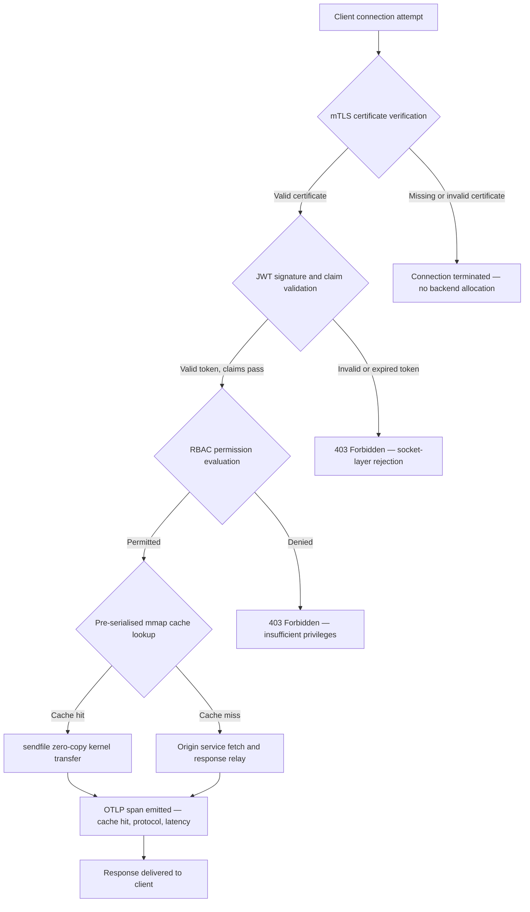

---

# Front Matter (YAML)

author: "contact@sebastienrousseau.com (Sebastien Rousseau)"
banner_alt: "Abstraktes Stadtpanorama aus Leiterplatten bei Nacht — visualisiert den Banking-Edge, wo Zero-Copy-Kernel-Transfers, mTLS-Handshakes und JWT-Validierung in einem einzigen statisch gelinkteten Binary zusammentreffen"
banner_height: "1597"
banner_width: "2584"
banner: "https://cloudcdn.pro/stocks/images/bit-cloud-GlqbGLCPnQ4.webp"
cdn: "https://cloudcdn.pro"
charset: "UTF-8"
cname: "sebastienrousseau.com"
copyright: "© Copyright 2025 - 2026 - Sebastien Rousseau. All rights reserved."
date: "June 20, 2026"
description: "http-handle ist ein statisch gelinktes Rust-Binary, das am Banking-Edge ohne Runtime-Abhängigkeiten 180.000 Anfragen pro Sekunde liefert – mit integrierter mTLS- und JWT-Validierung, ALPN-ausgehandeltem HTTP/2 und HTTP/3 sowie OTLP-Observability – und schließt damit die Sicherheits- und Resilienzbücken, die Nginx und Envoy hinterlassen."
format-detection: "telephone=no"
hreflang: "de"
icon: "https://cloudcdn.pro/clients/sebastienrousseau/v1/logos/sebastienrousseau.svg"
id: "https://sebastienrousseau.com/2026-06-20-http-handle-zero-dependency-edge-ingress-banking-rust-2026"
image_alt: "Schwarz-Weiß-Porträt von Sebastien Rousseau"
image_height: "162"
image_width: "162"
image: "https://cloudcdn.pro/stocks/images/sebastien-rousseau.png"
keywords: "http-handle, Rust Edge Ingress, abhängigkeitsfreier Proxy, Banking-Infrastruktur, mTLS JWT, sendfile Zero-Copy, ALPN HTTP3, DORA-Konformität, Basel III, OTLP-Observability, statisches Binary, ARM64 Banking, Zero-Trust Banking, schlanker Ingress, Rust Banking Security"
language: "de-DE"
last_reviewed: "2026-06-20"
layout: "report"
locale: "de_DE"
logo_alt: "Logo von Sebastien Rousseau"
logo_height: "44"
logo_width: "44"
logo: "https://cloudcdn.pro/clients/sebastienrousseau/v1/logos/sebastienrousseau.svg"
menu: ""
measurementID: "G-169G4ET5HQ"
name: "Sebastien Rousseau"
permalink: "https://sebastienrousseau.com/2026-06-20-http-handle-zero-dependency-edge-ingress-banking-rust-2026"
rating: "general"
referrer: "no-referrer"
robots: "index, follow"
schema: "FAQPage, Article"
seo_title: "http-handle: Abhängigkeitsfreier Rust-Ingress für Banking bei 180k req/s"
short_name: "sebastienrousseau"
subtitle: "Wie ein einzelnes statisch gelinktes Rust-Binary am Banking-Edge 180.000 Anfragen pro Sekunde mit mTLS, JWT und ALPN liefert – und was das für die DORA- und Basel-III-Konformität bedeutet."
tags: "http-handle, Rust, banking, edge-ingress, mTLS, JWT, ALPN, HTTP3, DORA, Basel-III, zero-copy, sendfile, ARM64, zero-trust, OTLP, observability, open-source, infrastructure"
theme-color: "0, 83, 191"
title: "http-handle: Hochleistungs-Edge-Ingress ohne Abhängigkeiten für Banking 2026"
url: "https://sebastienrousseau.com/2026-06-20-http-handle-zero-dependency-edge-ingress-banking-rust-2026"
viewport: "width=device-width, initial-scale=1, shrink-to-fit=no"

# RSS - The RSS feed front matter (YAML).
atom_link: "https://sebastienrousseau.com/2026-06-20-http-handle-zero-dependency-edge-ingress-banking-rust-2026/rss.xml"
category: "Technology"
docs: https://validator.w3.org/feed/docs/rss2.html
generator: "Static Site Generator (SSG) (version 0.0.40)"
item_description: "http-handle ist ein statisch gelinktes Rust-Binary, das am Banking-Edge ohne Runtime-Abhängigkeiten 180.000 Anfragen pro Sekunde liefert – mit integrierter mTLS- und JWT-Validierung, ALPN-ausgehandeltem HTTP/2 und HTTP/3 sowie OTLP-Observability – und schließt damit die Sicherheits- und Resilienzbücken, die Nginx und Envoy hinterlassen."
item_guid: "https://sebastienrousseau.com/2026-06-20-http-handle-zero-dependency-edge-ingress-banking-rust-2026/rss.xml"
item_link: "https://sebastienrousseau.com/2026-06-20-http-handle-zero-dependency-edge-ingress-banking-rust-2026/rss.xml"
item_pub_date: "Sat, 20 Jun 2026 07:07:07 +0000"
item_title: "http-handle: Hochleistungs-Edge-Ingress ohne Abhängigkeiten für Banking 2026"
last_build_date: "Sat, 20 Jun 2026 07:07:07 +0000"
managing_editor: "contact@sebastienrousseau.com (Sebastien Rousseau)"
pub_date: "Sat, 20 Jun 2026 07:07:07 +0000"
ttl: "60"
type: "article"
webmaster: "contact@sebastienrousseau.com"

# Apple - The Apple front matter (YAML).
apple_mobile_web_app_orientations: "portrait"
apple_touch_icon_sizes: "192x192"
apple-mobile-web-app-capable: "yes"
apple-mobile-web-app-status-bar-inset: "black"
apple-mobile-web-app-status-bar-style: "black-translucent"
apple-mobile-web-app-title: "Abhängigkeitsfreier Banking-Edge"
apple-touch-fullscreen: "yes"

# MS Application - The MS Application front matter (YAML).

msapplication-navbutton-color: "0, 83, 191"

# Twitter Card - The Twitter Card front matter (YAML).

twitter_card: "summary_large_image"
twitter_creator: "@wwdseb"
twitter_description: "http-handle ist ein statisch gelinktes Rust-Binary, das am Banking-Edge ohne Runtime-Abhängigkeiten 180.000 Anfragen pro Sekunde liefert, mit mTLS, JWT und OTLP-Observability."
twitter_image: "https://cloudcdn.pro/clients/sebastienrousseau/v1/logos/sebastienrousseau.svg"
twitter_image_alt: "Logo of Sebastien Rousseau"
twitter_site: "@wwdseb"
twitter_title: "http-handle: Abhängigkeitsfreier Rust-Ingress für Banking bei 180k req/s"
twitter_url: "https://sebastienrousseau.com/2026-06-20-http-handle-zero-dependency-edge-ingress-banking-rust-2026"

# Humans.txt - The Humans.txt front matter (YAML).
author_website: "https://sebastienrousseau.com"
author_twitter: "@wwdseb"
author_location: "London, UK"
thanks: "Thanks for reading!"
site_last_updated: "2026-06-20"
site_standards: "HTML5, CSS3, RSS, Atom, JSON, XML, YAML, Markdown, TOML"
site_components: "Kaishi, Kaishi Builder, Kaishi CLI, Kaishi Templates, Kaishi Themes"
site_software: "Static Site Generator, Rust"

---

# http-handle: Hochleistungs-Edge-Ingress ohne Abhängigkeiten für Banking 2026

<!-- lead-start -->
<aside class="post-lead" aria-label="Artikelzusammenfassung">

<strong>Kurzfassung.</strong> http-handle ist ein quelloffenes, statisch gelinktes Rust-Binary, das am Banking-Edge Nginx und Envoy ersetzt. Es liefert auf ARM64-Knoten 180.000 Anfragen pro Sekunde über Linux-<code>sendfile(2)</code>-Zero-Copy-Transfers, erzwingt mTLS- und JWT-Validierung auf der Netzwerk-Socket-Schicht bevor jeglicher Anwendungscode ausgeführt wird, handelt HTTP/2 und HTTP/3 automatisch per ALPN aus und emittiert nativ OpenTelemetry-Metriken – alles ohne Runtime-Abhängigkeiten jenseits von <code>libc</code>.

<strong>Wesentliche Erkenntnisse</strong>

<ul class="post-lead-takeaways">
  <li><strong>Das Problem schwerer Proxys.</strong> Nginx und Envoy tragen Abhängigkeitsbäume mit sich, die die CVE-Angriffsfläche vergrößern und die ICT-Risiko-Sanierungszyklen gemäß DORA erschweren.</li>
  <li><strong>Zero-Copy-Performance im Maßstab.</strong> Vorseralisierte mmap-Cache-Blöcke und <code>sendfile(2)</code>-Kernel-Transfers halten 180.000 req/s auf ARM64 bei einem Proxy-Overhead von unter einer Millisekunde aufrecht.</li>
  <li><strong>Sicherheit auf Socket-Ebene, nicht auf Anwendungsebene.</strong> mTLS-Client-Verifikation, JWT-Validierung und RBAC-Auswertung sind abgeschlossen, bevor dem Request eine Backend-Ressource zugeteilt wird.</li>
  <li><strong>Regulatorische Ausrichtung eingebaut.</strong> Die reduzierte Angriffsfläche und das auditierbare Single-Binary-Deployment adressieren direkt DORA-Artikel 5 und 6, das Betriebsrisiko nach Basel III und die SM&CR-Verantwortlichkeitsketten.</li>
</ul>

<strong>Weiterführende Lektüre:</strong> <a href="https://sebastienrousseau.com/2026-06-18-noyalib-safe-yaml-rust-ai-mcp-financial-infrastructure-2026">Warum YAML 2026 einen sichereren Rust-Stack für KI, MCP und Finanzinfrastruktur benötigt</a>, <a href="https://sebastienrousseau.com/2026-06-11-cloudcdn-open-source-blueprint-ai-native-edge-2026">CloudCDN: Ein Open-Source-Blueprint für den KI-nativen Edge 2026</a>, <a href="https://sebastienrousseau.com/2026-05-16-best-cloud-infrastructure-architecture-2026">Beste Cloud-Infrastrukturarchitektur für Banken und Finanzinstitute 2026</a>.

</aside>
<!-- lead-end -->

Der Banking-Edge hat ein Abhängigkeitsproblem. Jede Nginx- oder Envoy-Instanz, die Datenverkehr zwischen einem Client und einem Kernbankenservice leitet, trägt einen Abhängigkeitsbaum mit sich: OpenSSL-Builds, Lua-Module, gRPC-Bibliotheken und Container-Schichten – jedes davon ein potenzieller CVE, jedes erfordert einen dedizierten Patching-Zyklus, jedes fügt Latenzvariation hinzu, die die SLA-Messung erschwert. Unter dem [Digital Operational Resilience Act (DORA)](https://eur-lex.europa.eu/eli/reg/2022/2554/oj) ist diese Komplexität nun ebenso sehr eine regulatorische Haftung wie eine operative.

[http-handle](https://github.com/sebastienrousseau/http-handle) verfolgt einen anderen Ansatz. Es handelt sich um ein einzelnes, statisch gelinktes Rust-Binary ohne Runtime-Abhängigkeiten jenseits von `libc`. Es liefert 180.000 Anfragen pro Sekunde auf ARM64-Knoten, erzwingt gegenseitiges TLS und JWT-Authentifizierung auf der Netzwerk-Socket-Schicht und handelt HTTP/2 und HTTP/3 automatisch aus – alles in einem Deployment-Footprint unter 20 MB RAM.

## Schnelle Antwort

**Was ist http-handle in einem Satz?** http-handle ist ein quelloffenes, statisch gelinktes Rust-Binary, das am Banking-Edge schwere Proxy-Container ersetzt, 180.000 req/s auf ARM64 über Linux-`sendfile(2)`-Zero-Copy-Kernel-Transfers liefert, mTLS, JWT und RBAC auf der Socket-Schicht erzwingt bevor eine Backend-Ressource berührt wird, und native [OpenTelemetry](https://opentelemetry.io/)-Metriken emittiert – ohne Runtime-Bibliotheksabhängigkeiten jenseits von `libc`.

## Executive Summary

Banken betreiben Nginx und Envoy seit einem Jahrzehnt an ihrem Edge. Beide sind leistungsfähig; keines war für das regulatorische Umfeld von 2026 ausgelegt. Abhängigkeitsschwere Container-Images erzeugen CVE-Warteschlangen, die Compliance-Teams nicht schnell genug abarbeiten können, und jede Bibliotheks-Versionsaktualisierung birgt Regressionsrisiko. DORA-Artikel 5 und 6 fordern, dass ICT-Risiken durch Design verwaltet werden, nicht nach der Entdeckung gepatcht. Die Betriebsrisikorahmen von Basel III bestrafen Architekturen, bei denen Fehlerpunkte mit der Systemkomplexität zunehmen.

http-handle eliminiert das Abhängigkeitsproblem an der Quelle. Das Binary wird einmal, statisch kompiliert, ohne externe Bibliotheksanforderungen zur Laufzeit. Die Angriffsfläche schrumpft auf die Rust-Standardbibliothek plus `libc`. Die Sicherheitsdurchsetzung – mTLS-Zertifikatverifizierung, JWT-Claim-Validierung und rollenbasierte Zugriffskontrolle – erfolgt auf dem Netzwerk-Socket vor jeder Backend-Zuteilung, was den Zero-Trust-Perimeter auf seinen kleinstmöglichen Ausdruck reduziert. Die Performance folgt aus der Architektur: Vorseralisierte speichergemappte Cache-Blöcke in Kombination mit `sendfile(2)`-Kernel-Transfers entfernen Daten vollständig aus dem CPU-zu-Speicher-Kopierpfad und halten auf ARM64-Hardware 180.000 req/s aufrecht. Das Ergebnis ist eine Ingress-Schicht, die DORA-Resilienzanforderungen erfüllt, Basel-III-Betriebsrisikoreduktionsargumente unterstützt und leitenden IT-Führungskräften unter SM&CR eine prüfbare, einkomponentige Verantwortlichkeitskette für Edge-Infrastruktur bietet.

## Wesentliche Erkenntnisse

- **Kleinere Binaries, kleinere CVE-Warteschlangen.** Ein statisch gelinktes Single-Binary hat ein Paket zum Patchen, ein Release zur Validierung und ein Artefakt zur Prüfung. Nginx mit einem Standard-Modul-Set wird mit mehr als 30 Shared-Library-Abhängigkeiten ausgeliefert; jede trägt ihren eigenen Schwachstellen-Lebenszyklus.
- **Zero-Copy ist keine Optimierung – es ist eine Design-Anforderung.** Bei 180.000 req/s fügt jede Datenkopie im User-Space messbare Latenzvariation ein. `sendfile(2)` überträgt Dateideskriptor-Inhalte – oder eine speichergemappte Region – zu einem Netzwerk-Socket-Dateideskriptor vollständig im Kernel. In Kombination mit mmap-gepinnten Response-Cache-Blöcken berührt die CPU den Datenpfad für gecachte Antworten nie.
- **Der Sicherheitsperimeter gehört auf den Socket.** JWTs und mTLS-Zertifikate in Anwendungs-Middleware zu validieren bedeutet, dass das Backend bereits Threads und Speicher allokiert hat bevor die Anfrage abgelehnt wird. Socket-Layer-Validierung stellt sicher, dass nicht-authentifizierte Anfragen keinerlei Backend-Ressourcen verbrauchen.
- **OTLP schließt die Observability-Lücke.** Native OpenTelemetry-Integration bedeutet, dass jede Anfrage, jede Authentifizierungsentscheidung und jede Protokollaushandlung strukturierte Telemetrie ohne einen Sidecar-Agenten produziert. Bestehende Bank-Dashboards ingestieren OTLP-Traces direkt.

**Weiterführende Lektüre:** [Warum YAML 2026 einen sichereren Rust-Stack für KI, MCP und Finanzinfrastruktur benötigt](https://sebastienrousseau.com/2026-06-18-noyalib-safe-yaml-rust-ai-mcp-financial-infrastructure-2026/), [CloudCDN: Ein Open-Source-Blueprint für den KI-nativen Edge 2026](https://sebastienrousseau.com/2026-06-11-cloudcdn-open-source-blueprint-ai-native-edge-2026/), [Beste Cloud-Infrastrukturarchitektur für Banken und Finanzinstitute 2026](https://sebastienrousseau.com/2026-05-16-best-cloud-infrastructure-architecture-2026/).

## 01. Das Problem des schweren Proxys im Banking

Nginx und Envoy haben den Edge des modernen Internets aufgebaut. Beide sind konfigurierbar, kampferprobt und von großen Communities unterstützt. Sie sind auch Architekturentscheidungen, die vor der Existenz von DORA, vor den Basel-III-Betriebsrisikorahmen, die quantifizierbare Komplexitätsreduktion forderten, und vor ARM64-Cloud-Knoten getroffen wurden, die die Wirtschaftlichkeit von Hochdurchsatz-Computing veränderten.

Die praktische Konsequenz ist eine Lücke zwischen dem, was Banken brauchen, und dem, was schwere Proxy-Container liefern.

**Abhängigkeitsoberfläche.** Ein Standard-Envoy-Deployment zieht OpenSSL, Abseil, Protobuf, gRPC, Lua und Dutzende von sekundären Bibliotheken mit sich. Jede trägt einen unabhängigen CVE-Lebenszyklus. Wenn die National Vulnerability Database einen kritischen OpenSSL-Hinweis veröffentlicht, wird jede Envoy-Instanz im Bestand zur Compliance-Uhr: einschätzen, patchen, testen, erneut deployen und re-zertifizieren – über jede Umgebung, in der das Binary läuft. Gemäß DORA-Artikel 6 müssen Banken nachweisen, dass ICT-Risikomanagementprozesse verhältnismäßig, dokumentiert und verifizierbar sind. Ein Abhängigkeitsbaum mit mehreren Bibliotheken macht diesen Nachweis teuer zu pflegen.

**Speicher-Overhead.** Ein minimal konfigurierter Nginx-Worker-Prozess verbraucht 40–80 MB Resident-Memory unter moderater Last. Im großen Maßstab – Hunderte von Ingress-Knoten über Handelssysteme, Zahlungs-APIs und kundenseitige Portale – kumuliert dieser Overhead zu messbaren Infrastrukturkosten ohne entsprechenden Leistungsvorteil gegenüber einer gut durchdachten Single-Binary-Alternative.

**Patching-Geschwindigkeit.** Container-Image-Lieferketten führen mehrtagige Verzögerungen zwischen einer CVE-Veröffentlichung und einem validierten Patch ein, der die Produktion erreicht. Das Basis-Image muss neu gebaut, die Anwendungsschicht neu geschichtet, die vollständige Testmatrix neu ausgeführt und die Deployment-Pipeline neu ausgeführt werden. Für kritische Banksysteme, die unter DORA-Störungsmeldungsfristen operieren, ist dieser Zyklus ein strukturelles Risiko.

http-handle adressiert alle drei. Ein Binary. Eine CVE-Oberfläche. Ein Artefakt zum Patchen. Unter 20 MB RAM für einen produktiven Ingress-Knoten.

## 02. Die http-handle-Architekturperspektive 2026

Das Binary ist als fünf voneinander abhängige Schichten aufgebaut, von denen jede darauf ausgelegt ist, eine spezifische Risikokategorie zu eliminieren, die traditionelle Proxy-Architekturen ansammeln.

### Tabelle 1: http-handle-Architekturschichten und Risikominderung

| Schicht | Designentscheidung | Warum es wichtig ist | Risiko bei Fehlbehandlung |
| ---- | ---- | ---- | ---- |
| **Server-Kern** | Single Rust Binary, statisch gelinkt, keine Abhängigkeiten jenseits von `libc` | Ein Artefakt zum Patchen; eliminiert die Ausbreitung von Bibliotheks-CVEs im gesamten Bestand | Abhängigkeitsverwirrungsangriffe; Ansammlung von Bibliotheksschwachstellen |
| **Beschleunigungsmotor** | Vorseralisierte mmap-Cache-Blöcke und `sendfile(2)` Zero-Copy-Kernel-Transfers | 180.000 req/s auf ARM64 mit Proxy-Overhead unter einer Millisekunde; keine Daten betreten den User-Space für gecachte Antworten | Speicher-Mapping-Lecks; Kernel-Space-Engpässe bei Cache-Invalidierung |
| **Kryptografische Sicherheit** | Natives mTLS mit Hot-Reload-Zertifikatunterstützung und ALPN-Aushandlung | Gewährleistet Datenintegrität und Protokollkompatibilität; Zertifikatsrotation ohne Verbindungsabbrüche | Zertifikatsablauf verursacht Dienstausfälle; schwache Cipher-Suite-Standards |
| **Zugriffsrichtlinienebene** | Socket-Layer-JWT-Validierung und RBAC-Claim-Auswertung | Nicht-authentifizierte Anfragen verbrauchen keine Backend-Ressourcen; Zero Trust an der Kernel-Grenze durchgesetzt | JWT-Algorithmus-Verwirrungsangriffe; RBAC-Fehlkonfiguration gewährt überprivilegierte Zugriffe |
| **Observability** | Natives [OpenTelemetry (OTLP)](https://opentelemetry.io/docs/specs/otlp/)-Integration | Strukturierte Telemetrie ohne Sidecar-Agenten; direkte Ingestion in bestehende Bank-Monitoring-Bestände | Blinde Flecken bei Ausfällen; unvollständige Audit-Trails für DORA-Störungsmeldungen |

## 03. Wesentliche Performance- und Sicherheitssignale

Banken, die http-handle am Edge betreiben, müssen fünf quantifizierbare Signale instrumentieren, um DORA-operative Meldeanforderungen und interne SLA-Governance zu erfüllen.

### Tabelle 2: Operative Benchmarks und regulatorische Referenzen

| Signal | Benchmark | Regulatorische Referenz | Technische Implementierung |
| ---- | ---- | ---- | ---- |
| **Durchsatz** | ≥ 180.000 req/s auf ARM64-Knoten bei P99 ≤ 1 ms Proxy-Overhead | Basel-III-Betriebsrisiko – Systemkomplexitätsreduktion | `sendfile(2)` + mmap vorseralisierte Cache-Blöcke; keine User-Space-Datenkopie für Cache-Treffer |
| **Angriffsfläche** | Keine Runtime-Bibliotheksabhängigkeiten; ein binäres Artefakt pro Release | [DORA-Artikel 6](https://eur-lex.europa.eu/eli/reg/2022/2554/oj) – ICT-Risikomanagement durch Design | Statische Kompilierung mit `cargo build --release --target aarch64-unknown-linux-musl` |
| **Authentifizierungslatenz** | mTLS-Handshake + JWT-Validierung abgeschlossen vor dem ersten Byte der Backend-Antwort | [DORA-Artikel 5](https://eur-lex.europa.eu/eli/reg/2022/2554/oj) – ICT-Sicherheitsschutz | Socket-Layer-Abfangung; JWT-Claim-Auswertung in kernelangrenzenden Rust vor Backend-Routing |
| **Zertifikatverfügbarkeit** | Hot-Reload von mTLS-Zertifikaten mit null verlorenen Verbindungen während der Rotation | SM&CR-Senior-Management-Verantwortlichkeit für Edge-Verfügbarkeit | inotify-gesteuerter Zertifikat-Watcher; atomarer Dateideskriptor-Swap beim Reload |
| **Observability-Abdeckung** | 100 % der Anfragen produzieren OTLP-Spans mit Authentifizierungsergebnis, Protokollversion und Cache-Status | DORA-Artikel 17 – Störungserkennung und -meldung | Nativer OTLP-Exporter; kein Sidecar erforderlich; gRPC oder HTTP/Protobuf-Transport konfigurierbar |

## 04. Der Zero-Copy-Motor: mmap und sendfile(2)

Die Netzwerkperformance im Hochfrequenz-Banking – Echtzeitzahlungen, Marktdaten-APIs, Authentifizierungstoken-Services – ist durch eine Einschränkung mehr als jede andere begrenzt: die Kosten, Bytes vom Speicher auf den Netzwerk-Socket zu übertragen.

Konventionelle HTTP-Server lesen Dateiinhalte in einen User-Space-Puffer, schreiben diesen Puffer dann in den Socket. Diese Sequenz erfordert zwei Speicherkopien und zwei Kontextwechsel zwischen User-Space und Kernel-Space für jede Antwort. Bei 180.000 Anfragen pro Sekunde ist der kumulierte Overhead erheblich.

http-handle eliminiert beide Kopien.

**Speichergemappte Cache-Blöcke.** Wenn der Dienst startet, serialisiert er statischen Antwortinhalt in speichergemappte Regionen mit `mmap(2)`. Diese Regionen sind im Page-Cache des Kernels fixiert. Wenn eine Anfrage für eine gecachte Ressource eintrifft, ist die Antwort bereits in den Kernel-Speicher gemappt – kein Lesen von der Disk, keine Pufferzuteilung.

**`sendfile(2)`-Kernel-Transfer.** Der Linux-`sendfile(2)`-Systemaufruf überträgt Daten direkt von einem Dateideskriptor – oder einer speichergemappten Region – zu einem Netzwerk-Socket-Dateideskriptor, vollständig im Kernel. Kein Byte betritt den User-Space. Die Rolle der CPU reduziert sich auf das Ausstellen des Systemaufrufs und die Verarbeitung des Abschluss-Ereignisses. Auf ARM64-Knoten mit dieser Architektur hält http-handle unter anhaltender Last 180.000 req/s bei Proxy-Overhead unter einer Millisekunde.

Für Banken, die monatsabschließende Batch-Abstimmungen, intraday Liquiditätsmeldungen oder Echtzeit-Betrugs-Scoring-API-Verkehr betreiben, ist die technische Konsequenz direkt: weniger ARM64-Knoten pro Verkehrstier, niedrigere Infrastrukturkosten und kleineres DORA-Resilienzrisiko aus Kapazitätsengpässen.

## 05. Die mTLS- und JWT-Zugriffsrichtlinienebene

Im Banking ist Authentifizierung am Edge keine Funktion – sie ist eine regulatorische Anforderung. DORA schreibt vor, dass ICT-Sicherheitskontrollen verhältnismäßig, dokumentiert und verifizierbar sind. SM&CR legt persönliche Haftung für Infrastruktursicherheitsentscheidungen auf benannte leitende Manager. Die Frage ist nicht ob am Edge authentifiziert werden soll, sondern auf welcher Schicht.

http-handle erzwingt eine dreistufige Zero-Trust-Richtlinie bevor eine Backend-Ressource zugeteilt wird.

**Stufe 1: mTLS-Client-Zertifikatverifikation.** Während des TLS-Handshakes fordert und validiert http-handle das Client-Zertifikat gegen einen konfigurierbaren Trust-Store. Verbindungen ohne gültiges Zertifikat enden beim Handshake. Kein Anwendungs-Thread wird erzeugt, kein Speicherpool wird zugeteilt. Das Backend sieht die Anfrage nie.

**Stufe 2: JWT-Claim-Validierung.** Für Verbindungen, die mTLS passieren, extrahiert und validiert http-handle das JSON Web Token aus dem `Authorization`-Header auf der Socket-Schicht. Signaturverifikation, Ablaufprüfungen und Aussteller-Validierung erfolgen bevor die Anfrage die Routing-Schicht erreicht. Algorithmus-Verwirrungsangriffe – wo ein Server einen symmetrischen Algorithmus akzeptiert wenn ein asymmetrischer Schlüssel erwartet wird – werden durch explizite Algorithmus-Allow-Listing in der Konfiguration blockiert.

**Stufe 3: RBAC-Claim-Auswertung.** Validierte JWT-Claims werden einer In-Memory-Rollentabelle zugeordnet. Anfragen mit unzureichenden Berechtigungen erhalten eine 403-Antwort auf der Zugriffsrichtlinienebene. Der Backend-Dienst wird für nicht-autorisierten Datenverkehr nie aufgerufen.

Diese Sequenzierung ist operativ bedeutsam. Im traditionellen Modell – wo Authentifizierung in Anwendungs-Middleware läuft – kann ein Angreifer Backend-Thread-Pools mit nicht-authentifizierten Anfragen erschöpfen bevor eine einzige Ablehnung ausgestellt wird. Socket-Layer-Authentifizierung kollabiert diesen Angriffsvektor vollständig.

## 06. ALPN-Routing und die HTTP/3-Fallback-Kette

Banking-Datenverkehr trifft über unterschiedliche Netzwerkbedingungen ein: Unternehmensglassfaser für Handelstische, 5G für mobile Banking-Clients, Satellitenkonnektivität für Remote-Operationen und TLS-Inspection-Proxys in regulierten Umgebungen. Ein Einzel-Protokoll-Ingress schafft eine Kleinstmöglichen-Nenner-Einschränkung.

http-handle verwendet [Application-Layer Protocol Negotiation (ALPN)](https://www.rfc-editor.org/rfc/rfc7301), um für jede Verbindung automatisch das optimale Protokoll auszuwählen.

**HTTP/2** ist der Standard für Browser- und API-Datenverkehr über TCP. Gemultiplexte Streams über eine einzige Verbindung eliminieren das Head-of-Line-Blocking, das HTTP/1.1 bei gleichzeitigen Anfragenmustern einführt.

**HTTP/3 (QUIC)** aktiviert sich, wenn das Netzwerk UDP unterstützt und der Client `h3` in seiner ALPN-Erweiterung bewirbt. QUIC's unabhängiges Stream-Multiplexing und Verbindungsmigration machen es für mobile Banking-Clients in überlasteten Mobilfunknetzen erheblich besser, wo TCP-Verbindungen häufig abbrechen und neu verbinden.

**Graceful Fallback.** Wenn ALPN-Aushandlung scheitert – weil ein Zwischen-Proxy die Erweiterung entfernt oder ein Legacy-Client sie weglässt – fällt http-handle auf HTTP/1.1 zurück, während alle Sicherheits-Header, mTLS-Durchsetzung und JWT-Validierung erhalten bleiben. Keine Sicherheitseigenschaft degradiert beim Protokoll-Fallback.

## 07. Der Zero-Copy-Request-Lebenszyklus

Das folgende Diagramm zeigt den vollständigen Anfragepfad vom Client-Connect bis zur Antwortlieferung, einschließlich der Authentifizierungsgates und Observability-Emissionspunkte.

Der kritische Pfad für Cache-Treffer-Antworten durchläuft drei Sicherheitsgates und einen Systemaufruf. Für den Antwortkörper wird kein User-Space-Puffer zugeteilt. Der OTLP-Span erfasst das Authentifizierungsergebnis, die ALPN-ausgehandelte Protokollversion, den Cache-Status und die End-to-End-Latenz in einem einzigen strukturierten Datensatz.

## 08. Regulatorische Ausrichtung: DORA, Basel III und SM&CR

### DORA-Artikel 5 und 6 – ICT-Risikomanagement und Schutz

[DORA-Artikel 5](https://eur-lex.europa.eu/eli/reg/2022/2554/oj) verlangt, dass Finanzunternehmen ICT-Risikomanagement-Rahmenwerke pflegen. Artikel 6 verlangt, dass sie Schutz- und Präventivmaßnahmen umsetzen, die dem Risikoprofil ihrer ICT-Systeme proportional sind.

Ein statisch gelinktes Single-Binary erfüllt beide Anforderungen effizienter als ein Multi-Bibliotheks-Container-Stack. Die Angriffsfläche ist quantifizierbar – ein Artefakt, eine Abhängigkeit (`libc`), eine CVE-Fläche – und die Schutzmaßnahmen sind strukturell statt prozedural: mTLS und JWT-Durchsetzung können nicht durch Fehlkonfiguration umgangen werden, da sie auf der Socket-Schicht ausgeführt werden bevor irgendwelche konfigurierbare Anwendungslogik läuft.

### Basel III – Eigenkapitalanforderungen für das Betriebsrisiko

[Das Betriebsrisikorahmen von Basel III](https://www.bis.org/bcbs/basel3.htm) bindet regulatorische Eigenkapitalanforderungen an nachweisbare Risikoreduktion. Banken, die eine messbare Verringerung der Systemkomplexität und der ICT-Fehlerpunktanzahl dokumentieren können, haben ein quantifizierbares Argument für reduzierte Betriebsrisiko-Kapitalzuteilung. Eine Multi-Container-Proxy-Infrastruktur durch Single-Binary-Ingress-Knoten zu ersetzen ist genau die Art von Komplexitätsreduktion, die dieses Argument unterstützt – vorausgesetzt, das Engineering-Team kann die Bestätigungsdokumentation vorlegen.

Die auditierbaren Release-Artefakte von http-handle – reproduzierbare Builds, SBOM-kompatible Abhängigkeits-Manifeste und OTLP-basierte operative Logs – unterstützen die Dokumentationskette, die Basel-III-Kapitaldiskussionen erfordern.

### SM&CR – Verantwortlichkeit leitender Manager

Das [Senior Managers and Certification Regime (SM&CR)](https://www.fca.org.uk/firms/senior-managers-certification-regime) legt persönliche Haftung auf benannte leitende Manager für die ICT-Sicherheitslage von Systemen in ihrem Verantwortungsbereich. Ein Single-Binary-Ingress, der Zertifikate ohne Dienstunterbrechung hot-reloaded, strukturierte Audit-Logs über OTLP produziert und ein versionsgebundenes Artefakt pro Deployment hat, gibt dem benannten leitenden Manager eine verifizierbare, dokumentierbare Sicherheitskette. Ein Multi-Bibliotheks-Container-Stack tut das nicht.

## 09. Was das nach Rolle bedeutet

### Vorstand und Vorstandsvorsitzende

Die Optimierung von Regulierungskapital unter Basel-III-Betriebsrisikorahmen hängt von nachweisbarer Komplexitätsreduktion ab. Nginx oder Envoy durch ein einzelnes statisch gelinktes Binary zu ersetzen reduziert die ICT-Fehlerpunktanzahl auf eine Weise, die auditierbar und prudentiellen Regulatoren präsentierbar ist. Reduzierte CVE-Fläche unterstützt auch Neuverhandlungen von Cyber-Versicherungsprämien – Versicherer preisen auf nachweisbare Angriffsflächen-Metriken, und ein Single-Dependency-Ingress-Binary ist ein konkreter Datenpunkt.

### Chief Information Security Officers und Chief Risk Officers

DORA-Konformität erfordert, dass ICT-Schutzmaßnahmen verhältnismäßig und verifizierbar sind. Socket-Layer-mTLS und JWT-Durchsetzung bietet ein verifizierbares, nicht umgehbares Authentifizierungsgate am Edge. Hot-Reload-Zertifikatsrotation eliminiert das Service-Window-Risiko, das traditionelle Zertifikatsaktualisierungen tragen. Das Zero-Dependency-Kompilierungsmodell bedeutet, dass wenn ein kritischer `libc`-Hinweis veröffentlicht wird, der gesamte Bestand aus einem einzelnen Rust-Quell-Artefakt in Stunden statt Tagen neu gebaut, getestet und erneut deployt werden kann.

### Engineering und IT-Management

180.000 req/s auf einem Standard-ARM64-Knoten ändert die Infrastruktur-Sizing-Diskussion für Zahlungs-APIs und Authentifizierungsdienste. Native OTLP-Integration beseitigt den Bedarf an Prometheus-Exportern, Sidecar-Agenten oder benutzerdefinierten Log-Shippern. Das Kubernetes-Deployment-Modell ist ein Standard-Pod – unter 20 MB RAM, keine privilegierten Container-Berechtigungen, kein Host-Netzwerk-Zugriff. Zertifikat-Hot-Reload funktioniert ohne Kubernetes-Rolling-Restart-Overhead.

## FAQ

**Wie behandelt http-handle die Zertifikatsrotation unter Last?**
Das Binary überwacht Zertifikat-Dateipfade mit einem inotify-Watcher. Wenn neue Zertifikat- und Schlüsseldateien erkannt werden, führt es einen atomaren Swap des aktiven TLS-Kontexts durch – bestehende Verbindungen werden mit dem vorherigen Zertifikat abgeschlossen, während neue Verbindungen sofort das rotierte verwenden. Keine Verbindung wird unterbrochen. Kein Service-Window wird benötigt.

**Kann http-handle innerhalb eines Kubernetes-Clusters als Ingress-Controller laufen?**
Ja. Das Binary läuft als eigenständiger Pod mit einer Standard-Ingress-Service-Annotation. Ressourcenanforderungen liegen unter 20 MB RAM bei voller Leistung, ohne privilegierte Container-Berechtigungen und ohne Host-Netzwerk-Zugangsanforderung. Es kann auch als Sidecar in Service-Meshes laufen, wo mTLS-Durchsetzung auf der Sidecar-Schicht gegenüber zentralisierter Gateway-Authentifizierung bevorzugt wird.

**Was ist der messbare Latenz-Beitrag des Proxys selbst?**
Für Cache-Treffer-Antworten ist der Proxy-Overhead – vom Socket-Accept bis zum `sendfile(2)`-Abschluss – unter einer Millisekunde auf ARM64-Hardware. Für Cache-Miss-Antworten, die Upstream-Fetches erfordern, ist der Overhead die gleiche Unter-Millisekunde-Zahl plus die Origin-Antwortzeit. Der Proxy selbst fügt keine Queuing-Latenz hinzu, da die Authentifizierung synchron auf der Socket-Schicht ohne Thread-Pool-Zuteilung erfolgt bevor die Credential-Validierung abgeschlossen ist.

**Wie passt http-handle in eine Zero-Trust-Architektur neben einem bestehenden API-Gateway?**
http-handle operiert an der OSI-Layer-4/7-Grenze: Es erzwingt Transport-Layer-mTLS und validiert Application-Layer-JWTs vor dem Routing zu Upstream-Services. Es kann vor einem vollständigen API-Gateway sitzen – nicht-authentifizierten Datenverkehr absorbieren bevor er die teurere Verarbeitungsschicht des Gateways erreicht – oder das Gateway vollständig für Services ersetzen, deren Zugriffsrichtlinie vollständig in JWT-Claims ausdrückbar ist.

**Ist die Binary-Ausgabe für Supply-Chain-Audit-Zwecke reproduzierbar?**
Ja. Der Build ist mit einer gepinnten Rust-Toolchain-Version und gesperrtem `Cargo.lock` reproduzierbar. SBOM-Generierung über `cargo cyclonedx` produziert eine CycloneDX-kompatible Stückliste für jedes Release. Beide Artefakte sind in die interne Software-Kompositions-Analyse-Toolchain der Bank veröffentlichbar und erfüllen die DORA-Supply-Chain-Risiko-Dokumentationsanforderungen.

## Schlussfolgerung

Der Banking-Edge braucht keine weiteren Funktionen – er braucht weniger Komponenten, von denen jede weniger tut und es verifizierbar tut. http-handle reduziert die Ingress-Schicht auf ihr irreduzibles Minimum: ein einzelnes Rust-Binary, das Authentifizierung auf dem Socket erzwingt, Daten überträgt ohne sie zu kopieren, und alles was es tut in strukturierter Telemetrie meldet. Für Banken, die DORA-Compliance-Zeitplänen, Basel-III-Kapitaloptimierungsreviews und SM&CR-Verantwortlichkeitsanforderungen navigieren, ist diese Einfachheit keine Engineering-Präferenz – es ist ein regulatorisches Argument.

Der [http-handle-Quellcode](https://github.com/sebastienrousseau/http-handle) ist unter der dualen MIT- und Apache-2.0-Lizenz verfügbar.

---

*Referenzen*

Basel Committee on Banking Supervision (2011). *Basel III: A global regulatory framework for more resilient banks and banking systems*. Bank for International Settlements. Available at: [https://www.bis.org/publ/bcbs189.pdf](https://www.bis.org/publ/bcbs189.pdf)

European Parliament and Council (2022). Regulation (EU) 2022/2554 on digital operational resilience for the financial sector (DORA). Available at: [https://eur-lex.europa.eu/legal-content/EN/TXT/?uri=CELEX:32022R2554](https://eur-lex.europa.eu/legal-content/EN/TXT/?uri=CELEX:32022R2554)

Financial Conduct Authority (2015). *Senior Managers and Certification Regime (SM&CR)*. Available at: [https://www.fca.org.uk/firms/senior-managers-certification-regime](https://www.fca.org.uk/firms/senior-managers-certification-regime)

Internet Engineering Task Force (2014). *RFC 7301: Transport Layer Security (TLS) Application-Layer Protocol Negotiation Extension*. Available at: [https://www.rfc-editor.org/rfc/rfc7301](https://www.rfc-editor.org/rfc/rfc7301)

OpenTelemetry Authors (2024). *OpenTelemetry Protocol Specification (OTLP)*. Available at: [https://opentelemetry.io/docs/specs/otlp/](https://opentelemetry.io/docs/specs/otlp/)
