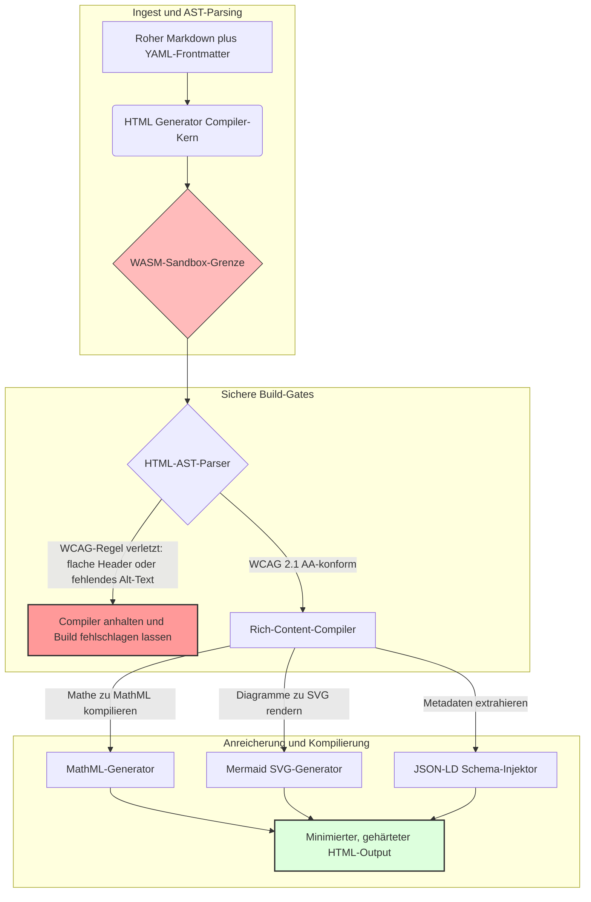

---

# Front Matter (YAML)

author: "contact@sebastienrousseau.com (Sebastien Rousseau)"
banner_alt: "Architektonische Geometrie unter strukturiertem Licht – Symbol für die Rolle des HTML Generators als compile-gesteuerter Markdown-zu-HTML-Pipeline für barrierefreie, SEO-optimierte und gesandboxte Publishing-Infrastruktur"
banner_height: "1597"
banner_width: "2584"
banner: "https://cloudcdn.pro/stocks/images/markus-winkler-IrRbSND5EUc-unsplash-1200.webp"
cdn: "https://cloudcdn.pro"
charset: "UTF-8"
cname: "sebastienrousseau.com"
copyright: "© Copyright 2025 - 2026 - Sebastien Rousseau. All rights reserved."
date: "June 20, 2026"
description: "HTML Generator ist eine Rust-Bibliothek, die Markdown in WCAG-konformes, SEO-optimiertes, JSON-LD-angereichertes HTML umwandelt – Barrierefreiheit als Code, MathML- und Mermaid-Unterstützung sowie WebAssembly-Sandbox für sicheres Enterprise-Publishing."
format-detection: "telephone=no"
hreflang: "de"
icon: "https://cloudcdn.pro/clients/sebastienrousseau/v1/logos/sebastienrousseau.svg"
id: "https://sebastienrousseau.com/2026-06-20-html-generator-accessible-seo-structured-markdown-rust-2026"
image_alt: "Schwarz-Weiß-Porträt von Sebastien Rousseau"
image_height: "162"
image_width: "162"
image: "https://cloudcdn.pro/stocks/images/sebastienrousseau.webp"
keywords: "html-generator, Rust Markdown zu HTML, Barrierefreiheit als Code, WCAG 2.1 AA, SEO-optimiertes HTML, JSON-LD, MathML, Mermaid, WebAssembly, EAA, DORA, ADA Title III, barrierefreies Publishing, Sandbox-Parsing, Open Source"
language: "de-DE"
last_reviewed: "2026-06-20"
layout: "report"
locale: "de_DE"
logo_alt: "Logo von Sebastien Rousseau"
logo_height: "44"
logo_width: "44"
logo: "https://cloudcdn.pro/clients/sebastienrousseau/v1/logos/sebastienrousseau.svg"
menu: ""
measurementID: "G-169G4ET5HQ"
name: "Sebastien Rousseau"
permalink: "https://sebastienrousseau.com/2026-06-20-html-generator-accessible-seo-structured-markdown-rust-2026"
rating: "general"
referrer: "no-referrer"
robots: "index, follow"
schema: "FAQPage, Article"
seo_title: "Barrierefreiheit als Code: Markdown zu AAA HTML mit Rust 2026"
short_name: "sebastienrousseau"
subtitle: "Unternehmens-Webpublishing, Produktdokumentation und Kundenportale werden von unlesbaren Textdateien zu hochstrukturierten, konformen und gesandboxten digitalen Assets."
tags: "html-generator, Rust, Markdown, Barrierefreiheit, WCAG, SEO, JSON-LD, MathML, Mermaid, WebAssembly, EAA, DORA, ADA, KI-Entdeckbarkeit, RAG, Open Source, Banking-Infrastruktur"
theme-color: "0, 83, 191"
title: "Markdown in barrierefreies, SEO-optimiertes, strukturiertes HTML mit Rust umwandeln – 2026"
url: "https://sebastienrousseau.com/2026-06-20-html-generator-accessible-seo-structured-markdown-rust-2026"
viewport: "width=device-width, initial-scale=1, shrink-to-fit=no"

# RSS - The RSS feed front matter (YAML).
atom_link: "https://sebastienrousseau.com/2026-06-20-html-generator-accessible-seo-structured-markdown-rust-2026/rss.xml"
category: "Technology"
docs: https://validator.w3.org/feed/docs/rss2.html
generator: "Static Site Generator (SSG) (version 0.0.40)"
item_description: "HTML Generator ist eine Rust-Bibliothek, die Markdown in WCAG-konformes, SEO-optimiertes, JSON-LD-angereichertes HTML umwandelt – Barrierefreiheit als Code, MathML- und Mermaid-Unterstützung sowie WebAssembly-Sandbox für sicheres Enterprise-Publishing."
item_guid: "https://sebastienrousseau.com/2026-06-20-html-generator-accessible-seo-structured-markdown-rust-2026/rss.xml"
item_link: "https://sebastienrousseau.com/2026-06-20-html-generator-accessible-seo-structured-markdown-rust-2026/rss.xml"
item_pub_date: "Sat, 20 Jun 2026 06:06:06 +0000"
item_title: "Markdown in barrierefreies, SEO-optimiertes, strukturiertes HTML mit Rust umwandeln – 2026"
last_build_date: "Sat, 20 Jun 2026 06:06:06 +0000"
managing_editor: "contact@sebastienrousseau.com (Sebastien Rousseau)"
pub_date: "Sat, 20 Jun 2026 06:06:06 +0000"
ttl: "60"
type: "article"
webmaster: "contact@sebastienrousseau.com"

# Apple - The Apple front matter (YAML).
apple_mobile_web_app_orientations: "portrait"
apple_touch_icon_sizes: "192x192"
apple-mobile-web-app-capable: "yes"
apple-mobile-web-app-status-bar-inset: "black"
apple-mobile-web-app-status-bar-style: "black-translucent"
apple-mobile-web-app-title: "Markdown zu AAA HTML mit Rust"
apple-touch-fullscreen: "yes"

# MS Application - The MS Application front matter (YAML).

msapplication-navbutton-color: "0, 83, 191"

# Twitter Card - The Twitter Card front matter (YAML).

twitter_card: "summary_large_image"
twitter_creator: "@wwdseb"
twitter_description: "HTML Generator ist eine Rust-Bibliothek, die Markdown in WCAG-konformes, SEO-optimiertes, JSON-LD-angereichertes HTML umwandelt – Barrierefreiheit als Code, MathML- und Mermaid-Unterstützung sowie WebAssembly-Sandbox für sicheres Enterprise-Publishing."
twitter_image: "https://cloudcdn.pro/clients/sebastienrousseau/v1/logos/sebastienrousseau.svg"
twitter_image_alt: "Logo von Sebastien Rousseau"
twitter_site: "@wwdseb"
twitter_title: "Barrierefreiheit als Code: Markdown zu AAA HTML mit Rust"
twitter_url: "https://sebastienrousseau.com/2026-06-20-html-generator-accessible-seo-structured-markdown-rust-2026"

# Humans.txt - The Humans.txt front matter (YAML).
author_website: "https://sebastienrousseau.com"
author_twitter: "@wwdseb"
author_location: "London, UK"
thanks: "Danke fürs Lesen!"
site_last_updated: "2026-06-20"
site_standards: "HTML5, CSS3, RSS, Atom, JSON, XML, YAML, Markdown, TOML"
site_components: "Kaishi, Kaishi Builder, Kaishi CLI, Kaishi Templates, Kaishi Themes"
site_software: "Static Site Generator, Rust"

---

# Markdown in barrierefreies, SEO-optimiertes, strukturiertes HTML mit Rust umwandeln – 2026

<!-- lead-start -->
<aside class="post-lead" aria-label="Artikelzusammenfassung">

<strong>Kurzfassung.</strong> HTML Generator ist ein reiner Rust-Markdown-zu-HTML-Compiler, der WCAG 2.1 AA zur Build-Zeit erzwingt, schema-konformes JSON-LD injiziert, MathML und Mermaid SVG nativ rendert und das Parsing innerhalb einer WebAssembly-Sandbox isoliert – damit wird Publishing zur compile-gesteuerten Steuerungsebene für Barrierefreiheit, SEO und ICT-Sicherheit.

<strong>Wesentliche Erkenntnisse</strong>

<ul class="post-lead-takeaways">
  <li><strong>Kurze Antwort.</strong> Was ist HTML Generator in einem Satz?</li>
  <li><strong>Zusammenfassung.</strong> Markdown-Rendering wirkt trivial; publishing-gerechtes HTML ist ein Compliance-Problem.</li>
  <li><strong>01. Warum ein auf Barrierefreiheit ausgelegter HTML-Compiler 2026 entscheidend ist.</strong> EAA und ADA Title III haben Barrierefreiheit von technischer Hygiene zur treuhänderischen Haftung gemacht.</li>
  <li><strong>02. Die Architekturperspektive von HTML Generator 2026.</strong> Eine mehrstufige, compile-gesteuerte Pipeline vom rohen Markdown bis zum gehärteten HTML-Output.</li>
</ul>

<strong>Weiterführende Lektüre:</strong> <a href="https://sebastienrousseau.com/2026-06-18-noyalib-safe-yaml-rust-ai-mcp-financial-infrastructure-2026">Warum YAML 2026 einen sichereren Rust-Stack für KI, MCP und Finanzinfrastruktur benötigt</a>, Ein sicherer Static Site Generator für das KI-Zeitalter 2026, <a href="https://sebastienrousseau.com/2026-06-11-cloudcdn-open-source-blueprint-ai-native-edge-2026">CloudCDN: Ein Open-Source-Blueprint für den KI-nativen Edge 2026</a>.

</aside>
<!-- lead-end -->

Im Jahr 2026 wird Web-Content ebenso stark von KI-Suchcrawlern, LLM-gestützten Suchmaschinen und Retrieval-Augmented Generation (RAG)-Pipelines verarbeitet wie von menschlichen Lesern. Flaches oder fehlerhaftes HTML beeinträchtigt die maschinelle Auffindbarkeit, während die Nichteinhaltung strenger globaler Vorschriften wie des [Europäischen Barrierefreiheitsgesetzes (EAA)](https://www.accessibility-act.eu/) und des [US ADA Title III](https://www.ada.gov/topics/title-iii/) heute eine eindeutige zivilrechtliche Haftung darstellt. [HTML Generator](https://github.com/sebastienrousseau/html-generator) ist eine hochleistungsfähige Rust-Bibliothek, die diese Lücken schließt – im Compiler, nicht durch nachgelagerte Patches im Betrieb.

## Kurze Antwort

**Was ist HTML Generator in einem Satz?** HTML Generator ist ein quelloffener, reiner Rust-Markdown-zu-HTML-Compiler, der [WCAG 2.1 AA](https://www.w3.org/TR/WCAG21/) zur Build-Zeit erzwingt, semantische Landmarks und ARIA-Attribute automatisch generiert, schema-konformes [JSON-LD](https://json-ld.org/)-Metadaten aus YAML-Frontmatter injiziert, Mermaid-Diagramme und mathematische Formeln in zugängliches SVG und MathML rendert und innerhalb einer [WebAssembly](https://webassembly.org/)-Sandbox läuft – damit wird Unternehmens-Publishing zur compile-gesteuerten, treuhänderisch belastbaren Steuerungsebene.

## Zusammenfassung

Markdown-Rendering wirkt trivial. Publishing-gerechtes HTML ist ein Compliance-Problem. Im Juni 2026 wird jeder Unternehmenskontaktpunkt – Investor-Relations-Portale, regulatorische Einreichungen, Kundendokumentation, API-Referenzen, Marketing-Estates – von Menschen und Maschinen gleichermaßen geparst. Zwei Druckverhältnisse treffen auf jeder Seite aufeinander: [EAA](https://www.accessibility-act.eu/) und [ADA Title III](https://www.ada.gov/topics/title-iii/) machen Barrierefreiheit zu einer Haftungsfrage auf Vorstandsebene, während KI-Ingest und RAG-Pipelines strukturierten, maschinenlesbaren Output belohnen. Standardbibliotheken für Markdown erzeugen flaches HTML, das beide Anforderungen verfehlt. HTML Generator behandelt Dokumentenerzeugung als compile-gesteuerte Pipeline: WCAG-Validierung ist ein Build-Fehler, JSON-LD stammt aus YAML-Frontmatter ohne manuelle Stempelung, MathML und Mermaid rendern barrierefrei, und die gesamte Engine wird als WebAssembly-Target ausgeliefert, sodass das Parsing nicht vertrauenswürdiger Dokumente vom Host isoliert bleibt.

## Wesentliche Erkenntnisse

- **Barrierefreiheit als Code ist die neue Baseline.** Die EAA schreibt Barrierefreiheit für digitale Dienste für Verbraucher vor. HTML Generator wertet den Dokumentenbaum zur Compile-Zeit aus, generiert automatisch semantische Landmarks und ARIA-Attribute – weniger nachträgliche Korrekturen im Betrieb, geringere Sanierungsbudgets, kein fehlendes Alt-Text, das in Produktion gelangt.
- **Strukturierte Daten für KI-Entdeckbarkeit.** Moderne Suche und RAG setzen auf maschinenlesbare Metadaten. Der Compiler parst YAML-Frontmatter und injiziert [Schema.org](https://schema.org/)-konformes JSON-LD direkt in den Document-Head – damit ist der Content vollständig interpretierbar für [Google Rich Results](https://developers.google.com/search/docs/appearance/structured-data/intro-structured-data), [Bing Webmaster](https://www.bing.com/webmasters) und LLM-gestützte Crawler.
- **Exzellenz bei technischen Inhalten.** Technisches Publishing ist kein flacher Text. HTML Generator kompiliert rohe Markdown-Mathe-Erweiterungen in zugängliches [MathML](https://www.w3.org/Math/) und rendert [Mermaid.js](https://mermaid.js.org/)-Diagramme zu responsivem SVG – beide Formate bewahren WCAG-konforme Struktur, statt auf opake Bilder zurückzufallen.
- **WebAssembly-Sandboxing.** Das Parsen nicht vertrauenswürdigen Markdowns ist ein Sicherheitsrisiko. Durch die Ausrichtung auf [WASM](https://webassembly.org/) läuft HTML Generator in einer isolierten Sandbox, die willkürliche Codeausführung verhindert und das Hostsystem schützt – und damit direkt [DORA Article 6](https://eur-lex.europa.eu/legal-content/EN/TXT/?uri=CELEX%3A32022R2554)-Pflichten zur ICT-Sicherheit erfüllt.
- **Treuhänderischer Schutz für Vorstände.** Technische Non-Compliance ist im Vorstandsbereich angekommen. Die Standardisierung auf einen compile-gesteuerten HTML-Engine schützt Direktoren und Führungskräfte vor persönlicher zivilrechtlicher und regulatorischer Haftung unter DORA, EAA und ADA Title III.

**Weiterführende Lektüre:** [Warum YAML 2026 einen sichereren Rust-Stack für KI, MCP und Finanzinfrastruktur benötigt](https://sebastienrousseau.com/2026-06-18-noyalib-safe-yaml-rust-ai-mcp-financial-infrastructure-2026/), Ein sicherer Static Site Generator für das KI-Zeitalter 2026, [CloudCDN: Ein Open-Source-Blueprint für den KI-nativen Edge 2026](https://sebastienrousseau.com/2026-06-11-cloudcdn-open-source-blueprint-ai-native-edge-2026/).

## 01. Warum ein auf Barrierefreiheit ausgelegter HTML-Compiler 2026 entscheidend ist

Unternehmens-Web-Estates, Dokumentationsbibliotheken und Produkt-Help-Center sind kritische digitale Kontaktpunkte. Sie stehen heute unter zwei intensiven, sich überschneidenden Druckverhältnissen.

Das erste ist **KI-Ingest und Entdeckbarkeit**. Inhalte werden zunehmend durch Large Language Models und Retrieval-Augmented Generation-Pipelines verarbeitet. Flaches oder fehlerhaftes HTML verwirrt das Crawler-Parsing und macht Unternehmensforschung und -dokumentation für moderne Suchparadigmen unsichtbar – darunter die [Google Search Generative Experience](https://blog.google/products/search/generative-ai-search/), [ChatGPT](https://chat.openai.com/)-Browsing und unternehmensweite RAG-Agenten.

Das zweite ist **strenge globale Barrierefreiheitsgesetzgebung**. Unter dem [Europäischen Barrierefreiheitsgesetz](https://www.accessibility-act.eu/) (EAA, vollständig anwendbar seit Juni 2025) und [US ADA Title III](https://www.ada.gov/topics/title-iii/) müssen Unternehmens-Publishing-Plattformen vollständige digitale Barrierefreiheit gewährleisten. Die Nichteinhaltung von [WCAG 2.1 AA](https://www.w3.org/TR/WCAG21/) ist kein technisches Versehen mehr; es ist eine zivilrechtliche und regulatorische Haftung, die mehrstellige Millionenvergleiche hervorgebracht hat.

[HTML Generator](https://github.com/sebastienrousseau/html-generator) adressiert beide Druckverhältnisse direkt. Es ist eine thread-sichere Rust-Bibliothek, die Markdown in barrierefreies, SEO-optimiertes, strukturiertes HTML transformiert. Indem Dokumentenerzeugung als compile-gesteuerte Pipeline behandelt wird, liefert die Engine eine hohe **Return on Resilience (RoR)** – Bilanzen werden vor Barrierefreiheitsklagen geschützt und die Maschinenlesbarkeit für KI-Entdeckbarkeit maximiert.

## 02. Die Architekturperspektive von HTML Generator 2026

Das Framework ist als sichere, mehrstufige Kompilierungs-Pipeline konzipiert, die rohen Markdown-Text in kryptografisch verifizierbares, hochbarriefreies statisches Asset umwandelt.

### Tabelle 1: Architekturschichten und Risikomitigation von HTML Generator

| Schicht | Designentscheidung | Warum es relevant ist | Risiko bei Fehlbehandlung |
| ---- | ---- | ---- | ---- |
| **Eingabeschicht** | Markdown plus YAML-Frontmatter-Parser | Trifft Autoren dort, wo sie sind; trennt Prosa von strukturierten Metadaten. | Inkonsistente Metadaten, defekte Sitemaps, Indexierungslücken. |
| **Strukturschicht** | Automatisches Inhaltsverzeichnis und semantische Landmarks mit ARIA-Tags | Erzeugt navigierbare, barrierefreie Dokumentenbäume durch Konstruktion. | Flaches HTML, das Screenreader bricht und WCAG verletzt. |
| **Rich-Content-Schicht** | Natives MathML- und Mermaid.js-SVG-Rendering | Kompiliert Formeln und Diagramme zu zugänglichem SVG und MathML. | Client-seitiger JS-Rendering-Lag und defekte Ausgabe für Assistierende Technologie. |
| **SEO- und Datenschicht** | Integrierte JSON-LD- und strukturierte Metadaten-Generierung | Injiziert [Schema.org](https://schema.org/)-konformes JSON-LD direkt in den Head. | Suchmaschinen und KI-Crawler lesen Autor, Kontext und Lizenz falsch. |
| **Laufzeitschicht** | Nativer Rust-Compiler mit WebAssembly-Target | Ermöglicht sichere, gesandboxte Ausführung auf Servern, Edge-Nodes und Browsern. | Willkürliche Codeausführung beim Parsing nicht vertrauenswürdigen Markdowns. |

## 03. Wesentliche Web-Sicherheits- und Barrierefreiheitssignale

Um zu verifizieren, dass öffentlich zugängliche Publishing-Assets modernen regulatorischen und Sicherheits-Audits standhalten, müssen leitende Technologiebeauftragte spezifische, quantifizierbare Metriken überwachen.

### Tabelle 2: Web-Sicherheits- und Barrierefreiheitssignale

| Signal | Metrik / operativer Benchmark | EAA / DORA / W3C-Referenz | Technische Implementierung |
| ---- | ---- | ---- | ---- |
| **Barrierefreiheitskonformität** | 100 % der kompilierten Seiten gegen WCAG 2.1 AA-Regeln validiert. | [EAA](https://www.accessibility-act.eu/) und [ADA Title III](https://www.ada.gov/topics/title-iii/) | Build-Zeit-HTML-Parser, der Bild-Alt-Tags und semantische Landmarks auswertet. |
| **WASM-Ausführungs-Sandbox** | 100 % der nicht vertrauenswürdigen Markdown-Eingaben in einer isolierten WebAssembly-Laufzeit kompiliert. | [DORA Article 6](https://eur-lex.europa.eu/legal-content/EN/TXT/?uri=CELEX%3A32022R2554) (ICT-Sicherheit) | Isolation der Parsing-Umgebung vom Host-Server. |
| **Strukturierte-Metadaten-Abdeckung** | 100 % der veröffentlichten Artikel mit validen, schema-konformen JSON-LD-Headern injiziert. | [Schema.org](https://schema.org/)-Spezifikationen | Automatisches Frontmatter-Parsing und Konvertierung zu JSON-LD-Objekten. |
| **Kompilierungs-Durchsatz** | Seiten-pro-Sekunde-Ziel über 10.000 auf Standard-Hardware. | Return on Resilience (RoR) | Hochparallelisierter Rust-AST-Compiler. |
| **Rich-Snippet-Verifikation** | Null Parsing-Fehler bei [Google Rich Results](https://search.google.com/test/rich-results) und [Schema validator](https://validator.schema.org/)-Läufen. | Google Search-Richtlinien | Strukturelle Validierung des generierten JSON-LD während der Build-Pipeline. |

## 04. Der Mythos des einfachen Markdown-Renderings

Eine verbreitete Fehlannahme unter Technologiemanagern lautet, dass die Konvertierung von Markdown zu HTML eine einfache Text-Ersetzungsübung ist. Viele Standardbibliotheken übersetzen Markdown-Formatierung in flaches, unstrukturiertes HTML. Die Ausgabe rendert für einen sehenden Nutzer im Browser korrekt – stellt aber eine Compliance-Falle dar.

Flaches HTML fehlt typischerweise in drei Bereichen.

1. **Korrekte Überschriftenhierarchien.** Standard-Markdown erzwingt keine Überschriftenreihenfolge. Der Sprung von `<h1>` zu `<h4>` verletzt WCAG 2.1 AA und bricht die Dokumentnavigation für Screenreader.
2. **Explizite Tabellensemantik.** Standard-Markdown-Tabellen werden selten mit den korrekten `<th>`-Scope- und `<tbody>`-Attributen gerendert, die für barrierefreies Parsing erforderlich sind.
3. **Maschinenlesbare Metadaten.** Standard-HTML fehlt die JSON-LD-Anbindung, auf die moderne KI-Suchplattformen und RAG-Ingest-Systeme angewiesen sind.

HTML Generator löst dies, indem Markdown in einen **Abstract Syntax Tree (AST)** geparst wird. Die Engine wertet die Dokumentstruktur aus, bevor HTML ausgegeben wird, validiert Überschriften-Nesting, injiziert geeignete ARIA-Attribute und stellt sicher, dass jedes Medien-Asset alternativen Text trägt – damit wird Barrierefreiheit von einem manuellen Audit zur garantierten Compile-Zeit-Invariante.

## 05. Eine Barrierefreiheit-als-Code-Build-Pipeline gestalten

Um zu verhindern, dass unzugängliche oder nicht indexierte Assets jemals in die öffentliche Bereitstellung gelangen, muss Barrierefreiheit ein striktes Compiler-Gate sein. Die folgende Pipeline zeigt, wie HTML Generator Markdown auswertet, WebAssembly-isolierte Validierung durchführt und gehärtetes, strukturiertes HTML ausgibt.

## 06. Das Vorstandshandbuch und treuhänderische Haftung

Moderne Barrierefreiheits- und Web-Sicherheits-Compliance sind nicht verhandelbare Vorstandsthemen. Die Unternehmensführung muss Publishing-Infrastruktur durch die Linse von Rechtsrisiko, Vermögenserhalt und regulatorischer Exponierung betrachten.

- **Das Europäische Barrierefreiheitsgesetz (EAA).** Legt direkte, rechtlich bindende Compliance-Mandate für öffentliche und private digitale Portale fest. Nicht-Compliance kann schwerwiegende Geldstrafen, zivilrechtliche Klagen und den sofortigen Rückzug des Assets vom EU-Markt nach sich ziehen. Durch die Integration von Barrierefreiheit als Code können Vorstände zertifizieren, dass nicht konformer Code nicht ausgeliefert werden kann – damit wird reaktive Sanierung in einen strukturellen Rechtsschutz umgewandelt.
- **DORA Article 6 (Sichere ICT-Umgebungen).** Legt strenge Regeln für die ICT-Umgebungssicherheit fest. Durch die Isolierung der Markdown-Kompilierung in einer WebAssembly-Sandbox stellen Organisationen sicher, dass das Parsing von Kundendokumenten oder Partner-Feeds Host-Server nicht willkürlicher Codeausführung aussetzt – kritische Banking-Portale werden geschützt.
- **Kostenreduktion bei Compliance-Audits.** Traditionelle Barrierefreiheits-Compliance stützt sich auf teure, retrospektive Audits nach der Bereitstellung – jährlich zig Tausende Euro pro Site. Die Implementierung von WCAG-Validierung als Compile-Zeit-Block eliminiert diese retrospektiven Kosten und verschiebt das Compliance-Budget von Abwehr zu Innovation.

## 07. Was das für verschiedene Bank- und Unternehmenstypen bedeutet

### Global Systemrelevante Banken (G-SIBs)

G-SIBs betreiben massive, mehrsprachige öffentliche Estates, die Tausende von Research-Papieren, regulatorischen Offenlegungen und Investor-Relations-Dokumenten über mehrere Jurisdiktionen hinweg veröffentlichen. Ihre Herausforderung sind Skalierung und mehrsprachige Parität. Das WebAssembly-Target und die hochdurchsatzfähige Rust-Engine von HTML Generator ermöglichen es, großvolumige, lokalisierte Research-Bibliotheken innerhalb von Sekunden zu aktualisieren, zu kompilieren und global bereitzustellen – ohne Rendering-Lag oder Barrierefreiheits-Regression.

### Transaktions- und Firmenkundenbanken

Für Transaktionsbanken sind Kundenportale, Dokumentations-Hubs und Entwickler-API-Guides kritische digitale Kontaktpunkte. Die Kompilierung dieser Assets durch HTML Generator bedeutet, dass kundenseitige Kanäle keine XSS-Exposition, keine Dependency-Hijack-Vektoren und keine Barrierefreiheitsdefizite aufweisen – damit werden institutionelles Vertrauen bewahrt und die Klagefläche reduziert.

### Regionalbanken und Fintechs

Regionalbanken und agile Fintechs konkurrieren auf digitalem Erlebnis ohne G-SIB-Engineering-Budgets. HTML Generator gibt diesen Teams eine Enterprise-grade-Publishing-Pipeline sofort einsatzbereit – kleinere Estates können barrierefreie, SEO-optimierte, gesandboxte Assets ausliefern, die der Prüfung durch Regulatoren und potenzielle Firmenkunden standhalten.

## 08. Die Publishing-Infrastruktur-Roadmap

Öffentlich zugängliche Unternehmens-Web-Estates sind eine Kernkomponente der operativen Resilienz. Sich auf langsame, dynamisch anfällige, datenbankgestützte Web-Engines zu verlassen – oder nicht signierte statische Assets – ist ein inakzeptables Geschäftsrisiko.

Um öffentliche digitale Kontaktpunkte zu sichern und Bilanzen vor Barrierefreiheitsklagen zu schützen, sollten leitende Technologie- und Sicherheitsverantwortliche eine klare Roadmap umsetzen.

1. **Übergang zu statischen Architekturen.** Legacy-dynamische CMS-Plattformen für Research-, Marketing- und Dokumentations-Estates auslaufen lassen. Inhalte in compile-gesteuerte Pipelines wie HTML Generator überführen.
2. **Barrierefreiheit zur Build-Zeit erzwingen.** Barrierefreiheit als Code implementieren. Kompilierungs-Pipelines bei jedem WCAG 2.1 AA-Verstoß automatisch fehlschlagen lassen.
3. **Parsing in WebAssembly isolieren.** Alle Dokument- und Content-Parsings in einer WASM-Laufzeit sandboxen, sodass nicht vertrauenswürdiger Input niemals Host-Systeme berührt.
4. **Reichhaltiges JSON-LD-Metadaten injizieren.** Sicherstellen, dass jedes veröffentlichte Asset schema-konformes JSON-LD-Header trägt, um KI-Entdeckbarkeit zu maximieren.

## 09. Häufig gestellte Fragen

**Wie erzwingt HTML Generator Barrierefreiheit?**

Es parst den generierten HTML-Abstract-Syntax-Tree zur Build-Zeit und wertet das Dokument gegen [WCAG 2.1 AA](https://www.w3.org/TR/WCAG21/)-Regeln aus. Bei einem Regelverstoß – fehlendes Alt-Attribut, Überschriftensprung, nicht beschriftetes Formularfeld – hält der Compiler den Build an und behandelt Barrierefreiheit als Compile-Zeit-Invariante statt als nachgelagerte Audit-Aufgabe.

**Warum ist WebAssembly-Isolierung wichtig?**

[WebAssembly](https://webassembly.org/) ermöglicht es der Markdown-Parsing-Engine, innerhalb einer isolierten Sandbox zu laufen, die vom Host-Server getrennt ist. Selbst wenn ein böswilliger Akteur ein präpariertes Markdown-Dokument hochlädt, das darauf ausgelegt ist, Parser-Schwachstellen auszunutzen, wird die Ausführung abgefangen – Host-Systeme werden geschützt und DORA Article 6-Pflichten zur ICT-Sicherheit werden erfüllt.

**Wie nützt JSON-LD der Suchentdeckbarkeit 2026?**

[JSON-LD](https://json-ld.org/) liefert strukturierte, maschinenlesbare Metadaten im Document-Head. [Google Rich Results](https://developers.google.com/search/docs/appearance/structured-data/intro-structured-data), Bing-Crawler und LLM-gestützte Suchagenten identifizieren Autor, Lizenz, Veröffentlichungsdatum und semantischen Kontext unmittelbar – sie umgehen die Mehrdeutigkeit von Standard-HTML und vergrößern die Sichtbarkeit in KI-gesteuerter Entdeckung.

**Für wen ist HTML Generator bestimmt?**

Statische-Site-Builder, Dokumentationsteams, Technische Redakteure, Rust-Entwickler und Platform-Engineers, die barrierefreiheitskritische oder regulatorseitige Estates ausliefern. Es ist auch eine geeignete Content-Processing-Schicht innerhalb größerer sicherer Publishing-Pipelines wie [Static Site Generator (SSG)](https://github.com/sebastienrousseau/static-site-generator).

## 10. Referenzen

- World Wide Web Consortium (W3C), 2024. [Web Content Accessibility Guidelines (WCAG) 2.1 ⧉](https://www.w3.org/TR/WCAG21/ "Web Content Accessibility Guidelines 2.1").
- Schema.org, 2026. [Schema.org Strukturierte-Daten-Spezifikationen ⧉](https://schema.org/ "Schema.org structured-data specifications").
- Europäisches Parlament und Rat der Europäischen Union, 2022. [Verordnung (EU) 2022/2554 über die digitale operationale Resilienz des Finanzsektors (DORA) ⧉](https://eur-lex.europa.eu/legal-content/EN/TXT/?uri=CELEX%3A32022R2554 "DORA-Verordnung").
- Europäische Kommission, 2025. [Europäisches Barrierefreiheitsgesetz ⧉](https://www.accessibility-act.eu/ "Europäisches Barrierefreiheitsgesetz").
- US Department of Justice, 2024. [ADA Title III ⧉](https://www.ada.gov/topics/title-iii/ "ADA Title III").
- WebAssembly Community Group, 2026. [WebAssembly-Spezifikation ⧉](https://webassembly.org/ "WebAssembly").
- GitHub, 2026. [HTML Generator-Repository ⧉](https://github.com/sebastienrousseau/html-generator "HTML Generator Open-Source-Repository").

<!-- enrich-start -->
<aside class="author-card" aria-label="Über den Autor"><strong class="author-card-name"><a href="/about/index.html">Sebastien Rousseau</a></strong>Leitender Banktechnologe, der über angewandte KI, Zahlungsinfrastruktur, tokenisiertes Geld, ISO 20022, Post-Quanten-Sicherheit, Cloud-native Finanzdienstleistungen, Open-Source-Infrastruktur und regulierte digitale Märkte schreibt.20+ Jahre bei HSBC Commercial &amp; Investment Bank, PayPal, Barclays, Shazam, AKQA, Virgin Group. <a href="/about/index.html">Vollständiges Profil</a> &middot; <a href="https://www.linkedin.com/in/sebastienrousseau/" rel="external noopener">LinkedIn</a> &middot; <a href="https://github.com/sebastienrousseau" rel="external noopener">GitHub</a></aside>

Zuletzt geprüft am <time datetime="2026-06-20">2026-06-20</time>.

<!-- enrich-end -->
