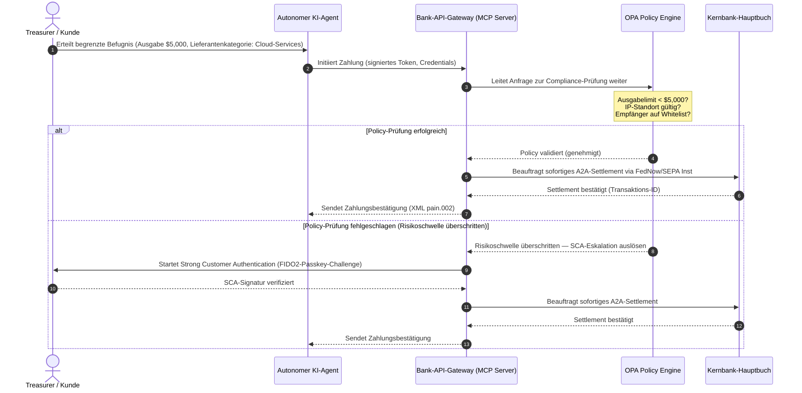

# Globaler Zahlungsverkehr-Outlook 2026: Betriebsmodell, Risiko und Ertrag in einer agentischen, unsichtbaren Echtzeitwelt

Der globale Zahlungsverkehrszyklus 2026 wird von drei konvergierenden Kräften geprägt — agentischer Handel, unsichtbare eingebettete Zahlungen und Echtzeit-Ausführung — aufsetzend auf einem tokenisierten einheitlichen Hauptbuch unter Project Agorá und einer fixen SWIFT-Umstellung auf strukturierte Adressen im November 2026.

<!-- lead-start -->
<aside class="post-lead" aria-label="Article summary">

<strong>TL;DR.</strong> Die Zahlungsverkehrslandschaft 2026 hat sich von der Nachrichtenmigration zu einem mehrdimensionalen Betriebsmodell verschoben, in dem Risiko und Ertrag durch Echtzeit-Ausführung bestimmt werden. Dieser Beitrag verdichtet die Ausblicke 2026 von J.P. Morgan, Global Payments, HSBC und der Payments Association zu einem G-SIB-Betriebsplan mit vier Säulen — modellinitiierter agentischer Handel, dauerhaft verfügbare Treasury-APIs, tokenisierte einheitliche Hauptbücher unter BIS Project Agorá und die SWIFT-Frist für strukturierte Adressen am 14./15. November 2026.

<strong>Kernaussagen</strong>

<ul class="post-lead-takeaways">
  <li><strong>Agentischer Handel eröffnet eine neue Front delegierter Haftung.</strong> Autonome KI-Agenten werden bis 2030 voraussichtlich jährlich Handelsvolumina von $3-$5 trillion vermitteln. Banken müssen die MCP-Gatekeeping-Logik, die SCA-Delegation unter PSD3/PSR und die Zuständigkeit für KYC/AML innerhalb mehragentiger Zahlungsketten definieren.</li>
  <li><strong>Dauerhaft verfügbare Liquidität ist nun operative und aufsichtliche Grundlinie.</strong> 24/7-Treasury-APIs und virtuelle Konten minimieren immobilisierte Liquidität und heben die Resilienzlatte. Für systemrelevante Echtzeit-Treasury-APIs wird die Fünf-Neuner-Verfügbarkeit (99,999 %) zunehmend zum internen Engineering-Ziel, das Banken sich setzen, um DORA-konforme Resilienz gegenüber Aufsichtsbehörden zu belegen. DORA selbst schreibt keine universelle Fünf-Neuner-Vorgabe vor; sie deckt IKT-Risikomanagement, Vorfallmeldung, Resilienztests, Drittparteienrisiko und Aufsicht über kritische IKT-Anbieter ab.</li>
  <li><strong>Tokenisierung ist zu regulierten einheitlichen Hauptbüchern aufgestiegen.</strong> Project Agorá ist der bislang größte öffentlich-private Rahmen für tokenisierte Geschäftsbankeinlagen und Zentralbankreserven. Banken benötigen einen fünfstufigen Tokenisierungsweg mit expliziter prudenzieller Behandlung.</li>
  <li><strong>Die Umstellung auf strukturierte Adressen am 14./15. November 2026 ist fix terminiert.</strong> Swift CBPR+ entfernt den unstrukturierten `<AdrLine>`-Block ab dem 14. November 2026; die EPC-SEPA-Regelwerke lassen unstrukturierte Adressen nur bis zum 15. November 2026 zu. Unstrukturierte Postanschriftsfelder in CBPR+- und SEPA-Nachrichten lösen sofortige Ablehnungen aus. Eine saubere Daten-Governance über Produkt-, Technik- und Compliance-Teams hinweg ist Pflicht.</li>
</ul>

<strong>Weiterführende Lektüre:</strong> <a href="https://sebastienrousseau.com/2026-06-23-iso-20022-pain001-programmable-liquidity-autonomic-treasury-2026">From Pain.001 to Programmable Liquidity: ISO 20022 as the Autonomic Nervous System of Treasury in 2026</a>, <a href="https://sebastienrousseau.com/2026-06-24-cross-border-iso-20022-open-finance-tokenised-deposits-treasury-2026">Cross-Border 2026: ISO 20022, Open Finance and Tokenised Deposits in Corporate Treasury</a>, <a href="https://sebastienrousseau.com/2026-06-25-quantum-dawn-cib-kyberlib-quantum-resilient-payments-stack-2026">Quantum Dawn for CIB: From KyberLib to a Quantum-Resilient Payments Stack</a>.

</aside>
<!-- lead-end -->

Für globale Transaction Banks ist der Zyklus 2026-2028 ein strukturelles Fenster. Moderne Zahlungsverkehrsinfrastruktur ist keine administrative Versorgungsleistung mehr — sie ist der Kern einer bankweiten Technologiestrategie. In G-SIBs und großen Regionalbanken sind Technologie, Regulierung und Kundenerwartung in einer einzigen operativen Ebene zusammengelaufen.

Drei Kräfte prägen diesen Zyklus, und jede berührt unmittelbar ein Vorstandsthema.

- **Agentischer Handel** — Kanalvertrieb, Produktdesign, Haftungszuordnung und Model Risk Management unter aufsichtlicher Beobachtung.
- **Unsichtbare Zahlungen** — Kundenerlebnis, mit Disintermediationsrisiko, sobald Banken ihr Hauptbuch nicht in die Frontends von Firmenkunden und Händlern einbetten.
- **Echtzeit-Ausführung** — Kapitalumschlag, mit Folgewirkungen auf Liquiditätssteuerung, Kreditrisiko, operative Resilienz und Betrugsabwehr.

Die finanziellen Einsätze sind erheblich. Betrug skaliert in Geschwindigkeit und Raffinesse; Regulierungsfristen sind hart; und Banken, die ihre Kernsysteme proaktiv modernisieren, erschließen substanzielle Provisionserträge. Die Kosten des Nichtstuns sind das Spiegelbild: sofortige Transaktionsablehnungen, operative Engpässe, aufsichtliche Sanktionen und ein rascher Verlust von Marktanteilen.

## Sicherheitsleiter — was datiert, was reguliert, was prognostiziert ist

Nicht jeder Punkt in diesem Report trägt dieselbe Sicherheit. Die Frage auf Vorstandsebene lautet, welche Deltas Fristen sind, welche aufsichtliche Erwartungen und welche noch Marktprognosen — denn die Antwort verändert das Budgetgespräch.

| Kategorie | Beispiele |
| --- | --- |
| **Harte Fristen** | Swift CBPR+ Umstellung auf strukturierte Adresse (14. November 2026); EPC SEPA Regelwerke (15. November 2026) |
| **Aufsichtliche Pflichten** | DORA IKT-Risiko + Resilienztests + Drittparteienaufsicht (EU); SCA-Delegation unter PSD3/PSR; MRM unter SR 11-7 + PRA SS1/23 |
| **Marktverschiebungen mit hoher Wahrscheinlichkeit** | Echtzeit-Treasury-APIs, KI-gestützte Betrugsabwehr, API-basierte Liquidität, Deepfake-getriebener biometrischer Betrug |
| **Strategische Optionen** | Tokenisierte Einlagen, einheitliche Hauptbücher unter Project Agorá, Korridore für agentischen Handel, kontinuierliches FX (Wire 365) |
| **Prognosen** | `$3-$5 trillion` jährlicher agentischer Handelsflüsse bis 2030 (McKinsey-Baseline) |

Behandeln Sie die oberen zwei Zeilen als Compliance-Fakten, die unabhängig davon eine Budgetlinie treiben, ob die Bank das Upside abschöpft oder nicht. Behandeln Sie die unteren zwei Zeilen als strategische Optionen — mit hoher Überzeugung hinsichtlich der Richtung, doch deren Ausführungs-Timing eine Vorstandsentscheidung ist und nicht der Kalendereintrag einer Aufsichtsbehörde.

## Die Konvergenz globaler Zahlungsverkehrsstimmen

Dieser Report verdichtet die Zahlungs- und Handels-Ausblicke 2026 von vier maßgeblichen Branchenstimmen — [J.P. Morgan Payments](https://www.jpmorgan.com/payments/newsroom/payments-outlook-2026-trends-report-released "J.P. Morgan Payments — Outlook 2026"), [Global Payments](https://investors.globalpayments.com/news-events/press-releases/detail/497/global-payments-releases-its-2026-commerce-and-payment "Global Payments — 2026 Commerce and Payment Trends Report"), HSBC und The Payments Association — und trianguliert sie mit der [G20-Roadmap zur Verbesserung grenzüberschreitender Zahlungen](https://www.fsb.org/2026/03/fsb-kicks-off-new-implementation-phase-to-enhance-cross-border-payments-through-public-private-partnership/ "FSB — cross-border payments implementation phase, March 2026").

Jede Organisation betrachtet das Ökosystem aus einem anderen Marktwinkel, doch ihre Befunde konvergieren auf drei Invarianten.

1. **Sofortige, API-getriebene Rails sind die Grundlinie.** Klassische Batch-Verarbeitungsmodelle werden für grenzüberschreitende und hochvolumige Flows verdrängt; die Transaktionsgeschwindigkeit dieser Segmente wird durch dauerhaft verfügbares Echtzeit-Messaging diktiert.
2. **KI ist Bedrohung und Verteidigung zugleich.** Generative Werkzeuge und Deepfakes skalieren Transaktionsbetrug und erzwingen mehrschichtige, machine-learning-basierte Echtzeit-Gegenmaßnahmen.
3. **Tokenisierung ist produktionsreife Infrastruktur.** Hauptbücher werden vereinheitlicht, um tokenisierte Geschäftsbankverbindlichkeiten und Großhandels-Zentralbankgeld zu tragen.

| Report | Primäre Zielgruppe | Schwerpunkt | Kernsäule | Implikation für Banken |
| --- | --- | --- | --- | --- |
| **J.P. Morgan Payments** | Corporate treasurers, G-SIBs | Real-time liquidity, fraud | APIs, AI biometrics | Rebuild liquidity, FX, and risk systems for continuous 365-day settlement. |
| **Global Payments** | Merchants, e-commerce | POS evolution, omnichannel | Agentic commerce, frictionless checkout | Build secure, API-gated merchant payment corridors for autonomous AI agents. |
| **HSBC Insights** | Multinational corporates | ERP integrations (SAP/Oracle), real-time cash | Treasury-as-a-Service, cash visibility | Monetise transactional API suites and embed real-time cash ledger reporting at source. |
| **The Payments Association** | Fintechs, payment institutions | Stablecoins, tokenisation, global regulation | Regulated digital assets, policy compliance | Prepare balance sheets for tokenised deposits and navigate PSD3/PSR liability structures. |

Die vier Ausblicke definieren faktisch den privatwirtschaftlichen Betriebsstapel, der auf der öffentlichen G20-Politikinfrastruktur aufsetzt — und übersetzen politische Absichten in konkrete Bankentscheidungen zu Liquidität, Tokenisierung, Daten und Betrugskontrolle.

## Säule 1 — Agentischer Handel und unsichtbare Zahlungen

Agentischer Handel beschreibt den Übergang vom menschengetriebenen Klick-Kauf zur autonomen, modellgetriebenen Transaktionsinitiierung. Die Branchenprognosen konvergieren bei $3-$5 trillion an jährlichen, durch autonome Agenten vermittelten Handelsvolumina bis 2030 — ein niedriger einstelliger Anteil am globalen Zahlungsvolumen, der ohne menschlichen „Kaufen"-Klick ausgeführt wird.

Das Einzel- und Geschäftshandelsökosystem weist eine entsprechende Lücke auf. Eine klare Mehrheit der Verbraucher erwartet inzwischen nahezu reibungslose Zahlungen, doch weniger als die Hälfte der Händler hat One-Click-Checkout oder API-zugängliche Produktkataloge priorisiert. KI-Agenten können klassische, mehrseitige Checkout-Strecken nicht navigieren, die für menschliche Augen entworfen wurden — sie benötigen strukturierte Maschine-zu-Maschine-API-Handshakes.

### Bankprioritäten und operative Auswirkungen

- **Verantwortung für KYC und AML.** Banken müssen festlegen, wer die Compliance-Pflicht innerhalb einer agentischen Transaktionskette trägt. Initiiert der persönliche KI-Agent eines Kunden eine Transaktion über den agentischen Checkout eines Händlers, muss die Bank prüfen, dass die zugrunde liegende delegierte Befugnis kryptografisch an den primären Kontoinhaber gebunden ist.
- **Neugestaltung von Haftung und Rückbuchung.** Kartennetzwerke und A2A-Rails wurden um menschliche Autorisierung herum entworfen. Tätigt ein KI-Agent einen fehlerhaften Einkauf — etwa fehlbeschafftes Industrieinventar wegen eines Datenparsing-Fehlers —, müssen Banken die Haftung klar zwischen Verbraucher, Agentenanbieter und Händler zuweisen.
- **Risikobewertung agentischer Flows.** Routing-Engines müssen agentische Zahlungen dynamisch risikobewerten und für nicht menschlich initiierte Transaktionen so lange höhere Reserve- oder Interchange-Sätze ansetzen, bis eine stabile Settlement-Historie vorliegt.

### Begrenzte Handlung und begrenzte Befugnis

Um „unbegrenztes Handeln" zu verhindern — etwa einen Beschaffungsagenten, der wegen eines Software-Glitches in eine endlose rekursive Einkaufsschleife läuft — müssen Banken **API-Gateways mit begrenzter Befugnis** ausrollen. Diese Gateways setzen Policy-Limits auf drei Ebenen durch.

1. **Gestaffelte Finanzlimits** — Agentenausgaben werden nach Transaktionsgröße, kumuliertem Tageswert und Händlerkategorie eingegrenzt.
2. **Kontextsensitive Schutzmechanismen** — Sekundärsignale (Tageszeit, IP-Geolokation, Transaktionsfrequenz) werden geprüft, bevor das Hauptbuch Mittel freigibt.
3. **Eskalation an den Menschen** — verpflichtende menschliche Autorisierung per Strong Customer Authentication (SCA) unter PSD3 / PSR, sobald eine Transaktion Risikoschwellen überschreitet.

Das nachstehende Mermaid-Sequenzdiagramm zeigt die Zielarchitektur, die viele Banken als begrenzt befugten agentischen Zahlungsablauf wiedererkennen werden.

### Das Model Context Protocol (MCP)

Um lokalisierte KI-Modelle an bankseitig gesteuerte Ausführungsschichten anzuschließen, standardisiert sich die Branche auf das [Model Context Protocol (MCP)](https://modelcontextprotocol.io "Model Context Protocol — open standard for LLM tool integration") — ein offenes Protokoll, das LLMs den Aufruf klar umrissener, prüfbarer Tools und APIs erlaubt, ohne Zugriff auf die Kernsysteme.

Werden Bank-APIs (Zahlungsinitiierung, Saldoabfrage, Vertragspartner-Verifizierung) hinter einem MCP-Server gekapselt, bleiben LLMs von Datenbanktabellen und Root-Steuerungen ferngehalten. Das Modell interagiert mit dem Hauptbuch ausschließlich über strukturierte, auditierte, rate-limitierte Endpunkte — die Sicherheit wird an der Grenze der agentischen Tool-Ausführung erzwungen, nicht im Modell selbst vergraben.

## Säule 2 — Treasury-Transformation und neu gedachte Liquidität

Die Geschwindigkeit des Transaction Banking 2026 wird durch den Übergang von Tagesendverarbeitung zu dauerhaft verfügbaren Echtzeit-Treasury-Operationen bestimmt. Multinationale Konzerne dulden kein gefangenes Geld mehr — Liquidität, die über Wochenenden oder Feiertage in lokalen Konten brachliegt, weil Settlement-Systeme geschlossen sind.

### Der ökonomische Fall für Echtzeit-Liquidität

J.P. Morgan und HSBC berichten übereinstimmend, dass Konzerne mit fortgeschrittenen Echtzeit-Cash- und -Datenfähigkeiten ihre Wettbewerber bei Ertragswachstum und Kapitaleffizienz materiell wahrscheinlicher übertreffen — vor allem durch die Reduktion gefangenen Geldes und die Optimierung von Working-Capital-Zyklen.

Um diesen Wert zu heben, bringen Banken **Treasury-as-a-Service (TaaS)-API-Produkte** auf den Markt, die Konzern-ERPs (SAP, Oracle) direkt an das Bank-Hauptbuch anbinden.

- **Echtzeit-Saldo-APIs** auf Basis des `camt.052`-Schemas — ersetzen dateibasierte Übertragungsprotokolle durch sofortige, ereignisgetriebene Cash-Positions-Berichte.
- **Bulk-Zahlungsinitiierungs-APIs** auf Basis von `pain.001` — direkte Straight-Through-Verarbeitung von Lieferantenzahlungsbündeln aus dem ERP-Hauptbuch.
- **Kontinuierliche FX-APIs** — Treasury-Engines fixieren in Echtzeit algorithmische Devisenkurse für grenzüberschreitendes Settlement und eliminieren das Overnight-Marktgap-Risiko.
- **Virtuelle-Konto-APIs** — Konzerne legen dynamisch tausende Subkonten an und lösen sie wieder auf, für automatisiertes Forderungs-Matching und Hauptbuchtrennung.

### Operative Resilienz und DORA

Dauerhaft verfügbare Liquidität bereitzustellen verändert das Risikoprofil der Bank. Für systemrelevante Echtzeit-Treasury-APIs wird die Fünf-Neuner-Verfügbarkeit (99,999 %) zunehmend zum internen Engineering-Ziel, das Banken sich setzen, um DORA-konforme Resilienz gegenüber Aufsichtsbehörden zu belegen. DORA selbst schreibt keine universelle Fünf-Neuner-Vorgabe vor; sie deckt IKT-Risikomanagement, Vorfallmeldung, Resilienztests, Drittparteienrisiko und Aufsicht über kritische IKT-Anbieter ab.

Unter dem [Digital Operational Resilience Act (DORA)](https://eur-lex.europa.eu/legal-content/EN/TXT/?uri=CELEX%3A32022R2554 "Regulation (EU) 2022/2554 — Digital Operational Resilience Act") ist das kein IT-KPI — es ist eine strikte aufsichtliche Anforderung. Die Aufsicht erwartet den Nachweis, dass die Echtzeit-Treasury-API-Fläche und das zugrunde liegende Hauptbuch schwere, aber plausible Cyberangriffe, Netzwerkausfälle und Hyperscaler-Störungen absorbieren können, ohne kritische Zahlungen zu unterbrechen oder die systemische Liquidität zu gefährden. Das verlangt geo-redundante, Active-Active-Multi-Cloud-Datenbankarchitekturen, Echtzeit-Bedrohungserkennung und automatischen Failover — sichtbar in der Change-Kostenlinie, nicht nur im Auditdossier.

### Kontinuierliche FX und grenzüberschreitende Innovation

Echtzeit-Treasury kann nicht in einer Einzelwährungsgrenze verharren. G-SIBs rollen kontinuierliche FX-Infrastruktur aus — die [Wire 365](https://www.jpmorgan.com/insights/payments/fx-cross-border/wire-365-global-clearing "J.P. Morgan — Wire 365 global clearing reinvented")-Plattform von J.P. Morgan verarbeitet grenzüberschreitende Zahlungen und FX-Konvertierungen an jedem Kalendertag, weit über die klassischen RTGS-Öffnungszeiten der Zentralbanken hinaus. Diese Schicht greift direkt in die in Säule 3 behandelten Systeme tokenisierter Einlagen und einheitlicher Hauptbücher.

## Säule 3 — Tokenisierte Einlagen und das einheitliche Hauptbuch

Tokenisierung ist von isolierten Proof-of-Concept-Piloten zu skalierter, bankreifer Geldinfrastruktur aufgerückt. Der Fokus hat sich von privaten Stablecoins und spekulativen Kryptowerten verlagert auf **tokenisierte Geschäftsbankeinlagen** und **Großhandels-Zentralbankgeld (wCBDC)**, die auf programmierbaren einheitlichen Hauptbüchern laufen.

Der Referenzrahmen ist [Project Agorá](https://www.bis.org/about/bisih/topics/fmis/agora.htm "BIS Project Agorá — tokenisation of wholesale cross-border payments") — eine große öffentlich-private Kooperation unter der Federführung von BIS und IIF, mit acht Zentralbanken (gemäß der BIS-Agorá-Seite, aktualisiert am 27. Mai 2026) und über 40 privaten Finanzinstituten. Das Projekt untersucht, wie tokenisierte Geschäftsbankeinlagen mit tokenisiertem Großhandels-CBDC auf einem gemeinsamen programmierbaren Hauptbuch zusammenspielen, um grenzüberschreitende Settlement-Reibung zu beseitigen, Compliance-Prüfungen zu koordinieren und 24/7-Atomarität in der Endgültigkeit zu erreichen.

### Der fünfstufige Tokenisierungsweg

Für G-SIBs und große Regionalbanken ist Tokenisierung ein schrittweiser Weg von interner Optimierung zur offenen Marktinteroperabilität.

1. **Interne Treasury-Liquidität** — Tokenisierung interner Konzern-Cash-Salden (z. B. JPM Coin oder vergleichbare hauseigene Bankhauptbücher), um sofortige, 24/7-grenzüberschreitende Transfers und Nettings über die Filialen der Bank zu ermöglichen.
2. **Begrenzte Mehrbankkorridore** — geschlossene, regulierte Konsortien (der Project Agorá-Sandkasten), um Interbank-Settlement und gemeinsamen Hauptbuchzustand über verschiedene Institute hinweg zu erproben.
3. **Kontinuierliche programmierbare FX** — Smart Contracts auf dem einheitlichen Hauptbuch führen sofortiges Payment-versus-Payment (PvP)-FX aus und beseitigen das Settlement-Risiko über Zeitzonen hinweg.
4. **Tokenisierte Real-World Assets (RWA)** — die tokenisierte Cash-Seite integriert sich mit tokenisierten Wertpapier-, Schuld- oder Handelshauptbüchern für sofortige Delivery-versus-Payment (DvP)-Endgültigkeit und reduziert Kapitalbindung von Tagen auf Millisekunden.
5. **Regulierte öffentliche/hybride Interoperabilität** — sichere Gateway-Wrapper erlauben institutionellen Liquiditäten den geschützten Austausch mit offenen öffentlichen Netzen.

### Prudenzielle und bilanzielle Implikationen

Tokenisiertes Geld muss sorgfältig durch prudenzielle Rahmenwerke geführt werden. Die Aufsicht betont: Eine tokenisierte Einlage muss wirtschaftlich einer klassischen Geschäftsbankeinlage gleichkommen — also eine unbesicherte Verbindlichkeit in der Bankbilanz mit identischem Einlagensicherungsschutz.

Operativ führen tokenisierte Einlagen Risiken ein, für deren Simulation klassische Liquiditätsstressmodelle nicht entworfen wurden. Smart Contracts vollziehen programmierbare Abhebungen in Geschwindigkeiten und Volumina, die Altannahmen nicht erfassen. Unter Basel III müssen Banken sicherstellen, dass die Risiko-Engine programmierbare Cash-Run-offs modellieren kann und das tokenisierte Hauptbuch im täglichen Liquiditätszyklus sauber mit klassischen RTGS-Systemen interoperiert.

### Stablecoins versus tokenisierte Einlagen — eine differenzierte Position

Private, vollständig gedeckte Stablecoins (USDC und andere) gewinnen weiterhin Marktanteile im grenzüberschreitenden Retail-Remittance und im dezentralen Handel, verfügen aber nicht über die Kreditschöpfungsfähigkeit und Settlement-Endgültigkeit des Geschäftsbankensystems.

Statt im Retail um die Rails zu konkurrieren, etablieren Transaction Banks Custody, emittieren eigene regulierte tokenisierte Verbindlichkeitsinstrumente und bauen sichere On-/Off-Ramp-Gateways. Firmenkunden erhalten Programmierflexibilität, während Kapital im regulierten Perimeter verbleibt.

### Fragen, die ein Aufsichtsrat zu tokenisiertem Geld stellen sollte

- **Teilnahme am einheitlichen Hauptbuch.** Wie sieht unsere aktive strategische Roadmap für die Teilnahme an öffentlich-privaten Großhandelsinitiativen wie Project Agorá aus?
- **Bilanz- und Risikomodellierung.** Haben unsere Risiko-Engines und Kapitaladäquanzrahmen das Stresstesting aktualisiert, um die Geschwindigkeit smart-contract-getriebener Token-Run-offs abzubilden?
- **Erstbewegersegmente bei Kunden.** Welche unserer Treasury- und Commercial-Banking-Kundensegmente würden unmittelbar von programmierbarem, tokenisiertem DvP/PvP-Settlement profitieren?

## Säule 4 — Strukturierte Daten und Betrugsabwehr

Infrastruktur-Compliance 2026 wird von der **Umstellung auf strukturierte Adressen am 14./15. November 2026** beherrscht, festgelegt durch das [SWIFT Standards Release (SR) 2026](https://www.swift.com/standards/iso-20022/removal-unstructured-address "SWIFT — Removal of unstructured address, November 2026"). Swift CBPR+ entfernt den unstrukturierten `<AdrLine>`-Block ab dem 14. November 2026; die EPC-SEPA-Regelwerke lassen unstrukturierte Adressen nur bis zum 15. November 2026 zu. Ab diesen Daten nehmen CBPR+- und SEPA-Zahlungsnetze keine vollständig unstrukturierten, freitextlichen Postanschriftsblöcke (`<AdrLine>`) in Zahlungsnachrichten mehr an. Jede grenzüberschreitende oder inländische Nachricht mit unstrukturierter Adresse, wo strukturierte Elemente erwartet werden, wird verzögert oder vom Netz abgewiesen.

Die meisten Institute kennen das Datum. Viele behandeln es als oberflächliche Mapping-Übung auf der Schnittstellenschicht. Die Realität ist eine tiefere Datenqualitäts- und Daten-Governance-Aufgabe. Um katastrophale Ablehnungsraten zu vermeiden, benötigen Zahlungsoperationen einen klaren funktionsübergreifenden Governance-Rahmen.

- **Produkt und Operations.** Datenerfassung an der Quelle. Kundenseitige Digitalportale, Onboarding-Oberflächen und Konzern-ERP-Eingabefelder müssen strukturierte Adressfelder (`<StrtNm>`, `<PstCd>`, `<TwnNm>`, `<Ctry>`) bereits am Punkt der Zahlungsinitiierung erzwingen.
- **Technologie.** Parsing, Mapping, Schemavalidierung. Validierungs-Engines blockieren Altdateien, bevor sie die SWIFT-Schnittstelle erreichen. Lokal betriebene Machine-Learning-Modelle parsen historische unstrukturierte Adressblöcke in XML-konforme Tags unter `<PstlAdr>`.
- **Compliance und Risiko.** Sanktionsprüfung, Transaktionsüberwachung und AML-Logik werden auf die strukturierten XML-Felder umgestellt — Falsch-Positiv-Raten und manuelle Recherchen sinken.

### Der Business Case für strukturierte Daten

Als reine Compliance-Kosten betrachtet, ist das Programm für strukturierte Daten teuer. Als Ertragsenabler verstanden, finanziert es sich selbst.

1. **Fortgeschrittene Kreditentscheidung.** Strukturierte Rechnungs-, Verwendungszweck- und Ultimate-Debtor-Daten erlauben es Banken, automatisierte, präzise Working-Capital-Finanzierungen und Supply-Chain-Factoring-Programme für Firmenkunden zu bauen.
2. **Automatisiertes Forderungsabgleich.** Die Offenlegung strukturierter Partei- und Rechnungs-Identifier trägt premium Cash-Reconciliation- und Virtual-Account-Pooling-Produkte und erzeugt neue Transaktionsgebührenerträge.
3. **Monetisierbare Transaktionsanalytik.** Banken paketieren und verkaufen granulare Echtzeit-Liquiditäts- und Kaufmusteranalyse-Dashboards an Konzern-CFOs und Treasurer.

### Eine geschichtete KI-Betrugsabwehr

Da Transaktionsgeschwindigkeiten in den Echtzeitbereich beschleunigen, sind auch Betrugstechniken skaliert. Der [Identity Fraud Report 2026 von Entrust](https://www.entrust.com/resources/reports/identity-fraud-report "Entrust 2026 Identity Fraud Report") nennt **eine von fünf biometrischen Betrugsversuchen** als Deepfake; eine frühere Entrust-Analyse setzte Deepfakes spezifisch bei **40 % der Video-Biometrie-Betrugsversuche** an.

Die Verteidigung ist ein **dreischichtiges KI-Betrugsmodell**.

1. **Identitätsschicht.** Biometrisch verifizierte [FIDO2](https://fidoalliance.org/fido2/ "FIDO Alliance — FIDO2 specification")-Passkeys, kryptografisch signierte Hardware-Gerätebindung und dezentrale Digital-ID-Wallets zur Absicherung des Zahlungszugriffs.
2. **Verhaltensschicht.** Kontinuierliche Verhaltensbiometrie — Navigationstempo, Tippkadenz, Geräteausrichtung — zur Erkennung automatisierter Bot-Ausführung oder Session-Hijack-Versuche.
3. **Transaktionsschicht.** Strukturierte Felder von ISO 20022 speisen Echtzeit-Machine-Learning-Risiko-Engines, die Transaktionsmetadaten mit konsortialer Netzintelligenz abgleichen, um verdächtige Transaktionen innerhalb von Millisekunden nach der Initiierung zu identifizieren.

Um aufsichtliche Anforderungen zu erfüllen, integrieren die Modelle der Transaktionsschicht strenge **Erklärbarkeits-Parameter** und werden unter einem dedizierten Model-Risk-Management (MRM)-Programm betrieben. Die Aufsicht erwartet, dass Banken die konkreten Datenpunkte und die algorithmische Logik benennen, die einen automatisierten Block oder Betrugsalarm ausgelöst haben — im Einklang mit [US Federal Reserve SR 11-7](https://www.federalreserve.gov/frrs/guidance/supervisory-guidance-on-model-risk-management.htm "US Federal Reserve — Supervisory Guidance on Model Risk Management, SR 11-7") und der [PRA SS1/23](https://www.bankofengland.co.uk/prudential-regulation/publication/2023/may/model-risk-management-principles-for-banks-ss "Bank of England PRA SS1/23 — Model Risk Management principles for banks") der Bank of England.

## Vorstandsagenda 2026-2028

Um über die vier Säulen hinweg zu liefern, sollten Geschäftsleitungsorgane von G-SIBs und Regionalbanken operative und technologische Investitionen entlang einer klaren Roadmap mit drei Horizonten organisieren.

### Horizont 1 — Sofortige Compliance und Härtung des Kerns (0-12 Monate)

- **Schwerpunkt.** Standardisierung der ISO 20022-Datenqualität und Absicherung grundlegender Echtzeit-Transaktionspfade.
- **Erfolgsindikator (KPI).** Null Ablehnungen wegen unstrukturierter Adressen bei SWIFT und SEPA nach der Umstellung am 14./15. November 2026.
- **Vorstandsverantwortung.** Chief Operating Officer / Leitung Zahlungsoperations.
- **Liefergegenstand.** No-Regrets-Maßnahme. Schemaupdates der Kerndatenbank und die SWIFT SR 2026-Validierungs-Engine.

### Horizont 2 — Automatisierung und agentische Schutzmaßnahmen (12-24 Monate)

- **Schwerpunkt.** API-Gateways mit begrenzter Befugnis für agentische Flows und durchgehende Betrugsabwehrarchitektur.
- **Erfolgsindikator (KPI).** 100 % der Maschine-zu-Maschine- und KI-initiierten API-Transaktionen werden über FIDO2-Hardware-Bindung und Policy-Engines mit begrenzter Befugnis validiert.
- **Vorstandsverantwortung.** Chief Information Officer / Chief Risk Officer.
- **Liefergegenstand.** No-Regrets-Maßnahme (Betrugsabwehr) plus strategische Option (agentischer Handel). MCP-Rollout und dreischichtige Betrugs-KI.

### Horizont 3 — Plattformtokenisierung und einheitliche Hauptbücher (24-36 Monate)

- **Schwerpunkt.** Überführung von Treasury-Aktiva in tokenisierte Einlagen und Teilnahme an gemeinsamen grenzüberschreitenden Hauptbüchern.
- **Erfolgsindikator (KPI).** Mindestens 15 % des hochvolumigen Treasury-Settlement-Volumens werden nativ über tokenisierte Einlageinstrumente oder Arrangements im einheitlichen Hauptbuch (z. B. Project Agorá-Korridore) verarbeitet.
- **Vorstandsverantwortung.** Group Treasurer / Leitung Transaction Banking.
- **Liefergegenstand.** Strategische Option. Programmierbare Hauptbuch-Infrastruktur, Smart-Contract-Liquiditätsregeln, DvP/PvP-Settlement-Adapter.

## Was am Montag früh zu tun ist — eine Sechs-Punkte-Checkliste für Banken

Die Drei-Horizonte-Roadmap ist der Zyklusplan. Die Checkliste unten ist das, was ein CIO, COO oder Leiter Transaction Banking bis Ende der nächsten Arbeitswoche auf dem Tisch haben kann, unabhängig davon, wie reif der Rest des Programms ist.

1. **Inventarisieren Sie das Exposure unstrukturierter Adressen** nach Kanal und Nachrichtentyp. Jede Altdatei-Route, jeder Alt-API-Endpunkt, jedes Konzern-ERP, das weiterhin freitextliche `<AdrLine>` ausgibt. Ergebnis: eine Zählung, ein Eigner und ein Remediationsdatum je Quelle.
2. **Etablieren Sie eine Risikotaxonomie für agentische Zahlungen.** Kategorisieren Sie nicht-menschlich initiierte Flows nach Initiierungsmethode (Konsumentenagent, Händleragent, Konzernbeschaffungsagent), Kontrahententyp und Rail. Ergebnis: eine einseitige Taxonomie und ein Ticket für die Routing-Engine.
3. **Definieren Sie Policy-Limits für delegierte Befugnisse bei KI-initiierten Zahlungen.** Gestaffelte Limits nach Ticketgröße, Händlerkategorie, Geografie. Ergebnis: ein Entwurf einer Policy-as-Code-Spezifikation, die die OPA-Engine durchsetzen kann.
4. **Kartieren Sie DORA-kritische Treasury-APIs und Drittparteienabhängigkeiten.** Welche APIs liegen im Inventar schwerwiegend-aber-plausibler Szenarien; auf welche Drittparteien sie sich stützen; welche Verträge bereits DORA Article 28 erfüllen. Ergebnis: eine Zeile im Register kritischer IKT-Drittparteien je API.
5. **Identifizieren Sie zwei Anwendungsfälle für tokenisierte Einlagen mit messbarem Treasury-Wert.** Internes filialübergreifendes Netting und ein einzelner Project-Agorá-naher Korridor sind die realistischen ersten beiden. Ergebnis: ein dimensionierter Business Case je Fall, mit Eigner und 90-Tage-Entscheidungsdatum.
6. **Schaffen Sie einen Model-Risk-Kontrollrahmen für Betrug und agentische Entscheidungsfindung.** Ordnen Sie jedes ML-Modell in den Betrugs- und agentischen Zahlungspfaden den Erwartungen von SR 11-7 / PRA SS1/23 zu: dokumentierter Zweck, Datenherkunft, Erklärbarkeit, Überwachung, Override-Pfad. Ergebnis: eine einseitige MRM-Kontrollmatrix je Modell.

Der Sinn der Liste ist nicht, dass irgendetwas davon neu wäre. Der Sinn ist, dass sie klein genug ist, um diese Woche zu starten, beobachtbar genug, um beim nächsten Vorstandsausschuss nachgehalten zu werden, und strukturell auf die vier Säulen ausgerichtet, sodass die frühe Arbeit das Programm speist statt mit ihm zu konkurrieren.

## FAQ

**Wird agentischer Handel bis 2030 wirklich $3-$5 trillion erreichen?**
Die McKinsey-Baseline weist auf $5 trillion an Umsätzen im agentischen Handel bis 2030 hin; unabhängige Prognosen liegen weitgehend zwischen $3 trillion und $5 trillion. Die Varianz hängt davon ab, wie aggressiv Händler maschinenlesbare Checkout-APIs ausliefern und wie schnell Banken Agenten unter SCA-Delegation transaktieren lassen — der Engpass liegt auf der Bank- und Händlerseite, nicht in der Agentenfähigkeit.

**Gilt die SWIFT-Umstellung vom 14./15. November 2026 auch für inländische SEPA-Flows?**
Ja. Die Anforderung an strukturierte Adressen gilt für CBPR+-Grenzüberschreitendes und für SEPA-Zahlungsnachrichten. Banken mit beiden Rails benötigen ein einziges kanonisches Adressschema vor der SWIFT-Schnittstelle, nicht zwei parallele Mappings.

**Ist eine tokenisierte Einlage dasselbe wie ein Stablecoin?**
Nein. Eine tokenisierte Einlage ist eine unbesicherte Verbindlichkeit in der Bilanz einer regulierten Bank, mit demselben Einlagensicherungsschutz wie eine klassische Einlage. Ein Stablecoin ist typischerweise ein vollständig gedecktes Instrument eines Nichtbankenemittenten ohne Kreditschöpfungsfähigkeit. Das Design von Project Agorá geht davon aus, dass tokenisierte Einlagen neben Großhandels-CBDC auf einem gemeinsamen programmierbaren Hauptbuch liegen; Stablecoins sind im Großhandels-Settlement-Bein nicht vorgesehen.

**Wie verhält sich Project Agorá zu bestehenden wCBDC-Piloten?**
Agorá ist der integrierende Rahmen. Nationale wCBDC-Experimente decken die Zentralbankgeld-Seite ab; Agorá bringt tokenisierte Geschäftsbankeinlagen auf dasselbe programmierbare Hauptbuch, sodass grenzüberschreitendes Settlement atomar über beide Geldarten erfolgt. Die acht teilnehmenden Zentralbanken (gemäß der BIS-Agorá-Seite, aktualisiert am 27. Mai 2026) und über 40 privaten Institute machen es zum bislang größten öffentlich-privaten Design-Boden für die tokenisierte Großhandelsgeldarchitektur.

**Wie sieht die DORA-Mindestposition für eine TaaS-API aus?**
Geo-redundanter Active-Active-Betrieb, dokumentierte schwere, aber plausible Cyber-Szenarien mit namentlich benannten Eignern unter SM&CR (UK) und ein getesteter Failover, der kritische Zahlungen nicht unterbricht. Ohne diese Grundlagen ist das TaaS-Produkt eher eine regulatorische Verbindlichkeit als eine Ertragslinie.

## Quellen

- Bank for International Settlements (BIS) Innovation Hub. (2026). *Project Agorá: exploring tokenisation of wholesale cross-border payments*. [BIS Project Agorá](https://www.bis.org/about/bisih/topics/fmis/agora.htm).
- Deutsche Bank. (2026). *Digital Money: a perspective on stablecoins, tokenised deposits and CBDCs*. [Deutsche Bank Flow](https://flow.db.com/publications/flow-white-papers-and-guides/digital-money-a-perspective-on-stablecoins-tokenised-deposits-and-cbdcs).
- European Parliament and Council. (2022). *Regulation (EU) 2022/2554 on Digital Operational Resilience (DORA)*. [DORA Regulation](https://eur-lex.europa.eu/legal-content/EN/TXT/?uri=CELEX%3A32022R2554).
- Financial Stability Board. (2026). *FSB kicks off new implementation phase to enhance cross-border payments*. [FSB statement](https://www.fsb.org/2026/03/fsb-kicks-off-new-implementation-phase-to-enhance-cross-border-payments-through-public-private-partnership/).
- Global Payments. (2025). *2026 Commerce and Payment Trends Report — press release*. [Global Payments press release](https://investors.globalpayments.com/news-events/press-releases/detail/497/global-payments-releases-its-2026-commerce-and-payment).
- J.P. Morgan Payments. (2026). *Payments Outlook 2026 Trends Report Released*. [J.P. Morgan Newsroom](https://www.jpmorgan.com/payments/newsroom/payments-outlook-2026-trends-report-released).
- J.P. Morgan Insights. (2026). *5 Payment Trends to Watch for in 2026*. [J.P. Morgan Trends](https://www.jpmorgan.com/insights/payments/trends-innovation/five-payment-trends-in-2026).
- J.P. Morgan FX & Cross-Border. (2026). *Wire 365: Global Clearing Reinvented*. [J.P. Morgan FX Wire 365](https://www.jpmorgan.com/insights/payments/fx-cross-border/wire-365-global-clearing).
- SWIFT. (2026). *ISO 20022 milestone for November 2026: unstructured addresses to be removed*. [SWIFT ISO 20022 Milestone](https://www.swift.com/news-events/news/iso-20022-milestone-november-2026-unstructured-addresses-be-removed).
- SWIFT Standards. (2026). *Removal of unstructured address*. [SWIFT Standards](https://www.swift.com/standards/iso-20022/removal-unstructured-address).
- Bank of England. (2023). *Supervisory Statement (SS1/23) — Model Risk Management principles for banks*. [Bank of England PRA SS1/23](https://www.bankofengland.co.uk/prudential-regulation/publication/2023/may/model-risk-management-principles-for-banks-ss).
- US Federal Reserve. (2011). *Supervisory Guidance on Model Risk Management (SR 11-7)*. [SR 11-7](https://www.federalreserve.gov/frrs/guidance/supervisory-guidance-on-model-risk-management.htm).
- McKinsey & Company. (2025). *McKinsey forecast: $5 trillion in agentic commerce sales by 2030* (via Digital Commerce 360). [McKinsey agentic forecast](https://www.digitalcommerce360.com/2025/10/20/mckinsey-forecast-5-trillion-agentic-commerce-sales-2030/).
- HSBC Business. (2026). *HSBC Business Insights*. [HSBC Insights](https://www.business.hsbc.com/en-gb/insights).
- Bright Defense. (2026). *Deepfake Statistics: A Growing Security Concern*. [Deepfake fraud statistics](https://www.brightdefense.com/resources/deepfake-statistics/).
- European Banking Authority. (2019). *Guidelines on outsourcing arrangements (EBA/GL/2019/02)*. [EBA Outsourcing Guidelines](https://www.eba.europa.eu/regulation-and-policy/internal-governance/guidelines-on-outsourcing-arrangements).

<!-- enrich-start -->
<aside class="author-card" aria-label="About the author"><strong class="author-card-name"><a href="/about/index.html">Sebastien Rousseau</a></strong>Senior banking technologist writing on applied AI, ISO 20022 migration, post-quantum cryptography for financial services, and the structural transformation of wholesale payments.20+ years across HSBC Commercial &amp; Investment Bank, PayPal, Barclays, Shazam, AKQA, Virgin Group. <a href="/about/index.html">Full profile</a> &middot; <a href="https://www.linkedin.com/in/sebastienrousseau/" rel="external noopener">LinkedIn</a> &middot; <a href="https://github.com/sebastienrousseau" rel="external noopener">GitHub</a></aside>

Last reviewed <time datetime="2026-06-25">2026-06-25</time>.

<!-- enrich-end -->
